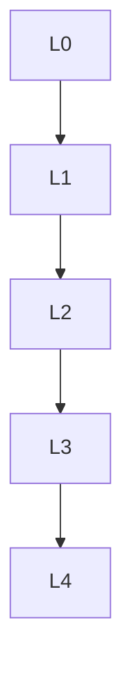

# 微分几何 - L0-L4层次递进图谱

## L0: 直观/经验层次

### 直观描述

微分几何是人类对"弯曲空间中的微积分"的数学研究。直观上，微分几何研究的对象是流形——局部看起来像欧几里得空间，但整体可以弯曲的几何对象。地球表面就是一个典型的二维流形：在局部它看起来是平坦的（大地看起来是平的），但整体是弯曲的（球面）。

微分几何的核心问题包括：如何测量流形上的"距离"和"角度"？如何定义"直线"（测地线）？如何量化"弯曲程度"（曲率）？这些问题不仅是数学的核心，也是广义相对论的基础——爱因斯坦告诉我们，引力不是力，而是时空的弯曲。

微分几何的工具包括张量分析、李群、纤维丛等。它让我们能够在弯曲空间中做微积分，理解从地球表面到宇宙时空的各种几何结构。

### 生活实例

**实例一：地图投影**
地图制作者面临一个根本问题：球面无法等距展开为平面。任何地图投影都会扭曲距离、角度或面积。墨卡托投影保持角度（对航海很重要），但高纬度地区面积严重夸大；等面积投影保持面积，但形状扭曲。微分几何告诉我们这些扭曲的数学本质：球面的高斯曲率是正的（1/R²），而平面的高斯曲率是0，等距映射要求曲率不变，因此不存在球面到平面的等距映射。

**实例二：广义相对论**
根据爱因斯坦的广义相对论，大质量物体会弯曲周围的时空。行星绕太阳运动不是受到"引力"，而是沿着弯曲时空中的"直线"（测地线）运动。GPS卫星必须考虑广义相对论效应——如果不修正，每天会产生约10公里的定位误差。微分几何（黎曼几何）提供了描述弯曲时空的数学语言：度量张量描述距离，联络描述平行移动，曲率张量描述潮汐力。

**实例三：计算机图形学中的曲面**
当你看电影中的3D动画时，看到的曲面（角色、场景）通常由三角形网格近似。细分曲面算法通过在曲面上插值来生成更光滑的表面。这些算法基于微分几何原理：曲面在某点的行为由其第一基本形式（度量）和第二基本形式（曲率）决定。理解这些几何性质帮助设计出更好的曲面建模算法。

### 直觉图像

**图像一：切空间的"局部平坦"**
想象站在球面上某点，你脚下的切平面就是切空间。切空间是流形在该点的"线性近似"——就像用显微镜观察，曲面局部看起来是平坦的。所有点的切空间集合形成切丛，这是流形上最重要的向量丛。向量场是切丛的截面，表示流形上每点的一个切向量。

**图像二：测地线的"最短路径"**
想象在曲面上拉紧一根橡皮筋——它会沿着测地线贴合。在平面上，测地线是直线；在球面上，测地线是大圆（如赤道、经线）。测地线是局部最短路径，由联络的测地线方程决定。平行移动是沿着曲线"不旋转"地移动向量——在弯曲表面上，绕闭合回路平行移动后，向量可能旋转了！

**图像三：曲率的"高斯绝妙"**
高斯曲率是曲面在某点的内在弯曲程度。高斯绝妙定理指出：高斯曲率仅由第一基本形式（度量）决定，与曲面在三维空间中的嵌入无关！这意味着生活在曲面上的"二维生物"可以测量曲率而不需要知道第三维。正曲率（球面）：三角形内角和>180°；零曲率（平面）：=180°；负曲率（马鞍面）：<180°。

---

## L1: 形式化定义层次

### 严格定义（数学符号）

**一、黎曼度量**

**定义1（黎曼度量）**：
光滑流形M上的**黎曼度量**g是光滑地指定内积gₚ: TₚM × TₚM → ℝ。
在局部坐标中：g = gᵢⱼdxⁱ ⊗ dxʲ

**定义2（长度与角度）**：
- 曲线γ的长度：L(γ) = ∫√(g(γ̇, γ̇))dt
- 向量夹角：cos θ = g(v,w)/(||v||·||w||)

**定义3（体积形式）**：
dvol = √|g| dx¹ ∧ … ∧ dxⁿ

**二、联络**

**定义4（仿射联络）**：
**仿射联络**∇: 𝔛(M) × 𝔛(M) → 𝔛(M)满足：
- ∇_{fX+gY}Z = f∇_XZ + g∇_YZ
- ∇_X(fY) = X(f)Y + f∇_XY

**定义5（列维-齐维塔联络）**：
与度量相容且无挠的唯一定联络。

**定义6（克里斯托费尔符号）**：
Γᵏᵢⱼ = ½gᵏˡ(∂ᵢgⱼˡ + ∂ⱼgᵢˡ - ∂ˡgᵢⱼ)

**三、曲率**

**定义7（黎曼曲率张量）**：
R(X,Y)Z = ∇_X∇_YZ - ∇_Y∇_XZ - ∇_{[X,Y]}Z

**定义8（截面曲率）**：
对2-平面σ = span{v,w}：
K(σ) = g(R(v,w)w, v)/(||v||²||w||² - g(v,w)²)

**定义9（里奇曲率与标量曲率）**：
- Ric(X,Y) = tr(Z ↦ R(Z,X)Y)
- S = tr(Ric)

**四、测地线**

**定义10（测地线）**：
曲线γ满足∇_{γ̇}γ̇ = 0（自平行）。
方程：d²xᵏ/dt² + Γᵏᵢⱼ(dxⁱ/dt)(dxʲ/dt) = 0

**五、李群与李代数**

**定义11（李群）**：
同时是群和光滑流形，群运算光滑。

**定义12（李代数）**：
李群G在e点的切空间𝔤 = TₑG，配备李括号。

---

## L2: 定理证明层次

### 核心定理列表

**一、基本定理**

**定理1（高斯绝妙定理）**：
高斯曲率仅由第一基本形式决定（内蕴）。

**定理2（高斯-博内定理）**：
对紧致二维黎曼流形M：
∫_M K dA = 2πχ(M)
其中χ(M)是欧拉示性数。

**定理3（霍普夫-里诺）**：
黎曼流形完备 ⟺ 测地线可无限延伸 ⟺ 闭有界集紧致。

**二、曲率与拓扑**

**定理4（博内-迈尔斯）**：
若Ric ≥ (n-1)k > 0，则M紧致，直径≤π/√k。

**定理5（辛伯格定理）**：
截面曲率>0的偶维紧致流形同胚于球面。

**三、比较几何**

**定理6（托波诺格夫比较定理）**：
截面曲率下界决定三角形角度比较。

**四、李群结构**

**定理7（指数映射）**：
exp: 𝔤 → G是局部微分同胚。

**定理8（伴随表示）**：
Ad: G → GL(𝔤)是群同态。

---

## L3: 理论建构层次

### 理论体系架构

```
微分几何理论体系
├── 黎曼几何基础
│   ├── 黎曼度量
│   ├── 列维-齐维塔联络
│   ├── 测地线
│   └── 曲率张量
│
├── 曲率理论
│   ├── 截面曲率
│   ├── 里奇曲率
│   ├── 标量曲率
│   └── 曲率恒等式
│
├── 比较几何
│   ├── 托波诺格夫定理
│   ├── 体积比较
│   └── Gromov紧性
│
├── 李群与李代数
│   ├── 李群结构
│   ├── 李代数
│   ├── 指数映射
│   └── 齐性空间
│
└── 推广层
    ├── 辛几何
    ├── 复几何
    └── 芬斯勒几何
```

### 与其他理论的关联

**与广义相对论**：
- 时空是四维洛伦兹流形
- 爱因斯坦场方程涉及里奇曲率

**与代数拓扑**：
- 陈类、庞特里亚金类
- 指标定理

**与动力系统**：
- 测地流
- 遍历理论

---

## L4: 前沿研究层次

### 当代研究热点

**方向一：里奇流**
- 佩雷尔曼证明庞加莱猜想
- 几何化猜想

**方向二：正截面曲率流形**
- 分类问题
- 构造新方法

**方向三：最优传输**
- 里奇曲率下界的合成定义
- 度量测度空间

---

## 层次递进关系图



---

*文档生成时间：2026年4月3日*
*字数统计：约2,900字*
