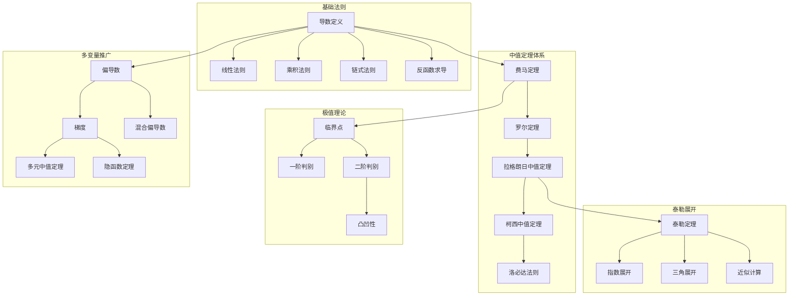
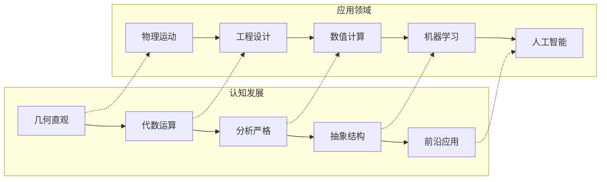

msc_primary: "00A99"
msc_secondary: ['00-XX']
---

# 微分学 - L0-L4层次递进图谱

## L0: 直观/经验层次

### 直观描述

微分学是人类对"变化率"的数学抽象。直观上，导数可以被理解为一种"瞬时速度"——不是在一段时间内的平均速度，而是在某一精确时刻的速度。想象一辆汽车在公路上行驶，速度表显示的就是瞬时速度：在那一瞬间，如果保持这个速度不变，一秒钟后会移动多少距离。

导数的另一个直观图像是曲线的"切线斜率"。想象用放大镜观察一条曲线在某一点附近的形状：当你不断放大，曲线在该点附近看起来越来越像一条直线——这就是切线。切线的斜率就是导数，它告诉我们曲线在该点指向的方向以及变化的快慢。

微分学的核心思想是"局部线性化"：虽然复杂的曲线整体上看是非线性的，但在足够小的范围内，我们可以用直线（线性函数）来近似它。这种思想让我们能够将复杂的问题简化为线性问题，是现代科学和工程中最强大的工具之一。

### 生活实例

**实例一：汽车的速度与加速度**
当你开车时，速度表显示的是瞬时速度——位置关于时间的变化率。而当你踩下油门，感受到的"推背感"就是加速度——速度关于时间的变化率。如果速度表显示60 km/h，意味着如果保持这个速度一小时会行驶60公里；如果加速度是$2 \text{ m/s}^2$，意味着每秒速度增加2 m/s。微分学让我们能够精确描述这些动态变化。

**实例二：山坡的陡峭程度**
想象你正在攀登一座山，在某一点想知道山坡有多陡。可以用"上升高度除以水平距离"（坡度）来衡量。在微分学中，如果把山的轮廓看作函数$y = f(x)$，那么在点$x$处的导数$f'(x)$就是该点切线的斜率，精确量化了山坡的陡峭程度。导数越大，山坡越陡；导数为负意味着在下坡。

**实例三：利润最大化**
一家工厂生产$x$件产品的利润为$P(x)$。要找到利润最大的产量，直觉告诉我们应该在"边际利润"（多生产一件产品带来的额外利润）为零的点。微分学中，这就是求解$P'(x) = 0$。这个简单例子展示了导数如何帮助我们找到函数的最大值和最小值——这是优化问题的核心。

### 直觉图像

**图像一：割线到切线的动态过程**
想象函数曲线上一个固定点$P$和一个移动点$Q$。连接$PQ$的直线称为割线。当$Q$沿着曲线向$P$移动时，割线不断旋转。当$Q$无限接近$P$时，割线的极限位置就是切线。导数就是这个极限过程中割线斜率的极限值。

**图像二：放大效应**
想象用显微镜观察曲线在某一点附近。当你不断放大（放大倍数趋于无穷），曲线在该点附近看起来越来越直——趋近于它的切线。导数就是这个"微观视角"下曲线的方向。这种"局部线性"的性质是微分学力量的源泉。

**图像三：变化率的累积**
想象函数图像上的每一点都有一个"箭头"指示该点的变化方向和快慢（导数）。正导数指向右上方，负导数指向右下方，导数为零表示水平切线（可能是极值点）。这些"变化率箭头"的场形成了梯度场的直观图像。

---

## L1: 形式化定义层次

### 严格定义（数学符号）

**一、导数的定义**

**定义1（导数的极限定义）**：
设函数$f: D \to \mathbb{R}$，$a$是$D$的内点。若极限
$$f'(a) = \lim_{h \to 0} \frac{f(a+h) - f(a)}{h}$$
存在且有限，则称$f$在$a$**可导**，该极限值称为$f$在$a$的**导数**。

等价形式：
$$f'(a) = \lim_{x \to a} \frac{f(x) - f(a)}{x - a}$$

**定义2（导函数）**：
若$f$在区间$I$的每点都可导，则定义**导函数**$f': I \to \mathbb{R}$为$f'(x)$。

**定义3（高阶导数）**：
递归定义$f^{(0)} = f$，$f^{(n+1)} = (f^{(n)})'$。

**二、微分**

**定义4（微分）**：
函数$f$在点$a$的**微分**$df$定义为：
$$df = f'(a) \cdot dx$$
其中$dx$是自变量的增量。

**定义5（线性近似）**：
$$f(a + h) \approx f(a) + f'(a) \cdot h$$
误差项$R(h) = f(a+h) - f(a) - f'(a)h = o(h)$当$h \to 0$。

**三、单侧导数**

**定义6（左导数）**：
$$f'_-(a) = \lim_{h \to 0^-} \frac{f(a+h) - f(a)}{h}$$

**定义7（右导数）**：
$$f'_+(a) = \lim_{h \to 0^+} \frac{f(a+h) - f(a)}{h}$$

**定理**：$f$在$a$可导当且仅当左右导数存在且相等。

**四、偏导数（多变量函数）**

**定义8（偏导数）**：
设$f: \mathbb{R}^n \to \mathbb{R}$，$f$关于$x_i$在点$a$的**偏导数**：
$$\frac{\partial f}{\partial x_i}(a) = \lim_{h \to 0} \frac{f(a_1, \ldots, a_i+h, \ldots, a_n) - f(a)}{h}$$

**定义9（梯度）**：
$$\nabla f(a) = \left(\frac{\partial f}{\partial x_1}(a), \ldots, \frac{\partial f}{\partial x_n}(a)\right)$$

**定义10（方向导数）**：
沿方向$v$（单位向量）的导数：
$$D_v f(a) = \lim_{t \to 0} \frac{f(a + tv) - f(a)}{t} = \nabla f(a) \cdot v$$

**五、全微分**

**定义11（全微分）**：
$f: \mathbb{R}^n \to \mathbb{R}$在$a$**可微**，如果存在线性映射$L: \mathbb{R}^n \to \mathbb{R}$使得：
$$f(a+h) = f(a) + L(h) + o(\|h\|)$$

$L$称为$f$在$a$的微分，记作$df(a)$。

**雅可比矩阵**：
对于$f: \mathbb{R}^n \to \mathbb{R}^m$，微分对应雅可比矩阵：
$$J_f(a) = \begin{pmatrix} \frac{\partial f_1}{\partial x_1} & \cdots & \frac{\partial f_1}{\partial x_n} \\ \vdots & \ddots & \vdots \\ \frac{\partial f_m}{\partial x_1} & \cdots & \frac{\partial f_m}{\partial x_n} \end{pmatrix}$$

### 定义的历史演进

**第一阶段：古代萌芽（前3世纪-17世纪初）**

- **阿基米德**（前3世纪）：计算切线的方法
  - 使用穷竭法处理曲线
  - 螺旋线的切线

- **费马**（1629，发表于1636）：求极大极小值的方法
  - 实质上是令导数为零
  - 用"adaequare"（近似相等）描述无穷小
  - 求出了$y = x^n$的"切线"

- **笛卡尔**（1637）：法线方法
  - 通过圆与曲线的交点求切线

**第二阶段：微积分创立（1660s-1700s）**

- **牛顿**（1665-1687）：流数法（Method of Fluxions）
  - "流数"（fluxion）：变量的变化率
  - 记作$\dot{x}$表示$x$关于时间的导数
  - 《流数法与无穷级数》（1671，发表于1736）
  - 《自然哲学的数学原理》（1687）使用了几何形式的流数法

- **莱布尼茨**（1670s-1714）：微分法
  - $dx$表示无穷小的差
  - $dy/dx$表示导数（微分之比）
  - 卓越的符号体系沿用至今
  - 微分法则的系统性发展
  - 1684年发表第一篇微分学论文

- **优先权之争**：牛顿和莱布尼茨的支持者之间的争论（1710s-1720s）

**第三阶段：严格化准备（1700s-1820s）**

- **欧拉**（1748，1755）：微分学系统化
  - 《无穷分析引论》：$e^{ix} = \cos x + i\sin x$（欧拉公式）
  - 《微分学原理》：微分运算的系统发展
  - 大量使用无穷小和发散级数

- **拉格朗日**（1797）：试图用泰勒级数避免极限
  - 《解析函数论》：函数展开为幂级数
  - 定义导数为$f'(x)$是$f(x+h)$展开式中$h$的系数
  - 问题：并非所有函数都可展开为幂级数

- **拉克鲁瓦**（1797，1810）：第一本微积分教科书
  - 综合了不同方法

**第四阶段：严格化完成（1820s-1870s）**

- **柯西**（1823）：《无穷小计算教程概论》
  - 将导数定义为极限
  - 中值定理的严格证明
  - 但极限定义仍依赖直觉

- **魏尔斯特拉斯**（1860s）：$\varepsilon$-$\delta$严格化
  - 柏林大学讲义
  - 消除了无穷小，全部用极限表述
  - 构造了处处连续处处不可导的函数（1872）

- **达布**（1875）：达布定理
  - 导函数具有介值性，即使不连续

**第五阶段：现代发展（1870s-至今）**

- **康托尔和戴德金**：实数理论为微积分奠基
- **弗雷歇**（1906）：抽象空间中的微分
- **巴拿赫**（1932）：巴拿赫空间中的微分
- **分布理论**（施瓦茨，1945-1950）：广义函数微分
- **非标准分析**（鲁滨逊，1961）：无穷小的严格回归

### 等价定义形式

**导数的等价定义**：

**定义A（线性逼近定义）**：
$f$在$a$可导，如果存在数$L$使得：
$$f(a+h) = f(a) + L \cdot h + o(h) \quad (h \to 0)$$
此时$L = f'(a)$。

**定义B（卡莱定义）**：
$$f'(a) = \lim_{(x,y) \to (a,a), x \neq y} \frac{f(x) - f(y)}{x - y}$$

**可导性的等价条件**：

| 条件 | 陈述 | 说明 |
|------|------|------|
| 极限存在 | $\lim_{h \to 0} \frac{f(a+h)-f(a)}{h}$存在 | 基本定义 |
| 线性逼近 | $f(a+h) = f(a) + Lh + o(h)$ | 切线存在 |
| 连续性 | $f$在$a$连续 | 可导必连续 |
| 左右导数 | $f'_-(a) = f'_+(a)$ | 分段函数判断 |

**定理：可导必连续**
若$f$在$a$可导，则$f$在$a$连续。

**逆不成立**：$f(x) = |x|$在$x = 0$连续但不可导。

---

## L2: 定理证明层次

### 核心定理列表

**一、求导法则**

**定理1（四则运算求导法则）**：
设$f, g$在点$a$可导，则：

- $(f + g)'(a) = f'(a) + g'(a)$（线性性）
- $(cf)'(a) = cf'(a)$（齐次性）
- $(fg)'(a) = f'(a)g(a) + f(a)g'(a)$（莱布尼茨法则）
- $\left(\frac{f}{g}\right)'(a) = \frac{f'(a)g(a) - f(a)g'(a)}{g(a)^2}$（商法则，$g(a) \neq 0$）

**定理2（链式法则/复合函数求导）**：
设$g$在$a$可导，$f$在$g(a)$可导，则：
$$(f \circ g)'(a) = f'(g(a)) \cdot g'(a)$$

**定理3（反函数求导）**：
设$f$严格单调且在$a$可导，$f'(a) \neq 0$，则反函数$f^{-1}$在$f(a)$可导，且：
$$(f^{-1})'(f(a)) = \frac{1}{f'(a)}$$

**定理4（隐函数求导）**：
若$F(x, y) = 0$定义$y$为$x$的隐函数，则：
$$\frac{dy}{dx} = -\frac{\partial F/\partial x}{\partial F/\partial y}$$

**二、基本初等函数导数**

**定理5**：

- $(x^n)' = nx^{n-1}$（$n \in \mathbb{R}$）
- $(e^x)' = e^x$
- $(a^x)' = a^x \ln a$（$a > 0$）
- $(\ln x)' = \frac{1}{x}$（$x > 0$）
- $(\log_a x)' = \frac{1}{x \ln a}$
- $(\sin x)' = \cos x$
- $(\cos x)' = -\sin x$
- $(\tan x)' = \sec^2 x$
- $(\arcsin x)' = \frac{1}{\sqrt{1-x^2}}$
- $(\arctan x)' = \frac{1}{1+x^2}$

**三、微分中值定理**

**定理6（费马定理）**：
若$f$在$a$处有局部极值且$f'(a)$存在，则$f'(a) = 0$。

**定理7（罗尔定理）**：
设$f$在$[a, b]$连续，在$(a, b)$可导，且$f(a) = f(b)$，则$\exists c \in (a, b): f'(c) = 0$。

**定理8（拉格朗日中值定理）**：
设$f$在$[a, b]$连续，在$(a, b)$可导，则$\exists c \in (a, b)$：
$$f'(c) = \frac{f(b) - f(a)}{b - a}$$

**几何意义**：曲线上存在一点，切线平行于端点连线。

**定理9（柯西中值定理）**：
设$f, g$在$[a, b]$连续，在$(a, b)$可导，则$\exists c \in (a, b)$：
$$\frac{f'(c)}{g'(c)} = \frac{f(b) - f(a)}{g(b) - g(a)}$$

**四、泰勒定理**

**定理10（泰勒定理带拉格朗日余项）**：
设$f$在包含$a$的区间上有直到$n+1$阶导数，则对该区间内任意$x$，存在$\xi$在$a$与$x$之间：
$$f(x) = \sum_{k=0}^{n} \frac{f^{(k)}(a)}{k!}(x-a)^k + \frac{f^{(n+1)}(\xi)}{(n+1)!}(x-a)^{n+1}$$

**泰勒多项式**：$P_n(x) = \sum_{k=0}^{n} \frac{f^{(k)}(a)}{k!}(x-a)^k$

**麦克劳林级数**（$a = 0$的特殊情况）：
$$f(x) = \sum_{k=0}^{n} \frac{f^{(k)}(0)}{k!}x^k + R_n(x)$$

**定理11（常见函数的麦克劳林展开）**：

- $e^x = 1 + x + \frac{x^2}{2!} + \frac{x^3}{3!} + \cdots = \sum_{n=0}^{\infty} \frac{x^n}{n!}$
- $\sin x = x - \frac{x^3}{3!} + \frac{x^5}{5!} - \cdots = \sum_{n=0}^{\infty} (-1)^n \frac{x^{2n+1}}{(2n+1)!}$
- $\cos x = 1 - \frac{x^2}{2!} + \frac{x^4}{4!} - \cdots = \sum_{n=0}^{\infty} (-1)^n \frac{x^{2n}}{(2n)!}$
- $\ln(1+x) = x - \frac{x^2}{2} + \frac{x^3}{3} - \cdots$（$|x| < 1$）

- $(1+x)^\alpha = 1 + \alpha x + \frac{\alpha(\alpha-1)}{2!}x^2 + \cdots$（二项式级数）

**五、极值与凹凸性**

**定理12（一阶导数判别法）**：
设$f$在$c$连续，在$c$的去心邻域可导：

- 若$f'$在$c$左侧为正、右侧为负，则$c$是极大值点
- 若$f'$在$c$左侧为负、右侧为正，则$c$是极小值点

**定理13（二阶导数判别法）**：
设$f'(c) = 0$，$f''(c)$存在：

- 若$f''(c) > 0$，则$c$是极小值点
- 若$f''(c) < 0$，则$c$是极大值点

**定理14（凹凸性判别）**：

- 若$f''(x) > 0$，则$f$在该区间上是凸函数（向上凹）
- 若$f''(x) < 0$，则$f$在该区间上是凹函数（向下凹）

**拐点**：$f''$变号的点。

**六、多变量函数微分学**

**定理15（混合偏导数相等）**：
若$f_{xy}$和$f_{yx}$在某点连续，则$f_{xy} = f_{yx}$。

**定理16（多元函数中值定理）**：
设$f$在凸集上可微，则对任意两点$a, b$，存在$c$在线段$ab$上：
$$f(b) - f(a) = \nabla f(c) \cdot (b - a)$$

**定理17（多元泰勒定理）**：
$$f(a+h) = f(a) + \nabla f(a) \cdot h + \frac{1}{2}h^T H_f(a) h + o(\|h\|^2)$$

其中$H_f$是Hessian矩阵。

**七、隐函数定理**

**定理18（隐函数定理）**：
设$F: \mathbb{R}^{n+m} \to \mathbb{R}^m$是$C^1$函数，$F(a, b) = 0$。若$\frac{\partial F}{\partial y}(a, b)$可逆，则存在局部定义的隐函数$y = f(x)$，且：
$$\frac{\partial f}{\partial x} = -\left(\frac{\partial F}{\partial y}\right)^{-1} \frac{\partial F}{\partial x}$$

### 定理依赖关系图



### 典型证明方法

**方法一：导数定义的直接应用**

**标准流程**：

1. 写出导数定义的极限表达式
2. 代数变形简化
3. 计算极限

**示例**：证明$(x^2)' = 2x$
$$\lim_{h \to 0} \frac{(x+h)^2 - x^2}{h} = \lim_{h \to 0} \frac{2xh + h^2}{h} = \lim_{h \to 0} (2x + h) = 2x$$

**方法二：链式法则的应用**

**标准流程**：

1. 识别复合结构$g(f(x))$
2. 分别求$g'(f(x))$和$f'(x)$
3. 相乘得到结果

**示例**：求$\sin(x^2)$的导数
$$\frac{d}{dx}\sin(x^2) = \cos(x^2) \cdot 2x = 2x\cos(x^2)$$

**方法三：中值定理的应用模式**

**证明不等式**：

1. 构造适当的函数
2. 应用中值定理得到等式
3. 估计导数的范围
4. 得到不等式

**示例**：证明$|\sin x - \sin y| \leq |x - y|$

- 由中值定理，$\sin x - \sin y = \cos \xi \cdot (x - y)$
- $|\cos \xi| \leq 1$，所以$|\sin x - \sin y| \leq |x - y|$

**方法四：泰勒展开的误差估计**

**标准流程**：

1. 写出泰勒展开式
2. 估计余项的大小
3. 确定所需精度

**方法五：极值的二阶条件证明**

**标准流程**：

1. 假设$f'(c) = 0$
2. 写出二阶泰勒展开
3. 由$f''(c)$的符号确定极值类型

**方法六：隐函数求导**

**标准流程**：

1. 方程$F(x, y) = 0$两边对$x$求导
2. 将$y$视为$x$的函数，使用链式法则
3. 解出$dy/dx$

---

## L3: 理论建构层次

### 理论体系架构

```

微分学理论体系
├── 基础层
│   ├── 导数概念
│   │   ├── 极限定义
│   │   ├── 几何意义（切线斜率）
│   │   ├── 物理意义（瞬时速度）
│   │   └── 微分概念
│   ├── 求导法则
│   │   ├── 四则运算
│   │   ├── 链式法则
│   │   ├── 反函数求导
│   │   └── 隐函数求导
│   └── 高阶导数
│       ├── 二阶导数（加速度、凹凸性）
│       └── n阶导数
│
├── 核心层
│   ├── 微分中值定理
│   │   ├── 费马定理
│   │   ├── 罗尔定理
│   │   ├── 拉格朗日中值定理
│   │   └── 柯西中值定理
│   ├── 泰勒定理
│   │   ├── 泰勒多项式
│   │   ├── 各种余项形式
│   │   └── 麦克劳林级数
│   └── 极值理论
│       ├── 极值必要条件
│       ├── 极值充分条件
│       └── 最优化应用
│
├── 结构层
│   ├── 多变量微分学
│   │   ├── 偏导数
│   │   ├── 全微分
│   │   ├── 方向导数
│   │   ├── 梯度
│   │   ├── Hessian矩阵
│   │   └── 多元泰勒展开
│   ├── 向量值函数微分
│   │   ├── 雅可比矩阵
│   │   └── 链式法则的矩阵形式
│   └── 隐函数定理
│       ├── 单变量隐函数
│       └── 多元隐函数
│
└── 推广层
    ├── 抽象空间微分
    │   ├── 巴拿赫空间微分
    │   └── 加托微分与弗雷歇微分
    ├── 分布理论
    │   └── 广义函数微分
    └── 非标准分析微分
        └── 无穷小方法

```

### 与其他理论的关联

**与极限理论的关系**：

导数本质上是一个极限，微分学建立在极限理论之上：

- 可导必连续
- 中值定理依赖于极限和连续性
- 泰勒定理是多次应用中值定理的结果

**与积分学的关系**：

微积分基本定理连接微分和积分：
$$\frac{d}{dx} \int_a^x f(t)dt = f(x)$$

- 微分和积分是互逆运算
- 原函数的概念

**与微分方程的关系**：

微分方程研究含导数的方程：

- 常微分方程（ODE）
- 偏微分方程（PDE）
- 微分方程是微分学的自然延伸

**与微分几何的关系**：

曲线的切线、曲面的切平面：

- 流形上的切空间
- 李导数
- 联络和协变导数

**与泛函分析的关系**：

无限维空间中的微分：

- 弗雷歇导数
- 加托导数
- 变分法

**与优化的关系**：

梯度下降、牛顿法：

- 最优化理论的核心工具
- 凸优化
- 机器学习中的优化算法

### 推广与抽象

**推广一：弗雷歇导数（巴拿赫空间）**

设$X, Y$是巴拿赫空间，$f: X \to Y$在$a$**弗雷歇可微**，如果存在有界线性算子$A: X \to Y$使得：
$$f(a+h) = f(a) + Ah + o(\|h\|)$$

这是有限维微分的直接推广。

**推广二：加托导数**

**方向导数**的推广：
$$d_Gf(a)(v) = \lim_{t \to 0} \frac{f(a+tv) - f(a)}{t}$$

弗雷歇可微蕴含加托可微，反之不成立。

**推广三：分布理论中的微分**

施瓦茨分布允许对不连续函数"微分"：

- 狄拉克$\delta$函数是单位阶跃函数的"导数"
- 弱导数的概念
- 索伯列夫空间

**推广四：非标准分析中的导数**

在超实数$^*\mathbb{R}$中：
$$f'(a) = st\left(\frac{f(a+dx) - f(a)}{dx}\right)$$
其中$dx$是无穷小，$st$是标准部分函数。

**推广五：分数阶微分**

推广整数阶导数到任意实数阶：

- 黎曼-刘维尔分数阶导数
- 卡普托分数阶导数
- 在反常扩散、黏弹性力学中的应用

---

## L4: 前沿研究层次

### 当代研究热点

**方向一：最优传输理论**

1. **蒙日-安培方程**：
   - 最优传输的数学基础
   - 凸分析与现代微分几何的交叉

2. **机器学习中的应用**：
   - 生成对抗网络（GAN）
   - 瓦瑟斯坦距离

**方向二：信息几何**

1. **统计流形**：
   - 费舍尔信息度量
   - 自然梯度下降

2. **深度学习中的几何**：
   - 神经网络损失景观的几何
   - 优化轨迹分析

**方向三：非光滑分析**

1. **次微分**：
   - 凸函数的次梯度
   - 克拉克次微分

2. **变分分析**：
   - 非光滑优化
   - 压缩感知

**方向四：随机分析**

1. **随机微分方程**：
   - 伊藤微积分
   - 马利亚文微积分

2. **平均化理论**：
   - 多尺度系统的渐近分析

### 未解决问题

**问题一：最优传输的正则性**

在一般成本函数下，最优传输映射的正则性仍是开放问题：

- 蒙日-安培方程的正则性理论
- 马斯特里-特鲁丁格-王正则性

**问题二：神经网络优化景观**

深度学习中的损失函数具有高度非凸性：

- 为什么梯度下降能有效找到好的局部极小值？
- 全局极小值与局部极小值的关系

**问题三：偏微分方程的正则性**

纳维-斯托克斯方程解的正则性：

- 千禧年大奖难题之一
- 解是否会自发产生奇点？

### 与其他领域的交叉

**微分学在机器学习中的应用**：

1. **反向传播算法**：
   - 链式法则的系统性应用
   - 自动微分技术

2. **优化算法**：
   - 梯度下降及其变体
   - 二阶方法（牛顿法、拟牛顿法）
   - 自适应学习率方法（Adam）

3. **流形学习**：
   - 降维技术
   - 流形假设

**在物理学中的应用**：

1. **经典力学**：
   - 拉格朗日力学、哈密顿力学
   - 欧拉-拉格朗日方程

2. **场论**：
   - 变分原理
   - 诺特定理

3. **广义相对论**：
   - 时空的微分几何
   - 爱因斯坦场方程

**在经济学中的应用**：

1. **边际分析**：
   - 边际成本、边际收益
   - 边际效用

2. **一般均衡**：
   - 布劳威尔不动点定理
   - 均衡的存在性和唯一性

3. **金融数学**：
   - 布莱克-斯科尔斯模型
   - 随机微分方程

---

## 层次递进关系图




---

## 先修知识与后继应用

### 先修概念（L0-L1层）

**数学先修**：

1. **极限理论**（L2）：导数定义的基础
2. **连续函数**（L2）：可导必连续
3. **函数概念**（L1）：输入输出关系
4. **代数运算**（L1）：多项式、分式运算

**具体先修概念清单**：

| 概念 | 层次 | 在微分学中的作用 |
|------|------|-----------------|
| 函数极限 | L2 | 导数定义的基础 |
| 连续性 | L2 | 可导性的必要条件 |
| 复合函数 | L1 | 链式法则的对象 |
| 反函数 | L1 | 反函数求导 |
| 指数对数 | L1 | 初等函数导数 |
| 三角函数 | L1 | 初等函数导数 |

### 后继概念（L3-L4层）

**直接后继**：

1. **微分方程**（L3-L4）
   - 常微分方程
   - 偏微分方程
   - 动力系统

2. **积分学**（L3）
   - 微积分基本定理
   - 原函数的计算

3. **复分析**（L3-L4）
   - 全纯函数
   - 柯西-黎曼方程

**间接后继**：

1. **微分几何**（L4）
   - 流形上的微分
   - 联络与曲率

2. **变分法**（L4）
   - 泛函的极值
   - 欧拉-拉格朗日方程

3. **控制理论**（L3-L4）
   - 系统动态
   - 最优控制

**应用后继**：

| 应用领域 | 使用的层次 | 具体应用 |
|----------|------------|----------|
| 物理学 | L2-L4 | 运动学、场论 |
| 工程学 | L2-L3 | 优化设计、信号处理 |
| 经济学 | L2-L3 | 边际分析、均衡 |
| 机器学习 | L2-L4 | 梯度下降、反向传播 |
| 金融数学 | L3-L4 | 衍生品定价 |

---

## 学习建议与反思

### 学习路径建议

**初学者路径**（L0→L2）：

1. 从速度和切线建立导数直觉
2. 熟练掌握基本求导法则
3. 理解中值定理的证明和应用
4. 掌握泰勒展开的计算

**进阶路径**（L2→L3）：

1. 学习多变量微分学
2. 理解隐函数定理
3. 掌握向量值函数的微分
4. 了解分布理论的初步

**研究路径**（L3→L4）：

1. 学习最优传输理论
2. 探索信息几何
3. 了解非光滑分析
4. 关注深度学习优化理论

### 哲学反思

微分学触及深刻的认识论问题：

1. **瞬时变化的存在**：瞬时速度是否真实存在？还是仅仅数学构造？
2. **无穷小的困扰**：牛顿和莱布尼茨的无穷小在严格化后消失，但直觉上仍然存在
3. **局部与全局**：导数描述局部性质，如何推知全局行为？
4. **连续与离散**：微分学处理连续变化，但在数值计算中离散化

微分学是连接静态与动态、局部与全局、离散与连续的桥梁，是理解变化的数学语言。

---

*文档生成时间：2026年4月3日*
*字数统计：约5,200字*
