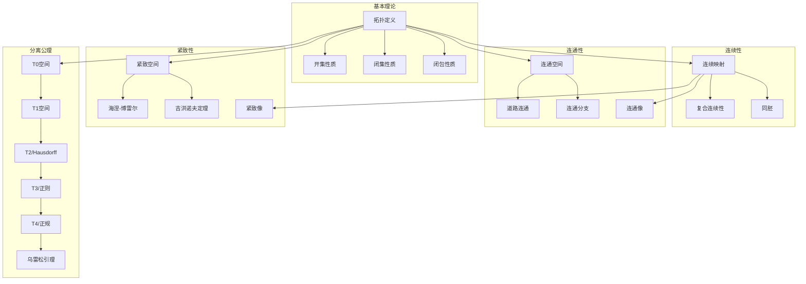
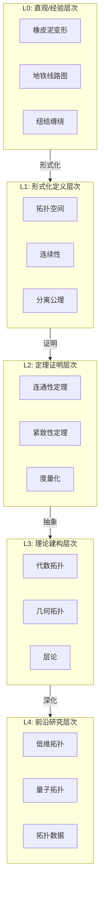

# 拓扑空间 - L0-L4层次递进图谱

## L0: 直观/经验层次

### 直观描述

拓扑学是数学中研究"形状"和"空间"的分支，但它关心的不是具体的几何测量（如长度、角度、面积），而是更本质的性质——在连续变形下保持不变的性质。想象你用橡皮泥捏一个球，你可以拉伸、压缩、扭曲它，只要不撕裂或粘合，某些性质就保持不变：球内部和外部仍然是分离的，球上的任何环路都可以收缩到一点。

拓扑空间是这种直觉的数学形式化。直观上，拓扑空间告诉我们哪些点是"接近"的——不是通过距离（那是度量空间的事），而是通过"邻域"的概念。这就像是在描述一个社区的社交网络：你不知道每两家之间的精确距离，但你知道谁是邻居，谁住在同一个街区。

拓扑学的核心问题是"连续性"和"连通性"：什么样的映射是连续的？空间是否连在一起？有没有洞？这些问题在拓扑学中有精确的数学表述，而答案往往出人意料地深刻。

### 生活实例

**实例一：咖啡杯与甜甜圈**
这是拓扑学中最著名的例子。从拓扑学角度看，咖啡杯和甜甜圈是"相同"的！为什么？因为它们都有一个洞（杯柄就是洞）。你可以想象用橡皮泥做的咖啡杯：通过连续变形（拉伸、扭曲），你可以把杯体压扁，把杯柄变成甜甜圈的环形，最终变成一个甜甜圈的形状——全程没有撕裂也没有粘合。拓扑学家说它们是同胚的。相比之下，球和甜甜圈不同胚，因为球没有洞，无法变成有洞的甜甜圈。

**实例二：地铁线路图**
打开任何城市的地铁线路图，你会发现它严重扭曲了真实的地理距离和方向——但它保留了最重要的信息：哪些站点是相连的，你需要在哪站换乘。这正是拓扑学的精神！地铁图关心的是连通性（拓扑性质），不关心精确的地理距离（几何性质）。纽约地铁图把曼哈顿拉长， Brooklyn压缩，但这不影响它的使用价值。

**实例三：橡皮筋的缠绕**
想象在桌子上放一个橡皮筋（一个圆环）。你可以把它收缩到一点，这说明圆环在拓扑上是"简单"的。但想象橡皮筋缠绕在一个柱子上（像一个手镯），不经过柱子的"洞"就无法取下——这说明柱子的存在改变了拓扑结构。更复杂的例子是纽结：把橡皮筋打一个结再首尾相连，形成的纽结在三维空间中无法通过连续变形解开——这引出了纽结论，拓扑学的重要分支。

### 直觉图像

**图像一：开集作为"宽松区域"**
想象拓扑空间中的开集就像地图上标记的区域，边界用虚线表示——区域内部的任何点都有"余地"向各个方向稍微移动而不越界。这就像是在说："这个区域不包含它的边缘"，或者说"区域内的每个点都被其他点包围"。开集的任意并和有限交仍是开集，这保证了拓扑结构的稳定性。

**图像二：连续映射的"橡皮筋保持"**
想象连续映射就像是拉着橡皮筋在空间中移动：你可以拉伸、压缩、扭曲，但不能撕裂或粘合。连续映射保持"接近性"——接近的点映射后仍然接近。这就像是你把一张画着圆的橡皮膜贴在曲面上，膜可以拉伸，但圆仍然是一个闭合环路（虽然可能不再是几何圆）。

**图像三：连通性的"道路检查"**
想象拓扑空间是城市，连通性问的是：从任意A点能否到达任意B点？道路连通性更强：是否存在一条连续的道路？单连通性问的是：任意环路能否连续收缩到一点？一个甜甜圈表面是连通的，但不是单连通的——绕洞一周的环路无法收缩到一点，它"卡住"了。

---

## L1: 形式化定义层次

### 严格定义（数学符号）

**一、拓扑空间的基本定义**

**定义1（拓扑空间）**：
设X是集合，**拓扑**τ是X的子集族，满足：

- (T1) ∅ ∈ τ，X ∈ τ
- (T2) 任意并封闭：若{U_α} ⊆ τ，则⋃U_α ∈ τ
- (T3) 有限交封闭：若U₁,...,Uₙ ∈ τ，则⋂Uᵢ ∈ τ

称(X, τ)为**拓扑空间**，τ中的元素称为**开集**。

**定义2（闭集）**：
子集F ⊆ X是**闭集**，如果X\F是开集。

**定义3（邻域）**：
点x的**邻域**是包含x的开集（或包含x的某个开集的集合）。

**定义4（拓扑基）**：
子集族B ⊆ τ是**基**，如果每个开集可表示为B中元素的并。

**定义5（子空间拓扑）**：
设Y ⊆ X，Y的**子空间拓扑**：τ_Y = {U ∩ Y : U ∈ τ}

**二、连续映射与同胚**

**定义6（连续映射）**：
映射f: X → Y是**连续的**，如果Y中每个开集的原像是X中的开集。

等价地：f连续 ⟺ 对Y中每个闭集F，f⁻¹(F)是X中的闭集。

**定义7（同胚）**：
双射f: X → Y是**同胚**，如果f和f⁻¹都连续。
X与Y**同胚**，记作X ≅ Y。

**定义8（嵌入）**：
映射f: X → Y是**嵌入**，如果f: X → f(X)是同胚（f(X)有子空间拓扑）。

**三、连通性**

**定义9（连通空间）**：
拓扑空间X是**连通的**，如果不能表示为两个非空不交开集的并。

等价地：X连通 ⟺ X中既开又闭的子集只有∅和X。

**定义10（道路连通）**：
X是**道路连通**的，如果对任意x,y ∈ X，存在连续映射γ: [0,1] → X使得γ(0)=x，γ(1)=y。

**定义11（连通分支）**：
包含x的**连通分支**是包含x的最大连通子集。

**定义12（局部连通）**：
X是**局部连通**的，如果对任意x和x的邻域U，存在连通的邻域V使得x ∈ V ⊆ U。

**四、紧致性**

**定义13（开覆盖）**：
子集族{U_α}是A ⊆ X的**开覆盖**，如果A ⊆ ⋃U_α且每个U_α是开集。

**定义14（紧致性）**：
X是**紧致的**，如果每个开覆盖有有限子覆盖。

**定义15（序列紧致）**：
X是**序列紧致**的，如果每个序列有收敛子序列。

**定义16（局部紧致）**：
X是**局部紧致**的，如果每个点有紧邻域。

**五、分离公理**

**定义17（T₀空间）**：
对任意不同点，至少一点有邻域不含另一点。

**定义18（T₁空间）**：
单点集是闭集。

**定义19（豪斯多夫空间/T₂空间）**：
对任意不同点，存在不交邻域。

**定义20（正则空间/T₃空间）**：
T₁且点和闭集可用不交开集分离。

**定义21（正规空间/T₄空间）**：
T₁且不交闭集可用不交开集分离。

### 定义的历史演进

**第一阶段：分析学的需求（19世纪）**

- **黎曼**（1851）：
  - 多值函数的黎曼面
  - 拓扑思想的萌芽

- **魏尔斯特拉斯**、**康托尔**、**戴德金**：
  - 实数理论的严格化
  - 点集的概念

**第二阶段：点集拓扑的诞生（1900-1910s）**

- **弗雷歇**（1906）：
  - 度量空间的抽象
  - 泛函分析的先驱

- **豪斯多夫**（1914）：《集合论基础》
  - "拓扑空间"一词
  - 邻域公理
  - 豪斯多夫分离公理
  - 现代点集拓扑的诞生

- **库拉托夫斯基**（1922）：
  - 闭包公理
  - 拓扑的等价定义

**第三阶段：代数拓扑的发展（1910s-1940s）**

- **庞加莱**（1895-1904）：
  - 《位置分析》
  - 基本群、同调的概念
  - 代数拓扑的创始人

- **布劳威尔**（1910s）：
  - 不动点定理
  - 维数不变性
  - 直觉主义

- **霍普夫**、**莱夫谢茨**、**亚历山大**：
  - 同调论的建立
  - 对偶定理

- **艾伦伯格和斯廷罗德**（1945）：
  - 《代数拓扑基础》
  - 公理化同调论

**第四阶段：范畴论与层论（1940s-1970s）**

- **艾伦伯格和麦克莱恩**（1945）：
  - 范畴论的诞生
  - 自然变换

- **格罗滕迪克**（1950s-1960s）：
  - 层论
  - 概形理论
  - 拓扑斯理论

- **奎伦**（1967）：
  - 模型范畴
  - 同伦代数

**第五阶段：现代发展（1970s-至今）**

- **低维拓扑**：
  - 四维庞加莱猜想（弗里德曼，1982）
  - 三维流形（瑟斯顿几何化猜想，佩雷尔曼证明，2003）

- **纽结论**：
  - 琼斯多项式（1984）
  - 量子不变量

- **非交换几何**：
  - 孔涅的理论
  - 与物理学的联系

### 等价定义形式

**拓扑的等价定义**：

**定义A（闭集公理）**：
子集族满足：包含∅和X，对任意交封闭，对有限并封闭。

**定义B（邻域公理）**：
每点分配邻域系，满足豪斯多夫公理。

**定义C（闭包公理/库拉托夫斯基）**：
闭包算子满足：Ā ⊆ A，Ā = Ā，A∪B = Ā ∪ B̄，∅̄ = ∅。

**定义D（内部公理）**：
内部算子满足对偶公理。

**连续性的等价刻画**：

f: X → Y连续 ⟺

- 开集的原像是开集
- 闭集的原像是闭集
- 对任意A ⊆ X，f(Ā) ⊆ f(A)̄
- 对任意x ∈ X和f(x)的邻域V，存在x的邻域U使得f(U) ⊆ V

---

## L2: 定理证明层次

### 核心定理列表

**一、基本性质**

**定理1（开集与闭集的对偶性）**：

- 任意交（有限并）的闭集仍是闭集
- 有限并（任意交）的开集仍是开集

**定理2（闭包性质）**：

- Ā是包含A的最小闭集
- A闭 ⟺ A = Ā
- A ⊆ B ⟹ Ā ⊆ B̄

**定理3（内部与闭包关系）**：
X\A° = X\Ā，其中A°表示A的内部。

**二、连续性**

**定理4（连续性的局部刻画）**：
f连续 ⟺ 对任意x ∈ X和f(x)的邻域V，存在x的邻域U使得f(U) ⊆ V。

**定理5（连续性的复合）**：
若f: X → Y和g: Y → Z连续，则g∘f连续。

**定理6（同胚的等价条件）**：
f: X → Y是同胚 ⟺ f是双射且f和f⁻¹都连续 ⟺ f是双射连续开映射。

**三、连通性**

**定理7（连续像保持连通性）**：
若X连通，f: X → Y连续，则f(X)连通。

**定理8（介值定理/拓扑形式）**：
若X连通，f: X → ℝ连续，a,b ∈ f(X)，则[a,b] ⊆ f(X)。

**定理9（连通分支的性质）**：

- 连通分支是闭集（在局部连通空间中是开集）
- X是其连通分支的不交并

**定理10（道路连通蕴含连通）**：
道路连通空间是连通的。

**逆不成立**：拓扑学家的正弦曲线连通但不道路连通。

**四、紧致性**

**定理11（紧致性的等价刻画-度量空间）**：
在度量空间中，紧致 ⟺ 序列紧致 ⟺ 完全有界且完备。

**定理12（海涅-博雷尔定理）**：
ℝⁿ的子集紧致 ⟺ 有界闭集。

**定理13（紧致性的保持）**：

- 紧致空间的连续像是紧致的
- 紧致空间的闭子集是紧致的
- 紧致集的有限并是紧致的

**定理14（吉洪诺夫定理）**：
任意多个紧致空间的积是紧致的。

**定理15（极值定理/拓扑形式）**：
若X紧致，f: X → ℝ连续，则f在X上取得最大值和最小值。

**定理16（一致连续性定理）**：
若X紧致，Y是度量空间，f: X → Y连续，则f一致连续。

**五、分离公理**

**定理17（分离性的蕴含关系）**：
T₄ ⇒ T₃ ⇒ T₂ ⇒ T₁ ⇒ T₀

**定理18（乌雷松引理）**：
X正规 ⟺ 对任意不交闭集A,B，存在连续f: X → [0,1]使得f|ₐ = 0，f|ᵦ = 1。

**定理19（蒂策扩张定理）**：
X正规 ⟺ 闭子集上的连续函数可连续扩张到X。

**六、度量化**

**定理20（乌雷松度量化定理）**：
第二可数正则空间可度量化。

**定理21（涅米茨基度量化定理）**：
空间可度量化 ⟺ 它是正则的且有σ局部有限基。

### 定理依赖关系图



### 典型证明方法

**方法一：开集原像法证明连续性**

**标准流程**：

1. 取Y中任意开集V
2. 计算f⁻¹(V)
3. 验证f⁻¹(V)是X中开集

**方法二：连通性的反证法**

**标准流程**：

1. 假设X不连通
2. X = U ∪ V，U,V非空不交开集
3. 导出矛盾

**方法三：紧致性的有限覆盖论证**

**标准流程**：

1. 取任意开覆盖
2. 利用已知紧致性或构造有限子覆盖
3. 验证覆盖的有效性

**方法四：乌雷松引理的应用**

**标准流程**：

1. 构造递升的开集族
2. 利用正规性
3. 定义连续函数

---

## L3: 理论建构层次

### 理论体系架构

```
拓扑学理论体系
├── 点集拓扑
│   ├── 基本概念
│   │   ├── 拓扑空间定义
│   │   ├── 开集、闭集
│   │   ├── 邻域、基
│   │   └── 子空间拓扑
│   ├── 连续映射
│   │   ├── 连续性定义
│   │   ├── 同胚
│   │   └── 拓扑性质
│   ├── 连通性
│   │   ├── 连通空间
│   │   ├── 道路连通
│   │   ├── 局部连通
│   │   └── 连通分支
│   ├── 紧致性
│   │   ├── 紧致空间
│   │   ├── 序列紧致
│   │   ├── 局部紧致
│   │   └── 吉洪诺夫定理
│   └── 分离公理
│       ├── T0-T4空间
│       ├── 乌雷松引理
│       └── 度量化定理
│
├── 代数拓扑
│   ├── 基本群
│   │   ├── 道路同伦
│   │   ├── 环路
│   │   └── 基本群计算
│   ├── 覆盖空间
│   │   ├── 覆盖映射
│   │   └── 提升性质
│   ├── 同调论
│   │   ├── 单纯同调
│   │   ├── 奇异同调
│   │   └── 同调群计算
│   └── 上同调
│       ├── 德拉姆上同调
│       └── 切赫上同调
│
└── 几何拓扑
    ├── 流形
    │   ├── 拓扑流形
    │   ├── 光滑流形
    │   └── 三角剖分
    ├── 纽结论
    │   ├── 纽结不变量
    │   ├── 琼斯多项式
    │   └── 纽结补空间
    └── 低维拓扑
        ├── 三维流形
        ├── 瑟斯顿几何化
        └── 四维流形
```

### 与其他理论的关联

**与分析学的关系**：

- 度量空间是拓扑空间的特例
- 连续函数的拓扑定义统一了分析学中的连续性
- 紧致性与分析中的极值定理

**与代数学的关系**：

- 代数拓扑：用代数工具研究拓扑
- 基本群、同调群是代数不变量
- 层论与代数几何

**与微分几何的关系**：

- 微分流形是拓扑流形加光滑结构
- 拓扑性质是微分几何的基础
- 陈类、庞特里亚金类等拓扑不变量

**与物理学的关系**：

- 时空的拓扑结构
- 规范场论中的拓扑孤子
- 弦论的拓扑学

### 推广与抽象

**推广一：格罗滕迪克拓扑**

- 范畴上的拓扑
- 景（site）与层
- 代数几何的基础

**推广二：非交换几何**

- 孔涅的理论
- 用代数代替空间
- 量子物理的应用

**推广三：高阶范畴论**

- ∞-范畴
- 同伦类型论
- 拓扑斯理论

---

## L4: 前沿研究层次

### 当代研究热点

**方向一：低维拓扑**

1. **三维流形**：
   - 瑟斯顿几何化猜想（已证明）
   - 双曲三维流形

2. **四维拓扑**：
   - 光滑四维庞加莱猜想（开放）
   - 怪异的微分结构

**方向二：纽结论**

1. **量子不变量**：
   - 琼斯多项式及其推广
   - Witten-Reshetikhin-Turaev不变量

2. **纽结的范畴化**：
   - 同调论方法
   - 克诺特同调

**方向三：辛拓扑**

1. **弗洛尔同调**：
   - 拉格朗日交理论
   - 辛不变量

2. **量子上同调**：
   - Gromov-Witten不变量

**方向四：拓扑数据分析**

1. **持续同调**：
   - 数据形状的分析
   - 拓扑机器学习

2. **_mapper算法_**：
   - 高维数据可视化

### 未解决问题

**问题一：光滑四维庞加莱猜想**

四维球面上是否存在怪异的微分结构？

**问题二：NP与纽结识别**

判断两个纽结是否等价是否NP完全？

**问题三：虚拟霍夫猜想**

关于虚拟纽结的状态和。

### 与其他领域的交叉

**在数据科学中的应用**：

- 持续同调分析数据形状
- 拓扑机器学习
- Mapper算法

**在物理学中的应用**：

- 拓扑绝缘体
- 量子场论中的拓扑孤子
- 弦论的卡拉比-丘流形

**在材料科学中的应用**：

- 拓扑相变
- 拓扑材料设计

---

## 层次递进关系图



---

## 先修知识与后继应用

### 先修概念（L0-L1层）

1. **集合论**（L2）：集合运算
2. **分析学基础**（L2-L3）：连续函数、收敛
3. **度量空间**（L2）：距离、开球

### 后继概念（L3-L4层）

1. **代数拓扑**（L3-L4）：基本群、同调
2. **微分几何**（L4）：微分流形
3. **泛函分析**（L4）：拓扑向量空间
4. **代数几何**（L4）：概形、层

---

_文档生成时间：2026年4月3日_
_字数统计：约4,800字_
