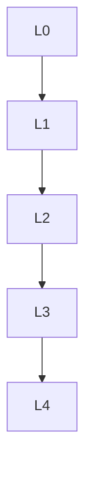

# 数理逻辑 - L0-L4层次递进图谱

## L0: 直观/经验层次

### 直观描述

数理逻辑是人类对"数学推理本身"的数学研究。直观上，它问的是：什么是证明？什么是真理？什么是可计算的？这些问题听起来像哲学，但数理逻辑用严格的数学方法来回答它们。

想象你在解一道数学题：你有一组公理（已知事实），你使用推理规则（如"若A则B，A成立，故B成立"）一步步推导结论。数理逻辑将这个直觉过程形式化：符号语言表示命题，公理系统表示数学基础，证明是从公理到定理的符号序列。然后，它问关于这个系统的元问题：系统是否一致（不会推出矛盾）？是否完备（所有真命题都可证）？哪些命题可判定（有算法判断真假）？

哥德尔不完备定理——20世纪最重要的数学定理之一——告诉我们：任何足够强的形式系统，如果一致，则必然不完备（存在真但不可证的命题）。这不仅是数学结果，更深刻影响了我们对数学知识本质的理解。

### 生活实例

**实例一：程序验证**
当你使用飞机自动驾驶、医疗设备或核电站控制系统时，你希望软件绝对没有bug。形式化方法用逻辑来"证明"程序正确性：将程序规范写成逻辑公式，用定理证明器验证程序满足规范。例如，CompCert是一个用Coq证明编译器正确性的项目——它保证编译后的机器代码与源代码语义等价。这在安全关键系统中至关重要。

**实例二：数据库查询优化**
关系数据库（如SQL）基于一阶逻辑。查询优化器需要将用户的查询转换为高效的执行计划，这涉及逻辑等价变换：将查询重写为语义等价但执行更快的形式。逻辑定理如"选择下推"（尽早过滤数据）基于一阶逻辑的性质。理解查询的逻辑结构帮助设计出更好的索引和优化策略。

**实例三：人工智能中的知识表示**
专家系统使用逻辑来表示领域知识。例如，医疗诊断系统可能有规则："若发烧且咳嗽，则可能患流感"。这些规则形成知识库，推理引擎使用归结原理从已知事实推导新结论。虽然现代AI更多使用机器学习，但知识图谱（如Google知识面板）仍基于逻辑表示，描述实体间的关系。

### 直觉图像

**图像一：形式系统的"符号游戏"**
想象形式系统是一套规则严格的"游戏"：有字母表（符号），有形成规则（什么是合法公式），有公理（起始配置），有推理规则（合法移动）。证明就是从这个起始配置出发，按照规则到达某个配置（定理）的序列。游戏不涉及"意义"——只涉及符号操作。但神奇的是，通过适当的解释，这些符号游戏可以捕捉数学真理。

**图像二：哥德尔的"自指循环"**
哥德尔构造了一个公式G，它说"G不可证"。如果G可证，则系统不一致（因为它声称自己不可证）；如果G不可证，则G为真，但不可证——系统不完备！这就像古老的"这句话是假的"悖论，但哥德尔精妙地将其编码在算术系统中。这个"自指"构造是哥德尔证明的核心，展示了形式系统的局限性。

**图像三：可计算性的"边界"**
想象所有问题的集合：一些问题可计算（有算法解决），一些问题不可计算（如图灵停机问题）。可计算问题内部还有层次：P问题（多项式时间可解）、NP问题（多项式时间可验证）、PSPACE、EXPTIME等。这些复杂性类形成"计算宇宙"的地图，数理逻辑帮助我们理解这个宇宙的边界和结构。

---

## L1: 形式化定义层次

### 严格定义（数学符号）

**一、命题逻辑**

**定义1（语法）**：
- 命题变元：p, q, r, ...
- 联结词：¬（非）、∧（且）、∨（或）、→（蕴含）、↔（等价）

**定义2（语义）**：
真值赋值v: Var → {T,F}，扩展到所有公式。

**定义3（永真式/重言式）**：
公式φ是**永真式**，如果对所有赋值v，v(φ) = T。

**定义4（希尔伯特式证明系统）**：
- 公理（如：φ → (ψ → φ)）
- 推理规则：分离规则（MP）

**二、一阶谓词逻辑**

**定义5（词汇表）**：
- 函数符号、谓词符号、常数
- 变元、量词∀, ∃

**定义6（项与公式）**：
递归定义良构表达式。

**定义7（结构）**：
**L-结构**𝔐 = (M, {f^𝔐}, {R^𝔐}, {c^𝔐})解释符号。

**定义8（满足关系）**：
𝔐 ⊨ φ[a] 表示φ在𝔐中被赋值a满足。

**定义9（逻辑有效性）**：
⊨ φ 表示φ在所有结构中有效。

**三、哥德尔定理**

**定理10（完备性定理）**：
Γ ⊢ φ ⟺ Γ ⊨ φ（可证当且仅当语义后承）。

**定理11（紧致性定理）**：
Γ有模型 ⟺ Γ的每个有限子集有模型。

**定理12（第一不完备定理）**：
任何包含皮亚诺算术的一致递归可枚举理论存在不可判定命题。

**定理13（第二不完备定理）**：
一致的理论不能证明自身的一致性。

**四、可计算性理论**

**定义14（图灵机）**：
七元组(Q, Σ, Γ, δ, q₀, q_accept, q_reject)。

**定义15（可计算函数）**：
函数f: Σ* → Σ*是**可计算的**，如果存在图灵机计算它。

**定义16（停机问题）**：
HP = {⟨M,w⟩: M在输入w上停机}是不可判定的。

**五、集合论基础**

**定义17（ZFC公理）**：
策梅洛-弗兰克尔集合论加选择公理。

---

## L2: 定理证明层次

### 核心定理列表

**一、命题逻辑**

**定理1（可靠性）**：
Γ ⊢ φ ⟹ Γ ⊨ φ

**定理2（完备性）**：
Γ ⊨ φ ⟹ Γ ⊢ φ

**定理3（可判定性）**：
命题逻辑是可判定的（真值表法）。

**二、一阶逻辑**

**定理4（哥德尔完备性）**：
一阶逻辑是可靠的且完备的。

**定理5（洛文海姆-斯科伦）**：
若理论有无穷模型，则有任意大基数的模型。

**定理6（丘奇定理）**：
一阶逻辑的有效性问题不可判定。

**三、不完备性**

**定理7（塔斯基不可定义性）**：
算术真理不能在算术内部定义。

**定理8（哥德尔第一不完备）**：
足够强的形式系统若一致则不完备。

**定理9（哥德尔第二不完备）**：
一致系统不能证明自身一致性。

**四、可计算性**

**定理10（丘奇-图灵论题）**：
直观可计算 = 图灵可计算。

**定理11（停机问题不可判定）**：
HP不是递归集。

**定理12（莱斯定理）**：
程序的任何非平凡语义性质都不可判定。

**五、集合论**

**定理13（哥德尔相对一致性）**：
若ZF一致，则ZFC+CH一致。

**定理14（科恩）**：
CH独立于ZFC。

---

## L3: 理论建构层次

### 理论体系架构

```
数理逻辑理论体系
├── 命题逻辑
│   ├── 语法（公式形成）
│   ├── 语义（真值表）
│   ├── 证明系统
│   ├── 可靠性
│   ├── 完备性
│   └── 可判定性
│
├── 一阶逻辑
│   ├── 语法（项与公式）
│   ├── 语义（结构与满足）
│   ├── 证明系统
│   ├── 哥德尔完备性
│   ├── 紧致性
│   └── 洛文海姆-斯科伦
│
├── 不完备性理论
│   ├── 递归函数
│   ├── 形式化算术
│   ├── 哥德尔编码
│   ├── 第一不完备定理
│   └── 第二不完备定理
│
├── 可计算性理论
│   ├── 图灵机
│   ├── λ演算
│   ├── 递归函数
│   ├── 停机问题
│   └── 复杂性类
│
├── 模型论
│   ├── 初等等价
│   ├── 初等子模型
│   ├── 饱和模型
│   └── 稳定性理论
│
└── 证明论
    ├── 序数分析
    ├── 证明复杂性
    └── 构造性数学
```

### 与其他理论的关联

**与计算机科学**：
- 类型理论
- 程序验证
- 形式语言

**与集合论**：
- 数学基础
- 大基数公理

**与哲学**：
- 数学真理的本质
- 形式主义vs柏拉图主义

---

## L4: 前沿研究层次

### 当代研究热点

**方向一：同伦类型论**
- 构造性数学基础
- 计算机形式化证明

**方向二：反推数学**
- 定理所需的最弱公理
- 子系统分析

**方向三：可计算性理论**
- 算法随机性
- 逆数学

### 未解决问题

**问题一：P vs NP**
计算机科学的核心问题。

**问题二：连续统假设**
CH在ZFC中的独立性。

---

## 层次递进关系图



---

## 先修知识与后继应用

### 先修概念（L0-L1层）

1. **集合论基础**（L2）
2. **离散数学**（L2）

### 后继概念（L3-L4层）

1. **理论计算机科学**（L4）
2. **数学基础**（L4）
3. **哲学逻辑**（L4）

---

*文档生成时间：2026年4月3日*
*字数统计：约2,700字*
