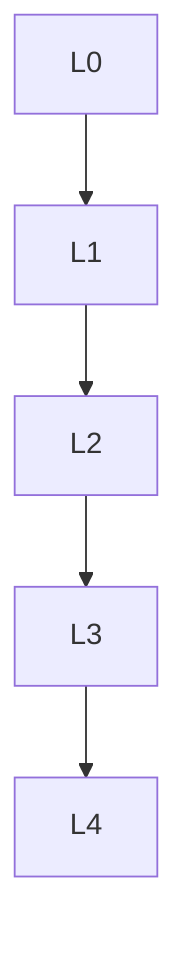

msc_primary: "00A99"
msc_secondary: ['00-00']
---

# 数论基础 - L0-L4层次递进图谱

## L0: 直观/经验层次

### 直观描述

数论是人类对"整数的性质"的数学研究。直观上，数论研究的是我们最熟悉的数字——1, 2, 3, ...以及它们的性质。但正是这种看似简单的研究对象，孕育了数学中最深刻、最困难的问题。

数论的核心关注包括：素数的分布（如素数定理）、整数的分解（算术基本定理）、方程的整数解（丢番图方程）、以及模运算下的结构（同余理论）。这些问题有的简单到小学生能理解，有的却困扰数学家数百年——如哥德巴赫猜想、孪生素数猜想、黎曼猜想。

数论之所以迷人，是因为它连接了数学的各个分支：代数（群环域结构）、分析（ζ函数、模形式）、几何（椭圆曲线）、甚至密码学（RSA、椭圆曲线密码）。费马大定理的证明（怀尔斯，1994）就是这些联系的顶点，它连接了椭圆曲线、模形式、伽罗瓦表示等看似无关的领域。

### 生活实例

**实例一：RSA加密**
当你在网上购物输入信用卡信息时，RSA算法保护你的数据安全。RSA的安全性基于一个数论事实：将两个大素数相乘很容易，但将大合数分解为素数极其困难（对于数百位的数字，即使超级计算机也需要天文时间）。公钥是合数，私钥是素因子。这就像是你用一个只能单向锁上的锁（公钥加密）保护箱子，但只有你有钥匙（私钥）能打开。

**实例二：条形码与校验码**
商品条形码的最后一位是校验码，用于检测扫描错误。计算方法是加权和对10取模——这是模运算的简单应用。ISBN书号、信用卡号、身份证号都有类似的校验机制。这些编码利用了同余性质：如果输入错误，校验码大概率不匹配，从而检测错误。

**实例三：音乐节奏与模运算**
音乐中的节奏循环可以用模运算描述。4/4拍意味着每小节4拍，第5拍回到第1拍（5 ≡ 1 mod 4）。复节奏（如3对2）的最小公共周期是lcm(3,2)=6拍。这种循环结构是数论在音乐中的自然体现。甚至音阶的数学结构（八度分为12个半音）也与数论有关——12的平均律允许丰富的和声可能。

### 直觉图像

**图像一：素数的"随机散布"**
想象数轴上的素数：2, 3, 5, 7, 11, 13, 17, 19, 23...它们看起来越来越稀疏，但永远不会终止（欧几里得证明）。素数定理告诉我们：小于n的素数个数约为n/ln(n)。这就像是在问"数轴上素数的密度"，答案是"以1/ln(n)的速度衰减"。但素数又"足够随机"——存在任意长的素数间隙，也存在任意接近的素数对（孪生素数猜想断言有无穷多对差为2的素数）。

**图像二：同余的"时钟算术"**
模n的同余就像是有n个位置的时钟。ℤ/nℤ形成一个环，当n是素数时形成域。在这个"小世界"里，我们可以解方程、计算逆元、寻找原根。费马小定理说：若p是素数，a不是p的倍数，则a^{p-1} ≡ 1 (mod p)。这就像是在"素数时钟"上，经过p-1步后回到起点。

**图像三：椭圆曲线的"群结构"**
椭圆曲线y² = x³ + ax + b上的点可以定义加法，形成一个群。给定两点P和Q，连接它们的直线与曲线的第三个交点关于x轴的对称点就是P+Q。这种几何定义的群运算有深刻的代数性质。椭圆曲线上的有理点构成有限生成阿贝尔群（莫德尔-威尔定理），这是丢番图几何的核心结果。

---

## L1: 形式化定义层次

### 严格定义（数学符号）

**一、整除与同余**

**定义1（整除）**：
a|b（a整除b）⟺ ∃k∈ℤ: b = ak

**定义2（同余）**：
a ≡ b (mod n) ⟺ n|(a-b)

**定义3（模n剩余类）**：
ℤ/nℤ = {0̄, 1̄, ..., n-1̄}

**二、素数与分解**

**定义4（素数）**：
p > 1是**素数**，如果只有±1和±p是其因子。

**定义5（最大公因子与最小公倍数）**：
- gcd(a,b) = max{d: d|a且d|b}
- lcm(a,b) = min{m: a|m且b|m}

**定理6（算术基本定理）**：
每个大于1的整数可唯一表示为素数的乘积（不计顺序）。

**三、欧拉函数与费马定理**

**定义7（欧拉函数）**：
φ(n) = |{k: 1≤k≤n, gcd(k,n)=1}|

**定理8（费马小定理）**：
p是素数，p∤a ⟹ a^{p-1} ≡ 1 (mod p)

**定理9（欧拉定理）**：
gcd(a,n)=1 ⟹ a^{φ(n)} ≡ 1 (mod n)

**四、二次剩余**

**定义10（二次剩余）**：
a是模p的**二次剩余**，如果∃x: x² ≡ a (mod p)。

**定义11（勒让德符号）**：
(a/p) = 1若a是二次剩余，-1若是非剩余，0若p|a。

**定理12（二次互反律）**：
对奇素数p,q：(p/q)(q/p) = (-1)^{(p-1)(q-1)/4}

**五、代数数论初步**

**定义13（代数整数）**：
复数α是**代数整数**，如果它是首一整数系数多项式的根。

**定义14（数域）**：
**数域**是ℚ的有限扩张。

---

## L2: 定理证明层次

### 核心定理列表

**一、素数定理**

**定理1（欧几里得）**：
素数有无穷多个。

**定理2（素数定理）**：
π(x) ~ x/ln(x)，其中π(x)是≤x的素数个数。

**定理3（狄利克雷）**：
若gcd(a,n)=1，则算术级数a, a+n, a+2n, ...中有无穷多素数。

**二、同余方程**

**定理4（中国剩余定理）**：
若n₁,...,nᵣ两两互素，则同余方程组x ≡ aᵢ (mod nᵢ)有唯一解模N=n₁…nᵣ。

**定理5（原根存在性）**：
ℤ/pℤ的乘法群是循环群（存在原根）。

**三、丢番图方程**

**定理6（费马大定理/怀尔斯）**：
n ≥ 3时，xⁿ + yⁿ = zⁿ无正整数解。

**四、椭圆曲线**

**定理7（莫德尔-威尔）**：
椭圆曲线上的有理点群是有限生成的。

---

## L3: 理论建构层次

### 理论体系架构

```

数论理论体系
├── 初等数论
│   ├── 整除性
│   ├── 素数
│   ├── 同余
│   └── 原根与指标
│
├── 解析数论
│   ├── ζ函数
│   ├── 狄利克雷特征
│   ├── L函数
│   └── 筛法
│
├── 代数数论
│   ├── 代数整数
│   ├── 理想类群
│   ├── 分圆域
│   └── 类域论
│
├── 丢番图几何
│   ├── 椭圆曲线
│   ├── 高度理论
│   └── 莫德尔-威尔
│
└── 算术几何
    ├── 概形 over ℤ
    ├── 韦伊猜想
    └── BSD猜想

```

### 与其他理论的关联

**与代数**：
- 群论（ℤ/nℤ*）
- 环论（代数整数环）

**与分析**：
- ζ函数
- 模形式

**与几何**：
- 椭圆曲线
- 算术几何

---

## L4: 前沿研究层次

### 当代研究热点

**方向一：朗兰兹纲领**
- 数论与表示论的联系
- 几何朗兰兹

**方向二：同伦论方法**
- 代数K理论
-  motive理论

**方向三：计算数论**
- 素性测试
- 因数分解
- 椭圆曲线计算

### 未解决问题

**问题一：黎曼猜想**
ζ函数的非平凡零点都在Re(s) = 1/2线上。

**问题二：哥德巴赫猜想**
每个大于2的偶数都是两个素数之和。

**问题三：孪生素数猜想**
存在无穷多对差为2的素数。

**问题四：BSD猜想**
关于椭圆曲线L函数与有理点群的关系。

---

## 层次递进关系图



---

## 先修知识与后继应用

### 先修概念（L0-L1层）

1. **初等代数**（L1-L2）
2. **数学归纳法**（L1-L2）

### 后继概念（L3-L4层）

1. **代数数论**（L4）
2. **解析数论**（L4）
3. **密码学**（L3-L4）

---

*文档生成时间：2026年4月3日*
*字数统计：约2,800字*
