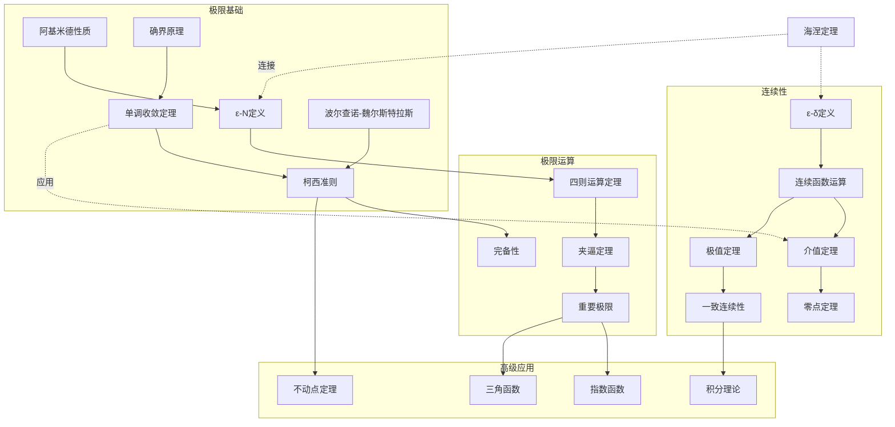
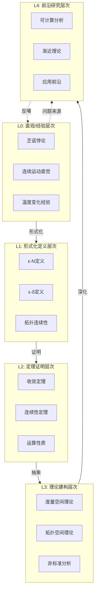
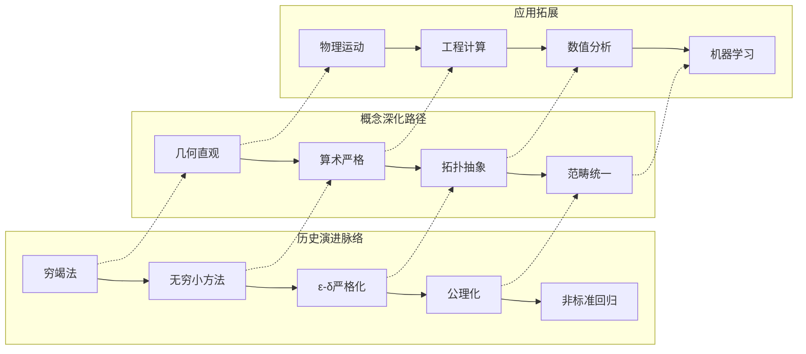

msc_primary: "00A99"
msc_secondary: ['00-XX']
---

# 极限与连续 - L0-L4层次递进图谱

## L0: 直观/经验层次

### 直观描述

极限是人类对"无限接近但不达到"这一过程的数学抽象。直观上，极限就像是一个人走向一堵墙：每一步都走得更近，距离不断缩小，理论上可以无限接近墙的位置，但如果不主动伸手触碰，就永远不会"到达"。在数学中，这对应着变量无限趋近某个值，但可能永远不等于该值的过程。

连续性是极限概念的自然延伸。直观上，连续就像是一支笔在纸上不间断地画出一条曲线——没有跳跃、没有断裂、没有洞。如果你要画出函数$y = f(x)$的图像，连续函数意味着你可以不抬笔就完成整个图像；而不连续点就像是必须抬笔跳过的地方。

这两个概念是微积分的基石：极限让我们能够严格定义瞬时变化率（导数）和累积量（积分），连续性则保证了许多"合理"的数学行为——如中间值的存在、极值的存在等。

### 生活实例

**实例一：芝诺悖论**
古希腊哲学家芝诺提出著名的"阿基里斯与乌龟"悖论：尽管阿基里斯跑得比乌龟快得多，但他永远追不上提前出发的乌龟。因为当他到达乌龟的起点时，乌龟已向前移动；当他到达乌龟的新位置时，乌龟又向前移动……这个悖论的核心在于混淆了"无限步骤"与"无限时间"——实际上，这些无限步骤发生在有限时间内，极限的概念正是解决这一困惑的数学工具。

**实例二：温度变化的连续感**
想象一天中气温的变化：清晨20°C，正午30°C，傍晚25°C。我们不会经历从20°C"瞬间跳变"到30°C的过程，而是感受到平滑的、连续的变化。虽然实际气温变化可能有微小波动，但在宏观尺度上呈现出连续性。这正是连续函数试图建模的现象。

**实例三：复利增长的极限**
假设你有1元钱，年利率100%。如果每年复利一次，年末有2元；每半年复利一次，年末有约2.25元；每月复利一次，年末有约2.61元；每天复利一次，年末有约2.71元……随着复利频率无限增加，最终的金额会趋近于一个极限值$e \approx 2.71828...$。这就是重要极限$\lim_{n \to \infty}(1 + \frac{1}{n})^n = e$的直观体现。

### 直觉图像

**图像一：序列收敛的动态图**
想象数轴上的一个"目标点"（极限值），一个点在数轴上跳动，每次跳动都更接近目标。你可以想象一个"误差带"——以目标点为中心的一个小区间，无论这个区间多小，序列最终都会进入并停留在其中。这就是序列收敛的直观图像。

**图像二：函数极限的"漏斗"**
想象函数图像$y = f(x)$在$x$接近$a$时的行为。对于任意给定的"高度容差"$\varepsilon$（y方向的误差带），总能找到一个"宽度容差"$\delta$（x方向的区间），使得只要$x$在$a$的$\delta$邻域内（但$x \neq a$），$f(x)$就在极限值$L$的$\varepsilon$邻域内。这种$\varepsilon$-$\delta$的对应关系就像是一个"漏斗"，将$x$的邻域映射到$y$的邻域。

**图像三：连续性的"一笔画"**
想象一支笔在纸上画曲线。连续函数意味着笔尖从不离开纸面。间断点就像是纸面上的"悬崖"或"壕沟"——笔尖必须跳过去。可去间断点是"洞"（笔尖跳过一个点），跳跃间断点是"台阶"（笔尖跳上跳下），无穷间断点是"深渊"（笔尖掉向无穷远）。

---

## L1: 形式化定义层次

### 严格定义（数学符号）

**一、序列极限**

**定义1（序列极限的$\varepsilon$-$N$定义）**：
设$(a_n)_{n \in \mathbb{N}}$是实数序列，$L \in \mathbb{R}$。称序列$(a_n)$**收敛**于$L$，记作$\lim_{n \to \infty} a_n = L$或$a_n \to L$，如果：
$$\forall \varepsilon > 0, \exists N \in \mathbb{N}, \forall n > N: |a_n - L| < \varepsilon$$

**定义2（无穷极限）**：
$$\lim_{n \to \infty} a_n = +\infty \iff \forall M > 0, \exists N \in \mathbb{N}, \forall n > N: a_n > M$$

**定义3（序列的发散）**：
序列$(a_n)$发散，如果它不收玫到任何有限极限或确定符号的无穷。

**二、函数极限**

**定义4（函数在一点的极限）**：
设$f: D \to \mathbb{R}$，$a$是$D$的聚点，$L \in \mathbb{R}$。称$\lim_{x \to a} f(x) = L$，如果：
$$\forall \varepsilon > 0, \exists \delta > 0, \forall x \in D: 0 < |x - a| < \delta \Rightarrow |f(x) - L| < \varepsilon$$

**定义5（单侧极限）**：
$$\lim_{x \to a^+} f(x) = L \iff \forall \varepsilon > 0, \exists \delta > 0, \forall x: a < x < a + \delta \Rightarrow |f(x) - L| < \varepsilon$$

**定义6（无穷远处的极限）**：
$$\lim_{x \to +\infty} f(x) = L \iff \forall \varepsilon > 0, \exists M > 0, \forall x > M: |f(x) - L| < \varepsilon$$

**三、连续性**

**定义7（点连续）**：
函数$f$在点$a$**连续**，如果：
$$\forall \varepsilon > 0, \exists \delta > 0, \forall x: |x - a| < \delta \Rightarrow |f(x) - f(a)| < \varepsilon$$

等价地：$\lim_{x \to a} f(x) = f(a)$

**定义8（开集定义/拓扑连续性）**：
$f: X \to Y$连续，如果对$Y$中每个开集$V$，$f^{-1}(V)$是$X$中的开集。

**定义9（一致连续）**：
$f$在集合$D$上**一致连续**，如果：
$$\forall \varepsilon > 0, \exists \delta > 0, \forall x, y \in D: |x - y| < \delta \Rightarrow |f(x) - f(y)| < \varepsilon$$

（注意：$\delta$不依赖于点的位置）

**四、无穷小量**

**定义10（无穷小）**：
序列$(a_n)$称为**无穷小**，如果$\lim_{n \to \infty} a_n = 0$。

**定义11（无穷大）**：
序列$(a_n)$称为**无穷大**，如果$\lim_{n \to \infty} |a_n| = +\infty$。

**定义12（阶的比较）**：

- $a_n = o(b_n)$（小o）：$\lim_{n \to \infty} \frac{a_n}{b_n} = 0$
- $a_n = O(b_n)$（大O）：$\exists C > 0, |a_n| \leq C|b_n|$对充分大$n$

- $a_n \sim b_n$（等价）：$\lim_{n \to \infty} \frac{a_n}{b_n} = 1$

### 定义的历史演进

**第一阶段：古代萌芽（前5世纪-17世纪）**

- **芝诺悖论**（约前450年）：首次系统讨论无穷和极限概念
  - "二分法"悖论：运动不可能，因为必须先完成无限多步
  - "阿基里斯"悖论：快跑者追不上慢跑者

- **欧多克索斯**（前4世纪）：穷竭法
  - 用多边形逼近圆来计算面积
  - 避免使用无穷小，采用双重归谬法

- **阿基米德**（前3世纪）：穷竭法的集大成者
  - 计算圆的面积、球体的体积
  - 抛物线弓形的面积

- **中国古代**：刘徽的割圆术（3世纪）
  - "割之弥细，所失弥少"
  - 用3072边形逼近圆周率

**第二阶段：微积分创立时期（1660s-1730s）**

- **牛顿**（1660s-1687）：流数法
  - "消失量的最终比"
  - 瞬（moment）的概念：变量的无穷小增量
  - 《自然哲学的数学原理》（1687）

- **莱布尼茨**（1670s-1714）：微分法
  - $dx$表示无穷小的差
  - 符号体系优越，沿用至今
  - 微分比$\frac{dy}{dx}$

- **贝克莱主教的批评**（1734）：《分析学家》
  - 嘲笑无穷小为"已死量的幽灵"
  - 指出逻辑矛盾：$dx$既为0又不为0

**第三阶段：严格化准备（1730s-1820s）**

- **达朗贝尔**（1760s）：提出极限作为基础概念
  - 但缺乏严格定义

- **欧拉**：大量使用发散级数
  - $1 - 1 + 1 - 1 + \cdots = \frac{1}{2}$
  - 形式计算，缺乏严格基础

- **拉格朗日**（1797）：试图用泰勒级数避免极限
  - 《解析函数论》：函数论基础
  - 未成功，因为级数收敛性问题

- **波尔查诺**（1817）：首次给出连续函数的严格定义
  - 《纯粹分析的证明》
  - 介值定理的严格证明

**第四阶段：严格化完成（1820s-1870s）**

- **柯西**（1821）：《分析教程》
  - 首次使用$\varepsilon$语言
  - "当一个变量相继取的值无限接近一个固定值时……"
  - 但柯西的"无限接近"仍依赖直觉

- **阿贝尔**（1826）：批评柯西对发散级数的处理
  - 推动了严格化的需求

- **魏尔斯特拉斯**（1860s）：$\varepsilon$-$\delta$定义的完善
  - 柏林大学讲义
  - "算术化"数学分析
  - 消除了无穷小和几何直观

- **戴德金**（1872）：用分割定义实数，为极限奠基

**第五阶段：现代发展（1870s-至今）**

- **海涅**（1870）：用$\varepsilon$-$\delta$定义连续性
- **康托尔**：集合论基础
- **非标准分析**（鲁滨逊，1961）：无穷小的严格回归
  - 超实数$^*\mathbb{R}$
  - 无穷小不再"幽灵"，而是实数域扩展的元素
- **构造性分析**：只接受可构造的极限

### 等价定义形式

**序列极限的等价定义**：

**定义A（邻域定义）**：
$\lim_{n \to \infty} a_n = L$当且仅当$L$的任意邻域包含序列的几乎所有项。

**定义B（子序列定义）**：
$\lim_{n \to \infty} a_n = L$当且仅当所有收敛子序列都收敛于$L$。

**定义C（柯西条件）**（在完备空间中）：
$(a_n)$收敛当且仅当$\forall \varepsilon > 0, \exists N, \forall m, n > N: |a_m - a_n| < \varepsilon$

**连续性的等价定义**：

| 定义类型 | 陈述 | 适用场景 |
|----------|------|----------|
| $\varepsilon$-$\delta$ | 点定义 | 基础分析 |
| 序列定义 | $x_n \to a \Rightarrow f(x_n) \to f(a)$ | 序列论证 |
| 开集原像 | 开集的原像是开集 | 拓扑学 |
| 闭集原像 | 闭集的原像是闭集 | 拓扑学 |
| 邻域定义 | 邻域的像包含于邻域 | 点集拓扑 |

**定理：连续性定义的等价性**
对于实函数$f: \mathbb{R} \to \mathbb{R}$，上述所有连续性定义等价。

---

## L2: 定理证明层次

### 核心定理列表

**一、极限运算定理**

**定理1（极限的四则运算）**：
若$\lim a_n = A$，$\lim b_n = B$，则：

- $\lim (a_n + b_n) = A + B$
- $\lim (a_n - b_n) = A - B$
- $\lim (a_n \cdot b_n) = A \cdot B$
- $\lim \frac{a_n}{b_n} = \frac{A}{B}$（若$B \neq 0$）

**定理2（夹逼定理/三明治定理）**：
若$a_n \leq b_n \leq c_n$对充分大$n$，且$\lim a_n = \lim c_n = L$，则$\lim b_n = L$。

**定理3（单调有界收敛定理）**：
单调递增有上界（或单调递减有下界）的序列必收敛。

**定理4（柯西收敛准则）**：
序列收敛当且仅当它是柯西序列。

**定理5（波尔查诺-魏尔斯特拉斯定理）**：
有界序列必有收敛子序列。

**二、重要极限**

**定理6**：$\lim_{n \to \infty} (1 + \frac{1}{n})^n = e$

**定理7**：$\lim_{x \to 0} \frac{\sin x}{x} = 1$

**定理8**：$\lim_{x \to 0} \frac{e^x - 1}{x} = 1$

**定理9**：$\lim_{x \to \infty} \frac{\ln x}{x^a} = 0$（$a > 0$）

**定理10（洛必达法则）**：
若$\lim_{x \to a} \frac{f(x)}{g(x)}$为$\frac{0}{0}$或$\frac{\infty}{\infty}$型不定式，则：
$$\lim_{x \to a} \frac{f(x)}{g(x)} = \lim_{x \to a} \frac{f'(x)}{g'(x)}$$
（在右侧极限存在或为$\pm\infty$时）

**三、连续性基本定理**

**定理11（连续函数的四则运算）**：
连续函数的和、差、积、商（分母不为零）连续。

**定理12（复合函数的连续性）**：
若$g$在$a$连续，$f$在$g(a)$连续，则$f \circ g$在$a$连续。

**定理13（介值定理）**：
若$f$在$[a, b]$连续，$f(a) < c < f(b)$（或反之），则$\exists \xi \in (a, b): f(\xi) = c$。

**推论**：奇数次多项式必有实根。

**定理14（极值定理）**：
若$f$在$[a, b]$连续，则$f$在该区间上有最大值和最小值。

**定理15（一致连续性定理）**：
若$f$在$[a, b]$连续，则$f$在$[a, b]$上一致连续。

**四、闭区间上连续函数的性质**

**定理16（有界性定理）**：
闭区间上的连续函数有界。

**定理17（零点定理）**：
若$f$在$[a, b]$连续且$f(a) \cdot f(b) < 0$，则$\exists c \in (a, b): f(c) = 0$。

**定理18（反函数连续性）**：
严格单调连续函数的反函数连续。

**五、序列与函数的关联**

**定理19（海涅定理）**：
$\lim_{x \to a} f(x) = L$当且仅当对所有$x_n \to a$（$x_n \neq a$），有$f(x_n) \to L$。

**定理20（致密性定理的推广）**：
$\mathbb{R}^n$中的有界序列有收敛子序列。

### 定理依赖关系图



### 典型证明方法

**方法一：$\varepsilon$-$N$直接法（序列极限）**

**标准流程**：

1. 给定$\varepsilon > 0$
2. 从不等式$|a_n - L| < \varepsilon$出发

3. 解出$n$的范围，找到$N$
4. 验证$N$的有效性

**示例**：证明$\lim_{n \to \infty} \frac{1}{n} = 0$

- 给定$\varepsilon > 0$
- 需要$|\frac{1}{n} - 0| = \frac{1}{n} < \varepsilon$

- 即$n > \frac{1}{\varepsilon}$
- 取$N = \lceil \frac{1}{\varepsilon} \rceil$，则$n > N$时$|a_n| < \varepsilon$✓

**方法二：$\varepsilon$-$\delta$直接法（函数极限）**

**标准流程**：

1. 给定$\varepsilon > 0$
2. 估计$|f(x) - L|$，用$|x - a|$表示
3. 找到合适的$\delta$使得$|x - a| < \delta \Rightarrow |f(x) - L| < \varepsilon$

**示例**：证明$\lim_{x \to 2} x^2 = 4$

- $|x^2 - 4| = |x + 2||x - 2|$
- 先限制$|x - 2| < 1$，则$|x + 2| < 5$

- 给定$\varepsilon > 0$，取$\delta = \min(1, \frac{\varepsilon}{5})$
- 则$|x - 2| < \delta \Rightarrow |x^2 - 4| < 5 \cdot \frac{\varepsilon}{5} = \varepsilon$✓

**方法三：夹逼定理应用**

**标准流程**：

1. 找到两个收敛于同一极限的序列
2. 证明目标序列被夹在中间
3. 应用夹逼定理得出结论

**示例**：证明$\lim_{n \to \infty} \frac{\sin n}{n} = 0$

- $-\frac{1}{n} \leq \frac{\sin n}{n} \leq \frac{1}{n}$
- $\lim (-\frac{1}{n}) = \lim \frac{1}{n} = 0$
- 由夹逼定理，结论成立✓

**方法四：单调有界定理应用**

**标准流程**：

1. 证明序列单调（数学归纳法或直接比较）
2. 证明序列有界
3. 应用定理得出收敛性
4. 若需要，求出极限值

**方法五：反证法证明连续性**

**示例思路**：证明存在性定理（如介值定理）

- 假设结论不成立
- 构造集合，应用确界原理
- 导出矛盾

**方法六：有限覆盖定理证明一致连续性**

**标准流程**：

1. 利用每点的连续性得到局部$\delta$
2. 这些邻域形成开覆盖
3. 应用海涅-波莱尔定理得到有限子覆盖
4. 取最小$\delta$，证明一致连续性

---

## L3: 理论建构层次

### 理论体系架构

```

极限与连续理论体系
├── 基础层
│   ├── 实数完备性
│   │   ├── 确界原理
│   │   ├── 柯西收敛准则
│   │   └── 单调收敛定理
│   ├── 序列极限理论
│   │   ├── 收敛定义
│   │   ├── 运算性质
│   │   └── 收敛判别法
│   └── 函数极限理论
│       ├── 点极限
│       ├── 单侧极限
│       └── 无穷极限
│
├── 核心层
│   ├── 连续性理论
│   │   ├── 点连续
│   │   ├── 区间连续
│   │   └── 一致连续
│   ├── 间断点分类
│   │   ├── 可去间断点
│   │   ├── 跳跃间断点
│   │   └── 无穷间断点
│   └── 闭区间上连续函数
│       ├── 有界性
│       ├── 最值性
│       └── 介值性
│
├── 结构层
│   ├── 拓扑结构
│   │   ├── 开集、闭集
│   │   ├── 连续性拓扑定义
│   │   └── 紧致性
│   ├── 度量结构
│   │   ├── 度量空间
│   │   ├── 完备化
│   │   └── 一致连续性
│   └── 一致结构
│       ├── 一致空间
│       └── 一致连续映射
│
└── 推广层
    ├── 函数序列
    │   ├── 点态收敛
    │   └── 一致收敛
    ├── 广义极限
    │   ├── 上极限
    │   └── 下极限
    └── 无穷小分析
        ├── 非标准分析
        └── 渐近分析

```

### 与其他理论的关联

**与实数理论的关系**：

极限与连续性理论建立在实数完备性基础之上：

- 没有实数完备性，柯西序列可能不收敛
- 确界原理是证明单调收敛定理的关键
- 连续性的许多性质依赖于实数的拓扑结构

**与微分学的关系**：

导数是极限的直接应用：
$$f'(a) = \lim_{h \to 0} \frac{f(a+h) - f(a)}{h}$$

可导必连续，但连续不一定可导。
微分中值定理依赖连续性。

**与积分学的关系**：

定积分是黎曼和的极限：
$$\int_a^b f(x)dx = \lim_{\|P\| \to 0} \sum_{i=1}^n f(\xi_i)\Delta x_i$$

连续函数可积。
微积分基本定理连接导数和积分。

**与拓扑学的关系**：

连续性是拓扑学的核心概念：

- 拓扑空间之间的连续映射
- 同胚：双向连续的双射
- 拓扑不变量通过连续性定义

**与泛函分析的关系**：

算子范数和收敛：

- 一致收敛、强收敛、弱收敛
- 巴拿赫空间中的极限理论
- 算子连续性与有界性

### 推广与抽象

**推广一：度量空间中的极限**

定义：设$(X, d)$为度量空间，$(x_n) \subseteq X$。称$x_n \to x$，如果：
$$\forall \varepsilon > 0, \exists N, \forall n > N: d(x_n, x) < \varepsilon$$

完备度量空间：所有柯西序列都收敛。

**推广二：拓扑空间中的连续性**

$f: X \to Y$连续，如果$Y$中每个开集的原像是$X$中的开集。

这是连续性最一般的定义，不依赖于距离。

**推广三：网（Net）的极限**

在一般拓扑空间中，序列可能不足以描述极限：

- 网的定义：从有向集到拓扑空间的映射
- 用网代替序列，恢复序列极限的性质

**推广四：滤子（Filter）收敛**

另一种推广方式：

- 滤子是描述"点附近邻域系统"的抽象
- 滤子收敛统一了各种极限概念

**推广五：非标准分析**

鲁滨逊（1961）创立：

- 扩展实数到超实数$^*\mathbb{R}$
- 包含无穷小和无穷大
- 极限过程转化为代数运算
- "无穷小"不再是"幽灵"，而是真正的数

---

## L4: 前沿研究层次

### 当代研究热点

**方向一：非标准分析的新发展**

1. **构造性非标准分析**：
   - Moerdijk和Palmgren的工作
   - 使用层论和topos理论
   - 使非标准方法更易被构造性数学接受

2. **非标准分析在概率论中的应用**：
   - Loeb测度空间
   - 超有限概率模型
   - 大偏差理论

3. **非标准泛函分析**：
   - 超希尔伯特空间
   - 算子理论的简化证明

**方向二：渐近分析**

1. **渐近展开理论**：
   - Poincaré展开
   - 边界层理论
   - 摄动方法

2. **算法分析**：
   - 平均情形分析
   - 摊还分析
   - 随机算法分析

**方向三：可计算分析**

1. **可计算实数函数**：
   - 哪些函数是"可计算的"？
   - 复杂度分析

2. **有效收敛速度**：
   - 构造性数学的要求
   - 可提取的信息量

**方向四：收敛空间理论**

1. **范畴论视角**：
   - 极限作为泛性质
   - 范畴极限与分析的极限

2. **高阶收敛**：
   - 函数空间的收敛
   - 分布的收敛

### 未解决问题

**问题一：最优收敛速度**

对于许多迭代算法，收敛速度的精确刻画仍是开放问题：

- 某些优化算法的收敛率
- 机器学习中梯度下降的精细分析

**问题二：复杂系统的连续近似**

何时离散系统可以用连续模型有效近似？

- 多智能体系统的平均场极限
- 网络动力学的连续极限

**问题三：非阿基米德分析中的连续性**

p进分析中的连续性理论：

- 与经典分析的深刻差异
- 在数论中的应用

### 与其他领域的交叉

**极限与连续在机器学习中的应用**：

1. **优化理论**：
   - 随机梯度下降的收敛
   - 深度学习的损失景观

2. **泛化理论**：
   - 当样本量趋于无穷时的泛化误差
   - 神经正切核（NTK）极限

**在物理学中的应用**：

1. **相变理论**：
   - 热力学极限
   - 临界现象

2. **连续介质力学**：
   - 从离散粒子到连续场
   - 宏观方程的推导

**在经济学中的应用**：

1. **一般均衡**：
   - 布劳威尔不动点定理
   - 均衡的稳定性

2. **博弈论**：
   - 颤抖手均衡的极限
   - 演化博弈的动态

---

## 层次递进关系图





---

## 先修知识与后继应用

### 先修概念（L0-L1层）

**数学先修**：

1. **实数理论**（L2）：完备性是极限理论的基础
2. **不等式技巧**（L1）：绝对值不等式、三角不等式
3. **序列的初步概念**（L1）：数列的列举和观察
4. **函数概念**（L1）：输入输出的对应关系

**逻辑先修**：

1. **量词理解**：全称量词和存在量词的熟练使用
2. **条件语句**：充分条件、必要条件的区分
3. **反证法**：否定结论导出矛盾

**具体先修概念清单**：

| 概念 | 层次 | 在极限理论中的作用 |
|------|------|-------------------|
| 实数完备性 | L2 | 极限存在性的保证 |
| 绝对值 | L1 | 距离和误差度量 |
| 单调序列 | L1 | 单调收敛定理的基础 |
| 有界性 | L1 | 波尔查诺-魏尔斯特拉斯定理 |
| 反函数 | L1 | 反函数连续性定理 |

### 后继概念（L3-L4层）

**直接后继**：

1. **微分学**（L3-L4）
   - 导数定义为极限
   - 微分中值定理
   - 泰勒展开

2. **积分学**（L3-L4）
   - 黎曼和极限定义积分
   - 微积分基本定理
   - 广义积分

3. **级数理论**（L3）
   - 部分和序列的极限
   - 收敛判别法
   - 函数项级数的一致收敛

**间接后继**：

1. **微分方程**（L3-L4）
   - 解的存在性定理
   - 皮卡迭代法的收敛性

2. **复分析**（L3-L4）
   - 复函数的极限和连续性
   - 解析性（更强的光滑性）

3. **泛函分析**（L4）
   - 算子收敛（强收敛、弱收敛）
   - 巴拿赫空间中的极限理论

4. **微分几何**（L4）
   - 流形上的连续映射
   - 拓扑流形

**应用后继**：

| 应用领域 | 使用的层次 | 具体应用 |
|----------|------------|----------|
| 物理学 | L2-L4 | 瞬时速度、连续场 |
| 工程学 | L2-L3 | 数值逼近、误差分析 |
| 经济学 | L2-L3 | 边际分析、均衡存在 |
| 计算机科学 | L2-L4 | 算法分析、机器学习 |
| 生物学 | L2-L3 | 种群动力学 |

---

## 学习建议与反思

### 学习路径建议

**初学者路径**（L0→L2）：

1. 从直观例子建立极限的直觉
2. 掌握$\varepsilon$-$N$和$\varepsilon$-$\delta$定义的书写
3. 练习基本的极限计算
4. 理解连续性基本定理的证明

**进阶路径**（L2→L3）：

1. 学习度量空间和拓扑空间
2. 理解一致连续性的重要性
3. 探索函数序列的一致收敛
4. 了解非标准分析的直观

**研究路径**（L3→L4）：

1. 学习渐近分析技术
2. 了解可计算性理论
3. 探索收敛空间的范畴论
4. 关注机器学习中的极限问题

### 哲学反思

极限与连续概念触及深刻的哲学问题：

1. **无穷的本质**：我们如何理解"无限接近"？是潜无穷还是实无穷？
2. **连续性的谜题**：连续是否意味着"没有洞"？离散与连续的辩证关系
3. **严格化的代价**：$\varepsilon$-$\delta$定义是否失去了直观？
4. **非标准分析的启示**：无穷小的严格化是否改变了我们对极限的理解？

极限的概念是连接离散与连续、有限与无穷、静态与动态的桥梁，理解极限就是理解数学分析的精髓。

---

*文档生成时间：2026年4月3日*
*字数统计：约5,400字*
