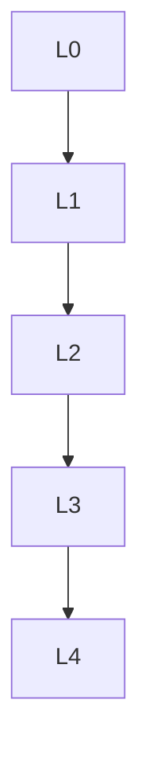

msc_primary: "00A99"
msc_secondary: ['00-XX']
---

# 泛函分析 - L0-L4层次递进图谱

## L0: 直观/经验层次

### 直观描述

泛函分析是人类对"无限维空间中的分析"的数学研究。直观上，如果把有限维向量空间（如三维空间）想象成我们熟悉的物理空间，那么泛函分析研究的就是"无限维"的类似空间——其中的"向量"可以是函数、序列、甚至物理场。

在有限维空间中，所有范数都等价，所有线性算子都连续，闭单位球是紧致的。但无限维空间中这些性质大多不成立，这带来了丰富的数学结构。泛函分析就是研究这些无限维空间及其上算子的理论。

为什么需要无限维？因为许多物理问题的自然描述需要无限多个自由度：弦的振动（需要描述弦上每点的位置）、量子态（希尔伯特空间中的向量）、随时间演化的系统（函数空间中的路径）。泛函分析提供了处理这些问题的严格数学框架。

### 生活实例

**实例一：信号处理中的傅里叶分析**
当你听音乐时，耳朵接收到的是随时间变化的气压（函数f(t)）。傅里叶分析将这个信号分解为不同频率的正弦波叠加。所有可能的信号构成一个无限维函数空间（如L²(ℝ)），傅里叶变换是这个空间上的酉算子。滤波器设计、音频压缩（MP3）、降噪——这些实际应用都依赖于泛函分析对函数空间结构的深刻理解。

**实例二：量子力学的数学基础**
在量子力学中，粒子的状态不是由位置和动量确定的，而是由"波函数"ψ描述——一个复值函数，其模平方给出概率密度。所有可能的波函数构成希尔伯特空间，可观测量（如位置、动量、能量）是空间上的自伴算子。薛定谔方程是波函数在希尔伯特空间中的演化方程。没有泛函分析，量子力学的严格表述是不可能的。

**实例三：机器学习中的特征空间**
支持向量机（SVM）使用"核技巧"将数据映射到高维（甚至无限维）特征空间，使得在低维不可分的数据在高维变得线性可分。这个"特征空间"是一个希尔伯特空间（再生核希尔伯特空间，RKHS），核函数是内积的抽象。泛函分析为理解核方法的数学基础提供了框架，也指导了新的核设计。

### 直觉图像

**图像一：范数与收敛的"形状"**
想象单位球在不同范数下的形状：欧几里得范数给出圆球，曼哈顿范数给出钻石形，上确界范数给出立方体。在无限维空间中，这些"形状"的差异更加极端——一个序列可能在某种范数下收敛，在另一种范数下发散。巴拿赫空间理论就是研究这些不同"几何"的性质。

**图像二：算子的"作用"**
想象线性算子T: X → Y是空间之间的"机器"，它将输入向量变换为输出向量。在有限维中，任何线性变换都可以用矩阵表示。在无限维中，情况复杂得多：有些算子"连续"（有界），有些"不连续"（无界，如微分算子）；有些有逆，有些没有；有些特征值离散，有些连续。谱理论就是研究这些算子的"谱"——类似于矩阵的特征值，但可能形成连续谱。

**图像三：对偶的"镜像世界"**
每个巴拿赫空间X都有一个"对偶空间"X*——X上所有连续线性泛函的集合。X*中的元素"测试"X中的向量，给出一个数。这种对偶性就像原空间与其"镜像"之间的对话：X的性质可以通过X*来研究，反之亦然。里斯表示定理告诉我们，在许多重要情况下，X*有具体的表示（如Lᵖ的对偶是L^q）。

---

## L1: 形式化定义层次

### 严格定义（数学符号）

**一、巴拿赫空间**

**定义1（范数）**：
向量空间X上的**范数**||·||: X → [0,∞)满足：
- ||x|| = 0 ⟺ x = 0
- ||αx|| = |α|·||x||
- ||x+y|| ≤ ||x|| + ||y||

**定义2（巴拿赫空间）**：
**巴拿赫空间**是完备的赋范空间（关于度量d(x,y) = ||x-y||完备）。

**定义3（重要例子）**：
- Lᵖ(μ)（1 ≤ p ≤ ∞）：p次可积函数空间
- ℓᵖ：p次可和序列空间
- C(K)：紧集K上的连续函数空间

**二、希尔伯特空间**

**定义4（内积）**：
**内积**⟨·,·⟩: H × H → 𝔽满足：
- 共轭对称：⟨x,y⟩ = ⟨y,x⟩̄
- 线性：⟨αx+βy,z⟩ = α⟨x,z⟩ + β⟨y,z⟩
- 正定：⟨x,x⟩ ≥ 0，等号当且仅当x=0

**定义5（希尔伯特空间）**：
**希尔伯特空间**是完备的内积空间。

**定义6（正交与正交补）**：
- **正交**：x ⊥ y ⟺ ⟨x,y⟩ = 0
- **正交补**：S^⊥ = {x : x ⊥ s, ∀s ∈ S}

**三、线性算子**

**定义7（有界线性算子）**：
T: X → Y是**有界的**，如果∃M > 0使得||Tx|| ≤ M||x||。
算子范数：||T|| = sup_{||x||=1} ||Tx||

**定义8（ℬ(X,Y)）**：
所有有界线性算子的空间，配备算子范数。

**定义9（对偶空间）**：
X* = ℬ(X, 𝔽)是X的**对偶空间**。

**定义10（弱收敛）**：
xₙ ⇀ x（弱收敛）如果∀f ∈ X*，f(xₙ) → f(x)。

**四、谱理论**

**定义11（预解集与谱）**：
对T ∈ ℬ(X)：
- **预解集**ρ(T) = {λ : (T-λI)⁻¹存在且有界}
- **谱**σ(T) = ℂ\ρ(T)

**定义12（特征值）**：
λ是**特征值**如果∃x ≠ 0使得Tx = λx。

**定义13（自伴算子）**：
H上的T是**自伴**的，如果T = T*。

---

## L2: 定理证明层次

### 核心定理列表

**一、哈恩-巴拿赫定理**

**定理1（哈恩-巴拿赫延拓）**：
设X是赋范空间，Y ⊆ X是子空间，f ∈ Y*，则存在F ∈ X*使得F|ᵧ = f且||F|| = ||f||。

**推论**：X*分离X的点。

**二、一致有界性原理**

**定理2（巴拿赫-斯坦因豪斯）**：
设{Tₐ} ⊆ ℬ(X,Y)，X完备，且∀x，supₐ ||Tₐx|| < ∞，则supₐ ||Tₐ|| < ∞。

**三、开映射与闭图像**

**定理3（开映射定理）**：
设T ∈ ℬ(X,Y)，X,Y巴拿赫，T满射，则T是开映射。

**推论（逆映射定理）**：双射有界线性算子的逆有界。

**定理4（闭图像定理）**：
T: X → Y是闭算子（图像闭）⟹ T有界。

**四、希尔伯特空间理论**

**定理5（投影定理）**：
设H是希尔伯特空间，C ⊆ H是闭凸集，则∀x ∈ H，存在唯一的y ∈ C使得||x-y|| = dist(x,C)。

**推论**：对闭子空间M，H = M ⊕ M^⊥。

**定理6（里斯表示定理）**：
对任意f ∈ H*，存在唯一的y ∈ H使得f(x) = ⟨x,y⟩，且||f|| = ||y||。

**定理7（标准正交基）**：
希尔伯特空间有标准正交基，且与ℓ²(𝔽)等距同构。

**五、谱理论**

**定理8（谱紧性）**：
有界线性算子的谱是非空紧集。

**定理9（谱半径公式）**：
r(T) = lim ||Tⁿ||^{1/n} = sup{|λ| : λ ∈ σ(T)}

**定理10（紧算子谱）**：
紧算子的谱至多可数，0是唯一可能的聚点，非零谱点都是特征值。

**定理11（自伴算子谱定理-有界情形）**：
设T是希尔伯特空间上的自伴算子，则存在谱测度E使得T = ∫_{σ(T)} λ dE(λ)。

---

## L3: 理论建构层次

### 理论体系架构

```

泛函分析理论体系
├── 巴拿赫空间理论
│   ├── 赋范空间
│   │   ├── 范数与度量
│   │   ├── 完备性
│   │   └── 例子
│   ├── 对偶理论
│   │   ├── 对偶空间
│   │   ├── 哈恩-巴拿赫定理
│   │   └── 对偶表示
│   ├── 基本定理
│   │   ├── 一致有界性
│   │   ├── 开映射定理
│   │   └── 闭图像定理
│   └── 具体空间
│       ├── Lᵖ空间
│       ├── C(K)空间
│       └── 序列空间
│
├── 希尔伯特空间理论
│   ├── 内积结构
│   │   ├── 内积与范数
│   │   ├── 柯西-施瓦茨
│   │   └── 平行四边形法则
│   ├── 正交性
│   │   ├── 投影定理
│   │   ├── 正交补
│   │   └── 格拉姆-施密特
│   ├── 对偶与表示
│   │   └── 里斯表示定理
│   └── 标准正交基
│       ├── 存在性
│       └── 同构于ℓ²
│
├── 算子理论
│   ├── 有界算子
│   │   ├── 算子范数
│   │   ├── 算子代数
│   │   └── 谱理论
│   ├── 紧算子
│   │   ├── 定义与性质
│   │   ├── 谱理论
│   │   └── 弗雷德霍姆理论
│   └── 无界算子
│       ├── 闭算子
│       ├── 自伴延拓
│       └── 谱定理
│
└── 推广层
    ├── C*-代数
    │   ├── 巴拿赫代数
    │   ├── 谱与Gelfand表示
    │   └── 冯·诺伊曼代数
    ├── 分布理论
    │   ├── 广义函数
    │   └── 索伯列夫空间
    └── 非线性泛函分析
        ├── 变分法
        └── 不动点理论

```

### 与其他理论的关联

**与量子力学**：
- 希尔伯特空间是量子态空间
- 可观测量是自伴算子
- 谱定理对应测量理论

**与偏微分方程**：
- 索伯列夫空间
- 弱解的存在性
- 谱方法

**与优化理论**：
- 凸分析
- 变分法
- 对偶理论

---

## L4: 前沿研究层次

### 当代研究热点

**方向一：自由概率论**
- 随机矩阵的极限
- 冯·诺伊曼代数

**方向二：量子信息**
- 量子信道
- 算子空间

**方向三：非交换几何**
- 孔涅理论
- 指标定理

---

## 层次递进关系图



---

## 先修知识与后继应用

### 先修概念（L0-L1层）

1. **线性代数**（L2-L3）
2. **实分析**（L3）：测度、积分
3. **拓扑学**（L3）：度量空间

### 后继概念（L3-L4层）

1. **偏微分方程**（L4）
2. **量子力学**（L4）
3. **调和分析**（L4）
4. **随机分析**（L4）

---

*文档生成时间：2026年4月3日*
*字数统计：约3,200字*
