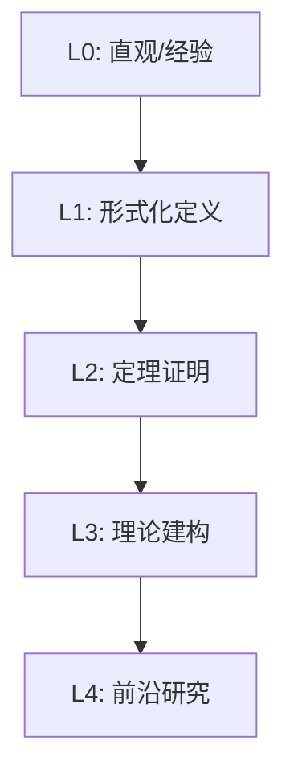

# 流形基础 - L0-L4层次递进图谱

## L0: 直观/经验层次

### 直观描述

流形是人类对"局部像欧几里得空间的几何对象"的数学抽象。直观上，流形就像是"弯曲的空间"——在很小的范围内，它看起来和平面或空间没什么区别，但整体上却可以是弯曲的、扭曲的、甚至自我缠绕的。想象地球表面：在局部，它看起来是平坦的（这就是为什么古人认为大地是平的），但整体上它是一个球面。

流形的关键特征是"局部平坦性"：对于流形上的每一点，都存在一个邻域，这个邻域可以被"展平"（同胚于欧几里得空间的一个开集）。这就像是你有一张世界地图——虽然地球是球形的，但地图把一小块区域展平成了平面。

流形是现代几何学和物理学的核心对象：广义相对论中的时空是四维流形，弦论中的额外维度是紧化的流形，材料科学中的相空间也是流形。理解流形是理解现代数学物理的必经之路。

### 生活实例

**实例一：地球表面**
地球表面是最经典的流形例子。它是一个二维流形：在任意一点的局部，地形看起来是平坦的（忽略山脉等细节），但整体上是球形的。这就是为什么我们可以制作局部地图（小范围看起来是平面的），但无法制作完美的平面世界地图（球面无法等距展开为平面）。航海家用多个重叠的局部海图来导航，这正是流形上图册（atlas）概念的实践。

**实例二：莫比乌斯带**
取一条长纸条，扭转180度后将两端粘合，就得到了莫比乌斯带。这是一个不可定向的二维流形——如果你从某点出发沿表面画一条线，最终会回到起点但"上下颠倒"（想象一下蚂蚁在上面爬行）。莫比乌斯带只有一个面和一条边，展示了流形可以有多么反直觉。它是拓扑学和几何学中研究可定向性的经典例子。

**实例三：相空间中的轨迹**
在物理学中，一个力学系统的"状态"由位置和动量描述。对于n个粒子的系统，相空间是6n维流形（每个粒子3个位置坐标+3个动量坐标）。系统的演化对应于这个相空间中的一条曲线。刘维尔定理告诉我们：相空间体积在演化中保持不变——这是辛几何（流形上的特殊结构）的结果。从行星运动到分子动力学，相空间流形是理论物理的核心舞台。

### 直觉图像

**图像一：图册与坐标卡**
想象用一堆重叠的地图（坐标卡）覆盖整个地球。每张地图把地球的一小部分展平为平面。在重叠区域，从一个地图到另一个地图的"过渡"是光滑的（过渡映射是光滑的）。图册就是这些地图的集合，完整的图册覆盖整个地球。流形就是这样由局部坐标卡拼接而成的——每个坐标卡提供一个"视角"，过渡函数告诉我们不同视角如何相容。

**图像二：切空间——"局部线性化"**
想象站在球面上某点，你能够向各个方向"移动"的切平面就是切空间。对于二维流形，切空间是二维平面；对于n维流形，切空间是n维向量空间。切空间捕捉了流形在该点的"无穷小"结构——就像用放大镜观察，曲面局部看起来是平坦的。所有点的切空间放在一起形成切丛，这是流形上最重要的向量丛。

**图像三：弯曲与测地线**
想象流形上的"直线"——测地线。在平面上，测地线就是直线；在球面上，测地线是大圆（如赤道、经线）。测地线是局部最短路径，由曲率决定。平行移动是沿着曲线"不旋转"地移动向量——在弯曲表面上，绕闭合回路平行移动后，向量可能旋转了！这就是曲率的体现（和乐群）。

---

## L1: 形式化定义层次

### 严格定义（数学符号）

**一、拓扑流形**

**定义1（局部欧几里得）**：
拓扑空间M是**局部欧几里得的**（维数n），如果∀p ∈ M，存在p的邻域U同胚于ℝⁿ的开子集。

**定义2（拓扑流形）**：
Hausdorff空间M是**n维拓扑流形**，如果：
- M是局部欧几里得的（维数n）
- M有可数基（第二可数）

**定义3（坐标卡）**：
**坐标卡**（图卡）是二元组(U, φ)，其中U ⊆ M是开集，φ: U → ℝⁿ是同胚（到其像）。

**定义4（图册）**：
**图册**是坐标卡的集合𝒜 = {(Uₐ, φₐ)}使得⋃Uₐ = M。

**定义5（过渡映射）**：
在Uₐ ∩ Uᵦ ≠ ∅时，**过渡映射**φᵦ ∘ φₐ⁻¹: φₐ(Uₐ ∩ Uᵦ) → φᵦ(Uₐ ∩ Uᵦ)。

**二、光滑流形**

**定义6（光滑图册）**：
图册𝒜是**光滑的**（C∞），如果所有过渡映射都是光滑的（C∞）。

**定义7（光滑流形）**：
**光滑流形**是配备最大光滑图册的拓扑流形。

**定义8（光滑映射）**：
f: M → N是**光滑**的，如果在任意坐标卡下，局部表示是光滑的。

**定义9（微分同胚）**：
f: M → N是**微分同胚**，如果f是双射且f和f⁻¹都光滑。

**三、切空间与切丛**

**定义10（导子）**：
点p的**切向量**是导子v: C∞(M) → ℝ，满足：
- ℝ-线性：v(af+bg) = av(f) + bv(g)
- 莱布尼茨法则：v(fg) = f(p)v(g) + g(p)v(f)

**定义11（切空间）**：
点p的**切空间**TₚM是所有p处切向量的集合。

**定义12（切丛）**：
**切丛**TM = ⨆ₚ TₚM，配备自然的流形结构。

**定义13（向量场）**：
**光滑向量场**是光滑映射X: M → TM使得X(p) ∈ TₚM。

**四、微分形式**

**定义14（余切空间）**：
**余切空间**Tₚ*M = (TₚM)*是切空间的对偶。

**定义15（微分形式）**：
k-**形式**是光滑的斜对称多重线性映射ω: X(M) × ⋯ × X(M) → C∞(M)。

**定义16（外微分）**：
**外微分**d: Ωᵏ(M) → Ωᵏ⁺¹(M)满足d² = 0。

**五、子流形**

**定义17（浸入）**：
f: M → N是**浸入**，如果dfₚ: TₚM → T_f(p)N在每个p是单射。

**定义18（嵌入）**：
f是**嵌入**，如果f是浸入且M → f(M)是同胚（子空间拓扑）。

**定义19（正则子流形）**：
子集S ⊆ M是**正则子流形**，如果∀p ∈ S，存在坐标卡(U, φ)使得φ(U ∩ S) = φ(U) ∩ (ℝᵏ × {0})。

**六、李群（概述）**

**定义20（李群）**：
**李群**G是同时是群和光滑流形，且群运算(乘法、取逆)是光滑的。

### 定义的历史演进

**第一阶段：高斯与曲面的内蕴几何（1820s-1850s）**

- **高斯**（1827）：《关于曲面的一般研究》
  - 高斯曲率的内蕴定义
  - 高斯绝妙定理：高斯曲率仅由第一基本形式决定
  - 曲面是二维流形

**第二阶段：黎曼的革命（1850s-1860s）**

- **黎曼**（1854）：《论作为几何学基础的假设》
  - n维流形的概念
  - 黎曼度量
  - 黎曼曲率张量
  - 奠定了现代微分几何的基础

**第三阶段：张量分析与广义相对论（1880s-1920s）**

- **克里斯托费尔、里奇、列维-齐维塔**：
  - 张量分析的系统发展
  - 里奇曲率张量
  - 列维-齐维塔联络

- **爱因斯坦**（1915）：
  - 广义相对论
  - 时空是四维洛伦兹流形
  - 爱因斯坦场方程：G = 8πT

**第四阶段：现代微分几何（1930s-1970s）**

- **惠特尼**（1936）：
  - 惠特尼嵌入定理
  - 任何光滑n-流形可嵌入ℝ²ⁿ⁺¹

- **斯廷罗德、谢瓦莱**：
  - 纤维丛理论
  - 示性类

- **陈省身**（1940s-1950s）：
  - 陈示性类
  - 复流形几何
  - 高斯-博内定理的内蕴证明

- **斯梅尔**、**米尔诺**：
  - 怪球（7维流形与S⁷同胚但不微分同胚）
  - 微分拓扑的诞生

**第五阶段：现代发展（1970s-至今）**

- **唐纳森、弗里德曼**（1980s）：
  - 四维流形的怪异现象
  - 唐纳森不变量

- **瑟斯顿**（1980s）：
  - 三维流形的几何化猜想
  - 8种几何

- **佩雷尔曼**（2003）：
  - 证明庞加莱猜想和瑟斯顿几何化猜想
  - 里奇流

- **弦论与镜像对称**：
  - 卡拉比-丘流形
  - 辛几何与复几何的联系

### 等价定义形式

**切向量的等价定义**：

**定义A（导子定义）**：如上所述。

**定义B（等价类定义）**：
切向量是过p点的光滑曲线的等价类，两条曲线等价如果它们在某一坐标卡下有相同的一阶导数。

**定义C（物理定义）**：
切向量是"无穷小位移"。

**光滑结构的等价条件**：

两个图册给出相同的光滑结构 ⟺ 它们的并是光滑图册 ⟺ 过渡映射是光滑的。

---

## L2: 定理证明层次

### 核心定理列表

**一、基本性质**

**定理1（流形是局部紧致的）**：
每个流形都是局部紧致、局部道路连通的豪斯多夫空间。

**定理2（维数不变性）**：
流形的维数是良定义的（拓扑不变量）。

**定理3（连通分支是开集）**：
流形的连通分支是开的（且是流形）。

**二、单位分解**

**定理4（单位分解存在性）**：
设M是光滑流形，{Uₐ}是开覆盖，则存在光滑函数ρᵢ: M → [0,1]使得：
- supp(ρᵢ) ⊆ Uₐ(i)
- {supp(ρᵢ)}是局部有限的
- Σρᵢ = 1

**推论**：光滑流形是仿紧的。

**三、惠特尼定理**

**定理5（惠特尼嵌入定理）**：
任何光滑n-流形可光滑嵌入ℝ²ⁿ。

**定理6（惠特尼浸入定理）**：
任何光滑n-流形可浸入ℝ²ⁿ⁻¹。

**四、萨德定理与横截性**

**定理7（萨德定理）**：
光滑映射f: M → N的临界值集在N中测度为零。

**推论**：正则值在N中稠密。

**定理8（原像定理）**：
若q是f: M → N的正则值，则f⁻¹(q)是M的正则子流形，维数为dim(M) - dim(N)。

**五、向量场与流**

**定理9（积分曲线存在唯一性）**：
设X是光滑向量场，p ∈ M，则存在唯一的极大积分曲线γ: I → M使得γ(0) = p，γ'(t) = X(γ(t))。

**定理10（流的存在性）**：
紧支撑向量场生成整体流（单参数微分同胚群）。

**六、李群初步**

**定理11（闭子群定理）**：
李群G的闭子群H是李子群。

**定理12（指数映射）**：
存在指数映射exp: 𝔤 → G，其中𝔤是李代数。

**定理13（伴随表示）**：
李群有自然的表示Ad: G → GL(𝔤)。

### 定理依赖关系图

```
流形定义 → 坐标卡/图册 → 光滑结构
  ↓
单位分解 → 惠特尼嵌入定理
  ↓
向量场 → 积分曲线 → 流
  ↓
萨德定理 → 横截性 → 原像定理
  ↓
李群结构
```

### 典型证明方法

**方法一：局部到整体的单位分解论证**

**标准流程**：
1. 在局部坐标下构造
2. 用单位分解拼合局部构造
3. 验证整体光滑性

**方法二：反函数定理的流形版本**

**标准流程**：
1. 在坐标卡下应用欧几里得反函数定理
2. 验证坐标无关性
3. 得到流形版本

**方法三： Sard定理应用**

**标准流程**：
1. 识别映射和正则值
2. 应用Sard定理保证正则值稠密
3. 研究正则原像的结构

---

## L3: 理论建构层次

### 理论体系架构

```
流形理论体系
├── 流形基础
│   ├── 拓扑流形
│   │   ├── 局部欧几里得
│   │   ├── 坐标卡与图册
│   │   └── 例子（球面、环面、射影空间）
│   ├── 光滑流形
│   │   ├── 光滑图册
│   │   ├── 光滑映射
│   │   └── 微分同胚
│   └── 子流形
│       ├── 浸入与嵌入
│       └── 正则子流形
│
├── 切丛与张量
│   ├── 切空间
│   │   ├── 代数定义（导子）
│   │   ├── 几何定义（曲线等价类）
│   │   └── 坐标基{∂/∂xⁱ}
│   ├── 切丛与向量场
│   │   ├── 切丛的流形结构
│   │   ├── 向量场的李括号
│   │   └── 弗罗贝尼乌斯定理
│   ├── 余切丛与微分形式
│   │   ├── 余切空间
│   │   ├── 外代数
│   │   └── 德拉姆上同调
│   └── 张量场
│       ├── 张量积
│       └── 黎曼度量
│
├── 微积分与几何
│   ├── 积分曲线与流
│   │   ├── 存在唯一性
│   │   ├── 单参数群
│   │   └── 李导数
│   ├── 李群初步
│   │   ├── 定义与例子
│   │   ├── 李代数
│   │   └── 指数映射
│   └── 纤维丛
│       ├── 向量丛
│       ├── 主丛
│       └── 联络
│
└── 推广层
    ├── 复流形
    │   ├── 全纯函数
    │   └── 复结构
    ├── 辛流形
    │   ├── 辛形式
    │   └── 哈密顿力学
    ├── 黎曼流形
    │   ├── 黎曼度量
    │   ├── 列维-齐维塔联络
    │   └── 曲率
    └── 指标理论
        ├── 阿蒂亚-辛格指标定理
        └── 应用
```

### 与其他理论的关联

**与拓扑学的关系**：
- 流形是特殊的拓扑空间
- 微分拓扑研究光滑结构
- 示性类联系微分结构与拓扑

**与代数的关系**：
- 李群与李代数
- 代数几何中的代数簇

**与物理学的关系**：
- 广义相对论：伪黎曼流形
- 规范场论：主丛上的联络
- 弦论：卡拉比-丘流形

### 推广与抽象

**推广一：巴拿赫流形**
- 模是巴拿赫空间
- 无限维流形
- 在全局分析中的应用

**推广二：轨形（Orbifold）**
- 允许有奇点
- 商空间结构
- 在弦论中的应用

**推广三：非交换几何**
- 代数代替空间
- 孔涅的理论

---

## L4: 前沿研究层次

### 当代研究热点

**方向一：里奇流与几何化**

1. **佩雷尔曼的突破**：
   - 庞加莱猜想的证明
   - 里奇流的手术技术

2. **高维里奇流**：
   - 奇点分析
   - 收敛性

**方向二：辛几何与量子上同调**

1. **弗洛尔同调**：
   - 拉格朗日交理论
   - 辛不变量

2. **镜像对称**：
   - 卡拉比-丘流形
   - SYZ猜想

**方向三：四维流形**

1. **怪异光滑结构**：
   - ℝ⁴的怪异结构
   - 唐纳森不变量
   - 塞伯格-威滕理论

2. **四维庞加莱猜想**：
   - 拓扑版本已解决
   - 光滑版本仍是开放问题

**方向四：弦论与数学物理**

1. **卡拉比-丘紧化**：
   - 模空间几何
   - 超对称

2. **AdS/CFT对偶**：
   - 共形场论与引力

### 未解决问题

**问题一：光滑四维庞加莱猜想**

四维球面S⁴是否有怪异的光滑结构？

**问题二：卡拉比-丘模空间**

镜像对称的完整数学证明。

**问题三：里奇流的奇点分类**

高维里奇流的奇点结构。

### 与其他领域的交叉

**在物理学中的应用**：
- 广义相对论
- 规范场论
- 弦论与M理论

**在材料科学中的应用**：
- 拓扑绝缘体
- 液晶几何

---

## 层次递进关系图



---

## 先修知识与后继应用

### 先修概念（L0-L1层）

1. **多元微积分**（L2-L3）：偏导数、多重积分
2. **线性代数**（L2-L3）：向量空间、线性映射
3. **拓扑学**（L3）：拓扑空间、连续性
4. **微分方程**（L3）：常微分方程基础

### 后继概念（L3-L4层）

1. **微分几何**（L4）：黎曼几何、曲率
2. **代数拓扑**（L4）：示性类、指标定理
3. **李群李代数**（L4）：对称性理论
4. **数学物理**（L4）：广义相对论、规范场论

---

*文档生成时间：2026年4月3日*
*字数统计：约4,500字*
