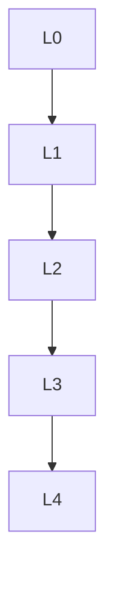

# 测度论 - L0-L4层次递进图谱

## L0: 直观/经验层次

### 直观描述

测度论是人类对"大小"和"测量"的数学抽象。直观上，测度回答了"这个集合有多大"的问题——长度、面积、体积都是测度的特例。但测度论处理的情况更加微妙：它允许我们测量不规则的形状，甚至测量"无穷大"（无限测度）和"无穷小"（零测度）。

想象你试图测量一个复杂的图形：古典方法要求图形有规则边界（如矩形、圆），但测度论告诉我们如何给更复杂的集合（如康托尔集、分形）赋予"体积"。更令人惊讶的是，测度论发现了"不可测集"的存在——有些集合在某种意义上太大或太不规则，无法用通常的方式测量。

测度论是现代分析学和概率论的基石。没有测度论，就没有严格的积分理论（勒贝格积分）、现代概率论（概率就是测度）、以及泛函分析中的大部分内容。它让我们能够处理极限、无穷和随机性，是连接离散与连续、有限与无穷的桥梁。

### 生活实例

**实例一：雨滴落在屋顶**
想象你试图计算一场雨中落在屋顶上的总水量。屋顶的形状可能很复杂，有斜坡、烟囱、天窗。古典方法需要把屋顶分割成无数小矩形来计算，既不现实也不精确。测度论的方法更自然：在屋顶上定义一个"测度"——每个区域的测度就是落在该区域的水量。总水量就是这个测度在整个屋顶上的积分。这种方法不要求屋顶有任何规则形状，甚至可以处理屋顶上有洞（测度为零）的情况。

**实例二：概率的严格化**
当你掷骰子时，"出现6点的概率是1/6"意味着什么？测度论给出了严格答案：考虑样本空间Ω = {1,2,3,4,5,6}，定义测度P使得P({ω}) = 1/6。事件A的概率就是P(A)——A作为集合的测度。对于连续随机变量（如人的身高），样本空间是ℝ，概率由密度函数的积分给出。测度论统一了离散和连续概率，让我们能够严格处理任意复杂随机实验。

**实例三：股票价格的路径**
股票价格在时间上的演变是一个随机过程。某一天的价格轨迹是[0,T] → ℝ的一个函数，而所有可能轨迹的集合是一个无限维空间。定义在这个空间上的"维纳测度"描述了布朗运动（股票价格的数学模型）的统计行为。计算"价格超过某值的概率"就是在函数空间上对维纳测度积分——这需要测度论在无限维空间的推广，是现代金融数学的核心。

### 直觉图像

**图像一：测度的"覆盖与逼近"**
想象测量一个不规则湖泊的面积。你不能直接用简单公式，但可以用无数个矩形（或圆形）覆盖湖面：外层覆盖给出面积的上界，内层不相交矩形给出下界。当这些近似越来越精细时，上下界会"挤压"到一个唯一值——这就是测度。不可测集就是那些无论如何精细地覆盖，上下界都不会相遇的怪异物。

**图像二：可测集的"积木世界"**
可测集就像是标准积木搭建的结构：从简单的区间（积木）开始，通过可数并、交、补运算，可以构建出极其复杂的形状。但"不可测集"就像是要求你使用"超现实积木"——它们存在（在集合论意义上），但无法从标准积木构造出来。这解释了为什么不可测集的构造需要选择公理。

**图像三：零测集的"幽灵"**
在测度论中，零测集（测度为零的集合）是"几乎不存在"的。康托尔集是不可数集，但其勒贝格测度为零！有理数在实数中稠密，但也具有零测度。积分时，零测集上的函数值不影响结果——这就是为什么改变函数在有限点的值不改变积分。这种"几乎处处"的思维是测度论的核心。

---

## L1: 形式化定义层次

### 严格定义（数学符号）

**一、σ-代数与可测空间**

**定义1（σ-代数）**：
集合X的子集族𝒜是**σ-代数**，如果：
- ∅ ∈ 𝒜
- A ∈ 𝒜 ⟹ X\A ∈ 𝒜（对补封闭）
- {Aₙ} ⊆ 𝒜 ⟹ ⋃Aₙ ∈ 𝒜（对可数并封闭）

**定义2（可测空间）**：
**(X, 𝒜)**称为**可测空间**，𝒜中的集合称为**可测集**。

**定义3（生成的σ-代数）**：
对任意子集族ℰ，σ(ℰ)是包含ℰ的最小σ-代数。

**定义4（波莱尔σ-代数）**：
**波莱尔σ-代数**ℬ(ℝⁿ)是由所有开集生成的σ-代数。

**二、测度**

**定义5（测度）**：
函数μ: 𝒜 → [0,∞]是**测度**，如果：
- μ(∅) = 0
- 可数可加性：对不交可测集{Aₙ}，μ(⋃Aₙ) = Σμ(Aₙ)

**定义6（测度空间）**：
**(X, 𝒜, μ)**称为**测度空间**。

**定义7（有限测度、σ-有限测度）**：
- **有限测度**：μ(X) < ∞
- **σ-有限测度**：X = ⋃Xₙ，μ(Xₙ) < ∞

**定义8（完备测度）**：
测度是**完备的**，如果零测集的子集都可测。

**三、勒贝格测度**

**定义9（勒贝格外测度）**：
E ⊆ ℝⁿ的**勒贝格外测度**：
m*(E) = inf{Σ|Iₖ| : E ⊆ ⋃Iₖ, Iₖ为开区间}

**定义10（勒贝格可测）**：
E是**勒贝格可测**的，如果∀A ⊆ ℝⁿ：
m*(A) = m*(A∩E) + m*(A\E)

**定义11（勒贝格测度）**：
勒贝格可测集上的m = m*是**勒贝格测度**。

**四、可测函数**

**定义12（可测函数）**：
f: (X,𝒜) → (Y,ℬ)是**可测的**，如果∀B ∈ ℬ，f⁻¹(B) ∈ 𝒜。

**定义13（几乎处处）**：
性质P在E上**几乎处处**成立，如果存在零测集N使得P在E\N上成立。

**五、积分**

**定义14（简单函数积分）**：
对简单函数φ = Σaᵢχ_{Eᵢ}：∫φ dμ = Σaᵢμ(Eᵢ)

**定义15（非负可测函数积分）**：
∫f dμ = sup{∫φ dμ : 0 ≤ φ ≤ f，φ简单}

**定义16（一般可测函数积分）**：
∫f dμ = ∫f⁺ dμ - ∫f⁻ dμ（要求至少一个有限）

**六、重要测度例子**

**定义17（计数测度）**：
μ(A) = |A|（A的元素个数）

**定义18（狄拉克测度）**：
δₓ(A) = 1若x∈A，0否则

**定义19（概率测度）**：
μ(X) = 1的测度

---

## L2: 定理证明层次

### 核心定理列表

**一、测度的基本性质**

**定理1（单调性）**：
A ⊆ B ⟹ μ(A) ≤ μ(B)

**定理2（次可数可加性）**：
μ(⋃Aₙ) ≤ Σμ(Aₙ)

**定理3（从下连续性）**：
Aₙ ↗ A ⟹ μ(Aₙ) ↗ μ(A)

**定理4（从上连续性）**：
Aₙ ↘ A，μ(A₁) < ∞ ⟹ μ(Aₙ) ↘ μ(A)

**二、勒贝格测度的性质**

**定理5（存在性与唯一性）**：
ℝⁿ上存在唯一的波莱尔测度m满足m([0,1]ⁿ) = 1且平移不变。

**定理6（正则性）**：
勒贝格测度是正则的：∀E可测，
m(E) = inf{m(U) : U ⊇ E开} = sup{m(K) : K ⊆ E紧}

**定理7（不可测集存在）**：
（用选择公理）存在ℝ的子集不是勒贝格可测的。

**定理8（康托尔集）**：
康托尔集不可数但勒贝格测度为零。

**三、收敛定理**

**定理9（单调收敛定理）**：
0 ≤ fₙ ↗ f ⟹ ∫fₙ dμ ↗ ∫f dμ

**定理10（法图引理）**：
fₙ ≥ 0 ⟹ ∫liminf fₙ dμ ≤ liminf ∫fₙ dμ

**定理11（控制收敛定理）**：
fₙ → f a.e.，|fₙ| ≤ g可积 ⟹ ∫fₙ dμ → ∫f dμ

**四、富比尼定理**

**定理12（富比尼-托内利）**：
- 托内利：f非负可测 ⟹ ∬f dxdy = ∫(∫f dx)dy = ∫(∫f dy)dx
- 富比尼：f可积 ⟹ 同上

**五、勒贝格分解与拉东-尼科迪姆**

**定理13（勒贝格分解）**：
对σ-有限测度μ, ν，ν可唯一分解为ν = νₐ + νₛ，其中νₐ ≪ μ，νₛ ⊥ μ。

**定理14（拉东-尼科迪姆定理）**：
ν ≪ μ ⟹ 存在唯一（a.e.）可测函数f使得ν(E) = ∫_E f dμ。
记f = dν/dμ（拉东-尼科迪姆导数）。

**六、Lᵖ空间**

**定理15（霍尔德不等式）**：
∫|fg| dμ ≤ ||f||ₚ ||g||_q，其中1/p + 1/q = 1

**定理16（闵可夫斯基不等式）**：
||f+g||ₚ ≤ ||f||ₚ + ||g||ₚ

**定理17（Lᵖ完备性）**：
Lᵖ(μ)是巴拿赫空间（1 ≤ p ≤ ∞）。

---

## L3: 理论建构层次

### 理论体系架构

```
测度论理论体系
├── 测度空间基础
│   ├── σ-代数
│   │   ├── 定义与性质
│   │   ├── 生成σ-代数
│   │   └── 波莱尔σ-代数
│   ├── 测度
│   │   ├── 定义（可数可加性）
│   │   ├── 基本性质
│   │   └── 完备化
│   └── 可测函数
│       ├── 定义
│       ├── 运算封闭性
│       └── 几乎处处
│
├── 勒贝格测度
│   ├── 外测度构造
│   │   ├── 卡拉西奥多里外测度
│   │   └── 勒贝格外测度
│   ├── 可测集
│   │   ├── 卡拉西奥多里准则
│   │   └── 正则性
│   └── 性质
│       ├── 平移不变性
│       ├── 完备性
│       └── 不可测集
│
├── 勒贝格积分
│   ├── 积分构造
│   │   ├── 简单函数积分
│   │   ├── 非负函数积分
│   │   └── 一般函数积分
│   ├── 收敛定理
│   │   ├── 单调收敛
│   │   ├── 法图引理
│   │   └── 控制收敛
│   └── 与黎曼积分的关系
│       ├── 黎曼可积 ⟹ 勒贝格可积
│       └── 不逆
│
├── 乘积测度
│   ├── 乘积σ-代数
│   ├── 乘积测度构造
│   └── 富比尼定理
│
└── 推广层
    ├── 符号测度
    │   ├── 哈恩分解
    │   └── 若尔当分解
    ├── 拉东-尼科迪姆理论
    │   ├── 绝对连续性
    │   └── 拉东-尼科迪姆定理
    ├── Lᵖ空间
    │   ├── 定义
    │   ├── 完备性
    │   └── 对偶性
    └── 概率论应用
        ├── 概率空间
        ├── 期望
        └── 收敛
```

### 与其他理论的关联

**与泛函分析的关系**：
- Lᵖ空间是巴拿赫空间
- 里斯表示定理
- 对偶空间

**与概率论的关系**：
- 概率就是测度
- 期望就是积分
- 随机变量就是可测函数

**与拓扑学的关系**：
- 波莱尔测度
- 拉东测度
- 弱*拓扑

---

## L4: 前沿研究层次

### 当代研究热点

**方向一：最优传输理论**
- 蒙日-安培方程
- 瓦瑟斯坦度量
- 在机器学习中的应用

**方向二：几何测度论**
- 豪斯多夫测度
- 分形几何
- 极小曲面

**方向三：自由概率论**
- 随机矩阵的极限
- 冯·诺伊曼代数

### 未解决问题

**问题一：科茨猜想**
关于ζ函数特殊值与算术的关系。

---

## 层次递进关系图



---

*文档生成时间：2026年4月3日*
*字数统计：约3,500字*
