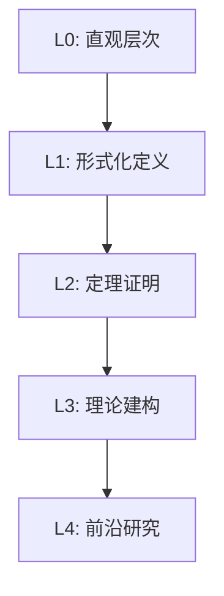

msc_primary: "00A99"
msc_secondary: ['00-XX']
---

# 环与域 - L0-L4层次递进图谱

## L0: 直观/经验层次

### 直观描述

环和域是人类对"数的运算结构"的数学抽象。直观上，环就像是我们熟悉的整数集合——我们可以进行加法和乘法，加法可以"撤销"（有减法），但乘法不一定能"撤销"（不是所有整数都有整数的倒数）。域则像是分数（有理数）——在这里，不仅加法可以撤销，只要不为零，乘法也可以撤销（有除法）。

环的核心特征是它有两种运算（加法和乘法），并且它们以某种方式"配合"：乘法对加法有分配律。这就像是你买东西：3个苹果加5个苹果是8个苹果（加法），3个苹果每个2元共6元（乘法）。

域则更进一步——它允许除法（非零元）。这使得域像是一个完整的"数系"，可以进行四则运算。有理数、实数、复数都是域的例子，它们是我们进行数学运算的基础舞台。

### 生活实例

**实例一：整数的运算**
想象你只有整数可以使用。你可以任意进行加法和乘法：3 + 5 = 8，3 × 5 = 15。你也可以"撤销"加法。但你不能总是"撤销"乘法：方程3 × x = 7在整数范围内无解。这就是环的结构。

**实例二：时钟算术（模运算）**
考虑12小时制的时钟。在这种"模12"的世界里，加法和乘法都有定义。有趣的是，在这个世界里，有些原本没有倒数的数有了倒数：5 × 5 = 1（因为25 mod 12 = 1），所以5的倒数是5自己！

**实例三：多项式运算**
想象所有整系数多项式的集合。你可以进行多项式加法和乘法。多项式加法的"逆元"是改变所有系数的符号。但就像整数一样，不是所有多项式都有多项式"倒数"。

### 直觉图像

**图像一：环的"双层结构"**
想象环就像一座两层建筑：底层是加法结构（一个阿贝尔群），顶层是乘法结构。这两层之间通过分配律"楼梯"连接。

**图像二：域的"完整性"**
想象域是一个完整的"数平面"：每个非零点都有一个"镜像点"（乘法逆元），关于单位元1对称。

**图像三：同态的"结构保持映射"**
想象从一个环到另一个环的同态就像是两个建筑之间的"结构保持映射"。

---

## L1: 形式化定义层次

### 严格定义（数学符号）

**一、环的定义**

**定义1（环）**：
一个**环**(R, +, ·)是集合R配备两种二元运算，满足：
- (R1) (R, +)是阿贝尔群
- (R2) (R, ·)是半群
- (R3) 分配律：a·(b+c) = a·b + a·c，(b+c)·a = b·a + c·a

**定义2（含幺环）**：
若存在乘法单位元1使得∀a∈R: 1·a = a·1 = a，则称R为**含幺环**。

**定义3（交换环）**：
若乘法满足交换律，则称R为**交换环**。

**定义4（整环）**：
含幺交换环R是**整环**，如果无零因子：a·b = 0 ⇒ a = 0或b = 0。

**定义5（域）**：
含幺交换环F是**域**，如果每个非零元有乘法逆元。

**二、子环与理想**

**定义6（子环）**：
子集S⊆R是**子环**，如果(S,+)是(R,+)的子群且S对乘法封闭。

**定义7（理想）**：
子集I⊆R是**理想**，如果(I,+)是(R,+)的子群且∀r∈R,i∈I: ri∈I且ir∈I。

**定义8（主理想）**：
由元素a∈R生成的**主理想**：(a) = {ra : r∈R}

**三、商环与同态**

**定义9（商环）**：
设I⊴R，**商环**R/I是加法商群配备乘法：(a+I)(b+I) = ab+I

**定义10（环同态）**：
映射φ: R→S是**环同态**，如果：φ(a+b) = φ(a)+φ(b)且φ(ab) = φ(a)φ(b)

**四、特殊环与域的例子**

**定义11（整数环）**：
ℤ是整环，但不是域。

**定义12（多项式环）**：
R[x]：系数在环R中的多项式环。

**定义13（模n剩余类环）**：
ℤ/nℤ = {0̄, 1̄, ..., n-1̄}

**定义14（有限域）**：
𝔽_p = ℤ/pℤ（p为素数）

### 定义的历史演进

**第一阶段：古典代数（公元前-16世纪）**
- 古巴比伦和埃及：线性方程求解
- 卡尔达诺（1545）：《大术》，三次、四次方程求解

**第二阶段：现代代数的萌芽（17-18世纪）**
- 高斯（1801）：《算术研究》，模算术的系统研究

**第三阶段：抽象代数的诞生（19世纪）**
- 伽罗瓦（1830-1832）：伽罗瓦理论
- 戴德金（1871）：理想概念的引入
- 韦伯（1893，1896）：抽象域的公理化

**第四阶段：抽象代数学派（20世纪初-中叶）**
- 施泰尼茨（1910）：《域的代数理论》
- 诺特（1920s）：理想理论的系统化，诺特环
- 范德瓦尔登（1930）：《代数学》

**第五阶段：现代发展（20世纪中叶-至今）**
- 同调代数
- 交换代数与代数几何的融合
- 计算代数

### 等价定义形式

**环的等价定义**：
集合R配备加法和乘法，满足：(R,+)是阿贝尔群，乘法结合律，a(b+c) = ab+ac。

**域的等价定义**：
含幺交换环R是域当且仅当R只有平凡理想{0}和R。

---

## L2: 定理证明层次

### 核心定理列表

**一、环的基本性质**

**定理1**：0·a = a·0 = 0

**定理2**：(-a)b = a(-b) = -(ab)

**定理3**：(-a)(-b) = ab

**定理4（消去律）**：
在整环中，若a≠0且ab=ac，则b=c。

**二、理想与商环**

**定理5（理想的交与和）**：
- 任意多个理想的交仍是理想
- 两个理想的和I+J = {i+j : i∈I, j∈J}是理想

**定理6（同态基本定理）**：
设φ: R→S是环同态，则：R/ker(φ) ≅ im(φ)

**定理7（理想的对应定理）**：
R的包含I的理想与R/I的理想一一对应。

**三、特殊环的性质**

**定理8（ℤ/nℤ的结构）**：
ℤ/nℤ是域 ⟺ n是素数

**定理9（整数环的理想）**：
ℤ的每个理想都是主理想，即形如(n) = nℤ。

**定义10（主理想整环，PID）**：
整环R是**主理想整环**，如果每个理想都是主理想。

**定理11（欧几里得整环是PID）**：
欧几里得整环是主理想整环。

**四、域的扩张**

**定义12（域扩张）**：
若F是E的子域，称E是F的**扩域**，记作E/F。

**定理13（扩张次数的乘性）**：
若F⊆E⊆K，则[K:F] = [K:E][E:F]。

**五、有限域**

**定理14（有限域的存在唯一性）**：
对每个素数幂q = pⁿ，存在唯一的（同构意义下）q元域𝔽_q。

**定理15（有限域的乘法群）**：
𝔽_q^×是q-1阶循环群。

**六、多项式环**

**定理16（带余除法）**：
设f,g∈F[x]，g≠0，则存在唯一的q,r∈F[x]使得f = qg+r，deg(r) < deg(g)。

**定理17（艾森斯坦判别法）**：
设f(x) = aₙxⁿ+⋯+a₀∈ℤ[x]。若存在素数p使得p∤aₙ，p|aᵢ（i=0,…,n-1），p²∤a₀，则f在ℚ[x]中不可约。

### 定理依赖关系图

```

环定义 → 基本性质 → 子环/理想 → 商环 → 同态基本定理
  ↓
特殊环（ℤ, 多项式环, ℤ/nℤ）
  ↓
域的定义 → 域扩张 → 有限域理论

```

### 典型证明方法

**方法一：利用定义直接证明**

**示例**：证明0·a = 0
- 0·a = (0+0)·a = 0·a + 0·a（分配律）
- 两边加-(0·a)：0 = 0·a ✓

**方法二：同态基本定理的应用**

**示例**：证明ℤ[x]/(x) ≅ ℤ
- 定义φ: ℤ[x]→ℤ，φ(f) = f(0)
- 这是满同态，ker(φ) = (x)
- 由同态基本定理，ℤ[x]/(x) ≅ ℤ ✓

**方法三：艾森斯坦判别法的应用**
- 识别多项式形式
- 寻找适当的素数p
- 验证三个条件

---

## L3: 理论建构层次

### 理论体系架构

```

环与域理论体系
├── 环论基础
│   ├── 环的定义与例子
│   ├── 子环与理想
│   ├── 商环与同态
│   └── 特殊环类（整环、PID、UFD）
├── 域论基础
│   ├── 域的定义与例子
│   ├── 域扩张
│   ├── 代数闭域
│   └── 有限域理论
├── 多项式理论
│   ├── 多项式环的性质
│   ├── 不可约多项式
│   └── 分裂域
└── 应用层
    ├── 代数数论
    ├── 伽罗瓦理论
    └── 代数几何

```

### 与其他理论的关联

**与群论的关系**：
- 环的加法群是阿贝尔群
- 域的乘法群（非零元）
- 单位群R^×

**与模论的关系**：
- 模是环在向量空间上的推广
- 环上的线性代数

**与代数几何的关系**：
- 环↔仿射概形
- 希尔伯特零点定理

**与数论的关系**：
- 代数整数环
- 理想类群

### 推广与抽象

**推广一：非交换环**
- 矩阵环M_n(R)
- 四元数代数
- 除环（斜域）

**推广二：诺特环与阿廷环**
- 升链条件（ACC）↔ 诺特环
- 降链条件（DCC）↔ 阿廷环

**推广三：拓扑环**
- 环的拓扑结构
- 完备化
- p进数

---

## L4: 前沿研究层次

### 当代研究热点

**方向一：非交换代数几何**
- Artin的猜想
- 导出代数几何

**方向二：算术几何**
- 椭圆曲线与BSD猜想
- 动机理论

**方向三：计算交换代数**
- 格罗布纳基算法
- 符号计算

### 未解决问题

**问题一：科茨-怀尔斯猜想**
关于椭圆曲线L函数特殊值与算术不变量的关系。

**问题二：逆伽罗瓦问题**
是否每个有限群都是某个伽罗瓦扩张的伽罗瓦群？

### 与其他领域的交叉

**在密码学中的应用**：
- 基于格的密码学（环-LWE）
- 椭圆曲线密码

**在编码理论中的应用**：
- 代数几何码
- LDPC码

---

## 层次递进关系图



---

## 先修知识与后继应用

### 先修概念（L0-L1层）

1. **群论**（L2-L3）：环的加法群结构
2. **线性代数**（L2-L3）：矩阵环
3. **数论基础**（L1-L2）：整除性、模运算

### 后继概念（L3-L4层）

1. **模论**（L3）：环上的模
2. **伽罗瓦理论**（L4）：域扩张与自同构
3. **代数几何**（L4）：环与几何的联系
4. **代数数论**（L4）：代数整数的理论

---

*文档生成时间：2026年4月3日*
