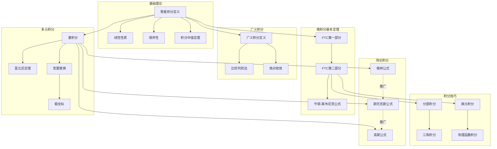
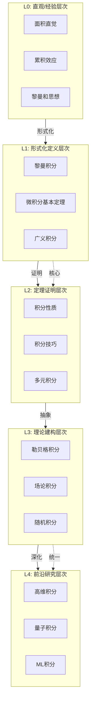
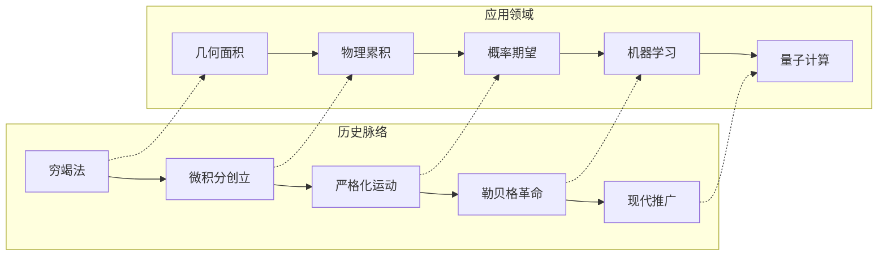

msc_primary: "00A99"
msc_secondary: ['00-XX']
---

# 积分学 - L0-L4层次递进图谱

## L0: 直观/经验层次

### 直观描述

积分是人类对"累积"和"求和"的数学抽象。直观上，定积分可以被想象为计算一条曲线下方区域的"面积"——如果这个区域形状规则（如矩形、三角形），我们可以用简单的几何公式计算；但如果边界是弯曲的，我们就需要更精巧的方法：将区域分割成许多细长的竖条，近似计算每个小条的面积，然后求和。当这些竖条变得越来越细时，这个和的极限就是积分。

积分的另一个直观图像是"累积效应"。想象水以变化的流量注入水池：要计算一段时间内注入的总水量，不能简单用平均流量乘以时间，而需要对瞬时流量进行积分。这种"连续求和"的思想让积分成为物理、工程和经济等领域中描述累积过程的核心工具。

微积分基本定理揭示了一个深刻的联系：积分和微分是互逆的运算——对一个函数先积分再微分（或先微分再积分），你会回到原来的函数（相差一个常数）。这个发现统一了看似不同的两个问题：求面积（积分）和求变化率（微分）。

### 生活实例

**实例一：计算不规则地块的面积**
想象你要计算一块不规则形状土地的面积。传统方法是用皮尺测量边界，但这对于弯曲边界很困难。一个更聪明的方法是：将土地划分成许多狭长的条带，每个条带近似看作梯形或矩形，计算每个小条的面积后相加。当条带宽度趋于零时，这个和的极限就是土地的精确面积——这就是黎曼积分的直观起源。

**实例二：汽车行驶的总路程**
一辆汽车行驶，速度表不断显示瞬时速度。要计算从时间$a$到$b$行驶的总路程，如果速度恒定，直接$路程 = 速度 \times 时间$即可。但速度是变化的，这时可以：将时间分成许多小段，每小段内用平均速度近似，计算每小段的近似路程后相加。当时间段划分得越来越细时，这个和的极限就是总路程，数学表达为$\int_a^b v(t)dt$。

**实例三：水库的蓄水量变化**
一座水库有多条河流流入，流量随时间变化。要计算一天内流入的总水量，不能简单用瞬时流量乘以24小时。正确的方法是：将一天分成许多小时段，每小时内流量近似恒定，计算每小时的近似水量后求和。当时间段趋于无穷小时，这个和的极限就是精确的总水量。这正是积分在流体力学中的典型应用。

### 直觉图像

**图像一：黎曼和的逼近过程**
想象函数曲线$y = f(x)$下方的区域。将其分割成$n$个等宽的竖条，每个竖条的宽度为$\Delta x = (b-a)/n$。在每个小区间$[x_{i-1}, x_i]$内取一点$\xi_i$，以$f(\xi_i)$为高、$\Delta x$为宽的矩形近似该条带的面积。所有矩形面积之和$\sum_{i=1}^n f(\xi_i)\Delta x$就是黎曼和。当$n \to \infty$时，这些矩形"填满"曲线下的区域，和的极限就是定积分。

**图像二：微积分基本定理的直观**
想象一个"面积函数"$A(x)$表示从$a$到$x$曲线下的面积。当$x$增加一个微小量$dx$时，面积增量$dA$近似等于高为$f(x)$、宽为$dx$的矩形面积，即$dA \approx f(x)dx$。因此$\frac{dA}{dx} \approx f(x)$，当$dx \to 0$时，$A'(x) = f(x)$。这说明"面积函数"的导数就是被积函数——微分和积分是互逆运算。

**图像三：正负面积的抵消**
当函数值有正有负时，积分计算的是"有向面积"——x轴上方的面积为正，下方的面积为负。想象曲线在x轴上下摆动，积分结果表示"净面积"，上方的贡献被下方的贡献抵消。如果要计算总面积（不考虑符号），需要取绝对值后积分。

---

## L1: 形式化定义层次

### 严格定义（数学符号）

**一、黎曼积分**

**定义1（分割）**：
区间$[a, b]$的**分割**$P$是有限点集$P = \{x_0, x_1, \ldots, x_n\}$，满足$a = x_0 < x_1 < \cdots < x_n = b$。

分割的**模**（mesh）：$\|P\| = \max_{1 \leq i \leq n} (x_i - x_{i-1})$

**定义2（黎曼和）**：
设$f: [a, b] \to \mathbb{R}$，$P$是分割，$\xi_i \in [x_{i-1}, x_i]$是取样点。**黎曼和**：
$$S(f, P, \xi) = \sum_{i=1}^n f(\xi_i)(x_i - x_{i-1})$$

**定义3（黎曼可积）**：
函数$f$在$[a, b]$**黎曼可积**，如果存在数$I$使得：
$$\forall \varepsilon > 0, \exists \delta > 0, \forall P: \|P\| < \delta \Rightarrow |S(f, P, \xi) - I| < \varepsilon$$

$I$称为$f$在$[a, b]$的**定积分**，记作$\int_a^b f(x)dx$。

**定义4（达布上和与达布下和）**：
$$U(f, P) = \sum_{i=1}^n M_i(x_i - x_{i-1}), \quad M_i = \sup_{x \in [x_{i-1}, x_i]} f(x)$$
$$L(f, P) = \sum_{i=1}^n m_i(x_i - x_{i-1}), \quad m_i = \inf_{x \in [x_{i-1}, x_i]} f(x)$$

**定理**：$f$黎曼可积当且仅当$\inf_P U(f, P) = \sup_P L(f, P)$。

**二、不定积分与原函数**

**定义5（原函数）**：
函数$F$称为$f$在区间$I$上的**原函数**，如果$F' = f$在$I$上成立。

**定义6（不定积分）**：
$\int f(x)dx = F(x) + C$，其中$F$是$f$的一个原函数，$C$是任意常数。

**三、微积分基本定理**

**定理7（微积分基本定理第一部分）**：
设$f$在$[a, b]$连续，定义$F(x) = \int_a^x f(t)dt$，则$F$在$[a, b]$可导，且$F'(x) = f(x)$。

**定理8（微积分基本定理第二部分）**：
设$f$在$[a, b]$连续，$F$是$f$的原函数，则：
$$\int_a^b f(x)dx = F(b) - F(a) = F(x)\big|_a^b$$

**四、广义积分**

**定义9（无穷区间积分）**：
$$\int_a^{+\infty} f(x)dx = \lim_{b \to +\infty} \int_a^b f(x)dx$$

**定义10（无界函数积分）**：
若$f$在$c \in [a, b]$附近无界：
$$\int_a^b f(x)dx = \lim_{\varepsilon \to 0^+} \int_a^{c-\varepsilon} f(x)dx + \lim_{\varepsilon \to 0^+} \int_{c+\varepsilon}^b f(x)dx$$

**五、重积分**

**定义11（二重积分）**：
设$f: D \subseteq \mathbb{R}^2 \to \mathbb{R}$，$D$是有界闭区域。将$D$分割成小区域$D_i$，在每个$D_i$取点$(\xi_i, \eta_i)$：
$$\iint_D f(x,y)dA = \lim_{\|P\| \to 0} \sum_{i} f(\xi_i, \eta_i) \cdot \text{Area}(D_i)$$

**定义12（累次积分）**：
若$D = \{(x,y): a \leq x \leq b, \phi_1(x) \leq y \leq \phi_2(x)\}$，则：
$$\iint_D f(x,y)dA = \int_a^b \left(\int_{\phi_1(x)}^{\phi_2(x)} f(x,y)dy\right)dx$$

**六、曲线积分与曲面积分**

**定义13（第一类曲线积分）**：
$$\int_C f ds = \int_a^b f(\gamma(t))\|\gamma'(t)\|dt$$

其中$\gamma: [a, b] \to \mathbb{R}^n$是曲线$C$的参数化。

**定义14（第二类曲线积分）**：
$$\int_C \mathbf{F} \cdot d\mathbf{r} = \int_a^b \mathbf{F}(\gamma(t)) \cdot \gamma'(t)dt$$

**定义15（曲面积分）**：
$$\iint_S f dS = \iint_D f(\mathbf{r}(u,v))\|\mathbf{r}_u \times \mathbf{r}_v\|dudv$$

### 定义的历史演进

**第一阶段：古代萌芽（前3世纪-17世纪初）**

- **欧多克索斯和阿基米德**（前3世纪）：穷竭法
  - 用多边形逼近圆和抛物线弓形
  - 计算球的体积和表面积
  - 螺线所围面积

- **中国古代**：刘徽的割圆术（3世纪）
  - 用3072边形逼近$\pi$
  - 牟合方盖的体积计算

- **开普勒**（1615）：《酒桶新立体几何》
  - 用无穷小方法计算体积
  - 将圆视为无穷多个小三角形

- **卡瓦列里**（1635）：不可分量原理
  - "幂同则体同"原则
  - 将立体视为无穷多个平面的叠加

**第二阶段：微积分创立（1660s-1700s）**

- **牛顿**（1660s-1687）：流数法
  - 将积分视为"反微分"
  - 《自然哲学的数学原理》中的面积计算
  - 认识到微分和积分的互逆关系

- **莱布尼茨**（1670s-1714）：积分符号的创立
  - 长s符号$\int$（源自拉丁文summa）
  - 系统性发展积分技巧
  - 积分表
  - 1686年发表第一篇积分学论文

- **优先权之争**：牛顿与莱布尼茨关于微积分发明权的争论

**第三阶段：严格化准备（1700s-1820s）**

- **欧拉**（1748，1768）：积分学系统化
  - 《无穷分析引论》
  - 《积分学原理》（三卷）
  - 发展了各种积分技巧

- **拉格朗日、拉普拉斯、勒让德**：变分法和特殊函数
  - 拉格朗日乘子法
  - 拉普拉斯变换
  - 勒让德多项式

- **傅里叶**（1807，1822）：傅里叶级数
  - 将函数表示为三角级数
  - 热传导方程
  - 引发了对积分严格性的需求

**第四阶段：严格化完成（1820s-1900s）**

- **柯西**（1823）：积分的严格定义
  - 将积分定义为和的极限
  - 连续函数必可积

- **黎曼**（1854）：《论用三角级数表示函数的可能性》
  - 黎曼积分的精确定义
  - 黎曼可积的充要条件
  - 黎曼函数（不连续但可积）

- **达布**（1875）：达布和的理论

- **康托尔和史密斯**：不可测集的构造（1880s-1890s）
  - 引发对积分理论的反思

- **勒贝格**（1902）：《积分、长度与面积》
  - 勒贝格积分的革命性定义
  - 基于测度论
  - 更广泛的函数类可积

**第五阶段：现代发展（1900s-至今）**

- **勒贝格积分的发展**：
  - $L^p$空间理论
  - 泛函分析的基础

- **广义函数理论**（施瓦茨，1945-1950）：
  - 分布的积分
  - 狄拉克$\delta$函数的严格化

- **随机积分**（伊藤，1940s）：
  - 伊藤积分
  - 随机微分方程

- **非标准分析中的积分**（鲁滨逊，1961）：
  - 无穷小方法

- **数值积分方法**：
  - 蒙特卡洛积分
  - 高斯求积

### 等价定义形式

**积分的等价定义**：

**定义A（网收敛定义）**：
将分割看作有向集，黎曼和形成一个网。$f$可积当且仅当该网收敛。

**定义B（振幅判别法）**：
设$\omega_i = M_i - m_i$是$f$在$[x_{i-1}, x_i]$上的振幅。$f$可积当且仅当：
$$\lim_{\|P\| \to 0} \sum_{i=1}^n \omega_i(x_i - x_{i-1}) = 0$$

**可积性条件**：

| 条件 | 函数类 | 证明方法 |
|------|--------|----------|
| 连续 | 闭区间上的连续函数 | 一致连续性 |
| 单调 | 闭区间上的单调函数 | 振幅估计 |
| 有限间断 | 只有有限个间断点的有界函数 | 黎曼可积条件 |
| 零测间断 | 间断点集为零测集的函数 | 勒贝格判别法 |

**定理（勒贝格判别法）**：
有界函数$f$在$[a, b]$黎曼可积当且仅当$f$的间断点集是零测集。

---

## L2: 定理证明层次

### 核心定理列表

**一、积分基本性质**

**定理1（线性性）**：
若$f, g$可积，$c$为常数，则：

- $\int_a^b (f + g) = \int_a^b f + \int_a^b g$
- $\int_a^b (cf) = c\int_a^b f$

**定理2（区间可加性）**：
若$f$在包含$a, b, c$的区间上可积，则：
$$\int_a^b f + \int_b^c f = \int_a^c f$$

**定理3（保号性）**：
若$f \geq 0$在$[a, b]$上，则$\int_a^b f \geq 0$。

**推论**：若$f \leq g$，则$\int_a^b f \leq \int_a^b g$。

**定理4（积分中值定理）**：
若$f$在$[a, b]$连续，则$\exists c \in [a, b]$：
$$f(c) = \frac{1}{b-a}\int_a^b f(x)dx$$
右边称为$f$在$[a, b]$上的**平均值**。

**定理5（柯西-施瓦茨不等式）**：
$$\left(\int_a^b fg\right)^2 \leq \left(\int_a^b f^2\right)\left(\int_a^b g^2\right)$$

**二、微积分基本定理的深化**

**定理6（微积分基本定理第一部分，加强版）**：
设$f$在$[a, b]$可积，定义$F(x) = \int_a^x f(t)dt$。则：

- $F$在$[a, b]$连续
- 若$f$在$c$连续，则$F$在$c$可导且$F'(c) = f(c)$

**定理7（分部积分公式）**：
设$u, v$在$[a, b]$有连续导数，则：
$$\int_a^b u(x)v'(x)dx = u(x)v(x)\big|_a^b - \int_a^b u'(x)v(x)dx$$

或写成：$\int u \, dv = uv - \int v \, du$

**定理8（换元积分公式）**：
设$f$连续，$\varphi$有连续导数，则：
$$\int_a^b f(\varphi(x))\varphi'(x)dx = \int_{\varphi(a)}^{\varphi(b)} f(u)du$$

**三、积分技巧**

**定理9（有理函数积分）**：
任何有理函数$P(x)/Q(x)$的积分可以表示为：

- 多项式部分
- 对数函数（来自线性因子）
- 反正切函数（来自不可约二次因子）

**定理10（三角函数积分）**：
对$\int R(\sin x, \cos x)dx$，可用万能代换$u = \tan(x/2)$：
$$\sin x = \frac{2u}{1+u^2}, \quad \cos x = \frac{1-u^2}{1+u^2}, \quad dx = \frac{2du}{1+u^2}$$

**定理11（无理函数积分）**：
对含$\sqrt{ax^2 + bx + c}$的积分，可用欧拉代换转化为有理函数积分。

**四、广义积分判别法**

**定理12（比较判别法）**：
若$0 \leq f \leq g$，$\int_a^{+\infty} g$收敛，则$\int_a^{+\infty} f$收敛。

**定理13（p-积分判别法）**：
$$\int_1^{+\infty} \frac{1}{x^p}dx \text{收敛} \iff p > 1$$
$$\int_0^1 \frac{1}{x^p}dx \text{收敛} \iff p < 1$$

**定理14（绝对收敛与条件收敛）**：
若$\int_a^{+\infty} |f|$收敛，则$\int_a^{+\infty} f$收敛（绝对收敛）。

**定理15（狄利克雷判别法）**：
若$F(x) = \int_a^x f$有界，$g$单调且$\lim_{x \to +\infty} g(x) = 0$，则$\int_a^{+\infty} fg$收敛。

**五、重积分理论**

**定理16（富比尼定理）**：
设$f$在矩形$R = [a, b] \times [c, d]$上可积，则：
$$\iint_R f(x,y)dA = \int_a^b \left(\int_c^d f(x,y)dy\right)dx = \int_c^d \left(\int_a^b f(x,y)dx\right)dy$$
（要求内层积分存在）

**定理17（变量替换公式）**：
设$T: D \to D'$是坐标变换，$f$在$D'$上连续，则：
$$\iint_{D'} f(u,v)dudv = \iint_D f(T(x,y))\left|\frac{\partial(u,v)}{\partial(x,y)}\right|dxdy$$

其中$\frac{\partial(u,v)}{\partial(x,y)}$是雅可比行列式。

**极坐标变换**：
$$\iint_D f(x,y)dxdy = \iint_D f(r\cos\theta, r\sin\theta) \cdot r \, drd\theta$$

**六、曲线积分与场论**

**定理18（格林公式）**：
设$D$是平面有界闭区域，边界$C$是分段光滑的简单闭曲线，$P, Q$在$D$上有连续偏导数，则：
$$\oint_C Pdx + Qdy = \iint_D \left(\frac{\partial Q}{\partial x} - \frac{\partial P}{\partial y}\right)dA$$

**定理19（斯托克斯公式）**：
设$S$是有向光滑曲面，边界$C$是分段光滑曲线，$\mathbf{F}$在包含$S$的区域内有连续偏导数，则：
$$\oint_C \mathbf{F} \cdot d\mathbf{r} = \iint_S (\nabla \times \mathbf{F}) \cdot d\mathbf{S}$$

**定理20（高斯公式/散度定理）**：
设$V$是空间有界闭区域，边界$S$是分片光滑闭曲面，$\mathbf{F}$在$V$上有连续偏导数，则：
$$\iint_S \mathbf{F} \cdot d\mathbf{S} = \iiint_V (\nabla \cdot \mathbf{F})dV$$

### 定理依赖关系图



### 典型证明方法

**方法一：黎曼和的直接计算**

**标准流程**：

1. 构造分割和取样点
2. 写出黎曼和表达式
3. 计算和的极限

**示例**：用定义计算$\int_0^1 x dx$

- 分割：$x_i = i/n$，$\xi_i = x_i = i/n$
- 黎曼和：$\sum_{i=1}^n \frac{i}{n} \cdot \frac{1}{n} = \frac{1}{n^2}\sum_{i=1}^n i = \frac{n(n+1)}{2n^2} = \frac{1}{2} + \frac{1}{2n}$
- 极限：$\lim_{n \to \infty} (\frac{1}{2} + \frac{1}{2n}) = \frac{1}{2}$✓

**方法二：利用微积分基本定理**

**标准流程**：

1. 找到被积函数的原函数$F$
2. 计算$F(b) - F(a)$

**示例**：计算$\int_0^{\pi} \sin x dx$

- 原函数：$F(x) = -\cos x$
- $F(\pi) - F(0) = -(-1) - (-1) = 2$✓

**方法三：分部积分**

**标准流程**：

1. 选择$u$和$dv$
2. 计算$du$和$v$
3. 应用分部积分公式

**示例**：计算$\int x e^x dx$

- 设$u = x$，$dv = e^x dx$
- $du = dx$，$v = e^x$
- $\int x e^x dx = xe^x - \int e^x dx = xe^x - e^x + C = e^x(x-1) + C$✓

**方法四：换元积分**

**标准流程**：

1. 选择适当的代换$u = \varphi(x)$
2. 计算$du = \varphi'(x)dx$
3. 换限并计算新积分

**示例**：计算$\int_0^{\pi/2} \sin^2 x \cos x dx$

- 设$u = \sin x$，$du = \cos x dx$
- 当$x=0$时$u=0$；当$x=\pi/2$时$u=1$
- $\int_0^1 u^2 du = \frac{u^3}{3}\big|_0^1 = \frac{1}{3}$✓

**方法五：富比尼定理应用**

**标准流程**：

1. 画出积分区域
2. 确定积分限
3. 化为累次积分
4. 逐层计算

**方法六：格林/斯托克斯/高斯公式**

**标准流程**：

1. 识别曲线/曲面积分的类型
2. 验证公式条件
3. 转化为区域积分
4. 计算重积分

---

## L3: 理论建构层次

### 理论体系架构

```

积分学理论体系
├── 基础层
│   ├── 黎曼积分
│   │   ├── 分割与黎曼和
│   │   ├── 可积性条件
│   │   └── 基本性质
│   ├── 不定积分
│   │   ├── 原函数概念
│   │   ├── 基本积分表
│   │   └── 积分常数
│   └── 微积分基本定理
│       ├── FTC第一部分（微分）
│       └── FTC第二部分（计算）
│
├── 技巧层
│   ├── 积分技巧
│   │   ├── 换元积分法
│   │   ├── 分部积分法
│   │   ├── 有理函数积分
│   │   ├── 三角函数积分
│   │   └── 无理函数积分
│   ├── 广义积分
│   │   ├── 无穷区间积分
│   │   ├── 无界函数积分
│   │   └── 敛散性判别
│   └── 积分应用
│       ├── 面积计算
│       ├── 体积计算
│       ├── 弧长计算
│       ├── 物理应用
│       └── 概率应用
│
├── 多元层
│   ├── 重积分
│   │   ├── 二重积分
│   │   ├── 三重积分
│   │   ├── 变量替换
│   │   └── 极坐标/柱坐标/球坐标
│   ├── 曲线积分
│   │   ├── 第一类曲线积分（标量场）
│   │   └── 第二类曲线积分（向量场）
│   └── 曲面积分
│       ├── 第一类曲面积分
│       └── 第二类曲面积分
│
└── 推广层
    ├── 勒贝格积分
    │   ├── 测度论基础
    │   ├── 可测函数
    │   ├── 勒贝格积分定义
    │   └── L^p空间
    ├── 广义函数积分
    │   └── 分布的积分
    └── 随机积分
        ├── 伊藤积分
        └── 随机微分方程

```

### 与其他理论的关联

**与微分学的关系**：

微积分基本定理统一了微分和积分：

- 积分是微分的逆运算（相差常数）
- 微分学提供了计算积分的工具（原函数）
- 分部积分和换元来自微分法则

**与测度论的关系**：

勒贝格积分建立在测度论基础之上：

- 测度是长度、面积、体积的推广
- 勒贝格积分处理更广泛的函数类
- $L^p$空间理论

**与泛函分析的关系**：

积分在泛函分析中扮演核心角色：

- 希尔伯特空间$L^2$
- 巴拿赫空间$L^p$
- 线性泛函的表示（里斯表示定理）

**与概率论的关系**：

概率论建立在积分理论之上：

- 期望：$E[X] = \int X dP$
- 概率密度函数
- 特征函数

**与微分几何的关系**：

曲线和曲面上的积分：

- 曲率积分
- 高斯-博内定理
- 德拉姆上同调

### 推广与抽象

**推广一：勒贝格积分**

黎曼积分的局限性：

- 可积函数类较小
- 极限与积分交换条件苛刻

勒贝格积分的优势：

- 基于测度而非分割
- 更广泛的函数类可积
- 控制收敛定理等强大工具

**推广二：抽象测度空间上的积分**

设$(X, \mathcal{F}, \mu)$是测度空间，$f$是可测函数：
$$\int_X f d\mu = \lim_{n \to \infty} \int_X \phi_n d\mu$$
其中$\phi_n$是简单函数逼近$f$。

**推广三：随机积分**

伊藤积分：
$$\int_0^t H_s dW_s$$
其中$W_s$是布朗运动。

- 随机微分方程
- 金融数学

**推广四：分数阶积分**

黎曼-刘维尔分数阶积分：
$$I^\alpha f(x) = \frac{1}{\Gamma(\alpha)} \int_0^x (x-t)^{\alpha-1}f(t)dt$$

**推广五：非标准分析中的积分**

在超实数框架下，积分可以表示为：
$$\int_a^b f(x)dx = st\left(\sum_{i=1}^N f(x_i^*)\Delta x\right)$$
其中$N$是无限大整数，$\Delta x$是无穷小。

---

## L4: 前沿研究层次

### 当代研究热点

**方向一：不确定性量化**

1. **高维积分**：
   - 高斯过程积分
   - 拟蒙特卡洛方法
   - 稀疏网格方法

2. **贝叶斯推断**：
   - 后验分布的积分
   - 马尔可夫链蒙特卡洛（MCMC）
   - 变分推断

**方向二：机器学习中的积分**

1. **神经正切核（NTK）**：
   - 无限宽神经网络的积分表示
   - 泛化误差分析

2. **归一化流**：
   - 变量替换公式的深度学习应用
   - 密度估计

**方向三：量子计算与积分**

1. **量子积分算法**：
   - 量子振幅估计
   - 量子蒙特卡洛的二次加速

2. **变分量子算法**：
   - 参数化量子电路的期望积分

**方向四：平均场理论**

1. **平均场博弈**：
   - 大量智能体的最优控制
   - 福克-普朗克方程

2. **神经网络平均场极限**：
   - 梯度下降的连续极限
   - 平均场神经ODE

### 未解决问题

**问题一：高维积分的有效计算**

维度灾难：

- 传统方法在高维失效
- 蒙特卡洛方法收敛慢
- 寻找更好的高维积分方法

**问题二：最优求积公式**

对给定光滑性类别的函数：

- 最优取样点分布
- 最优权重
- 与信息复杂性理论的联系

**问题三：量子积分的实际优势**

量子算法理论上提供二次加速：

- 实际噪声量子设备上的优势
- 应用问题的适用性

### 与其他领域的交叉

**积分学在机器学习中的应用**：

1. **贝叶斯深度学习**：
   - 后验分布的近似
   - 变分推断中的期望计算

2. **生成模型**：
   - 归一化流的可逆变换
   - 变分自编码器的证据下界

3. **强化学习**：
   - 值函数的积分表示
   - 策略梯度

**在物理学中的应用**：

1. **量子场论**：
   - 路径积分
   - 费曼图计算

2. **统计力学**：
   - 配分函数
   - 热力学量的计算

3. **广义相对论**：
   - 爱因斯坦-希尔伯特作用量
   - 时空积分

**在工程学中的应用**：

1. **有限元方法**：
   - 弱形式中的积分
   - 数值积分规则

2. **计算流体力学**：
   - 守恒律的积分形式
   - 有限体积法

---

## 层次递进关系图





---

## 先修知识与后继应用

### 先修概念（L0-L1层）

**数学先修**：

1. **极限理论**（L2）：积分定义的基础
2. **连续函数**（L2）：可积性条件
3. **导数概念**（L2-L3）：微积分基本定理
4. **多元函数**（L2）：重积分基础

**具体先修概念清单**：

| 概念 | 层次 | 在积分学中的作用 |
|------|------|-----------------|
| 函数极限 | L2 | 黎曼和的极限 |
| 连续性 | L2 | 可积性充分条件 |
| 导数 | L2-L3 | 原函数、FTC |
| 微分中值定理 | L3 | 积分中值定理 |
| 多元函数 | L2 | 重积分基础 |

### 后继概念（L3-L4层）

**直接后继**：

1. **微分方程**（L3-L4）
   - 积分因子法
   - 常数变易法

2. **复分析**（L3-L4）
   - 复积分
   - 留数定理

3. **概率论**（L3-L4）
   - 期望和方差
   - 特征函数

**间接后继**：

1. **泛函分析**（L4）
   - $L^p$空间
   - 算子理论

2. **偏微分方程**（L4）
   - 能量方法
   - 格林函数

3. **微分几何**（L4）
   - 曲率积分
   - 斯托克斯定理

**应用后继**：

| 应用领域 | 使用的层次 | 具体应用 |
|----------|------------|----------|
| 物理学 | L2-L4 | 功、能量、质心 |
| 工程学 | L2-L3 | 结构分析、信号处理 |
| 概率论 | L3-L4 | 期望、密度函数 |
| 机器学习 | L3-L4 | 变分推断、归一化流 |
| 金融数学 | L3-L4 | 期权定价 |

---

## 学习建议与反思

### 学习路径建议

**初学者路径**（L0→L2）：

1. 从面积和累积建立积分直觉
2. 掌握黎曼和的计算
3. 熟练使用微积分基本定理
4. 掌握基本积分技巧

**进阶路径**（L2→L3）：

1. 学习多元积分
2. 掌握格林/斯托克斯/高斯公式
3. 了解勒贝格积分的概念
4. 学习广义积分理论

**研究路径**（L3→L4）：

1. 深入学习勒贝格积分
2. 了解随机积分
3. 关注高维积分方法
4. 探索量子积分算法

### 哲学反思

积分学触及深刻的认识论问题：

1. **连续求和的悖论**：如何将无穷多个无穷小量"相加"得到有限值？
2. **面积的实在性**：曲线下的面积是客观存在还是数学构造？
3. **微分与积分的统一**：为什么这两个看似无关的运算互逆？
4. **严格化的代价**：勒贝格积分比黎曼积分更强大，但失去了什么？

积分学是连接离散与连续、局部与整体、静态与动态的桥梁，是理解累积和总量的数学语言。

---

*文档生成时间：2026年4月3日*
*字数统计：约5,500字*
