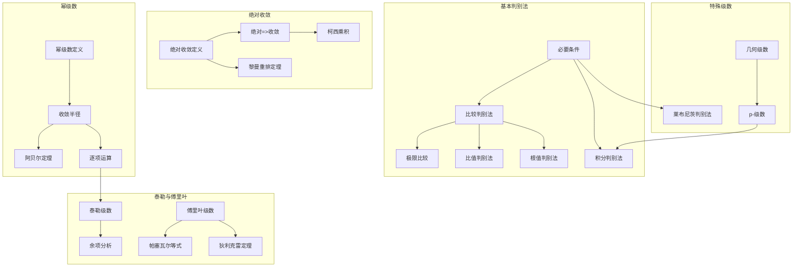
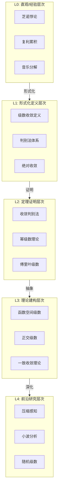

msc_primary: "00A99"
msc_secondary: ['00-00']
---

# 级数理论 - L0-L4层次递进图谱

## L0: 直观/经验层次

### 直观描述

级数是人类对"无限求和"的数学抽象。直观上，级数可以被想象为一个人走向一堵墙的过程：第一步走一半距离，第二步走剩下距离的一半，第三步再走剩下的一半……理论上，这个人永远到达不了墙，但他与墙的距离可以无限接近于零。数学上，这些步长构成的无限序列的和是1（即总距离），这就是最简单的级数——几何级数。

级数的核心问题是"收敛性"：当我们把无穷多个数"相加"时，这个"和"是否存在？如果存在，如何计算？有些级数收敛到一个有限值（如$1 + \frac{1}{2} + \frac{1}{4} + \cdots = 2$），有些则发散到无穷（如$1 + 1 + 1 + \cdots$），还有些似乎在有限值之间振荡而不确定。

级数理论让我们能够将复杂的函数表示为简单函数（如多项式、三角函数）的无限和——这就是幂级数和傅里叶级数的威力。这种"分解-重组"的思想是数学分析中最强大的工具之一。

### 生活实例

**实例一：复利投资**
假设你投资1元，年利率100%。如果每年复利一次，一年后你有2元；每半年复利一次，一年后有$(1 + 1/2)^2 = 2.25$元；每季度复利一次，有$(1 + 1/4)^4 \approx 2.44$元；每天复利一次，有$(1 + 1/365)^{365} \approx 2.71$元。当复利频率无限增加时，金额趋近于$e \approx 2.71828$。这个极限过程可以用指数函数的级数展开理解：$e^x = 1 + x + \frac{x^2}{2!} + \frac{x^3}{3!} + \cdots$。

**实例二：芝诺悖论的现代解释**
芝诺的"二分法"悖论声称：从A点走到B点，必须先走到中点；从A走到中点，又必须先走到那个区间的中点……这样无限进行下去，似乎永远到不了B点。级数理论告诉我们：如果每段距离所需时间相应减半，总时间是有限的。设总距离为1，第一段耗时$1/2$，第二段$1/4$，第三段$1/8$……总时间$= 1/2 + 1/4 + 1/8 + \cdots = 1$，完全可以在有限时间内到达！

**实例三：音乐与傅里叶级数**
任何复杂的音乐声都可以分解为不同频率正弦波的叠加。傅里叶级数就是这一原理的数学表达：周期函数可以表示为正弦和余弦函数的无限和。小提琴的音色由基频和一系列谐波组成，每个谐波的强度由傅里叶系数决定。级数理论让工程师能够分析和合成复杂的声波。

### 直觉图像

**图像一：无穷级数的"堆积"**
想象将一系列矩形块堆叠起来，每个块的面积对应级数的一项。如果级数收敛，这些块的总面积会趋于一个有限值——你可以想象一个"天花板"将所有块包含在内。如果级数发散，无论你堆多高，总面积总是可以超过任何界限——没有天花板能够包含所有块。

**图像二：部分和序列的"目标"**
级数的部分和$S_n = a_1 + a_2 + \cdots + a_n$可以看作一个"追逐者"在数轴上移动。如果级数收敛，这个追逐者会越来越接近某个"目标点"（极限值），虽然可能永远达不到。收敛速度告诉我们追逐者接近目标有多快。

**图像三：函数的"分解与重建"**
想象用乐高积木搭建复杂模型。幂级数就像是把函数分解成无限多个"幂次积木"（$1, x, x^2, x^3, \ldots$），而傅里叶级数则像分解成"振动积木"（正弦和余弦函数）。级数理论告诉我们：在什么条件下，这种无限分解能够精确重建原函数。

---

## L1: 形式化定义层次

### 严格定义（数学符号）

**一、级数的基本定义**

**定义1（无穷级数）**：
设$(a_n)_{n=1}^{\infty}$是实数（或复数）序列，**无穷级数**定义为形式和：
$$\sum_{n=1}^{\infty} a_n = a_1 + a_2 + a_3 + \cdots$$

**定义2（部分和）**：
第$N$个**部分和**：$S_N = \sum_{n=1}^{N} a_n$

**定义3（级数的收敛）**：
级数$\sum a_n$**收敛**于$S$，如果$\lim_{N \to \infty} S_N = S$。
若极限不存在或为$\pm\infty$，则称级数**发散**。

**定义4（绝对收敛）**：
级数$\sum a_n$**绝对收敛**，如果$\sum |a_n|$收敛。

**定义5（条件收敛）**：
级数$\sum a_n$**条件收敛**，如果它收敛但不绝对收敛。

**二、重要级数类型**

**定义6（几何级数）**：
$\sum_{n=0}^{\infty} ar^n = a + ar + ar^2 + \cdots$

**定义7（p-级数）**：
$\sum_{n=1}^{\infty} \frac{1}{n^p}$

**定义8（调和级数）**：
$\sum_{n=1}^{\infty} \frac{1}{n} = 1 + \frac{1}{2} + \frac{1}{3} + \cdots$（$p=1$的p-级数）

**定义9（交错级数）**：
$\sum_{n=1}^{\infty} (-1)^{n-1}a_n$（其中$a_n > 0$）

**定义10（幂级数）**：
$\sum_{n=0}^{\infty} c_n(x-a)^n = c_0 + c_1(x-a) + c_2(x-a)^2 + \cdots$

**三、收敛判别法**

**定义11（柯西收敛准则）**：
级数$\sum a_n$收敛当且仅当：
$$\forall \varepsilon > 0, \exists N, \forall m > n > N: \left|\sum_{k=n+1}^{m} a_k\right| < \varepsilon$$

**四、函数项级数**

**定义12（点态收敛）**：
函数项级数$\sum f_n(x)$在点$x$**点态收敛**于$f(x)$，如果：
$$\lim_{N \to \infty} \sum_{n=1}^{N} f_n(x) = f(x)$$

**定义13（一致收敛）**：
$\sum f_n$在集合$D$上**一致收敛**于$f$，如果：
$$\forall \varepsilon > 0, \exists N, \forall n > N, \forall x \in D: \left|\sum_{k=1}^{n} f_k(x) - f(x)\right| < \varepsilon$$

**定义14（傅里叶级数）**：
周期为$2\pi$的函数$f$的**傅里叶级数**：
$$f(x) \sim \frac{a_0}{2} + \sum_{n=1}^{\infty} (a_n \cos nx + b_n \sin nx)$$
其中$a_n = \frac{1}{\pi}\int_{-\pi}^{\pi} f(x)\cos nx \, dx$，$b_n = \frac{1}{\pi}\int_{-\pi}^{\pi} f(x)\sin nx \, dx$。

### 定义的历史演进

**第一阶段：古代萌芽（前5世纪-17世纪初）**

- **芝诺悖论**（约前450年）：首次系统讨论无穷级数
  - "阿基里斯"悖论
  - "二分法"悖论
  - 对无穷概念的哲学探讨

- **亚里士多德**：反对实无穷，只接受潜无穷

- **阿基米德**（前3世纪）：几何级数的应用
  - 求抛物线弓形面积
  - 使用无穷级数思想，但用穷竭法严格化

- **中世纪印度数学家**：
  - 玛达瓦（14世纪）：正弦和余弦的级数展开
  - 发现$\arctan x = x - \frac{x^3}{3} + \frac{x^5}{5} - \cdots$

**第二阶段：早期发展（1600s-1700s）**

- **詹姆斯·格雷戈里**（1671）：
  - 函数的泰勒级数展开
  - $\tan^{-1}x$的级数

- **牛顿**（1660s-1700s）：
  - 二项式级数展开
  - $(1+x)^\alpha$的级数
  - 正弦、余弦、指数函数的级数

- **莱布尼茨**（1674）：
  - 莱布尼茨级数：$\frac{\pi}{4} = 1 - \frac{1}{3} + \frac{1}{5} - \frac{1}{7} + \cdots$
  - 交错级数判别法的雏形

- **欧拉**（1707-1783）：级数理论的集大成者
  - $e^{ix} = \cos x + i\sin x$（欧拉公式，1748）
  - 巴塞尔问题：$\sum_{n=1}^{\infty} \frac{1}{n^2} = \frac{\pi^2}{6}$（1735）
  - 使用发散级数得到正确结果
  - $\sum_{n=0}^{\infty} n!$的发散级数研究

**第三阶段：严格化时期（1800s）**

- **傅里叶**（1807，1822）：傅里叶级数
  - 《热的解析理论》
  - 任意函数可以表示为三角级数
  - 引发对函数概念和收敛性的重新思考

- **柯西**（1821）：级数理论的严格化
  - 收敛的$\varepsilon$-$N$定义
  - 收敛判别法系统发展
  - 柯西乘积

- **阿贝尔**（1826）：
  - 关于二项式级数的论文
  - 阿贝尔定理：幂级数在收敛区间端点的连续性
  - 阿贝尔判别法和狄利克雷判别法

- **狄利克雷**（1829）：
  - 傅里叶级数收敛的第一个严格证明
  - 狄利克雷条件

**第四阶段：现代发展（1850s-至今）**

- **魏尔斯特拉斯**（1841，1872）：
  - 一致收敛概念
  - 处处连续处处不可导函数（1872）
  - 用一致收敛的函数项级数构造

- **黎曼**（1854）：
  - 黎曼重排定理
  - 三角级数的唯一性

- **康托尔**（1870s）：
  - 从傅里叶级数研究出发创立集合论
  - 三角级数唯一性问题的研究

- **切萨罗**（1890）：切萨罗求和
  - 发散级数的广义求和

- **现代发展**：
  - 函数空间中的级数（希尔伯特空间、巴拿赫空间）
  - 小波级数
  - 随机级数

### 等价定义形式

**收敛的等价刻画**：

**定义A（柯西条件）**：
$\sum a_n$收敛当且仅当部分和序列是柯西序列。

**定义B（余项趋于零）**：
$\sum a_n$收敛当且仅当余项$R_N = \sum_{n=N+1}^{\infty} a_n \to 0$当$N \to \infty$。

**级数运算的等价形式**：

| 运算 | 条件 | 公式 |
|------|------|------|
| 加法 | 都收敛 | $\sum (a_n + b_n) = \sum a_n + \sum b_n$ |
| 数乘 | 级数收敛 | $\sum (ca_n) = c\sum a_n$ |
| 重排 | 绝对收敛 | 和不变 |
| 乘积 | 都绝对收敛 | 柯西乘积公式 |

---

## L2: 定理证明层次

### 核心定理列表

**一、基本判别法**

**定理1（级数收敛的必要条件）**：
若$\sum a_n$收敛，则$\lim_{n \to \infty} a_n = 0$。

**逆不成立**：调和级数$\sum \frac{1}{n}$发散，尽管$\frac{1}{n} \to 0$。

**定理2（几何级数）**：
$\sum_{n=0}^{\infty} ar^n$收敛当且仅当$|r| < 1$，且和为$\frac{a}{1-r}$。

**定理3（p-级数判别法）**：
$\sum_{n=1}^{\infty} \frac{1}{n^p}$收敛当且仅当$p > 1$。

- $p = 1$：调和级数，发散
- $p = 2$：$\sum \frac{1}{n^2} = \frac{\pi^2}{6}$（巴塞尔问题）

**定理4（比较判别法）**：
设$0 \leq a_n \leq b_n$对充分大的$n$：
- 若$\sum b_n$收敛，则$\sum a_n$收敛
- 若$\sum a_n$发散，则$\sum b_n$发散

**定理5（极限比较判别法）**：
设$a_n, b_n > 0$，若$\lim_{n \to \infty} \frac{a_n}{b_n} = L \in (0, +\infty)$，则$\sum a_n$和$\sum b_n$同敛散。

**定理6（比值判别法/达朗贝尔判别法）**：
设$a_n > 0$，$\lim_{n \to \infty} \frac{a_{n+1}}{a_n} = L$：
- 若$L < 1$，则$\sum a_n$收敛
- 若$L > 1$，则$\sum a_n$发散
- 若$L = 1$，判别法失效

**定理7（根值判别法/柯西判别法）**：
设$a_n \geq 0$，$\lim_{n \to \infty} \sqrt[n]{a_n} = L$：
- 若$L < 1$，则$\sum a_n$收敛
- 若$L > 1$，则$\sum a_n$发散
- 若$L = 1$，判别法失效

**定理8（积分判别法）**：
设$f$在$[1, +\infty)$上非负递减，则$\sum_{n=1}^{\infty} f(n)$与$\int_1^{\infty} f(x)dx$同敛散。

**二、交错级数判别法**

**定理9（莱布尼茨判别法）**：
设$(a_n)$是递减正数序列且$\lim_{n \to \infty} a_n = 0$，则交错级数$\sum (-1)^{n-1}a_n$收敛。

**误差估计**：$|S - S_N| \leq a_{N+1}$

**定理10（阿贝尔判别法）**：
若$\sum a_n$收敛，$(b_n)$单调有界，则$\sum a_n b_n$收敛。

**定理11（狄利克雷判别法）**：
若$\sum a_n$的部分和有界，$(b_n)$单调趋于零，则$\sum a_n b_n$收敛。

**三、绝对收敛与条件收敛**

**定理12（绝对收敛蕴含收敛）**：
若$\sum |a_n|$收敛，则$\sum a_n$收敛。

**定理13（黎曼重排定理）**：
若$\sum a_n$条件收敛，则对任意实数$S$（包括$\pm\infty$），存在重排使得重排后的级数收敛于$S$。

**定理14（绝对收敛级数的重排不变性）**：
若$\sum a_n$绝对收敛于$S$，则任意重排后仍收敛于$S$。

**定理15（柯西乘积）**：
若$\sum a_n$和$\sum b_n$都绝对收敛，则它们的柯西乘积$\sum c_n$（其中$c_n = \sum_{k=0}^{n} a_k b_{n-k}$）绝对收敛，且：
$$\sum_{n=0}^{\infty} c_n = \left(\sum_{n=0}^{\infty} a_n\right)\left(\sum_{n=0}^{\infty} b_n\right)$$

**四、幂级数理论**

**定理16（收敛半径）**：
幂级数$\sum c_n(x-a)^n$的收敛域是以$a$为中心的区间（可能退化为单点或整个$\mathbb{R}$）。

**收敛半径**：$R = \frac{1}{\limsup_{n \to \infty} \sqrt[n]{|c_n|}}$（柯西-阿达马公式）

**定理17（幂级数的性质）**：
设$\sum c_n(x-a)^n$的收敛半径$R > 0$，则：
- 在$(a-R, a+R)$内绝对收敛
- 在任意$[a-r, a+r]$（$r < R$）上一致收敛
- 和函数$S(x)$在$(a-R, a+R)$内连续
- 可逐项积分：$\int S(x)dx = \sum \frac{c_n}{n+1}(x-a)^{n+1} + C$
- 可逐项求导：$S'(x) = \sum nc_n(x-a)^{n-1}$

**定理18（阿贝尔定理）**：
若$\sum c_n R^n$收敛，则$\sum c_n x^n$在$x = R$处左连续。

**五、泰勒级数**

**定理19（泰勒定理）**：
设$f$在包含$a$的区间上有$n+1$阶导数，则：
$$f(x) = \sum_{k=0}^{n} \frac{f^{(k)}(a)}{k!}(x-a)^k + R_n(x)$$

**定理20（泰勒级数收敛的充要条件）**：
$f$在$a$处可展开为泰勒级数当且仅当$\lim_{n \to \infty} R_n(x) = 0$。

**定理21（常见函数的麦克劳林级数）**：
- $e^x = \sum_{n=0}^{\infty} \frac{x^n}{n!}$，$R = +\infty$
- $\sin x = \sum_{n=0}^{\infty} (-1)^n \frac{x^{2n+1}}{(2n+1)!}$，$R = +\infty$
- $\cos x = \sum_{n=0}^{\infty} (-1)^n \frac{x^{2n}}{(2n)!}$，$R = +\infty$
- $\ln(1+x) = \sum_{n=1}^{\infty} (-1)^{n-1}\frac{x^n}{n}$，$R = 1$
- $(1+x)^\alpha = \sum_{n=0}^{\infty} \binom{\alpha}{n}x^n$，$R = 1$

**六、傅里叶级数**

**定理22（狄利克雷收敛定理）**：
设$f$是以$2\pi$为周期的分段光滑函数，则其傅里叶级数在每点$x$收敛于$\frac{f(x^+) + f(x^-)}{2}$。在连续点收敛于$f(x)$。

**定理23（帕塞瓦尔等式）**：
$$\frac{1}{\pi}\int_{-\pi}^{\pi} |f(x)|^2 dx = \frac{a_0^2}{2} + \sum_{n=1}^{\infty} (a_n^2 + b_n^2)$$

**定理24（一致收敛）**：
若$f$连续、分段光滑且$f(-\pi) = f(\pi)$，则其傅里叶级数一致收敛于$f$。

**定理25（费耶定理）**：
傅里叶级数的切萨罗和一致收敛于连续函数。

### 定理依赖关系图



### 典型证明方法

**方法一：比较判别法的应用**

**标准流程**：
1. 识别级数类型
2. 选择适当的比较级数
3. 验证比较条件
4. 得出结论

**示例**：判断$\sum \frac{1}{n^2+1}$的敛散性
- 与$\sum \frac{1}{n^2}$比较
- $\frac{1}{n^2+1} < \frac{1}{n^2}$
- $\sum \frac{1}{n^2}$收敛（p-级数，$p=2>1$）
- 因此$\sum \frac{1}{n^2+1}$收敛✓

**方法二：比值判别法的应用**

**标准流程**：
1. 写出$\frac{a_{n+1}}{a_n}$
2. 计算极限$L = \lim_{n \to \infty} \frac{a_{n+1}}{a_n}$
3. 根据$L$的大小判断

**示例**：判断$\sum \frac{n!}{n^n}$的敛散性
- $\frac{a_{n+1}}{a_n} = \frac{(n+1)!}{(n+1)^{n+1}} \cdot \frac{n^n}{n!} = \frac{(n+1)n^n}{(n+1)^{n+1}} = \frac{n^n}{(n+1)^n} = \left(\frac{n}{n+1}\right)^n = \frac{1}{(1+1/n)^n} \to \frac{1}{e} < 1$
- 因此级数收敛✓

**方法三：积分判别法的应用**

**标准流程**：
1. 构造函数$f(x)$对应级数项
2. 验证$f$非负递减
3. 计算$\int_1^{\infty} f(x)dx$
4. 根据积分敛散判断级数敛散

**方法四：幂级数收敛半径的计算**

**标准流程**：
1. 计算$\limsup_{n \to \infty} \sqrt[n]{|c_n|}$或$\lim_{n \to \infty} |\frac{c_{n+1}}{c_n}|$

2. 收敛半径$R$为上述极限的倒数
3. 单独检验端点

**方法五：傅里叶系数的计算**

**标准流程**：
1. 确定函数的周期和奇偶性
2. 利用奇偶性简化系数计算
3. 计算$a_n$和$b_n$的积分
4. 写出傅里叶级数

**方法六：一致收敛的证明**

**标准流程**：
1. 使用魏尔斯特拉斯M判别法
2. 或直接使用定义
3. 验证$\sup_x |S_n(x) - S(x)| \to 0$

---

## L3: 理论建构层次

### 理论体系架构

```

级数理论体系
├── 基础层
│   ├── 级数概念
│   │   ├── 无穷级数定义
│   │   ├── 部分和序列
│   │   └── 收敛与发散
│   ├── 基本性质
│   │   ├── 线性性质
│   │   ├── 重排
│   │   └── 乘积
│   └── 收敛必要条件
│       └── 通项趋于零
│
├── 判别法层
│   ├── 正项级数判别法
│   │   ├── 比较判别法
│   │   ├── 比值判别法
│   │   ├── 根值判别法
│   │   └── 积分判别法
│   ├── 交错级数判别法
│   │   └── 莱布尼茨判别法
│   └── 一般级数判别法
│       ├── 绝对收敛判别
│       ├── 阿贝尔判别法
│       └── 狄利克雷判别法
│
├── 收敛类型层
│   ├── 绝对收敛
│   │   ├── 定义与性质
│   │   └── 重排不变性
│   ├── 条件收敛
│   │   ├── 黎曼重排定理
│   │   └── 典型例子
│   └── 一致收敛
│       ├── 定义
│       ├── M判别法
│       └── 极限交换定理
│
├── 特殊级数层
│   ├── 幂级数
│   │   ├── 收敛半径
│   │   ├── 逐项运算
│   │   └── 泰勒展开
│   ├── 傅里叶级数
│   │   ├── 傅里叶系数
│   │   ├── 收敛定理
│   │   └── 帕塞瓦尔等式
│   └── 其他特殊级数
│       ├── 几何级数
│       └── p-级数
│
└── 推广层
    ├── 函数空间级数
    │   ├── 巴拿赫空间级数
    │   └── 希尔伯特空间级数
    ├── 随机级数
    │   └── 随机收敛
    └── 发散级数求和
        ├── 切萨罗求和
        └── 阿贝尔求和

```

### 与其他理论的关联

**与极限理论的关系**：

级数收敛本质上是部分和序列的收敛：
- 柯西收敛准则的直接应用
- 级数是序列极限理论的延伸

**与积分学的关系**：

积分判别法连接级数和积分：
- 积分判别法
- 级数与积分的相互转化

**与微分学的关系**：

幂级数提供函数的无穷次可微表示：
- 泰勒级数是微分学的重要应用
- 逐项求导需要一致收敛

**与泛函分析的关系**：

级数在无限维空间中的推广：
- 巴拿赫空间中的级数
- 正交级数（傅里叶级数）
- 无条件收敛

**与复分析的关系**：

复幂级数（泰勒级数、洛朗级数）：
- 解析函数的幂级数表示
- 收敛圆
- 孤立奇点的分类

**与调和分析的关系**：

傅里叶级数是调和分析的基础：
- 周期函数的分解
- $L^2$理论
- 小波分析

### 推广与抽象

**推广一：函数空间中的级数**

巴拿赫空间$X$中的级数$\sum x_n$：
- 绝对收敛：$\sum \|x_n\| < \infty$

- 无条件收敛：任意重排收敛（在有限维等价于绝对收敛，在无限维严格弱于绝对收敛）

**推广二：正交级数**

希尔伯特空间中的正交级数：
$$x = \sum_{n=1}^{\infty} \langle x, e_n \rangle e_n$$
- 傅里叶级数是特例
- 贝塞尔不等式、帕塞瓦尔等式

**推广三：发散级数的广义求和**

切萨罗求和：$\lim_{n \to \infty} \frac{S_1 + S_2 + \cdots + S_n}{n}$

阿贝尔求和：$\lim_{x \to 1^-} \sum a_n x^n$

**推广四：随机级数**

$\sum X_n$，其中$X_n$是随机变量：
- 几乎必然收敛
- 均方收敛
- 概率收敛

---

## L4: 前沿研究层次

### 当代研究热点

**方向一：压缩感知**

1. **稀疏表示**：
   - 信号在某种基下的稀疏展开
   - $l_1$最小化重构

2. **随机矩阵理论**：
   - 限制等距性质（RIP）
   - 随机傅里叶采样

**方向二：小波分析**

1. **多分辨率分析**：
   - 小波级数展开
   - 快速小波变换

2. **应用**：
   - 图像压缩（JPEG 2000）
   - 信号去噪

**方向三：随机傅里叶级数**

1. **随机级数的性质**：
   - 几乎必然收敛
   - 随机连续性

2. **在概率论中的应用**：
   - 布朗运动的级数表示
   - 随机过程的构造

**方向四：p进傅里叶分析**

1. **局部域上的调和分析**：
   - p进群上的傅里叶级数
   - 在数论和密码学中的应用

### 未解决问题

**问题一：傅里叶级数的点态收敛**

对于$L^1$函数：
- 傅里叶级数是否几乎处处收敛？
- 卡尔松定理（1966）证明了$L^2$情形
- $L^1$情形仍是开放问题

**问题二：随机级数的精细性质**

高斯级数的零点分布：
- 随机三角多项式的零点
- 与随机矩阵的联系

### 与其他领域的交叉

**级数理论在机器学习中的应用**：

1. **核方法**：
   - 核函数的级数展开
   - 再生核希尔伯特空间

2. **深度学习**：
   - 神经正切核（NTK）的级数表示
   - 神经网络的函数逼近

3. **谱方法**：
   - 基于傅里叶级数的PDE求解

**在物理学中的应用**：

1. **量子力学**：
   - 微扰理论的级数展开
   - 费曼图展开

2. **统计力学**：
   - 配分函数的展开
   - 高温展开、低温展开

3. **场论**：
   - 重整化群的级数方法

**在信号处理中的应用**：

1. **频谱分析**：
   - DFT和FFT
   - 谱估计

2. **滤波器设计**：
   - FIR和IIR滤波器
   - 窗函数方法

---

## 层次递进关系图



---

## 先修知识与后继应用

### 先修概念（L0-L1层）

1. **序列极限**（L2）：级数收敛的基础
2. **函数概念**（L1）：函数项级数的基础
3. **积分学**（L2-L3）：积分判别法、傅里叶系数
4. **微分学**（L2-L3）：泰勒级数

### 后继概念（L3-L4层）

1. **复分析**（L3-L4）：幂级数、洛朗级数
2. **泛函分析**（L4）：希尔伯特空间、正交级数
3. **调和分析**（L4）：傅里叶分析深化
4. **偏微分方程**（L4）：特征函数展开

---

*文档生成时间：2026年4月3日*
*字数统计：约4,800字*
