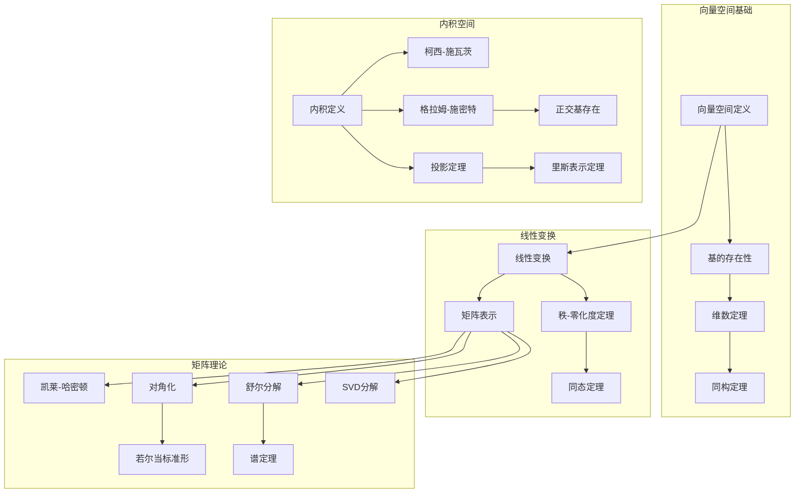
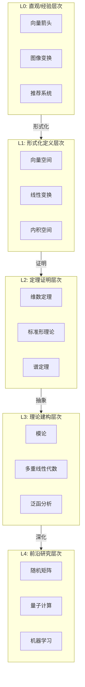

# 线性代数 - L0-L4层次递进图谱

## L0: 直观/经验层次

### 直观描述

线性代数是人类对"线性关系"的数学抽象。直观上，线性就像是直线——均匀、可预测、没有弯曲。如果你每小时赚50元，工作3小时赚150元，工作5小时赚250元，这就是线性关系：输出与输入成正比。线性代数研究多个变量之间的线性关系，以及保持这种线性关系的变换。

想象一个二维平面：每个点可以用两个坐标$(x, y)$表示。一个"线性变换"就像是将平面上的每个点按照某个规则"移动"到新位置，但要保持直线的"直"——直线变换后仍是直线，原点保持不变。矩阵就是这种线性变换的"密码"，矩阵乘法描述了变换的组合。

线性代数的核心对象是向量（有方向和大小的量）和矩阵（数字排列成的矩形阵列）。向量空间是向量的"家园"——一个在其中可以进行向量加法和数乘的集合。线性代数让我们能够在高维空间中"看见"和"操作"，是现代科学、工程、计算机和数据分析的基础语言。

### 生活实例

**实例一：图像的变换**
想象你用手机拍照后旋转、缩放或剪切图片。这些操作都是线性变换：旋转保持形状不变只是改变方向；缩放改变大小但保持形状；剪切让矩形变成平行四边形。每张照片可以看作数百万像素的排列（一个巨大的向量），图像处理软件使用矩阵乘法来高效地对这些像素进行变换。没有线性代数，现代图像处理是不可能的。

**实例二：交通流量的建模**
想象一个城市的道路网络，有多个入口和出口。我们可以建立线性方程组来描述流量平衡：每个路口流入等于流出。假设入口A流入100辆车，入口B流入200辆，出口C流出150辆，出口D流出多少辆？设出口D流出$x$辆，根据守恒定律：$100 + 200 = 150 + x$，解得$x = 150$。更复杂的网络需要解更大的线性方程组，这正是线性代数的用武之地。

**实例三：推荐系统的运作**
当你使用Netflix或淘宝时，推荐系统试图猜测你可能喜欢什么。一种方法是"协同过滤"：找到与你品味相似的用户，推荐他们喜欢的东西。数学上，这涉及矩阵分解——将巨大的用户-物品评分矩阵分解为两个较小矩阵的乘积，揭示隐藏的"主题"或"因素"。这种矩阵分解技术是线性代数在数据科学中最成功的应用之一。

### 直觉图像

**图像一：向量作为"箭头"**
想象向量就像是从原点出发的箭头：二维向量是平面上的箭头，三维向量是空间中的箭头。向量加法就像把两个箭头首尾相连，结果是"从起点到终点"的箭头。数乘就像拉伸或压缩箭头（负数会反向）。向量空间就是这个箭头世界的"舞台"——其中所有可能的箭头以及它们之间的运算。

**图像二：矩阵变换的"网格变形"**
想象在坐标平面上画一个网格。矩阵变换就像是"推"或"拉"这个网格：直线变成直线（可能倾斜），网格方块变成平行四边形。单位矩阵保持一切不变；对角矩阵沿坐标轴拉伸；旋转矩阵旋转网格；投影矩阵将网格"压扁"到某个子空间。行列式告诉我们变换如何改变面积（二维）或体积（三维）。

**图像三：特征向量作为"不变方向"**
想象变换后某些特殊的向量只是被拉伸或压缩，方向不变——这些就是特征向量。旋转矩阵的特征向量沿旋转轴方向；缩放矩阵的所有向量都是特征向量。特征值告诉我们拉伸的倍数。对角化就像是找到一组"自然的"坐标轴，使变换看起来只是简单的拉伸——在这些坐标下矩阵是对角矩阵。

---

## L1: 形式化定义层次

### 严格定义（数学符号）

**一、向量空间**

**定义1（向量空间/线性空间）**：
设$F$是域，**向量空间**$V$是配备两种运算的集合：
- 加法：$V \times V \to V$，$(u, v) \mapsto u + v$
- 数乘：$F \times V \to V$，$(c, v) \mapsto cv$

满足公理：
- $(V, +)$是阿贝尔群
- $c(u + v) = cu + cv$（分配律）
- $(c + d)v = cv + dv$（分配律）
- $c(dv) = (cd)v$（结合律）
- $1v = v$（单位元）

**定义2（子空间）**：
子集$W \subseteq V$是**子空间**，如果：
- $W$对加法封闭
- $W$对数乘封闭

**定义3（线性组合）**：
向量$v_1, \ldots, v_n$的**线性组合**：
$$c_1v_1 + c_2v_2 + \cdots + c_nv_n, \quad c_i \in F$$

**定义4（张成空间）**：
集合$S \subseteq V$的**张成空间**：
$$\text{span}(S) = \{\text{所有}S\text{中向量的有限线性组合}\}$$

**定义5（线性无关）**：
向量$v_1, \ldots, v_n$**线性无关**，如果：
$$c_1v_1 + \cdots + c_nv_n = 0 \Rightarrow c_1 = \cdots = c_n = 0$$

**定义6（基）**：
集合$B \subseteq V$是**基**，如果：
- $B$线性无关
- $\text{span}(B) = V$

**定义7（维数）**：
向量空间$V$的**维数**$\dim(V)$是任意基的元素个数。

**二、线性变换**

**定义8（线性变换）**：
映射$T: V \to W$是**线性变换**，如果：
- $T(u + v) = T(u) + T(v)$
- $T(cv) = cT(v)$

等价地：$T(cu + dv) = cT(u) + dT(v)$

**定义9（矩阵表示）**：
设$T: V \to W$，$B = \{v_1, \ldots, v_n\}$是$V$的基，$C = \{w_1, \ldots, w_m\}$是$W$的基。
$$T(v_j) = \sum_{i=1}^{m} a_{ij}w_i$$
矩阵$[T]_{B}^{C} = (a_{ij})$是$T$关于基$B, C$的**矩阵表示**。

**定义10（核与像）**：
- **核**：$\ker(T) = \{v \in V : T(v) = 0\}$
- **像**：$\text{im}(T) = \{T(v) : v \in V\}$

**三、矩阵理论**

**定义11（矩阵运算）**：
- **加法**：$(A + B)_{ij} = A_{ij} + B_{ij}$
- **数乘**：$(cA)_{ij} = cA_{ij}$
- **乘法**：$(AB)_{ij} = \sum_{k} A_{ik}B_{kj}$

**定义12（转置与共轭转置）**：
- **转置**：$(A^T)_{ij} = A_{ji}$
- **共轭转置**：$(A^*)_{ij} = \overline{A_{ji}}$

**定义13（可逆矩阵）**：
矩阵$A$**可逆**，如果存在$A^{-1}$使得$AA^{-1} = A^{-1}A = I$。

**定义14（行列式）**：
对$n \times n$矩阵$A$：
$$\det(A) = \sum_{\sigma \in S_n} \text{sgn}(\sigma) \prod_{i=1}^{n} A_{i,\sigma(i)}$$

**定义15（特征值与特征向量）**：
若$Av = \lambda v$，$v \neq 0$，则$\lambda$是**特征值**，$v$是**特征向量**。

**定义16（特征多项式）**：
$$p_A(\lambda) = \det(A - \lambda I)$$

**四、内积空间**

**定义17（内积）**：
映射$\langle \cdot, \cdot \rangle: V \times V \to F$是**内积**，如果：
- 共轭对称：$\langle u, v \rangle = \overline{\langle v, u \rangle}$
- 线性：$\langle cu + dv, w \rangle = c\langle u, w \rangle + d\langle v, w \rangle$
- 正定：$\langle v, v \rangle \geq 0$，等号当且仅当$v = 0$

**定义18（范数）**：
$\|v\| = \sqrt{\langle v, v \rangle}$

**定义19（正交与正交补）**：
- **正交**：$\langle u, v \rangle = 0$
- **正交补**：$W^\perp = \{v : \langle v, w \rangle = 0, \forall w \in W\}$

**定义20（正交矩阵/酉矩阵）**：
- **正交矩阵**：$A^TA = AA^T = I$（实矩阵）
- **酉矩阵**：$A^*A = AA^* = I$（复矩阵）

### 定义的历史演进

**第一阶段：线性方程组的求解（古代-17世纪）**

- **中国古代**：《九章算术》（前200年-200年）
  - 线性方程组的矩阵表示
  - 高斯消元法的雏形

- **高斯**（1801，1809）：
  - 最小二乘法
  - 高斯消元法的系统发展
  - 用于天文学计算

**第二阶段：行列式与矩阵（18-19世纪中叶）**

- **莱布尼茨**（1693）：行列式概念的萌芽

- **麦克劳林**（1748）：用行列式解方程组

- **克拉默**（1750）：克拉默法则

- **柯西**（1812）：
  - "行列式"（determinant）一词
  - 行列式的系统理论
  - 特征值的概念

- **凯莱**（1858）：
  - "矩阵"（matrix）一词
  - 矩阵运算的系统发展
  - 凯莱-哈密顿定理

- **哈密顿**（1853）：四元数

**第三阶段：抽象向量空间（19世纪末-20世纪初）**

- **格拉斯曼**（1844，1862）：《扩张论》
  - 抽象向量空间的概念
  - 外代数
  - 当时未被广泛理解

- **佩亚诺**（1888）：
  - 向量空间的公理化定义
  - 有限维向量空间

- **戴德金**、**克罗内克**：抽象代数方法

- **弗雷歇**（1906）：抽象空间
  - 度量空间
  - 函数空间

- **魏尔**（1918）：
  - 《空间、时间、物质》
  - 向量空间在相对论中的应用

**第四阶段：现代线性代数（20世纪中叶）**

- **诺特**、**阿廷**：抽象代数方法

- **泛函分析的发展**：
  - 无限维空间
  - 巴拿赫空间、希尔伯特空间
  - 算子理论

- **数值线性代数**：
  - 计算机时代的算法发展
  - QR分解、SVD

**第五阶段：当代发展（20世纪后期-至今）**

- **计算线性代数**：
  - 大规模矩阵计算
  - 并行算法
  - 稀疏矩阵技术

- **随机线性代数**：
  - 随机矩阵理论
  - 概率算法

- **应用爆炸**：
  - 机器学习、数据科学
  - 图像处理、信号处理
  - 量子计算

### 等价定义形式

**向量空间的等价定义**：

**定义A（公理简化）**：
$V$是$F$-向量空间，如果$V$是加法群，且有$F$的作用满足：
- $1 \cdot v = v$
- $c(dv) = (cd)v$
- $(c+d)v = cv + dv$
- $c(u+v) = cu + cv$

**线性变换的等价刻画**：

$T: V \to W$是线性变换当且仅当：
- $T$保持线性组合：$T(\sum c_iv_i) = \sum c_iT(v_i)$
- $T$的图像$\{(v, T(v))\}$是$V \times W$的子空间

**矩阵可逆的等价条件**：

对$n \times n$矩阵$A$，以下等价：
- $A$可逆
- $\det(A) \neq 0$
- $A$的列（行）线性无关
- $A$是满射（单射）
- 齐次方程$Ax = 0$只有零解
- $Ax = b$对所有$b$有唯一解

---

## L2: 定理证明层次

### 核心定理列表

**一、向量空间基本定理**

**定理1（基的扩张定理）**：
线性无关集可扩张为基；张成集可收缩为基。

**定理2（维数定理）**：
有限维向量空间的所有基有相同元素个数。

**定理3（维数公式）**：
若$W_1, W_2$是$V$的有限维子空间：
$$\dim(W_1 + W_2) = \dim(W_1) + \dim(W_2) - \dim(W_1 \cap W_2)$$

**定理4（同构定理）**：
两个有限维向量空间同构当且仅当维数相同。

**二、线性变换的基本定理**

**定理5（秩-零化度定理）**：
设$T: V \to W$，$V$有限维：
$$\dim(V) = \dim(\ker(T)) + \dim(\text{im}(T))$$

**定理6（同态基本定理）**：
$$V/\ker(T) \cong \text{im}(T)$$

**定理7（线性变换的矩阵表示）**：
给定基后，$\mathcal{L}(V, W) \cong M_{m \times n}(F)$。

**定理8（基变换）**：
设$B, B'$是$V$的基，$C, C'$是$W$的基：
$$[T]_{B'}^{C'} = P_{C \to C'}^{-1}[T]_{B}^{C}P_{B' \to B}$$

**三、矩阵理论**

**定理9（凯莱-哈密顿定理）**：
矩阵满足其特征多项式：$p_A(A) = 0$。

**定理10（可对角化判别）**：
$A$可对角化当且仅当：
- 特征多项式在$F$上分裂
- 每个特征值的几何重数等于代数重数

**定理11（若尔当标准形）**：
每个复方阵相似于唯一的若尔当标准形（不计块序）。

**定理12（舒尔分解）**：
每个复方阵可分解为$A = UTU^*$，其中$U$是酉矩阵，$T$是上三角矩阵。

**定理13（谱定理-正规矩阵）**：
矩阵$A$酉对角化（正规）当且仅当$AA^* = A^*A$。

**推论（埃尔米特矩阵）**：埃尔米特矩阵（$A = A^*$）有实特征值，可酉对角化。

**定理14（极分解）**：
每个可逆矩阵可唯一分解为$A = UP$，其中$U$是酉矩阵，$P$是正定埃尔米特矩阵。

**定理15（奇异值分解，SVD）**：
每个$m \times n$矩阵可分解为$A = U\Sigma V^*$，其中$U, V$是酉矩阵，$\Sigma$是对角矩阵（对角线元素非负）。

**四、内积空间**

**定理16（柯西-施瓦茨不等式）**：
$$|\langle u, v \rangle| \leq \|u\| \|v\|$$

**定理17（三角不等式）**：
$$\|u + v\| \leq \|u\| + \|v\|$$

**定理18（格拉姆-施密特正交化）**：
有限维内积空间的任意基可正交化为正交基（或标准正交基）。

**定理19（投影定理）**：
设$W$是有限维子空间，则：
$$V = W \oplus W^\perp$$
任意$v \in V$可唯一分解为$v = w + w^\perp$，$w \in W$，$w^\perp \in W^\perp$。

**定理20（里斯表示定理）**：
设$V$是有限维内积空间，对任意线性泛函$\varphi: V \to F$，存在唯一的$v \in V$使得：
$$\varphi(u) = \langle u, v \rangle$$

### 定理依赖关系图



### 典型证明方法

**方法一：基的构造法**

**标准流程**：
1. 从线性无关集或张成集出发
2. 通过添加或删除元素调整
3. 验证最终集合是基

**方法二：维数论证**

**标准流程**：
1. 确定各空间的维数
2. 应用维数公式
3. 推导同构关系

**方法三：特征值分析**

**标准流程**：
1. 计算特征多项式
2. 求特征值
3. 对每个特征值求特征空间
4. 判断可对角化性

**方法四：格拉姆-施密特正交化**

**标准流程**：
1. 从任意基出发
2. 递归地减去在已有正交向量上的投影
3. 归一化得到标准正交基

**方法五：SVD构造**

**标准流程**：
1. 计算$A^*A$的特征值和特征向量
2. 奇异值是特征值的平方根
3. 构造$U, V$和$\Sigma$

---

## L3: 理论建构层次

### 理论体系架构

```
线性代数理论体系
├── 向量空间理论
│   ├── 基本概念
│   │   ├── 向量空间定义
│   │   ├── 子空间
│   │   └── 线性组合与张成
│   ├── 基与维数
│   │   ├── 线性无关性
│   │   ├── 基的存在性
│   │   └── 维数定理
│   └── 空间构造
│       ├── 直和
│       ├── 商空间
│       └── 对偶空间
│
├── 线性变换理论
│   ├── 基本理论
│   │   ├── 线性变换定义
│   │   ├── 核与像
│   │   └── 秩-零化度定理
│   ├── 矩阵表示
│   │   ├── 基与坐标
│   │   ├── 矩阵表示
│   │   └── 基变换公式
│   └── 标准形理论
│       ├── 特征值与特征向量
│       ├── 对角化
│       ├── 若尔当标准形
│       └── 有理标准形
│
├── 矩阵理论
│   ├── 基本运算
│   │   ├── 矩阵运算
│   │   ├── 可逆矩阵
│   │   └── 初等变换
│   ├── 分解理论
│   │   ├── LU分解
│   │   ├── QR分解
│   │   ├── 谱分解
│   │   └── SVD分解
│   └── 特殊矩阵
│       ├── 对称矩阵
│       ├── 正定矩阵
│       └── 正规矩阵
│
└── 内积空间理论
    ├── 内积与范数
    │   ├── 内积定义
    │   ├── 范数与距离
    │   └── 柯西-施瓦茨不等式
    ├── 正交性
    │   ├── 正交基
    │   ├── 格拉姆-施密特
    │   └── 正交补
    └── 线性算子
        ├── 伴随算子
        ├── 自伴算子
        └── 谱定理
```

### 与其他理论的关联

**与抽象代数的关系**：

- 向量空间是域上的模
- 线性变换是模同态
- 矩阵环$M_n(F)$

**与微积分的关系**：

- 多元微分的雅可比矩阵
- 海森矩阵与极值
- 线性化方法

**与泛函分析的关系**：

- 无限维向量空间
- 巴拿赫空间、希尔伯特空间
- 紧算子、谱理论

**与微分方程的关系**：

- 线性微分方程组
- 矩阵指数$e^{At}$
- 稳定性分析

**与几何的关系**：

- 线性几何
- 射影几何
- 格拉斯曼流形

**与优化的关系**：

- 二次规划
- 最小二乘
- 凸优化

### 推广与抽象

**推广一：模论**

向量空间是域上的模。推广到环$R$上的模：
- 有限生成模
- 自由模、投射模、内射模
- 主理想整环上的模结构定理

**推广二：多重线性代数**

- 张量积
- 外代数（格拉斯曼代数）
- 对称代数
- 在微分几何和物理学中的应用

**推广三：范畴论视角**

- 向量空间构成范畴**Vect**
- 线性变换是态射
- 张量积是双函子

**推广四：无限维空间**

- 巴拿赫空间：完备的赋范空间
- 希尔伯特空间：完备的内积空间
- 谱理论、算子代数

---

## L4: 前沿研究层次

### 当代研究热点

**方向一：随机矩阵理论**

1. **半圆律和Marchenko-Pastur律**：
   - 大随机矩阵的特征值分布
   - 在统计学和物理学中的应用

2. **自由概率论**：
   - 随机矩阵的极限理论
   - 冯·诺伊曼代数

**方向二：压缩感知与稀疏恢复**

1. **限制等距性质（RIP）**：
   - 稀疏信号的完美恢复条件
   - 随机矩阵构造

2. **矩阵补全**：
   - Netflix问题
   - 低秩矩阵恢复

**方向三：量子信息与量子计算**

1. **量子态的线性代数**：
   - 密度矩阵
   - 纠缠的几何

2. **量子算法**：
   - HHL算法（线性系统求解）
   - 量子机器学习

**方向四：数值线性代数**

1. **大规模矩阵计算**：
   - 迭代方法
   - 预条件技术

2. **随机化算法**：
   - 随机SVD
   - 草图技术

### 未解决问题

**问题一：非负矩阵分解（NMF）**

$M = WH$，$W, H$非负。
- 计算复杂性
- 唯一性条件

**问题二：矩阵乘法复杂度**

$O(n^\omega)$，$\omega$的最小值。
- 目前最好结果$\omega < 2.373$
- 能否达到$\omega = 2$？

**问题三：随机矩阵的普适性**

各种随机矩阵模型的普适性类。

### 与其他领域的交叉

**在机器学习中的应用**：

1. **深度学习**：
   - 反向传播（矩阵求导）
   - 注意力机制
   - Transformer架构

2. **降维**：
   - PCA（主成分分析）
   - 流形学习

3. **推荐系统**：
   - 矩阵分解
   - 协同过滤

**在数据科学中的应用**：

1. **数据降维**：
   - SVD分析
   - 特征提取

2. **图分析**：
   - 图拉普拉斯
   - 谱聚类

---

## 层次递进关系图



---

## 先修知识与后继应用

### 先修概念（L0-L1层）

1. **集合论**（L2）：集合运算
2. **群论基础**（L2）：向量空间的加法群
3. **域论基础**（L1-L2）：数域
4. **多项式**（L1）：特征多项式

### 后继概念（L3-L4层）

1. **抽象代数**（L3）：模论
2. **泛函分析**（L4）：无限维空间
3. **微分几何**（L4）：张量分析
4. **数值分析**（L3-L4）：计算线性代数

---

*文档生成时间：2026年4月3日*
*字数统计：约5,300字*
