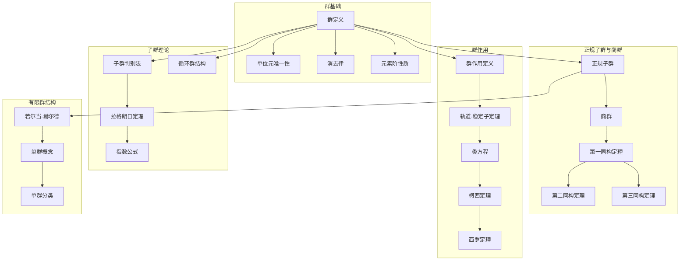
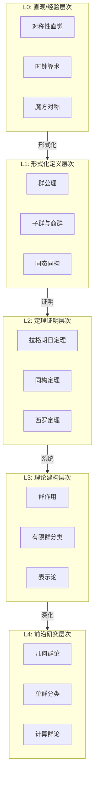

msc_primary: "00A99"
msc_secondary: ['00-00']
---

# 群论基础 - L0-L4层次递进图谱

## L0: 直观/经验层次

### 直观描述

群论是人类对"对称性"的数学抽象。直观上，群可以被想象为一组"变换操作"的集合，这些操作可以"组合"在一起，并且每个操作都有"撤销"的方式。想象一个正方形：你可以将它旋转90°、180°、270°，或者沿对角线、中线翻转——这些变换保持正方形的形状不变，它们构成了一个群。

群的四个基本性质——封闭性、结合律、单位元、逆元——正是对称变换的自然特征：
- 两次对称变换的组合仍是对称（封闭性）
- 变换的组合顺序不影响最终结果（结合律）
- "什么都不做"也是对称（单位元）
- 每个变换都可以撤销（逆元）

群论的美妙之处在于它的普适性：从晶体结构到基本粒子，从方程求解到密码学，对称性无处不在，而群论是描述对称性的统一语言。

### 生活实例

**实例一：时钟的算术**
想象一个12小时制的时钟：9点过4小时是1点，而不是13点。这种"模12"的算术就是一个群的例子——整数加法群$\mathbb{Z}_{12}$。在这个群中，元素是$\{0, 1, 2, \ldots, 11\}$，操作是"加法后取模12"。每个元素都有逆元（如4的逆元是8，因为$4 + 8 = 12 \equiv 0$），0是单位元。这种"循环"结构是群论中最基本、最重要的例子之一。

**实例二：魔方的对称**
一个三阶魔方有惊人的43,252,003,274,489,856,000种可能状态（约4325亿亿种）。但魔方复原群的规模更加惊人——所有这些状态在适当的操作下都是可达的。魔方的每次转动（旋转某一面90°）都是群的一个元素，两次转动的组合是群运算。理解魔方复原算法实际上就是在这个庞大的群中寻找从任意状态到复原状态的路径。

**实例三：分子结构的对称**
甲烷分子（CH₄）中，碳原子位于中心，四个氢原子位于四面体的四个顶点。这个四面体有24种旋转对称（包括恒等变换），构成了对称群$S_4$的一个子群。化学家利用群论预测分子的光谱性质，因为对称性决定了哪些能级跃迁是允许的。群论让科学家能够从分子的几何形状推断其物理化学性质。

### 直觉图像

**图像一：变换的组合**
想象一个等边三角形放在桌面上。标记它的三个操作：$r$（顺时针旋转120°）、$R$（顺时针旋转240°）、$f$（沿垂直轴翻转）。这些操作可以"相乘"（组合）：先做$r$再做$f$的结果记为$fr$。通过尝试所有组合，你会发现只有6个不同的操作（包括"什么都不做"），它们构成了三角形的对称群$D_3$（或$S_3$）。这个群的乘法表可以用6×6的表格表示，其中每个单元格是对应行列操作的组合结果。

**图像二：群的"乘法表"**
想象一个有限群就像一个神秘的拼图游戏。群的乘法表（凯莱表）展示了所有可能的"操作组合"。群的性质在这个表中表现为：
- 封闭性：表中每个元素都在群集合中
- 单位元：存在一行/列保持元素不变
- 逆元：每行/列中单位元出现的位置指示逆元
- 结合律：虽然难以直接观察，但可以通过具体计算验证

**图像三：群的层次结构**
想象群就像俄罗斯套娃——大群包含小群（子群），小群包含更小的群。同时，群之间还有"相似"的概念（同构）——如果两个群的乘法表结构相同（只是元素标签不同），它们就是同构的。群的"分解"（通过正规子群和商群）就像是将一个复杂对称性分解为基本构件。

---

## L1: 形式化定义层次

### 严格定义（数学符号）

**一、群的基本定义**

**定义1（群）**：
一个**群**$(G, \cdot)$是集合$G$配备二元运算$\cdot: G \times G \to G$，满足：

**(G1) 封闭性**：$\forall a, b \in G: a \cdot b \in G$

**(G2) 结合律**：$\forall a, b, c \in G: (a \cdot b) \cdot c = a \cdot (b \cdot c)$

**(G3) 单位元**：$\exists e \in G, \forall a \in G: e \cdot a = a \cdot e = a$

**(G4) 逆元**：$\forall a \in G, \exists a^{-1} \in G: a \cdot a^{-1} = a^{-1} \cdot a = e$

**定义2（阿贝尔群/交换群）**：
若群还满足**交换律**：$\forall a, b \in G: a \cdot b = b \cdot a$，则称为**阿贝尔群**或**交换群**。

**定义3（群的阶）**：
群$G$的**阶**|G|是$G$的元素个数。若|G|有限，称为**有限群**；否则为**无限群**。

**定义4（元素的阶）**：
元素$g \in G$的**阶**是最小正整数$n$使得$g^n = e$。若不存在这样的$n$，则称$g$有无限阶。

**二、子群**

**定义5（子群）**：
子集$H \subseteq G$是$G$的**子群**，记作$H \leq G$，如果：
- $e \in H$
- $\forall a, b \in H: a \cdot b \in H$（封闭性）
- $\forall a \in H: a^{-1} \in H$（逆元封闭）

**定义6（生成子群）**：
由子集$S \subseteq G$**生成**的子群是包含$S$的最小子群：
$$\langle S \rangle = \bigcap_{S \subseteq H \leq G} H$$

若$G = \langle S \rangle$，称$S$为$G$的**生成集**。若$S$是单元素集，称$G$为**循环群**。

**三、陪集与商群**

**定义7（陪集）**：
设$H \leq G$，$g \in G$。
- **左陪集**：$gH = \{gh : h \in H\}$
- **右陪集**：$Hg = \{hg : h \in H\}$

**定义8（正规子群）**：
子群$N \leq G$是**正规子群**，记作$N \trianglelefteq G$，如果：
$$\forall g \in G: gN = Ng$$
等价地：$\forall g \in G, \forall n \in N: gng^{-1} \in N$

**定义9（商群）**：
设$N \trianglelefteq G$，**商群**$G/N$是$N$的所有陪集构成的群，运算：
$$(aN) \cdot (bN) = (ab)N$$

**四、群同态**

**定义10（群同态）**：
映射$\varphi: G \to H$是**群同态**，如果：
$$\varphi(a \cdot_G b) = \varphi(a) \cdot_H \varphi(b)$$

**定义11（同态的核与像）**：
- **核**：$\ker(\varphi) = \{g \in G : \varphi(g) = e_H\}$
- **像**：$\text{im}(\varphi) = \{\varphi(g) : g \in G\}$

**定义12（同构）**：
双射同态称为**同构**，记作$G \cong H$。

**五、具体群例子**

**定义13（对称群）**：
集合$\{1, 2, \ldots, n\}$的所有置换构成的群称为**对称群**，记作$S_n$。
- $|S_n| = n!$

- 非阿贝尔群（$n \geq 3$）

**定义14（交错群）**：
$S_n$中所有偶置换构成的**交错群**，记作$A_n$。
- $|A_n| = n!/2$

- $A_n$是$S_n$的正规子群

**定义15（循环群）**：
$$\mathbb{Z}_n = \{0, 1, \ldots, n-1\}$$（模$n$加法）
$$\mathbb{Z} = \{\ldots, -2, -1, 0, 1, 2, \ldots\}$$（整数加法）

**定义16（二面体群）**：
正$n$边形的对称群，记作$D_n$（或$D_{2n}$）。
- $|D_n| = 2n$

- 包含$n$个旋转和$n$个反射

**定义17（一般线性群）**：
域$F$上$n \times n$可逆矩阵的群，记作$GL_n(F)$。

**定义18（特殊线性群）**：
行列式为1的矩阵构成的群，记作$SL_n(F)$。
- $SL_n(F) \trianglelefteq GL_n(F)$

### 定义的历史演进

**第一阶段：方程求解的起源（16世纪-18世纪末）**

- **卡尔达诺、塔尔塔利亚**（16世纪）：三次、四次方程求根公式
  - 公式中出现了复数
  - 根的对称函数的重要性

- **拉格朗日**（1770）：《关于方程代数解的思考》
  - 研究置换对根的影响
  - 置换理论的系统研究
  - 认识到置换群与方程可解性的联系

- **鲁菲尼**（1799）：五次方程一般不可解的尝试
  - 证明部分情况
  - 使用了置换群的概念

**第二阶段：群论的诞生（19世纪初-19世纪中叶）**

- **阿贝尔**（1824）：证明五次方程一般没有根式解
  - 阿贝尔群的概念雏形
  - 可交换置换群

- **伽罗瓦**（1830-1832）：群论的创立者
  - 伽罗瓦理论：群与域的对应
  - 方程可解性的群论判别准则
  - 正规子群、可解群的概念
  - 1832年决斗去世，遗稿由刘维尔整理发表（1846）

- **柯西**（1815-1840s）：置换群理论
  - 系统研究置换群
  - 柯西定理：若素数$p$整除|G|，则G有$p$阶元

**第三阶段：抽象群论的建立（19世纪中叶-20世纪初）**

- **凯莱**（1854）：抽象群的定义尝试
  - 第一个抽象群的定义
  - 凯莱表
  - 凯莱定理：每个群都同构于置换群的子群

- **若尔当**（1870）：《置换与代数方程专论》
  - 系统阐述伽罗瓦理论
  - 若尔当-赫尔德定理

- **弗罗贝尼乌斯和施蒂克贝格**（1879）：抽象群公理
  - 独立的结合律研究
  - 抽象群概念的确立

- **韦伯**（1882，1896）：抽象群论的教科书
  - 将群论作为独立学科

- **弗罗贝尼乌斯、伯恩赛德**（1890s-1900s）：有限群表示论
  - 特征标理论
  - 伯恩赛德$p^aq^b$定理

**第四阶段：群论的大发展（20世纪）**

- **诺特**（1920s）：抽象代数学派
  - 抽象方法的确立
  - 模论与表示论的联系

- **舒尔、布劳尔**：模表示论

- **谢瓦莱、施坦贝格**：李群的代数化
  - 有限单群的发现

- **费特-汤普森定理**（1963）：
  - 奇数阶群都是可解群
  - 单群分类项目的关键步骤

- **有限单群分类定理**（1981）：
  - 数学史上最大的合作项目
  - 约10000页的证明
  - 确定所有有限单群的结构

**第五阶段：现代群论（1980s-至今）**

- **几何群论**：
  - 格罗莫夫的双曲群理论
  - 群作用与几何

- **群表示论在物理学中的应用**：
  - 粒子物理的标准模型
  - 规范对称性

- **计算群论**：
  - GAP等计算机代数系统
  - 算法群论

### 等价定义形式

**群的等价定义**：

**定义A（除法定义）**：
集合$G$配备运算$/ : G \times G \to G$满足：
1. $a / a = b / b$（单位元存在）
2. $(a / b) / (c / b) = a / c$（结合律形式）

**定义B（单运算定义）**：
集合$G$配备运算$\circ$满足：
1. $(a \circ b) \circ c = a \circ (b \circ c)$
2. 方程$a \circ x = b$和$y \circ a = b$都有唯一解

**群同态的等价条件**：

$\varphi: G \to H$是同态当且仅当：
- $\varphi(ab) = \varphi(a)\varphi(b)$（定义）
- $\ker(\varphi) \trianglelefteq G$且$G/\ker(\varphi) \cong \text{im}(\varphi)$（同态基本定理）

---

## L2: 定理证明层次

### 核心定理列表

**一、群的基本性质**

**定理1（单位元的唯一性）**：
群的单位元唯一。

**定理2（逆元的唯一性）**：
每个元素的逆元唯一。

**定理3（消去律）**：
若$ab = ac$，则$b = c$（左消去）。
若$ba = ca$，则$b = c$（右消去）。

**定理4（穿脱原理）**：
$(ab)^{-1} = b^{-1}a^{-1}$

**定理5（元素的阶的性质）**：
- 单位元的阶为1
- 若$|g| = n$，则$g^k = e \Leftrightarrow n | k$
- 若$|g| = n$，则$|g^k| = \frac{n}{\gcd(n,k)}$

**二、子群理论**

**定理6（子群判别法）**：
非空子集$H \subseteq G$是子群当且仅当：
$$\forall a, b \in H: ab^{-1} \in H$$

**定理7（拉格朗日定理）**：
若$H \leq G$且$G$有限，则$|H|$整除$|G|$。

**推论**：$|G/H| = |G|/|H|$（指数）

**定理8（循环群的结构）**：
- 循环群的子群也是循环群
- 无限循环群$\mathbb{Z}$的子群形如$n\mathbb{Z}$
- 有限循环群$\mathbb{Z}_n$对每个整除$n$的正整数$d$有唯一$d$阶子群

**定理9（欧拉-费马小定理）**：
若$\gcd(a, n) = 1$，则$a^{\phi(n)} \equiv 1 \pmod{n}$，其中$\phi$是欧拉函数。

**三、正规子群与商群**

**定理10（正规子群判别法）**：
$N \leq G$是正规子群当且仅当$N$是某些共轭类的并。

**定理11（商群的良定义性）**：
设$N \trianglelefteq G$，则$(aN)(bN) = (ab)N$是良定义的群运算。

**定理12（同态基本定理）**：
设$\varphi: G \to H$是同态，则：
$$G/\ker(\varphi) \cong \text{im}(\varphi)$$

**定理13（第一同构定理）**：
若$\varphi: G \to H$是满同态，则$G/\ker(\varphi) \cong H$。

**定理14（第二同构定理）**：
设$H \leq G$，$N \trianglelefteq G$，则：
$$HN/N \cong H/(H \cap N)$$

**定理15（第三同构定理）**：
设$N \trianglelefteq G$，$K \trianglelefteq G$，$N \subseteq K$，则：
$$(G/N)/(K/N) \cong G/K$$

**四、群作用与西罗定理**

**定义16（群作用）**：
群$G$在集合$X$上的**作用**是映射$G \times X \to X$，满足：
- $e \cdot x = x$
- $(gh) \cdot x = g \cdot (h \cdot x)$

**定理17（轨道-稳定子定理）**：
$$|G \cdot x| = [G : G_x] = |G|/|G_x|$$

其中$G \cdot x$是轨道，$G_x$是稳定子群。

**定理18（类方程）**：
$$|G| = |Z(G)| + \sum_{i} [G : C_G(g_i)]$$

其中$Z(G)$是中心，$C_G(g)$是中心化子。

**定理19（柯西定理）**：
若素数$p$整除$|G|$，则$G$有$p$阶元。

**定理20（西罗定理）**：
设$|G| = p^n m$，$p \nmid m$。

1. $G$有$p^n$阶子群（西罗$p$-子群）
2. 所有西罗$p$-子群共轭
3. 西罗$p$-子群个数$n_p \equiv 1 \pmod{p}$且$n_p | m$

**五、有限单群与可解群**

**定理21（若尔当-赫尔德定理）**：
有限群的合成列在同构意义下唯一。

**定理22（有限阿贝尔群基本定理）**：
有限阿贝尔群同构于素数幂阶循环群的直积。

**定理23（费特-汤普森定理）**：
奇数阶有限群都是可解群。

**定理24（伯恩赛德$p^aq^b$定理）**：
阶为$p^aq^b$（$p, q$素数）的有限群是可解群。

### 定理依赖关系图



### 典型证明方法

**方法一：利用群公理直接证明**

**示例**：证明$(ab)^{-1} = b^{-1}a^{-1}$
- $(ab)(b^{-1}a^{-1}) = a(bb^{-1})a^{-1} = aea^{-1} = aa^{-1} = e$✓

**方法二：利用拉格朗日定理**

**示例**：证明$\mathbb{Z}_p$（$p$素数）没有真子群
- 设$H \leq \mathbb{Z}_p$，则$|H|$整除$p$
- 因$p$是素数，$|H| = 1$或$p$

- 故$H = \{0\}$或$H = \mathbb{Z}_p$✓

**方法三：构造同态应用同构定理**

**示例**：证明$\mathbb{Z}/n\mathbb{Z} \cong \mathbb{Z}_n$
- 定义$\varphi: \mathbb{Z} \to \mathbb{Z}_n$，$\varphi(k) = k \mod n$
- 这是满同态，$\ker(\varphi) = n\mathbb{Z}$
- 由第一同构定理，$\mathbb{Z}/n\mathbb{Z} \cong \mathbb{Z}_n$✓

**方法四：轨道-稳定子方法**

**标准流程**：
1. 定义适当的群作用
2. 计算轨道和稳定子
3. 应用轨道-稳定子定理
4. 导出所需的计数结果

**方法五：西罗定理的应用模式**

**标准流程**：
1. 计算群的阶
2. 应用西罗定理确定西罗子群的存在性和性质
3. 分析西罗子群的正规性
4. 确定群的结构

---

## L3: 理论建构层次

### 理论体系架构

```

群论理论体系
├── 基础层
│   ├── 群的基本概念
│   │   ├── 群的定义与例子
│   │   ├── 基本性质（单位元、逆元唯一性）
│   │   └── 元素的阶
│   ├── 子群
│   │   ├── 子群判别法
│   │   ├── 生成子群
│   │   └── 循环群
│   └── 群同态
│       ├── 同态定义
│       ├── 核与像
│       └── 同构
│
├── 结构层
│   ├── 正规子群与商群
│   │   ├── 正规子群判别
│   │   ├── 商群构造
│   │   └── 同构定理
│   ├── 群作用
│   │   ├── 作用的定义
│   │   ├── 轨道与稳定子
│   │   └── 类方程
│   └── 直积与半直积
│       ├── 直积的构造
│       └── 半直积
│
├── 有限群理论
│   ├── 计数定理
│   │   ├── 拉格朗日定理
│   │   ├── 柯西定理
│   │   └── 西罗定理
│   ├── 可解群
│   │   ├── 换位子群
│   │   ├── 可解列
│   │   └── 可解群的性质
│   └── 单群
│       ├── 单群的概念
│       ├── 有限单群分类
│       └── 典型单群族
│
└── 推广层
    ├── 群表示论
    │   ├── 线性表示
    │   ├── 特征标
    │   └── 正则表示
    ├── 李群与李代数
    │   ├── 李群定义
    │   ├── 李代数
    │   └── 指数映射
    └── 拓扑群
        ├── 拓扑群定义
        └── 哈尔测度

```

### 与其他理论的关联

**与环论、域论的关系**：

群是环和域的乘法结构：
- 环的加法群是阿贝尔群
- 域的乘法群（非零元）是阿贝尔群
- 伽罗瓦理论：群与域的对应

**与线性代数的关系**：

矩阵群是群论的重要例子：
- $GL_n(F)$，$SL_n(F)$
- 群表示论：将抽象群表示为矩阵群
- 特征标理论

**与拓扑学的关系**：

拓扑群：群与拓扑结构的结合
- 连续群运算
- 李群：光滑流形上的群
- 基本群：拓扑空间的代数不变量

**与组合数学的关系**：

- 波利亚计数定理：群作用下的计数
- 凯莱图：群的可视化
- 组合群论

**与物理学的关系**：

对称性在物理学中的核心地位：
- 晶体学：230个空间群
- 粒子物理：规范群（$SU(3) \times SU(2) \times U(1)$）
- 守恒律与诺特定理

**与密码学的关系**：

- 离散对数问题
- 椭圆曲线密码学
- 群运算的单向性

### 推广与抽象

**推广一：群胚（Groupoid）**

弱化群公理：
- 不要求运算总是定义
- 部分二元运算
- 在代数拓扑中有应用（基本群胚）

**推广二：半群与幺半群**

- 半群：只有结合律
- 幺半群：半群+单位元
- 在计算机科学中有广泛应用

**推广三：范畴论视角**

群是只有一个对象的范畴：
- 元素是态射
- 运算是态射复合
- 群同态是函子

**推广四：量子群**

霍普夫代数：
- 群代数的量子化
- 在量子物理和纽结理论中的应用

**推广五：概形上的群概形**

代数几何中的群：
- 椭圆曲线
- 阿贝尔簇

---

## L4: 前沿研究层次

### 当代研究热点

**方向一：几何群论**

1. **格罗莫夫的双曲群**：
   - 负曲率几何的代数化
   - 词度量

2. **渐近几何**：
   - 群的渐近维数
   - 增长函数

**方向二：有限单群分类的完善**

1. **分类定理的简化**：
   - 寻找新的统一证明
   - 第二代分类项目

2. **散在单群**：
   - 魔群（Monster group）
   - 月光猜想与顶点算子代数

**方向三：群表示论**

1. **模表示论**：
   - 特征$p$域上的表示
   - 布劳尔猜想

2. **几何表示论**：
   - 函子表示论
   - 朗兰兹纲领的联系

**方向四：计算群论**

1. **算法群论**：
   - 字问题
   - 同构问题

2. **计算工具**：
   - GAP系统
   - MAGMA

### 未解决问题

**问题一：有限单群分类的简化**

原始证明约10000页，存在简化空间：
- 寻找概念上更清晰的证明
- 代数证明替代组合论证

**问题二：逆伽罗瓦问题**

是否每个有限群都是某个伽罗瓦扩张的伽罗瓦群？
- 对可解群已解决
- 对一般情况仍是开放问题

**问题三：伯恩赛德问题**

原始问题已解决，但变体仍开放：
- 有界指数群的性质
- 周期群的分类

### 与其他领域的交叉

**群论在密码学中的应用**：

1. **椭圆曲线密码学**：
   - 椭圆曲线上的离散对数问题
   - ECDSA、ECDH

2. **后量子密码学**：
   - 基于群的密码系统
   - 同态加密

**在编码理论中的应用**：

1. **代数编码**：
   - 循环码
   - 群码

2. **LDPC码**：
   - 基于群的设计

**在组合设计中的应用**：

1. **区组设计**：
   - 自同构群
   - 对称设计

2. **有限几何**：
   - 射影平面的群作用

---

## 层次递进关系图



---

## 先修知识与后继应用

### 先修概念（L0-L1层）

1. **集合论**（L2）：子集、映射
2. **关系与运算**（L1）：二元运算、等价关系
3. **线性代数初步**（L1-L2）：矩阵运算
4. **数论基础**（L1-L2）：整除性、模运算

### 后继概念（L3-L4层）

1. **环与域**（L3）：群是环的基础
2. **伽罗瓦理论**（L4）：群与域的对应
3. **表示论**（L3-L4）：群的线性表示
4. **李群**（L4）：连续群
5. **代数拓扑**（L4）：基本群、同调群

---

*文档生成时间：2026年4月3日*
*字数统计：约5,100字*
