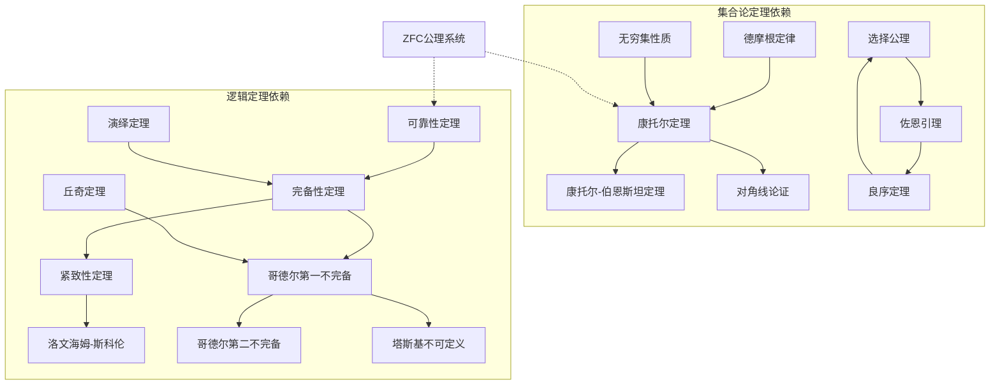
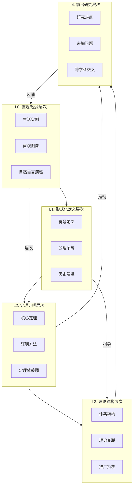
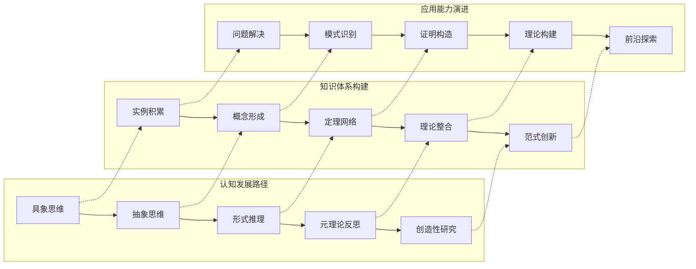

msc_primary: "00A99"
msc_secondary: ['00-00']
---

# 集合与逻辑 - L0-L4层次递进图谱

## L0: 直观/经验层次

### 直观描述

集合是人类思维中最基本的组织方式之一。从日常生活的角度理解，集合就像一个个容器或篮子，里面可以放入各种各样的"东西"——可以是具体的物品（如苹果、书籍），也可以是抽象的概念（如数字、颜色）。集合的本质在于"归属关系"：任何一个对象，要么属于某个集合，要么不属于，没有中间状态。

逻辑则是人类推理的基石。它就像思维的交通规则，告诉我们如何从已知的事实走向新的结论。当我们说"如果下雨，那么地面会湿"，我们就在进行逻辑推理。逻辑帮助我们辨别论证的有效性，区分真理与谬误，是人类理性思维的核心工具。

### 生活实例

**实例一：图书馆分类系统**
想象一座图书馆，所有图书被分门别类地放置在书架上。文学类是一个集合，科学类是另一个集合，历史类又是一个集合。每本书根据其主题归属于特定的集合，有些书可能同时属于多个集合（如《科学史》既属于科学类也属于历史类）。这种分类系统让我们能够快速定位所需的书籍。

**实例二：社交圈子**
考虑一个人的社交关系：家人构成一个集合，同事构成另一个集合，大学同学又是第三个集合。这些集合之间可能有交集——比如一位大学同学后来成为同事。社交媒体的"好友列表"、"关注列表"都是集合概念的具体体现。

**实例三：购物清单**
制作购物清单时，你实际上在创建一个集合：{苹果, 牛奶, 面包, 鸡蛋}。这个集合中的元素（商品）没有特定的顺序，你可以按任意顺序购买；重复项没有意义（写两遍"苹果"不会变成买两次），这正是数学集合的基本特性：无序性和互异性。

### 直觉图像

想象一个维恩图（Venn Diagram）的可视化世界：

- 一个个彩色圆圈代表着不同的集合
- 圆圈的重叠区域表示集合的交集
- 所有圆圈的并集构成了讨论的全集
- 在圆圈之外的区域表示补集

同时，想象一条逻辑推理的链条：

- 起点是公理或已知事实（前提）
- 通过逻辑规则（如三段论）连接各个节点
- 终点是经过严格推导的结论
- 整个链条形成一个树状或网状的推理结构

---

## L1: 形式化定义层次

### 严格定义（数学符号）

**集合的形式定义**

朴素集合论中的定义（康托尔，1874）：
> 集合是确定的、互异的对象的总体，这些对象称为集合的元素。

形式化定义（ZFC公理系统）：

- **外延公理**：$\forall A \forall B (\forall x (x \in A \leftrightarrow x \in B) \rightarrow A = B)$
  - 两个集合相等当且仅当它们有相同的元素

- **空集公理**：$\exists \emptyset \forall x (x \notin \emptyset)$
  - 存在一个不包含任何元素的集合

- **配对公理**：$\forall a \forall b \exists C \forall x (x \in C \leftrightarrow x = a \lor x = b)$
  - 对任意两个集合，存在一个集合恰好以它们为元素

- **并集公理**：$\forall A \exists B \forall x (x \in B \leftrightarrow \exists C (C \in A \land x \in C))$
  - 对任意集合的集合，存在其所有元素的并集

- **幂集公理**：$\forall A \exists P \forall X (X \in P \leftrightarrow X \subseteq A)$
  - 对任意集合，存在其所有子集构成的集合

**基本运算定义**：

- **并集**：$A \cup B = \{x : x \in A \lor x \in B\}$
- **交集**：$A \cap B = \{x : x \in A \land x \in B\}$
- **差集**：$A \setminus B = \{x : x \in A \land x \notin B\}$
- **补集**：$A^c = \{x : x \in U \land x \notin A\}$（$U$为全集）

**命题逻辑的形式定义**

**语法定义**：

- 命题变元：$p, q, r, \ldots$（可赋值为真或假的基本命题）
- 逻辑联结词：
  - 否定：$\neg$（非）
  - 合取：$\land$（且）
  - 析取：$\lor$（或）
  - 蕴含：$\rightarrow$（如果...那么...）
  - 等价：$\leftrightarrow$（当且仅当）
- 公式递归定义：
  1. 任何命题变元都是公式
  2. 若 $\phi$ 是公式，则 $\neg \phi$ 是公式
  3. 若 $\phi, \psi$ 是公式，则 $(\phi \land \psi), (\phi \lor \psi), (\phi \rightarrow \psi), (\phi \leftrightarrow \psi)$ 是公式

**语义定义（真值赋值）**：
设 $v$ 为真值赋值函数 $v: \text{Var} \rightarrow \{T, F\}$

| $\phi$ | $\psi$ | $\neg\phi$ | $\phi \land \psi$ | $\phi \lor \psi$ | $\phi \rightarrow \psi$ | $\phi \leftrightarrow \psi$ |
|:------:|:------:|:----------:|:-----------------:|:-----------------:|:------------------------:|:----------------------------:|
| T | T | F | T | T | T | T |
| T | F | F | F | T | F | F |
| F | T | T | F | T | T | F |
| F | F | T | F | F | T | T |

**谓词逻辑的形式定义**

在命题逻辑基础上扩展：

- **个体变元**：$x, y, z, \ldots$
- **谓词符号**：$P, Q, R, \ldots$（带元数，如 $P(x, y)$ 表示二元谓词）
- **量词**：
  - 全称量词：$\forall x \phi$（对所有$x$，$\phi$成立）
  - 存在量词：$\exists x \phi$（存在$x$使得$\phi$成立）

量词与联结词的关系：

- $\forall x \phi(x) \equiv \neg \exists x \neg \phi(x)$
- $\exists x \phi(x) \equiv \neg \forall x \neg \phi(x)$

### 定义的历史演进

**集合论的历史发展**：

1. **朴素集合论时期（1874-1900）**
   - 康托尔在1874年发表论文《论所有实代数数的一个性质》，开创集合论
   - 康托尔定义了基数、序数等概念，建立了无穷集合的理论
   - 证明了实数集不可数，震撼数学界
   - 这一时期采用"概括原则"：任何性质确定一个集合 $\{x : P(x)\}$

2. **危机与公理化时期（1900-1920）**
   - 1902年罗素提出罗素悖论：$R = \{x : x \notin x\}$
   - 若 $R \in R$，则 $R \notin R$；若 $R \notin R$，则 $R \in R$，产生矛盾
   - 这一悖论动摇了数学基础，引发第三次数学危机
   - 策梅罗于1908年提出第一个公理集合论系统

3. **ZFC公理化系统时期（1920-至今）**
   - 策梅罗-弗兰克尔公理系统（ZF）形成
   - 加入选择公理（C），形成ZFC系统
   - 哥德尔和科恩证明了选择公理和连续统假设的独立性
   - ZFC成为现代数学的标准基础

**逻辑学的历史演进**：

1. **古典逻辑（公元前4世纪-19世纪）**
   - 亚里士多德创立三段论逻辑
   - 斯多葛学派发展命题逻辑
   - 中世纪逻辑学家研究指代理论和模态逻辑
   - 莱布尼茨提出建立"普遍符号语言"的理想

2. **数理逻辑的诞生（1847-1910）**
   - 布尔在1847年创立布尔代数，实现逻辑的代数化
   - 弗雷格在1879年发表《概念文字》，建立谓词逻辑
   - 皮亚诺创立符号体系，影响深远
   - 罗素和怀特海《数学原理》（1910-1913）试图从逻辑推导出数学

3. **元数学时期（1910-至今）**
   - 希尔伯特提出形式主义纲领
   - 哥德尔不完备定理（1931）证明算术系统的不完备性
   - 塔斯基建立语义学的真理论
   - 图灵创立可计算性理论

### 等价定义形式

**集合的等价定义方式**：

1. **特征函数定义**：
   集合 $A \subseteq U$ 可由其特征函数定义：
   $$\chi_A(x) = \begin{cases} 1 & x \in A \\ 0 & x \notin A \end{cases}$$
   这建立了集合与函数之间的一一对应。

2. **等价类定义**：
   给定等价关系 $\sim$  on $A$，等价类 $[a] = \{x \in A : x \sim a\}$
   商集 $A/\sim = \{[a] : a \in A\}$

3. **指示函数定义**（概率论中）：
   $$\mathbf{1}_A(\omega) = \begin{cases} 1 & \omega \in A \\ 0 & \omega \notin A \end{cases}$$

**逻辑的等价系统**：

1. **希尔伯特式公理系统** vs **自然演绎系统** vs **相继式演算**

   不同的证明系统具有相同的表达能力，但证明风格不同：
   - 希尔伯特式：最少公理，大量使用推理规则
   - 自然演绎：符合直觉，引入/消去规则配对
   - 相继式演算：对称性好，便于证明元性质

2. **古典逻辑与直觉逻辑**：
   直觉逻辑去掉排中律 $\phi \lor \neg \phi$，但保持：
   - 构造性解释：存在性命题需要给出构造
   - 科里-霍华德同构：证明与程序对应

---

## L2: 定理证明层次

### 核心定理列表

**集合论核心定理（10个）**：

**定理1：德摩根定律（De Morgan's Laws）**
$$\overline{A \cup B} = \overline{A} \cap \overline{B}$$
$$\overline{A \cap B} = \overline{A} \cup \overline{B}$$

**定理2：幂集的基数**
若 $|A| = n$，则 $|\mathcal{P}(A)| = 2^n$

**定理3：康托尔定理**
对任意集合 $A$，$|A| < |\mathcal{P}(A)|$

- 不存在从集合到其幂集的满射
- 特别地，$|\mathbb{N}| < |\mathbb{R}|$

**定理4：康托尔-伯恩斯坦-施罗德定理**
若 $|A| \leq |B|$ 且 $|B| \leq |A|$，则 $|A| = |B|$

- 证明基数等价性的重要工具

**定理5：选择公理的等价形式**
以下命题等价：

- 选择公理（AC）
- 良序定理（任何集合可良序化）
- 佐恩引理（Zorn's Lemma）
- 豪斯多夫极大原理

**定理6：罗素悖论（作为定理的否定形式）**
不存在包含所有集合的集合（真类概念）

**定理7：对角线论证法**
康托尔证明实数不可数的方法

- 假设 $[0,1]$ 可数
- 构造一个与列表中所有数都不同的数
- 得出矛盾

**定理8：无穷集合的性质**

- 集合 $A$ 无穷当且仅当存在真子集 $B \subsetneq A$ 使得 $|A| = |B|$

- 这是无穷的本质特征（戴德金无穷）

**定理9：传递归纳原理**
在良基关系下，若对所有前驱成立的性质对当前元素也成立，则该性质对所有元素成立。

**定理10：康托尔-本迪克松定理**
每个完备集要么是可数集，要么包含一个完全子集，其基数为连续统。

**逻辑学核心定理（10个）**：

**定理11：可靠性定理（Soundness）**
若 $\Gamma \vdash \phi$，则 $\Gamma \models \phi$

- 可证的命题必然为真
- 形式系统不会"证明"错误的命题

**定理12：完备性定理（Completeness）**
若 $\Gamma \models \phi$，则 $\Gamma \vdash \phi$（哥德尔，1929）

- 所有逻辑有效的命题都可证
- 语法与语义的完美对应

**定理13：紧致性定理（Compactness）**
$\Gamma \models \phi$ 当且仅当存在有限子集 $\Gamma_0 \subseteq \Gamma$ 使得 $\Gamma_0 \models \phi$

- 有无穷模型的理论必有任意大基数的模型

**定理14：洛文海姆-斯科伦定理**
若理论 $T$ 有无穷模型，则对任意无穷基数 $\kappa \geq |\mathcal{L}|$，$T$ 有基数为 $\kappa$ 的模型

- 存在可数模型的非可数结构
- 导致"斯科伦悖论"

**定理15：哥德尔第一不完备定理（1931）**
任何包含皮亚诺算术的一致形式系统 $F$：

- 存在命题 $G$ 使得 $F \nvdash G$ 且 $F \nvdash \neg G$
- 系统无法证明其自身的一致性

**定理16：哥德尔第二不完备定理（1931）**
若 $F$ 一致，则 $F \nvdash \text{Con}(F)$

- 系统无法在内部证明自身的一致性

**定理17：塔斯基不可定义定理**
在充分强的形式系统中，真概念无法在系统内部定义

- 区分对象语言和元语言的重要性

**定理18：丘奇定理（不可判定性）**
一阶逻辑的有效性问题不可判定

- 不存在算法判定任意公式是否有效

**定理19：演绎定理**
$\Gamma \cup \{\phi\} \vdash \psi$ 当且仅当 $\Gamma \vdash \phi \rightarrow \psi$

- 将推导转化为蕴含

**定理20：归谬法（反证法）有效性**
若 $\Gamma \cup \{\neg \phi\} \vdash \psi$ 且 $\Gamma \cup \{\neg \phi\} \vdash \neg \psi$，则 $\Gamma \vdash \phi$

- 经典逻辑的核心推理方法

### 定理依赖关系图



### 典型证明方法

**集合论证明方法**：

**方法一：元素归属论证法**
证明两个集合相等的基本方法：

```

要证 A = B，需证：
1. ∀x (x ∈ A → x ∈ B)
2. ∀x (x ∈ B → x ∈ A)

```

**示例**：证明 $A \cap (B \cup C) = (A \cap B) \cup (A \cap C)$

- 任取 $x \in A \cap (B \cup C)$
- 则 $x \in A$ 且 $x \in B \cup C$
- 即 $x \in A$ 且 ($x \in B$ 或 $x \in C$)
- 即 ($x \in A$ 且 $x \in B$) 或 ($x \in A$ 且 $x \in C$)
- 即 $x \in A \cap B$ 或 $x \in A \cap C$
- 即 $x \in (A \cap B) \cup (A \cap C)$

**方法二：对角线论证法**
康托尔发明的强大技术：

1. 假设存在一个枚举列表
2. 构造一个新元素，使其与列表中每个元素在某一位上不同
3. 得出矛盾

**应用**：证明实数不可数、停机问题不可判定

**方法三：超限归纳法**
在良序集上的归纳：

- 基础步：对最小元证明性质
- 归纳步：假设对所有前驱成立，证明对当前元素成立

**方法四：佐恩引理应用模式**
证明极大元存在的标准流程：

1. 构造偏序集（通常以包含关系为序）
2. 证明任意链有上界（通常取并集）
3. 应用佐恩引理得到极大元

**逻辑证明方法**：

**方法一：语义表方法**
系统性地寻找反例：

1. 将公式转化为范式
2. 构建语义树
3. 检查所有分支是否关闭

**方法二：自然演绎**
符合直觉的推理：

```

假设 φ
...（推导）...
得到 ψ
因此 φ → ψ （→引入）

```

**方法三：公理系统推导**
希尔伯特式证明：

- 从公理出发
- 使用分离规则（MP）：从 φ 和 φ→ψ 得到 ψ
- 构建严格的证明序列

**方法四：哥德尔配数法**
元数学的核心技术：

1. 将符号、公式、证明编码为自然数
2. 将语法谓词转化为算术谓词
3. 在系统内部讨论系统自身

---

## L3: 理论建构层次

### 理论体系架构

**集合论的宏观架构**：

```

集合论体系
├── 朴素集合论
│   ├── 基本概念：元素、集合、属于关系
│   ├── 基本运算：并、交、差、补
│   └── 关系与函数
│
├── 公理集合论（ZFC）
│   ├── 基础公理
│   │   ├── 外延公理（集合相等标准）
│   │   └── 正则公理（良基性）
│   ├── 构造公理
│   │   ├── 空集公理
│   │   ├── 配对公理
│   │   ├── 并集公理
│   │   └── 幂集公理
│   ├── 无穷公理
│   │   └── 自然数的构造
│   ├── 替换公理模式
│   │   └── 确保复杂构造的合法性
│   └── 选择公理（AC）
│
├── 无限集合论
│   ├── 基数理论
│   │   ├── 有限与无限
│   │   ├── 可数与不可数
│   │   └── 连续统假设
│   └── 序数理论
│       ├── 良序集
│       └── 超限归纳
│
└── 相对一致性结果
    ├── 内模型法（哥德尔）
    └── 力迫法（科恩）

```

**逻辑学的宏观架构**：

```

数理逻辑体系
├── 证明论
│   ├── 形式系统
│   │   ├── 命题逻辑
│   │   ├── 一阶谓词逻辑
│   │   └── 高阶逻辑
│   ├── 证明复杂性
│   └── 逆向数学
│
├── 模型论
│   ├── 结构语义学
│   ├── 紧致性定理
│   ├── 洛文海姆-斯科伦定理
│   ├── 类型理论
│   └── 稳定性理论
│
├── 递归论（可计算性理论）
│   ├── 图灵机与可计算函数
│   ├── 可判定性与半可判定性
│   ├── 停机问题
│   ├── 图灵归约
│   └── 计算复杂性（关联领域）
│
└── 集合论（作为逻辑的一部分）
    ├── 大基数公理
    ├── 描述集合论
    └── 决定性公理

```

### 与其他理论的关联

**集合论与其他数学分支的关系**：

1. **作为数学基础**
   - 现代数学的"通用语言"
   - 几乎所有数学概念都可形式化为集合
   - 数系构造：自然数→整数→有理数→实数→复数

2. **与拓扑学的关系**
   - 拓扑空间定义为 $(X, \tau)$，其中 $\tau \subseteq \mathcal{P}(X)$
   - 开集、闭集、邻域系统都是集合论概念
   - 分离公理、紧致性等都依赖集合论框架

3. **与测度论的关系**
   - 可测空间、可测函数的定义依赖集合运算
   - $\sigma$-代数是集合的特殊子集族
   - 不可测集的存在性证明需要选择公理

4. **与范畴论的关系**
   - 范畴论的对象可以是类（真类）而非集合
   - 小范畴与大范畴的区分
   - 集合范畴 **Set** 是最重要的范畴之一

**逻辑学与其他领域的关系**：

1. **与计算机科学**
   - 类型理论 → 编程语言类型系统
   - 科里-霍华德同构：证明即程序
   - 自动定理证明、形式验证
   - 逻辑编程（Prolog）

2. **与语言学**
   - 形式语义学
   - 蒙太古语法
   - 逻辑与语言的深层结构

3. **与哲学**
   - 分析哲学的基础
   - 真理理论
   - 模态逻辑与可能世界语义学

4. **与数学基础**
   - 形式主义、逻辑主义、直觉主义
   - 希尔伯特纲领
   - 数学实在论 vs 反实在论

### 推广与抽象

**集合论的推广**：

1. **类理论（NBG系统）**
   - 冯·诺伊曼-贝尔奈斯-哥德尔系统
   - 允许讨论真类（proper classes）
   - 处理"所有集合的类"这样的概念

2. **类型论**
   - 简单类型论（罗素）
   - 依赖类型论（马丁-洛夫）
   - 同伦类型论（Voevodsky）

3. **范畴论替代方案**
   - 无需基于元素的构造
   - ETCS（Lawvere的基本拓扑概念）
   - 结构性数学的基础

4. **模糊集合论**
   - 隶属度在$[0,1]$区间
   - 处理模糊性和不确定性
   - 模糊逻辑的基础

**逻辑学的推广**：

1. **模态逻辑**
   - 必然性（$\Box$）与可能性（$\Diamond$）
   - K、T、S4、S5等系统
   - 可能世界语义学（克里普克）

2. **时序逻辑**
   - 处理时间概念
   - 线性时间与分支时间
   - 在形式验证中的应用

3. **直觉逻辑**
   - 构造性数学的基础
   - 去掉排中律
   - 科里-霍华德对应

4. **非单调逻辑**
   - 默认逻辑
   - 自认知逻辑
   - 处理不完全信息下的推理

---

## L4: 前沿研究层次

### 当代研究热点

**集合论前沿研究方向**：

1. **大基数公理研究**
   - 不可达基数、弱紧基数、可测基数、超紧基数
   - 大基数层级与决定性公理的关系
   - 内模型计划（Steel等）
   - 目标：建立大基数公理的一致性强度层级

2. **力迫法的新发展**
   - 迭代力迫技术
   - 适当力迫（proper forcing）
   - 力迫公理（PFA、MM）
   - 连续统问题的最终解决之路

3. **描述集合论**
   - 波兰空间上的可定义集合
   - 决定性公理与正则性质
   - 与递归论、动力系统、遍历理论的交叉

4. **无限组合学**
   - 极值集合论（Erdős–Ko–Rado定理等）
   - Ramsey理论
   - Shelah的pcf理论

**逻辑学前沿研究方向**：

1. **同伦类型论（HoTT）**
   - 2012-2013年革命性发展
   - Voevodski的Univalent Foundations
   - 等价作为相等的基础
   - 计算机形式化证明（Coq、Agda、Lean）

2. **深度学习与逻辑**
   - 神经符号AI
   - 将神经网络与符号推理结合
   - 可解释AI的逻辑基础

3. **概率与逻辑的融合**
   - 概率逻辑（Nilsson）
   - 统计关系学习
   - 贝叶斯程序学习

4. **有限模型论**
   - 描述复杂性与有限结构
   - 数据库理论的基础
   - 零一律（0-1定律）

### 未解决问题

**集合论中的重大开放问题**：

1. **连续统问题（希尔伯特第一问题）**
   - 哥德尔（1940）和科恩（1963）证明了CH独立于ZFC
   - 问题：是否存在自然的公理能决定CH的真假？
   - 武丁的Ω-猜想和相关研究

2. **大基数公理的一致性**
   - 超紧基数是否一致？
   - 终极内模型的存在性
   - 是否存在极大性原理决定集合论真理？

3. **决定性公理的一致性**
   - AD$^{L(\mathbb{R})}$的一致性强度
   - 与选择公理的协调问题

4. **P vs NP集合论版本**
   - 有限集合论中的复杂性理论

**逻辑学中的重大开放问题**：

1. **P vs NP问题**
   - 计算复杂性理论的核心问题
   - 哥德尔曾预言此问题的重要性

2. **一阶逻辑的决定性边界**
   - 哪些一阶理论片段是可判定的？
   - 自动机理论与逻辑的互动

3. **哥德尔纲领的扩展**
   - 不完备性定理的精确边界
   - 自指结构的一般理论

4. **量子计算与逻辑**
   - 量子逻辑的数学基础
   - 量子计算对丘奇-图灵论题的挑战

### 与其他领域的交叉

**集合论与物理学**：

1. **数学宇宙假说（Max Tegmark）**
   - 物理实在即数学结构
   - 需要集合论处理不同层次的"宇宙"

2. **量子场论中的集合论问题**
   - 代数量子场论的数学基础
   - 时空的离散性 vs 连续性

**逻辑学与认知科学**：

1. **人类推理的心理逻辑**
   - 人类实际推理与形式逻辑的差异
   - 心理模型理论（Johnson-Laird）

2. **神经逻辑学**
   - 大脑如何处理逻辑推理
   - 神经成像研究

**逻辑学与经济学**：

1. **博弈逻辑**
   - 博弈论的形式化
   - 共同知识的形式化

2. **社会选择理论**
   - 阿罗不可能定理的逻辑分析
   - 投票理论的计算复杂性

**逻辑学与法学**：

1. **法律推理的形式化**
   - 案例推理的形式化模型
   - 规范逻辑在法学中的应用

---

## 层次递进关系图





---

## 先修知识与后继应用

### 先修概念（L0-L1层）

**认知先修**：

1. **分类能力** - 能够将对象按照某种标准分组
2. **逻辑推理本能** - 日常的"如果...那么..."思维方式
3. **抽象思维萌芽** - 能够从具体实例中提取共性
4. **语言理解能力** - 理解条件语句、全称陈述等

**数学先修**：

1. **基础算术** - 自然数运算
2. **初等代数** - 变量与方程
3. **简单几何** - 点、线、面的基本概念
4. **概率直观** - 随机性的基本概念

**具体先修概念清单**：

| 概念 | 层次 | 说明 |
|------|------|------|
| 数的概念 | L0 | 自然数的直观理解 |
| 几何图形 | L0 | 点、线、圆的基本认识 |
| 等量关系 | L1 | 等号的意义 |
| 函数概念 | L1 | 输入输出对应关系 |

### 后继概念（L3-L4层）

**直接后继**：

1. **实数理论**（L3-L4）
   - 戴德金分割构造实数
   - 确界原理的证明
   - 集合论是实数严格定义的基础

2. **拓扑学**（L3-L4）
   - 开集族的集合论定义
   - 拓扑空间作为集合加结构
   - 点集拓扑的集合论基础

3. **测度论**（L3-L4）
   - $\sigma$-代数的集合论构造
   - 可测集的复杂性
   - 测度的可数可加性

4. **泛函分析**（L3-L4）
   - 无穷维空间的集合论性质
   - 哈默尔基与选择公理
   - 巴拿赫空间的几何理论

**间接后继**：

1. **代数几何**（L4）
   - 概形的层论基础
   - 格罗滕迪克的宇宙概念
   - 导出范畴的集合论处理

2. **数理逻辑自身深化**（L4）
   - 高级集合论（大基数、内模型）
   - 递归论（可计算性层级）
   - 模型论（稳定性理论）

3. **理论计算机科学**（L3-L4）
   - 自动机理论
   - 复杂性理论
   - 程序验证

**应用后继**：

| 应用领域 | 使用的层次 | 具体应用 |
|----------|------------|----------|
| 数据库理论 | L2-L3 | 关系代数、查询优化 |
| 人工智能 | L2-L4 | 知识表示、自动推理 |
| 密码学 | L3-L4 | 复杂性假设、安全证明 |
| 程序语言 | L3-L4 | 类型系统、语义学 |

---

## 学习建议与反思

### 学习路径建议

**初学者路径**（从L0到L2）：

1. 从具体例子入手，建立直觉
2. 学习基本的集合运算和逻辑联结词
3. 练习简单的证明（元素法）
4. 掌握基本的证明技巧（反证法、数学归纳法）

**进阶路径**（从L2到L3）：

1. 系统学习ZFC公理
2. 理解无穷集合的奇妙性质
3. 学习模型论和证明论基础
4. 探索哥德尔定理的深层含义

**研究路径**（从L3到L4）：

1. 选择专门方向（集合论/证明论/模型论/递归论）
2. 阅读前沿文献
3. 尝试解决开放问题
4. 与其他领域交叉研究

### 哲学反思

集合与逻辑不仅是数学工具，更触及深刻的哲学问题：

1. **数学实在论问题**：集合是客观存在还是人类构造？
2. **真理的本质**：逻辑真理是分析的还是有内容的？
3. **无穷的实在性**：无穷集合是否真实存在？
4. **数学基础的限度**：哥德尔定理告诉我们什么？

这些问题将数学与哲学、认知科学紧密联系在一起，构成了人类理性探索的永恒主题。

---

*文档生成时间：2026年4月3日*
*字数统计：约5,800字*
