# 跨分支知识连接图谱

> 本文档揭示数学各分支之间的深层联系，展示分析学、代数学、几何拓扑、概率论等领域的交叉融合与统一框架。

---

## 🌐 知识连接总览

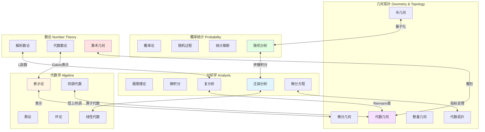

---

## 1️⃣ 分析学与代数的联系

### 1.1 泛函分析中的代数结构

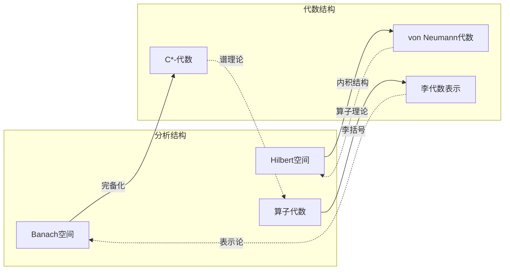

**核心联系表**

| 分析概念 | 代数对应 | 连接桥梁 | 典型应用 |
|----------|----------|----------|----------|
| Banach空间 | 拓扑群 | 群表示 | 调和分析 |
| Hilbert空间 | 酉表示 | Peter-Weyl定理 | 量子力学 |
| 谱理论 | 交换代数 | Gelfand表示 | 函数演算 |
| 算子代数 | 非交换几何 | Connes理论 | 物理模型 |
| 分布理论 | 模论 | D模理论 | 微局部分析 |

### 1.2 Fourier分析与表示论

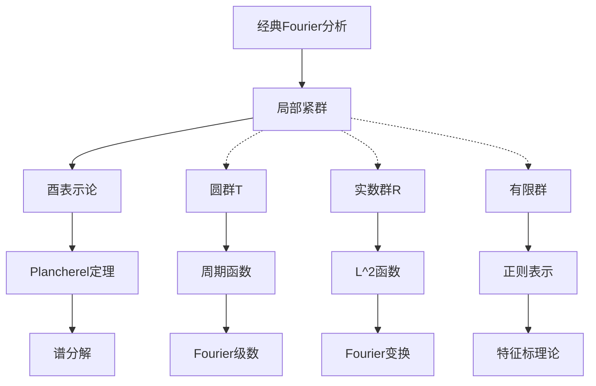

### 1.3 微分方程与代数结构

| 微分方程类型 | 代数结构 | 联系机制 | 研究领域 |
|--------------|----------|----------|----------|
| 线性ODE | D模 | 微分算子环 | 代数分析 |
| Hamilton系统 | 李群 | 对称性约化 | 可积系统 |
| 量子化PDE | 形变量子化 | *-积 | 数学物理 |
| 特征值问题 | 谱序列 | 同调方法 | 指标理论 |

---

## 2️⃣ 几何与分析的交汇

### 2.1 微分几何中的分析工具

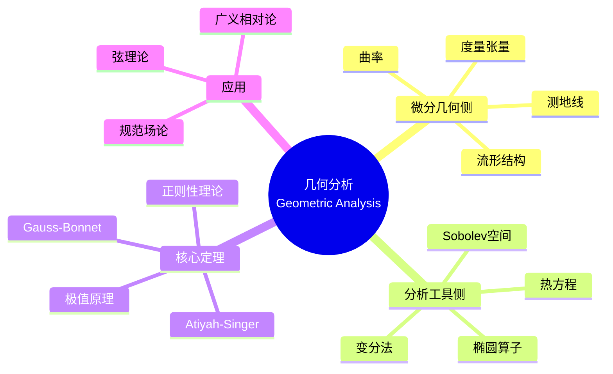

**关键交汇点**

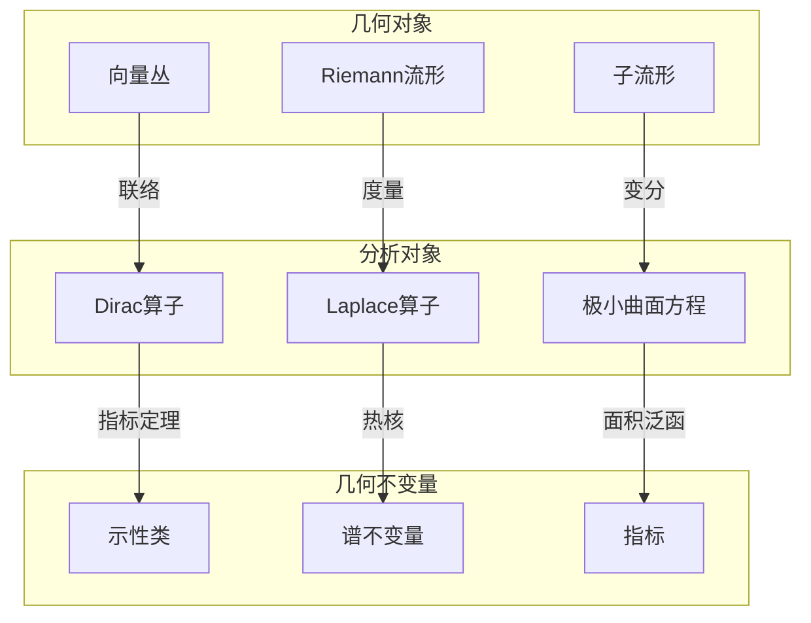

### 2.2 几何测度论

| 几何概念 | 分析工具 | 测度论框架 | 应用 |
|----------|----------|------------|------|
|  Hausdorff维数 | 覆盖论证 | 外测度 | 分形几何 |
|  几何变分问题 | 直接法 | 弱收敛 | 极小曲面 |
|  曲率流 | PDE方法 | 测度演化 | 拓扑分类 |
|  最优输运 | 凸分析 | 概率测度 | 经济学 |

### 2.3 复几何与多复变分析

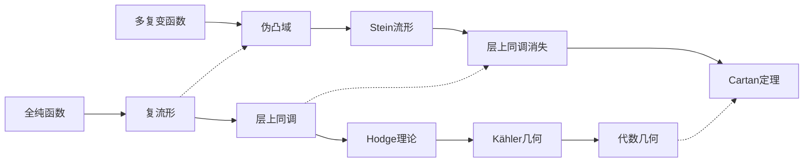

---

## 3️⃣ 概率与分析的融合

### 3.1 随机分析框架

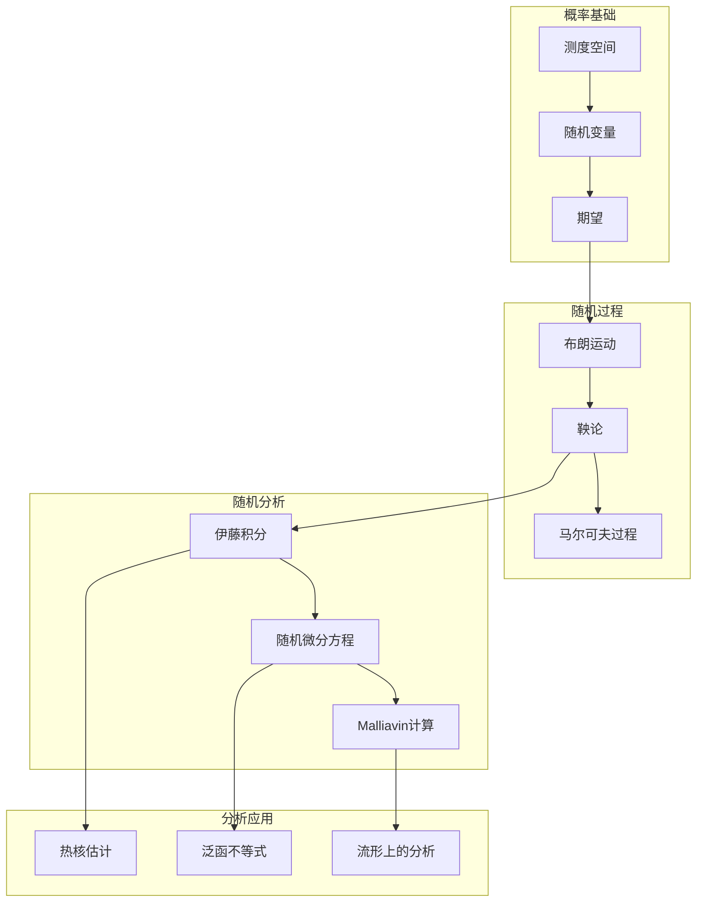

### 3.2 概率方法与分析技术

| 概率工具 | 分析对应 | 融合领域 | 典型结果 |
|----------|----------|----------|----------|
| 鞅收敛 | 极大函数估计 | 调和分析 | Doob不等式 |
| 布朗运动 | 热方程 | 位势论 | Feynman-Kac公式 |
| 随机积分 | 分布理论 | 白噪声分析 | Wick积 |
| 大偏差 | 变分原理 | 统计力学 | Cramér定理 |
| 耦合方法 | 最优输运 | 几何分析 | Bakry-Émery理论 |

### 3.3 随机矩阵与自由概率

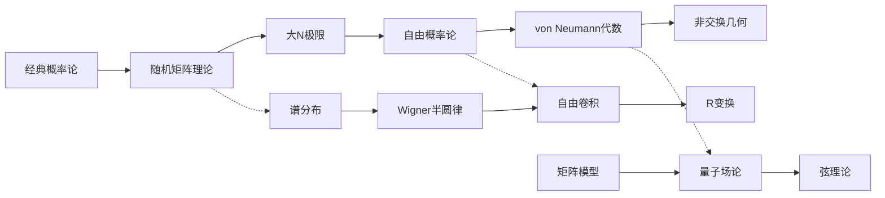

---

## 4️⃣ 拓扑与代数的统一

### 4.1 代数拓扑的核心框架

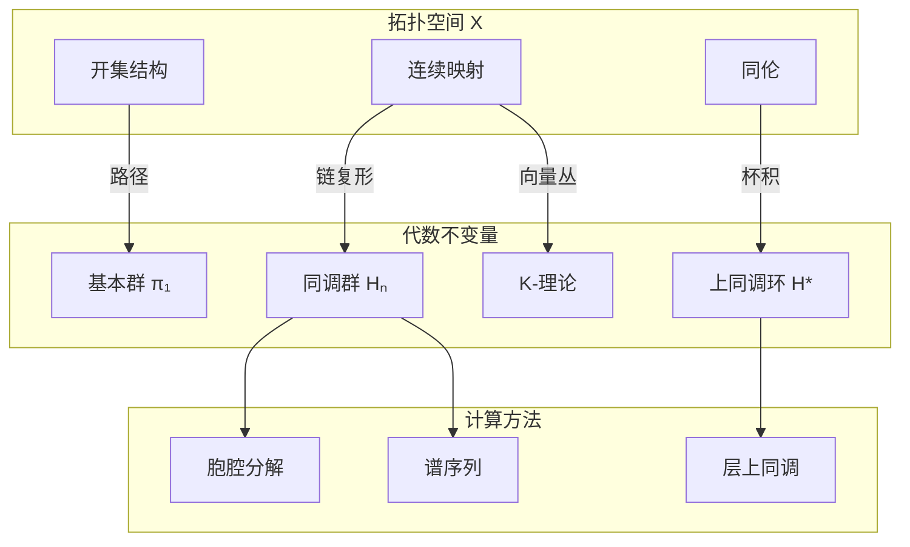

### 4.2 同调代数的统一视角

| 领域 | 链复形类型 | 同调理论 | 应用场景 |
|------|------------|----------|----------|
| 代数拓扑 | 奇异链 | 奇异同调 | 空间分类 |
| 微分几何 | de Rham复形 | de Rham上同调 | 微分形式 |
| 复几何 | Dolbeault复形 | Dolbeault上同调 | 全纯结构 |
| 代数几何 | 层上同调 | 格罗滕迪克上同调 | 概形理论 |
| 表示论 | 李代数复形 | 李代数上同调 | 扩张理论 |
| 数论 | Galois上同调 | étale上同调 | 算术几何 |

### 4.3 范畴论视角的统一

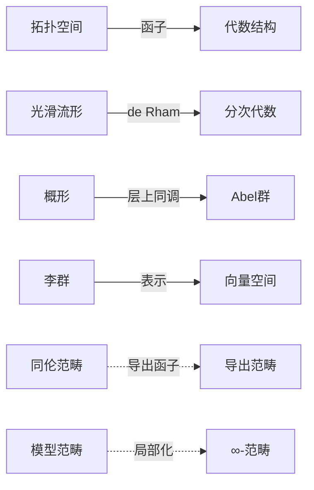

---

## 5️⃣ 数论的多元连接

### 5.1 算术几何：数论与代数的融合

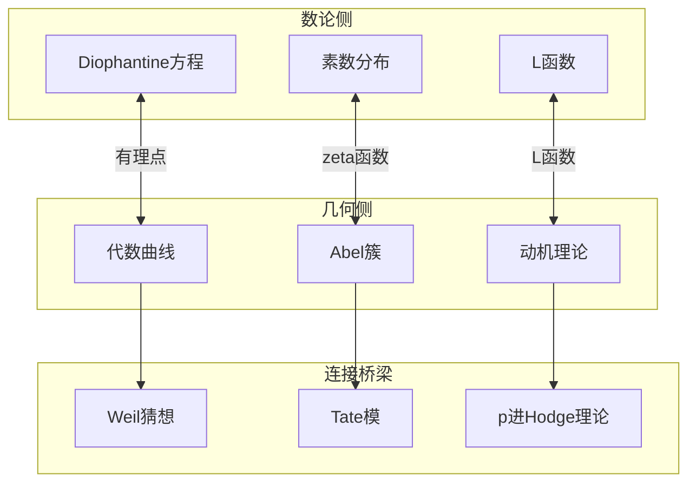

### 5.2 Langlands纲领：终极统一

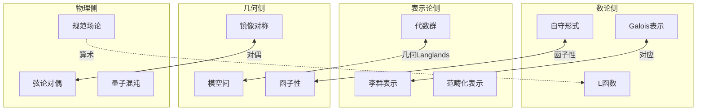

---

## 6️⃣ 跨学科应用网络

### 6.1 数学物理网络

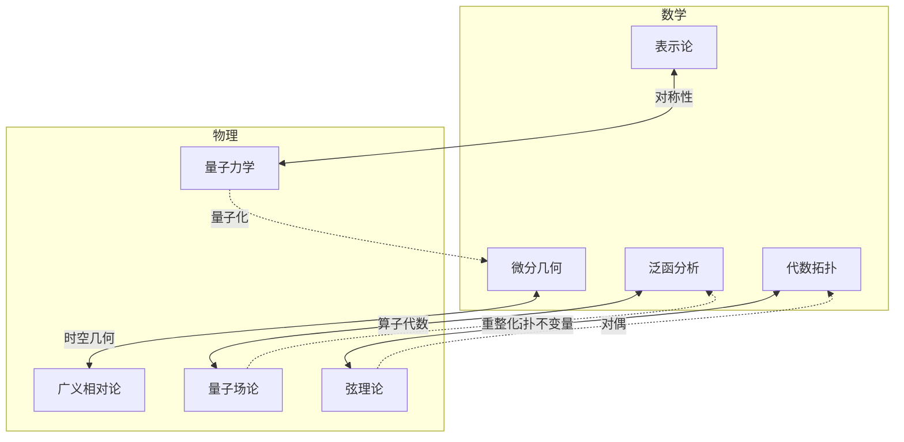

### 6.2 计算与信息科学

| 数学领域 | 计算应用 | 信息科学应用 | 交叉成果 |
|----------|----------|--------------|----------|
| 代数几何 | 符号计算 | 编码理论 | 代数几何码 |
| 拓扑学 | 计算拓扑 | 数据分析 | 持续同调 |
| 概率论 | 蒙特卡洛方法 | 机器学习 | 随机梯度下降 |
| 组合数学 | 算法设计 | 密码学 | 后量子密码 |
| 动力系统 | 数值模拟 | 混沌加密 | 同步理论 |

---

## 7️⃣ 统一数学的哲学展望

### 7.1 现代数学的三大支柱

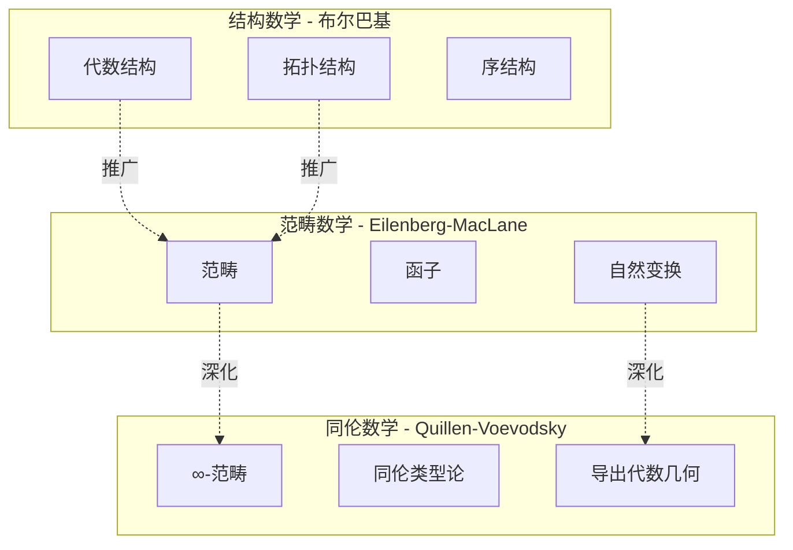

### 7.2 未来统一方向

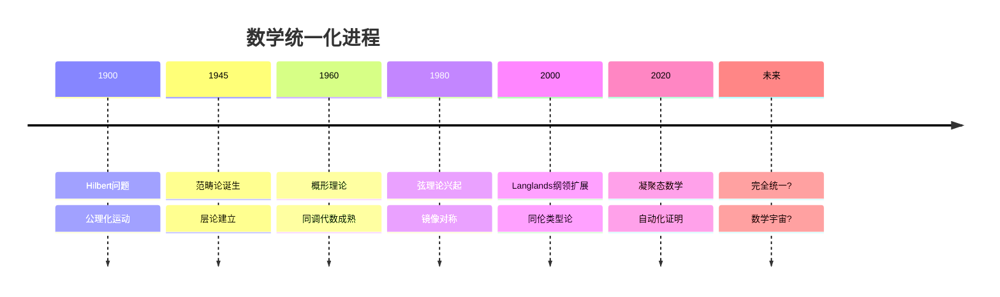

---

## 📚 延伸阅读

| 主题 | 推荐资源 | 难度 |
|------|----------|------|
| 代数几何与分析 | [代数几何与分析交汇](00-概念关联图谱/跨分支/03-几何分析统一.md) | ⭐⭐⭐⭐ |
| 数论与代数 | [代数数论桥梁](00-概念关联图谱/跨分支/02-代数数论桥梁.md) | ⭐⭐⭐⭐⭐ |
| 范畴论视角 | [代数结构范畴论视角](00-概念关联图谱/代数/03-代数结构范畴论视角.md) | ⭐⭐⭐⭐ |
| 物理应用 | [数学到物理学应用网络](00-跨学科应用网络/01-数学到物理学应用网络.md) | ⭐⭐⭐⭐ |

---

> **核心洞察**：现代数学的发展趋势是越来越强调不同分支之间的深层联系。从代数拓扑的诞生到Langlands纲领，从镜像对称到同伦类型论，数学家们正在构建一个更加统一和和谐的知识体系。

---

*本文档展示数学各分支的交叉融合 | 最后更新：2026-04*
