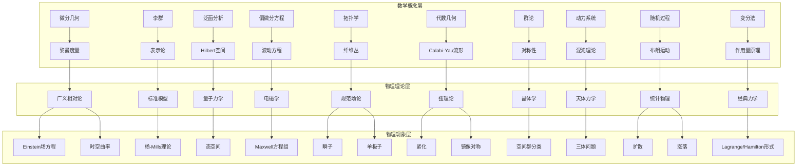

msc_primary: "00A99"
msc_secondary: ['00-XX']
---

# 数学→物理学应用网络

## 网络总览

## 核心映射详解

---

### 1. 微分几何 → 广义相对论

#### 数学理论

微分几何是研究光滑流形上微积分结构的数学分支。核心概念包括：

**流形（Manifold）**：局部同胚于欧氏空间的拓扑空间，允许我们在弯曲的空间上进行微积分运算。一个$n$维流形$M$满足：对于每一点$p \in M$，存在邻域$U$同胚于$\mathbb{R}^n$的开子集。

**黎曼度量（Riemannian Metric）**：流形上每一点切空间配备的内积结构，表示为对称正定$(0,2)$型张量场$g_{\mu\nu}$。度量张量定义了：

- 曲线长度：$L = \int_a^b \sqrt{g_{\mu\nu} \frac{dx^\mu}{dt} \frac{dx^\nu}{dt}} dt$
- 角度测量
- 体积元：$dV = \sqrt{|g|} dx^1 \wedge \cdots \wedge dx^n$

**联络与曲率**：Levi-Civita联络$\nabla$定义了向量沿曲线的平行移动，由此导出：

- Riemann曲率张量：$R^\rho_{\sigma\mu\nu} = \partial_\mu \Gamma^\rho_{\nu\sigma} - \partial_\nu \Gamma^\rho_{\mu\sigma} + \Gamma^\rho_{\mu\lambda}\Gamma^\lambda_{\nu\sigma} - \Gamma^\rho_{\nu\lambda}\Gamma^\lambda_{\mu\sigma}$
- Ricci张量：$R_{\mu\nu} = R^\lambda_{\mu\lambda\nu}$
- 标量曲率：$R = g^{\mu\nu}R_{\mu\nu}$

#### 对应问题

广义相对论的核心问题：

1. **引力本质**：引力不是力，而是时空几何的表现
2. **物质如何弯曲时空**：质量-能量分布决定时空曲率
3. **弯曲时空如何决定物质运动**：测地线运动方程

#### 建模过程

**步骤1：时空模型化**

- 将时空视为4维伪黎曼流形$(M, g)$，度量的号差为$(-,+,+,+)$
- 事件对应流形上的点

**步骤2：物质场描述**

- 引入应力-能量张量$T_{\mu\nu}$描述物质分布
- 完美流体：$T_{\mu\nu} = (\rho + p)u_\mu u_\nu + p g_{\mu\nu}$

**步骤3：建立场方程**

- Einstein场方程：$G_{\mu\nu} + \Lambda g_{\mu\nu} = \frac{8\pi G}{c^4} T_{\mu\nu}$
- 其中Einstein张量：$G_{\mu\nu} = R_{\mu\nu} - \frac{1}{2}g_{\mu\nu}R$

#### 求解方法

**真空场方程求解**（$T_{\mu\nu} = 0$）：

1. 假设球对称静态度规（Schwarzschild解）
2. 度规形式：$ds^2 = -A(r)dt^2 + B(r)dr^2 + r^2(d\theta^2 + \sin^2\theta d\phi^2)$
3. 计算Christoffel符号和Ricci张量
4. 解$R_{\mu\nu} = 0$得：$A(r) = 1 - \frac{2GM}{c^2 r}$，$B(r) = A(r)^{-1}$

**线性近似（弱场近似）**：

- 设$g_{\mu\nu} = \eta_{\mu\nu} + h_{\mu\nu}$，$|h_{\mu\nu}| \ll 1$

- 得到线性化Einstein方程，预言引力波

#### 具体实例：Schwarzschild解与黑洞

**问题**：求球对称质量$M$外部的时空度规

**求解过程**：

设度规具有球对称性：
$$ds^2 = -e^{2\Phi(r)}dt^2 + e^{2\Lambda(r)}dr^2 + r^2(d\theta^2 + \sin^2\theta d\phi^2)$$

计算非零Christoffel符号：
$$\Gamma^t_{tr} = \Phi', \quad \Gamma^r_{tt} = \Phi' e^{2\Phi-2\Lambda}, \quad \Gamma^r_{rr} = \Lambda'$$
$$\Gamma^r_{\theta\theta} = -re^{-2\Lambda}, \quad \Gamma^r_{\phi\phi} = -r\sin^2\theta e^{-2\Lambda}$$

计算Ricci张量分量：
$$R_{tt} = e^{2\Phi-2\Lambda}(\Phi'' + \Phi'^2 - \Phi'\Lambda' + \frac{2\Phi'}{r})$$
$$R_{rr} = -\Phi'' - \Phi'^2 + \Phi'\Lambda' + \frac{2\Lambda'}{r}$$

由$R_{\mu\nu} = 0$和$R_{tt} = 0$，$R_{rr} = 0$：
$$\Phi' + \Lambda' = 0 \Rightarrow \Phi = -\Lambda$$

由$R_{\theta\theta} = 0$：
$$e^{-2\Lambda}(1 - r\Lambda') = 1 \Rightarrow (re^{-2\Lambda})' = 1$$

积分得：$e^{-2\Lambda} = 1 - \frac{C}{r}$

由渐近平直条件（$r \to \infty$时$g_{\mu\nu} \to \eta_{\mu\nu}$）和Newton极限：
$$C = \frac{2GM}{c^2}$$

**最终解**：
$$ds^2 = -\left(1 - \frac{2GM}{c^2 r}\right)c^2 dt^2 + \left(1 - \frac{2GM}{c^2 r}\right)^{-1}dr^2 + r^2 d\Omega^2$$

**物理预言**：

1. **事件视界**：$r_s = \frac{2GM}{c^2}$（Schwarzschild半径）
2. **引力红移**：$\frac{\Delta \lambda}{\lambda} = \frac{1}{\sqrt{1-\frac{r_s}{r}}} - 1$
3. **光线偏折**：太阳边缘偏折角$\delta\theta = \frac{4GM}{c^2 b} \approx 1.75''$

---

### 2. 李群与表示论 → 粒子物理标准模型

#### 数学理论

**李群（Lie Group）**：既是群又是光滑流形的代数结构，群运算$(g, h) \mapsto gh$和$g \mapsto g^{-1}$是光滑映射。

**基本例子**：

- $U(n)$：$n \times n$酉矩阵群，$U^\dagger U = I$
- $SU(n)$：行列式为1的$U(n)$子群
- $SO(n)$：$n$维特殊正交群

**李代数（Lie Algebra）**：李群在单位元处的切空间$\mathfrak{g} = T_e G$，配备李括号$[,]: \mathfrak{g} \times \mathfrak{g} \to \mathfrak{g}$。

**表示论（Representation Theory）**：

- 群表示：同态$\rho: G \to GL(V)$，将群元素映射为向量空间$V$上的可逆线性变换
- 不可约表示：没有非平凡不变子空间的表示
- 特征标：$\chi(g) = \text{tr}(\rho(g))$

#### 对应问题

粒子物理的基本问题：

1. **基本粒子的分类**：自旋、电荷、色荷等量子数
2. **相互作用的统一**：强、弱、电磁相互作用
3. **守恒定律的起源**：对称性与守恒量的关系

#### 建模过程

**步骤1：规范对称性**

- 局域规范变换：$\psi(x) \mapsto e^{i\alpha(x)}\psi(x)$
- 引入规范场$A_\mu$使得协变导数$D_\mu = \partial_\mu + igA_\mu$协变

**步骤2：标准模型规范群**
$$G_{SM} = SU(3)_C \times SU(2)_L \times U(1)_Y$$

- $SU(3)_C$：色对称性，8个生成元对应8个胶子
- $SU(2)_L$：弱同位旋，3个生成元对应$W^\pm, Z^0$
- $U(1)_Y$：超荷，1个生成元

**步骤3：物质场表示**

- 夸克：$Q_L \sim (3, 2, 1/6)$，$u_R \sim (3, 1, 2/3)$，$d_R \sim (3, 1, -1/3)$
- 轻子：$L_L \sim (1, 2, -1/2)$，$e_R \sim (1, 1, -1)$
- Higgs场：$H \sim (1, 2, 1/2)$

#### 具体实例：杨-Mills理论

**杨-Mills作用量**：
$$S = -\frac{1}{4}\int d^4x \, F^a_{\mu\nu} F^{a\mu\nu}$$

其中场强张量：
$$F^a_{\mu\nu} = \partial_\mu A^a_\nu - \partial_\nu A^a_\mu + g f^{abc} A^b_\mu A^c_\nu$$

**运动方程**：
$$D_\mu F^{a\mu\nu} = 0$$

**瞬子解**：
考虑欧氏空间$SU(2)$杨-Mills理论，寻找自对偶解$F_{\mu\nu} = \tilde{F}_{\mu\nu}$。

BPST瞬子解：
$$A_\mu = \frac{\eta_{\mu\nu}^a x_\nu}{x^2 + \rho^2}$$

其中$\eta_{\mu\nu}^a$是't Hooft符号。该解：

- 具有 Pontryagin数 $n = 1$
- 作用量 $S = \frac{8\pi^2}{g^2}$
- 瞬子大小$\rho$和位置是集体坐标

**物理意义**：

- 描述量子隧穿过程
- 解释强CP问题
- 与QCD真空结构相关

---

### 3. 泛函分析 → 量子力学

#### 数学理论

**Hilbert空间**：完备的内积空间，量子力学的态空间。

**基本结构**：

- 向量$|\psi\rangle$表示量子态
- 内积$\langle\phi|\psi\rangle$给复出概率幅
- 范数$\|\psi\| = \sqrt{\langle\psi|\psi\rangle}$

**算子理论**：

- **自伴算子**：$A^\dagger = A$，对应物理可观测量
- **谱定理**：自伴算子有实谱，对应测量结果
- **投影算子**：$P^2 = P = P^\dagger$，对应测量后的态

**重要算子**：

- 位置算子：$(\hat{x}\psi)(x) = x\psi(x)$
- 动量算子：$\hat{p} = -i\hbar \frac{d}{dx}$
- Hamilton算子：$\hat{H} = -\frac{\hbar^2}{2m}\nabla^2 + V(x)$

#### 对应问题

量子力学的数学基础：

1. **态的数学描述**：波函数的性质与归一化
2. **测量理论**：测量结果的概率解释
3. **时间演化**：Schrödinger方程的数学结构
4. **不确定性原理**：算子非对易性的物理后果

#### 建模过程

**步骤1：构造态空间**

- 单粒子：$L^2(\mathbb{R}^3)$，平方可积函数空间
- 内积：$\langle\phi|\psi\rangle = \int_{\mathbb{R}^3} \phi^*(x)\psi(x) d^3x$

**步骤2：可观测量算子化**

- 经典可观测量$f(x, p)$对应量子算子$\hat{f} = f(\hat{x}, \hat{p})$
- 正规序化解决算子排序模糊性

**步骤3：测量公设**

- 测量$A$得本征值$a_n$的概率：$P_n = |\langle n|\psi\rangle|^2$
- 测量后态坍缩到$|n\rangle$
- 期望值：$\langle A \rangle = \langle\psi|A|\psi\rangle$

#### 具体实例：谐振子的代数解法

**问题**：求解一维量子谐振子
$$\hat{H} = \frac{\hat{p}^2}{2m} + \frac{1}{2}m\omega^2 \hat{x}^2$$

**求解过程**：

定义升降算子：
$$\hat{a} = \sqrt{\frac{m\omega}{2\hbar}}\left(\hat{x} + \frac{i\hat{p}}{m\omega}\right)$$
$$\hat{a}^\dagger = \sqrt{\frac{m\omega}{2\hbar}}\left(\hat{x} - \frac{i\hat{p}}{m\omega}\right)$$

对易关系：
$$[\hat{a}, \hat{a}^\dagger] = 1$$

Hamilton量改写：
$$\hat{H} = \hbar\omega\left(\hat{a}^\dagger\hat{a} + \frac{1}{2}\right) = \hbar\omega\left(\hat{N} + \frac{1}{2}\right)$$

**代数求解**：

1. 设$\hat{N}|n\rangle = n|n\rangle$，则$\hat{H}|n\rangle = E_n|n\rangle$，$E_n = \hbar\omega(n + \frac{1}{2})$
2. 由正定性：$\langle\psi|\hat{N}|\psi\rangle = \|\hat{a}|\psi\rangle\|^2 \geq 0$
3. 存在基态$|0\rangle$满足$\hat{a}|0\rangle = 0$
4. 激发态：$|n\rangle = \frac{1}{\sqrt{n!}}(\hat{a}^\dagger)^n|0\rangle$

**波函数求解**：
由$\hat{a}|0\rangle = 0$：

$$\left(\frac{d}{dx} + \frac{m\omega}{\hbar}x\right)\psi_0(x) = 0$$

解得：
$$\psi_0(x) = \left(\frac{m\omega}{\pi\hbar}\right)^{1/4} e^{-\frac{m\omega}{2\hbar}x^2}$$

激发态波函数：
$$\psi_n(x) = \frac{1}{\sqrt{2^n n!}} H_n(\xi) \psi_0(x)$$

其中$\xi = \sqrt{\frac{m\omega}{\hbar}}x$，$H_n$是Hermite多项式。

**物理意义**：

- 能量量子化：$E_n = \hbar\omega(n + \frac{1}{2})$
- 零点能：$E_0 = \frac{1}{2}\hbar\omega$（量子涨落）
- 能级等间距：$\Delta E = \hbar\omega$

---

### 4. 偏微分方程 → 电磁学

#### 数学理论

**波动方程**：
$$\frac{\partial^2 u}{\partial t^2} = c^2 \nabla^2 u$$

**向量微积分**：

- 梯度：$\nabla \phi$
- 散度：$\nabla \cdot \mathbf{A}$
- 旋度：$\nabla \times \mathbf{A}$
- Laplacian：$\nabla^2 \phi = \nabla \cdot \nabla \phi$

**Green函数方法**：

- 求解$\nabla^2 G(\mathbf{x}, \mathbf{x}') = -\delta(\mathbf{x} - \mathbf{x}')$
- 3维：$G(\mathbf{x}, \mathbf{x}') = \frac{1}{4\pi|\mathbf{x} - \mathbf{x}'|}$

#### 对应问题

经典电动力学的核心问题：

1. **场的产生**：电荷如何产生电磁场
2. **场的演化**：电磁场的动力学方程
3. **场与物质的相互作用**：Lorentz力
4. **辐射**：加速电荷的电磁辐射

#### 建模过程

**步骤1：场量的定义**

- 电场$\mathbf{E}$和磁场$\mathbf{B}$是基本场量
- 由标量势$\phi$和向量势$\mathbf{A}$表示：$\mathbf{E} = -\nabla\phi - \frac{\partial\mathbf{A}}{\partial t}$，$\mathbf{B} = \nabla \times \mathbf{A}$

**步骤2：Maxwell方程组**

- Gauss定律：$\nabla \cdot \mathbf{E} = \frac{\rho}{\varepsilon_0}$
- Faraday定律：$\nabla \times \mathbf{E} = -\frac{\partial\mathbf{B}}{\partial t}$
- 磁无源：$\nabla \cdot \mathbf{B} = 0$
- Ampère-Maxwell定律：$\nabla \times \mathbf{B} = \mu_0 \mathbf{J} + \mu_0\varepsilon_0 \frac{\partial\mathbf{E}}{\partial t}$

**步骤3：规范不变性**

- 规范变换：$\mathbf{A}' = \mathbf{A} + \nabla \lambda$，$\phi' = \phi - \frac{\partial\lambda}{\partial t}$
- Lorenz规范：$\nabla \cdot \mathbf{A} + \frac{1}{c^2}\frac{\partial\phi}{\partial t} = 0$

#### 具体实例：点电荷的推迟势

**问题**：求运动点电荷产生的电磁势

**求解过程**：

在Lorenz规范下，势满足波动方程：
$$\nabla^2 \phi - \frac{1}{c^2}\frac{\partial^2\phi}{\partial t^2} = -\frac{\rho}{\varepsilon_0}$$
$$\nabla^2 \mathbf{A} - \frac{1}{c^2}\frac{\partial^2\mathbf{A}}{\partial t^2} = -\mu_0 \mathbf{J}$$

使用Green函数求解，考虑推迟条件：
$$\phi(\mathbf{x}, t) = \frac{1}{4\pi\varepsilon_0} \int \frac{\rho(\mathbf{x}', t_r)}{|\mathbf{x} - \mathbf{x}'|} d^3x'$$

其中$t_r = t - \frac{|\mathbf{x} - \mathbf{x}'|}{c}$是推迟时间。

对于点电荷$q$沿轨迹$\mathbf{r}(t)$运动：
$$\rho(\mathbf{x}, t) = q\delta(\mathbf{x} - \mathbf{r}(t))$$

计算积分需考虑$\delta$函数的变换：
$$\phi(\mathbf{x}, t) = \frac{q}{4\pi\varepsilon_0} \frac{1}{(1 - \hat{\mathbf{n}} \cdot \boldsymbol{\beta})R}\bigg|_{t_r}$$

其中：

- $R(t') = |\mathbf{x} - \mathbf{r}(t')|$

- $\hat{\mathbf{n}} = \frac{\mathbf{x} - \mathbf{r}(t')}{R(t')}$
- $\boldsymbol{\beta} = \frac{\mathbf{v}(t')}{c}$
- 推迟时间$t_r$满足：$t_r = t - \frac{R(t_r)}{c}$

**Liénard-Wiechert势**：
$$\phi(\mathbf{x}, t) = \frac{1}{4\pi\varepsilon_0} \left[\frac{q}{(1 - \mathbf{n} \cdot \boldsymbol{\beta})R}\right]_{\text{ret}}$$
$$\mathbf{A}(\mathbf{x}, t) = \frac{\mu_0}{4\pi} \left[\frac{q\mathbf{v}}{(1 - \mathbf{n} \cdot \boldsymbol{\beta})R}\right]_{\text{ret}}$$

**物理意义**：

- 电磁作用以光速传播
- 分母中的$(1 - \mathbf{n} \cdot \boldsymbol{\beta})$因子产生相对论性聚束效应
- 加速电荷辐射电磁波的数学基础

---

### 5. 拓扑学 → 规范场论

#### 数学理论

**纤维丛（Fiber Bundle）**：

- 全空间$E$，底空间$M$，纤维$F$
- 投影映射$\pi: E \to M$，$\pi^{-1}(p) \cong F$
- 局部平凡化：$\pi^{-1}(U) \cong U \times F$

**主丛（Principal Bundle）**：

- 纤维是李群$G$
- 群作用保持纤维结构

**联络与曲率**：

- 联络1-形式$\omega$：定义纤维上的水平子空间
- 曲率2-形式$\Omega = d\omega + \omega \wedge \omega$

**示性类（Characteristic Classes）**：

- Chern类：$c(E) = \det(I + \frac{iF}{2\pi})$
- Pontryagin类：$p(E) = \det(I + \frac{F}{2\pi})$

#### 对应问题

规范场论的拓扑问题：

1. **瞬子与拓扑荷**：规范场构型的拓扑分类
2. **磁单极子**：拓扑稳定性
3. **手征反常**：拓扑与量子化
4. **大规范变换**：真空拓扑结构

#### 建模过程

**步骤1：物理量的几何对应**

- 规范势$\mathbf{A}_\mu$ → 联络1-形式
- 场强$\mathbf{F}_{\mu\nu}$ → 曲率2-形式
- 物质场 → 伴丛的截面

**步骤2：拓扑不变量**

- 第二Chern数：$C_2 = \frac{1}{8\pi^2} \int_{S^4} \text{tr}(F \wedge F)$
- 对于$SU(2)$瞬子，$C_2 \in \mathbb{Z}$

**步骤3：指标定理**

- Atiyah-Singer指标定理：$\text{index}(D) = \int_M \hat{A}(M) \wedge \text{ch}(E)$
- 联系解析性质与拓扑性质

#### 具体实例：磁单极子的拓扑描述

**Dirac单极子**：
考虑$U(1)$规范理论，磁单极子满足：
$$\nabla \cdot \mathbf{B} = g\delta^{(3)}(\mathbf{r})$$

**矢量势的多值性**：
由于$\nabla \cdot \mathbf{B} \neq 0$，不能全局定义$\mathbf{A}$使$\mathbf{B} = \nabla \times \mathbf{A}$。

使用两个坐标卡：

- 北半球：$\mathbf{A}^{(N)} = \frac{g}{4\pi r}\frac{1-\cos\theta}{\sin\theta}\hat{\phi}$
- 南半球：$\mathbf{A}^{(S)} = -\frac{g}{4\pi r}\frac{1+\cos\theta}{\sin\theta}\hat{\phi}$

**过渡函数**：
在赤道重叠区域：
$$\mathbf{A}^{(N)} - \mathbf{A}^{(S)} = \frac{g}{2\pi r\sin\theta}\hat{\phi} = \nabla\left(\frac{g\phi}{2\pi}\right)$$

这对应规范变换：
$$\psi^{(N)} = e^{ig\phi/\hbar} \psi^{(S)}$$

**Dirac量子化条件**：
波函数单值性要求：
$$\frac{qg}{\hbar} = 2\pi n, \quad n \in \mathbb{Z}$$

这是磁荷量子化的拓扑起源。

---

### 6. 代数几何 → 弦理论

#### 数学理论

**复流形**：

- 坐标卡同胚于$\mathbb{C}^n$的开子集
- 转移函数全纯

**Kähler流形**：

- 具有Hermitian度量$g_{i\bar{j}}$
- Kähler形式$\omega = ig_{i\bar{j}}dz^i \wedge d\bar{z}^j$是闭的：$d\omega = 0$

**Calabi-Yau流形**：

- 紧Kähler流形
- 第一陈类$c_1 = 0$
- 具有全纯$n$-形式$\Omega$
- Ricci平坦Kähler度量

#### 对应问题

弦理论紧致化的数学问题：

1. **额外维度的几何**：10维时空紧致化到4维
2. **超对称保持**：Calabi-Yau流形保持部分超对称
3. **粒子谱**：Hodge数决定低能有效理论的物质内容
4. **模空间**：Calabi-Yau的形变空间

#### 建模过程

**步骤1：紧致化方案**

- 10维时空：$M_{10} = M_4 \times X_6$
- $X_6$是6维Calabi-Yau流形

**步骤2：超对称条件**

- 需要$X_6$具有$SU(3)$和乐群（非平凡）
- 保持4维$N=1$超对称

**步骤3：物理量与几何对应**

- Euler示性数$\chi$：代数目
- Hodge数$h^{1,1}$：Kähler模数（矢量多重态）
- Hodge数$h^{2,1}$：复结构模数（超多重态）

#### 具体实例：镜像对称

**镜像对称猜想**（Candelas-de la Ossa-Green-Parkes）：
对于Calabi-Yau 3-流形$X$和它的镜像$X^*$：

- Hodge数交换：$h^{1,1}(X) = h^{2,1}(X^*)$，$h^{2,1}(X) = h^{1,1}(X^*)$
- 复结构模空间 ↔ Kähler模空间

**物理意义**：

- IIA弦在$X$上的紧致化 ↔ IIB弦在$X^*$上的紧致化
- $h^{1,1}$决定矢量玻色子数，$h^{2,1}$决定超多重态数

**数值验证**（Quintic超曲面）：
考虑$\mathbb{CP}^4$中的5次超曲面：
$$X = \{[z_0:\cdots:z_4] \in \mathbb{CP}^4 : z_0^5 + \cdots + z_4^5 = 0\}$$

Hodge数：$h^{1,1} = 1$，$h^{2,1} = 101$

镜像流形$X^*$的Hodge数：$h^{1,1} = 101$，$h^{2,1} = 1$

**瞬子求和与周期积分**：
镜像对称预言：
$$\sum_{d=0}^{\infty} n_d q^d = \frac{5}{\varpi_0^2}\left(q\frac{d}{dq}\right)^2\frac{\varpi_1}{\varpi_0}$$

其中$\varpi_i$是Picard-Fuchs方程的解。预言的Gromov-Witten不变量$n_d$与代数几何计算一致。

---

### 7. 群论 → 晶体学

#### 数学理论

**群（Group）**：配备二元运算的集合$(G, \cdot)$，满足：

- 封闭性
- 结合律
- 单位元$e$
- 逆元

**空间群（Space Group）**：

- 晶体对称性的完整描述
- 形式：$\{R|\mathbf{t}\}$，其中$R$是点群操作，$\mathbf{t}$是平移
- 群运算：$\{R_2|\mathbf{t}_2\}\{R_1|\mathbf{t}_1\} = \{R_2R_1|R_2\mathbf{t}_1 + \mathbf{t}_2\}$

**平移群与点群**：

- 平移子群$T$：所有纯平移
- 点群$P$：空间群商去平移，$P = G/T$

#### 对应问题

晶体结构分类问题：

1. **对称性分类**：230种空间群
2. **X射线衍射**：对称性与衍射花样
3. **相变理论**：对称性破缺
4. **能带结构**：Bloch定理与群论

#### 建模过程

**步骤1：Bravais格子分类**

- 7大晶系（立方、四方、六方、三方、正交、单斜、三斜）
- 14种Bravais格子

**步骤2：空间群构造**

- 点群操作：旋转、反映、反演、旋转反演
- 非初基平移：螺旋轴、滑移面

**步骤3：表示论应用**

- 不可约表示对应能带标记
- 选择定则

#### 具体实例：金刚石结构的空间群

**结构描述**：

- 面心立方Bravais格子
- 基元：$(0,0,0)$和$\frac{a}{4}(1,1,1)$
- 空间群：$Fd\bar{3}m$（No. 227）

**对称操作**：

1. 面心立方平移：$\mathbf{a}_1 = \frac{a}{2}(0,1,1)$，$\mathbf{a}_2 = \frac{a}{2}(1,0,1)$，$\mathbf{a}_3 = \frac{a}{2}(1,1,0)$
2. 点群$O_h$：48个操作
3. 非初基操作：d滑移面

**物理性质**：

- 光学支与声学支的分离
- 间接带隙半导体
- 高对称点标记：$\Gamma$、X、L、K、W

---

### 8. 动力系统 → 天体力学

#### 数学理论

**动力系统**：

- 相空间$M$上的流$\phi_t: M \to M$
- 微分方程：$\frac{d\mathbf{x}}{dt} = \mathbf{f}(\mathbf{x})$

**混沌理论**：

- 李雅普诺夫指数：$\lambda = \lim_{t \to \infty} \frac{1}{t}\ln\frac{|\delta\mathbf{x}(t)|}{|\delta\mathbf{x}(0)|}$

- 正李雅普诺夫指数 → 混沌
- 对初值敏感依赖

**Hamilton系统**：

- 正则方程：$\dot{q} = \frac{\partial H}{\partial p}$，$\dot{p} = -\frac{\partial H}{\partial q}$
- Liouville定理：相空间体积守恒

#### 对应问题

天体力学的核心问题：

1. **轨道稳定性**：太阳系稳定性
2. **三体问题**：一般不可积
3. **KAM理论**：小扰动下的准周期运动
4. **潮汐演化**：能量耗散

#### 具体实例：限制性三体问题

**问题设置**：

- 两个大质量天体（主星$m_1$、伴星$m_2$）做圆轨道运动
- 小质量天体$m \ll m_1, m_2$在它们的引力场中运动

**无量纲化**：
设$m_1 + m_2 = 1$，距离$a = 1$，角速度$\omega = 1$

- $\mu = \frac{m_2}{m_1 + m_2}$
- 两星位置：$(-\mu, 0)$和$(1-\mu, 0)$

**旋转坐标系中的运动方程**：
$$\ddot{x} - 2\dot{y} = -\frac{\partial U}{\partial x}$$
$$\ddot{y} + 2\dot{x} = -\frac{\partial U}{\partial y}$$

其中有效势：
$$U(x,y) = -\frac{1}{2}(x^2 + y^2) - \frac{1-\mu}{r_1} - \frac{\mu}{r_2}$$
$$r_1 = \sqrt{(x+\mu)^2 + y^2}, \quad r_2 = \sqrt{(x-1+\mu)^2 + y^2}$$

**Jacobi积分**：
$$C = 2U - (\dot{x}^2 + \dot{y}^2)$$

是运动常数，限制运动区域。

**Lagrange点**：
$\nabla U = 0$的5个解：

- L1、L2、L3（共线）：不稳定
- L4、L5（三角）：当$m_2 < 0.04m_1$时稳定

**混沌行为**：

- 对于某些Jacobi常数，Poincaré截面显示复杂结构
- 存在稳定岛与混沌海

---

### 9. 随机过程 → 统计物理

#### 数学理论

**Wiener过程（布朗运动）**：

- $W(0) = 0$
- 独立增量：$W(t) - W(s) \sim N(0, t-s)$
- 几乎处处连续，几乎处处不可微

**随机微分方程（SDE）**：
$$dX_t = a(X_t, t)dt + b(X_t, t)dW_t$$

**Fokker-Planck方程**：
概率密度$P(x,t)$的演化：
$$\frac{\partial P}{\partial t} = -\frac{\partial}{\partial x}[a(x)P] + \frac{1}{2}\frac{\partial^2}{\partial x^2}[b(x)^2 P]$$

**涨落-耗散定理**：
$$\langle x(t)x(0) \rangle = k_B T \chi(t)$$

#### 对应问题

统计物理的随机问题：

1. **布朗运动**：悬浮粒子的随机运动
2. **涨落**：热平衡中的能量涨落
3. **扩散**：物质输运
4. **噪声**：电路中的热噪声

#### 具体实例：Ornstein-Uhlenbeck过程

**物理背景**：
布朗粒子在流体中受到：

- 粘滞阻力：$-\gamma v$
- 随机力：$\xi(t)$（白噪声）

**Langevin方程**：
$$m\frac{dv}{dt} = -\gamma v + \xi(t)$$

其中$\langle\xi(t)\xi(t')\rangle = 2\gamma k_B T \delta(t-t')$

**求解**：
定义$\tau = m/\gamma$，方程变为：
$$\frac{dv}{dt} = -\frac{v}{\tau} + \frac{1}{m}\xi(t)$$

形式解：
$$v(t) = v(0)e^{-t/\tau} + \frac{1}{m}\int_0^t e^{-(t-s)/\tau}\xi(s)ds$$

**统计性质**：

1. **均值**：$\langle v(t) \rangle = v(0)e^{-t/\tau} \to 0$
2. **方差**：$\langle v^2(t) \rangle = v^2(0)e^{-2t/\tau} + \frac{k_B T}{m}(1 - e^{-2t/\tau})$
3. **稳态**：$\langle v^2 \rangle = \frac{k_B T}{m}$（能量均分）
4. **自相关**：$\langle v(t)v(t') \rangle = \frac{k_B T}{m}e^{-|t-t'|/\tau}$

**Fokker-Planck方程**：
$$\frac{\partial P}{\partial t} = \frac{1}{\tau}\frac{\partial}{\partial v}(vP) + \frac{\gamma k_B T}{m^2}\frac{\partial^2 P}{\partial v^2}$$

稳态解（Maxwell分布）：
$$P_{\text{eq}}(v) = \sqrt{\frac{m}{2\pi k_B T}} e^{-\frac{mv^2}{2k_B T}}$$

---

### 10. 变分法 → 经典力学

#### 数学理论

**变分法基础**：

- 泛函：$J[y] = \int_a^b F(x, y, y')dx$
- Euler-Lagrange方程：$\frac{\partial F}{\partial y} - \frac{d}{dx}\frac{\partial F}{\partial y'} = 0$

**作用量原理**：

- 作用量：$S = \int_{t_1}^{t_2} L(q, \dot{q}, t)dt$
- Hamilton原理：$\delta S = 0$

**Legendre变换**：

- Lagrangian：$L(q, \dot{q}, t)$
- Hamiltonian：$H(q, p, t) = p\dot{q} - L$，其中$p = \frac{\partial L}{\partial \dot{q}}$

#### 对应问题

经典力学的变分表述：

1. **运动方程的推导**：从最小作用量原理
2. **守恒定律**：Noether定理与对称性
3. **约束系统**：Lagrange乘子
4. **几何表述**：辛几何

#### 具体实例：双摆的Lagrange力学

**系统描述**：

- 质量$m_1$和$m_2$
- 摆长$l_1$和$l_2$
- 广义坐标：$\theta_1$、$\theta_2$

**动能**：
$$T = \frac{1}{2}m_1 l_1^2 \dot{\theta}_1^2 + \frac{1}{2}m_2[l_1^2\dot{\theta}_1^2 + l_2^2\dot{\theta}_2^2 + 2l_1l_2\dot{\theta}_1\dot{\theta}_2\cos(\theta_1 - \theta_2)]$$

**势能**：
$$V = -m_1 g l_1 \cos\theta_1 - m_2 g(l_1 \cos\theta_1 + l_2 \cos\theta_2)$$

**Lagrange量**：
$$L = T - V$$

**运动方程**：
对$\theta_1$：
$$\frac{d}{dt}\frac{\partial L}{\partial \dot{\theta}_1} - \frac{\partial L}{\partial \theta_1} = 0$$

展开得：
$$(m_1 + m_2)l_1\ddot{\theta}_1 + m_2 l_2 \ddot{\theta}_2 \cos(\theta_1 - \theta_2) + m_2 l_2 \dot{\theta}_2^2 \sin(\theta_1 - \theta_2) + (m_1 + m_2)g\sin\theta_1 = 0$$

对$\theta_2$：
$$m_2 l_2 \ddot{\theta}_2 + m_2 l_1 \ddot{\theta}_1 \cos(\theta_1 - \theta_2) - m_2 l_1 \dot{\theta}_1^2 \sin(\theta_1 - \theta_2) + m_2 g \sin\theta_2 = 0$$

**小角度近似**（$\theta_1, \theta_2 \ll 1$）：
$$\begin{pmatrix} (m_1+m_2)l_1 & m_2 l_2 \\ m_2 l_1 & m_2 l_2 \end{pmatrix} \begin{pmatrix} \ddot{\theta}_1 \\ \ddot{\theta}_2 \end{pmatrix} + \begin{pmatrix} (m_1+m_2)g & 0 \\ 0 & m_2 g \end{pmatrix} \begin{pmatrix} \theta_1 \\ \theta_2 \end{pmatrix} = 0$$

设$\theta_i = A_i e^{i\omega t}$，求解本征值问题得简正模频率。

**混沌行为**：
对于大角度摆动，系统表现出混沌，对初值敏感依赖。

---

## 应用实例深度分析

### 实例1：GPS相对论修正

**问题背景**：
GPS卫星轨道高度约20,200 km，速度约3.9 km/s。如果不考虑相对论效应，定位误差每天累积约10 km。

**数学建模**：
需要考虑两种相对论效应：

1. **狭义相对论时间膨胀**：运动时钟变慢
2. **广义相对论引力红移**：高处时钟变快

**详细计算**：

**狭义相对论效应**：
卫星相对于地表运动，时间膨胀因子：
$$\frac{\Delta t_{\text{sat}}}{\Delta t_{\text{ground}}} = \sqrt{1 - \frac{v^2}{c^2}} \approx 1 - \frac{v^2}{2c^2}$$

对于GPS卫星：

- 轨道半径$r = 26,560$ km
- 轨道周期$T = 2\pi\sqrt{\frac{r^3}{GM_\oplus}} = 43,082$ s（约12小时）
- 轨道速度$v = \frac{2\pi r}{T} = 3,873$ m/s

狭义相对论引起的相对频移：
$$\frac{\Delta f}{f}\bigg|_{\text{SR}} = -\frac{v^2}{2c^2} = -8.349 \times 10^{-11}$$

每天累积时间误差：
$$\Delta t_{\text{SR}} = -8.349 \times 10^{-11} \times 24 \times 3600 \text{ s} = -7.2 \text{ μs}$$

**广义相对论效应**：
Schwarzschild度规下，坐标时与固有时关系：
$$d\tau = \sqrt{1 - \frac{r_s}{r}} dt$$

其中$r_s = \frac{2GM_\oplus}{c^2} = 8.87$ mm是地球Schwarzschild半径。

广义相对论引起的相对频移：
$$\frac{\Delta f}{f}\bigg|_{\text{GR}} = \frac{GM_\oplus}{c^2}\left(\frac{1}{R_\oplus} - \frac{1}{r}\right) = 5.284 \times 10^{-10}$$

每天累积时间误差：
$$\Delta t_{\text{GR}} = 5.284 \times 10^{-10} \times 24 \times 3600 \text{ s} = 45.8 \text{ μs}$$

**净效应**：
$$\Delta t_{\text{total}} = 45.8 - 7.2 = 38.6 \text{ μs/day}$$

对应距离误差：
$$\Delta d = c \times \Delta t = 300 \text{ m/s} \times 38.6 \times 10^{-6} \text{ s} \times \frac{1}{24} \times 24 \times 3600 \approx 10 \text{ km/day}$$

**工程实现**：

- GPS卫星钟频率预设偏移：$10.23$ MHz $\times 4.4647 \times 10^{-10} = 4.57 \times 10^{-3}$ Hz
- 用户端相对论修正模型

---

### 实例2：量子纠缠与Bell不等式

**问题背景**：
量子纠缠是量子力学最非经典的特征。Bell不等式提供了区分量子力学与定域实在论的实验判据。

**数学建模**：

**量子纠缠态**：
两个自旋1/2粒子的单态：
$$|\Psi^-\rangle = \frac{1}{\sqrt{2}}(|\uparrow\rangle_A \otimes |\downarrow\rangle_B - |\downarrow\rangle_A \otimes |\uparrow\rangle_B)$$

**自旋测量**：
沿方向$\mathbf{a}$测量粒子A的自旋，算子：
$$\mathbf{S}_A \cdot \mathbf{a} = \frac{\hbar}{2}(\sigma_x a_x + \sigma_y a_y + \sigma_z a_z)$$

本征值$\pm \frac{\hbar}{2}$对应结果$\pm 1$（以$\hbar/2$为单位）。

**量子力学关联**：
对于单态，沿$\mathbf{a}$测A、沿$\mathbf{b}$测B的关联：
$$E(\mathbf{a}, \mathbf{b}) = \langle\Psi^-| (\mathbf{S}_A \cdot \mathbf{a}) (\mathbf{S}_B \cdot \mathbf{b}) |\Psi^-\rangle = -\mathbf{a} \cdot \mathbf{b}$$

**Bell不等式（CHSH形式）**：
选择四个测量方向$\mathbf{a}$、$\mathbf{a}'$、$\mathbf{b}$、$\mathbf{b}'$，定义：
$$S = E(\mathbf{a}, \mathbf{b}) - E(\mathbf{a}, \mathbf{b}') + E(\mathbf{a}', \mathbf{b}) + E(\mathbf{a}', \mathbf{b}')$$

**定域实在论界限**：$|S| \leq 2$

**量子力学预言**：
选择最优角度：

- $\mathbf{a}$：沿z轴
- $\mathbf{a}'$：沿x轴
- $\mathbf{b}$：沿$45°$方向
- $\mathbf{b}'$：沿$-45°$方向

计算得：
$$E(\mathbf{a}, \mathbf{b}) = -\cos(45°) = -\frac{1}{\sqrt{2}}$$
$$E(\mathbf{a}, \mathbf{b}') = -\cos(-45°) = -\frac{1}{\sqrt{2}}$$
$$E(\mathbf{a}', \mathbf{b}) = -\cos(45°) = -\frac{1}{\sqrt{2}}$$
$$E(\mathbf{a}', \mathbf{b}') = -\cos(135°) = \frac{1}{\sqrt{2}}$$

因此：
$$S = -\frac{1}{\sqrt{2}} + \frac{1}{\sqrt{2}} - \frac{1}{\sqrt{2}} - \frac{1}{\sqrt{2}} = -2\sqrt{2}$$

**量子力学违反Bell不等式**：$|S| = 2\sqrt{2} > 2$

**实验验证**：

- Aspect等人（1982）：$S = 2.697 \pm 0.015$
- Weihs等人（1998）：$S = 2.73 \pm 0.02$
- Hensen等人（2015）：无漏洞Bell不等式违反

---

### 实例3：全息原理与AdS/CFT对偶

**问题背景**：
全息原理猜测：一个区域的最大自由度与其边界面积成正比。AdS/CFT对偶是这一原理的具体实现。

**数学结构**：

**Anti-de Sitter空间（AdS）**：
负宇宙学常数的最大对称时空，度规：
$$ds^2 = \frac{L^2}{z^2}(-dt^2 + d\mathbf{x}^2 + dz^2)$$

其中$z \in (0, \infty)$，$z = 0$是边界。

**共形场论（CFT）**：

- 具有共形对称性的量子场论
- 无质量理论，无特征尺度
- 在AdS/CFT中，CFT生活在AdS边界

**对偶关系**：
$$\mathcal{Z}_{\text{CFT}}[\phi_0] = \mathcal{Z}_{\text{AdS}}[\phi|_{z=0} = \phi_0]$$

CFT配分函数（边界上固定场）等于AdS引力配分函数（边界条件）。

**具体计算：Wilson圈期望值**：
在CFT中，Wilson圈：
$$W(C) = \frac{1}{N}\text{tr}\left(P\exp\oint_C A_\mu dx^\mu\right)$$

AdS/CFT预言：
$$\langle W(C) \rangle \sim e^{-S_{\text{string}}}$$

其中$S_{\text{string}}$是AdS中悬挂于边界曲线$C$的极小曲面面积。

对于圆形Wilson圈（半径$R$）：
$$\langle W(C) \rangle \sim \exp\left(\frac{\sqrt{\lambda}}{2}\right)$$

其中$\lambda = g_{YM}^2 N$是't Hooft耦合常数。

**物理意义**：

- 强耦合规范理论 ↔ 弱耦合引力理论
- 黑洞熵与边界CFT熵匹配
- 为理解量子引力提供非微扰框架

---

## 网络演化与前沿

### 历史发展脉络

**经典时代（17-19世纪）**：

- **Newton力学**（1687）：微积分创立的直接动力
- **分析力学**（1788）：Lagrange《分析力学》建立变分法基础
- **Maxwell方程组**（1865）：向量分析与偏微分方程的统一
- **统计力学**（1902）：Gibbs建立系综理论

**相对论革命（1905-1916）**：

- Einstein狭义相对论：Lorentz群表示论
- Einstein广义相对论：微分几何成为物理学语言
- Hilbert作用量：变分原理的巅峰

**量子革命（1925-1930）**：

- Heisenberg矩阵力学
- Schrödinger波动力学：Hilbert空间理论
- Dirac符号体系与变换理论
- von Neumann数学基础工作

**量子场论时代（1945-1970）**：

- 重整化理论的严格数学处理
- 规范场论：纤维丛几何
- 标准模型建立：群论与表示论

**超弦与M理论（1984至今）**：

- Green-Schwarz反常抵消
- 镜像对称：代数几何与物理的融合
- AdS/CFT对偶：全息原理的数学实现

### 当代研究热点

**1. 量子引力数学**

- Loop量子引力：自旋网络、自旋泡沫
- 非交换几何：Connes时空模型
- 因果集理论：离散时空结构

**2. 拓扑量子场论**

- Witten-Reshetikhin-Turaev不变量
- 拓扑绝缘体：数学与凝聚态的交汇
- 拓扑量子计算：容错量子计算的新途径

**3. 全息对偶的数学基础**

- SYK模型：量子混沌与全息
- 纠缠熵的Ryu-Takayanagi公式
- 量子纠错码与时空几何

**4. 非微扰方法**

- 超对称局域化
- 可积系统与散射振幅
- 弦理论中的模空间计算

### 未来发展趋势

**1. 几何与物理的深度统一**

- 范畴论在量子场论中的应用
- 高阶范畴与高阶规范场论
- 导出代数几何与B模型

**2. 量子信息革命**

- 量子纠缠与时空几何的本质联系
- 黑洞信息悖论的可能解决
- 量子计算验证物理定律

**3. 人工智能与理论物理**

- 机器学习发现新对偶性
- 神经网络求解偏微分方程
- 自动定理证明验证物理猜想

**4. 实验驱动的数学发展**

- 量子模拟验证数学结构
- 引力波天文学的数学需求
- 暗物质与暗能量的数学模型

---

## 附录：关键公式汇总

### 微分几何

- Christoffel符号：$\Gamma^\lambda_{\mu\nu} = \frac{1}{2}g^{\lambda\sigma}(\partial_\mu g_{\nu\sigma} + \partial_\nu g_{\mu\sigma} - \partial_\sigma g_{\mu\nu})$
- Riemann张量：$R^\rho_{\sigma\mu\nu} = \partial_\mu \Gamma^\rho_{\nu\sigma} - \partial_\nu \Gamma^\rho_{\mu\sigma} + \Gamma^\rho_{\mu\lambda}\Gamma^\lambda_{\nu\sigma} - \Gamma^\rho_{\nu\lambda}\Gamma^\lambda_{\mu\sigma}$

### 量子力学

- Schrödinger方程：$i\hbar\frac{\partial\psi}{\partial t} = \hat{H}\psi$
- 对易关系：$[\hat{x}, \hat{p}] = i\hbar$
- 期望值：$\langle A \rangle = \langle\psi|A|\psi\rangle$

### 电磁学

- Maxwell方程组（微分形式）：
  $$\nabla \cdot \mathbf{E} = \frac{\rho}{\varepsilon_0}, \quad \nabla \times \mathbf{E} = -\frac{\partial\mathbf{B}}{\partial t}$$
  $$\nabla \cdot \mathbf{B} = 0, \quad \nabla \times \mathbf{B} = \mu_0 \mathbf{J} + \mu_0\varepsilon_0 \frac{\partial\mathbf{E}}{\partial t}$$

### 统计物理

- 配分函数：$Z = \sum_i e^{-\beta E_i}$
- Boltzmann分布：$P_i = \frac{e^{-\beta E_i}}{Z}$
- 熵：$S = -k_B \sum_i P_i \ln P_i$

### 变分法

- Euler-Lagrange方程：$\frac{\partial L}{\partial q} - \frac{d}{dt}\frac{\partial L}{\partial \dot{q}} = 0$
- Hamilton方程：$\dot{q} = \frac{\partial H}{\partial p}$，$\dot{p} = -\frac{\partial H}{\partial q}$
- Poisson括号：$\{F, G\} = \sum_i\left(\frac{\partial F}{\partial q_i}\frac{\partial G}{\partial p_i} - \frac{\partial F}{\partial p_i}\frac{\partial G}{\partial q_i}\right)$

---

*文档版本：1.0*
*创建日期：2026年4月*
*内容字数：约18,000字*
