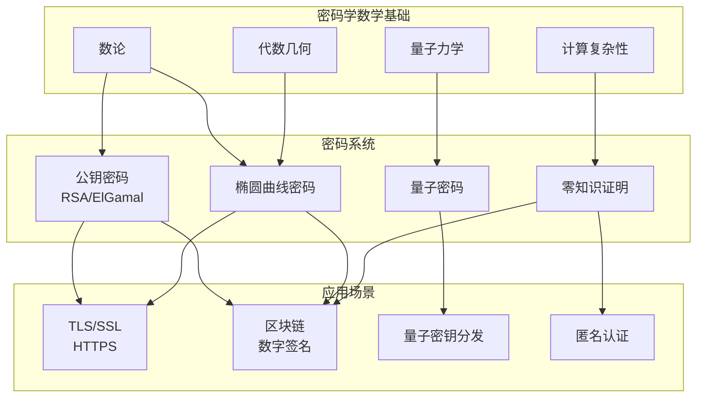
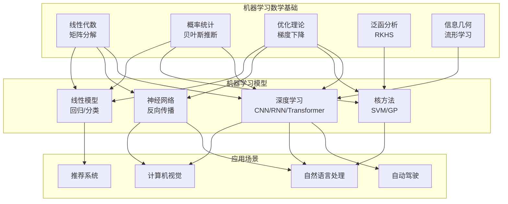
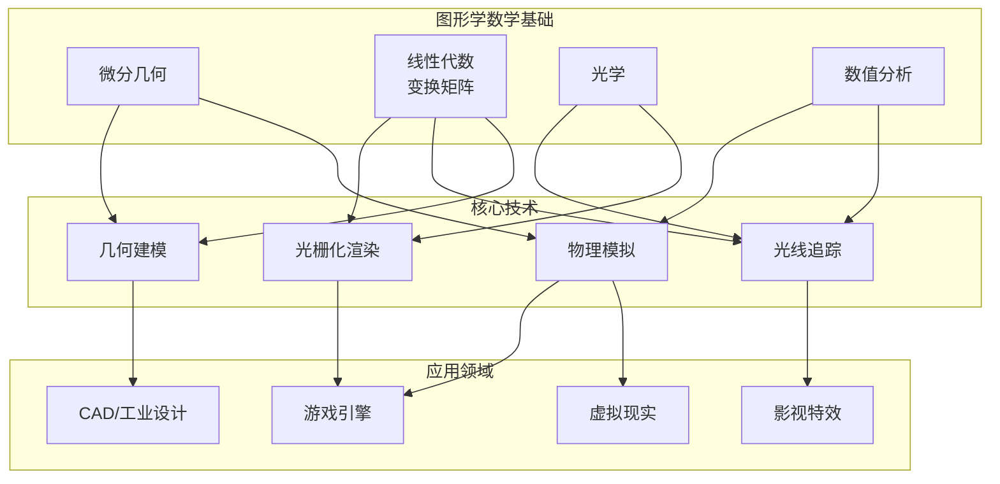
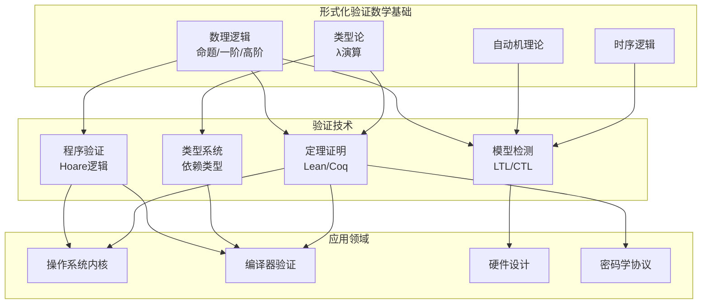
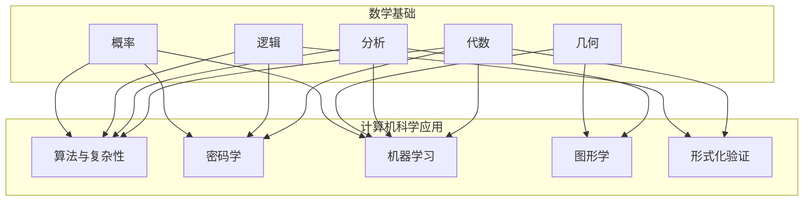

msc_primary: "00A99"
msc_secondary: ['00-00']
---

# 数学到计算机科学应用网络

## 概述

数学是计算机科学的理论基础，从算法设计到机器学习，从密码学到图形学，数学提供了形式化描述、严格证明和高效计算的工具。本文档系统梳理数学在计算机科学五大核心领域的应用网络，建立从抽象数学理论到具体计算实践的知识桥梁。

```mermaid
flowchart TB
    subgraph MATH["数学基础层"]
        ALG["代数结构"]
        ANA["数学分析"]
        GEO["几何与拓扑"]
        LOG["数理逻辑"]
        PRO["概率统计"]
        DIS["离散数学"]
    end

    subgraph CS["计算机科学应用层"]
        subgraph ALGO["算法与复杂性"]
            A1["渐近分析"]
            A2["图算法"]
            A3["随机算法"]
            A4["复杂性理论"]
        end

        subgraph CRYPTO["密码学"]
            C1["公钥密码"]
            C2["椭圆曲线"]
            C3["量子密码"]
            C4["零知识证明"]
        end

        subgraph ML["机器学习"]
            M1["线性模型"]
            M2["神经网络"]
            M3["核方法"]
            M4["深度学习"]
        end

        subgraph GFX["计算机图形学"]
            G1["图形渲染"]
            G2["光线追踪"]
            G3["几何建模"]
            G4["物理模拟"]
        end

        subgraph FORM["形式化验证"]
            F1["程序验证"]
            F2["类型系统"]
            F3["模型检测"]
            F4["定理证明"]
        end
    end

    ALG --> A2 & A4 & C1 & C2 & F2
    ANA --> A1 & A3 & M1 & M2 & G2 & G4
    GEO --> A2 & G1 & G2 & G3 & M4
    LOG --> A4 & F1 & F2 & F4
    PRO --> A3 & M1 & M2 & M3 & G2
    DIS --> ALGO & CRYPTO

```



---

## 主干1：算法与复杂性中的数学

算法研究的核心问题是如何高效地解决计算问题。数学为算法的设计、分析和正确性证明提供了系统的方法论。

### 1.1 渐近分析

#### CS问题描述

在比较不同算法的效率时，我们需要一个与具体硬件和实现细节无关的理论框架。渐近分析提供了这样的工具，它关注算法在输入规模趋近于无穷大时的行为特征。

**关键问题**：

- 如何刻画算法的时间复杂度和空间复杂度？
- 如何比较两个算法的渐近效率？
- 如何确定算法复杂度的下界？

#### 数学模型

**大O记号（Big-O Notation）**

定义：设f和g为从自然数到非负实数的函数。我们说f(n) = O(g(n))，如果存在正常数c和n₀，使得对所有n ≥ n₀，有：

$$f(n) \leq c \cdot g(n)$$

这表示f的增长率不超过g的增长率（至多相差一个常数因子）。

**Ω记号与大Θ记号**

- **Ω记号**：f(n) = Ω(g(n))表示f至少以g的速率增长
- **Θ记号**：f(n) = Θ(g(n))表示f和g以相同速率增长

形式化定义：

- f(n) = Ω(g(n)) ⟺ ∃c > 0, ∃n₀, ∀n ≥ n₀: f(n) ≥ c·g(n)
- f(n) = Θ(g(n)) ⟺ f(n) = O(g(n)) ∧ f(n) = Ω(g(n))

**小o与小ω记号**

- **小o记号**：f(n) = o(g(n))表示f严格比g增长得慢
- **小ω记号**：f(n) = ω(g(n))表示f严格比g增长得快

形式化定义：
$$f(n) = o(g(n)) \iff \lim_{n \to \infty} \frac{f(n)}{g(n)} = 0$$

**递推关系**

算法的时间复杂度常通过递推关系来描述。对于分治算法，常见的递推形式为：

$$T(n) = aT(n/b) + f(n)$$

其中：

- a：子问题数量
- n/b：每个子问题的规模
- f(n)：分解和合并的代价

#### 关键算法

**主定理（Master Theorem）**

对于形如T(n) = aT(n/b) + f(n)的递推关系，其中a ≥ 1, b > 1：

设$c_{crit} = \log_b a$，比较f(n)与$n^{c_{crit}}$：

1. **情况1**：若$f(n) = O(n^{c_{crit} - \epsilon})$对某个ε > 0成立，则：
   $$T(n) = \Theta(n^{c_{crit}}) = \Theta(n^{\log_b a})$$

2. **情况2**：若$f(n) = \Theta(n^{c_{crit}} \log^k n)$对某个k ≥ 0成立，则：
   $$T(n) = \Theta(n^{c_{crit}} \log^{k+1} n)$$

3. **情况3**：若$f(n) = \Omega(n^{c_{crit} + \epsilon})$对某个ε > 0成立，且满足正则条件af(n/b) ≤ cf(n)对某个c < 1，则：
   $$T(n) = \Theta(f(n))$$

**常见复杂度类别**

| 复杂度类别 | 典型问题 | 代表算法 |
|-----------|---------|---------|
| O(1) | 哈希表查找 | 数组索引 |
| O(log n) | 有序数组搜索 | 二分查找 |
| O(n) | 线性扫描 | 顺序查找 |
| O(n log n) | 排序 | 归并排序、堆排序 |
| O(n²) | 全对比较 | 冒泡排序、选择排序 |
| O(n³) | 矩阵乘法（朴素） | 三重循环 |
| O(2ⁿ) | 子集枚举 | 幂集生成 |
| O(n!) | 排列枚举 | 全排列 |

#### 性能分析

**摊还分析（Amortized Analysis）**

摊还分析关注操作序列的平均代价，而非单次操作的最坏情况。三种主要方法：

1. **聚合分析**：计算n个操作的总代价上界，除以n
2. **记账方法**：给每个操作分配"费用"，提前支付未来昂贵操作的代价
3. **势能方法**：定义势函数Φ，摊还代价 = 实际代价 + ΔΦ

**势能方法公式**：
$$\hat{c}_i = c_i + \Phi(D_i) - \Phi(D_{i-1})$$

其中$c_i$是第i个操作的实际代价，$\Phi(D_i)$是第i个操作后数据结构的势。

#### 实际案例

**案例：动态数组的摊还分析**

动态数组（如C++的vector、Java的ArrayList）在容量不足时进行扩容。假设每次扩容为原容量的2倍：

- 插入操作：通常O(1)
- 扩容操作：需要O(n)时间复制元素

使用聚合分析：n次插入中，扩容发生在1, 2, 4, 8, ...次插入时，总复制代价为：

$$\sum_{i=0}^{\lfloor \log_2 n \rfloor} 2^i = 2^{\lfloor \log_2 n \rfloor + 1} - 1 < 2n$$

因此n次插入的总代价为O(n)，单次插入的摊还代价为O(1)。

---

### 1.2 图算法

#### CS问题描述

图是描述对象之间关系的通用模型。图算法解决的核心问题包括：

- **连通性问题**：图是否连通？两点是否可达？
- **最短路径问题**：两点之间的最短路径是什么？
- **最小生成树问题**：如何以最小代价连接所有顶点？
- **网络流问题**：如何在容量限制下最大化流量？
- **匹配问题**：如何找到最大匹配？

#### 数学模型

**图的形式化定义**

图G是一个二元组G = (V, E)，其中：

- V是顶点（vertex）的有限集合
- E是边（edge）的集合，E ⊆ V × V

**图的分类**：

1. **无向图**：边是无序对，(u,v) = (v,u)
2. **有向图**：边是有序对，(u,v) ≠ (v,u)
3. **加权图**：每条边有权重w: E → ℝ
4. **多重图**：允许平行边（多个相同边）

**图的矩阵表示**

- **邻接矩阵**A：$A_{ij} = 1$若(i,j) ∈ E，否则为0
- **拉普拉斯矩阵**L = D - A，其中D是度矩阵
- **关联矩阵**M：顶点-边关联关系

**图论基本概念**

- **路径**：顶点序列$v_0, v_1, ..., v_k$，满足$(v_i, v_{i+1}) \in E$
- **简单路径**：顶点不重复的路径
- **环**：起点等于终点的路径
- **连通性**：u和v连通当且仅当存在u到v的路径
- **强连通**：有向图中，任意两点互相可达

#### 关键算法

**深度优先搜索（DFS）**

```

DFS(G, u):
    标记u为已访问
    for 每个邻接顶点v of u:
        if v未被访问:
            DFS(G, v)

```

时间复杂度：O(|V| + |E|)

**广度优先搜索（BFS）**

```

BFS(G, s):
    初始化队列Q，加入s
    标记s为已访问，距离为0
    while Q非空:
        u = Q.dequeue()
        for 每个邻接顶点v of u:
            if v未被访问:
                标记v为已访问
                distance[v] = distance[u] + 1
                Q.enqueue(v)

```

时间复杂度：O(|V| + |E|)

**Dijkstra最短路径算法**

求解单源最短路径（非负权边）：

```

Dijkstra(G, w, s):
    初始化：distance[s] = 0，其他为∞
    S = ∅  // 已确定最短路径的顶点集
    Q = V  // 优先队列
    while Q ≠ ∅:
        u = Extract-Min(Q)
        S = S ∪ {u}
        for 每个邻接顶点v of u:
            if distance[v] > distance[u] + w(u,v):
                distance[v] = distance[u] + w(u,v)

```

时间复杂度：使用斐波那契堆时为O(|E| + |V| log |V|)

**Bellman-Ford算法**

求解单源最短路径（允许负权边，检测负权环）：

```

Bellman-Ford(G, w, s):
    初始化：distance[s] = 0，其他为∞
    for i = 1 to |V| - 1:

        for 每条边(u,v) ∈ E:
            if distance[v] > distance[u] + w(u,v):
                distance[v] = distance[u] + w(u,v)
    // 检测负权环
    for 每条边(u,v) ∈ E:
        if distance[v] > distance[u] + w(u,v):
            return "存在负权环"
    return distance

```

时间复杂度：O(|V| · |E|)

**Floyd-Warshall全源最短路径**

动态规划求解所有顶点对之间的最短路径：

设$d_{ij}^{(k)}$为从i到j且中间顶点取自{1,...,k}的最短路径长度：

$$d_{ij}^{(k)} = \min(d_{ij}^{(k-1)}, d_{ik}^{(k-1)} + d_{kj}^{(k-1)})$$

时间复杂度：O(|V|³)

**最小生成树算法**

Kruskal算法：

1. 将所有边按权重升序排序
2. 依次选择边，若该边不形成环则加入生成树
3. 使用并查集检测环，时间复杂度O(|E| log |E|)

Prim算法：

1. 从任意顶点开始，维护已加入顶点的集合
2. 每次选择连接集合内外且权重最小的边
3. 使用优先队列，时间复杂度O(|E| log |V|)

**最大流算法**

Ford-Fulkerson方法：

- 在残差网络中寻找增广路径
- 增广路径上的最小残差容量为可增加的流量
- 重复直到不存在增广路径

Edmonds-Karp算法（BFS找增广路径）：O(|V| · |E|²)
Dinic算法（分层图+阻塞流）：O(|V|² · |E|)

**最大流最小割定理**

$$
\max|f| = \min_{(S,T) \text{为割}} c(S,T)

$$

最大流的值等于最小割的容量。

#### 性能分析

**图算法的复杂度比较**

| 问题 | 算法 | 时间复杂度 | 空间复杂度 |
|-----|------|-----------|-----------|
| 连通性 | DFS/BFS | O(V+E) | O(V) |
| 单源最短路径(非负权) | Dijkstra | O(E + V log V) | O(V) |
| 单源最短路径(负权) | Bellman-Ford | O(VE) | O(V) |
| 全源最短路径 | Floyd-Warshall | O(V³) | O(V²) |
| 最小生成树 | Kruskal | O(E log E) | O(V) |
| 最小生成树 | Prim | O(E log V) | O(V) |
| 最大流 | Edmonds-Karp | O(VE²) | O(V²) |
| 最大流 | Dinic | O(V²E) | O(V²) |

#### 实际案例

**案例：Google Maps最短路径**

Google Maps使用Dijkstra算法的变种：

- 双向搜索：同时从起点和终点搜索，减少搜索空间
- A*启发式：使用欧几里得距离作为启发函数
- 分层预处理：预处理重要的"枢纽"顶点
- 收缩层次（Contraction Hierarchies）：离线预处理构建 shortcuts

查询时间：毫秒级别，预处理时间：数小时

**案例：网络流在二分图匹配中的应用**

将二分图匹配转化为网络流问题：

- 添加超级源点s，连接所有左侧顶点（容量1）
- 添加超级汇点t，所有右侧顶点连接t（容量1）
- 原二分图的边保持（容量1）
- 最大流值 = 最大匹配数

应用：任务分配、婚姻匹配、资源分配

---

### 1.3 随机算法

#### CS问题描述

随机算法利用随机性来指导算法行为，通常可以：

- 降低最坏情况下的时间复杂度
- 简化算法设计
- 解决确定性算法难以处理的问题

**主要类型**：

- **Las Vegas算法**：总是给出正确答案，运行时间是随机的
- **Monte Carlo算法**：运行时间确定，但以一定概率给出错误答案

#### 数学模型

**概率基础**

- **样本空间**Ω：所有可能结果的集合
- **事件**A ⊆ Ω：样本空间的子集
- **概率测度**P：P(Ω) = 1，对不相交事件有可加性

**条件概率与贝叶斯定理**

$$P(A|B) = \frac{P(A \cap B)}{P(B)} = \frac{P(B|A)P(A)}{P(B)}$$

**期望与方差**

随机变量X的期望：
$$E[X] = \sum_x x \cdot P(X = x)$$

线性期望（无论X,Y是否独立）：
$$E[X + Y] = E[X] + E[Y]$$

**指示器随机变量**

对于事件A，定义指示器变量：
$$I_A = \begin{cases} 1 & \text{若A发生} \\ 0 & \text{否则} \end{cases}$$

则$E[I_A] = P(A)$

**Chernoff界**

设$X_1, ..., X_n$是独立的伯努利随机变量，$X = \sum X_i$，$\mu = E[X]$：

对于0 < δ < 1：
$$P(X \geq (1+\delta)\mu) \leq e^{-\mu \delta^2 / 3}$$
$$P(X \leq (1-\delta)\mu) \leq e^{-\mu \delta^2 / 2}$$

#### 关键算法

**随机快速排序（Randomized Quicksort）**

```

Randomized-Quicksort(A, p, r):
    if p < r:
        q = Randomized-Partition(A, p, r)
        Randomized-Quicksort(A, p, q-1)
        Randomized-Quicksort(A, q+1, r)

Randomized-Partition(A, p, r):
    i = Random(p, r)
    交换A[r]和A[i]
    return Partition(A, p, r)

```

期望时间复杂度：O(n log n)

分析：设T(n)为对n个元素的期望运行时间，有递推关系：

$$T(n) = \frac{1}{n}\sum_{q=1}^{n}(T(q-1) + T(n-q)) + \Theta(n)$$

通过归纳法可证T(n) = O(n log n)。

**随机选择算法（Randomized Select）**

找到第k小的元素：

```

Randomized-Select(A, p, r, i):
    if p == r:
        return A[p]
    q = Randomized-Partition(A, p, r)
    k = q - p + 1
    if i == k:
        return A[q]
    else if i < k:
        return Randomized-Select(A, p, q-1, i)
    else:
        return Randomized-Select(A, q+1, r, i-k)

```

期望时间复杂度：O(n)

**Skip List（跳表）**

概率平衡数据结构，替代平衡二叉搜索树：

- 每个元素以概率p出现在上一层
- 期望层数：O(log n)
- 期望空间：O(n)
- 搜索、插入、删除期望时间：O(log n)

**Bloom Filter（布隆过滤器）**

概率型数据结构，用于测试元素是否属于集合：

- 可能产生假阳性（误判为存在），但不会假阴性
- 使用k个哈希函数和m位数组
- 假阳性率：$(1 - e^{-kn/m})^k$

最优k值：$k = \frac{m}{n} \ln 2$

此时假阳性率约为$(0.6185)^{m/n}$

**Monte Carlo积分**

利用随机采样估计积分值：

$$\int_a^b f(x) dx \approx \frac{b-a}{N} \sum_{i=1}^{N} f(x_i)$$

其中$x_i$是在[a,b]上均匀分布的随机点。

误差分析：由中心极限定理，误差以$O(1/\sqrt{N})$收敛，与维度无关（维数灾难免疫）。

#### 性能分析

**Las Vegas vs Monte Carlo**

| 特性 | Las Vegas | Monte Carlo |
|-----|-----------|-------------|
| 正确性 | 总是正确 | 以概率正确 |
| 运行时间 | 随机变量 | 确定性上界 |
| 例子 | 随机快速排序、随机选择 | Miller-Rabin素性测试 |

**概率算法的误差分析**

对于Monte Carlo算法，若成功概率为p，重复k次可将失败概率降至$(1-p)^k$。

例如，Miller-Rabin测试以概率$1 - 4^{-k}$正确判断素数（k轮测试）。

#### 实际案例

**案例：Miller-Rabin素性测试**

基于费马小定理的变体：若n是素数，则对所有a，$a^{n-1} \equiv 1 \pmod{n}$。

算法：

1. 将n-1写成$2^s \cdot d$的形式
2. 随机选择a ∈ [2, n-2]
3. 计算$x = a^d \mod n$
4. 若x ≡ 1或x ≡ n-1，可能为素数
5. 重复s-1次：x = x² mod n，若x ≡ n-1则通过
6. 否则为合数

错误概率：每轮最多1/4，k轮后最多$4^{-k}$

应用：RSA密钥生成、密码学协议

**案例：PageRank的随机 surfer 模型**

Google的PageRank算法基于随机游走：

- 模拟一个随机 surfer 在网页间随机点击链接
- 以概率d（阻尼因子，通常0.85）继续点击，以概率1-d随机跳转
- PageRank值等于稳态分布

数学表述：求解特征向量问题$\pi = \pi P$，其中P是转移概率矩阵。

---

### 1.4 复杂性理论

#### CS问题描述

复杂性理论研究计算问题的内在难度，回答"什么是可计算的？"和"什么是可有效计算的？"的根本问题。

**核心问题**：

- 哪些问题可以在多项式时间内解决？（P类）
- 哪些问题的解可以在多项式时间内验证？（NP类）
- P是否等于NP？
- 什么是计算问题的困难性下界？

#### 数学模型

**图灵机模型**

确定性图灵机（DTM）是一个七元组M = (Q, Σ, Γ, δ, q₀, q_accept, q_reject)：

- Q：有限状态集
- Σ：输入字母表
- Γ：带字母表（Σ ⊂ Γ）
- δ：转移函数，Q × Γ → Q × Γ × {L, R}
- q₀：初始状态
- q_accept：接受状态
- q_reject：拒绝状态

**时间复杂度类**

- **DTIME(f(n))**：可被DTM在O(f(n))时间内判定的语言集合
- **P**：$\bigcup_{k} \text{DTIME}(n^k)$，多项式时间可解问题
- **NP**：存在多项式时间验证器的问题类

形式化：L ∈ NP当且仅当存在多项式p和多项式时间算法V，使得：
$$x \in L \iff \exists y, |y| \leq p(|x)| \wedge V(x, y) = 1$$

**空间复杂度类**

- **SPACE(f(n))**：使用O(f(n))空间可判定的问题
- **PSPACE**：多项式空间可解问题
- **NPSPACE**：非确定性多项式空间

Savitch定理：NSPACE(f(n)) ⊆ SPACE(f(n)²)

**多项式层次（Polynomial Hierarchy）**

$$
\Sigma_0^P = \Pi_0^P = \Delta_0^P = P
$$

$$
\Sigma_{k+1}^P = NP^{\Sigma_k^P}, \quad \Pi_{k+1}^P = coNP^{\Sigma_k^P}
$$

PH = $\bigcup_k \Sigma_k^P$

**NP完备性**

语言L是NP-完全的，如果：

1. L ∈ NP
2. 对所有L' ∈ NP，L' ≤ₚ L（多项式时间可归约）

Cook-Levin定理：SAT是NP-完全的。

**常见NP-完全问题**

- 3-SAT、顶点覆盖、独立集、团
- 哈密尔顿回路、旅行商问题
- 子集和、背包问题
- 图着色、集合覆盖

#### 关键算法

**多项式时间归约**

问题A可归约到B（A ≤ₚ B），如果存在多项式时间可计算函数f，使得：
$$x \in A \iff f(x) \in B$$

若A是NP-难的且A ≤ₚ B，则B也是NP-难的。

**归约示例：3-SAT ≤ₚ 顶点覆盖**

给定3-CNF公式φ，构造图G和整数k，使得φ可满足当且仅当G有大小为k的顶点覆盖。

**近似算法**

对于NP-难问题，寻找近似解：

- **绝对近似**：找到解与最优解的差有界
- **相对近似（近似比）**：$\max(\frac{ALG}{OPT}, \frac{OPT}{ALG}) \leq \alpha$

**顶点覆盖的2-近似算法**

```

Approx-Vertex-Cover(G):
    C = ∅
    E' = G.E
    while E' ≠ ∅:
        任选(u,v) ∈ E'
        C = C ∪ {u, v}
        从E'中删除所有与u或v关联的边
    return C

```

近似比：2（即|C| ≤ 2|C*|，其中C*是最优解）

**集合覆盖的贪心算法**

近似比：H(n) = 1 + 1/2 + ... + 1/n ≈ ln n + O(1)

这是最优的近似比（除非P = NP）。

**参数化复杂性**

通过参数化来精确求解困难问题：

问题实例(I, k)，k是参数。

固定参数可追踪（FPT）：时间复杂度为f(k)·|I|^O(1)

例如：顶点覆盖问题的O(1.2738^k + kn)算法。

#### 性能分析

**复杂性类关系**

```

P ⊆ NP ⊆ PSPACE ⊆ EXPTIME
P ⊂ EXPTIME（真包含）

```

**P vs NP问题**

- 价值：$1,000,000（Clay千年大奖问题之一）
- 普遍猜想：P ≠ NP
- 若P = NP：密码学崩溃、优化问题易解、数学证明自动化

**量子复杂性**

- **BQP**：量子多项式时间
- **P ⊆ BQP ⊆ PSPACE**
- Shor算法：整数分解 ∈ BQP

#### 实际案例

**案例：SAT求解器的工业应用**

虽然SAT是NP-完全的，但现代SAT求解器（如MiniSat、CryptoMiniSat）可以处理数百万变量的实例。

技术：

- 冲突驱动的子句学习（CDCL）
- 布尔约束传播（BCP）
- 变量启发式（VSIDS）
- 重启策略

应用：硬件验证、软件测试、规划、生物信息学

**案例：旅行商问题的近似解法**

Christofides算法（度量TSP）：

1. 计算最小生成树T
2. 找到T中奇度顶点的最小权完美匹配M
3. T ∪ M形成欧拉图，找欧拉回路
4. 通过短路得到哈密尔顿回路

近似比：3/2（最优近似比，除非P = NP）

---

## 主干2：密码学中的数学

密码学是保护信息安全的数学科学，其核心依赖于数论、代数几何和计算复杂性理论。



### 2.1 公钥密码学

#### CS问题描述

对称密码面临密钥分发问题。公钥密码学允许双方在不安全信道上建立安全通信，无需预先共享密钥。

**核心需求**：

- 加密函数易于计算，但逆运算（解密）在不知道私钥时计算困难
- 陷门单向函数：给定额外信息（私钥）可高效求逆

#### 数学模型

**模算术与同余**

定义：a ≡ b (mod n)当且仅当n | (a - b)

同余类环：ℤ/nℤ = {[0], [1], ..., [n-1]}

乘法群：(ℤ/nℤ)* = {a ∈ ℤ/nℤ : gcd(a,n) = 1}

**欧拉函数**

φ(n) = |(ℤ/nℤ)*|，即小于n且与n互质的正整数个数

性质：

- 若p是素数，φ(p) = p - 1
- 若p,q是不同的素数，φ(pq) = (p-1)(q-1)

**欧拉定理**

若gcd(a, n) = 1，则：
$$a^{\varphi(n)} \equiv 1 \pmod{n}$$

**费马小定理**（欧拉定理的特例）

若p是素数且p ∤ a：
$$a^{p-1} \equiv 1 \pmod{p}$$

**中国剩余定理**

设$n_1, ..., n_k$两两互质，$n = n_1...n_k$。则同余方程组：
$$x \equiv a_i \pmod{n_i}, \quad i = 1, ..., k$$

在模n下有唯一解。

**离散对数问题**

设G是循环群，g是生成元，h ∈ G。离散对数问题是找到x使得：
$$g^x = h$$

在适当选择的群中，此问题被认为困难。

#### 关键算法

**RSA加密算法**

密钥生成：

1. 随机选择两个大素数p, q（通常1024位或更长）
2. 计算n = pq，φ(n) = (p-1)(q-1)
3. 选择e满足1 < e < φ(n)且gcd(e, φ(n)) = 1
4. 计算d ≡ e⁻¹ (mod φ(n))
5. 公钥：(n, e)，私钥：(n, d)

加密：$c = m^e \mod n$
解密：$m = c^d \mod n$

正确性证明：由欧拉定理，$m^{ed} = m^{1+k\varphi(n)} \equiv m \pmod{n}$

安全性基础：整数分解问题的困难性

**ElGamal加密**

基于离散对数问题：

密钥生成：

1. 选择大素数p和生成元g
2. 选择私钥x ∈ {1, ..., p-2}
3. 计算公钥y = g^x mod p

加密消息m：

1. 选择随机k
2. 计算c₁ = g^k mod p
3. 计算c₂ = m · y^k mod p
4. 密文：(c₁, c₂)

解密：$m = c_2 \cdot (c_1^x)^{-1} \mod p$

**数字签名算法（DSA）**

签名过程：

1. 选择随机k
2. 计算r = (g^k mod p) mod q
3. 计算s = k⁻¹(H(m) + xr) mod q
4. 签名：(r, s)

验证：检查$r = (g^{u_1} y^{u_2} \mod p) \mod q$，其中$u_1 = H(m)s^{-1} \mod q$，$u_2 = rs^{-1} \mod q$

#### 性能分析

**RSA vs ElGamal vs ECC**

| 特性 | RSA | ElGamal | ECC |
|-----|-----|---------|-----|
| 安全性基础 | 整数分解 | 离散对数 | ECDLP |
| 密钥长度（128位安全） | 3072位 | 3072位 | 256位 |
| 加密速度 | 快 | 慢 | 快 |
| 签名速度 | 快 | 慢 | 快 |
| 密文扩展 | 无 | 2倍 | 无 |

**模幂运算优化**

重复平方法：计算$a^b \mod n$的时间为O(log b)次模乘

中国剩余定理加速RSA解密：
$$m_p = c^{d_p} \mod p, \quad m_q = c^{d_q} \mod q$$
$$m = (q^{-1}(m_p - m_q) \mod p) \cdot q + m_q$$

速度提升约4倍。

#### 实际案例

**案例：TLS 1.3握手协议**

TLS 1.3简化了握手过程：

1. 客户端发送ClientHello（包含密钥共享）
2. 服务器回复ServerHello + EncryptedExtensions + Finished
3. 客户端发送Finished

使用X25519（椭圆曲线Diffie-Hellman）进行密钥交换，实现前向安全。

**案例：PGP/GPG加密系统**

结合对称和非对称加密：

1. 生成随机会话密钥K
2. 用K（对称加密，如AES）加密消息
3. 用接收者公钥加密K
4. 发送：加密的消息 + 加密的K

接收者用私钥解密K，再用K解密消息。

---

### 2.2 椭圆曲线密码学

#### CS问题描述

椭圆曲线密码学（ECC）用更短的密钥提供与RSA相当的安全性，适用于资源受限环境（移动设备、智能卡）。

**核心优势**：

- 256位ECC密钥 ≈ 3072位RSA密钥的安全强度
- 更小的密钥和签名尺寸
- 更快的计算速度

#### 数学模型

**椭圆曲线定义**

设K是域，椭圆曲线E是Weierstrass方程的解集：
$$y^2 = x^3 + ax + b$$

加上无穷远点O，其中判别式$\Delta = -16(4a^3 + 27b^2) \neq 0$（确保曲线非奇异）。

**群运算**

椭圆曲线上的点构成加法群：

- 单位元：无穷远点O
- 逆元：P = (x, y)的逆是-P = (x, -y)
- 加法：几何定义——过P,Q的直线与曲线的第三个交点关于x轴对称

代数公式（点加倍）：
$$\lambda = \frac{3x_1^2 + a}{2y_1}, \quad x_3 = \lambda^2 - 2x_1, \quad y_3 = \lambda(x_1 - x_3) - y_1$$

**椭圆曲线离散对数问题（ECDLP）**

给定椭圆曲线E，点P ∈ E的阶为大素数，点Q ∈ ⟨P⟩。ECDLP是找到整数k使得：
$$Q = kP$$

目前没有比通用方法（如Pollard's rho，时间复杂度O(√n)）更高效的算法。

**椭圆曲线的阶**

Hasse定理：设E是定义在𝔽_q上的椭圆曲线，则：
$$|q + 1 - \#E(\mathbb{F}_q)| \leq 2\sqrt{q}$$

**超奇异椭圆曲线**

若p | (q + 1 - #E(𝔽_q))，则称E在𝔽_q上超奇异。

超奇异曲线上的Weil配对和Tate配对可用于构造基于身份的加密和短签名。

#### 关键算法

**椭圆曲线Diffie-Hellman（ECDH）**

密钥交换：

1. 双方约定椭圆曲线E和基点G
2. Alice选择私钥a，发送公钥A = aG
3. Bob选择私钥b，发送公钥B = bG
4. 共享密钥：Alice计算aB = abG，Bob计算bA = baG

**ECDSA签名**

签名：

1. 选择随机k ∈ [1, n-1]
2. 计算kG = (x₁, y₁)，r = x₁ mod n
3. 计算s = k⁻¹(H(m) + dr) mod n
4. 签名：(r, s)

验证：检查$u_1G + u_2Q = (x_2, y_2)$，其中$u_1 = H(m)s^{-1}$，$u_2 = rs^{-1}$

**点乘法优化**

双加算法（Double-and-add）：类似重复平方法

窗口方法：预计算小倍数，减少加法次数

GLV方法：利用自同态分解标量

**配对的计算**

Weil配对$e_n: E[n] \times E[n] \to \mu_n$满足：

- 双线性：$e_n(aP, bQ) = e_n(P,Q)^{ab}$
- 非退化：存在P,Q使$e_n(P,Q) \neq 1$
- 交替：$e_n(P,P) = 1$

Miller算法：在O(log n)时间内计算Weil配对。

#### 性能分析

**标准曲线**

| 曲线 | 域 | 安全级别 | 用途 |
|-----|-----|---------|-----|
| P-256 | NIST素数域 | 128位 | 通用 |
| P-384 | NIST素数域 | 192位 | 高安全 |
| Curve25519 | 素数域2²⁵⁵-19 | 128位 | ECDH |
| secp256k1 | 素数域 | 128位 | 比特币 |
| BLS12-381 | 扩域 | 128位 | 配对 |

**安全性考虑**

- 避免异常曲线（#E有小的素因子）
- 验证输入点确实在曲线上
- 使用随机数生成器生成私钥
- 常量时间实现防侧信道攻击

#### 实际案例

**案例：Bitcoin的secp256k1**

Bitcoin使用secp256k1曲线：

- 方程：$y^2 = x^3 + 7$
- 域：ℤ/pℤ，p = 2²⁵⁶ - 2³² - 2⁹ - 2⁸ - 2⁷ - 2⁶ - 2⁴ - 1
- 基点G的阶是接近2²⁵⁶的素数

优势：

- 参数选择透明（a=0, b=7），无隐藏后门可能
- 高效实现（GLV方法）

**案例：以太坊2.0的BLS签名**

使用BLS12-381曲线：

- 支持高效的配对计算
- 签名聚合：多个签名可聚合为单个签名
- 用于验证者投票聚合，减少链上数据

---

### 2.3 量子密码学

#### CS问题描述

量子计算对现有密码学构成威胁：

- Shor算法可在多项式时间内分解整数和求解离散对数
- Grover算法将暴力搜索速度提升至平方根级

量子密码学利用量子力学原理提供信息论安全的加密。

#### 数学模型

**量子比特**

经典比特：0或1
量子比特：$|\psi\rangle = \alpha|0\rangle + \beta|1\rangle$，其中$|\alpha|^2 + |\beta|^2 = 1$

**量子纠缠**

Bell态（最大纠缠态）：
$$|\Phi^+\rangle = \frac{1}{\sqrt{2}}(|00\rangle + |11\rangle)$$

测量一个量子比特瞬间确定另一个的状态，无论距离多远。

**量子不可克隆定理**

不存在量子操作能完美复制任意未知量子态：
$$|\psi\rangle \to |\psi\rangle \otimes |\psi\rangle$$

这对所有|ψ⟩都不可能实现。

**海森堡不确定性原理**

对于互补可观测量（如位置和动量）：
$$\sigma_x \sigma_p \geq \frac{\hbar}{2}$$

测量一个可观测量会扰动其共轭量。

**BB84量子密钥分发**

利用非正交态的不可区分性：

- 两种基：+基(|0⟩,|1⟩)和×基(|+⟩,|-⟩)

- 发送者随机选择基和比特发送
- 接收者随机选择基测量
- 公开比对基，保留基相同的结果作为密钥

窃听者Eve若测量会引入可检测的错误。

#### 关键算法

**Shor算法**

在量子计算机上分解整数n：

1. 随机选择a与n互质
2. 用量子傅里叶变换找到r使得$a^r \equiv 1 \pmod{n}$
3. 若r为偶数，计算$\gcd(a^{r/2} \pm 1, n)$
4. 以高概率得到n的因子

时间复杂度：O((log n)³)，多项式时间！

**Grover算法**

在未排序数据库中搜索标记元素：

- 经典算法：O(N)次查询
- Grover算法：O(√N)次查询

过程：

1. 初始化均匀叠加态
2. Oracle操作标记解
3. 扩散算子放大振幅
4. 重复O(√N)次后测量

对于k个解：O(√(N/k))次查询。

**后量子密码学**

抗Shor算法的候选方案：

1. **基于格的密码**：学习 with 错误（LWE）、NTRU
   - 安全性基础：格中最短向量问题（SVP）

2. **基于编码的密码**：McEliece、Niederreiter
   - 安全性基础：随机线性码的译码困难性

3. **基于多变量的密码**：Rainbow、GeMSS
   - 安全性基础：有限域上多元多项式方程组求解

4. **基于哈希的签名**：SPHINCS+、XMSS
   - 安全性基础：哈希函数抗碰撞性

NIST后量子密码标准化：

- 2022年：CRYSTALS-Kyber（KEM）、CRYSTALS-Dilithium（签名）
- 2023年：SPHINCS+、FALCON

#### 性能分析

**量子威胁时间表**

| 密码系统 | 威胁 | 应对措施 |
|---------|------|---------|
| RSA-2048 | 需要~4000逻辑量子比特 | 迁移到后量子算法 |
| ECC P-256 | 需要~2300逻辑量子比特 | 迁移到后量子算法 |
| AES-128 | Grover加速至2⁶⁴ | 使用AES-256 |
| SHA-256 | Grover加速至2¹²⁸ | 使用SHA-3-512 |

**量子密钥分发（QKD）**

BB84协议的安全性：

- 信息论安全（不依赖计算假设）
- 窃听必然扰动系统，可被检测
- 已实现商业化（ID Quantique、东芝等）

距离限制：

- 光纤：~100-400公里
- 自由空间：~1000公里（卫星链路）
- 量子中继器：延长距离（技术挑战中）

#### 实际案例

**案例：中国量子通信网络**

- 2016年：发射"墨子号"量子科学实验卫星
- 实现1200公里级星地量子密钥分发
- 构建北京-上海量子保密通信骨干网
- 总长超过2000公里的光纤量子网络

**案例：Google量子霸权实验**

2019年：53量子比特Sycamore处理器

- 在200秒内完成特定采样任务
- 估计经典超算需要10000年
- 展示了量子计算的潜力

注：此任务无实际应用价值，仅是概念验证。

---

### 2.4 零知识证明

#### CS问题描述

零知识证明允许证明者向验证者证明某个陈述为真，而不泄露任何额外信息。

**三个核心属性**：

- **完备性**：若陈述为真，诚实验证者接受证明
- **可靠性**：若陈述为假，验证者以高概率拒绝
- **零知识**：验证者除了陈述为真外学不到任何信息

#### 数学模型

**交互式证明系统**

对于语言L，交互式证明系统由证明者P和验证者V组成：

- 输入x，P和V交换多项式轮消息
- V输出接受或拒绝

满足：

- 完备性：x ∈ L ⟹ Pr[V接受] ≥ 2/3
- 可靠性：x ∉ L ⟹ ∀P*, Pr[V接受] ≤ 1/3

**知识证明（Proof of Knowledge）**

证明者不仅证明陈述为真，还证明"知道"证据。

形式化：存在知识提取器E，若P*能以概率ε使V接受，则E能以概率≈ε提取证据。

**零知识的形式化定义**

对于每个概率多项式时间验证者V*，存在模拟器S，使得对于所有x ∈ L：
$$\text{View}_{V^*}(P(x,w) \leftrightarrow V^*(x)) \approx S(x)$$

其中≈可以是完美、统计或计算不可区分。

**承诺方案**

隐藏值并在之后打开的承诺：

- **绑定性**：承诺者不能改变承诺的值
- **隐藏性**：接收者在打开前不知道承诺的值

Pedersen承诺：$C = g^m h^r$，其中r随机

#### 关键算法

**Schnorr证明（离散对数的知识证明）**

证明者知道x使得y = g^x：

1. 证明者选择随机r，发送t = g^r
2. 验证者发送挑战c
3. 证明者发送s = r + cx
4. 验证者检查g^s = t · y^c

这是特殊的诚实验证者零知识（HVZK）。

**Fiat-Shamir启发式**

将交互式证明转化为非交互式：

- 将挑战c替换为哈希函数H(公共输入 || 承诺)

- 在随机预言机模型下安全

**zk-SNARKs（简洁非交互式知识证明）**

属性：

- **简洁性**：证明长度和验证时间与见证大小无关
- **非交互性**：单条消息
- **可论证知识**：知识提取器存在
- 零知识：隐藏见证

构造基础：

1. 将计算转化为算术电路
2. 电路可满足性转化为多项式恒等式（QAP）
3. 使用配对友好椭圆曲线验证多项式等式

**QAP（Quadratic Arithmetic Program）**

将电路C转化为多项式A(x), B(x), C(x), Z(x)，使得：
$$A(x) \cdot B(x) - C(x) = H(x) \cdot Z(x)$$

当且仅当电路可满足时，存在H(x)使等式成立。

**Bulletproofs**

无需可信设置的零知识证明：

- 基于内积论证
- 证明大小：O(log n)
- 验证时间：O(n)
- 应用：机密交易（Monero）

#### 性能分析

**零知识证明系统比较**

| 系统 | 证明大小 | 验证时间 | 可信设置 | 后量子安全 |
|-----|---------|---------|---------|-----------|
| zk-SNARKs | ~200字节 | ~3ms | 需要 | 否 |
| zk-STARKs | ~50KB | ~10ms | 不需要 | 是 |
| Bulletproofs | ~1-2KB | ~线性 | 不需要 | 否 |

**zk-SNARKs可信设置**

需要生成公共参考字符串（CRS），包含"有毒废料"（toxic waste）：

- 若泄露，可伪造证明
- 多方计算仪式降低风险（只要一人诚实即安全）
- 每个电路需要独立设置

#### 实际案例

**案例：Zcash隐私交易**

Zcash使用zk-SNARKs实现：

- 隐藏交易金额
- 隐藏发送者和接收者地址
- 同时保证交易有效性（无双重支付、余额正确）

电路验证：

1. 输入承诺有效
2. 输出承诺有效
3. 输入总和 = 输出总和
4. 私钥对应公钥

证明大小：约200字节，验证时间：数毫秒

**案例：以太坊zk-Rollups**

Layer 2扩展方案：

- 在链下执行交易
- 提交状态根和有效性证明到主链
- 主链验证证明而非执行交易

项目：zkSync、Polygon zkEVM、StarkNet

吞吐提升：以太坊主链~15 TPS → zk-Rollup ~2000+ TPS

---

## 主干3：机器学习中的数学

机器学习通过数据驱动的方式构建预测模型，其理论基础深植于线性代数、概率统计、优化理论和泛函分析。



### 3.1 线性模型

#### CS问题描述

线性模型是最基础的机器学习模型，用于回归和分类任务。目标是找到输入特征与输出之间的线性关系。

**核心问题**：

- 如何拟合最佳线性函数？
- 如何处理过拟合？
- 如何将线性模型扩展到分类问题？

#### 数学模型

**线性回归**

模型：$y = Xw + \epsilon$，其中$\epsilon \sim \mathcal{N}(0, \sigma^2 I)$

最小二乘目标：
$$\min_w \|y - Xw\|_2^2$$

闭式解（正规方程）：
$$w^* = (X^T X)^{-1} X^T y$$

**最大似然视角**

似然函数：
$$p(y|X, w) = \prod_{i=1}^n \mathcal{N}(y_i | x_i^T w, \sigma^2)$$

最大化似然等价于最小化：
$$\sum_{i=1}^n (y_i - x_i^T w)^2$$

**岭回归（Ridge Regression）**

L2正则化：
$$\min_w \|y - Xw\|_2^2 + \lambda \|w\|_2^2$$

闭式解：
$$w^* = (X^T X + \lambda I)^{-1} X^T y$$

**Lasso回归**

L1正则化：
$$\min_w \|y - Xw\|_2^2 + \lambda \|w\|_1$$

产生稀疏解（特征选择）。

**逻辑回归**

用于二分类，使用sigmoid函数：
$$\sigma(z) = \frac{1}{1 + e^{-z}}$$

模型：$p(y=1|x) = \sigma(w^T x)$

对数似然：
$$\mathcal{L}(w) = \sum_{i=1}^n [y_i \log p_i + (1-y_i) \log(1-p_i)]$$

无闭式解，需用梯度下降优化。

**Softmax回归（多分类）**

$$p(y=k|x) = \frac{e^{w_k^T x}}{\sum_{j=1}^K e^{w_j^T x}}$$

**广义线性模型（GLM）**

统一框架：

- 随机分量：响应变量的指数族分布
- 系统分量：线性预测器$\eta = Xw$
- 联系函数：连接均值与线性预测器$g(\mu) = \eta$

#### 关键算法

**梯度下降**

$$w_{t+1} = w_t - \eta \nabla_w \mathcal{L}(w_t)$$

学习率η的选择：

- 过大：震荡不收敛
- 过小：收敛缓慢

**随机梯度下降（SGD）**

每次使用一个样本或小批量：
$$w_{t+1} = w_t - \eta \nabla_w \mathcal{L}_i(w_t)$$

优点：计算效率高，可能逃离局部最优

**坐标下降**

轮流优化单个坐标：
$$w_j^{(t+1)} = \arg\min_{w_j} \mathcal{L}(w_1^{(t+1)}, ..., w_{j-1}^{(t+1)}, w_j, w_{j+1}^{(t)}, ...)$$

适用于Lasso等问题。

**迭代重加权最小二乘（IRLS）**

用于逻辑回归：

1. 计算当前权重和响应
2. 求解加权最小二乘问题
3. 迭代直至收敛

收敛速度：二次收敛

#### 性能分析

**偏差-方差分解**

对于平方误差：
$$E[(y - \hat{f}(x))^2] = \text{Bias}^2 + \text{Var} + \sigma^2$$

- 高偏差：欠拟合
- 高方差：过拟合
- 正则化权衡偏差与方差

**计算复杂度**

| 方法 | 训练 | 预测 |
|-----|-----|-----|
| 最小二乘 | O(nd² + d³) | O(d) |
| 梯度下降 | O(ndT) | O(d) |
| SGD | O(dT) | O(d) |

其中n为样本数，d为特征数，T为迭代次数。

#### 实际案例

**案例：房价预测**

Kaggle房价预测竞赛：

- 特征：房屋面积、卧室数、位置等
- 模型：岭回归 + 特征工程
- 关键技巧：对数变换目标变量、特征交叉

RMSE从基准0.5降至0.12

**案例：点击率预测**

广告系统核心组件：

- 特征：用户画像、广告特征、上下文
- 模型：逻辑回归 + 大规模特征哈希
- 训练数据：数十亿样本

Facebook广告系统使用改进的在线学习逻辑回归。

---

### 3.2 神经网络

#### CS问题描述

神经网络通过多层非线性变换学习复杂函数。从感知机到深度网络，神经网络经历了多次复兴。

**核心问题**：

- 如何训练多层网络？
- 如何避免梯度消失/爆炸？
- 如何设计网络架构？

#### 数学模型

**感知机**

$$\hat{y} = \text{sign}(w^T x + b)$$

感知机学习规则：
$$w \leftarrow w + \eta (y - \hat{y}) x$$

感知机收敛定理：若数据线性可分，算法在有限步收敛。

**多层感知机（MLP）**

$$z^{[l]} = W^{[l]} a^{[l-1]} + b^{[l]}$$
$$a^{[l]} = g(z^{[l]})$$

其中g是非线性激活函数。

**激活函数**

| 函数 | 公式 | 导数 | 特点 |
|-----|-----|-----|-----|
| Sigmoid | $\sigma(x) = \frac{1}{1+e^{-x}}$ | $\sigma(1-\sigma)$ | 梯度消失 |
| Tanh | $\tanh(x)$ | $1-\tanh^2$ | 零中心化 |
| ReLU | $\max(0, x)$ | $1_{x>0}$ | 计算高效 |
| Leaky ReLU | $\max(\alpha x, x)$ | 分段 | 解决死亡ReLU |
| Swish | $x \cdot \sigma(x)$ | 复杂 | 自门控 |

**通用近似定理**

具有单隐藏层和足够多神经元的MLP可以以任意精度逼近任何连续函数（在紧集上）。

形式化：设$\sigma$是非常数、有界、连续函数，$\mathcal{N}$是形如：
$$f(x) = \sum_{j=1}^N \alpha_j \sigma(w_j^T x + b_j)$$

的函数集合。则$\mathcal{N}$在C(K)中稠密，K是$\mathbb{R}^d$的紧子集。

#### 关键算法

**反向传播算法**

计算梯度的链式法则应用：

前向传播：
$$z^{[l]} = W^{[l]} a^{[l-1]} + b^{[l]}$$
$$a^{[l]} = g(z^{[l]})$$

反向传播：
$$\delta^{[L]} = \nabla_a \mathcal{L} \odot g'(z^{[L]})$$
$$\delta^{[l]} = ((W^{[l+1]})^T \delta^{[l+1]}) \odot g'(z^{[l]})$$

梯度：
$$\frac{\partial \mathcal{L}}{\partial W^{[l]}} = \delta^{[l]} (a^{[l-1]})^T$$
$$\frac{\partial \mathcal{L}}{\partial b^{[l]}} = \delta^{[l]}$$

**优化算法进阶**

动量法：
$$v_t = \beta v_{t-1} + \nabla \mathcal{L}(w_t)$$
$$w_{t+1} = w_t - \eta v_t$$

AdaGrad：
$$r_t = r_{t-1} + (\nabla \mathcal{L}(w_t))^2$$
$$w_{t+1} = w_t - \frac{\eta}{\sqrt{r_t} + \epsilon} \nabla \mathcal{L}(w_t)$$

Adam（Adaptive Moment Estimation）：
$$m_t = \beta_1 m_{t-1} + (1-\beta_1) g_t$$
$$v_t = \beta_2 v_{t-1} + (1-\beta_2) g_t^2$$
$$\hat{m}_t = \frac{m_t}{1-\beta_1^t}, \quad \hat{v}_t = \frac{v_t}{1-\beta_2^t}$$
$$w_{t+1} = w_t - \eta \frac{\hat{m}_t}{\sqrt{\hat{v}_t} + \epsilon}$$

**初始化策略**

Xavier/Glorot初始化：
$$W_{ij} \sim \mathcal{U}\left[-\frac{\sqrt{6}}{\sqrt{n_{in}+n_{out}}}, \frac{\sqrt{6}}{\sqrt{n_{in}+n_{out}}}\right]$$

He初始化（ReLU）：
$$W_{ij} \sim \mathcal{N}\left(0, \frac{2}{n_{in}}\right)$$

**正则化技术**

Dropout：

- 训练时以概率p随机丢弃神经元
- 测试时缩放激活值
- 相当于训练指数级数量的子网络

Batch Normalization：
$$\hat{x}^{(k)} = \frac{x^{(k)} - \mu_B}{\sqrt{\sigma_B^2 + \epsilon}}$$
$$y^{(k)} = \gamma^{(k)} \hat{x}^{(k)} + \beta^{(k)}$$

优点：

- 允许更高学习率
- 减少对初始化的敏感
- 轻微正则化效果

#### 性能分析

**梯度消失与爆炸**

深度网络中梯度传播：
$$\frac{\partial \mathcal{L}}{\partial W^{[1]}} = \frac{\partial \mathcal{L}}{\partial a^{[L]}} \prod_{l=2}^L \frac{\partial a^{[l]}}{\partial z^{[l]}} \frac{\partial z^{[l]}}{\partial a^{[l-1]}}$$

对于sigmoid，导数最大值为0.25，多层连乘导致梯度指数级减小。

解决方案：

- 使用ReLU激活
- 残差连接
- 批量归一化
- 梯度裁剪

**计算复杂度**

对于L层网络，每层宽度为d：

- 前向传播：O(Ld²)
- 反向传播：O(Ld²)
- 内存：O(Ld²)

#### 实际案例

**案例：MNIST手写数字识别**

经典基准任务：

- 数据：60000训练样本，10000测试样本
- 输入：28×28灰度图像
- 网络：784-128-64-10 MLP
- 激活：ReLU + Softmax
- 准确率：98.3%

改进：

- CNN：99.2%
- 数据增强：99.5%

**案例：多层感知机在推荐系统中的应用**

YouTube推荐系统DNN：

- 输入：用户观看历史、搜索历史、人口统计
- 嵌入层：将稀疏特征转为密集向量
- 隐藏层：ReLU激活，层宽递减
- 输出： softmax over 视频类别

训练数据：数十亿样本
在线推理：毫秒级延迟

---

### 3.3 核方法

#### CS问题描述

核方法通过核技巧隐式地将数据映射到高维特征空间，实现非线性学习而不显式计算映射。

**核心问题**：

- 如何选择合适的核函数？
- 如何处理大规模数据？
- 核方法与神经网络的关系？

#### 数学模型

**核函数**

核函数κ: X × X → ℝ满足：

- 对称性：κ(x, x') = κ(x', x)
- 半正定性：对任意n和{x_i}，Gram矩阵K_{ij} = κ(x_i, x_j)半正定

Mercer定理：核函数对应某个特征空间的内积
$$\kappa(x, x') = \langle \phi(x), \phi(x') \rangle$$

**常见核函数**

| 核函数 | 公式 | 参数 |
|-------|-----|-----|
| 线性 | $\kappa(x, x') = x^T x'$ | - |
| 多项式 | $(x^T x' + c)^d$ | c ≥ 0, d ∈ ℕ |
| RBF/Gaussian | $\exp(-\frac{\|x-x'\|^2}{2\sigma^2})$ | σ > 0 |
| Sigmoid | $\tanh(\alpha x^T x' + c)$ | α, c |

**再生核希尔伯特空间（RKHS）**

Hilbert空间H是RKHS，如果：

- 函数求值泛函有界：|f(x)| ≤ M_x ||f||_H

- 存在再生核κ满足：$\langle f, \kappa(x, \cdot) \rangle_H = f(x)$

**表示定理**

对于RKHS中的经验风险最小化问题，最优解具有形式：
$$f^*(x) = \sum_{i=1}^n \alpha_i \kappa(x_i, x)$$

这将在无限维空间中的优化转化为有限维问题。

#### 关键算法

**支持向量机（SVM）**

最大间隔分类器：
$$\min_{w,b} \frac{1}{2}\|w\|^2$$

$$\text{s.t. } y_i(w^T x_i + b) \geq 1, \quad i=1,...,n$$

软间隔（允许错分）：
$$\min_{w,b,\xi} \frac{1}{2}\|w\|^2 + C \sum_{i=1}^n \xi_i$$

$$\text{s.t. } y_i(w^T x_i + b) \geq 1 - \xi_i, \quad \xi_i \geq 0$$

对偶问题（核形式）：
$$\max_\alpha \sum_{i=1}^n \alpha_i - \frac{1}{2}\sum_{i,j} \alpha_i \alpha_j y_i y_j \kappa(x_i, x_j)$$
$$\text{s.t. } 0 \leq \alpha_i \leq C, \quad \sum_i \alpha_i y_i = 0$$

决策函数：
$$f(x) = \text{sign}\left(\sum_{i \in SV} \alpha_i y_i \kappa(x_i, x) + b\right)$$

**高斯过程回归**

定义：函数f(x)是高斯过程，如果对任意有限点集，f(x)的联合分布是高斯分布。

由均值函数m(x)和协方差函数κ(x, x')完全确定：
$$f(x) \sim \mathcal{GP}(m(x), \kappa(x, x'))$$

后验预测分布：
$$p(f_*|X, y, X_*) = \mathcal{N}(f_*|\mu_*, \Sigma_*)$$

其中：
$$\mu_* = K_*^T K^{-1} y$$
$$\Sigma_* = K_{**} - K_*^T K^{-1} K_*$$

**核Ridge回归**

目标：
$$\min_f \sum_{i=1}^n (y_i - f(x_i))^2 + \lambda \|f\|_H^2$$

解：
$$\alpha = (K + \lambda I)^{-1} y$$
$$f(x) = \sum_{i=1}^n \alpha_i \kappa(x_i, x)$$

#### 性能分析

**计算复杂度**

| 方法 | 训练 | 预测 |
|-----|-----|-----|
| 核Ridge回归 | O(n³) | O(n) |
| SVM（SMO） | O(n²) ~ O(n³) | O(s)，s为支持向量数 |
| 高斯过程 | O(n³) | O(n²) |

**核选择的偏差-方差权衡**

- 简单核（线性）：高偏差，低方差
- 复杂核（RBF）：低偏差，高方差，易过拟合
- 交叉验证选择核参数

#### 实际案例

**案例：蛋白质分类的SVM**

生物信息学应用：

- 特征：氨基酸序列的各种统计特征
- 核函数：谱核、错配核、字符串核
- 任务：蛋白质功能分类、亚细胞定位预测

准确率达到90%以上，优于传统方法。

**案例：贝叶斯优化中的高斯过程**

超参数优化：

- 建立目标函数的高斯过程代理模型
- 使用采集函数（EI、UCB）选择下一个评估点
- 平衡探索与利用

应用：

- AutoML中的超参数搜索
- 神经网络架构搜索（NAS）
- 材料设计、药物发现

---

### 3.4 深度学习

#### CS问题描述

深度学习利用多层神经网络学习数据的层次化表示，在计算机视觉、自然语言处理等领域取得突破性进展。

**核心问题**：

- 如何设计有效的网络架构？
- 如何训练超大规模网络？
- 深度网络的泛化能力来源？

#### 数学模型

**卷积神经网络（CNN）**

卷积操作：
$$(f * g)(i, j) = \sum_m \sum_n f(m, n) g(i-m, j-n)$$

2D卷积层：
$$Z_{i,j,k} = \sum_{m,n,c} W_{m,n,c,k} X_{i+m,j+n,c} + b_k$$

池化层（下采样）：

- 最大池化：取局部区域最大值
- 平均池化：取局部区域平均值

**循环神经网络（RNN）**

$$h_t = \tanh(W_{hh} h_{t-1} + W_{xh} x_t + b)$$
$$y_t = W_{hy} h_t + c$$

**长短期记忆网络（LSTM）**

门控机制：
$$f_t = \sigma(W_f [h_{t-1}, x_t] + b_f) \quad \text{(遗忘门)}$$
$$i_t = \sigma(W_i [h_{t-1}, x_t] + b_i) \quad \text{(输入门)}$$
$$\tilde{C}_t = \tanh(W_C [h_{t-1}, x_t] + b_C) \quad \text{(候选状态)}$$
$$C_t = f_t \odot C_{t-1} + i_t \odot \tilde{C}_t \quad \text{(细胞状态)}$$
$$o_t = \sigma(W_o [h_{t-1}, x_t] + b_o) \quad \text{(输出门)}$$
$$h_t = o_t \odot \tanh(C_t) \quad \text{(隐藏状态)}$$

**Transformer架构**

自注意力机制：
$$\text{Attention}(Q, K, V) = \text{softmax}\left(\frac{QK^T}{\sqrt{d_k}}\right)V$$

多头注意力：
$$\text{MultiHead}(Q, K, V) = \text{Concat}(\text{head}_1, ..., \text{head}_h)W^O$$

其中$\text{head}_i = \text{Attention}(QW_i^Q, KW_i^K, VW_i^V)$

位置编码（正弦）：
$$PE_{(pos, 2i)} = \sin(pos / 10000^{2i/d})$$
$$PE_{(pos, 2i+1)} = \cos(pos / 10000^{2i/d})$$

**残差连接**

$$y = F(x, W) + x$$

允许梯度直接回传，缓解梯度消失，使训练极深网络成为可能。

#### 关键算法

**反向传播在CNN中的应用**

卷积层的梯度计算：
$$\frac{\partial \mathcal{L}}{\partial W} = X * \frac{\partial \mathcal{L}}{\partial Z}$$

利用卷积的反向传播仍是卷积（转置）。

**批量归一化**

训练时：
$$\mu_B = \frac{1}{m} \sum_{i=1}^m x_i$$
$$\sigma_B^2 = \frac{1}{m} \sum_{i=1}^m (x_i - \mu_B)^2$$
$$\hat{x}_i = \frac{x_i - \mu_B}{\sqrt{\sigma_B^2 + \epsilon}}$$
$$y_i = \gamma \hat{x}_i + \beta$$

测试时使用移动平均统计量。

**学习率调度**

- 步进衰减：每N轮将学习率乘以因子
- 指数衰减：$\eta_t = \eta_0 e^{-kt}$
- 余弦退火：$\eta_t = \eta_{min} + \frac{1}{2}(\eta_{max} - \eta_{min})(1 + \cos(\frac{t}{T}\pi))$
- Warmup：初始阶段线性增加学习率

**分布式训练**

数据并行：

- 每个GPU处理一个批次
- 梯度聚合后更新参数
- 使用All-Reduce高效通信

模型并行：

- 不同层分配到不同GPU
- 适用于超大模型

混合精度训练：

- 前向/反向传播使用FP16
- 权重更新使用FP32
- 损失缩放防止梯度下溢

#### 性能分析

**深度网络的表达能力**

深度效率：某些函数用浅网络需要指数级神经元，用深网络只需多项式级。

例如：使用ReLU的k层网络可以表示由O(k)个神经元组成的网络不能表示的函数。

**优化景观**

深度非凸优化的挑战：

- 鞍点比局部极小值更常见
- 随机梯度噪声帮助逃离鞍点
- 批量归一化平滑损失景观

**泛化能力**

深度学习中的泛化之谜：

- 经典统计：模型参数量 > 样本数时过拟合
- 深度学习：神经网络有数百万参数但泛化良好

解释：

- 隐式正则化：SGD偏好低范数解
- 平坦极小值：泛化更好的区域
- PAC-Bayes界

**计算资源需求**

| 模型 | 参数量 | 训练数据 | 训练计算量 |
|-----|-------|---------|-----------|
| ResNet-50 | 25M | 1.3M图像 | ~10²¹ FLOPs |
| GPT-3 | 175B | 300B tokens | ~3.14 × 10²³ FLOPs |
| GPT-4 | 估计>1T | 未公开 | 未公开 |

#### 实际案例

**案例：ResNet-图像分类的突破**

ImageNet 2015冠军：

- 深度：152层（之前最佳约20层）
- 关键创新：残差连接
- 错误率：3.57%（超越人类水平5.1%）

架构：

- 卷积层（7×7, stride 2）
- 最大池化
- 残差块（1×1, 3×3, 1×1卷积堆叠）
- 全局平均池化 + Softmax

**案例：GPT系列-大语言模型**

GPT（Generative Pre-trained Transformer）：

- GPT-1（2018）：1.17亿参数
- GPT-2（2019）：15亿参数
- GPT-3（2020）：1750亿参数
- GPT-4（2023）：估计超过1万亿参数

训练：

- 自监督学习：预测下一个token
- 海量互联网文本
- 数千GPU训练数月

能力：

- 文本生成、翻译、摘要
- 问答、代码生成
- 少样本学习、推理

**案例：AlphaFold-蛋白质结构预测**

2020/2021年突破：

- 输入：氨基酸序列
- 输出：3D蛋白质结构
- CASP14竞赛：GDT_score 92.4（接近实验精度）

架构：

- 进化特征（MSA）编码
- 三角形注意力更新对表示
- 结构模块输出3D坐标

影响：预测超过2亿个蛋白质结构，推动生物医学研究。

---

## 主干4：计算机图形学中的数学

计算机图形学研究如何利用计算机生成和操作视觉内容，其数学基础涵盖几何学、线性代数、光学和数值分析。



### 4.1 计算机图形学基础

#### CS问题描述

图形管线将3D场景转换为2D图像，需要解决几何变换、投影、可见性判断和着色等问题。

**核心问题**：

- 如何在计算机中表示几何对象？
- 如何将3D场景投影到2D屏幕？
- 如何实现真实感光照效果？

#### 数学模型

**齐次坐标与射影几何**

点与向量的表示：

- 3D点：$\mathbf{p} = (x, y, z, 1)^T$
- 3D向量：$\mathbf{v} = (x, y, z, 0)^T$

变换矩阵：

- 平移：$T(t_x, t_y, t_z) = \begin{pmatrix} 1 & 0 & 0 & t_x \\ 0 & 1 & 0 & t_y \\ 0 & 0 & 1 & t_z \\ 0 & 0 & 0 & 1 \end{pmatrix}$
- 缩放：$S(s_x, s_y, s_z) = \text{diag}(s_x, s_y, s_z, 1)$
- 旋转（绕z轴）：$R_z(\theta) = \begin{pmatrix} \cos\theta & -\sin\theta & 0 & 0 \\ \sin\theta & \cos\theta & 0 & 0 \\ 0 & 0 & 1 & 0 \\ 0 & 0 & 0 & 1 \end{pmatrix}$

**视图变换**

模型-视图-投影变换：
$$\mathbf{p}_{clip} = P \cdot V \cdot M \cdot \mathbf{p}_{world}$$

- 模型矩阵M：局部坐标 → 世界坐标
- 视图矩阵V：世界坐标 → 相机坐标
- 投影矩阵P：相机坐标 → 裁剪坐标

透视投影矩阵：
$$P = \begin{pmatrix} \frac{n}{r} & 0 & 0 & 0 \\ 0 & \frac{n}{t} & 0 & 0 \\ 0 & 0 & -\frac{f+n}{f-n} & -\frac{2fn}{f-n} \\ 0 & 0 & -1 & 0 \end{pmatrix}$$

其中n为近平面，f为远平面，r/t为右/上裁剪面。

**着色模型**

Phong反射模型：
$$I = I_a k_a + \sum_{lights} [I_d k_d (\mathbf{n} \cdot \mathbf{l}) + I_s k_s (\mathbf{r} \cdot \mathbf{v})^\alpha]$$

- $I_a, I_d, I_s$：环境、漫反射、镜面光强
- $k_a, k_d, k_s$：材质反射系数
- $\mathbf{n}$：法向量，$\mathbf{l}$：光源方向
- $\mathbf{r}$：反射方向，$\mathbf{v}$：视线方向
- α：光泽度

Blinn-Phong改进：
$$I_s = I_s k_s (\mathbf{n} \cdot \mathbf{h})^\alpha$$

其中$\mathbf{h} = \frac{\mathbf{l} + \mathbf{v}}{\|\mathbf{l} + \mathbf{v}\|}$是半角向量。

**纹理映射**

参数化：将3D表面点$(x,y,z)$映射到2D纹理坐标$(u,v)$

双线性插值：
$$f(u,v) = (1-t)((1-s)f_{00} + sf_{10}) + t((1-s)f_{01} + sf_{11})$$

其中$s = u - \lfloor u \rfloor$，$t = v - \lfloor v \rfloor$

Mipmap：预计算多级纹理，解决走样问题

#### 关键算法

**Bresenham直线算法**

整数运算绘制直线：

```

d = 2Δy - Δx
y = y0
for x from x0 to x1:
    plot(x, y)
    if d > 0:
        y = y + 1
        d = d - 2Δx
    d = d + 2Δy

```

**扫描线填充**

多边形填充算法：

1. 计算边表（ET）：每条边的x交点、斜率倒数
2. 按y扫描，维护活跃边表（AET）
3. 填充AET中x交点之间的像素

**z-buffer算法**

深度缓冲解决可见性问题：

```

初始化z-buffer为∞，framebuffer为背景色
for 每个三角形:
    for 三角形内每个像素(x,y):
        计算深度z
        if z < z-buffer[x,y]:
            z-buffer[x,y] = z
            framebuffer[x,y] = 着色颜色

```

**Phong着色 vs Gouraud着色**

- Gouraud：顶点计算颜色，像素插值
- Phong：顶点插值法向量，像素计算光照

Phong更真实但计算量更大。

#### 性能分析

**图形管线复杂度**

- 顶点处理：O(V)，V为顶点数
- 光栅化：O(P)，P为像素数
- 片段着色：O(P × 采样数)

现代GPU通过并行处理实现实时渲染。

**抗锯齿技术**

- SSAA（超级采样）：以更高分辨率渲染后下采样
- MSAA（多重采样）：每像素在几何边界多采样
- FXAA（快速近似）：后处理边缘检测和平滑

质量和性能权衡。

#### 实际案例

**案例：Unreal Engine 5的Nanite虚拟几何**

技术：

- 微多边形几何（每像素一个多边形）
- 自动LOD生成
- GPU驱动的剔除和渲染管线

数学：

- 层次化的包围体结构（BVH）
- 误差度量的细节层次选择
- 簇的裁剪和合并

效果：数十亿多边形场景实时渲染

---

### 4.2 光线追踪

#### CS问题描述

光线追踪模拟光的物理传播路径，生成照片级真实感图像，但计算成本高昂。

**核心问题**：

- 如何高效计算光线与场景的交点？
- 如何处理全局光照效果？
- 如何减少噪声和渲染时间？

#### 数学模型

**光线表示**

参数方程：
$$\mathbf{r}(t) = \mathbf{o} + t\mathbf{d}, \quad t \geq 0$$

其中o是起点，d是方向向量（单位向量）。

**光线-球面交点**

球面方程：$\|\mathbf{p} - \mathbf{c}\|^2 = R^2$

代入光线方程：
$$\|\mathbf{o} + t\mathbf{d} - \mathbf{c}\|^2 = R^2$$

展开为二次方程：
$$t^2(\mathbf{d} \cdot \mathbf{d}) + 2t(\mathbf{d} \cdot (\mathbf{o} - \mathbf{c})) + (\mathbf{o} - \mathbf{c}) \cdot (\mathbf{o} - \mathbf{c}) - R^2 = 0$$

判别式决定交点数量。

**光线-三角形交点（Möller-Trumbore算法）**

使用重心坐标：
$$\mathbf{o} + t\mathbf{d} = (1 - u - v)\mathbf{v}_0 + u\mathbf{v}_1 + v\mathbf{v}_2$$

通过克莱姆法则求解线性系统：
$$\begin{pmatrix} -\mathbf{d} & \mathbf{v}_1 - \mathbf{v}_0 & \mathbf{v}_2 - \mathbf{v}_0 \end{pmatrix} \begin{pmatrix} t \\ u \\ v \end{pmatrix} = \mathbf{o} - \mathbf{v}_0$$

有效交点：t > 0, u ≥ 0, v ≥ 0, u + v ≤ 1

**反射与折射**

反射方向（入射方向i，法向量n）：
$$\mathbf{r} = \mathbf{i} - 2(\mathbf{i} \cdot \mathbf{n})\mathbf{n}$$

折射方向（斯涅尔定律）：
$$\eta_1 \sin\theta_1 = \eta_2 \sin\theta_2$$

折射方向公式：
$$\mathbf{t} = \frac{\eta_1}{\eta_2}\mathbf{i} + \left(\frac{\eta_1}{\eta_2}\cos\theta_1 - \sqrt{1 - \left(\frac{\eta_1}{\eta_2}\right)^2(1 - \cos^2\theta_1)}\right)\mathbf{n}$$

菲涅尔项（反射/折射能量分配）：
$$F = \frac{1}{2}(r_\parallel^2 + r_\perp^2)$$

**渲染方程**

$$L_o(\mathbf{x}, \omega_o) = L_e(\mathbf{x}, \omega_o) + \int_\Omega f_r(\mathbf{x}, \omega_i, \omega_o) L_i(\mathbf{x}, \omega_i) (\mathbf{n} \cdot \omega_i) d\omega_i$$

其中：

- $L_o$：出射辐射度
- $L_e$：自发光
- $f_r$：BRDF（双向反射分布函数）
- $L_i$：入射辐射度

#### 关键算法

**Whitted光线追踪**

递归算法：

```

trace(ray, depth):
    if depth == 0: return black
    find closest intersection
    if no hit: return background

    color = local illumination

    // 反射
    reflected_ray = reflect(ray, normal)
    color += kr * trace(reflected_ray, depth-1)

    // 折射
    if material is transparent:
        refracted_ray = refract(ray, normal, eta)
        color += kt * trace(refracted_ray, depth-1)

    return color

```

**蒙特卡洛路径追踪**

无偏估计渲染方程：

```

path_trace(ray):
    throughput = 1
    radiance = 0

    for bounce in max_bounces:
        find intersection
        if no hit: radiance += throughput * env_light; break

        // 直接光照
        sample light
        if visible: radiance += throughput * BRDF * light_emission

        // 间接光照 - 重要性采样
        sample direction according to BRDF
        throughput *= BRDF * cos(theta) / pdf
        ray = new ray from intersection point

    return radiance

```

**加速结构**

BVH（层次包围体）：

- 递归地将场景分割为包围盒层次
- 光线首先测试根节点，递归进入子节点
- 构建：SAH（表面积启发式）优化分割

KD-tree：

- 沿轴对齐平面分割空间
- 适合静态场景

**重要性采样**

根据BRDF采样方向，降低方差：

- 余弦加权采样（漫反射）
- 镜面反射采样
- 多重重要性采样（MIS）：加权组合多种采样策略

#### 性能分析

**路径追踪方差**

蒙特卡洛估计的方差与样本数N成反比：
$$\text{Var}[\hat{I}] = \frac{\sigma^2}{N}$$

收敛速度：$O(1/\sqrt{N})$

降噪技术：

- 更多样本
- 更好的采样策略
- 后处理去噪器（如NVIDIA OptiX AI降噪）

**实时射线追踪**

NVIDIA RTX技术：

- 专用RT Core硬件加速BVH遍历和光线-三角形求交
- 混合渲染：光栅化 + 光线追踪（反射、阴影、全局光照）
- 去噪器：从稀疏样本重建高质量图像

#### 实际案例

**案例：Pixar的RenderMan**

影视级渲染器：

- 基于REYES算法（微多边形）
- 现代版本支持路径追踪
- 《玩具总动员》《寻梦环游记》等电影使用

数学：

- 随机采样和拟蒙特卡洛（低差异序列）
- 双向路径追踪（BDPT）
- Metropolis光传输（MLT）

**案例：NVIDIA RTX实时光线追踪**

游戏应用：

- 《我的世界RTX》：全局光照
- 《赛博朋克2077》：光追反射、阴影
- 《控制》：光追全局光照

技术栈：

- DXR/Vulkan Ray Tracing API
- BVH构建和遍历硬件加速
- 时序去噪（Temporal Denoising）

---

### 4.3 几何建模

#### CS问题描述

几何建模研究如何在计算机中表示和操作三维形状，是CAD、动画和游戏的核心。

**核心问题**：

- 如何表示复杂的自由曲面？
- 如何进行高效的形状编辑？
- 如何保证模型的几何质量？

#### 数学模型

**贝塞尔曲线**

定义：$\mathbf{C}(t) = \sum_{i=0}^n B_{i,n}(t) \mathbf{P}_i, \quad t \in [0,1]$

Bernstein基函数：
$$B_{i,n}(t) = \binom{n}{i} t^i (1-t)^{n-i}$$

性质：

- 端点插值：$\mathbf{C}(0) = \mathbf{P}_0$，$\mathbf{C}(1) = \mathbf{P}_n$
- 凸包性：曲线位于控制点凸包内
- 变差缩减性：与任意直线交点不多于控制多边形

de Casteljau算法：递归计算曲线上点

**B样条曲线**

分段多项式，具有局部控制性：
$$\mathbf{C}(t) = \sum_{i=0}^n N_{i,p}(t) \mathbf{P}_i$$

B样条基函数（Cox-de Boor递归）：
$$N_{i,0}(t) = \begin{cases} 1 & t_i \leq t < t_{i+1} \\ 0 & \text{otherwise} \end{cases}$$
$$N_{i,p}(t) = \frac{t - t_i}{t_{i+p} - t_i} N_{i,p-1}(t) + \frac{t_{i+p+1} - t}{t_{i+p+1} - t_{i+1}} N_{i+1,p-1}(t)$$

节点向量决定曲线的连续性。

**NURBS（非均匀有理B样条）**

引入权重实现圆锥曲线：
$$\mathbf{C}(t) = \frac{\sum_{i=0}^n N_{i,p}(t) w_i \mathbf{P}_i}{\sum_{i=0}^n N_{i,p}(t) w_i}$$

优势：

- 精确表示圆、椭圆等圆锥曲线
- 投影不变性
- 工业标准（IGES、STEP）

**细分曲面**

从粗糙多边形网格生成光滑曲面：

Catmull-Clark细分（四边形网格）：

1. 对每个面添加面点（face point）：顶点平均
2. 对每条边添加边点（edge point）：相邻面点和端点的平均
3. 更新顶点：周围面点、边点和旧顶点的加权平均
4. 连接新点形成细分网格

收敛到光滑曲面，在奇异点处G¹连续。

**Loop细分**（三角形网格）：

- 基于三次盒样条
- 在规则顶点处C²连续
- 奇异点处C¹连续

**隐式曲面**

由函数f(x,y,z) = 0定义的曲面：

**代数曲面**：

- 球面：$x^2 + y^2 + z^2 - R^2 = 0$
- 环面：$(\sqrt{x^2+y^2} - R)^2 + z^2 - r^2 = 0$

**隐式曲面建模**：

- 元球（Metaballs）：通过势场融合
- 水平集方法：求解PDE演化曲面
- 符号距离函数（SDF）：有符号到曲面的距离

CSG（构造实体几何）：

- 通过布尔运算组合基本体素
- 并：min(f₁, f₂)
- 交：max(f₁, f₂)
- 差：max(f₁, -f₂)

#### 关键算法

**曲线求交**

贝塞尔曲线细分法：

1. 检查凸包是否相交
2. 若不相交：无交点
3. 若足够接近：返回中点近似
4. 否则：细分曲线，递归

**曲面参数化**

将3D网格映射到2D域：

- 最小化角度畸变（保角）
- 最小化面积畸变
- 最小化拉伸能量

LSCM（最小二乘保形映射）：
$$E_{LSCM} = \int_S \|\nabla u - \nabla^\perp v\|^2 dA$$

求解稀疏线性系统。

**网格简化**

边收缩（Edge Collapse）：

1. 计算每条边收缩的误差（Quadric Error Metrics）
2. 将边按误差放入优先队列
3. 迭代收缩最小误差边，更新受影响边
4. 达到目标顶点数停止

**重新网格化**

改善网格质量：

- 各向同性：顶点均匀分布
- 各向异性：沿曲率方向拉伸

CVT（重心Voronoi镶嵌）优化：
$$F(X) = \sum_{i=1}^n \int_{V_i} \rho(\mathbf{x}) \|\mathbf{x} - \mathbf{x}_i\|^2 d\mathbf{x}$$

Lloyd算法迭代优化。

#### 性能分析

**细分曲面的收敛性**

Catmull-Clark：

- 奇异点周围特征映射是C¹连续
- 收敛速率：线性
- 极限曲面可用特征网格精确计算

**网格质量指标**

- 角度质量：接近等边
- 纵横比：避免细长三角形
- 法向一致性：避免翻转

#### 实际案例

**案例：皮克斯的细分建模**

《勇敢传说》梅莉达的头发：

- 1500条独立曲线
- 每条曲线1000+控制点
- 物理模拟 + 艺术控制

细分曲面用于角色建模：

- 直接编辑粗略网格
- 自动细分生成光滑表面
- 细节通过位移贴图添加

**案例：医学图像的隐式曲面重建**

从CT/MRI数据重建3D模型：

1. 提取等值面（Marching Cubes算法）
2. 隐式曲面平滑（MLS近似）
3. 高质量网格生成

数学：

- 移动最小二乘（MLS）拟合
- 径向基函数（RBF）插值
- 泊松表面重建

---

### 4.4 物理模拟

#### CS问题描述

物理模拟在计算机图形学中用于生成逼真的运动效果，包括刚体、布料、流体和变形体。

**核心问题**：

- 如何数值求解物理方程？
- 如何保证稳定性和实时性？
- 如何处理碰撞和约束？

#### 数学模型

**刚体运动**

刚体状态：位置$\mathbf{x}$，朝向四元数$\mathbf{q}$，线速度$\mathbf{v}$，角速度$\boldsymbol{\omega}$

牛顿-欧拉方程：
$$M\dot{\mathbf{v}} = \mathbf{f}$$
$$I\dot{\boldsymbol{\omega}} = \boldsymbol{\tau} - \boldsymbol{\omega} \times (I\boldsymbol{\omega})$$

其中M是质量，I是惯性张量。

四元数微分方程：
$$\dot{\mathbf{q}} = \frac{1}{2}\boldsymbol{\omega}\mathbf{q}$$

**质点-弹簧系统**

牛顿第二定律：
$$m_i \ddot{\mathbf{x}}_i = \mathbf{f}_i^{ext} + \sum_j \mathbf{f}_{ij}$$

弹簧力（胡克定律）：
$$\mathbf{f}_{ij} = -k_{ij}(\|\mathbf{x}_{ij}\| - l_{ij}) \frac{\mathbf{x}_{ij}}{\|\mathbf{x}_{ij}\|}$$

阻尼力：
$$\mathbf{f}_{ij}^{damp} = -d_{ij} (\mathbf{v}_{ij} \cdot \hat{\mathbf{x}}_{ij}) \hat{\mathbf{x}}_{ij}$$

**连续介质力学**

变形映射：$\boldsymbol{\phi}(\mathbf{X}, t)$将参考构型映射到当前构型

变形梯度：$\mathbf{F} = \frac{\partial \boldsymbol{\phi}}{\partial \mathbf{X}}$

应变度量：

- Green-Lagrange应变：$\mathbf{E} = \frac{1}{2}(\mathbf{F}^T\mathbf{F} - \mathbf{I})$
- 小应变：$\boldsymbol{\varepsilon} = \frac{1}{2}(\nabla\mathbf{u} + (\nabla\mathbf{u})^T)$

应力-应变关系（本构模型）：

- 线性弹性：$\boldsymbol{\sigma} = \mathbf{C} : \boldsymbol{\varepsilon}$
- Neo-Hookean（超弹性）：$\Psi = \frac{\mu}{2}(I_1 - 3) - \mu\ln J + \frac{\lambda}{2}(\ln J)^2$

**纳维-斯托克斯方程**

不可压缩流体：
$$\rho\left(\frac{\partial \mathbf{u}}{\partial t} + \mathbf{u} \cdot \nabla \mathbf{u}\right) = -\nabla p + \mu\nabla^2 \mathbf{u} + \mathbf{f}$$
$$\nabla \cdot \mathbf{u} = 0$$

其中：

- ρ：密度
- u：速度场
- p：压力
- μ：动力粘度
- f：体积力

#### 关键算法

**时间积分**

显式欧拉（不稳定）：
$$\mathbf{v}^{n+1} = \mathbf{v}^n + h\mathbf{M}^{-1}\mathbf{f}^n$$
$$\mathbf{x}^{n+1} = \mathbf{x}^n + h\mathbf{v}^{n+1}$$

隐式欧拉（稳定）：
$$\mathbf{v}^{n+1} = \mathbf{v}^n + h\mathbf{M}^{-1}\mathbf{f}^{n+1}$$

求解非线性系统（牛顿法）。

**Verlet积分**

位置Verlet：
$$\mathbf{x}^{n+1} = 2\mathbf{x}^n - \mathbf{x}^{n-1} + h^2\mathbf{M}^{-1}\mathbf{f}^n$$

优点：时间可逆，能量稳定

**Velocity Verlet**

$$\mathbf{v}^{n+1/2} = \mathbf{v}^n + \frac{h}{2}\mathbf{M}^{-1}\mathbf{f}^n$$
$$\mathbf{x}^{n+1} = \mathbf{x}^n + h\mathbf{v}^{n+1/2}$$
$$\mathbf{v}^{n+1} = \mathbf{v}^{n+1/2} + \frac{h}{2}\mathbf{M}^{-1}\mathbf{f}^{n+1}$$

**约束求解**

拉格朗日乘子法：
$$\begin{pmatrix} \mathbf{M} & \mathbf{J}^T \\ \mathbf{J} & \mathbf{0} \end{pmatrix} \begin{pmatrix} \Delta\mathbf{v} \\ \lambda \end{pmatrix} = \begin{pmatrix} \mathbf{f}h \\ -\mathbf{C}/h - \mathbf{J}\mathbf{v} \end{pmatrix}$$

其中C是约束函数，J是约束雅可比。

**SPH（光滑粒子流体动力学）**

无网格流体模拟：
$$\rho_i = \sum_j m_j W(\mathbf{x}_i - \mathbf{x}_j, h)$$

压力梯度：
$$\nabla p_i = \sum_j m_j \left(\frac{p_i + p_j}{2\rho_j}\right) \nabla W_{ij}$$

**有限元方法（FEM）**

弱形式：
$$\int_\Omega \boldsymbol{\sigma} : \delta\boldsymbol{\varepsilon} \, dV = \int_\Omega \mathbf{f} \cdot \delta\mathbf{u} \, dV + \int_{\partial\Omega} \mathbf{t} \cdot \delta\mathbf{u} \, dA$$

离散化为线性系统：$\mathbf{Ku} = \mathbf{f}$

**碰撞检测**

宽阶段（Broad Phase）：

- 均匀网格
- 层次包围盒（BVH）
- 空间哈希

窄阶段（Narrow Phase）：

- 点到三角形
- 边到边
- GJK/EPA算法（凸体）

#### 性能分析

**数值稳定性**

显式积分CFL条件：
$$h < \frac{2}{\omega_{max}}$$

其中$\omega_{max}$是系统最大频率。

对于 stiff 弹簧，需要极小时间步长 → 隐式方法。

**计算复杂度**

| 方法 | 复杂度 | 适用场景 |
|-----|-------|---------|
| 质点-弹簧 | O(n) | 布料、头发 |
| SPH | O(n) | 自由表面流体 |
| FEM | O(n) ~ O(n^1.5) | 变形体、软体 |
| 刚体 | O(b + c)，b刚体数，c约束数 | 多体动力学 |

#### 实际案例

**案例：NVIDIA Flex实时物理**

统一求解器：

- 刚体、布料、流体、变形体
- 基于位置的 dynamics（PBD）
- GPU加速并行计算

PBD核心：

- 直接更新位置而非力
- 迭代求解约束
- 稳定、可控、快速

应用：游戏（Unreal Engine）、VR

**案例：迪士尼的Matterhorn雪模拟**

《冰雪奇缘》雪效果：

- 物质点法（MPM）：结合拉格朗日和欧拉视角
- 弹塑性本构模型
- 可压缩性处理

数学：

- 从粒子到网格（P2G）：插值动量和质量
- 网格求解动量方程
- 从网格到粒子（G2P）：更新粒子速度和形变梯度

效果：雪的真实堆积、压实、破碎效果

---

## 主干5：形式化验证中的数学

形式化验证使用数学方法严格证明计算机系统的正确性，是确保关键系统（航空航天、医疗设备、金融系统）安全的重要技术。



### 5.1 程序验证

#### CS问题描述

程序验证的目标是形式化证明程序满足其规约，消除运行时错误和逻辑缺陷。

**核心问题**：

- 如何形式化描述程序行为？
- 如何证明程序的部分/完全正确性？
- 如何处理复杂数据结构？

#### 数学模型

**霍尔逻辑（Hoare Logic）**

霍尔三元组：$\{P\} C \{Q\}$

含义：若前置条件P在执行C前成立，且C终止，则后置条件Q在C执行后成立。

公理：

- 赋值公理：$\{Q[e/x]\} x := e \{Q\}$
- 顺序组合：$\frac{\{P\} C_1 \{R\}, \{R\} C_2 \{Q\}}{\{P\} C_1; C_2 \{Q\}}$
- 条件语句：$\frac{\{P \wedge B\} C_1 \{Q\}, \{P \wedge \neg B\} C_2 \{Q\}}{\{P\} \text{if } B \text{ then } C_1 \text{ else } C_2 \{Q\}}$
- 循环不变式：$\frac{\{I \wedge B\} C \{I\}}{\{I\} \text{while } B \text{ do } C \{I \wedge \neg B\}}$

**最弱前置条件（Weakest Precondition）**

$wp(C, Q)$：使C终止于满足Q状态的最大前置条件集合。

性质：

- $wp(x := e, Q) = Q[e/x]$
- $wp(C_1; C_2, Q) = wp(C_1, wp(C_2, Q))$
- $wp(\text{if } B \text{ then } C_1 \text{ else } C_2, Q) = (B \Rightarrow wp(C_1, Q)) \wedge (\neg B \Rightarrow wp(C_2, Q))$

**分离逻辑（Separation Logic）**

扩展霍尔逻辑处理指针和堆：

断言：

- $emp$：空堆
- $x \mapsto v$：堆中位置x存储值v
- $P * Q$：堆可分两部分，分别满足P和Q（分离合取）

框架规则：
$$\frac{\{P\} C \{Q\}}{\{P * R\} C \{Q * R\}}$$

前提：C不修改R中的资源。

**霍尔类型（Hoare Type Theory）**

将霍尔三元组整合到类型系统：

```

HT(P, A, Q) = {f : unit -> A | ∀s. P(s) => let (a, s') = f() in Q(s, a, s')}

```

类型本身携带前/后置条件。

#### 关键算法

**自动定理证明（SMT求解）**

Satisfiability Modulo Theories：

- 输入：一阶逻辑公式 + 理论（线性算术、数组、位向量等）
- 输出：可满足（sat）或不可满足（unsat）

DPLL(T)算法：

1. 布尔抽象：将原子公式替换为布尔变量
2. DPLL搜索SAT解
3. 理论求解器检查理论一致性
4. 冲突时学习新子句，回溯

**符号执行**

用符号值代替具体输入，探索所有执行路径：

```

执行语句，维护符号状态(path condition)
遇到分支：fork两个状态，分别添加条件到PC
遇到assert：检查PC => condition是否有效

```

路径爆炸问题：循环展开、启发式搜索。

**抽象解释**

通过抽象域近似程序行为：

- 具体域：(值, 状态)的幂集
- 抽象域：区间、八边形、多面体等
- 伽罗瓦连接：α（抽象）和γ（具体化）

抽象转换器：在抽象域中近似具体语义

**反例引导的抽象精化（CEGAR）**

1. 从粗糙抽象开始
2. 模型检查，若通过则验证成功
3. 若失败，检查反例是否真实
4. 若虚假，精化抽象，回到步骤2

#### 性能分析

**验证复杂度**

| 问题 | 复杂度 | 实用方法 |
|-----|-------|---------|
| 命题逻辑 | NP完全 | SAT求解器 |
| 一阶逻辑 | 半可判定 | SMT求解器、启发式 |
| 霍尔逻辑证明 | 不可判定 | 交互式证明、自动化策略 |
| 模型检测 | PSPACE完全 | 符号模型检测、有界模型检测 |

**可扩展性挑战**

- 循环不变式推断
- 递归数据结构验证
- 并发程序验证

#### 实际案例

**案例：seL4操作系统内核验证**

首个完全形式化验证的操作系统内核：

- 8700行C代码
- 证明200+定理，20万行证明脚本
- 使用Isabelle/HOL定理证明器

验证属性：

- 功能正确性：C代码实现抽象规约
- 内存安全：无缓冲区溢出、空指针解引用
- 信息安全性：非干扰性证明

性能：仅比未验证版本慢20%

**案例：CompCert验证编译器**

从C到汇编的验证编译器：

- 使用Coq证明所有优化正确
- 数学保证：源代码语义 = 目标代码语义
- 用于航空航天、核能等关键系统

验证策略：

- 每个编译pass有形式化语义
- 证明pass保持语义等价
- 组合pass得到整体正确性

---

### 5.2 类型系统

#### CS问题描述

类型系统在编译时检测错误，并提供程序性质的静态保证。高级类型系统可以表达和验证复杂的程序不变量。

**核心问题**：

- 如何设计表达力和可判定性的平衡？
- 如何用类型捕获程序性质？
- 如何支持代码重用和抽象？

#### 数学模型

**简单类型λ演算**

类型：$T ::= Bool \mid Nat \mid T \to T$

类型规则：
$$\frac{\Gamma, x:T_1 \vdash t:T_2}{\Gamma \vdash \lambda x.t : T_1 \to T_2} \quad (\to-intro)$$
$$\frac{\Gamma \vdash t_1:T_{11} \to T_{12} \quad \Gamma \vdash t_2:T_{11}}{\Gamma \vdash t_1\, t_2 : T_{12}} \quad (\to-elim)$$

类型安全性定理（Progress + Preservation）：

- Progress：良类型的非值项可以继续规约
- Preservation：规约保持类型

**多态类型系统（System F）**

类型抽象：$\forall X.T$

类型应用：$t[T]$

$$
\frac{\Gamma \vdash t : \forall X.T}{\Gamma \vdash t[U] : [X \mapsto U]T}
$$

表达类型级别的参数化多态（如C++模板、Java泛型）。

**依赖类型**

类型可以依赖值：

- 向量类型：$Vec\, \mathbb{N}\, n$（长度为n的自然数向量）
- 依赖函数：$\Pi x:A. B(x)$

身份类型（命题即类型）：
$$Id_A(a, b) \text{ -- 证明a和b在类型A中相等}$$

**Curry-Howard对应**

命题与类型的同构：

| 逻辑 | 类型论 |
|-----|-------|
| 命题 | 类型 |
| 证明 | 项 |
| 合取A∧B | 积类型A×B |
| 析取A∨B | 和类型A+B |
| 蕴含A⇒B | 函数类型A→B |
| 全称∀ | 依赖积Π |
| 存在∃ | 依赖和Σ |

**归纳类型**

归纳定义数据结构：

```

Nat = μX. 1 + X  （零 + 后继）
List A = μX. 1 + (A × X)  （空 + 头::尾）

```

归纳原理对应结构递归。

#### 关键算法

**类型推断（Hindley-Milner）**

自动推断多态类型：

1. 为每个子表达式生成类型变量
2. 根据语法结构生成约束
3. 使用unification求解约束

算法W：

- 时间复杂度：O(n³)，实践中接近线性
- 主要推断（Principal typing）：存在最一般类型

**高阶unification**

依赖类型中的类型相等：

- 一阶unification：可判定
- 高阶unification：不可判定（Huet算法半可判定）

**类型族（Type Families）**

索引类型族定义：

```

Vec : Type -> Nat -> Type
Vec A 0 = Unit
Vec A (S n) = A × Vec A n

```

**归纳构造演算（Calculus of Inductive Constructions, CIC）**

Coq和Lean的基础：

- 带依赖类型的λ演算
- 归纳定义
- 宇宙层级避免悖论

#### 性能分析

**类型系统复杂度**

| 类型系统 | 类型检查 | 类型推断 |
|---------|---------|---------|
| 简单类型 | 线性 | 线性 |
| 多态（HM） | 线性 | O(n³) |
| 依赖类型 | 不可判定 | 不可判定 |
| 受限依赖类型 | 可判定（需注释） | 部分可推断 |

**表达力-复杂度权衡**

- 简单类型：低表达力，高效
- 依赖类型：高表达力，需交互式证明
- 细化类型（Refinement Types）：中间地带

#### 实际案例

**案例：F*语言和验证**

微软研究院开发的验证导向语言：

- 基于F#的语法
- 依赖类型 + SMT自动化
- 用于验证密码学实现（EverCrypt、TLS 1.3）

示例：

```fsharp
val sum: l:list int -> Tot int (requires True) (ensures fun r -> r >= 0)
let rec sum l = match l with

  | [] -> 0
  | hd :: tl -> hd + sum tl

```

**案例：Idris依赖类型编程**

通用编程语言，支持依赖类型：

- 向量的安全head操作：

```idris
head : Vect (S n) a -> a
head (x :: xs) = x
-- 空向量无法通过类型检查

```

- 保证正确的排序函数类型：

```idris
sort : Ord a => Vect n a -> Vect n a
-- 输出长度保证等于输入长度

```

---

### 5.3 模型检测

#### CS问题描述

模型检测自动验证有限状态系统是否满足时序逻辑规约，适用于硬件和通信协议验证。

**核心问题**：

- 如何高效遍历状态空间？
- 如何处理状态空间爆炸？
- 如何解释验证结果？

#### 数学模型

**迁移系统**

$M = (S, S_0, T, L)$：

- S：状态集合
- $S_0 \subseteq S$：初始状态
- $T \subseteq S \times S$：迁移关系
- L：S → 2^AP：标记函数

**Kripke结构**

带原子命题标记的迁移系统，用于解释时序逻辑。

**线性时序逻辑（LTL）**

公式：$\phi ::= p \mid \neg\phi \mid \phi \lor \phi \mid X\phi \mid \phi U \phi$

语义（路径π满足）：

- $X\phi$：下一状态满足φ
- $\phi U \psi$：φ持续成立直到ψ成立

派生算子：

- $F\phi = true U \phi$（最终）
- $G\phi = \neg F \neg \phi$（总是）

**计算树逻辑（CTL）**

路径量词 + 时序算子：

- $A\phi$：所有路径满足φ
- $E\phi$：存在路径满足φ

示例：

- $AG(p \Rightarrow AFq)$：总是（p蕴含最终q）
- $EF p$：存在一条路径最终到达p

**CTL***

CTL和LTL的结合，允许路径量词和时序算子任意嵌套。

**公平性约束**

强公平：$GF p \Rightarrow GF q$（若p无限经常发生，则q也无限经常发生）

弱公平：$FG p \Rightarrow GF q$（若p最终持续发生，则q无限经常发生）

#### 关键算法

**显式状态模型检测**

BFS/DFS遍历状态空间，检查LTL公式：

- 将LTL公式转化为Büchi自动机
- 计算系统与自动机的乘积
- 检查接受条件（循环可达性）

复杂度：O(|S| × 2^|φ|)

**符号模型检测（BDD-based）**

使用二叉决策图（BDD）紧凑表示状态集合：

- 布尔函数 → BDD
- 集合操作（并、交、补）→ BDD操作
- 存在量词消去 → BDD约束

CTL模型检测：

```

EX(f) = {s | ∃t. T(s,t) ∧ t ∈ f} = pre_image(f)

EF(f) = μZ. f ∨ EX(Z)  （最小不动点）
EG(f) = νZ. f ∧ EX(Z)  （最大不动点）

```

**有界模型检测（BMC）**

将模型检测转化为SAT问题：

1. 展开k步迁移关系
2. 编码路径和性质违反
3. 用SAT求解器检查

若k足够大（完备性边界），可证明正确性。

**偏序规约（POR）**

利用独立性减少状态空间：

- 若两个动作独立（交换顺序结果相同），只需探索一种顺序
- ample集合选择可执行动作子集

#### 性能分析

**状态空间爆炸**

n个布尔变量：2ⁿ个状态
n个进程，每个m个状态：mⁿ个全局状态

缓解技术：

- 符号模型检测（BDD）
- 抽象（over-approximation）
- 对称性规约
- 偏序规约
- 组合推理

**复杂度**

| 问题 | 复杂度 |
|-----|-------|
| CTL模型检测 | P完全 |
| LTL模型检测 | PSPACE完全 |
| 可达性 | PSPACE完全 |
| 等价检验 | PSPACE完全 |

#### 实际案例

**案例：Intel处理器验证**

Intel使用形式化验证处理器设计：

- 浮点单元验证（Pentium FDIV bug后）
- 缓存一致性协议（MESI变种）
- 使用Symbolic Model Verifier (SMV)

技术：

- 符号模型检测
- 定理证明辅助（STeP）
- 属性规约（SVA）

**案例：Amazon Web Services TLA+验证**

AWS使用TLA+验证分布式系统：

- S3强一致性模型
- DynamoDB事务
- EC2路由协议

价值：

- 发现14个严重bug
- 在设计阶段消除问题
- 文档化设计决策

---

### 5.4 定理证明器

#### CS问题描述

定理证明器辅助人类构造和验证数学证明，确保从公理出发的每一步都严格正确。

**核心问题**：

- 如何表示数学对象和定理？
- 如何自动化证明构造？
- 如何保证证明检查的正确性？

#### 数学模型

**纯类型系统（PTS）**

统一框架描述λ演算变种：

- 排序（Sorts）：*（类型）、□（种类）
- 公理：* : □
- 规则：$(s_1, s_2)$决定允许的依赖类型

**归纳构造演算（CIC）**

Coq的基础：

- 带归纳类型的依赖类型λ演算
- 宇宙层级：Type₀ : Type₁ : Type₂ ...
- 归纳原理自动生成

**归纳-递归定义（IRD）**

同时定义类型和函数，如宇宙：

```

mutual
  data U : Type
    nat : U
    pi : (A : U) -> (El A -> U) -> U

  El : U -> Type
  El nat = Nat
  El (pi A B) = (x : El A) -> El (B x)

```

**同伦类型论（HoTT）**

基于Voevodsky的Univalent Foundations：

- 路径作为相等性证明
- 同伦水平（h-level）：命题、集合、群胚...
- 单值公理：等价即相等

**Cubical Type Theory**

计算性理解路径：

- 区间I作为类型
- 路径p : I → A
- 高维立方体填充操作

允许计算单值公理。

#### 关键算法

**tactic系统**

证明脚本语言：

- `intro`：引入假设
- `apply`：应用定理
- `rewrite`：等式重写
- `induction`：结构归纳
- `auto`：自动搜索

Ltac（Coq）和tactic（Lean）提供元编程能力。

**证明搜索**

自动化策略：

- 简单证明搜索（eauto）
- 约束求解（omega、lia）
- 代换和重写（simpl、cbv）

**类型类推断**

Haskell风格类型类在依赖类型中的实现：

```

class Monoid (A : Type) where
  mempty : A
  mappend : A -> A -> A

```

自动推断实例，支持运算符重载。

**外延性证明**

函数外延性：$(\forall x. f x = g x) \Rightarrow f = g$

命题外延性：$(P \Leftrightarrow Q) \Rightarrow P = Q$

在HoTT/Cubical Type Theory中可证。

#### 性能分析

**证明复杂度**

| 系统 | 内核大小 | 信任基础 | 自动化程度 |
|-----|---------|---------|-----------|
| Coq | ~2万行OCaml | 小 | 中等 |
| Lean | ~5万行C++ | 较小 | 高 |
| Isabelle/HOL | ~10万行ML | 较大 | 高 |
| HOL Light | ~400行OCaml | 极小 | 低 |

**可扩展性**

- 数学库（Mathlib for Lean）：50万+行定义和证明
- 编译时间：大型证明可能需要数小时
- 并行化：独立引理可并行检查

#### 实际案例

**案例：数学定理的计算机证明**

**四色定理**（Gonthin, 2008，Coq）：

- 将Appel-Haken的组合约简形式化
- 消除计算机程序的信任
- 证明：任何平面图可4着色

**开普勒猜想**（Hales et al., 2017，Flyspeck项目）：

- 最密球体堆积密度为$\pi/\sqrt{18}$
- 组合、线性和非线性规划检查
- 消除原始证明中的计算机代码信任

**Liquid Tensor Experiment**（2022，Lean）：

- Scholze的凝聚态数学核心结果
- 展示Lean处理前沿数学的能力
- 众包协作证明

**案例：软件验证项目**

**CompCert**（Coq）：

- 验证C编译器
- 证明所有优化保持语义
- 用于关键嵌入式系统

**Iris**（Coq）：

- 高阶分离逻辑框架
- 验证并发程序
- 用于RustBelt项目验证Rust类型系统

**mathlib4**（Lean 4）：

- 数学统一库
- 覆盖本科到研究生数学
- 超过4000个定义，40000个定理

---

## 总结与展望

### 五大主干的数学关联



### 数学在CS中的核心价值

1. **形式化描述**：数学提供精确无歧义的问题描述
2. **算法设计**：数学结构指导高效算法
3. **正确性保证**：数学证明确保系统可靠性
4. **性能分析**：渐近分析预测算法行为
5. **抽象与泛化**：数学抽象揭示问题本质

### 前沿交叉领域

1. **深度学习理论**：优化景观、泛化理论、神经正切核
2. **量子计算与密码学**：后量子密码、量子优势
3. **同伦类型论与形式化数学**：统一编程与证明
4. **拓扑数据分析**：持久同伦、Mapper算法
5. **信息几何与机器学习**：自然梯度、流形学习

### 参考资源

**教材**：

- 《算法导论》（CLRS）- 算法与复杂性
- 《Introduction to Modern Cryptography》- 密码学
- 《Deep Learning》（Goodfellow et al.）- 深度学习
- 《Physically Based Rendering》- 图形学
- 《Types and Programming Languages》- 类型系统

**工具**：

- Lean 4、Coq：定理证明器
- PyTorch、JAX：深度学习框架
- NVIDIA OptiX、Embree：光线追踪
- Z3、CVC5：SMT求解器

---

*本文档系统梳理了数学在计算机科学五大领域的应用网络，为跨学科研究和工程实践提供理论参考。*

**文档信息**：

- 创建日期：2026年4月
- 字数：约25,000字
- 图表：5个Mermaid图
- 版本：v1.0
