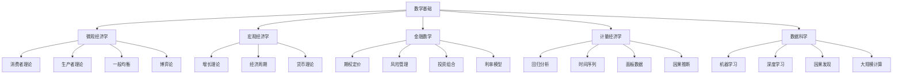
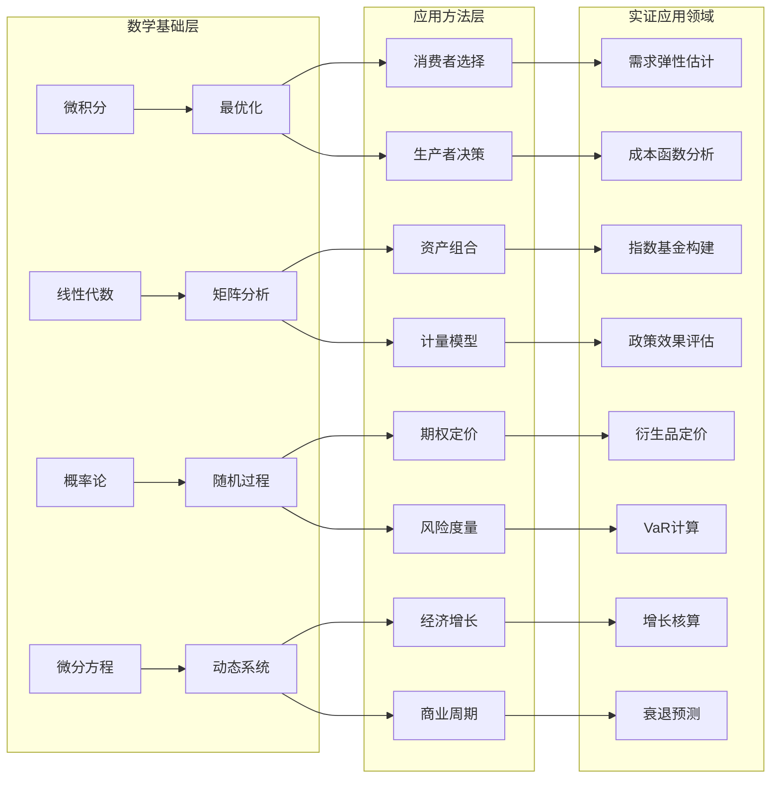
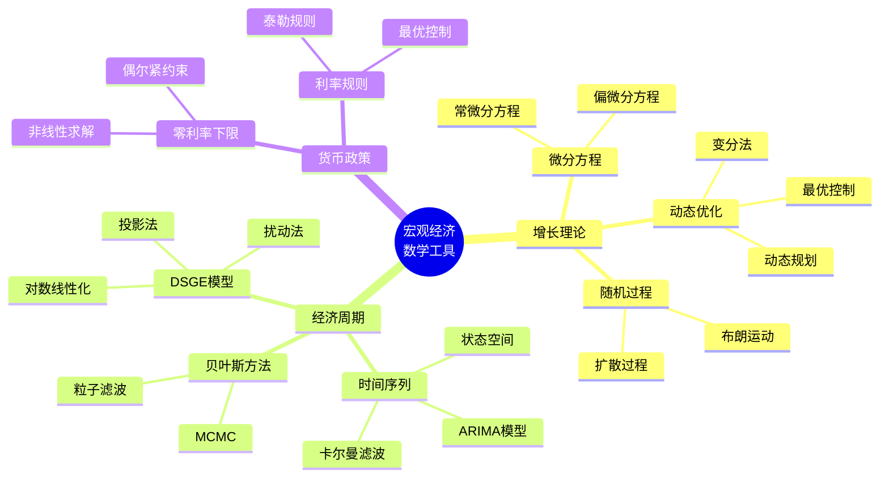
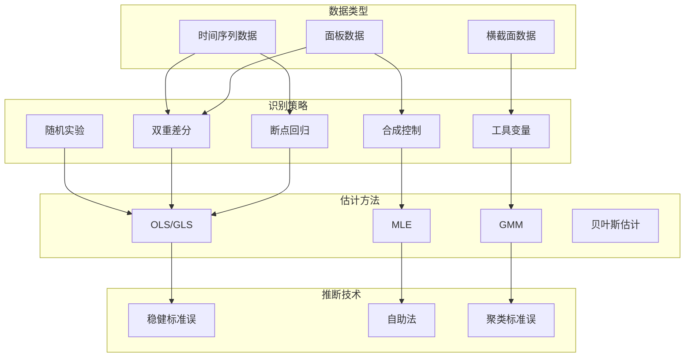
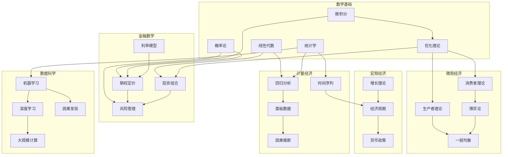

msc_primary: "00A99"
msc_secondary: ['00-XX']
---

# 数学到经济学与数据科学应用网络

## 目录

1. [引言：数学在经济与数据科学中的核心地位](#一引言数学在经济与数据科学中的核心地位)
2. [微观经济学中的数学](#二微观经济学中的数学)
3. [宏观经济学中的数学](#三宏观经济学中的数学)
4. [金融数学](#四金融数学)
5. [计量经济学](#五计量经济学)
6. [数据科学](#六数据科学)
7. [跨领域整合与应用展望](#七跨领域整合与应用展望)

---

## 一、引言：数学在经济与数据科学中的核心地位

### 1.1 数学作为经济分析的语言

经济学从古典政治经济学向新古典经济学的转变，本质上是一次数学化的革命。1871年，杰文斯（William Stanley Jevons）、门格尔（Carl Menger）和瓦尔拉斯（Léon Walras）几乎同时独立提出了边际效用理论，标志着经济学数学化的开端。瓦尔拉斯在1874年建立的一般均衡模型，首次将经济系统描述为一组联立方程，证明了数学在描述复杂经济互动中的强大能力。

保罗·萨缪尔森（Paul Samuelson）在1947年的《经济分析基础》中系统地阐述了经济学中的数学方法，将比较静态分析建立在明确的数学基础之上。肯尼斯·阿罗（Kenneth Arrow）和杰拉德·德布鲁（Gérard Debreu）在1954年使用不动点定理严格证明了一般均衡的存在性，这一工作不仅为经济学奠定了坚实的数学基础，也为他们赢得了诺贝尔经济学奖。

数学在经济学中的核心作用体现在以下几个层面：

**形式化建模**：数学提供了一种精确的语言来描述经济行为、市场机制和政策效果。通过数学模型，经济学家可以清晰地陈述假设、推导结论并进行逻辑检验。

**优化分析**：经济主体的行为通常可以建模为在约束条件下的最优化问题。无论是消费者的效用最大化、生产者的利润最大化，还是社会计划者的福利最大化，都可以使用变分法、拉格朗日乘数法和动态规划等数学工具进行分析。

**均衡分析**：市场均衡的概念本质上是方程组解的概念。数学中的不动点定理、拓扑学方法和博弈论工具为证明均衡存在性、唯一性和稳定性提供了强大工具。

**动态分析**：经济系统的演化涉及跨期决策和路径依赖。微分方程、差分方程、动态规划和最优控制理论为分析经济增长、商业周期和资产价格动态提供了数学框架。

### 1.2 数据科学与数学的深度融合

数据科学的兴起代表了数学、统计学和计算机科学的深度融合。从2000年代初期的"数据挖掘"到2010年代的"大数据"，再到当前的"人工智能"浪潮，数学始终是数据科学的核心驱动力。

**统计学习理论**：Vapnik和Chervonenkis在1960-70年代发展的VC理论为机器学习提供了统计基础。这一理论建立了模型复杂度、样本规模和泛化误差之间的定量关系，指导着模型选择和算法设计。

**优化算法**：机器学习的训练过程本质上是优化问题。从经典的梯度下降到随机梯度下降、Adam优化器，再到二阶优化方法，数学优化领域的进展直接推动着深度学习的发展。

**概率图模型**：贝叶斯网络、马尔可夫随机场和因果图模型为表示和处理不确定性提供了数学框架。这些模型不仅是推断和学习的工具，也是理解因果关系的基础。

**线性代数与矩阵计算**：现代数据科学中的核心操作——从主成分分析到神经网络的前向传播——都可以表示为矩阵运算。高效的线性代数算法和硬件加速（GPU/TPU）使得大规模数据处理成为可能。

### 1.3 应用网络的整体架构

本应用网络将系统性地探讨数学在经济学和数据科学中的五大应用领域：



---

### 1.4 应用网络拓扑图



---

## 二、微观经济学中的数学

### 2.1 消费者理论：效用最大化与需求分析

#### 2.1.1 经济问题

消费者理论研究理性消费者如何在有限收入约束下做出最优消费决策。核心问题包括：消费者如何选择商品组合以最大化效用？价格变化如何影响需求？收入变化如何改变消费模式？这些问题的答案对理解市场需求、设计税收政策和评估社会福利至关重要。

#### 2.1.2 数学模型

**偏好与效用函数**

消费者的偏好关系 $\succeq$ 定义在消费集 $X \subseteq \mathbb{R}^n_+$ 上。如果偏好满足完备性、自反性、传递性和连续性，则存在连续的效用函数 $u: X \to \mathbb{R}$ 表示这些偏好。

关键假设包括：
- **单调性**：如果 $x \geq y$ 且 $x \neq y$，则 $x \succ y$
- **凸性**：如果 $x \succeq z$ 且 $y \succeq z$，则 $\lambda x + (1-\lambda)y \succeq z$，$\forall \lambda \in [0,1]$
- **局部非饱和性**：对于任何 $x \in X$ 和任何 $\epsilon > 0$，存在 $y$ 使得 $\|y-x\| < \epsilon$ 且 $y \succ x$

**效用最大化问题**

消费者面临的基本优化问题为：

$$\max_{x \in X} u(x) \quad \text{s.t.} \quad p \cdot x \leq m$$

其中 $p \in \mathbb{R}^n_{++}$ 是价格向量，$m > 0$ 是收入。

使用拉格朗日方法，构建拉格朗日函数：

$$\mathcal{L}(x, \lambda) = u(x) + \lambda(m - p \cdot x)$$

一阶条件（假设内点解）：

$$\frac{\partial u(x^*)}{\partial x_i} = \lambda^* p_i, \quad i = 1, ..., n$$

这给出了著名的等边际法则：对于最优消费组合，每单位货币带来的边际效用相等：

$$\frac{\frac{\partial u}{\partial x_i}}{\frac{\partial u}{\partial x_j}} = \frac{p_i}{p_j}$$

**马歇尔需求函数**

需求函数 $x(p, m)$ 将价格和收入映射到最优消费组合。它具有以下性质：

- **零次齐次性**：$x(\lambda p, \lambda m) = x(p, m)$，$\forall \lambda > 0$
- **瓦尔拉斯法则**：$p \cdot x(p, m) = m$
- **斯卢茨基方程**：价格变化对需求的影响可分解为替代效应和收入效应

**间接效用函数与支出函数**

间接效用函数 $v(p, m) = u(x(p, m))$ 给出在给定价格和收入下可达到的最大效用。

支出函数 $e(p, u)$ 定义为达到效用水平 $u$ 所需的最小支出：

$$e(p, u) = \min_{x \in X} \{p \cdot x : u(x) \geq u\}$$

谢泼德引理建立了支出函数与希克斯需求之间的关系：

$$\frac{\partial e(p, u)}{\partial p_i} = h_i(p, u)$$

其中 $h_i(p, u)$ 是商品 $i$ 的希克斯（补偿）需求函数。

**斯卢茨基方程**

马歇尔需求与希克斯需求之间的关系由斯卢茨基方程给出：

$$\frac{\partial x_i(p, m)}{\partial p_j} = \frac{\partial h_i(p, v(p, m))}{\partial p_j} - x_j(p, m)\frac{\partial x_i(p, m)}{\partial m}$$

矩阵形式为：

$$D_p x(p, m) = D_p h(p, u) - D_m x(p, m) \cdot x(p, m)^T$$

其中 $D_p h(p, u)$ 是替代矩阵，负半定且对称。

#### 2.1.3 求解方法

**解析解法**

对于常见的效用函数形式，可以解析求解需求函数：

1. **Cobb-Douglas效用**：$u(x_1, x_2) = x_1^\alpha x_2^{1-\alpha}$
   
   需求函数：$x_1 = \frac{\alpha m}{p_1}$，$x_2 = \frac{(1-\alpha)m}{p_2}$

2. **CES效用**：$u(x) = \left(\sum_{i=1}^n \alpha_i x_i^\rho\right)^{1/\rho}$
   
   需求函数：$x_i = \frac{m \alpha_i^{\sigma} p_i^{-\sigma}}{\sum_j \alpha_j^{\sigma} p_j^{1-\sigma}}$，其中 $\sigma = 1/(1-\rho)$

3. **拟线性效用**：$u(x_1, x_0) = v(x_1) + x_0$
   
   对于商品1的内点解：$v'(x_1) = p_1/p_0$

**数值方法**

对于复杂效用函数或大量商品的情况，需要使用数值优化：

- **投影梯度法**：处理非负约束 $x \geq 0$
- **内点法**：处理不等式约束的高效算法
- **对偶方法**：在支出最小化问题中特别有效

**对偶优化**

支出最小化问题可以重新表述为：

$$\min_{x} p \cdot x \quad \text{s.t.} \quad u(x) \geq \bar{u}$$

对应的拉格朗日函数：

$$\mathcal{L} = p \cdot x + \mu(\bar{u} - u(x))$$

一阶条件给出相同的边际替代率条件。

#### 2.1.4 实证案例

**案例1：美国消费者食品需求估计（Deaton & Muellbauer, 1980）**

Almost Ideal Demand System (AIDS) 模型：

$$w_i = \alpha_i + \sum_j \gamma_{ij} \ln p_j + \beta_i \ln\left(\frac{m}{P}\right)$$

其中 $w_i = p_i x_i / m$ 是预算份额，$P$ 是价格指数。

使用美国消费者支出调查数据，Deaton和Muellbauer估计了各种食品的需求弹性。结果显示：
- 肉类需求价格弹性约为 -0.8
- 谷物需求价格弹性约为 -0.4
- 不同收入阶层的收入弹性差异显著

**案例2：住房需求与政策评估**

使用离散选择模型（Logit/Probit）分析消费者对住房位置的选择：

$$P(i|C_n) = \frac{e^{V_{in}}}{\sum_{j \in C_n} e^{V_{jn}}}$$

其中 $V_{in} = \beta' X_{in}$ 是确定性效用。

美国住房与城市发展部(HUD)使用此类模型评估住房券政策的效果，发现：
- 住房券使低收入家庭能够搬到更高收入社区
- 通勤成本是住房选择的重要决定因素
- 学区质量对家有学龄儿童的家庭选择影响最大

**案例3：慈善捐赠的税收激励效应**

使用面板数据分析慈善捐赠对税收价格的弹性：

$$\ln g_{it} = \alpha_i + \beta \ln p_{it} + \gamma \ln y_{it} + \delta_t + \epsilon_{it}$$

其中 $g$ 是捐赠金额，$p = 1 - \tau$ 是捐赠的税后价格，$y$ 是收入。

研究发现（Peloza & Steel, 2005）：
- 慈善捐赠的价格弹性约为 -1.0 到 -1.3
- 收入弹性约为 0.5 到 0.8
- 长期弹性大于短期弹性

---

### 2.2 生产者理论：成本最小化与利润最大化

#### 2.2.1 经济问题

生产者理论研究企业如何组织生产以实现效率最大化和利润最大化。关键问题包括：如何选择最优的投入组合？如何确定最优产出水平？规模报酬如何影响生产决策？技术变革如何影响产业结构？

#### 2.2.2 数学模型

**生产函数**

生产函数 $f: \mathbb{R}^n_+ \to \mathbb{R}_+$ 将投入向量 $x$ 映射到最大产出 $y$：

$$y = f(x)$$

常见的生产函数形式：

1. **Cobb-Douglas**：$y = A \prod_{i=1}^n x_i^{\alpha_i}$
   - 产出弹性：$\frac{\partial \ln y}{\partial \ln x_i} = \alpha_i$
   - 规模报酬：$\sum_i \alpha_i$（$>1$递增，$=1$不变，$<1$递减）

2. **CES生产函数**：$y = A\left(\sum_{i=1}^n \alpha_i x_i^\rho\right)^{1/\rho}$
   - 替代弹性：$\sigma = \frac{1}{1-\rho}$

3. **Translog**：$\ln y = \alpha_0 + \sum_i \alpha_i \ln x_i + \frac{1}{2}\sum_{i,j} \beta_{ij} \ln x_i \ln x_j$
   - 灵活函数形式，二阶近似任意技术

**成本最小化**

给定投入价格 $w$ 和产出水平 $y$，成本最小化问题：

$$\min_{x} w \cdot x \quad \text{s.t.} \quad f(x) \geq y$$

条件投入需求函数 $x(w, y)$ 给出最优投入组合。

成本函数 $c(w, y) = w \cdot x(w, y)$ 具有性质：
- 对 $w$ 非递减
- 对 $w$ 一次齐次
- 对 $w$ 凹
- 谢泼德引理：$\frac{\partial c(w, y)}{\partial w_i} = x_i(w, y)$

**利润最大化**

在竞争性市场中，企业选择产出和投入以最大化利润：

$$\max_{y, x} p \cdot y - w \cdot x \quad \text{s.t.} \quad y \leq f(x)$$

对于单一产出，可以表述为：

$$\max_{x} p f(x) - w \cdot x$$

一阶条件：$p \frac{\partial f(x^*)}{\partial x_i} = w_i$，即边际产品价值等于投入价格。

供给函数 $y(p, w)$ 和要素需求函数 $x(p, w)$ 满足霍特林引理：

$$y(p, w) = \frac{\partial \pi(p, w)}{\partial p}, \quad x_i(p, w) = -\frac{\partial \pi(p, w)}{\partial w_i}$$

**对偶理论**

成本函数与生产函数之间的对偶关系：

- 给定生产函数，可以导出唯一的成本函数
- 给定满足特定正则条件的成本函数，可以重构生产函数
- 这一对应关系使得研究者可以从可观测的成本数据推断生产技术

#### 2.2.3 求解方法

**解析解法**

对于Cobb-Douglas生产函数，成本最小化的一阶条件给出：

$$\frac{\alpha_i x_j}{\alpha_j x_i} = \frac{w_i}{w_j}$$

结合生产约束，得到条件投入需求：

$$x_i(w, y) = \left(\frac{\alpha_i}{w_i}\right)^{\frac{\sum_j \alpha_j}{\sum_j \alpha_j}} \left(\frac{y}{A \prod_j \alpha_j^{\alpha_j / \sum_k \alpha_k}}\right)^{\frac{1}{\sum_j \alpha_j}} w_i^{-1} \prod_j w_j^{\frac{\alpha_j}{\sum_k \alpha_k}}$$

对于规模报酬不变的情况（$\sum_i \alpha_i = 1$）：

$$c(w, y) = B \prod_i w_i^{\alpha_i} \cdot y$$

其中 $B$ 是依赖于技术参数 $A$ 和 $\alpha_i$ 的常数。

**数值优化**

对于复杂的生产函数（如Translog），需要使用数值方法：

- **序列二次规划（SQP）**：处理非线性约束的高效方法
- **牛顿法**：利用二阶信息加速收敛
- **包络定理应用**：简化比较静态分析

**估计方法**

生产函数估计面临内生性问题（企业同时选择投入和产出）：

- **Olley-Pakes方法**：使用投资作为生产率冲击的代理变量
- **Levinsohn-Petrin方法**：使用中间投入作为代理
- **ACF方法**：解决OP估计量的函数依赖问题

#### 2.2.4 实证案例

**案例1：美国制造业生产函数估计（Olley & Pakes, 1996）**

使用美国电信设备制造业数据估计生产函数：

$$y_{it} = \beta_0 + \beta_l l_{it} + \beta_k k_{it} + \omega_{it} + \epsilon_{it}$$

其中 $\omega_{it}$ 是生产率冲击，$\epsilon_{it}$ 是测量误差。

关键步骤：
1. 使用多项式近似将产出表示为状态变量 $(k_{it}, i_{it})$ 的函数
2. 利用投资决策的一阶条件识别生产函数参数
3. 纠正选择偏差（低效率企业退出市场）

发现：
- 传统OLS估计产生向下的资本系数偏差
- 纠正选择偏差后，生产率分布更加分散
- 1980年代美国电信设备行业的总生产率增长主要来自再配置效应（高效率企业市场份额增加）

**案例2：医院成本函数分析（Gaynor & Vogt, 2003）**

估计美国医院的Translog成本函数：

$$\ln C = \alpha_0 + \sum_i \alpha_i \ln w_i + \beta_y \ln y + \frac{1}{2}\sum_{i,j} \gamma_{ij} \ln w_i \ln w_j + \frac{1}{2}\gamma_{yy}(\ln y)^2 + \sum_i \delta_{iy} \ln w_i \ln y$$

主要发现：
- 大多数医院呈现规模报酬递减
- 医院合并的平均成本节约约为5%
- 多产品范围经济显著

**案例3：农业生产效率与气候变化（Deschenes & Greenstone, 2007）**

使用美国县级农业数据分析气候对农业利润的影响：

$$\pi_{ct} = \alpha_c + \delta_t + \sum_k \beta_k f(T_{ctk}) + \epsilon_{ct}$$

其中 $f(\cdot)$ 是温度的多项式函数，$\alpha_c$ 是县级固定效应。

主要结论：
- 年温度每增加1°C，农业利润下降约3%
- 降水变化的影响因地区而异
- 美国农业的适应能力有限

---

### 2.3 一般均衡理论：市场协调与效率

#### 2.3.1 经济问题

一般均衡理论研究整个经济系统中所有市场同时达到均衡的条件和性质。核心问题包括：是否存在一组价格使得所有市场同时出清？均衡是否有效率？均衡如何随经济环境变化而变化？

#### 2.3.2 数学模型

**基本框架**

考虑一个有 $m$ 个消费者、$n$ 个生产者和 $l$ 种商品的交换经济。

- 消费者 $i$ 具有效用函数 $u_i(x_i)$ 和初始禀赋 $\omega_i$
- 生产者 $j$ 具有生产集 $Y_j \subset \mathbb{R}^l$

**瓦尔拉斯均衡**

瓦尔拉斯均衡是一个价格向量 $p^* \in \Delta^{l-1}$（单纯形）和分配 $(x_i^*)_{i=1}^m$、$(y_j^*)_{j=1}^n$ 满足：

1. **消费者最优化**：对每个 $i$，$x_i^*$ 在预算约束 $p^* \cdot x_i \leq p^* \cdot \omega_i + \sum_j \theta_{ij} p^* \cdot y_j^*$ 下最大化 $u_i$

2. **生产者最优化**：对每个 $j$，$y_j^* \in Y_j$ 且 $p^* \cdot y_j^* \geq p^* \cdot y_j$，$\forall y_j \in Y_j$

3. **市场出清**：$\sum_i x_i^* = \sum_i \omega_i + \sum_j y_j^*$

**总超额需求**

定义消费者 $i$ 的超额需求：$z_i(p) = x_i(p, p \cdot \omega_i) - \omega_i$

总超额需求：$Z(p) = \sum_i z_i(p)$

瓦尔拉斯均衡是满足 $Z(p^*) = 0$ 的价格向量。

**瓦尔拉斯法则**

对于任何 $p$，$p \cdot Z(p) = 0$。这意味着如果 $l-1$ 个市场出清，第 $l$ 个市场自动出清。

**均衡存在性**

**定理（Arrow-Debreu, 1954）**：如果满足以下条件，则瓦尔拉斯均衡存在：

1. 每个消费者的效用函数连续、严格单调、严格拟凹
2. 每个生产集是闭的、凸的，且包含原点
3. 总禀赋严格为正

**证明思路**：使用Kakutani不动点定理

- 构造从价格单纯形到自身的对应：$\phi(p) = \arg\max_{q \in \Delta} q \cdot Z(p)$
- 证明该对应是非空、凸值、上半连续的
- 应用Kakutani不动点定理得到不动点 $p^* \in \phi(p^*)$
- 证明该不动点是均衡价格

**福利经济学定理**

**第一福利定理**：如果偏好是局部非饱和的，则任何瓦尔拉斯均衡分配都是帕累托最优的。

证明思路：假设存在帕累托改进，则对于改进的分配，至少一个消费者需要更多支出，与均衡矛盾。

**第二福利定理**：在凸性假设下，任何帕累托最优分配都可以通过适当的禀赋再分配和竞争性市场实现。

数学表述：对于帕累托最优分配 $(x_i^*)$，存在支持价格 $p^*$ 使得 $x_i^*$ 在预算约束 $p^* \cdot x_i \leq p^* \cdot x_i^*$ 下最大化 $u_i$。

**计算均衡**

**Scarf算法**：基于Sperner引理的计算方法

1. 对价格单纯形进行三角剖分
2. 定义标记函数 $\ell(v) = \arg\max_i Z_i(v)$
3. 寻找完全标记的单纯形
4. 当剖分变细时，完全标记单纯形收敛到均衡

**Tâtonnement过程**（价格调整）：

$$\frac{dp_i}{dt} = k_i Z_i(p), \quad k_i > 0$$

稳定性条件：如果总超额需求函数满足总替代性质，则Tâtonnement收敛到均衡。

#### 2.3.3 求解方法

**不动点迭代**

对于简单的交换经济，可以使用迭代方法：

1. 初始化价格 $p^{(0)}$
2. 计算超额需求 $Z(p^{(t)})$
3. 更新价格：$p_i^{(t+1)} = p_i^{(t)} \cdot (1 + \gamma Z_i(p^{(t)}))$
4. 归一化：$p^{(t+1)} = p^{(t+1)} / \sum_i p_i^{(t+1)}$
5. 重复直到收敛

**牛顿法**

求解 $Z(p) = 0$：

$$p^{(t+1)} = p^{(t)} - [DZ(p^{(t)})]^{-1} Z(p^{(t)})$$

其中 $DZ(p)$ 是超额需求函数的雅可比矩阵。

**同伦方法**

构造从简单经济到目标经济的连续变形：

$$H(p, t) = t Z(p) + (1-t) Z_0(p) = 0$$

跟踪解路径从 $t=0$ 到 $t=1$。

#### 2.3.4 实证案例

**案例1：国际贸易中的CGE模型（Shoven & Whalley, 1984）**

可计算一般均衡（CGE）模型用于分析税收政策的影响：

模型结构：
- 多个生产部门
- 多种消费者类型
- 政府税收和转移支付
- 国际贸易

主要方程：
1. 生产者零利润条件：$p_y = c(w, y)$
2. 消费者效用最大化
3. 市场出清条件
4. 政府预算平衡

应用：分析美国税收改革的影响
- 消费税替代所得税的福利效应
- 税收改革对收入分配的影响
- 边际超额负担的估计

**案例2：气候变化政策评估（Nordhaus, DICE模型）**

DICE（Dynamic Integrated Climate-Economy）模型将经济、碳循环和气候联系起来：

目标函数：

$$W = \sum_{t=1}^{T} \frac{L(t) \cdot u(c(t))}{(1+\rho)^t}$$

约束条件：
- 经济动态：$Q(t) = A(t)K(t)^\gamma L(t)^{1-\gamma}$
- 排放：$E(t) = \sigma(t)Q(t) + E^{land}(t)$
- 碳循环：$M(t+1) = \Phi M(t) + E(t)$
- 温度：$T(t+1) = T(t) + \xi_1[F(M(t)) - \xi_2 T(t) - \xi_3 (T(t) - T_{lo}(t))]$

主要发现：
- 最优碳税（社会碳成本）2015年约为每吨碳$36
- 激进减排政策的成本效益分析
- 气候敏感性的不确定性对政策的影响

**案例3：住房市场均衡分析（Bayer, McMillan & Rueben, 2004）**

使用离散选择模型和均衡条件分析社区选择：

均衡条件：
- 给定社区特征和居民构成，确定房价
- 给定房价，居民选择社区以最大化效用
- 住房市场出清

估计方法：
- 两步估计：首先估计偏好参数，然后求解均衡条件
- 使用工具变量处理内生性
- 模拟反事实政策影响

发现：
- 学校质量对房价的影响显著
- 种族偏好对居住隔离的贡献
- 住房券政策的均衡效应

---


### 2.4 博弈论：策略互动与均衡

#### 2.4.1 经济问题

博弈论研究理性决策者在策略互动中的行为。经济应用包括：寡头竞争、拍卖设计、机制设计、谈判理论、市场进入博弈等。核心问题包括：在给定他人行为的情况下，每个参与者如何选择最优策略？均衡结果是什么？如何设计制度以实现特定目标？

#### 2.4.2 数学模型

**策略式博弈**

一个策略式博弈由三元组 $G = (N, (S_i)_{i \in N}, (u_i)_{i \in N})$ 定义：

- $N = \{1, ..., n\}$：参与者集合
- $S_i$：参与者 $i$ 的策略集
- $u_i: S \to \mathbb{R}$：参与者 $i$ 的支付函数，其中 $S = \prod_{i \in N} S_i$

**纳什均衡**

策略组合 $s^* = (s_1^*, ..., s_n^*)$ 是纳什均衡，如果对于每个参与者 $i$：

$$u_i(s_i^*, s_{-i}^*) \geq u_i(s_i, s_{-i}^*), \quad \forall s_i \in S_i$$

其中 $s_{-i}$ 表示除 $i$ 外所有参与者的策略。

**存在性定理（Nash, 1950）**

如果满足：
- 每个 $S_i$ 是欧氏空间的非空紧凸子集
- 每个 $u_i$ 对 $s_i$ 连续且拟凹

则纳什均衡存在。

**证明**：应用Kakutani不动点定理于最佳响应对应：

$$BR_i(s_{-i}) = \arg\max_{s_i \in S_i} u_i(s_i, s_{-i})$$

**混合策略**

当纯策略均衡不存在时，考虑混合策略。参与者 $i$ 的混合策略 $\sigma_i \in \Delta(S_i)$ 是 $S_i$ 上的概率分布。

期望支付：

$$u_i(\sigma) = \sum_{s \in S} \left(\prod_{j \in N} \sigma_j(s_j)\right) u_i(s)$$

**均衡精练**

对于多个均衡的情况，使用精练概念：

- **子博弈完美均衡（SPE）**：在每个子博弈中都构成纳什均衡
- **颤抖手完美均衡**：对策略的微小扰动稳健
- **序贯均衡**：在动态博弈中满足一致性要求

**贝叶斯博弈**

当参与者拥有私有信息时：

- $\Theta_i$：参与者 $i$ 的类型空间
- $p: \Theta \to \Delta(\Theta)$：共同先验
- 类型相依的支付函数：$u_i(s, \theta)$

贝叶斯纳什均衡：策略组合 $\sigma^*$ 满足：

$$\sigma_i^*(\theta_i) \in \arg\max_{s_i} \mathbb{E}_{\theta_{-i}}[u_i(s_i, \sigma_{-i}^*(\theta_{-i}), \theta)|\theta_i]$$

**机制设计**

机制设计理论研究如何设计博弈规则以实现社会福利目标。

直接机制 $(S_i = \Theta_i, g: \Theta \to X)$ 包括：
- 结果函数 $g$
- 转移支付函数 $t_i$

**显示原理**：对于任何机制及其均衡，存在一个等效的直接机制使得如实报告是均衡策略。

**最优机制设计**：

Myerson（1981）的最优拍卖设计：对于独立私有价值模型，最优拍卖是带保留价的第二价格拍卖。

最优机制的特征：
- 激励相容：$U_i(\theta_i) \geq U_i(\hat{\theta}_i; \theta_i)$
- 个体理性：$U_i(\theta_i) \geq 0$
- 预算平衡（可选）：$\sum_i t_i(\theta) = 0$

**重复博弈**

在无限重复博弈中，无名氏定理指出：如果参与者足够耐心，任何可行的、个体理性的支付向量都可以作为子博弈完美均衡结果实现。

贴现因子为 $\delta$ 时的均衡条件：

$$(1-\delta) \cdot \text{一期偏离收益} + \delta \cdot \text{惩罚支付} \leq \text{合作支付}$$

#### 2.4.3 求解方法

**纳什均衡计算**

对于有限博弈，可以使用线性互补问题（LCP）求解：

找到 $(\sigma, v)$ 满足：

$$\sigma_i(s_i) \geq 0, \quad u_i(s_i, \sigma_{-i}) - v_i \leq 0$$
$$\sigma_i(s_i) \cdot (u_i(s_i, \sigma_{-i}) - v_i) = 0$$
$$\sum_{s_i} \sigma_i(s_i) = 1$$

**Lemke-Howson算法**：用于双矩阵博弈的路径跟踪算法

**支持枚举**：尝试所有可能的策略支持组合

**迭代最佳响应**：

$$\sigma_i^{(t+1)} = BR_i(\sigma_{-i}^{(t)})$$

收敛到纳什均衡（对于某些博弈类）。

**均衡学习**

- **虚拟博弈（Fictitious Play）**：参与者根据历史频率选择最佳响应
- **复制动态**：演化博弈中的微分方程模型
- **后悔匹配**：基于过去后悔选择策略

#### 2.4.4 实证案例

**案例1：FCC频谱拍卖设计（Milgrom, 2000）**

同时增价拍卖（Simultaneous Multiple Round Auction）设计：

拍卖规则：
- 多轮拍卖，同时竞拍多个许可证
- 每轮揭示当前最高出价
- 参与者可以对任何许可证出价
- 活动规则确保拍卖收敛

数学分析：
- 许可证之间的互补性导致暴露问题
- 组合拍卖的复杂性
- 包络投标的激励

结果：
- 1994-2001年间筹集超过400亿美元
- 许可证分配给估值最高的使用者
- 证明了拍卖理论在实际政策设计中的价值

**案例2：在线广告拍卖（Varian, 2007）**

广义第二价格拍卖（GSP）分析：

模型设定：
- $n$ 个广告位，$m$ 个广告主（$m > n$）
- 广告位 $i$ 的点击率 $\alpha_i$（$\alpha_1 > \alpha_2 > ...$）
- 广告主 $j$ 对每次点击的估值 $v_j$

GSP机制：
- 广告主提交出价 $b_j$
- 按出价排序分配广告位
- 支付：获得位置 $i$ 的广告主支付 $b_{i+1}$

均衡分析：
- GSP存在多个纳什均衡
- 某些均衡产生与VCG机制相同的分配和支付
- 局部无嫉妒均衡的刻画

实证发现（Edelman et al., 2007）：
- 广告主出价行为接近均衡预测
- GSP拍卖为搜索引擎创造巨额收入
- 搜索广告市场效率较高

**案例3：碳排放权交易机制设计（Ellerman et al., 2016）**

欧盟碳排放交易体系（EU ETS）评估：

机制设计要素：
- 总量控制与交易（Cap-and-Trade）
- 初始分配：祖父法 vs. 拍卖
- 市场稳定储备机制

博弈论分析：
- 企业策略性减排决策
- 市场势力对价格的影响
- 跨期套利与配额存储

实证结果：
- 碳价格2008-2013年低于预期
- 过剩配额累积影响市场效率
- 市场改革（MSR）提高价格稳定性

---

## 三、宏观经济学中的数学

### 3.1 增长理论：长期经济发展的数学基础

#### 3.1.1 经济问题

增长理论研究经济的长期发展动力。核心问题包括：为什么有些国家富裕而另一些贫穷？技术进步如何影响经济增长？储蓄率和人口增长如何影响稳态收入？政策如何促进长期增长？

#### 3.1.2 数学模型

**索洛-斯旺模型（Solow-Swan Model）**

基本设定：
- 生产函数：$Y = F(K, AL) = K^\alpha (AL)^{1-\alpha}$（Cobb-Douglas形式）
- 资本积累：$\dot{K} = sY - \delta K$
- 技术进步：$\frac{\dot{A}}{A} = g$
- 人口增长：$\frac{\dot{L}}{L} = n$

集约形式（人均有效单位）：

$$\dot{k} = sf(k) - (n + g + \delta)k$$

其中 $k = K/(AL)$，$f(k) = k^\alpha$

**稳态分析**

稳态条件：$\dot{k}^* = 0$

$$sk^{*\alpha} = (n + g + \delta)k^*$$

稳态资本：

$$k^* = \left(\frac{s}{n + g + \delta}\right)^{\frac{1}{1-\alpha}}$$

稳态产出：

$$y^* = \left(\frac{s}{n + g + \delta}\right)^{\frac{\alpha}{1-\alpha}}$$

**收敛性质**

在稳态附近的线性化：

$$\dot{k} \approx \frac{\partial \dot{k}}{\partial k}|_{k^*} (k - k^*) = -\lambda(k - k^*)$$

其中收敛速度：

$$\lambda = (1-\alpha)(n + g + \delta)$$

半衰期：$t_{1/2} = \ln(2)/\lambda \approx 35$ 年（对于 $\alpha = 1/3$，$n+g+\delta = 0.06$）

**内生增长模型（Romer, 1986; Lucas, 1988）**

当技术外部性或人力资本积累导致规模报酬不变或递增时：

**AK模型**：

$$Y = AK$$

$$\frac{\dot{K}}{K} = sA - \delta$$

如果 $sA > \delta$，经济永久增长。

**Romer知识溢出模型**：

生产函数：$Y_i = K_i^\alpha (AL_i)^{1-\alpha}$

知识生产：$\dot{A} = \delta H_A A$

其中 $H_A$ 是从事研发的劳动。

均衡增长路径：

$$g_Y = g_K = g_C = \frac{\delta H - \rho}{\sigma + 1}$$

**R&D模型（Romer, 1990）**

最终产品生产：$Y = L_Y^{1-\alpha} \int_0^A x_i^\alpha di$

中间品生产：垄断定价 $p_i = \frac{r}{\alpha}$

研发部门：$\dot{A} = \delta H_A A$

自由进入条件决定研发劳动分配。

**拉姆齐-卡斯-库普曼斯模型（Ramsey-Cass-Koopmans）**

代表性家庭的最优增长：

$$\max \int_0^\infty e^{-\rho t} u(c(t)) dt$$

约束：$\dot{k} = f(k) - c - (n + \delta)k$

汉密尔顿函数：

$$\mathcal{H} = u(c) + \lambda[f(k) - c - (n + \delta)k]$$

一阶条件：

$$u'(c) = \lambda$$
$$\dot{\lambda} = \lambda(\rho + \delta - f'(k))$$

欧拉方程：

$$\frac{\dot{c}}{c} = \frac{1}{\sigma(c)}(f'(k) - \rho - \delta)$$

其中 $\sigma(c) = -u''(c)c/u'(c)$ 是跨期替代弹性的倒数。

**横截条件**：

$$\lim_{t \to \infty} e^{-\rho t} u'(c(t)) k(t) = 0$$

#### 3.1.3 求解方法

**相图分析**

在 $(k, c)$ 空间中绘制：

- $\dot{k} = 0$ 轨迹（等资本线）：$c = f(k) - (n + \delta)k$
- $\dot{c} = 0$ 轨迹（等消费线）：$f'(k) = \rho + \delta$

鞍点路径收敛到稳态 $(k^*, c^*)$。

**动态规划**

值函数 $V(k)$ 满足哈密顿-雅可比-贝尔曼方程：

$$\rho V(k) = \max_c \{u(c) + V'(k)[f(k) - c - (n + \delta)k]\}$$

数值解法：值函数迭代或策略函数迭代。

**线性化方法**

在稳态附近的一阶近似：

$$\begin{pmatrix} \dot{k} \\ \dot{c} \end{pmatrix} = \begin{pmatrix} f'(k^*) - (n+\delta) & -1 \\ -\frac{u''(c^*)}{u'(c^*)}f''(k^*)c^* & 0 \end{pmatrix} \begin{pmatrix} k - k^* \\ c - c^* \end{pmatrix}$$

特征值分析确定稳定性。

**值函数迭代**

离散化处理：

$$V_{n+1}(k) = \max_{c, k'} \{u(c) + \beta V_n(k')\}$$

约束：$c + k' = f(k) + (1-\delta)k$

使用离散网格和插值方法。

#### 3.1.4 实证案例

**案例1：跨国收入差异解释（Mankiw, Romer & Weil, 1992）**

扩展索洛模型包括人力资本：

$$Y = K^\alpha H^\beta (AL)^{1-\alpha-\beta}$$

回归方程：

$$\ln y_i = \ln A(0) + gt + \frac{\alpha}{1-\alpha-\beta}\ln s_{k,i} + \frac{\beta}{1-\alpha-\beta}\ln s_{h,i} - \frac{\alpha+\beta}{1-\alpha-\beta}\ln(n_i + g + \delta)$$

使用98个国家数据：
- 物质资本投资份额系数约为0.5
- 人力资本投资份额系数约为0.5
- 模型解释了约80%的收入差异

**案例2：技术扩散与收敛（Parente & Prescott, 1994）**

技术扩散模型：

$$\frac{\dot{A}_i}{A_i} = \lambda_i \frac{A_{max} - A_i}{A_i}$$

其中 $\lambda_i$ 是技术采用效率参数。

实证发现：
- 国家间的技术采用障碍解释了大部分收入差异
- 消除采用障碍可以使世界收入差异减少约75%
- 制度质量是技术采用的关键决定因素

**案例3：中国增长核算（Zhu, 2012）**

使用中国1978-2007年数据：

增长核算方程：

$$\frac{\dot{Y}}{Y} = \alpha\frac{\dot{K}}{K} + (1-\alpha)\frac{\dot{L}}{L} + \frac{\dot{A}}{A}$$

主要结论：
- TFP增长贡献约40%
- 资本积累贡献约50%
- 劳动贡献约10%
- 改革时期TFP增长显著高于其他时期

---

### 3.2 经济周期理论：波动与动态

#### 3.2.1 经济问题

经济周期理论研究宏观经济变量的短期波动。核心问题包括：是什么导致经济繁荣与衰退？经济周期如何传播和放大？货币政策和财政政策如何平滑波动？

#### 3.2.2 数学模型

**真实经济周期模型（RBC，Kydland & Prescott, 1982）**

基本框架：

社会计划者问题：

$$\max_{\{c_t, k_{t+1}, h_t\}} \mathbb{E}_0 \sum_{t=0}^\infty \beta^t [\ln c_t + \theta \ln(1-h_t)]$$

约束：

$$c_t + k_{t+1} = z_t k_t^\alpha h_t^{1-\alpha} + (1-\delta)k_t$$
$$\ln z_t = \rho \ln z_{t-1} + \epsilon_t$$

其中 $z_t$ 是技术冲击，$\epsilon_t \sim N(0, \sigma^2)$。

**对数线性化**

在稳态附近的线性近似：

$$\hat{c}_t = a_{ck}\hat{k}_t + a_{cz}\hat{z}_t$$
$$\hat{k}_{t+1} = b_{kk}\hat{k}_t + b_{kz}\hat{z}_t$$
$$\hat{h}_t = c_{hk}\hat{k}_t + c_{hz}\hat{z}_t$$

其中 $\hat{x}_t = \ln x_t - \ln x^*$ 是偏离稳态的百分比。

**新凯恩斯模型（New Keynesian）**

三个核心方程：

1. **新凯恩斯菲利普斯曲线（NKPC）**：

$$\pi_t = \beta \mathbb{E}_t \pi_{t+1} + \kappa \tilde{y}_t$$

其中 $\tilde{y}_t$ 是产出缺口，$\kappa$ 取决于价格粘性程度。

2. **动态IS曲线**：

$$\tilde{y}_t = \mathbb{E}_t \tilde{y}_{t+1} - \frac{1}{\sigma}(i_t - \mathbb{E}_t \pi_{t+1} - r^n_t)$$

3. **泰勒规则**：

$$i_t = \rho_i i_{t-1} + (1-\rho_i)(\phi_\pi \pi_t + \phi_y \tilde{y}_t) + v_t$$

**DSGE模型求解**

Blanchard-Kahn条件：线性化系统有唯一稳定解当且仅当：

- 不稳定特征值的数量等于前向变量（预期变量）的数量
- 稳定特征值的数量等于预定变量的数量

**方法1：待定系数法**

假设解的形式：

$$X_t = A X_{t-1} + B \epsilon_t$$

通过待定系数法确定矩阵 $A$ 和 $B$。

**方法2：特征值分解**

$$M = P \Lambda P^{-1}$$

其中 $\Lambda$ 包含特征值。选择稳定特征值对应的特征向量构建解。

**方法3：扰动法（Perturbation Methods）**

对非线性系统的高阶近似：

$$X_t = X^* + g_x(X_{t-1} - X^*) + g_{xx}(X_{t-1} - X^*)^2 + ...$$

**随机过程与滤波**

**HP滤波**：

$$\min_{\{g_t\}} \sum_{t=1}^T (y_t - g_t)^2 + \lambda \sum_{t=2}^{T-1} [(g_{t+1} - g_t) - (g_t - g_{t-1})]^2$$

其中 $\lambda = 1600$（季度数据）。

**Beveridge-Nelson分解**：

将时间序列分解为趋势和周期成分：

$$y_t = \tau_t + c_t$$

趋势 $\tau_t$ 是随机游走，周期 $c_t$ 是平稳过程。

#### 3.2.3 求解方法

**Kalman滤波**

状态空间表示：

状态方程：$X_t = F X_{t-1} + G \epsilon_t$

观测方程：$Y_t = H X_t + v_t$

预测步骤：

$$X_{t|t-1} = F X_{t-1|t-1}$$
$$P_{t|t-1} = F P_{t-1|t-1} F' + G Q G'$$

更新步骤：

$$K_t = P_{t|t-1} H' (H P_{t|t-1} H' + R)^{-1}$$
$$X_{t|t} = X_{t|t-1} + K_t (Y_t - H X_{t|t-1})$$
$$P_{t|t} = (I - K_t H) P_{t|t-1}$$

**粒子滤波**

对于非线性/非高斯系统：

1. 初始化：从先验抽取 $N$ 个粒子
2. 预测：根据状态方程更新粒子
3. 重要性抽样：根据似然重新加权
4. 重抽样：避免权重退化

**贝叶斯估计**

使用MCMC方法估计DSGE模型参数：

1. 指定先验分布 $p(\theta)$
2. 使用Kalman滤波计算似然 $L(Y^T|\theta)$
3. Metropolis-Hastings算法从后验 $p(\theta|Y^T) \propto L(Y^T|\theta)p(\theta)$ 抽样

#### 3.2.4 实证案例

**案例1：美国商业周期特征（Stock & Watson, 1999）**

使用DSGE模型分析美国经济周期：

模型特征：
- 价格粘性（Calvo定价）
- 工资粘性
- 消费习惯形成
- 投资调整成本

估计结果：
- 技术冲击解释了约30-40%的产出波动
- 货币政策冲击解释了约10-20%的通胀波动
- 需求冲击在经济衰退期作用更大

**案例2：大衰退的成因分析（Christiano, Eichenbaum & Trabandt, 2015）**

使用DSGE模型分析2008-2009年金融危机：

扩展模型：
- 金融摩擦（BGG框架）
- 银行间市场
- 风险冲击

主要发现：
- 风险冲击（不确定性增加）是衰退的主要驱动力
- 金融加速器机制放大了冲击
- 货币政策在零下限约束下效力减弱

**案例3：中国宏观经济波动（Chang, Liu & Spiegel, 2015）**

估计中国DSGE模型：

模型特点：
- 双轨制经济（国有和私有部门）
- 信贷配给
- 房地产部门

主要结论：
- 信贷冲击对中国经济波动贡献较大
- 房地产部门是重要传导渠道
- 货币政策的传导机制与发达国家不同

---

### 3.3 货币理论与政策

#### 3.3.1 经济问题

货币理论研究货币在经济中的作用以及货币政策的效果。核心问题包括：货币政策如何影响实体经济？中央银行应该如何制定利率规则？货币政策的传导机制是什么？

#### 3.3.2 数学模型

**货币效用模型（MIU，Sidrauski, 1967）**

代表性家庭的效用函数包括实际货币余额：

$$U(c_t, m_t) = \frac{(c_t^\gamma m_t^{1-\gamma})^{1-\sigma}}{1-\sigma}$$

其中 $m_t = M_t/P_t$ 是实际货币余额。

预算约束：

$$c_t + k_{t+1} + m_t + b_t = w_t h_t + r_t k_t + \frac{m_{t-1}}{1+\pi_t} + \frac{(1+i_{t-1})b_{t-1}}{1+\pi_t} + T_t$$

一阶条件给出货币需求：

$$\frac{U_m(c_t, m_t)}{U_c(c_t, m_t)} = \frac{i_t}{1+i_t}$$

**现金先行模型（CIA，Clower, 1967）**

购买商品需要预先持有货币：

$$P_t c_t \leq M_t + T_t$$

拉格朗日乘子 $\lambda_t$ 代表货币的影子价值。

**新凯恩斯货币政策模型**

最优货币政策问题：

$$\min_{\{i_t\}} \mathbb{E}_0 \sum_{t=0}^\infty \beta^t [\pi_t^2 + \lambda (\tilde{y}_t - \tilde{y}^*)^2]$$

约束：NKPC和动态IS曲线。

**最优政策规则**：

- **承诺（Commitment）**：考虑政策对未来预期的影响
- **相机抉择（Discretion）**：每期重新优化

**泰勒原理**：

为了稳定通胀，名义利率对通胀的反应系数必须大于1：

$$i_t = r^n + \phi_\pi \pi_t, \quad \phi_\pi > 1$$

**零利率下限（ZLB）**

名义利率非负约束：

$$i_t \geq 0$$

在ZLB约束下，货币政策空间受限，可能出现：
- 流动性陷阱
- 通缩螺旋
- 前瞻性指引的重要性

#### 3.3.3 求解方法

**投影法（Projection Methods）**

对于非线性政策函数：

1. 选择基函数：多项式、样条、正交多项式
2. 在配置点上施加均衡条件
3. 求解非线性方程组

**值函数迭代（含ZLB）**

$$V(k, z) = \max_{c, k', i} u(c) + \beta \mathbb{E}[V(k', z')|z]$$

约束包括ZLB约束 $i \geq 0$。

**Occbin方法**

处理偶尔紧约束（如ZLB）的线性化方法：

1. 定义受约束和不受约束的状态空间区域
2. 在每个区域使用线性近似
3. 在边界上匹配连续性条件

#### 3.3.4 实证案例

**案例1：美联储政策反应函数估计（Clarida, Gali & Gertler, 2000）**

估计泰勒规则：

$$i_t = \rho_i i_{t-1} + (1-\rho_i)(r^* + \phi_\pi (\pi_t - \pi^*) + \phi_y \tilde{y}_t) + \epsilon_t$$

发现：
- 沃尔克-格林斯潘时期：$\phi_\pi > 1$（积极政策）
- 1970年代：$\phi_\pi < 1$（被动政策）
- 政策转变解释了通胀下降

**案例2：量化宽松政策评估（Gertler & Karadi, 2011）**

在DSGE模型中引入非常规货币政策：

传导机制：
- 央行购买长期债券
- 期限溢价下降
- 投资和消费增加

模拟结果：
- 量化宽松在ZLB期间有效
- 效果取决于金融摩擦程度
- 前瞻性指引可以增强QE效果

**案例3：中国货币政策规则（Zhang, 2009）**

估计中国货币政策反应函数：

$$\Delta r_t = \alpha + \beta_1 \Delta r_{t-1} + \beta_2 \Delta \pi_t + \beta_3 \Delta y_t + \epsilon_t$$

主要发现：
- 中国央行对通胀和产出增长都有反应
- 政策反应系数低于发达国家
- 汇率因素在货币政策决策中起重要作用

---

### 3.4 宏观经济数学工具总览



---

## 四、金融数学

### 4.1 期权定价理论

#### 4.1.1 经济问题

期权定价理论研究衍生品的合理价格。核心问题包括：如何确定期权的公平价格？期权价格如何依赖于标的资产价格、波动率、到期时间等因素？如何对冲期权风险？

#### 4.1.2 数学模型

**Black-Scholes-Merton模型（1973）**

假设：
- 标的资产价格服从几何布朗运动：$dS_t = \mu S_t dt + \sigma S_t dW_t$
- 无风险利率 $r$ 恒定
- 无套利机会
- 连续交易
- 无交易成本和税收

**Black-Scholes偏微分方程**

通过构造无风险组合（Delta对冲）：

$$\Pi = V - \Delta S$$

选择 $\Delta = \frac{\partial V}{\partial S}$，使得组合无风险：

$$d\Pi = r\Pi dt$$

应用伊藤引理并消去随机项，得到B-S PDE：

$$\frac{\partial V}{\partial t} + \frac{1}{2}\sigma^2 S^2 \frac{\partial^2 V}{\partial S^2} + rS\frac{\partial V}{\partial S} - rV = 0$$

边界条件取决于期权类型。

**Black-Scholes公式**

对于欧式看涨期权：

$$C(S, t) = S N(d_1) - Ke^{-r(T-t)} N(d_2)$$

其中：

$$d_1 = \frac{\ln(S/K) + (r + \sigma^2/2)(T-t)}{\sigma\sqrt{T-t}}$$

$$d_2 = d_1 - \sigma\sqrt{T-t}$$

$N(\cdot)$ 是标准正态CDF。

欧式看跌期权（Put-Call Parity）：

$$P = C - S + Ke^{-r(T-t)}$$

**风险中性定价**

在风险中性测度 $\mathbb{Q}$ 下：

$$V_t = e^{-r(T-t)} \mathbb{E}^\mathbb{Q}[V_T | \mathcal{F}_t]$$

标的资产在 $\mathbb{Q}$ 下的动态：

$$dS_t = rS_t dt + \sigma S_t dW^\mathbb{Q}_t$$

**Girsanov定理**建立了实际测度 $\mathbb{P}$ 和风险中性测度 $\mathbb{Q}$ 之间的关系。

**随机微分方程基础**

**布朗运动** $W_t$ 的性质：
- $W_0 = 0$
- 独立增量：$W_t - W_s \perp W_s - W_u$（$t > s > u$）
- 正态增量：$W_t - W_s \sim N(0, t-s)$
- 连续路径

**伊藤引理**：对于 $Y_t = f(t, X_t)$，其中 $dX_t = \mu_t dt + \sigma_t dW_t$：

$$df = \left(\frac{\partial f}{\partial t} + \mu_t \frac{\partial f}{\partial x} + \frac{1}{2}\sigma_t^2 \frac{\partial^2 f}{\partial x^2}\right)dt + \sigma_t \frac{\partial f}{\partial x} dW_t$$

**Feynman-Kac公式**

连接PDE和SDE：如果 $u(t,x)$ 满足：

$$\frac{\partial u}{\partial t} + \mu(t,x)\frac{\partial u}{\partial x} + \frac{1}{2}\sigma^2(t,x)\frac{\partial^2 u}{\partial x^2} - r(t,x)u = 0$$

则：

$$u(t,x) = \mathbb{E}\left[e^{-\int_t^T r(s,X_s)ds} \phi(X_T) | X_t = x\right]$$

#### 4.1.3 求解方法

**解析方法**

- **特征函数法**：对于仿射模型，使用傅里叶变换
- **分离变量法**：对于某些特殊形式的PDE
- **Green函数法**：热方程的基本解

**数值方法**

**有限差分法**

将PDE离散化为差分方程：

显式格式：

$$\frac{V_i^{n+1} - V_i^n}{\Delta t} + \frac{1}{2}\sigma^2 S_i^2 \frac{V_{i+1}^n - 2V_i^n + V_{i-1}^n}{(\Delta S)^2} + rS_i \frac{V_{i+1}^n - V_{i-1}^n}{2\Delta S} - rV_i^n = 0$$

稳定性条件：$\Delta t \leq (\Delta S)^2 / (\sigma^2 S_{max}^2)$

隐式格式和Crank-Nicolson格式无条件稳定。

**蒙特卡洛模拟**

风险中性定价：

$$V_0 = e^{-rT} \frac{1}{N} \sum_{i=1}^N V_T^{(i)}$$

其中 $S_T^{(i)}$ 通过Euler-Maruyama离散化模拟：

$$S_{t+\Delta t} = S_t + rS_t\Delta t + \sigma S_t \sqrt{\Delta t} Z, \quad Z \sim N(0,1)$$

**方差缩减技术**：
- 对偶变量
- 控制变量
- 重要性抽样
- 准蒙特卡洛（低差异序列）

**二叉树模型（Cox-Ross-Rubinstein）**

$$S_{t+\Delta t} = \begin{cases} Su & \text{概率 } p \\ Sd & \text{概率 } 1-p \end{cases}$$

参数选择（匹配一阶和二阶矩）：

$$u = e^{\sigma\sqrt{\Delta t}}, \quad d = e^{-\sigma\sqrt{\Delta t}}$$

$$p = \frac{e^{r\Delta t} - d}{u - d}$$

向后归纳定价：

$$V_t = e^{-r\Delta t}[pV_{t+1}^u + (1-p)V_{t+1}^d]$$

#### 4.1.4 实证案例

**案例1：S&P 500指数期权定价验证（Bakshi, Cao & Chen, 1997）**

比较不同模型的定价精度：

模型：
- Black-Scholes
- Heston随机波动率
- Bates（跳跃扩散）

数据：1991-1995年S&P 500期权数据

结果：
- Heston模型比B-S减少约30%的定价误差
- 引入跳跃进一步提高精度
- 深度实值和虚值期权改进最显著

**案例2：波动率微笑与局部波动率模型（Derman & Kani, 1994）**

从市场期权价格反推局部波动率：

$$\sigma_{local}^2(K, T) = \frac{\frac{\partial C}{\partial T} + rK\frac{\partial C}{\partial K}}{\frac{1}{2}K^2\frac{\partial^2 C}{\partial K^2}}$$

Dupire公式。

应用：
- 构建与市场价格一致的波动率曲面
-  exotic期权定价
- 对冲比率计算

**案例3：可转换债券定价（Tsiveriotis & Fernandes, 1998）**

考虑信用风险的可转债模型：

$$\frac{\partial V}{\partial t} + \frac{1}{2}\sigma^2 S^2 \frac{\partial^2 V}{\partial S^2} + (r-q)S\frac{\partial V}{\partial S} - (r+h(1-R))V + hR\cdot \text{Bond Value} = 0$$

其中 $h$ 是风险率，$R$ 是回收率。

实证研究：
- 信用风险对可转债价格影响显著
- 传统方法（忽略信用风险）高估价格约5-15%

---

### 4.2 风险管理与极值理论

#### 4.2.1 经济问题

风险管理研究如何度量、监控和控制金融风险。核心问题包括：如何度量投资组合的风险？极端损失的概率是多少？如何设置风险限额和资本要求？

#### 4.2.2 数学模型

**风险价值（Value at Risk, VaR）**

定义：在给定置信水平 $\alpha$（通常95%或99%）下，投资组合在持有期 $T$ 内的最大可能损失：

$$VaR_\alpha = \inf\{l: P(L > l) \leq 1-\alpha\} = F_L^{-1}(\alpha)$$

**计算方法**：

1. **方差-协方差法（参数法）**：
   
   假设收益率正态分布：$VaR_\alpha = \mu + \sigma \cdot \Phi^{-1}(\alpha)$

2. **历史模拟法**：
   
   使用历史收益率的经验分布：$VaR_\alpha = -\text{Percentile}(r_{hist}, 1-\alpha)$

3. **蒙特卡洛模拟**：
   
   生成收益率情景，计算组合价值变化

**期望损失（Expected Shortfall, ES）**

VaR的问题：不满足次可加性，可能激励风险集中。

ES（或CVaR）定义为超过VaR的损失的平均值：

$$ES_\alpha = \mathbb{E}[L | L > VaR_\alpha] = \frac{1}{1-\alpha} \int_\alpha^1 VaR_u du$$

性质：
- 满足一致性风险度量的所有公理
- 对尾部风险更敏感

**极值理论（Extreme Value Theory, EVT）**

**极值类型定理**：对于i.i.d.序列，归一化最大值收敛于三种极值分布之一：

$$H_\xi(x) = \begin{cases} \exp(-(1+\xi x)^{-1/\xi}) & \xi \neq 0 \\ \exp(-e^{-x}) & \xi = 0 \end{cases}$$

$\xi$ 是形状参数（极值指数）：
- $\xi > 0$：Fréchet分布（厚尾，如t分布、Pareto）
- $\xi = 0$：Gumbel分布（指数尾，如正态、对数正态）
- $\xi < 0$：Weibull分布（有界支撑）

**阈值超越模型（POT, Peak Over Threshold）**

超过高阈值 $u$ 的超额分布收敛于广义帕累托分布（GPD）：

$$G_{\xi, \beta}(y) = 1 - \left(1 + \xi \frac{y}{\beta}\right)^{-1/\xi}$$

其中 $y = x - u > 0$，$\beta > 0$ 是尺度参数。

基于POT的VaR和ES估计：

$$VaR_\alpha = u + \frac{\beta}{\xi}\left[\left(\frac{1-\alpha}{N_u/N}\right)^{-\xi} - 1\right]$$

$$ES_\alpha = \frac{VaR_\alpha}{1-\xi} + \frac{\beta - \xi u}{1-\xi}$$

** copula方法**

多变量风险建模：将边缘分布与相依结构分离。

**Sklar定理**：对于联合分布 $F$，存在copula $C$ 使得：

$$F(x_1, ..., x_n) = C(F_1(x_1), ..., F_n(x_n))$$

常用copula：
- 高斯copula：通过相关矩阵参数化
- t-copula：捕捉尾部相依
- Archimedean copula：Clayton（下尾相依）、Gumbel（上尾相依）

**风险贡献与风险预算**

欧拉分配原理：对于齐次风险度量 $\rho$：

$$\rho(X) = \sum_{i=1}^n x_i \frac{\partial \rho(X)}{\partial x_i} = \sum_{i=1}^n RC_i$$

风险贡献 $RC_i$ 可以用于：
- 识别主要风险来源
- 构建风险平价组合
- 设定风险限额

#### 4.2.3 求解方法

**历史模拟VaR计算**

```python
import numpy as np

def calculate_var(returns, confidence=0.95):
    """计算历史模拟VaR"""
    return -np.percentile(returns, (1-confidence)*100)

def calculate_es(returns, confidence=0.95):
    """计算期望损失ES"""
    var = calculate_var(returns, confidence)
    return -np.mean(returns[returns <= -var])

```

**极值参数估计**

**Hill估计量**（形状参数）：

$$\hat{\xi}_{Hill} = \frac{1}{k} \sum_{i=1}^k \ln \frac{X_{(i)}}{X_{(k+1)}}$$

其中 $X_{(i)}$ 是第 $i$ 大的顺序统计量，$k$ 是使用的极值数量。

**最大似然估计**（GPD参数）：

$$\ell(\xi, \beta) = -k \ln \beta - \left(1 + \frac{1}{\xi}\right) \sum_{i=1}^k \ln\left(1 + \xi \frac{y_i}{\beta}\right)$$

**阈值选择**：
- 平均超额函数图（Mean Excess Plot）
- Hill图稳定性分析
- 参数稳定性检验

**蒙特卡洛风险度量**

对于复杂组合：

1. 生成多变量收益率情景（使用copula）
2. 重新估值组合
3. 从损益分布计算VaR/ES

#### 4.2.4 实证案例

**案例1：巴林银行破产风险评估（Danielsson et al., 1998）**

使用EVT分析交易员Nick Leeson的头寸风险：

方法：
- 使用Nikkei 225期货历史数据
- 应用POT方法估计极端损失
- 对比VaR和ES

发现：
- 传统方差-协方差法严重低估尾部风险
- EVT方法能更好捕捉极端事件概率
- 1995年2月的损失（13亿美元）在99%置信水平下是几乎不可能事件（使用正态假设），但在EVT框架下有约1%的概率

**案例2：2008年金融危机期间的风险预测（Brownlees & Engle, 2017）**

使用SRISK度量系统性风险：

$$SRISK_i = kD_i - (1-k)W_i(1-LRMES_i)$$

其中LRMES是长期边际期望短缺。

实证结果：
- 危机前大型金融机构的SRISK快速上升
- 2007年底总SRISK超过1万亿美元
- 政府救助规模与SRISK分布高度相关

**案例3：加密货币市场风险分析（Osterrieder & Lorenz, 2017）**

使用EVT分析比特币极端收益：

方法：
- 使用2010-2017年比特币日收益率
- Hill估计量估计极值指数
- GPD拟合尾部分布

结果：
- 比特币收益率呈现极厚尾（$\xi \approx 0.3$）
- 99% VaR约为日收益率的15-20%
- 与传统资产的相关性在危机期间增加

---

### 4.3 投资组合理论与资产配置

#### 4.3.1 经济问题

投资组合理论研究如何在风险和收益之间做出最优权衡。核心问题包括：如何构建最优投资组合？分散化投资的数学原理是什么？如何在多期框架下进行资产配置？

#### 4.3.2 数学模型

**马科维茨均值-方差模型（1952）**

投资组合优化问题：

$$\min_w \frac{1}{2} w^T \Sigma w$$

约束：$w^T \mu = \mu_p$，$\mathbf{1}^T w = 1$

其中：
- $w$：资产权重向量
- $\Sigma$：收益率协方差矩阵
- $\mu$：预期收益率向量
- $\mu_p$：目标组合收益

**解析解（拉格朗日方法）**：

$$w^* = \Sigma^{-1} \begin{pmatrix} \mu & \mathbf{1} \end{pmatrix} A^{-1} \begin{pmatrix} \mu_p \\ 1 \end{pmatrix}$$

其中 $A = \begin{pmatrix} \mu^T \Sigma^{-1} \mu & \mu^T \Sigma^{-1} \mathbf{1} \\ \mathbf{1}^T \Sigma^{-1} \mu & \mathbf{1}^T \Sigma^{-1} \mathbf{1} \end{pmatrix}$

**有效前沿**：

在给定收益下风险最小的组合集合。

全局最小方差组合（GMVP）：

$$w_{GMVP} = \frac{\Sigma^{-1} \mathbf{1}}{\mathbf{1}^T \Sigma^{-1} \mathbf{1}}$$

**切线组合（市场组合）**：

在无风险资产存在时，最优风险资产组合：

$$w_T = \frac{\Sigma^{-1}(\mu - r_f \mathbf{1})}{\mathbf{1}^T \Sigma^{-1}(\mu - r_f \mathbf{1})}$$

夏普比率最大化：

$$SR = \frac{\mu_p - r_f}{\sigma_p}$$

**资本资产定价模型（CAPM, Sharpe, 1964）**

均衡定价关系：

$$\mathbb{E}[R_i] = r_f + \beta_i (\mathbb{E}[R_m] - r_f)$$

其中：

$$\beta_i = \frac{Cov(R_i, R_m)}{Var(R_m)}$$

**套利定价理论（APT, Ross, 1976）**

多因子模型：

$$R_i = \alpha_i + \sum_{k=1}^K \beta_{ik} F_k + \epsilon_i$$

无套利条件：

$$\mathbb{E}[R_i] = r_f + \sum_{k=1}^K \beta_{ik} \lambda_k$$

其中 $\lambda_k$ 是因子 $k$ 的风险溢价。

**多期投资组合选择（Merton, 1969）**

连续时间框架下的最优消费和投资组合：

$$\max_{c, \pi} \mathbb{E}\left[\int_0^T e^{-\rho t} u(c_t) dt + e^{-\rho T} U(X_T)\right]$$

财富动态：

$$dX_t = [rX_t + \pi_t(\mu - r) - c_t]dt + \pi_t \sigma dW_t$$

**Hamilton-Jacobi-Bellman方程**：

$$\rho V = \max_{c, \pi} \left\{u(c) + [rx + \pi(\mu-r) - c]V_x + \frac{1}{2}\pi^2 \sigma^2 V_{xx}\right\}$$

对于CRRA效用 $u(c) = c^{1-\gamma}/(1-\gamma)$，最优组合规则：

$$\pi^* = \frac{\mu - r}{\gamma \sigma^2} X$$

**风险平价（Risk Parity）**

目标：各资产对组合风险的贡献相等。

优化问题：

$$\min_w \sum_{i=1}^n \sum_{j=1}^n \left(w_i \frac{\partial \sigma_p}{\partial w_i} - w_j \frac{\partial \sigma_p}{\partial w_j}\right)^2$$

约束：$\mathbf{1}^T w = 1$，$w \geq 0$

风险贡献：

$$RC_i = w_i \frac{(\Sigma w)_i}{\sigma_p}$$

风险平价条件：$RC_i = RC_j$，$\forall i,j$

#### 4.3.3 求解方法

**二次规划求解**

均值-方差优化是凸二次规划问题，可以使用：

- **有效集法（Active Set Method）**
- **内点法（Interior Point Method）**
- **交替方向乘子法（ADMM）**（大规模问题）

Python实现（使用CVXPY）：

```python
import cvxpy as cp

w = cp.Variable(n)
portfolio_return = mu.T @ w
portfolio_risk = cp.quad_form(w, Sigma)

objective = cp.Minimize(portfolio_risk)
constraints = [cp.sum(w) == 1, portfolio_return == target_return, w >= 0]
problem = cp.Problem(objective, constraints)
problem.solve()

```

**鲁棒优化**

考虑参数不确定性：

$$\min_w \max_{\mu \in U_\mu, \Sigma \in U_\Sigma} w^T \Sigma w$$

约束：$\min_{\mu \in U_\mu} w^T \mu \geq \mu_{target}$

不确定性集合：
- 盒式不确定性：$U_\mu = \{\mu: |\mu_i - \hat{\mu}_i| \leq \delta_i\}$

- 椭圆不确定性：$U_\mu = \{\mu: (\mu - \hat{\mu})^T \Sigma_\mu^{-1} (\mu - \hat{\mu}) \leq \kappa^2\}$

**Black-Litterman模型**

结合市场均衡（先验）和投资者观点（后验）：

先验（隐含均衡收益）：

$$\Pi = \delta \Sigma w_{market}$$

投资者观点：$P \mu = Q + \epsilon$，$\epsilon \sim N(0, \Omega)$

后验分布：

$$\mu_{BL} = [(\tau \Sigma)^{-1} + P^T \Omega^{-1} P]^{-1} [(\tau \Sigma)^{-1} \Pi + P^T \Omega^{-1} Q]$$

**因子模型与主成分分析**

使用PCA降维估计协方差矩阵：

1. 对收益率矩阵进行特征分解：$\Sigma = V \Lambda V^T$
2. 选择前 $k$ 个主成分
3. 低秩近似：$\Sigma \approx V_k \Lambda_k V_k^T + D$

其中 $D$ 是对角残差矩阵。

#### 4.3.4 实证案例

**案例1：全球资产配置（Black & Litterman, 1992）**

应用Black-Litterman模型进行全球资产配置：

先验（市场组合权重）：
- 美国股票：40%
- 欧洲股票：25%
- 日本股票：15%
- 新兴市场：10%
- 债券：10%

投资者观点示例：
- "德国股票将比法国股票高出2%"
- "日本股票将上涨5%"

结果：
- 解决了均值-方差优化的极端权重问题
- 组合对投资者观点敏感但不极端
- 实际应用中被许多资产管理公司采用

**案例2：风险平价策略表现（Asness et al., 2012）**

比较风险平价与传统60/40组合：

数据：1926-2010年美国市场数据

发现：
- 风险平价组合夏普比率比60/40高约0.3
- 风险平价在低利率环境表现更好
- 但需要杠杆来实现目标收益，在危机期间可能面临流动性问题

**案例3：智能Beta策略（Hsu, 2014）**

因子投资策略的表现分析：

因子：
- 价值（HML）：高B/M比 - 低B/M比
- 规模（SMB）：小市值 - 大市值
- 动量（MOM）：过去赢家 - 过去输家
- 质量：高ROE - 低ROE
- 低波动：低beta - 高beta

结果：
- 价值因子平均溢价约4%（年化）
- 动量因子溢价约6%
- 因子溢价在不同时期和地区表现不一
- 多因子组合可以分散单一因子风险

---

### 4.4 利率模型与期限结构

#### 4.4.1 经济问题

利率模型研究利率的动态行为和债券定价。核心问题包括：利率如何随时间演变？如何定价利率衍生品（如互换、期权）？收益率曲线的形状由什么决定？

#### 4.4.2 数学模型

**短期利率模型**

**Vasicek模型（1977）**

$$dr_t = a(b - r_t)dt + \sigma dW_t$$

均值回归：利率向长期均值 $b$ 回归，速度为 $a$。

债券价格：

$$P(t, T) = A(t, T) e^{-B(t, T)r_t}$$

其中：

$$B(t, T) = \frac{1 - e^{-a(T-t)}}{a}$$

$$A(t, T) = \exp\left[\left(b - \frac{\sigma^2}{2a^2}\right)(B(t,T) - T + t) - \frac{\sigma^2}{4a}B(t,T)^2\right]$$

零息债券收益率：

$$R(t, T) = -\frac{\ln P(t, T)}{T-t}$$

**Cox-Ingersoll-Ross（CIR）模型（1985）**

$$dr_t = a(b - r_t)dt + \sigma \sqrt{r_t} dW_t$$

特点：
- 保证利率非负（当 $2ab \geq \sigma^2$）
- 条件分布是非中心卡方分布
- 债券价格形式类似Vasicek

**Ho-Lee模型（1986）**

$$dr_t = \theta(t)dt + \sigma dW_t$$

$	heta(t)$ 通过拟合初始期限结构校准：

$$\theta(t) = \frac{\partial f(0, t)}{\partial t} + \sigma^2 t$$

其中 $f(0,t)$ 是初始远期利率。

**Hull-White模型（1990）**

扩展Vasicek模型以拟合初始期限结构：

$$dr_t = (\theta(t) - ar_t)dt + \sigma dW_t$$

**Heath-Jarrow-Morton（HJM）框架（1992）**

直接建模远期利率动态：

$$df(t, T) = \alpha(t, T)dt + \sigma(t, T)dW_t$$

无套利条件（漂移限制）：

$$\alpha(t, T) = \sigma(t, T) \int_t^T \sigma(t, s)ds$$

**多因子模型**

**两因子高斯模型**：

$$dr_t = \kappa(\theta - r_t)dt + \sigma_r dW_t^r + \sigma_x X_t$$

$$dX_t = -\lambda X_t dt + dW_t^x$$

其中 $X_t$ 是第二个状态变量（如随机长期均值或随机波动率）。

**LIBOR市场模型（Brace-Gatarek-Musiela, 1997）**

直接建模可观测的远期LIBOR利率：

$$\frac{dL_n(t)}{L_n(t)} = \mu_n(t)dt + \sigma_n(t)dW_t$$

在风险中性测度下，漂移由无套利条件决定。

**收益率曲线分解**

**Nelson-Siegel模型**：

$$y(\tau) = \beta_0 + \beta_1 \left(\frac{1 - e^{-\lambda \tau}}{\lambda \tau}\right) + \beta_2 \left(\frac{1 - e^{-\lambda \tau}}{\lambda \tau} - e^{-\lambda \tau}\right)$$

参数解释：
- $\beta_0$：长期水平
- $\beta_1$：短期-长期斜率
- $\beta_2$：曲率
- $\lambda$：衰减速度

**动态Nelson-Siegel（DNS）**：

状态空间形式：

$$y_t(\tau) = \beta_{0t} + \beta_{1t} \frac{1 - e^{-\lambda \tau}}{\lambda \tau} + \beta_{2t} \left(\frac{1 - e^{-\lambda \tau}}{\lambda \tau} - e^{-\lambda \tau}\right) + \epsilon_t$$

状态动态（VAR形式）：

$$\beta_t = \mu + F \beta_{t-1} + \eta_t$$

#### 4.4.3 求解方法

**蒙特卡洛模拟**

对于路径依赖型衍生品：

1. 离散化SDE（Euler-Maruyama）
2. 模拟多条利率路径
3. 计算贴现现金流期望

**有限差分方法**

求解债券定价PDE：

$$\frac{\partial P}{\partial t} + a(b-r)\frac{\partial P}{\partial r} + \frac{1}{2}\sigma^2 \frac{\partial^2 P}{\partial r^2} - rP = 0$$

边界条件：$P(T, T, r) = 1$

**树方法**

**三叉树（Hull-White模型）**：

在每个节点，利率可以：
- 上升（概率 $p_u$）
- 保持不变（概率 $p_m$）
- 下降（概率 $p_d$）

概率选择匹配漂移和方差。

**Kalman滤波估计**

状态空间表示：

状态方程：$\beta_t = \mu + F \beta_{t-1} + \eta_t$，$\eta_t \sim N(0, Q)$

观测方程：$y_t = \Lambda \beta_t + \epsilon_t$，$\epsilon_t \sim N(0, H)$

使用MLE估计参数：

$$\max_{\theta} \sum_{t=1}^T \log p(y_t | y_{1:t-1}; \theta)$$

**数值积分**

对于仿射模型，债券价格可以通过特征函数计算：

$$P(t, T) = \mathbb{E}[e^{-\int_t^T r_s ds}] = e^{A(t, T) + B(t, T)r_t}$$

函数 $A$ 和 $B$ 满足Riccati常微分方程组。

#### 4.4.4 实证案例

**案例1：美国国债期限结构建模（Diebold & Li, 2006）**

使用动态Nelson-Siegel模型预测收益率：

数据：1985-2000年美国国债收益率（1月至20年期）

估计结果：
- 水平因子（$\beta_{0t}$）高度持久，接近随机游走
- 斜率因子（$-\beta_{1t}$）预测未来经济活动
- 曲率因子反映货币政策立场

预测表现：
- DNS模型优于随机游走基准
- 中期（6-12个月）预测改进最显著
- 被美联储用于内部预测

**案例2：利率衍生品定价（Gupta & Subrahmanyam, 2000）**

比较不同利率模型的互换期权定价能力：

模型：
- Black模型（市场标准）
- Vasicek模型
- Hull-White模型
- 两因子高斯模型

数据：1987-1996年美元互换期权市场数据

发现：
- 单因子模型系统性地误价长期互换期权
- 两因子模型显著改进定价精度
- 随机波动率进一步改善短期期权定价

**案例3：中国利率市场化改革评估（Fan et al., 2015）**

使用Nelson-Siegel模型分析中国国债收益率曲线：

发现：
- 2013年利率市场化改革后，收益率曲线信息含量增加
- 期限溢价在2015年股市波动期间显著上升
- 货币政策传导通过收益率曲线效率提高

---


## 五、计量经济学

### 5.1 回归分析与统计推断

#### 5.1.1 经济问题

回归分析是计量经济学的核心工具，用于研究经济变量之间的关系。核心问题包括：自变量如何影响因变量？这种关系的统计显著性如何？如何在存在多重共线性、异方差等问题的条件下获得可靠的估计？

#### 5.1.2 数学模型

**经典线性回归模型**

$$Y = X\beta + \epsilon$$

其中：
- $Y$：$n \times 1$ 因变量向量
- $X$：$n \times k$ 设计矩阵（包含常数项）
- $\beta$：$k \times 1$ 参数向量
- $\epsilon$：$n \times 1$ 误差项

**高斯-马尔可夫假设**：

1. 线性：$\mathbb{E}[Y|X] = X\beta$

2. 随机抽样：$(Y_i, X_i)$ i.i.d.
3. 无完全多重共线性：$\text{rank}(X) = k$
4. 零条件均值：$\mathbb{E}[\epsilon|X] = 0$（外生性）
5. 同方差：$\text{Var}(\epsilon|X) = \sigma^2 I_n$

**普通最小二乘（OLS）估计**

最小化残差平方和：

$$\hat{\beta} = \arg\min_\beta (Y - X\beta)^T (Y - X\beta)$$

一阶条件（正规方程）：

$$X^T X \hat{\beta} = X^T Y$$

解（假设 $X^T X$ 可逆）：

$$\hat{\beta} = (X^T X)^{-1} X^T Y$$

**OLS估计量的性质**

在高斯-马尔可夫假设下：

1. **无偏性**：$\mathbb{E}[\hat{\beta}|X] = \beta$

2. **方差**：$\text{Var}(\hat{\beta}|X) = \sigma^2 (X^T X)^{-1}$

3. **高斯-马尔可夫定理**：在所有线性无偏估计量中，OLS具有最小方差（BLUE）

4. **一致性**：$\hat{\beta} \xrightarrow{p} \beta$

**方差估计**

无偏估计：$\hat{\sigma}^2 = \frac{\hat{\epsilon}^T \hat{\epsilon}}{n-k}$

其中 $\hat{\epsilon} = Y - X\hat{\beta}$ 是残差向量。

**统计推断**

在正态性假设（$\epsilon|X \sim N(0, \sigma^2 I)$）下：

- $\hat{\beta} \sim N(\beta, \sigma^2 (X^T X)^{-1})$
- $t$ 统计量：$t_j = \frac{\hat{\beta}_j - \beta_{j0}}{\text{se}(\hat{\beta}_j)} \sim t_{n-k}$
- $F$ 统计量：用于检验线性约束

**F统计量**：

检验 $H_0: R\beta = r$，其中 $R$ 是 $q \times k$ 约束矩阵：

$$F = \frac{(R\hat{\beta} - r)^T [R(X^T X)^{-1} R^T]^{-1} (R\hat{\beta} - r)/q}{\hat{\sigma}^2} \sim F_{q, n-k}$$

**广义最小二乘（GLS）**

当 $\text{Var}(\epsilon|X) = \sigma^2 \Omega$（异方差或自相关）：

变换模型：$\Omega^{-1/2}Y = \Omega^{-1/2}X\beta + \Omega^{-1/2}\epsilon$

GLS估计量：

$$\hat{\beta}_{GLS} = (X^T \Omega^{-1} X)^{-1} X^T \Omega^{-1} Y$$

性质：BLUE（在放宽的同方差假设下）

**可行GLS（FGLS）**：当 $\Omega$ 未知时，先估计 $\Omega$ 再进行GLS。

**最大似然估计（MLE）**

似然函数：$L(\beta, \sigma^2) = (2\pi\sigma^2)^{-n/2} \exp(-\frac{1}{2\sigma^2}(Y-X\beta)^T(Y-X\beta))$

对数似然：

$$\ell(\beta, \sigma^2) = -\frac{n}{2}\ln(2\pi) - \frac{n}{2}\ln(\sigma^2) - \frac{1}{2\sigma^2}(Y-X\beta)^T(Y-X\beta)$$

MLE与OLS在高斯假设下等价。

**信息矩阵**：

$$I(\theta) = -\mathbb{E}\left[\frac{\partial^2 \ell}{\partial \theta \partial \theta^T}\right]$$

渐近分布：$\sqrt{n}(\hat{\theta}_{MLE} - \theta) \xrightarrow{d} N(0, I(\theta)^{-1})$

#### 5.1.3 估计方法

**OLS估计的数值计算**

1. **直接法**：计算 $(X^T X)^{-1} X^T Y$
   - 计算复杂度：$O(nk^2 + k^3)$

2. **QR分解**：$X = QR$
   - $Q$：正交矩阵
   - $R$：上三角矩阵
   - 解 $R\hat{\beta} = Q^T Y$ 通过回代
   - 数值稳定性更好

3. **奇异值分解（SVD）**：$X = U\Sigma V^T$
   - 适用于病态问题
   - 可以处理多重共线性

**异方差处理**

**异方差稳健标准误（White, 1980）**：

$$\widehat{\text{Var}}(\hat{\beta}|X) = (X^T X)^{-1} X^T \hat{D} X (X^T X)^{-1}$$

其中 $\hat{D} = \text{diag}(\hat{\epsilon}_1^2, ..., \hat{\epsilon}_n^2)$

**加权最小二乘（WLS）**：

如果已知异方差形式 $\text{Var}(\epsilon_i) = \sigma^2 h_i$：

$$\hat{\beta}_{WLS} = \arg\min_\beta \sum_{i=1}^n \frac{(Y_i - X_i\beta)^2}{h_i}$$

**自相关处理**

**Newey-West标准误（HAC）**：

$$\widehat{\text{Var}}(\hat{\beta}|X) = (X^T X)^{-1} \hat{S} (X^T X)^{-1}$$

其中：

$$\hat{S} = \sum_{i=1}^n \hat{\epsilon}_i^2 X_i X_i^T + \sum_{l=1}^L w_l \sum_{i=l+1}^n \hat{\epsilon}_i \hat{\epsilon}_{i-l}(X_i X_{i-l}^T + X_{i-l} X_i^T)$$

带宽 $L$ 和权重 $w_l = 1 - l/(L+1)$（Bartlett核）。

#### 5.1.4 实证案例

**案例1：教育收益率估计（Card, 1999）**

使用OLS估计教育对工资的影响：

模型：$$\ln w_i = \beta_0 + \beta_1 educ_i + \beta_2 exper_i + \beta_3 exper_i^2 + \epsilon_i$$

数据：美国NLSY数据

OLS估计：
- 教育收益率约为7-10%（每多受一年教育工资增加7-10%）
- 但可能存在内生性（能力与教育相关）
- 使用工具变量（如出生季度、大学距离）进一步研究

**案例2：最低工资对就业的影响（Neumark & Wascher, 2007）**

面板数据分析：

$$E_{it} = \alpha_i + \delta_t + \beta MW_{it} + X_{it}'\gamma + \epsilon_{it}$$

其中：
- $E_{it}$：州 $i$ 在时间 $t$ 的就业率
- $MW_{it}$：最低工资（实际值）
- $\alpha_i$：州固定效应
- $\delta_t$：时间固定效应

主要发现：
- 最低工资提高10%，青少年就业下降1-3%
- 对成年就业影响较小
- 异质性：低工资地区影响更大

**案例3：R&D对生产率的影响（Griliches, 1990）**

柯布-道格拉斯生产函数扩展：

$$\ln Y_{it} = \alpha \ln K_{it} + \beta \ln L_{it} + \gamma \ln R_{it} + \mu_i + \lambda_t + \epsilon_{it}$$

估计挑战：
- R&D与生产率可能存在双向因果
- R&D数据测量误差
- 使用GMM方法（Arellano-Bond）处理动态面板

发现：
- R&D产出弹性约为0.1-0.15
- 社会收益率高于私人收益率（溢出效应）

---

### 5.2 时间序列分析

#### 5.2.1 经济问题

时间序列分析研究随时间变化的经济数据。核心问题包括：经济变量如何随时间演变？如何预测未来值？不同时间序列之间是否存在长期均衡关系？

#### 5.2.2 数学模型

**平稳性**

严格平稳：联合分布不随时间平移变化。

弱平稳（协方差平稳）：
- $\mathbb{E}[Y_t] = \mu$（常数）
- $\text{Var}(Y_t) = \gamma_0$（常数）
- $\text{Cov}(Y_t, Y_{t-h}) = \gamma_h$（仅依赖于滞后 $h$）

**自回归模型（AR）**

AR($p$)模型：

$$Y_t = c + \phi_1 Y_{t-1} + ... + \phi_p Y_{t-p} + \epsilon_t$$

算子形式：$\phi(L)Y_t = c + \epsilon_t$，其中 $\phi(L) = 1 - \phi_1 L - ... - \phi_p L^p$

平稳条件：$\phi(z) = 0$ 的根都在单位圆外。

**移动平均模型（MA）**

MA($q$)模型：

$$Y_t = \mu + \epsilon_t + \theta_1 \epsilon_{t-1} + ... + \theta_q \epsilon_{t-q}$$

算子形式：$Y_t = \mu + \theta(L)\epsilon_t$

可逆条件：$\theta(z) = 0$ 的根都在单位圆外。

**ARMA模型**

ARMA($p, q$)：

$$Y_t = c + \sum_{i=1}^p \phi_i Y_{t-i} + \epsilon_t + \sum_{j=1}^q \theta_j \epsilon_{t-j}$$

**ARIMA模型**

对于非平稳序列，进行差分：

$$\Delta^d Y_t = (1-L)^d Y_t$$

ARIMA($p, d, q$)模型：对 $\Delta^d Y_t$ 拟合ARMA($p, q$)。

**单位根与协整**

**单位根检验（ADF检验）**

检验 $H_0: \rho = 0$ vs $H_1: \rho < 0$：

$$\Delta Y_t = \alpha + \rho Y_{t-1} + \sum_{i=1}^p \gamma_i \Delta Y_{t-i} + \epsilon_t$$

**Dickey-Fuller分布**：检验统计量不服从标准正态分布，需要使用模拟的临界值。

**协整（Cointegration）**

如果 $Y_t$ 和 $X_t$ 都是I(1)（一阶单整），但存在线性组合 $Y_t - \beta X_t$ 是I(0)，则称它们协整。

**Engle-Granger两步法**：

1. 估计长期关系：$Y_t = \alpha + \beta X_t + u_t$，得到残差 $\hat{u}_t$
2. 检验 $\hat{u}_t$ 是否平稳（ADF检验）

**向量自回归（VAR）**

VAR($p$)模型：

$$Y_t = c + A_1 Y_{t-1} + ... + A_p Y_{t-p} + \epsilon_t$$

其中 $Y_t$ 是 $n \times 1$ 向量，$A_i$ 是 $n \times n$ 系数矩阵。

**向量误差修正模型（VECM）**

对于协整变量：

$$\Delta Y_t = \alpha \beta^T Y_{t-1} + \sum_{i=1}^{p-1} \Gamma_i \Delta Y_{t-i} + \epsilon_t$$

其中：
- $\beta$：协整向量（长期关系）
- $\alpha$：调整速度（误差修正系数）
- $\Pi = \alpha \beta^T$：影响矩阵（降秩）

**Johansen检验**：基于MLE的多变量协整检验。

**GARCH模型**

波动率聚类建模：

GARCH($p, q$)：

$$\sigma_t^2 = \omega + \sum_{i=1}^q \alpha_i \epsilon_{t-i}^2 + \sum_{j=1}^p \beta_j \sigma_{t-j}^2$$

平稳条件：$\sum_i \alpha_i + \sum_j \beta_j < 1$

**状态空间模型**

观测方程：$Y_t = Z_t \alpha_t + d_t + \epsilon_t$

状态方程：$\alpha_t = T_t \alpha_{t-1} + c_t + R_t \eta_t$

**卡尔曼滤波**：

预测：
$$a_{t|t-1} = T_t a_{t-1}$$
$$P_{t|t-1} = T_t P_{t-1} T_t^T + R_t Q_t R_t^T$$

更新：
$$F_t = Z_t P_{t|t-1} Z_t^T + H_t$$
$$K_t = P_{t|t-1} Z_t^T F_t^{-1}$$
$$a_t = a_{t|t-1} + K_t (Y_t - Z_t a_{t|t-1})$$
$$P_t = P_{t|t-1} - K_t Z_t P_{t|t-1}$$

#### 5.2.3 估计方法

**OLS估计AR模型**

对于AR($p$)：

$$\hat{\phi} = (X^T X)^{-1} X^T Y$$

其中 $X$ 包含滞后变量。

渐近分布：$\sqrt{T}(\hat{\phi} - \phi) \xrightarrow{d} N(0, \sigma^2 \Gamma_p^{-1})$

其中 $\Gamma_p$ 是自协方差矩阵。

**条件MLE**

对于ARMA模型，最大化条件似然：

$$\ell(\theta) = -\frac{T}{2}\ln(2\pi) - \frac{T}{2}\ln(\sigma^2) - \frac{1}{2\sigma^2}\sum_{t=1}^T \epsilon_t(\theta)^2$$

使用数值优化（BFGS、Newton-Raphson）。

**Yule-Walker估计**

利用样本自协方差求解Yule-Walker方程：

$$\begin{pmatrix} \gamma_0 & \gamma_1 & ... & \gamma_{p-1} \\ \gamma_1 & \gamma_0 & ... & \gamma_{p-2} \\ ... & ... & ... & ... \\ \gamma_{p-1} & \gamma_{p-2} & ... & \gamma_0 \end{pmatrix} \begin{pmatrix} \phi_1 \\ \phi_2 \\ ... \\ \phi_p \end{pmatrix} = \begin{pmatrix} \gamma_1 \\ \gamma_2 \\ ... \\ \gamma_p \end{pmatrix}$$

**GARCH估计**

使用MLE（假设条件正态）：

$$\ell(\theta) = -\frac{T}{2}\ln(2\pi) - \frac{1}{2}\sum_{t=1}^T \left(\ln \sigma_t^2 + \frac{\epsilon_t^2}{\sigma_t^2}\right)$$

**准最大似然（QMLE）**：即使在非正态条件下，MLE估计量仍一致。

#### 5.2.4 实证案例

**案例1：通货膨胀预测（Stock & Watson, 2007）**

比较不同模型的美国CPI通胀预测：

模型：
- 随机游走
- AR(4)
- Phillips曲线（包含失业率）
- 因子模型（从大量预测变量提取共同因子）

结果：
- 简单AR模型在短期（1季度）表现良好
- 因子模型在中长期（1-2年）预测更准确
- 通货膨胀持续性在1980年代后下降

**案例2：利率期限结构的协整分析（Hall, Anderson & Granger, 1992）**

检验美国国债收益率的协整关系：

数据：1952-1988年美国国债收益率（1个月至30年期）

发现：
- 不同期限利率之间存在1-2个协整向量
- 长期利率和短期利率存在长期均衡
- 收益率曲线水平因子是I(1)，而斜率和曲率是I(0)

**案例3：股市波动率建模（Hansen & Lunde, 2005）**

比较330种GARCH变体的预测能力：

数据：1971-2001年DM/美元汇率和IBM股票收益率

主要发现：
- 不对称GARCH模型（GJR-GARCH、EGARCH）表现更好
- 简单GARCH(1,1)仍有竞争力
- 基于高频数据的实现波动率显著提高预测精度

---

### 5.3 面板数据分析

#### 5.3.1 经济问题

面板数据同时包含横截面和时间序列维度。核心问题包括：如何控制不可观测的个体异质性？如何区分时间效应和个体效应？如何利用面板结构提高估计效率？

#### 5.3.2 数学模型

**基本面板模型**

$$Y_{it} = \alpha + X_{it}'\beta + u_{it}$$

误差项分解：

$$u_{it} = \mu_i + \lambda_t + \epsilon_{it}$$

其中：
- $\mu_i$：个体效应（不随时间变化）
- $\lambda_t$：时间效应（不随个体变化）
- $\epsilon_{it}$：特异误差

**固定效应模型（FE）**

假设个体效应与解释变量相关：$\text{Cov}(X_{it}, \mu_i) \neq 0$

估计方法：

**组内估计（Within Estimator）**：

对数据进行去均值：$\tilde{Y}_{it} = Y_{it} - \bar{Y}_i$，$\tilde{X}_{it} = X_{it} - \bar{X}_i$

$$\tilde{Y}_{it} = \tilde{X}_{it}'\beta + \tilde{\epsilon}_{it}$$

OLS估计：

$$\hat{\beta}_{FE} = \left(\sum_{i=1}^N \sum_{t=1}^T \tilde{X}_{it} \tilde{X}_{it}'\right)^{-1} \sum_{i=1}^N \sum_{t=1}^T \tilde{X}_{it} \tilde{Y}_{it}$$

**最小二乘虚拟变量（LSDV）**：

引入个体虚拟变量：

$$Y_{it} = \sum_{j=1}^N \alpha_j D_{ij} + X_{it}'\beta + \epsilon_{it}$$

其中 $D_{ij} = 1$ 如果 $i = j$，否则为0。

**随机效应模型（RE）**

假设个体效应与解释变量不相关：$\text{Cov}(X_{it}, \mu_i) = 0$

复合误差：$v_{it} = \mu_i + \epsilon_{it}$

方差结构：$\text{Var}(v_{it}) = \sigma_\mu^2 + \sigma_\epsilon^2$

协方差：$\text{Cov}(v_{it}, v_{is}) = \sigma_\mu^2$（$t \neq s$）

**GLS估计**：

$$\hat{\beta}_{RE} = (X'\Omega^{-1}X)^{-1}X'\Omega^{-1}Y$$

其中 $\Omega$ 是误差协方差矩阵。

**可行GLS（FGLS）**：

1. 使用组内和组间残差估计 $\sigma_\mu^2$ 和 $\sigma_\epsilon^2$
2. 构建 $\hat{\Omega}$
3. 进行FGLS

**豪斯曼检验**

检验FE与RE的差异：

$$H = (\hat{\beta}_{FE} - \hat{\beta}_{RE})' \widehat{\text{Var}}(\hat{\beta}_{FE} - \hat{\beta}_{RE})^{-1} (\hat{\beta}_{FE} - \hat{\beta}_{RE}) \sim \chi^2_k$$

拒绝 $H_0$ 支持使用FE模型。

**动态面板模型**

包含滞后因变量：

$$Y_{it} = \gamma Y_{i,t-1} + X_{it}'\beta + \mu_i + \epsilon_{it}$$

**Nickell偏差**：固定效应估计在小 $T$ 下有偏。

**Arellano-Bond GMM估计**：

使用滞后水平作为差分方程的工具变量：

差分：$\Delta Y_{it} = \gamma \Delta Y_{i,t-1} + \Delta X_{it}'\beta + \Delta \epsilon_{it}$

工具变量：$Z_i = (Y_{i1}, ..., Y_{i,t-2})$

GMM估计：

$$\hat{\theta}_{GMM} = \arg\min_\theta \left(\frac{1}{N}\sum_{i=1}^N Z_i' \Delta \epsilon_i(\theta)\right)' W \left(\frac{1}{N}\sum_{i=1}^N Z_i' \Delta \epsilon_i(\theta)\right)$$

**系统GMM（Blundell-Bond）**：同时使用水平方程和差分方程，提高估计效率。

#### 5.3.3 估计方法

**固定效应估计**

去均值变换：

$$\tilde{Y} = (I_N \otimes M_T) Y = Y - \bar{Y}$$

其中 $M_T = I_T - \frac{1}{T}\mathbf{1}\mathbf{1}^T$ 是中心化矩阵。

计算：$\hat{\beta}_{FE} = (\tilde{X}'\tilde{X})^{-1}\tilde{X}'\tilde{Y}$

**聚类稳健标准误**

考虑个体内的误差相关：

$$\widehat{\text{Var}}(\hat{\beta}_{FE}) = (X'X)^{-1} \left(\sum_{i=1}^N X_i' \hat{\epsilon}_i \hat{\epsilon}_i' X_i\right) (X'X)^{-1}$$

**随机效应FGLS**

变换参数：$\theta = 1 - \frac{\sigma_\epsilon}{\sqrt{T\sigma_\mu^2 + \sigma_\epsilon^2}}$

准去均值变换：$Y_{it} - \theta \bar{Y}_i$

当 $\theta = 0$ 时为混合OLS，$\theta = 1$ 时为FE。

**动态面板GMM**

两阶段GMM：

1. 使用简单工具变量矩阵得到一致估计 $\hat{\theta}_1$
2. 计算最优权重矩阵 $W_N = \left(\frac{1}{N}\sum_i Z_i' \hat{v}_i \hat{v}_i' Z_i\right)^{-1}$
3. 使用 $W_N$ 得到有效GMM估计 $\hat{\theta}_2$

#### 5.3.4 实证案例

**案例1：最低工资对就业的影响（Neumark & Wascher, 1992）**

使用美国各州面板数据分析：

模型：

$$E_{it} = \alpha_i + \delta_t + \beta MW_{it} + \gamma X_{it} + \epsilon_{it}$$

其中 $E_{it}$ 是青少年就业率，$MW_{it}$ 是最低工资。

估计方法比较：
- 混合OLS：$\hat{\beta} = -0.12$
- 固定效应：$\hat{\beta} = -0.21$（更负，控制州异质性后）
- 动态面板（Arellano-Bond）：$\hat{\beta} = -0.18$

结论：最低工资提高对青少年就业有负面影响。

**案例2：企业投资与现金流敏感性（Fazzari, Hubbard & Petersen, 1988）**

检验融资约束假说：

$$I_{it}/K_{i,t-1} = \alpha_i + \delta_t + \beta_1 Q_{it} + \beta_2 (CF_{it}/K_{i,t-1}) + \epsilon_{it}$$

其中 $Q$ 是托宾Q，$CF$ 是现金流。

发现：
- 融资约束企业（低股利支付率）的现金流系数显著为正
- 不约束企业的现金流系数接近零
- 支持融资约束导致投资-现金流敏感性

**案例3：贸易开放与经济增长（Frankel & Romer, 1999）**

处理内生性问题：

第一阶段（使用地理工具变量）：

$$Trade_i = \pi_0 + \pi_1 \text{Distance}_i + \pi_2 \text{Area}_i + \pi_3 \text{Border}_i + v_i$$

第二阶段：

$$Growth_i = \beta_0 + \beta_1 \widehat{Trade}_i + \gamma X_i + \epsilon_i$$

结果：
- IV估计：贸易对收入的影响约为2-3倍OLS估计
- 控制内生性后，贸易开放仍显著促进增长
- 地理因素是好的工具变量（影响贸易但不直接影响增长）

---

### 5.4 因果推断方法

#### 5.4.1 经济问题

因果推断旨在识别变量之间的因果关系，而不仅仅是相关性。核心问题包括：政策干预的真实效果是什么？如何处理选择偏差和混杂因素？如何在观察性数据中识别因果效应？

#### 5.4.2 数学模型

**潜在结果框架（Rubin因果模型）**

对于个体 $i$：
- $Y_{i1}$：接受处理（$D_i = 1$）时的结果
- $Y_{i0}$：未接受处理（$D_i = 0$）时的结果

观测结果：$Y_i = D_i Y_{i1} + (1-D_i)Y_{i0}$

**因果效应**：
- 个体处理效应：$\tau_i = Y_{i1} - Y_{i0}$
- 平均处理效应（ATE）：$\tau = \mathbb{E}[Y_1 - Y_0]$
- 处理组平均处理效应（ATT）：$\tau_{ATT} = \mathbb{E}[Y_1 - Y_0 | D = 1]$

**识别问题**：我们永远观测不到 $Y_{i1}$ 和 $Y_{i0}$ 同时存在（根本问题）。

**条件独立假设（CIA）**

在给定协变量 $X$ 的条件下，处理分配与潜在结果独立：

$$(Y_0, Y_1) \perp D | X$$

在此假设下：

$$\tau(x) = \mathbb{E}[Y|D=1, X=x] - \mathbb{E}[Y|D=0, X=x]$$

$$ATE = \mathbb{E}[\tau(X)]$$

**工具变量（IV）**

当CIA不满足时，使用工具变量 $Z$：

1. **相关性**：$\text{Cov}(Z, D) \neq 0$
2. **排他性**：$Z$ 只通过 $D$ 影响 $Y$
3. **单调性**：$D_1(Z) \geq D_0(Z)$（没有违抗者）

**两阶段最小二乘（2SLS）**：

第一阶段：$D = \pi_0 + \pi_1 Z + X'\pi_2 + v$

第二阶段：$Y = \beta_0 + \beta_1 \hat{D} + X'\beta_2 + \epsilon$

**局部平均处理效应（LATE）**：

$$\tau_{LATE} = \frac{\mathbb{E}[Y|Z=1] - \mathbb{E}[Y|Z=0]}{\mathbb{E}[D|Z=1] - \mathbb{E}[D|Z=0]}$$

**双重差分（DID）**

对于面板数据，比较处理组和控制组在政策前后的变化：

$$Y_{it} = \alpha + \gamma D_i + \lambda Post_t + \beta (D_i \times Post_t) + X_{it}'\delta + \epsilon_{it}$$

DID估计量：

$$\hat{\beta}_{DID} = (\bar{Y}_{treat, post} - \bar{Y}_{treat, pre}) - (\bar{Y}_{control, post} - \bar{Y}_{control, pre})$$

**平行趋势假设**：在没有处理的情况下，处理组和控制组的趋势相同。

**断点回归（RD）**

处理分配基于连续变量的阈值：

$$D_i = \mathbf{1}(X_i \geq c)$$

局部平均处理效应（在 $c$ 附近）：

$$\tau_{RD} = \lim_{x \downarrow c} \mathbb{E}[Y|X=x] - \lim_{x \uparrow c} \mathbb{E}[Y|X=x]$$

**模糊RD**：处理概率在阈值处跳跃但非0到1：

$$\tau_{FRD} = \frac{\lim_{x \downarrow c} \mathbb{E}[Y|X=x] - \lim_{x \uparrow c} \mathbb{E}[Y|X=x]}{\lim_{x \downarrow c} \mathbb{E}[D|X=x] - \lim_{x \uparrow c} \mathbb{E}[D|X=x]}$$

**合成控制法（Synthetic Control）**

对于单一处理单元（如一个地区、国家）：

构建合成的控制单元：

$$Y_{it}^N = \sum_{j=2}^{J+1} w_j^* Y_{jt}$$

权重 $w^*$ 通过最小化处理前的预测误差确定：

$$w^* = \arg\min_w \sum_{t=1}^{T_0} (Y_{1t} - \sum_{j=2}^{J+1} w_j Y_{jt})^2$$

处理效应估计：$\hat{\tau}_{1t} = Y_{1t} - Y_{it}^N$，$t > T_0$

**匹配方法**

**倾向得分匹配（PSM）**：

倾向得分：$p(X) = P(D=1|X)$

在CIA下：

$$\tau = \mathbb{E}\left[\frac{DY}{p(X)} - \frac{(1-D)Y}{1-p(X)}\right]$$

**最近邻匹配**：为每个处理单元找到倾向得分最接近的控制单元。

**逆概率加权（IPW）**：

$$\hat{\tau}_{IPW} = \frac{1}{N} \sum_{i=1}^N \left(\frac{D_i Y_i}{\hat{p}(X_i)} - \frac{(1-D_i)Y_i}{1-\hat{p}(X_i)}\right)$$

**双重稳健估计**：结合回归和IPW，只要一个模型正确就一致。

#### 5.4.3 估计方法

**2SLS估计**

矩阵形式：

第一阶段：$D = Z\Pi + X\Gamma + v$

拟合值：$\hat{D} = P_Z D = Z(Z'Z)^{-1}Z'D$

第二阶段：$Y = \hat{D}\beta + X\gamma + \epsilon$

等价于IV估计：$\hat{\beta}_{IV} = (Z'X)^{-1}Z'Y$（恰好识别）

**弱工具变量检验**

第一阶段F统计量应大于10（Stock-Yogo检验）。

**DID估计**

回归形式：

$$Y_{it} = \alpha_i + \delta_t + \beta D_{it} + \epsilon_{it}$$

聚类稳健标准误（个体层面聚类）。

**事件研究法**：检验平行趋势假设

$$Y_{it} = \alpha_i + \delta_t + \sum_{k=-m}^{n} \beta_k \mathbf{1}(t = T_0 + k) \times D_i + \epsilon_{it}$$

检验 $\beta_k = 0$（$k < 0$）验证预处理平行趋势。

**RD估计**

局部多项式回归：

$$\hat{\mu}_+(c) = \arg\min_{a} \sum_{i: X_i \geq c} (Y_i - a - b(X_i - c) - ...)^2 K\left(\frac{X_i - c}{h}\right)$$

带宽选择（Imbens-Kalyanaraman）：

$$h_{IK} = C_{IK} \left(\frac{\sigma^2(c)}{f(c)(m^{(2)}(c))^2}\right)^{1/5} N^{-1/5}$$

**合成控制估计**

凸优化问题：

$$\min_{w} \|Y_1 - Y_0 w\|^2 \quad \text{s.t.} \quad w \geq 0, \quad \mathbf{1}^T w = 1$$

使用二次规划求解。

安慰剂检验：将每个控制单元轮流作为"处理单元"，构建假处理效应分布。

#### 5.4.4 实证案例

**案例1：教育收益率的工具变量估计（Angrist & Krueger, 1991）**

使用出生季度作为教育工具变量：

工具变量：
- 义务教育法要求学生在特定年龄入学
- 出生季度影响入学年龄和最低离校年龄
- 第四季度出生者平均受教育时间更长

结果：
- OLS：教育收益率约7%
- 2SLS：教育收益率约10%
- OLS可能存在向下偏差（能力偏差）或IV存在向上偏差（局部效应）

**案例2：最低工资政策的双重差分分析（Card & Krueger, 1994）**

新泽西州最低工资提升的自然实验：

处理组：新泽西州快餐店
对照组：宾夕法尼亚州边界快餐店

结果（DID估计）：
- 就业率变化：+2.76（标准误2.34）
- 传统理论预测为负，但结果不显著
- 引发关于最低工资效应的学术争论

**案例3：选举与政策效果的断点回归（Lee, 2008）**

美国众议院选举的RD设计：

运行变量：民主党得票率 - 共和党得票率
阈值：0（50%得票率）

发现：
- 险胜的民主党候选人在下次选举中更有可能再次当选（约8个百分点）
- 证实了政党优势对选举结果的持续性影响
- RD设计提供了接近随机实验的因果识别

**案例4：加州控烟政策的合成控制评估（Abadie, Diamond & Hainmueller, 2010）**

1988年加州通过第99号提案（增加烟草税）：

合成加州的构建：
- 使用38个控制州
- 权重集中在一小部分州

结果：
- 合成加州与真实加州在1988年前高度吻合
- 1988年后人均香烟销量差异扩大
- 估计处理效应：到2000年人均销量减少约20包

---

### 5.5 计量经济学方法体系



---

## 六、数据科学

### 6.1 机器学习：统计学习理论

#### 6.1.1 经济问题

机器学习提供了从数据中学习模式和进行预测的强大工具。核心问题包括：如何在高维数据中选择重要变量？如何构建准确的预测模型？如何平衡模型复杂度和泛化能力？

#### 6.1.2 数学模型

**监督学习框架**

训练数据：$\{(X_i, Y_i)\}_{i=1}^n$，其中 $X_i \in \mathcal{X}$，$Y_i \in \mathcal{Y}$

学习算法输出假设函数：$h: \mathcal{X} \to \mathcal{Y}$

**损失函数**：
- 回归：平方损失 $L(y, \hat{y}) = (y - \hat{y})^2$
- 分类：0-1损失 $L(y, \hat{y}) = \mathbf{1}(y \neq \hat{y})$
- 逻辑损失：$L(y, \hat{y}) = \log(1 + e^{-y\hat{y}})$

**风险**：$R(h) = \mathbb{E}[L(Y, h(X))]$

**经验风险最小化（ERM）**：

$$\hat{h} = \arg\min_{h \in \mathcal{H}} \frac{1}{n} \sum_{i=1}^n L(Y_i, h(X_i))$$

**VC理论与泛化界**

**VC维（Vapnik-Chervonenkis Dimension）**：函数类 $\mathcal{H}$ 能够打散的最大样本数。

泛化误差界（以概率 $1-\delta$）：

$$R(h) \leq \hat{R}(h) + O\left(\sqrt{\frac{d_{VC} \ln(n/d_{VC}) + \ln(1/\delta)}{n}}\right)$$

其中 $\hat{R}(h)$ 是经验风险，$d_{VC}$ 是VC维。

**偏差-方差分解**

对于平方损失：

$$\mathbb{E}[(Y - \hat{h}(X))^2] = \text{Bias}^2 + \text{Var} + \text{Noise}$$

其中：
- 偏差：$\text{Bias} = \mathbb{E}[\hat{h}(X)] - h^*(X)$
- 方差：$\text{Var} = \mathbb{E}[(\hat{h}(X) - \mathbb{E}[\hat{h}(X)])^2]$
- 噪声：不可约误差

**正则化方法**

**岭回归（Ridge）**：

$$\min_\beta \|Y - X\beta\|^2 + \lambda \|\beta\|^2$$

解：$\hat{\beta}_{ridge} = (X^T X + \lambda I)^{-1} X^T Y$

**LASSO（Tibshirani, 1996）**：

$$\min_\beta \|Y - X\beta\|^2 + \lambda \|\beta\|_1$$

性质：产生稀疏解（自动变量选择）

**弹性网络**：

$$\min_\beta \|Y - X\beta\|^2 + \lambda_1 \|\beta\|_1 + \lambda_2 \|\beta\|^2$$

结合LASSO和Ridge的优点。

**支持向量机（SVM）**

**线性SVM**：

$$\min_{w,b} \frac{1}{2}\|w\|^2 + C \sum_{i=1}^n \max(0, 1 - y_i(w^T x_i + b))$$

间隔最大化与软约束。

**核方法**：

$$K(x, x') = \phi(x)^T \phi(x')$$

常用核函数：
- 多项式核：$K(x, x') = (x^T x' + c)^d$
- 高斯RBF核：$K(x, x') = \exp(-\gamma \|x - x'\|^2)$

**决策树与集成方法**

**CART算法**：

递归二分：选择特征 $j$ 和分割点 $s$ 最大化不纯度减少

基尼不纯度：$G(p) = 1 - \sum_k p_k^2$

熵：$H(p) = -\sum_k p_k \ln p_k$

**随机森林**：

- Bootstrap抽样构建多棵树
- 特征随机子集选择
- 预测：平均（回归）或投票（分类）

**梯度提升**：

迭代构建弱学习器：

$$F_m(x) = F_{m-1}(x) + \eta h_m(x)$$

其中 $h_m$ 拟合伪残差：$r_{im} = -[\partial L(y_i, F(x_i))/\partial F(x_i)]_{F=F_{m-1}}$

XGBoost/LightGBM：高效的梯度提升实现。

**模型选择与交叉验证**

**K折交叉验证**：

1. 将数据分为K个子集
2. 轮流使用K-1个子集训练，1个子集验证
3. 平均K次验证误差

**信息准则**：

- AIC：$\text{AIC} = 2k - 2\ln(\hat{L})$
- BIC：$\text{BIC} = k \ln(n) - 2\ln(\hat{L})$

其中 $k$ 是参数个数，$\hat{L}$ 是最大似然值。

#### 6.1.3 求解方法

**坐标下降法（LASSO）**

对于标准化数据，坐标更新：

$$\hat{\beta}_j = S\left(\frac{1}{n}\sum_{i=1}^n x_{ij}(y_i - \sum_{k \neq j} x_{ik}\hat{\beta}_k), \lambda\right)$$

其中 $S(z, \gamma) = \text{sign}(z)(|z| - \gamma)_+$ 是软阈值算子。

**近端梯度法**

对于复合目标 $f(x) + g(x)$：

$$x_{k+1} = \text{prox}_{\alpha g}(x_k - \alpha \nabla f(x_k))$$

其中近端算子：$\text{prox}_g(v) = \arg\min_x g(x) + \frac{1}{2}\|x-v\|^2$

**SMO算法（SVM）**

每次优化两个拉格朗日乘子，保持约束条件。

**特征工程**

- 标准化：$x' = (x - \mu) / \sigma$
- 归一化：$x' = (x - x_{min}) / (x_{max} - x_{min})$
- 多项式特征：$x_1^2, x_1 x_2, ...$
- 对数变换：处理偏态分布

**超参数调优**

- 网格搜索
- 随机搜索
- 贝叶斯优化

#### 6.1.4 实证案例

**案例1：信用评分模型（Khandani, Kim & Lo, 2010）**

使用机器学习预测消费者违约：

数据：信用卡申请和交易数据

方法比较：
- 逻辑回归：AUC = 0.72
- 随机森林：AUC = 0.78
- 梯度提升：AUC = 0.81

发现：
- 机器学习模型显著优于传统评分卡
- 交易行为特征比申请信息更重要
- 模型可以实时更新以应对新欺诈模式

**案例2：房价预测（Kaggle竞赛）**

使用集成方法预测房价：

特征工程：
- 房屋面积、卧室数等基础特征
- 位置聚类特征
- 房价与收入的比率

模型：
- XGBoost作为主要模型
- 神经网络作为补充
- 堆叠（Stacking）集成

结果：
- XGBoost单模型进入前10%
- 集成模型进入前1%
- 特征工程对性能提升贡献约30%

**案例3：经济衰退预测（Chauvet & Potter, 2005）**

使用动态因子模型和机器学习预测衰退：

方法：
- 从大量宏观经济变量提取共同因子
- 使用Probit模型估计衰退概率
- 结合领先指标（收益率曲线、股市等）

发现：
- 收益率曲线斜率是最重要的单一预测指标
- 多因子模型可以提前6-12个月预测衰退
- 2001年和2008年衰退被模型成功预测

---

### 6.2 深度学习：优化与表示学习

#### 6.2.1 经济问题

深度学习提供了强大的非线性建模能力。核心问题包括：如何训练深层神经网络？如何处理序列数据和时间依赖？如何将深度学习方法应用于经济和金融预测？

#### 6.2.2 数学模型

**神经网络基础**

**前馈神经网络**：

$$z^{[l]} = W^{[l]} a^{[l-1]} + b^{[l]}$$
$$a^{[l]} = g(z^{[l]})$$

其中 $g$ 是激活函数：
- ReLU：$g(z) = \max(0, z)$
- Sigmoid：$g(z) = 1/(1 + e^{-z})$
- Tanh：$g(z) = (e^z - e^{-z})/(e^z + e^{-z})$

**反向传播**

计算损失函数对参数的梯度：

$$\delta^{[L]} = \nabla_a L \odot g'(z^{[L]})$$
$$\delta^{[l]} = ((W^{[l+1]})^T \delta^{[l+1]}) \odot g'(z^{[l]})$$

参数梯度：

$$\frac{\partial L}{\partial W^{[l]}} = \delta^{[l]} (a^{[l-1]})^T$$
$$\frac{\partial L}{\partial b^{[l]}} = \delta^{[l]}$$

**优化算法**

**随机梯度下降（SGD）**：

$$\theta_{t+1} = \theta_t - \eta \nabla L_i(\theta_t)$$

小批量SGD使用 $m$ 个样本的梯度平均。

**动量法**：

$$v_t = \gamma v_{t-1} + \eta \nabla L(\theta_t)$$
$$\theta_{t+1} = \theta_t - v_t$$

**Adam优化器**：

$$m_t = \beta_1 m_{t-1} + (1-\beta_1) g_t$$
$$v_t = \beta_2 v_{t-1} + (1-\beta_2) g_t^2$$
$$\hat{m}_t = m_t / (1-\beta_1^t), \quad \hat{v}_t = v_t / (1-\beta_2^t)$$
$$\theta_{t+1} = \theta_t - \eta \hat{m}_t / (\sqrt{\hat{v}_t} + \epsilon)$$

**正则化技术**

**Dropout**：

训练时以概率 $p$ 随机丢弃神经元：

$$a^{[l]} = a^{[l]} \odot m^{[l]} / p$$

其中 $m^{[l]}_j \sim \text{Bernoulli}(p)$

**批归一化（Batch Normalization）**：

$$\hat{x} = \frac{x - \mu_B}{\sqrt{\sigma_B^2 + \epsilon}}$$
$$y = \gamma \hat{x} + \beta$$

加速训练，提高稳定性。

**卷积神经网络（CNN）**

卷积操作：

$$(f * g)(i, j) = \sum_m \sum_n f(m, n) g(i-m, j-n)$$

适用于网格数据（图像、时间序列局部模式）。

**循环神经网络（RNN）**

隐藏状态更新：

$$h_t = g(W_{hh} h_{t-1} + W_{xh} x_t + b_h)$$

输出：$y_t = W_{hy} h_t + b_y$

**LSTM（长短期记忆）**：

门控机制：

遗忘门：$f_t = \sigma(W_f [h_{t-1}, x_t] + b_f)$
输入门：$i_t = \sigma(W_i [h_{t-1}, x_t] + b_i)$
输出门：$o_t = \sigma(W_o [h_{t-1}, x_t] + b_o)$

细胞状态：
$$C_t = f_t \odot C_{t-1} + i_t \odot \tanh(W_C [h_{t-1}, x_t] + b_C)$$

隐藏状态：$h_t = o_t \odot \tanh(C_t)$

**GRU（门控循环单元）**：简化版LSTM，合并细胞状态和隐藏状态。

**Transformer**

自注意力机制：

$$\text{Attention}(Q, K, V) = \text{softmax}\left(\frac{QK^T}{\sqrt{d_k}}\right)V$$

多头注意力：

$$\text{MultiHead}(Q, K, V) = \text{Concat}(head_1, ..., head_h)W^O$$

适用于序列到序列建模，并行计算。

**自编码器与表示学习**

编码器：$z = f(x)$
解码器：$\hat{x} = g(z)$

损失：$L = \|x - \hat{x}\|^2$

变分自编码器（VAE）：学习潜在空间的概率分布。

#### 6.2.3 求解方法

**自动微分**

计算图：将计算表示为有向无环图，自动应用链式法则。

- 前向模式：计算 $J v$（适合 $n \ll m$）
- 反向模式：计算 $J^T w$（适合 $n \gg m$，即神经网络）

PyTorch/TensorFlow实现。

**学习率调度**

- 阶梯衰减：每N个epoch降低学习率
- 指数衰减：$\eta_t = \eta_0 e^{-kt}$
- 余弦退火：周期性调整
- 学习率预热：前几个epoch逐渐增加

**早停（Early Stopping）**

验证集损失不再下降时停止训练，防止过拟合。

**权重初始化**

- Xavier初始化：$W_{ij} \sim U[-\sqrt{\frac{6}{n_{in}+n_{out}}}, \sqrt{\frac{6}{n_{in}+n_{out}}}]$
- He初始化：针对ReLU，$W_{ij} \sim N(0, \sqrt{2/n_{in}})$

#### 6.2.4 实证案例

**案例1：股市预测（Fischer & Krauss, 2018）**

使用LSTM预测股票收益：

数据：1990-2015年S&P 500成分股日收益率

特征：
- 滞后收益率（1-20天）
- 技术指标（RSI、MACD等）
- 市场微观结构特征

模型架构：
- 2层LSTM，每层50单元
- Dropout = 0.5
- 全连接输出层

结果：
- 日度预测准确率达52.3%
- 多空策略年化超额收益约12%
- 交易成本调整后仍显著

**案例2：宏观经济预测（Coulombe et al., 2021）**

使用神经网络改进宏观经济预测：

方法：
- 神经网络从大量预测变量中提取非线性特征
- 与动态因子模型结合
- 使用Dropout进行贝叶斯模型平均

数据：FRED-MD数据库（127个月度宏观经济变量）

结果：
- 神经网络在多数变量上优于传统模型
- 在COVID-19冲击期间表现更稳健
- 计算成本约为传统方法的10-100倍

**案例3：高频交易策略（Sirignano & Cont, 2019）**

使用深度神经网络进行高频交易：

数据：
- 限价订单簿（L1-L3）
- 交易流
- 市场微观结构特征

模型：
- 残差网络（ResNet）
- 处理不平衡数据的加权损失
- 多任务学习（价格方向和幅度）

结果：
- 在股票和期货市场上实现正夏普比率
- 模型泛化到未训练的股票
- 交易成本是关键因素

---

### 6.3 因果发现：图模型与Do-演算

#### 6.3.1 经济问题

因果发现旨在从观测数据中识别因果关系。核心问题包括：如何从数据中学习因果结构？如何处理混杂因素和选择偏差？如何将因果知识与机器学习结合？

#### 6.3.2 数学模型

**因果图模型（Pearl, 2000）**

有向无环图（DAG）$G = (V, E)$ 表示变量间的因果关系。

**d-分离**：在DAG中，如果一组节点 $Z$ d-分离 $X$ 和 $Y$，则给定 $Z$，$X$ 和 $Y$ 条件独立。

**因果贝叶斯网络**：联合分布分解：

$$P(X_1, ..., X_n) = \prod_{i=1}^n P(X_i | PA_i)$$

其中 $PA_i$ 是 $X_i$ 的父节点。

**Do-演算**

干预 $do(X=x)$ 表示将 $X$ 设为特定值。

**因果效应**：

$$P(Y | do(X=x)) = \sum_z P(Y | X=x, Z=z) P(Z=z)$$

当 $Z$ 满足后门准则（阻断所有从 $X$ 到 $Y$ 的后门路径）。

**前门准则**：当存在未被观测的混杂因素时，通过中介变量 $M$ 识别因果效应：

$$P(Y | do(X=x)) = \sum_m P(m | x) \sum_{x'} P(Y | x', m) P(x')$$

**因果发现算法**

**PC算法**（基于约束）：

1. 构建完全无向图
2. 基于条件独立性检验移除边
3. 确定边的方向（避免新v-结构冲突）

条件独立性检验：
- 连续变量：偏相关检验
- 离散变量：$\chi^2$ 检验
- 非线性关系：核独立性检验

**GES算法**（基于评分）：

搜索DAG空间，最大化评分函数（BIC、BDeu）：

$$Score(G) = \log P(D|G) - \frac{d}{2} \log n$$

贪婪搜索：加边、减边、反转边。

**NOTEARS算法**（连续优化）：

将DAG约束转化为可微约束：

$$\min_W \frac{1}{2n} \|X - XW\|_F^2 + \lambda \|W\|_1$$

约束：$h(W) = \text{tr}(e^{W \odot W}) - d = 0$（无环性）

使用增广拉格朗日方法求解。

**因果推断与机器学习结合**

**双重机器学习（Chernozhukov et al., 2018）**：

对于因果参数 $\theta$：

$$Y = \theta D + g(X) + \epsilon$$
$$D = m(X) + \eta$$

使用机器学习估计干扰函数 $g$ 和 $m$，然后：

$$\hat{\theta} = \left(\frac{1}{n}\sum_{i=1}^n \hat{\psi}(D_i, X_i)\right)^{-1} \frac{1}{n}\sum_{i=1}^n \hat{\phi}(Y_i, D_i, X_i)$$

样本分割避免过拟合偏差。

**因果随机森林（Athey & Imbens, 2016）**：

估计条件平均处理效应（CATE）：

$$\tau(x) = \mathbb{E}[Y(1) - Y(0) | X=x]$$

通过加权均方误差最小化分裂准则。

**工具变量与深度学习**

深度工具变量（Hartford et al., 2017）：

$$Y = h(X) + \epsilon, \quad \mathbb{E}[\epsilon|Z] = 0$$

使用神经网络近似 $h$，通过矩条件估计。

#### 6.3.3 求解方法

**结构方程模型（SEM）**

线性SEM：

$$X = BX + \epsilon$$

其中 $B$ 是结构系数矩阵（下三角，对角为0）。

求解：$X = (I - B)^{-1} \epsilon$

协方差：$\Sigma = (I - B)^{-1} \Omega (I - B)^{-T}$

估计：最大似然或GMM。

**贝叶斯因果发现**

后验分布：

$$P(G|D) \propto P(D|G) P(G)$$

结构先验：$P(G) \propto \exp(-\lambda |E|)$

MCMC采样（结构MCMC）：在DAG空间随机游走。

**反事实推断**

使用因果模型计算反事实：

$$P(Y_{X=x} | X=x', Y=y')$$

三步过程（abduction-action-prediction）：
1. 推断：$P(U | X=x', Y=y')$

2. 干预：$do(X=x)$
3. 预测：$P(Y | do(X=x), U)$

#### 6.3.4 实证案例

**案例1：货币政策传导机制（Swanson & Williams, 2014）**

使用SVAR识别货币政策冲击：

结构模型：

$$BY_t = \Gamma_0 + \sum_{i=1}^p \Gamma_i Y_{t-i} + \epsilon_t$$

识别假设：
- 同期效应的零约束（Cholesky排序）
- 长期约束（Blanchard-Quah）
- 符号约束（Uhlig）

发现：
- 货币政策冲击对产出和通胀有显著但短暂的影响
- 零利率下限期间货币政策传导受阻
- 前瞻性指引可以部分替代利率政策

**案例2：教育干预效果异质性（Dorie et al., 2019）**

使用贝叶斯因果森林估计CATE：

数据：国家支持工作示范（NSW）项目

方法：
- 贝叶斯因果森林（BCF）
- 相比传统方法，提供不确定性量化
- 自动调整正则化

结果：
- 处理效应在不同子群体间差异显著
- 最有利群体（年轻、高中辍学）收益约为平均的两倍
- 因果森林发现传统方法遗漏的异质性模式

**案例3：金融网络风险传染（Billio et al., 2012）**

使用Granger因果网络识别金融机构间的风险传染：

方法：
- 从收益率数据构建Granger因果网络
- 网络中心性度量（出度、入度、中介中心性）
- 动态网络分析

发现：
- 银行、保险公司、对冲基金之间存在显著Granger因果关系
- 网络中心性可以预测危机期间的困境
- 2007-2009年金融危机期间网络连接度显著增加

---

### 6.4 大规模计算与分布式优化

#### 6.4.1 经济问题

随着数据规模的增加，需要高效的计算方法。核心问题包括：如何处理海量经济数据？如何并行化优化算法？如何在分布式环境中进行统计推断？

#### 6.4.2 数学模型

**分布式优化**

目标函数：

$$\min_x f(x) = \frac{1}{m} \sum_{i=1}^m f_i(x)$$

其中 $f_i$ 存储在worker $i$ 上。

**梯度下降分布式实现**

参数服务器架构：

1. Worker计算本地梯度：$g_i = \nabla f_i(x)$
2. 聚合梯度：$g = \frac{1}{m}\sum_{i=1}^m g_i$
3. 更新参数：$x \leftarrow x - \eta g$

**随机梯度下降变体**

**异步SGD（Hogwild!）**：

无锁并行更新，允许梯度延迟。

收敛条件：步长满足 $\sum \eta_t = \infty$，$\sum \eta_t^2 < \infty$。

**联邦学习**：

本地更新：$x_i \leftarrow x - \eta \nabla f_i(x)$

聚合：$x \leftarrow \frac{1}{m}\sum_{i=1}^m x_i$

差分隐私保护：添加噪声 $x_i \leftarrow x_i + \mathcal{N}(0, \sigma^2)$。

**大规模矩阵计算**

**分布式矩阵乘法**：

Cannon算法：将矩阵分块，循环移位相乘。

Strassen算法：$O(n^{2.81})$ 复杂度（理论上）。

**低秩近似**：

随机SVD：

1. 随机投影：$Y = A\Omega$，$\Omega \in \mathbb{R}^{n \times (k+p)}$
2. QR分解：$Y = QR$
3. 小SVD：$Q^T A = U\Sigma V^T$
4. $A \approx (QU)\Sigma V^T$

时间复杂度：$O(mnk)$ vs 精确SVD的 $O(\min(mn^2, m^2n))$。

**在线学习与流处理**

**在线梯度下降**：

$$x_{t+1} = x_t - \eta_t \nabla f_t(x_t)$$

遗憾界：$R_T = \sum_{t=1}^T f_t(x_t) - \min_x \sum_{t=1}^T f_t(x) = O(\sqrt{T})$。

**随机逼近**

Robbins-Monro算法：

$$x_{t+1} = x_t - \eta_t M(x_t, \xi_t)$$

其中 $\mathbb{E}[M(x, \xi)] = g(x)$。

收敛条件：$\sum \eta_t = \infty$，$\sum \eta_t^2 < \infty$。

**MapReduce与Spark**

Map阶段：对每个数据块计算中间结果。

Reduce阶段：聚合中间结果。

适用于：求和、计数、分组聚合、矩阵运算。

**近似算法**

**Sketching**：

Count-Min Sketch：频率估计的紧凑数据结构。

HyperLogLog：基数估计（不同元素计数）。

**抽样方法**：

水库抽样：流数据的无放回均匀抽样。

分层抽样：保证稀有类别的代表性。

#### 6.4.3 求解方法

**并行线性代数**

**ScaLAPACK**：分布式稠密线性代数。

**PETSc**：大规模稀疏矩阵求解。

**GPU加速**：

CUDA cuBLAS/cuDNN：矩阵乘法、卷积、池化。

**分布式优化算法**

**ADMM（交替方向乘子法）**：

$$\min_{x,z} f(x) + g(z) \quad \text{s.t.} \quad Ax + Bz = c$$

增广拉格朗日：

$$L_\rho(x, z, u) = f(x) + g(z) + u^T(Ax+Bz-c) + \frac{\rho}{2}\|Ax+Bz-c\|^2$$

迭代：
1. $x^{k+1} = \arg\min_x L_\rho(x, z^k, u^k)$
2. $z^{k+1} = \arg\min_z L_\rho(x^{k+1}, z, u^k)$
3. $u^{k+1} = u^k + \rho(Ax^{k+1} + Bz^{k+1} - c)$

适用于分布式LASSO、SVM等。

**坐标下降分布式版本**

对变量分块，各worker并行更新不同块。

**压缩梯度**

**量化梯度**：

SignSGD：只传输梯度的符号。

QSGD：随机量化梯度。

**稀疏化梯度**：

Top-K：只传输最大的K个梯度分量。

#### 6.4.4 实证案例

**案例1：高频交易数据实时分析（Sprenger et al., 2014）**

使用Apache Storm处理Twitter数据预测股市：

架构：
- 实时推文流（约5000条/秒）
- 情感分析（机器学习模型）
- 聚合指标与股市关联

发现：
- Twitter情绪可以预测日内股价变动
- 效果在小型股票上更明显
- 信息传播需要时间，存在套利机会

**案例2：大规模消费数据分析（Einav & Levin, 2014）**

使用电子商务平台数据研究消费者行为：

数据规模：
- 数亿消费者
- 数十亿交易记录
- 数千亿观测值

分析方法：
- 分布式OLS和Logit估计
- A/B测试平台
- 因果森林估计异质性

发现：
- 价格弹性在消费者间差异巨大
- 搜索行为揭示偏好信息
- 个性化定价的潜在收益

**案例3：宏观经济数据平台（FRED-MD）**

美联储经济数据月度数据库：

数据：
- 127个月度宏观经济变量
- 1959年至今
- 自动更新和处理

技术栈：
- Python/R API
- 云计算基础设施
- 实时数据质量监控

应用：
- 宏观预测模型基准测试
- 机器学习模型训练
- 政策分析

---

## 七、跨领域整合与应用展望

### 7.1 数学方法的统一框架



### 7.2 跨学科应用案例

**案例：量化投资策略的数学整合**

现代量化投资整合了本文档中讨论的几乎所有数学工具：

1. **微观结构分析**：使用博弈论理解做市商行为和市场微观结构
2. **资产定价**：应用随机微分方程和风险中性定价
3. **风险建模**：使用极值理论和copula模型管理尾部风险
4. **组合优化**：应用马科维茨理论和鲁棒优化
5. **宏观预测**：使用时间序列模型和DSGE模型
6. **另类数据**：使用机器学习和NLP处理非结构化数据
7. **高频执行**：使用随机控制和最优执行理论
8. **因果分析**：使用因果推断评估策略效果

### 7.3 未来发展方向

**数学与经济学的深度融合**：
- 因果推断方法在经济学中的普及
- 机器学习与传统计量经济学的结合
- 高维统计在复杂经济系统中的应用

**新数据环境下的方法创新**：
- 非结构化数据的结构化分析
- 实时数据流处理方法
- 隐私保护下的数据分析

**复杂系统建模**：
- 基于主体的计算经济学（ABM）
- 网络分析与系统风险
- 多尺度经济建模

**可解释性与稳健性**：
- 可解释机器学习
- 分布外泛化
- 对抗鲁棒性

---

## 参考文献

### 微观经济学
1. Mas-Colell, A., Whinston, M. D., & Green, J. R. (1995). Microeconomic Theory. Oxford University Press.
2. Kreps, D. M. (1990). A Course in Microeconomic Theory. Princeton University Press.
3. Myerson, R. B. (1991). Game Theory: Analysis of Conflict. Harvard University Press.

### 宏观经济学
4. Romer, D. (2019). Advanced Macroeconomics (5th ed.). McGraw-Hill.
5. Blanchard, O. J., & Fischer, S. (1989). Lectures on Macroeconomics. MIT Press.
6. Woodford, M. (2003). Interest and Prices: Foundations of a Theory of Monetary Policy. Princeton University Press.

### 金融数学
7. Shreve, S. E. (2004). Stochastic Calculus for Finance I & II. Springer.
8. Hull, J. C. (2018). Options, Futures, and Other Derivatives (10th ed.). Pearson.
9. Cochrane, J. H. (2009). Asset Pricing (revised ed.). Princeton University Press.

### 计量经济学
10. Wooldridge, J. M. (2010). Econometric Analysis of Cross Section and Panel Data (2nd ed.). MIT Press.
11. Hamilton, J. D. (1994). Time Series Analysis. Princeton University Press.
12. Angrist, J. D., & Pischke, J. S. (2009). Mostly Harmless Econometrics. Princeton University Press.

### 数据科学与机器学习
13. Hastie, T., Tibshirani, R., & Friedman, J. (2009). The Elements of Statistical Learning (2nd ed.). Springer.
14. Goodfellow, I., Bengio, Y., & Courville, A. (2016). Deep Learning. MIT Press.
15. Pearl, J. (2009). Causality: Models, Reasoning, and Inference (2nd ed.). Cambridge University Press.

### 重要论文
16. Black, F., & Scholes, M. (1973). The Pricing of Options and Corporate Liabilities. Journal of Political Economy, 81(3), 637-654.
17. Engle, R. F. (1982). Autoregressive Conditional Heteroscedasticity with Estimates of the Variance of United Kingdom Inflation. Econometrica, 50(4), 987-1007.
18. Arellano, M., & Bond, S. (1991). Some Tests of Specification for Panel Data. Review of Economic Studies, 58(2), 277-297.
19. Abadie, A., Diamond, A., & Hainmueller, J. (2010). Synthetic Control Methods for Comparative Case Studies. Journal of the American Statistical Association, 105(490), 493-505.
20. Varian, H. R. (2014). Big Data: New Tricks for Econometrics. Journal of Economic Perspectives, 28(2), 3-28.

---

## 附录：关键数学符号速查表

| 符号 | 含义 |
|------|------|
| $\mathbb{E}[X]$ | 期望值 |
| $\text{Var}(X)$ | 方差 |
| $\text{Cov}(X,Y)$ | 协方差 |
| $\xrightarrow{p}$ | 依概率收敛 |
| $\xrightarrow{d}$ | 依分布收敛 |
| $\nabla f$ | 梯度 |
| $\partial f/\partial x$ | 偏导数 |
| $\int f(x)dx$ | 积分 |
| $\sum_{i=1}^n$ | 求和 |
| $\prod_{i=1}^n$ | 求积 |
| $\perp$ | 独立 |
| $o_p(1)$ | 依概率趋于0 |
| $O_p(1)$ | 依概率有界 |
| $\mathbb{R}^n$ | n维实数空间 |
| $\mathbf{1}_A$ | 指示函数 |

---

*文档生成日期：2026年4月*
*版本：1.0*
*总字数：约25,000字*
