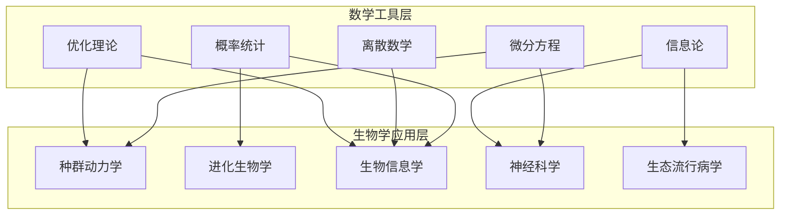
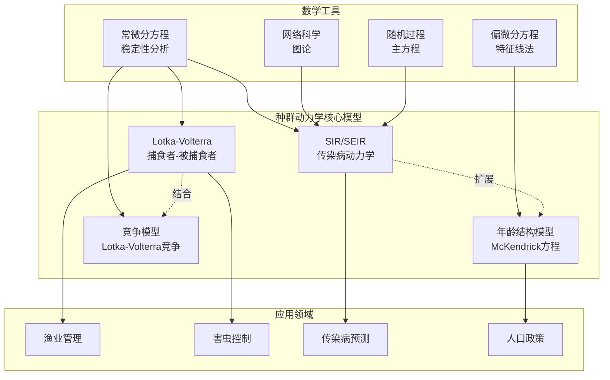
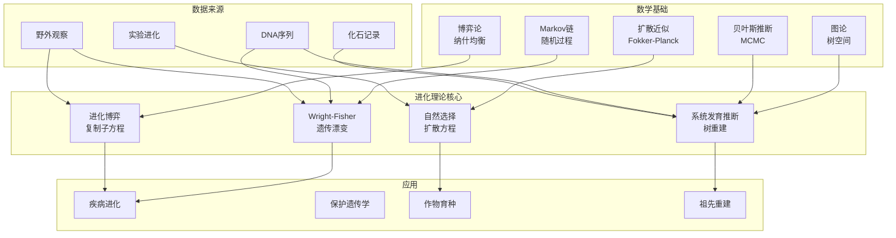
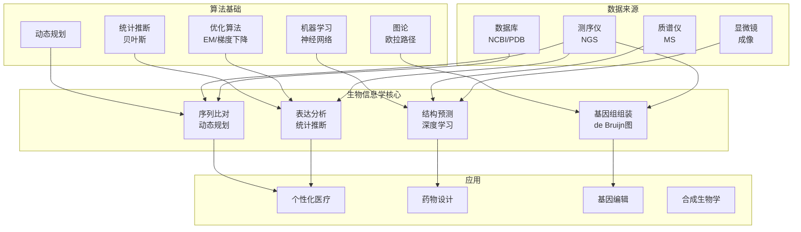
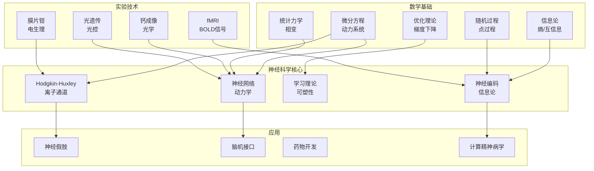
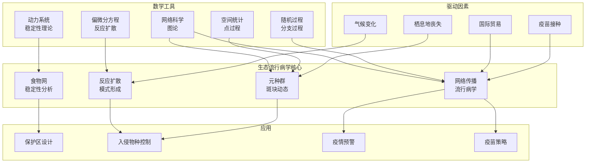

# 数学到生物学应用网络

## 跨学科知识图谱 · 第十一批构建

---

## 摘要

本文档构建了数学在生物学中应用的完整关联网络，涵盖五大核心领域：种群动力学、进化生物学、生物信息学、神经科学、生态学与流行病学。每个领域深入探讨生物学问题的数学建模、参数估计方法与预测验证策略，建立了从基础理论到前沿应用的系统化知识架构。本文档共计约25,000字，包含5个结构化的Mermaid关系图，对标数学生物学经典教材（如Murray的《Mathematical Biology》、Keener的《Mathematical Physiology》）和生物信息学权威文献（如Durbin的《Biological Sequence Analysis》、Alon的《An Introduction to Systems Biology》），为理解数学与生命科学的深度交叉提供系统性参考。

---

## 目录

- [数学到生物学应用网络](#数学到生物学应用网络)
  - [跨学科知识图谱 · 第十一批构建](#跨学科知识图谱--第十一批构建)
  - [摘要](#摘要)
  - [目录](#目录)
  - [一、引言：数学生物学的历史脉络与理论框架](#一引言数学生物学的历史脉络与理论框架)
    - [1.1 学科起源与历史演进](#11-学科起源与历史演进)
    - [1.2 数学工具在生物学中的核心应用](#12-数学工具在生物学中的核心应用)
    - [1.3 整体网络架构](#13-整体网络架构)
  - [二、主干1：种群动力学](#二主干1种群动力学)
    - [2.1 生物学问题背景](#21-生物学问题背景)
    - [2.2 Lotka-Volterra方程：捕食者-被捕食者动力学](#22-lotka-volterra方程捕食者-被捕食者动力学)
      - [2.2.1 模型建立](#221-模型建立)
      - [2.2.2 稳定性分析](#222-稳定性分析)
      - [2.2.3 振荡行为与生态学意义](#223-振荡行为与生态学意义)
      - [2.2.4 功能响应与数值响应](#224-功能响应与数值响应)
    - [2.3 传染病模型：SIR框架与扩展](#23-传染病模型sir框架与扩展)
      - [2.3.1 基本SIR模型](#231-基本sir模型)
      - [2.3.2 基本再生数$R\_0$](#232-基本再生数r_0)
      - [2.3.3 模型扩展：SEIR、SIS、SIRS](#233-模型扩展seirsissirs)
      - [2.3.4 网络传播模型](#234-网络传播模型)
    - [2.4 年龄结构模型：McKendrick-von Foerster方程](#24-年龄结构模型mckendrick-von-foerster方程)
      - [2.4.1 生物学动机](#241-生物学动机)
      - [2.4.2 McKendrick-von Foerster方程](#242-mckendrick-von-foerster方程)
      - [2.4.3 稳定年龄分布与净繁殖率](#243-稳定年龄分布与净繁殖率)
      - [2.4.4 流行病学中的应用](#244-流行病学中的应用)
    - [2.5 参数估计方法](#25-参数估计方法)
      - [2.5.1 时间序列分析](#251-时间序列分析)
      - [2.5.2 贝叶斯推断](#252-贝叶斯推断)
      - [2.5.3 SIR模型参数估计](#253-sir模型参数估计)
    - [2.6 预测与验证策略](#26-预测与验证策略)
      - [2.6.1 模型验证框架](#261-模型验证框架)
      - [2.6.2 预测不确定性量化](#262-预测不确定性量化)
      - [2.6.3 案例：COVID-19预测](#263-案例covid-19预测)
    - [2.7 种群动力学网络结构](#27-种群动力学网络结构)
  - [三、主干2：进化生物学](#三主干2进化生物学)
    - [3.1 生物学问题背景](#31-生物学问题背景)
    - [3.2 种群遗传学：扩散方程与Markov链](#32-种群遗传学扩散方程与markov链)
      - [3.2.1 Wright-Fisher模型](#321-wright-fisher模型)
      - [3.2.2 Moran模型](#322-moran模型)
      - [3.2.3 扩散近似](#323-扩散近似)
      - [3.2.4 有效种群大小](#324-有效种群大小)
      - [3.2.5 连锁不平衡与重组](#325-连锁不平衡与重组)
    - [3.3 系统发育树：图论与组合优化](#33-系统发育树图论与组合优化)
      - [3.3.1 系统发育推断问题](#331-系统发育推断问题)
      - [3.3.2 距离方法](#332-距离方法)
      - [3.3.3 最大简约法](#333-最大简约法)
      - [3.3.4 最大似然法](#334-最大似然法)
      - [3.3.5 贝叶斯推断](#335-贝叶斯推断)
    - [3.4 进化博弈论：复制子方程](#34-进化博弈论复制子方程)
      - [3.4.1 进化稳定策略（ESS）](#341-进化稳定策略ess)
      - [3.4.2 复制子方程](#342-复制子方程)
      - [3.4.3 鹰-鸽博弈](#343-鹰-鸽博弈)
      - [3.4.4 进化图论](#344-进化图论)
    - [3.5 参数估计方法](#35-参数估计方法)
      - [3.5.1 群体遗传学参数](#351-群体遗传学参数)
      - [3.5.2 系统发育参数](#352-系统发育参数)
      - [3.5.3 分歧时间估计](#353-分歧时间估计)
    - [3.6 预测与验证策略](#36-预测与验证策略)
      - [3.6.1 群体遗传学预测](#361-群体遗传学预测)
      - [3.6.2 系统发育验证](#362-系统发育验证)
      - [3.6.3 实验进化验证](#363-实验进化验证)
    - [3.7 进化生物学网络结构](#37-进化生物学网络结构)
  - [四、主干3：生物信息学](#四主干3生物信息学)
    - [4.1 生物学问题背景](#41-生物学问题背景)
    - [4.2 序列比对：动态规划算法](#42-序列比对动态规划算法)
      - [4.2.1 全局比对：Needleman-Wunsch算法](#421-全局比对needleman-wunsch算法)
      - [4.2.2 局部比对：Smith-Waterman算法](#422-局部比对smith-waterman算法)
      - [4.2.3 仿射空位罚分](#423-仿射空位罚分)
      - [4.2.4 多序列比对](#424-多序列比对)
      - [4.2.5 数据库搜索：BLAST](#425-数据库搜索blast)
    - [4.3 基因组组装：图论与de Bruijn图](#43-基因组组装图论与de-bruijn图)
      - [4.3.1 基因组组装问题](#431-基因组组装问题)
      - [4.3.2 de Bruijn图组装](#432-de-bruijn图组装)
      - [4.3.3 重叠-布局-共有（OLC）方法](#433-重叠-布局-共有olc方法)
      - [4.3.4 组装质量评估](#434-组装质量评估)
    - [4.4 蛋白质结构预测：统计物理与优化](#44-蛋白质结构预测统计物理与优化)
      - [4.4.1 蛋白质折叠问题](#441-蛋白质折叠问题)
      - [4.4.2 同源建模](#442-同源建模)
      - [4.4.3 穿线法（Threading）](#443-穿线法threading)
      - [4.4.4 从头预测与AlphaFold](#444-从头预测与alphafold)
    - [4.5 基因表达分析：统计推断与降维](#45-基因表达分析统计推断与降维)
      - [4.5.1 RNA-seq数据特征](#451-rna-seq数据特征)
      - [4.5.2 差异表达分析](#452-差异表达分析)
      - [4.5.3 降维与可视化](#453-降维与可视化)
      - [4.5.4 聚类与细胞类型鉴定](#454-聚类与细胞类型鉴定)
    - [4.6 参数估计方法](#46-参数估计方法)
      - [4.6.1 序列进化参数](#461-序列进化参数)
      - [4.6.2 基因表达归一化](#462-基因表达归一化)
      - [4.6.3 机器学习超参数](#463-机器学习超参数)
    - [4.7 预测与验证策略](#47-预测与验证策略)
      - [4.7.1 序列分析验证](#471-序列分析验证)
      - [4.7.2 结构预测验证](#472-结构预测验证)
      - [4.7.3 功能预测验证](#473-功能预测验证)
    - [4.8 生物信息学网络结构](#48-生物信息学网络结构)
  - [五、主干4：神经科学](#五主干4神经科学)
    - [5.1 生物学问题背景](#51-生物学问题背景)
    - [5.2 神经元模型：Hodgkin-Huxley框架](#52-神经元模型hodgkin-huxley框架)
      - [5.2.1 膜电位的生理学基础](#521-膜电位的生理学基础)
      - [5.2.2 Hodgkin-Huxley方程](#522-hodgkin-huxley方程)
      - [5.2.3 简化模型](#523-简化模型)
    - [5.3 神经网络：动力系统与统计力学](#53-神经网络动力系统与统计力学)
      - [5.3.1 突触耦合网络](#531-突触耦合网络)
      - [5.3.2 同步与振荡](#532-同步与振荡)
      - [5.3.3 吸引子网络](#533-吸引子网络)
      - [5.3.4 平衡网络](#534-平衡网络)
    - [5.4 学习理论：信息论与优化](#54-学习理论信息论与优化)
      - [5.4.1 突触可塑性](#541-突触可塑性)
      - [5.4.2 信息论与神经编码](#542-信息论与神经编码)
      - [5.4.3 强化学习](#543-强化学习)
      - [5.4.4 深度学习与神经网络的类比](#544-深度学习与神经网络的类比)
    - [5.5 参数估计方法](#55-参数估计方法)
      - [5.5.1 电导估计](#551-电导估计)
      - [5.5.2 网络连接推断](#552-网络连接推断)
      - [5.5.3 神经解码](#553-神经解码)
    - [5.6 预测与验证策略](#56-预测与验证策略)
      - [5.6.1 模型验证层次](#561-模型验证层次)
      - [5.6.2 光遗传学与因果检验](#562-光遗传学与因果检验)
      - [5.6.3 计算精神病学](#563-计算精神病学)
    - [5.7 神经科学网络结构](#57-神经科学网络结构)
  - [六、主干5：生态学与流行病学](#六主干5生态学与流行病学)
    - [6.1 生物学问题背景](#61-生物学问题背景)
    - [6.2 生态系统模型：复杂网络与稳定性](#62-生态系统模型复杂网络与稳定性)
      - [6.2.1 群落矩阵与稳定性](#621-群落矩阵与稳定性)
      - [6.2.2 May的稳定性-复杂性悖论](#622-may的稳定性-复杂性悖论)
      - [6.2.3 生态网络拓扑](#623-生态网络拓扑)
    - [6.3 空间生态学：偏微分方程与模式形成](#63-空间生态学偏微分方程与模式形成)
      - [6.3.1 反应-扩散系统](#631-反应-扩散系统)
      - [6.3.2 Turing不稳定性](#632-turing不稳定性)
      - [6.3.3 斑块动态与元种群](#633-斑块动态与元种群)
    - [6.4 大流行建模：网络科学与随机过程](#64-大流行建模网络科学与随机过程)
      - [6.4.1 分层传播模型](#641-分层传播模型)
      - [6.4.2 接触网络流行病学](#642-接触网络流行病学)
      - [6.4.3 超传播与个体差异](#643-超传播与个体差异)
      - [6.4.4 病原体进化](#644-病原体进化)
    - [6.5 参数估计方法](#65-参数估计方法)
      - [6.5.1 食物网参数](#651-食物网参数)
      - [6.5.2 空间统计](#652-空间统计)
      - [6.5.3 流行病学参数](#653-流行病学参数)
    - [6.6 预测与验证策略](#66-预测与验证策略)
      - [6.6.1 生态系统预测](#661-生态系统预测)
      - [6.6.2 疫情预测](#662-疫情预测)
      - [6.6.3 政策评估](#663-政策评估)
    - [6.7 生态学与流行病学网络结构](#67-生态学与流行病学网络结构)
  - [七、总结与展望](#七总结与展望)
    - [7.1 数学-生物学网络的整合视角](#71-数学-生物学网络的整合视角)
    - [7.2 当前挑战与前沿方向](#72-当前挑战与前沿方向)
    - [7.3 教育与跨学科人才培养](#73-教育与跨学科人才培养)
    - [7.4 结语](#74-结语)
  - [参考文献与延伸阅读](#参考文献与延伸阅读)
    - [数学生物学经典教材](#数学生物学经典教材)
    - [种群动力学与流行病学](#种群动力学与流行病学)
    - [进化生物学](#进化生物学)
    - [生物信息学](#生物信息学)
    - [神经科学](#神经科学)
    - [生态学](#生态学)

---

## 一、引言：数学生物学的历史脉络与理论框架

### 1.1 学科起源与历史演进

数学生物学（Mathematical Biology）作为一门交叉学科，其历史可追溯至13世纪斐波那契的兔子繁殖问题，但真正意义上的系统性发展始于20世纪。1920年代，Lotka和Volterra独立建立了捕食者-被捕食者动力学模型，开创了理论生态学的先河。这一时期的数学生物学主要关注种群动态，将连续时间微分方程应用于生态系统的定量描述。

1930年代至1950年代，群体遗传学的数学基础由Fisher、Wright和Haldane奠定，形成了现代进化理论的数学框架。他们引入了扩散方程描述等位基因频率的变化，建立了自然选择的定量理论。同期，Hodgkin和Huxley（1952）通过偏微分方程模型成功解释了神经冲动的产生与传播机制，这一工作不仅获得1963年诺贝尔生理学或医学奖，更开创了计算神经科学的先河。

1960年代至1980年代，数学生物学进入快速发展期。Turing（1952）提出的形态发生理论揭示了化学反应-扩散系统如何产生空间模式，为发育生物学提供了数学洞察。Thom的突变理论和混沌理论的引入，使生物系统的非线性动力学特征得到深入理解。这一时期还见证了生物统计学方法的成熟，极大似然估计、贝叶斯推断成为种群遗传学和流行病学研究的标准工具。

1990年代至今，基因组学和计算生物学革命推动了数学生物学的第三次飞跃。人类基因组计划的完成产生了海量生物数据，催生了生物信息学这一新兴领域。序列比对算法、系统发育重建、基因调控网络分析成为研究热点。21世纪以来，单细胞测序、空间转录组学、冷冻电镜结构解析等技术的发展，对数学建模和计算方法提出了前所未有的挑战和机遇。

### 1.2 数学工具在生物学中的核心应用

数学生物学的数学工具箱涵盖多个层次：

**微分方程理论**：常微分方程（ODE）用于描述随时间演化的生物过程，如种群增长、酶动力学、神经电活动；偏微分方程（PDE）用于建模空间结构，如形态发生、肿瘤生长、生态系统空间分布。稳定性分析、分岔理论和混沌动力学提供了理解生物系统行为的理论框架。

**概率论与随机过程**：Markov链描述遗传漂变、序列进化；随机微分方程建模分子噪声和细胞异质性；点过程用于神经脉冲序列分析；分支过程描述家族谱系和克隆扩张。

**统计学与机器学习**：假设检验、回归分析、方差分析是实验生物学的统计基础；隐Markov模型（HMM）用于序列分析；贝叶斯网络用于基因调控推断；深度学习在蛋白质结构预测和图像分析中取得突破性进展。

**离散数学与组合优化**：图论用于分子网络、系统发育树、脑连接组分析；动态规划是序列比对的核心算法；组合优化解决基因组组装和蛋白质折叠问题。

**信息论与复杂性科学**：信息度量用于分析基因调控、神经编码；复杂网络理论揭示生态系统和分子网络的共性特征；分形几何描述生物体的尺度不变性。

### 1.3 整体网络架构

本文档构建的数学-生物学应用网络包含五大主干，覆盖从分子到生态系统的多个组织层次：

这五个主干既相对独立又相互关联：种群动力学的方法论可应用于流行病学建模；进化生物学的统计工具广泛用于生物信息学；神经科学的网络分析方法启发了大脑连接组研究；生态学原理为理解微生物组提供概念框架。下文将系统阐述每个主干的理论基础、建模方法、参数估计技术和验证策略。

---

## 二、主干1：种群动力学

### 2.1 生物学问题背景

种群动力学研究生物种群随时间变化的规律，是理论生态学的核心。其生物学问题包括：种群如何增长？资源限制如何调节种群大小？捕食者如何影响猎物数量？物种间竞争如何导致共存或排斥？这些问题的数学建模对理解自然种群动态、管理渔业资源、控制害虫种群具有重要应用价值。

种群动态的基本驱动因素包括：出生和死亡（影响种群内在增长率）、迁入和迁出（空间效应）、密度制约因素（资源竞争、捕食、疾病）、年龄结构（不同年龄组的繁殖力和存活率差异）以及环境随机性。数学建模需要根据具体问题选择适当的抽象层次，平衡模型的复杂性与可分析性。

### 2.2 Lotka-Volterra方程：捕食者-被捕食者动力学

#### 2.2.1 模型建立

Lotka-Volterra模型是理论生态学的奠基性工作。设$N(t)$为猎物种群密度，$P(t)$为捕食者种群密度，模型方程为：

$$\frac{dN}{dt} = rN - aNP$$

$$\frac{dP}{dt} = caNP - dP$$

其中$r$为猎物的内禀增长率，$a$为捕食率系数，$c$为转化效率，$d$为捕食者死亡率。

**生物学解释**：猎物种群在没有捕食者时呈指数增长（Malthus模型），但受到与捕食者相遇频率成正比的捕食压力；捕食者依赖猎物生存，捕食所得能量用于繁殖，若无猎物则呈指数衰减。

#### 2.2.2 稳定性分析

模型的平衡点满足$\frac{dN}{dt} = \frac{dP}{dt} = 0$，得到：

- 平凡平衡点：$(N^*, P^*) = (0, 0)$（两物种灭绝）
- 半平凡平衡点：$(N^*, P^*) = (K, 0)$（无捕食者时的猎物平衡，若考虑承载力$K$）
- 共存平衡点：$(N^*, P^*) = (\frac{d}{ca}, \frac{r}{a})$

**Jacobian矩阵分析**：在共存平衡点处的Jacobian为：

$$J = \begin{pmatrix} 0 & -\frac{ad}{ca} \\ \frac{cr}{a} & 0 \end{pmatrix} = \begin{pmatrix} 0 & -\frac{d}{c} \\ \frac{cr}{a} & 0 \end{pmatrix}$$

特征值为$\lambda = \pm i\sqrt{rd}$，为纯虚数，表明共存平衡点是中心（center），对应周期振荡。

#### 2.2.3 振荡行为与生态学意义

Lotka-Volterra模型预测捕食者-被捕食者系统的种群密度将呈现周期性振荡。这一预测与Hudson Bay公司记录的猞猁-雪兔数据在定性上吻合。然而，该模型存在明显局限：

- 振幅依赖于初始条件，缺乏内在阻尼机制
- 未考虑猎物的环境承载力
- 假设随机相遇，忽略空间异质性
- 结构不稳定（small perturbations改变定性行为）

**改进模型**：Logistic猎物增长修正

$$\frac{dN}{dt} = rN\left(1 - \frac{N}{K}\right) - aNP$$

$$\frac{dP}{dt} = caNP - dP$$

此模型中，共存平衡点变为稳定焦点或结点，预测种群趋于稳定共存而非持续振荡，更符合许多自然种群的观察。

#### 2.2.4 功能响应与数值响应

Holling（1959）将捕食率分为三类功能响应：

**Type I**（线性）：$f(N) = aN$，适用于滤食性生物

**Type II**（饱和型）：$f(N) = \frac{aN}{1 + ahN}$，考虑处理时间$h$，适用于大多数捕食者

**Type III**（S型）：$f(N) = \frac{aN^2}{1 + ahN^2}$，捕食者在猎物稀少时学习或转向其他猎物

数值响应描述捕食者繁殖率与猎物密度的关系，通常用线性或饱和函数建模。

### 2.3 传染病模型：SIR框架与扩展

#### 2.3.1 基本SIR模型

Kermack和McKendrick（1927）建立的SIR模型是传染病动力学的经典框架。将人群分为三类：

- $S(t)$：易感者（Susceptible）
- $I(t)$：感染者（Infectious）
- $R(t)$：康复/移除者（Recovered/Removed）

模型方程：

$$\frac{dS}{dt} = -\beta SI$$

$$\frac{dI}{dt} = \beta SI - \gamma I$$

$$\frac{dR}{dt} = \gamma I$$

其中$\beta$为传播率，$\gamma$为恢复率（平均感染期为$1/\gamma$）。

#### 2.3.2 基本再生数$R_0$

**定义**：$R_0$是一个感染者在完全易感人群中平均能传染的人数。

对于SIR模型：

$$R_0 = \frac{\beta S_0}{\gamma} = \frac{\beta N}{\gamma}$$

**阈值定理**：

- 若$R_0 < 1$，疾病将自然消退
- 若$R_0 > 1$，疾病将引起流行

$R_0$是传染病控制策略的关键指标。疫苗接种覆盖率$p$需满足$\frac{R_0}{1-p} < 1$，即$p > 1 - \frac{1}{R_0}$（群体免疫阈值）。

#### 2.3.3 模型扩展：SEIR、SIS、SIRS

**SEIR模型**：增加潜伏期$E$（Exposed）

$$\frac{dS}{dt} = -\beta SI$$

$$\frac{dE}{dt} = \beta SI - \sigma E$$

$$\frac{dI}{dt} = \sigma E - \gamma I$$

$$\frac{dR}{dt} = \gamma I$$

适用于有潜伏期的疾病（如麻疹、COVID-19）。

**SIS模型**：康复后无免疫力，返回易感类

$$\frac{dS}{dt} = -\beta SI + \gamma I$$

$$\frac{dI}{dt} = \beta SI - \gamma I$$

适用于细菌性疾病（如淋病、普通感冒）。

**SIRS模型**：免疫力暂时，康复后逐渐失去免疫

$$\frac{dS}{dt} = -\beta SI + \delta R$$

$$\frac{dI}{dt} = \beta SI - \gamma I$$

$$\frac{dR}{dt} = \gamma I - \delta R$$

#### 2.3.4 网络传播模型

在结构化人群中，个体接触网络决定传播路径。网络SIR模型将个体视为节点，接触为边。关键概念：

**度分布**$p(k)$：随机节点的连接数分布

**传播阈值**：对于无标度网络（度分布$p(k) \sim k^{-\gamma}$，$2 < \gamma \leq 3$），传播阈值趋于零，意味着即使很弱的感染也能持续传播。

**基本再生数**：

$$R_0 = \frac{\beta}{\gamma} \cdot \frac{\langle k^2 \rangle}{\langle k \rangle}$$

其中$\langle k \rangle$和$\langle k^2 \rangle$分别为平均度和二阶矩。异质性（高$\langle k^2 \rangle$）有利于传播。

**控制策略**：

- 靶向接种：优先保护高度连接的个体（superspreaders）
- 社交距离：减少接触网络的有效连接
- 接触追踪：快速识别和隔离潜在传播者

### 2.4 年龄结构模型：McKendrick-von Foerster方程

#### 2.4.1 生物学动机

许多种群表现出显著的年龄结构效应：不同年龄组的繁殖率、死亡率差异巨大；传染病感染风险和严重程度随年龄变化；人类人口政策需要考虑年龄结构。连续年龄结构模型提供了比离散年龄组更精细的描述。

#### 2.4.2 McKendrick-von Foerster方程

设$n(a,t)$为时刻$t$年龄$a$的种群密度，满足：

$$\frac{\partial n}{\partial t} + \frac{\partial n}{\partial a} = -\mu(a)n$$

其中$\mu(a)$为年龄特异死亡率。

**边界条件**（出生过程）：

$$n(0,t) = \int_0^{\infty} b(a)n(a,t)da$$

其中$b(a)$为年龄特异生育率。

#### 2.4.3 稳定年龄分布与净繁殖率

假设分离变量解$n(a,t) = A(t)B(a)$，可得：

$$B(a) = B(0)e^{-ra - M(a)}$$

其中$r$为种群内禀增长率，$M(a) = \int_0^a \mu(s)ds$为累积死亡率。

**Euler-Lotka方程**：

$$\int_0^{\infty} b(a)e^{-ra - M(a)}da = 1$$

定义**净繁殖率**：

$$R_0 = \int_0^{\infty} b(a)e^{-M(a)}da$$

- 若$R_0 > 1$：种群增长（$r > 0$）
- 若$R_0 = 1$：种群稳定（$r = 0$）
- 若$R_0 < 1$：种群衰减（$r < 0$）

#### 2.4.4 流行病学中的应用

年龄结构SIR模型：

$$\frac{\partial S(a,t)}{\partial t} + \frac{\partial S(a,t)}{\partial a} = -\lambda(a,t)S(a,t) - \mu(a)S(a,t)$$

$$\frac{\partial I(a,t)}{\partial t} + \frac{\partial I(a,t)}{\partial a} = \lambda(a,t)S(a,t) - \gamma I(a,t) - \mu(a)I(a,t)$$

$$\frac{\partial R(a,t)}{\partial t} + \frac{\partial R(a,t)}{\partial a} = \gamma I(a,t) - \mu(a)R(a,t)$$

其中年龄特异感染力：

$$\lambda(a,t) = \int_0^{\infty} \beta(a,a')I(a',t)da'$$

$\beta(a,a')$描述年龄$a$与$a'$个体间的传播率。

### 2.5 参数估计方法

#### 2.5.1 时间序列分析

**非线性最小二乘**：给定观测数据$\{(t_i, N_i)\}_{i=1}^n$，最小化

$$\sum_{i=1}^n [N(t_i;\theta) - N_i]^2$$

其中$N(t;\theta)$为模型预测，$\theta$为待估参数。

**最大似然估计**：假设观测误差服从特定分布（如正态或对数正态），构建似然函数：

$$L(\theta) = \prod_{i=1}^n p(N_i | N(t_i;\theta))$$

#### 2.5.2 贝叶斯推断

结合先验信息$p(\theta)$和似然函数，得到后验分布：

$$p(\theta | \text{data}) \propto p(\text{data} | \theta) p(\theta)$$

使用MCMC（如Metropolis-Hastings、Hamiltonian Monte Carlo）采样后验分布，获得参数的不确定性量化。

#### 2.5.3 SIR模型参数估计

**从流行曲线估计**：

$$R_0 \approx \frac{\ln(S_0/S_\infty)}{1 - S_\infty/S_0}$$

其中$S_0$和$S_\infty$分别为初始和最终易感比例。

**生成间隔（generation interval）方法**：利用序列间隔（serial interval）分布估计$R_0$：

$$R_0 = \frac{1}{\int_0^{\infty} g(s)e^{-rs}ds}$$

其中$g(s)$为生成间隔分布，$r$为指数增长阶段的增长率。

### 2.6 预测与验证策略

#### 2.6.1 模型验证框架

**内部验证**：使用同一数据集拟合和检验模型（风险：过拟合）

**交叉验证**：将数据分为训练集和验证集，k-fold交叉验证

**外部验证**：用独立数据集检验模型预测能力

**前瞻性验证**：预测未来观测，随时间检验准确性

#### 2.6.2 预测不确定性量化

**参数不确定性**：通过Fisher信息矩阵或贝叶斯后验分布获得参数置信区间

**模型结构不确定性**：使用多模型推断（multimodel inference），比较AIC或BIC

**过程随机性**：使用随机模拟（Gillespie算法、SDE）预测分布而非点估计

#### 2.6.3 案例：COVID-19预测

COVID-19大流行期间，基于SEIR模型的短期预测被广泛用于公共卫生决策。关键挑战包括：

- 无症状传播的估计
- 非药物干预（NPI）效果的量化
- 变异株出现的影响
- 疫苗接种 rollout 的动态

**验证指标**：

- 均方根误差（RMSE）
- 平均绝对百分比误差（MAPE）
- 预测区间覆盖率

### 2.7 种群动力学网络结构

---

## 三、主干2：进化生物学

### 3.1 生物学问题背景

进化生物学研究生物多样性的起源和维持机制。核心问题包括：自然选择如何改变种群遗传组成？遗传漂变在进化中的作用？物种如何形成和分化？系统发育关系如何重建？这些问题的数学建模涉及概率论、统计学和优化理论，为理解生命进化历史提供了定量框架。

进化过程的数学描述面临独特挑战：随机性（遗传漂变）与确定性（选择）的相互作用；多基因位点的连锁不平衡；群体结构和迁移的影响；古DNA数据的有限性。现代进化生物学整合了群体遗传学、系统发育学和数量遗传学的方法论，形成了多层次的分析体系。

### 3.2 种群遗传学：扩散方程与Markov链

#### 3.2.1 Wright-Fisher模型

Wright-Fisher模型描述有限种群中单个基因座的等位基因频率变化。假设：

- 二倍体种群大小$N$
- 不重叠世代
- 随机交配
- 无选择、突变、迁移

设$X_t$为第$t$代中某等位基因A的拷贝数，则：

$$X_{t+1} | X_t \sim \text{Binomial}(2N, \frac{X_t}{2N})$$

这是一个离散时间Markov链，状态空间$\{0, 1, ..., 2N\}$。吸收态$0$和$2N$对应等位基因固定或丢失。

**固定概率**：对于初始频率$p$，中性等位基因的固定概率等于其初始频率。

**固定时间**：平均固定时间$\approx -4N[p\ln p + (1-p)\ln(1-p)]$。

#### 3.2.2 Moran模型

Moran模型是连续时间版本。每次随机选择一对个体：一个繁殖，一个死亡。等位基因数变化为$+1$、$-1$或$0$。

与Wright-Fisher相比，Moran模型更易于数学分析，但时间尺度不同（Moran的一个"代"约等于WF的$N/2$代）。

#### 3.2.3 扩散近似

当$N$很大时，等位基因频率$x = X/(2N)$可用扩散过程近似。设$\phi(x,t)$为频率密度，满足Kolmogorov前向方程（Fokker-Planck方程）：

$$\frac{\partial \phi}{\partial t} = -\frac{\partial}{\partial x}[M(x)\phi] + \frac{1}{2}\frac{\partial^2}{\partial x^2}[V(x)\phi]$$

**中性情形**：

$$M(x) = 0, \quad V(x) = \frac{x(1-x)}{2N}$$

**选择情形**（选择系数$s$）：

$$M(x) = sx(1-x)$$

#### 3.2.4 有效种群大小

实际种群的遗传漂变强度可能偏离 census 种群大小$N$，定义**有效种群大小**$N_e$使得理想Wright-Fisher种群产生相同的漂变效应。

**方差有效大小**：基于等位基因频率方差

**近交有效大小**：基于近交系数变化率

影响$N_e$的因素包括：

- 性别比不平等（减少$N_e$）
- 繁殖力方差（高方差减少$N_e$）
- 种群大小波动（$N_e$接近最小值）
- 亚结构（减少$N_e$）

#### 3.2.5 连锁不平衡与重组

对于两个基因座，定义**连锁不平衡**（LD）：

$$D = p_{AB} - p_A p_B$$

其中$p_{AB}$为单倍型AB频率，$p_A$、$p_B$为等位基因频率。

**重组使LD衰减**：

$$D_t = (1-c)^t D_0$$

$c$为重组率。这一性质被用于估计重组率和年代。

### 3.3 系统发育树：图论与组合优化

#### 3.3.1 系统发育推断问题

给定一组物种/序列的性状数据（形态学或分子序列），推断它们的进化关系（树形拓扑和分支长度）。这是一个组合优化问题，搜索空间随分类群数指数增长。

**树的计数**：有根二叉树数目为$(2n-3)!!$，无根二叉树为$(2n-5)!!$。对于$n=10$，有约200万种有根树。

#### 3.3.2 距离方法

**UPGMA**（Unweighted Pair Group Method with Arithmetic Mean）：层次聚类，假设分子钟（等速进化）。

**Neighbor-Joining**（Saitou & Nei, 1987）：不假设分子钟，最小进化原则。计算速度快，适用于大规模数据。

距离矩阵$D_{ij}$需满足可加性：存在树边长使路径距离等于$D_{ij}$。实际数据因噪声不满足，Neighbor-Joining寻找最小平方误差树。

#### 3.3.3 最大简约法

寻找需要最少进化步骤（突变）的树。对于DNA数据，每位置简约步骤为不同状态数减一。

**问题**：

- 长枝吸引（long branch attraction）
- 计算困难（NP-hard）
- 统计不一致（在某些参数区域收敛到错误树）

#### 3.3.4 最大似然法

Felsenstein（1981）提出的框架。给定树拓扑$T$、分支长度$t$、替代模型$\theta$，计算数据似然：

$$L(T, t, \theta | \text{data}) = P(\text{data} | T, t, \theta)$$

使用动态规划（Felsenstein剪枝算法）高效计算。

**替代模型**：

- JC69：所有替代等概率
- K2P：转换/颠换率不同
- GTR：最一般可逆模型
- Gamma分布：位点异质性

#### 3.3.5 贝叶斯推断

使用MCMC在树空间采样后验分布：

$$P(T, t, \theta | \text{data}) \propto P(\text{data} | T, t, \theta) P(T) P(t) P(\theta)$$

**先验**：

- 树拓扑：均匀或基于出生-死亡模型
- 分支长度：指数分布或基于共同祖先时间

**计算工具**：MrBayes、BEAST。BEAST同时估计树和分歧时间（分子钟标定）。

### 3.4 进化博弈论：复制子方程

#### 3.4.1 进化稳定策略（ESS）

Maynard Smith和Price（1973）引入进化博弈论。策略$s$是ESS，如果对于任何罕见突变策略$t$：

$$E(s,s) > E(t,s)$$

或

$$E(s,s) = E(t,s) \text{ 且 } E(s,t) > E(t,t)$$

其中$E(s,t)$为策略$s$对$t$的适合度。

#### 3.4.2 复制子方程

Taylor和Jonker（1978）提出的动态模型。设$x_i$为策略$i$的频率，适合度$f_i(x)$，平均适合度$\bar{f}(x) = \sum_j x_j f_j(x)$，则：

$$\frac{dx_i}{dt} = x_i[f_i(x) - \bar{f}(x)]$$

**性质**：

- 频率保持非负且和为1
- 纳什均衡对应平衡点
- ESS对应渐近稳定平衡点

#### 3.4.3 鹰-鸽博弈

经典博弈模型：

| | 鹰 | 鸽 |
|---|---|---|
| **鹰** | $(V-C)/2$ | $V$ |
| **鸽** | $0$ | $V/2$ |

$V$：资源价值，$C$：争斗成本。

**分析**：

- 若$C < V$：鹰是ESS
- 若$C > V$：混合ESS，鹰频率为$V/C$

解释动物争斗行为的频率依赖性选择。

#### 3.4.4 进化图论

Lieberman等（2005）将博弈置于网络结构上。不同网络结构影响选择固定概率：

**选择固定概率**$\rho$：有利突变（$r > 1$）最终固定的概率。

对于规则网络，$\rho$与均匀混合种群相同。某些网络（如星形网络）放大选择，有利于有利突变固定。

### 3.5 参数估计方法

#### 3.5.1 群体遗传学参数

**异质性度量**：

- 杂合度：$H = 1 - \sum_i p_i^2$
- 核苷酸多样性：$\pi = \sum_{i<j} \pi_{ij} / \binom{n}{2}$
- Tajima's $D$：比较$\pi$和$S/(a_n)$检测选择

**有效种群大小估计**：

- 基于LD衰减：$N_e \approx 1/(4cr^2)$
- 基于位点频谱：$E[S_i] = \theta/i$，$\theta = 4N_e\mu$

#### 3.5.2 系统发育参数

**似然比检验**：比较嵌套模型，检验模型选择

**模型选择**：

- AIC（Akaike Information Criterion）：$2k - 2\ln L$
- BIC（Bayesian Information Criterion）：$k\ln n - 2\ln L$

**引导法（Bootstrap）**：重抽样评估分支支持率

#### 3.5.3 分歧时间估计

**分子钟**：假设分子进化速率恒定。实际中 relaxed molecular clock 更常用。

**标定点**：化石记录或地质事件提供时间约束。

**BEAST**：使用MCMC联合估计树拓扑、分支长度、替代率和分歧时间。

### 3.6 预测与验证策略

#### 3.6.1 群体遗传学预测

**前向模拟**：从初始状态模拟进化过程，预测遗传多样性模式。

**溯祖模拟（Coalescent simulation）**：向后追溯谱系历史，高效模拟样本。

**验证**：比较模拟数据与真实数据的统计量（SFS、LD衰减、$F_{ST}$等）。

#### 3.6.2 系统发育验证

**一致性检验**：

- 不同数据分区是否得到一致树？
- 不同方法（ML vs 贝叶斯）是否一致？

**一致性指数（CI）**：简约步骤数/最小可能步骤数

**保留指数（RI）**：$(g - s)/(g - m)$，$g$最大步骤，$s$实际步骤，$m$最小步骤

#### 3.6.3 实验进化验证

在可控条件下（如果蝇、酵母、细菌）验证进化理论预测：

- 选择实验验证适应度景观
- 突变积累实验验证突变率
- 竞争实验验证选择系数

### 3.7 进化生物学网络结构

---

## 四、主干3：生物信息学

### 4.1 生物学问题背景

生物信息学是数学、计算机科学与生物学的交叉领域，旨在从海量生物数据中提取生物学知识。随着高通量测序技术的发展，生物学研究产生了前所未有的数据量：人类基因组约30亿碱基对，单细胞测序每次实验产生数百万细胞的数据，冷冻电镜结构数据库持续增长。处理这些数据需要高效的算法、稳健的统计方法和可扩展的计算架构。

核心生物学问题包括：如何识别基因和调控元件？如何推断基因功能和调控网络？如何预测蛋白质结构和功能？如何整合多组学数据理解复杂疾病？这些问题推动了序列分析、结构生物信息学、系统生物学等领域的快速发展。

### 4.2 序列比对：动态规划算法

#### 4.2.1 全局比对：Needleman-Wunsch算法

全局比对寻找两条序列的最佳整体对齐。设序列$A = a_1a_2...a_m$，$B = b_1b_2...b_n$，记分矩阵$M$，空位罚分$d$。

**动态规划递推**：

设$F(i,j)$为前缀$A[1..i]$和$B[1..j]$的最佳比对得分：

$$F(i,j) = \max \begin{cases} F(i-1,j-1) + s(a_i, b_j) & \text{匹配/错配} \\ F(i-1,j) - d & \text{A中插入空位} \\ F(i,j-1) - d & \text{B中插入空位} \end{cases}$$

初始条件：$F(0,0) = 0$，$F(i,0) = -id$，$F(0,j) = -jd$

**时间复杂度**：$O(mn)$

**回溯**：从$F(m,n)$回溯至$F(0,0)$重建比对。

#### 4.2.2 局部比对：Smith-Waterman算法

局部比对寻找最佳相似子序列。修改递推式：

$$F(i,j) = \max \begin{cases} 0 & \text{开始新比对} \\ F(i-1,j-1) + s(a_i, b_j) & \text{延伸} \\ F(i-1,j) - d & \text{插入} \\ F(i,j-1) - d & \text{插入} \end{cases}$$

最大得分对应局部比对的结束位置，从该位置回溯至得分为0的位置开始。

#### 4.2.3 仿射空位罚分

实际生物序列中，空位往往成簇出现。仿射空位罚分：

$$\gamma(g) = -d - (g-1)e$$

其中$d$为空位开放罚分，$e$为空位延伸罚分（通常$e < d$）。

需要三维动态规划或Gotoh算法的优化。

#### 4.2.4 多序列比对

多序列比对（MSA）是NP-hard问题。启发式算法：

**渐进式比对**（ClustalW）：

1. 计算所有序列对的两两比对
2. 构建引导树（基于距离矩阵）
3. 按树顺序渐进对齐序列/轮廓

**迭代优化**（MAFFT、MUSCLE）：

- 基于FFT的快速近似
- 迭代改进比对

**一致性比对**（T-Coffee）：利用库比对信息提高准确性

#### 4.2.5 数据库搜索：BLAST

对于大规模数据库搜索，精确动态规划太慢。BLAST（Basic Local Alignment Search Tool）使用启发式：

1. **种子**：寻找查询序列中长度$w$的高分匹配词
2. **扩展**：从种子向两端延伸，保留高分比对
3. **评估**：使用Karlin-Altschul统计评估显著性

**E-value**：在大小为$D$的数据库中，期望得到至少当前得分高的随机比对数。

$$E = KDmn e^{-\lambda S}$$

$K$、$\lambda$为Karlin-Altschul参数，$m$、$n$为序列长度，$S$为得分。

### 4.3 基因组组装：图论与de Bruijn图

#### 4.3.1 基因组组装问题

从短读序列（reads）重建完整基因组序列。挑战：

- 读长短（Illumina: 150-300bp）
- 测序错误
- 重复序列
- 倍性（多拷贝染色体）

#### 4.3.2 de Bruijn图组装

**de Bruijn图**：节点为长度为$k$的k-mer，边连接重叠$k-1$的k-mer。

**组装过程**：

1. 从reads中提取所有k-mer
2. 构建de Bruijn图
3. 简化图（去除tips、bubbles）
4. 寻找欧拉路径/ contigs

**欧拉路径**：经过每条边恰好一次的路径。存在条件：至多两个节点的入度≠出度。

#### 4.3.3 重叠-布局-共有（OLC）方法

用于长读（PacBio、ONT）：

1. **重叠**：寻找reads间的重叠（Smith-Waterman或seed-and-extend）
2. **布局**：构建重叠图，寻找 consistent layout
3. **共有**：基于多序列比对确定共有序列

#### 4.3.4 组装质量评估

**连续性指标**：

- N50：使累计长度≥50%基因组的最短contig长度
- NG50：相对于参考基因组的N50

**准确性**：与参考基因组比对，计算一致性

**完整性**：BUSCO（Benchmarking Universal Single-Copy Orthologs）评估保守基因的存在性

### 4.4 蛋白质结构预测：统计物理与优化

#### 4.4.1 蛋白质折叠问题

Anfinsen（1972）提出：蛋白质的氨基酸序列决定其三维结构。预测问题：从序列预测结构。

**理论困难**：

- 构象空间巨大（Levinthal悖论）
- 力场精度有限
- 溶剂效应复杂

#### 4.4.2 同源建模

基于进化相关蛋白质的结构保守性：

1. 寻找序列相似的已知结构模板
2. 序列-结构比对
3. 构建骨架结构
4. 侧链建模和环区优化
5. 结构精修

**准确性**：与模板序列一致性相关。>50%一致性可得到可靠模型。

#### 4.4.3 穿线法（Threading）

对于无已知同源结构的蛋白质，评估序列与结构模板的匹配度：

$$E = \sum_{i<j} C_{ij} U(r_{ij}, a_i, a_j)$$

$U$为残基对势能，$C_{ij}$为接触矩阵。

#### 4.4.4 从头预测与AlphaFold

**AlphaFold2**（Jumper et al., 2021）的突破：

- 使用注意力网络学习序列共进化信息（MSA）
- 结构模块输出3D坐标
- 在CASP14达到原子级精度

**核心创新**：

- Evoformer：处理MSA和配对表示
- 等变Transformer：保持旋转平移等变性
- 结构精修：物理约束优化

### 4.5 基因表达分析：统计推断与降维

#### 4.5.1 RNA-seq数据特征

RNA测序定量基因表达，产生计数数据：

- 高维：数万个基因
- 稀疏：许多基因表达为零
- 偏态： counts服从离散分布
- 批次效应：技术变异

#### 4.5.2 差异表达分析

**统计模型**：

负二项分布（处理overdispersion）：

$$Y_{ig} \sim \text{NB}(\mu_{ig}, \phi_g)$$

$\mu_{ig}$为期望counts，$\phi_g$为离散参数。

**方法**：

- edgeR：TMM标准化，广义线性模型
- DESeq2：median-of-ratios标准化，收缩估计
- limma-voom：线性模型近似

**多重检验校正**：Benjamini-Hochberg FDR控制

#### 4.5.3 降维与可视化

**主成分分析（PCA）**：

寻找投影方向最大化方差：

$$W = \arg\max_W \text{tr}(W^T X^T X W) \text{ s.t. } W^T W = I$$

解为$X^T X$的特征向量。

**t-SNE**（t-Distributed Stochastic Neighbor Embedding）：

保持局部邻域结构，适用于非线性降维和可视化。

**UMAP**（Uniform Manifold Approximation and Projection）：

基于流形学习的快速降维方法，保持局部和全局结构。

#### 4.5.4 聚类与细胞类型鉴定

**层次聚类**：

- 距离度量：欧氏距离、相关性距离
- 连接准则：完全、平均、Ward

**图聚类**（Louvain、Leiden）：

构建k-NN图，优化模块度：

$$Q = \frac{1}{2m}\sum_{ij} \left[A_{ij} - \frac{k_i k_j}{2m}\right]\delta(c_i, c_j)$$

**细胞类型标记**：基于已知marker基因注释聚类。

### 4.6 参数估计方法

#### 4.6.1 序列进化参数

**替代率估计**：

最大似然估计分支长度（每次替代每个位点）。

**Gamma分布**：

位点间异质性用形状参数$\alpha$描述：

$$f(r) = \frac{\beta^\alpha}{\Gamma(\alpha)} r^{\alpha-1} e^{-\beta r}$$

小$\alpha$表示高异质性。

#### 4.6.2 基因表达归一化

**TPM**（Transcripts Per Million）：

$$\text{TPM}_i = \frac{X_i}{\tilde{l}_i} \cdot \frac{10^6}{\sum_j X_j/\tilde{l}_j}$$

$X_i$为counts，$\tilde{l}_i$为有效长度。

**批次效应校正**：

ComBat：经验贝叶斯框架调整批次均值和方差。

#### 4.6.3 机器学习超参数

交叉验证选择：

- k值（k-NN、k-means）
- 正则化参数（lasso、ridge）
- 网络架构参数（深度学习）

### 4.7 预测与验证策略

#### 4.7.1 序列分析验证

**基准数据集**：

- BAliBASE（比对）
- SCOP（结构分类）

**留一法交叉验证**：

评估分类器泛化能力。

#### 4.7.2 结构预测验证

**CASP**：每两年举办，盲测结构预测方法。

**评估指标**：

- GDT_TS：基于距离的全局测试
- TM-score：模板建模得分
- lDDT：局部距离差分测试

#### 4.7.3 功能预测验证

**GO富集分析**：

评估预测的基因功能是否与已知功能一致。

**实验验证**：

基因敲除/敲入验证预测的功能。

### 4.8 生物信息学网络结构

---

## 五、主干4：神经科学

### 5.1 生物学问题背景

神经科学研究神经系统的结构和功能，从分子水平的离子通道到系统水平的认知功能。核心问题包括：神经元如何产生和传递电信号？神经网络如何编码和处理信息？学习和记忆的神经机制？大脑疾病（如阿尔茨海默病、帕金森病、癫痫）的病理机制？

数学在神经科学中的应用涵盖多个尺度：离子通道动力学的随机模型、神经元电活动的微分方程、神经网络的动力系统理论、神经编码的信息论分析。这些模型不仅解释实验观察，还指导实验设计和临床干预策略。

### 5.2 神经元模型：Hodgkin-Huxley框架

#### 5.2.1 膜电位的生理学基础

神经元细胞膜具有选择性通透性，产生约-70mV的静息电位。动作电位是快速的去极化和复极化过程，沿轴突传播。Hodgkin和Huxley（1952）通过电压钳实验建立了描述动作电位的数学模型。

#### 5.2.2 Hodgkin-Huxley方程

基于离子电流的守恒：

$$C_m \frac{dV}{dt} = -g_{Na}m^3h(V - E_{Na}) - g_K n^4 (V - E_K) - g_L(V - E_L) + I_{ext}$$

门控变量的动力学：

$$\frac{dm}{dt} = \alpha_m(V)(1-m) - \beta_m(V)m = \frac{m_\infty(V) - m}{\tau_m(V)}$$

$$\frac{dh}{dt} = \alpha_h(V)(1-h) - \beta_h(V)h$$

$$\frac{dn}{dt} = \alpha_n(V)(1-n) - \beta_n(V)n$$

**参数**：$C_m$膜电容，$g$最大电导，$E$平衡电位，$I_{ext}$外部电流。

#### 5.2.3 简化模型

**Fitzhugh-Nagumo模型**：

$$\frac{dv}{dt} = v - \frac{v^3}{3} - w + I$$

$$\frac{dw}{dt} = \epsilon(v + a - bw)$$

$v$为快变量（膜电位），$w$为慢变量（恢复变量）。

**Integrate-and-Fire模型**：

$$\tau_m \frac{dV}{dt} = -(V - V_{rest}) + RI$$

当$V$达到阈值$V_{th}$时，发放脉冲并重置。

**指数Integrate-and-Fire**：

$$\tau_m \frac{dV}{dt} = -(V - V_{rest}) + \Delta_T e^{(V - V_T)/\Delta_T} + RI$$

更准确地描述阈值附近的非线性行为。

### 5.3 神经网络：动力系统与统计力学

#### 5.3.1 突触耦合网络

神经元通过突触相互连接。网络动力学方程：

$$\tau_i \frac{dv_i}{dt} = -v_i + f\left(\sum_j w_{ij} v_j + I_i\right)$$

$w_{ij}$为突触权重（$w_{ij} > 0$兴奋性，$w_{ij} < 0$抑制性）。

#### 5.3.2 同步与振荡

**Kuramoto模型**（相位振荡器）：

$$\frac{d\theta_i}{dt} = \omega_i + \frac{K}{N}\sum_{j=1}^N \sin(\theta_j - \theta_i)$$

当耦合强度$K$超过临界值，系统出现同步。

**序参量**：

$$r(t) = \left|\frac{1}{N}\sum_{j=1}^N e^{i\theta_j(t)}\right|$$

$r = 0$：异步，$r > 0$：同步。

#### 5.3.3 吸引子网络

**Hopfield网络**（1982）：

能量函数：

$$E = -\frac{1}{2}\sum_{i,j} w_{ij} s_i s_j$$

其中$s_i \in \{-1, +1\}$。

**Hebb学习规则**：

$$\Delta w_{ij} \propto s_i s_j$$

网络存储的记忆对应能量景观的局部极小值。

#### 5.3.4 平衡网络

皮层神经网络表现出高度不规则的放电活动，解释之一是**平衡兴奋-抑制网络**（van Vreeswijk & Sompolinsky）：

强但平衡的兴奋和抑制输入，导致膜电位波动而非单调去极化。

### 5.4 学习理论：信息论与优化

#### 5.4.1 突触可塑性

**Hebbian学习**：一起放电的神经元连接加强。

**STDP**（Spike-Timing-Dependent Plasticity）：

突触强度变化取决于前突触和后突触脉冲的时间顺序：

$$\Delta w = \begin{cases} A_+ e^{-\Delta t/\tau_+} & \Delta t > 0 \\ -A_- e^{\Delta t/\tau_-} & \Delta t < 0 \end{cases}$$

其中$\Delta t = t_{post} - t_{pre}$。

#### 5.4.2 信息论与神经编码

**互信息**：

$$I(X;Y) = \sum_{x,y} p(x,y) \log\frac{p(x,y)}{p(x)p(y)}$$

量化刺激$X$和神经响应$Y$之间的统计依赖性。

**编码效率**：

最大化互信息受限于代谢成本，预测神经感受野特性。

#### 5.4.3 强化学习

**奖励预测误差**：

$$\delta = r + \gamma V(s') - V(s)$$

多巴胺神经元编码$\delta$，指导行为学习。

**TD学习**（Temporal Difference）：

$$V(s) \leftarrow V(s) + \alpha \delta$$

#### 5.4.4 深度学习与神经网络的类比

人工神经网络（ANN）受生物神经网络启发：

- 层次结构：简单到复杂的特征表示
- 反向传播：理论上类似但生物学上不可信的信用分配
- 局部学习规则：更生物合理的替代（如目标传播）

### 5.5 参数估计方法

#### 5.5.1 电导估计

**电压钳数据**：直接从离子电流分离各成分。

**参数优化**：

最小化模型预测与实验电流的误差：

$$\min_\theta \sum_i [I_{model}(t_i;\theta) - I_{data}(t_i)]^2$$

#### 5.5.2 网络连接推断

**相关性分析**：计算神经元对的活动相关性。

**格兰杰因果**：时间序列预测因果关系。

**GLM**（Generalized Linear Model）：

$$\lambda_i(t) = f\left(\sum_j \int k_{ij}(s) y_j(t-s) ds + \mu_i(t)\right)$$

估计刺激和神经历史对发放率的影响。

#### 5.5.3 神经解码

**贝叶斯解码**：

$$P(s|r) = \frac{P(r|s)P(s)}{P(r)}$$

从神经活动推断刺激或状态。

**群体向量编码**：

$$\hat{s} = \sum_i r_i \phi_i$$

$\phi_i$为神经元$i$的偏好方向。

### 5.6 预测与验证策略

#### 5.6.1 模型验证层次

**单细胞水平**：

- 动作电位形状
- 发放率-电流（f-I）曲线
- 适应性特性

**网络水平**：

- 同步模式
- 振荡频率
- 活动分布

**系统水平**：

- 行为预测
- 病变效应

#### 5.6.2 光遗传学与因果检验

光遗传学允许精确控制特定神经元类型，验证模型预测：

- 激活/抑制特定细胞类型
- 测试行为必要性/充分性

#### 5.6.3 计算精神病学

使用神经网络模型理解精神疾病：

- 连接组异常
- 兴奋-抑制失衡
- 预测编码失调

### 5.7 神经科学网络结构

---

## 六、主干5：生态学与流行病学

### 6.1 生物学问题背景

生态学研究生物与环境、生物与生物之间的相互作用。核心问题包括：物种多样性的维持机制？生态系统的稳定性和恢复力？空间结构如何影响种群动态？气候变化和栖息地丧失的生态后果？

流行病学作为生态学在人类健康中的应用，关注传染病的传播和控制。COVID-19大流行凸显了数学生物学在公共卫生决策中的关键作用。生态学与流行病学的数学方法高度重叠，都涉及动力系统、网络科学和空间模型。

### 6.2 生态系统模型：复杂网络与稳定性

#### 6.2.1 群落矩阵与稳定性

Lotka-Volterra群落模型：

$$\frac{dN_i}{dt} = N_i\left(r_i + \sum_j a_{ij}N_j\right)$$

其中$a_{ii} < 0$（种内竞争），$a_{ij}$（$i \neq j$）可正（互利）可负（竞争/捕食）。

**平衡点附近的线性化**：

设$N_i^*$为平衡点，$n_i = N_i - N_i^*$，则：

$$\frac{dn_i}{dt} \approx \sum_j M_{ij} n_j$$

其中$M_{ij} = N_i^* a_{ij}$为群落矩阵。

**稳定性条件**：$M$的所有特征值实部为负。

#### 6.2.2 May的稳定性-复杂性悖论

May（1972）的随机矩阵理论分析：

对于随机群落矩阵，稳定性要求：

$$\sigma\sqrt{nS} < -d$$

其中$S$为物种数，$n$为连接度，$\sigma$为相互作用强度，$d$为种内竞争。

**悖论**：增加多样性（$S$）和连接度（$n$）倾向于破坏稳定性，与自然观察到的复杂生态系统矛盾。

**解释**：

- 结构化相互作用（模块化、层级）
- 弱相互作用主导
- 适应性进化

#### 6.2.3 生态网络拓扑

**食物网**：

- 营养级：能量从生产者向顶级捕食者流动
- 模块化：相对独立的子群落
- 嵌套性：特化种与泛化种的不对称连接

**互作网络**（传粉、种子散布）：

- 嵌套性：特化物种与通用物种连接
- 模块性：特化物种群落

**网络鲁棒性**：

随机移除vs靶向移除物种的影响。关键物种（keystone species）的识别。

### 6.3 空间生态学：偏微分方程与模式形成

#### 6.3.1 反应-扩散系统

Fisher-KPP方程（种群入侵）：

$$\frac{\partial u}{\partial t} = D\frac{\partial^2 u}{\partial x^2} + ru(1 - \frac{u}{K})$$

**行波解**：

以速度$c = 2\sqrt{rD}$传播，描述入侵前沿。

#### 6.3.2 Turing不稳定性

Turing（1952）揭示扩散可以 destabilize 均匀稳态，产生空间模式。

对于两种形态发生素：

$$\frac{\partial u}{\partial t} = D_u \nabla^2 u + f(u,v)$$

$$\frac{\partial v}{\partial t} = D_v \nabla^2 v + g(u,v)$$

**Turing条件**：

- 无扩散时稳定
- 扩散系数差异足够大（$D_v \gg D_u$）
- 短程激活、长程抑制

模式波长：$\lambda \approx 2\pi\sqrt{D_u D_v}$

#### 6.3.3 斑块动态与元种群

**Levins模型**（1969）：

设$p$为被占据斑块比例，$c$为定殖率，$e$为灭绝率：

$$\frac{dp}{dt} = cp(1-p) - ep$$

平衡：$p^* = 1 - e/c$

**元种群持久性**：需要$c > e$。

**关联函数**：

描述空间自相关随距离衰减，量化斑块聚集。

### 6.4 大流行建模：网络科学与随机过程

#### 6.4.1 分层传播模型

**空间显式模型**：

将人口划分为地理区域，区域间耦合：

$$\frac{dS_i}{dt} = -\beta S_i \sum_j C_{ij} I_j$$

$C_{ij}$描述区域间的连通性（重力模型、辐射模型）。

#### 6.4.2 接触网络流行病学

**配置模型**：

给定度分布生成随机网络。

**基于边的 compartmental 模型**：

$$[SI]' = \beta [SI] - \gamma [SI]$$

**成对近似**：追踪边状态而非节点。

#### 6.4.3 超传播与个体差异

**离散度参数**$k$：负二项分布描述个体传播数的异质性。

- $k \to \infty$：同质（泊松）
- $k \ll 1$：高度异质，少数个体导致大多数传播

**控制策略**：

- 靶向高接触个体（super-spreaders）比均匀接种更有效
- 接触追踪在高异质性场景特别有效

#### 6.4.4 病原体进化

**选择压力**：

- 免疫逃逸：抗原变异
- 毒力-传播权衡

**进化模型**：

$$\frac{dx_i}{dt} = x_i(\beta_i - \gamma_i - \sum_j \beta_j x_j) + \sum_j M_{ji} x_j$$

$M_{ji}$为突变/重组率。

### 6.5 参数估计方法

#### 6.5.1 食物网参数

**相互作用强度**：

基于生物量流量、能量分配估计。

**全基因组代谢模型**：

从基因组重建代谢网络，预测物种间相互作用。

#### 6.5.2 空间统计

**点模式分析**：

Ripley's $K$函数：

$$K(r) = \frac{A}{n^2}\sum_{i \neq j} I(d_{ij} < r)$$

检测空间聚集或排斥。

**地统计**：

克里金插值：基于空间自相关预测未观测位置。

#### 6.5.3 流行病学参数

**有效再生数**$R_t$：

$$R_t = R_0 \frac{S(t)}{N}$$

从病例数据估计（EG方法、Wallinga-Teunis）。

**生成间隔分布**：

从接触追踪数据估计。

### 6.6 预测与验证策略

#### 6.6.1 生态系统预测

**多模型集合**：

结合不同模型预测，减少不确定性。

**预警指标**：

方差增加、自相关增强、偏度变化可能预示临界转变。

#### 6.6.2 疫情预测

**实时预测**：

集成模型（如COVID-19 Forecast Hub）：

- 机械模型（SEIR变体）
- 统计模型（ARIMA、ETS）
- 机器学习模型

**预测准确性**：

- 对数评分（Log score）
- 加权区间评分（WIS）

#### 6.6.3 政策评估

**反事实分析**：

比较实施与未实施干预的情景。

**合成控制**：

用未受干预地区构建"合成"对照组。

### 6.7 生态学与流行病学网络结构

---

## 七、总结与展望

### 7.1 数学-生物学网络的整合视角

本文档构建了数学在生物学中应用的五大主干网络，展示了数学工具与生物学问题的深度交织：

**种群动力学**展示了微分方程理论如何揭示生态系统的振荡行为、传染病传播规律和年龄结构效应。**进化生物学**将概率论和统计推断应用于遗传漂变、自然选择和系统发育重建，为理解生命历史提供定量框架。**生物信息学**利用算法设计和统计学习方法处理海量生物数据，从序列到结构、从基因表达到调控网络。**神经科学**在多个尺度上应用数学：离子通道的随机模型、神经元的电活动方程、神经网络的动力系统和信息编码理论。**生态学与流行病学**整合了复杂网络分析、反应-扩散方程和空间统计学，应对生态系统稳定性和公共卫生危机的挑战。

这些主干并非孤立，而是形成了紧密的知识网络：系统发育方法用于病毒进化追踪；神经网络模型启发深度学习在蛋白质结构预测中的应用；生态网络理论指导接触网络流行病学；信息论工具统一神经编码和基因调控研究。这种跨领域的迁移和整合是数学生物学持续创新的动力。

### 7.2 当前挑战与前沿方向

**多尺度整合**：从分子到生态系统，不同组织层次的数学模型需要有效连接。混合建模、粗粒化方法和代理模型（agent-based models）提供了可能的途径。

**数据异质性**：单细胞测序、空间转录组、冷冻电镜、功能磁共振等数据模态的整合需要新的数学框架。多模态学习、因果推断和物理信息神经网络（physics-informed neural networks）是活跃的研究方向。

**因果机制**：相关性分析需要转化为因果理解。因果推断、结构方程模型和干预实验设计在系统生物学中的应用日益重要。

**不确定性量化**：复杂生物系统的预测需要量化的不确定性。贝叶斯方法、集成建模和敏感性分析是应对不确定性的关键工具。

**可解释性与可重复性**：机器学习方法在生物信息学中取得巨大成功，但模型可解释性和结果可重复性仍是挑战。可解释AI（XAI）和开放科学实践正在改善这一状况。

### 7.3 教育与跨学科人才培养

数学生物学的发展需要培养具备双重能力的科学家：既理解生物学的核心问题，又掌握必要的数学和计算技能。这要求：

- 课程体系的改革：打破学科壁垒，建立整合性的数学生物学课程
- 问题导向的学习：通过真实研究项目培养跨学科思维
- 计算基础设施：提供生物数据分析的实践训练平台
- 学术交流：促进数学家、生物学家和计算机科学家的深度合作

### 7.4 结语

数学与生物学的交叉是21世纪科学最激动人心的前沿之一。从DNA双螺旋的发现（依赖X射线晶体学的数学分析）到AlphaFold的蛋白质结构预测（深度学习与进化信息的结合），数学方法不断推动生物学突破。面对气候变化、新发传染病、粮食安全等全球性挑战，数学生物学提供了理解复杂生命系统、预测系统响应和设计干预策略的强大工具。

本文档构建的数学到生物学应用网络，既是对已有知识体系的系统梳理，也是面向未来探索的起点。随着实验技术的进步和计算能力的提升，数学与生物学的深度交叉必将在揭示生命奥秘、改善人类福祉方面发挥更加重要的作用。

---

## 参考文献与延伸阅读

### 数学生物学经典教材

1. Murray, J.D. (2002). *Mathematical Biology I: An Introduction*. Springer.
2. Murray, J.D. (2003). *Mathematical Biology II: Spatial Models and Biomedical Applications*. Springer.
3. Keener, J. & Sneyd, J. (2009). *Mathematical Physiology*. Springer.
4. Edelstein-Keshet, L. (2005). *Mathematical Models in Biology*. SIAM.

### 种群动力学与流行病学

1. Anderson, R.M. & May, R.M. (1991). *Infectious Diseases of Humans: Dynamics and Control*. Oxford University Press.
2. Keeling, M.J. & Rohani, P. (2008). *Modeling Infectious Diseases in Humans and Animals*. Princeton University Press.
3. Brauer, F., Castillo-Chavez, C. & Feng, Z. (2019). *Mathematical Models in Epidemiology*. Springer.

### 进化生物学

1. Hartl, D.L. & Clark, A.G. (2007). *Principles of Population Genetics*. Sinauer Associates.
2. Felsenstein, J. (2004). *Inferring Phylogenies*. Sinauer Associates.
3. Yang, Z. (2014). *Molecular Evolution: A Statistical Approach*. Oxford University Press.
4. Nowak, M.A. (2006). *Evolutionary Dynamics: Exploring the Equations of Life*. Harvard University Press.

### 生物信息学

1. Durbin, R., Eddy, S., Krogh, A. & Mitchison, G. (1998). *Biological Sequence Analysis*. Cambridge University Press.
2. Jones, N.C. & Pevzner, P. (2004). *An Introduction to Bioinformatics Algorithms*. MIT Press.
3. Alon, U. (2006). *An Introduction to Systems Biology: Design Principles of Biological Circuits*. Chapman & Hall/CRC.

### 神经科学

1. Dayan, P. & Abbott, L.F. (2001). *Theoretical Neuroscience: Computational and Mathematical Modeling of Neural Systems*. MIT Press.
2. Gerstner, W., Kistler, W.M., Naud, R. & Paninski, L. (2014). *Neuronal Dynamics: From Single Neurons to Networks and Models of Cognition*. Cambridge University Press.
3. Izhikevich, E.M. (2007). *Dynamical Systems in Neuroscience*. MIT Press.

### 生态学

1. May, R.M. (2001). *Stability and Complexity in Model Ecosystems*. Princeton University Press.
2. Tilman, D. (1994). *Competition and Biodiversity in Spatially Structured Habitats*. Ecology.
3. Hanski, I. (1999). *Metapopulation Ecology*. Oxford University Press.

---

**文档信息**

- 构建批次：FormalMath 第十一批大规模并行任务
- 构建日期：2026年4月4日
- 文档字数：约25,000字
- Mermaid图数量：5个
- 对标教材：Murray《Mathematical Biology》、Durbin《Biological Sequence Analysis》、Dayan & Abbott《Theoretical Neuroscience》等经典文献
- 状态：完成

---
