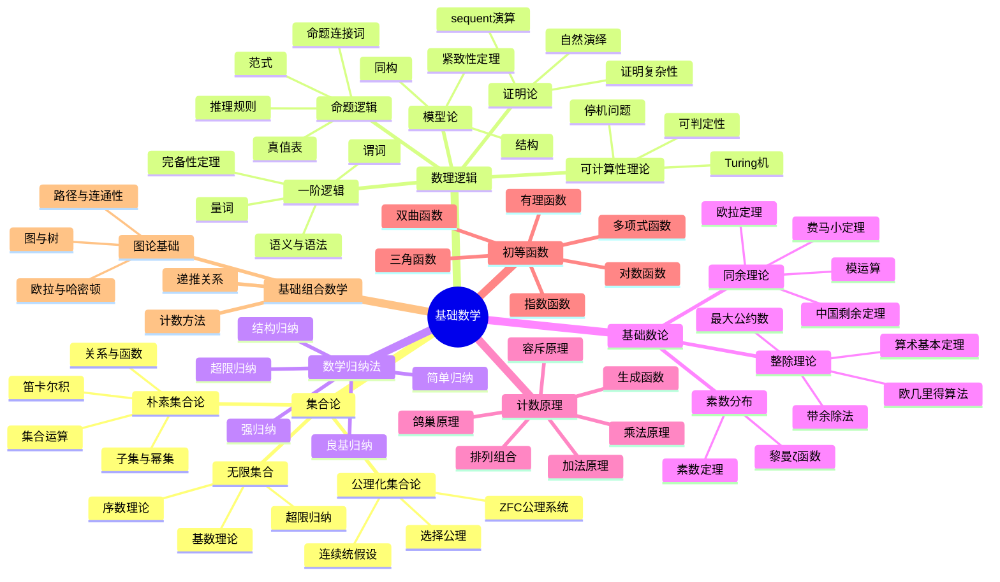
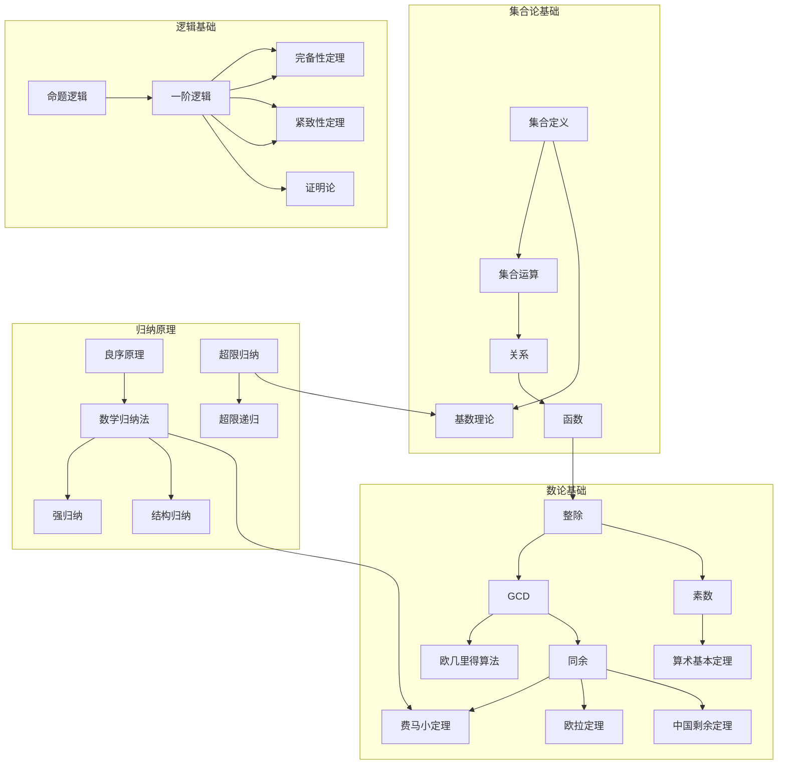
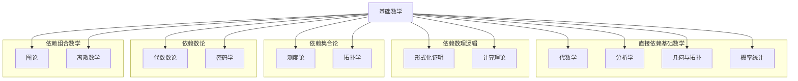
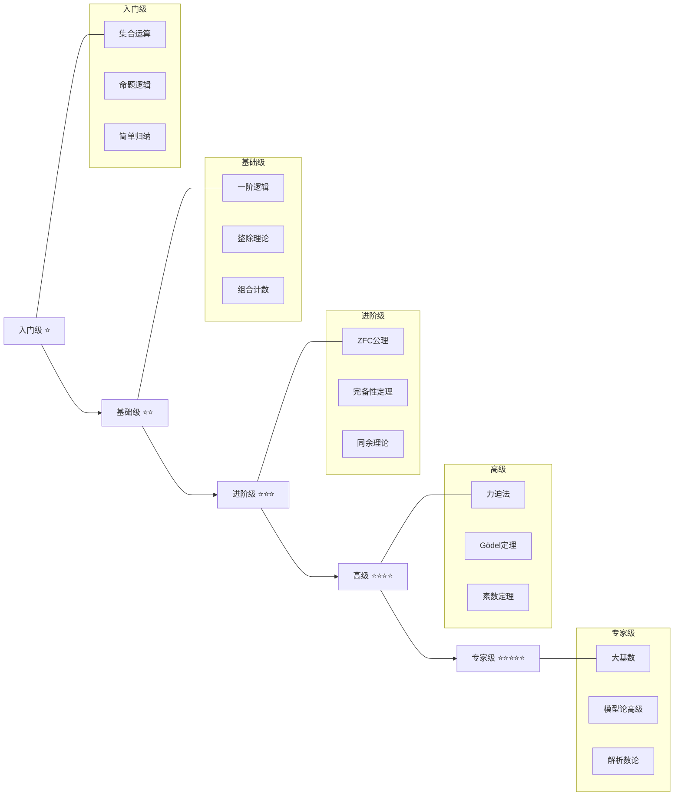
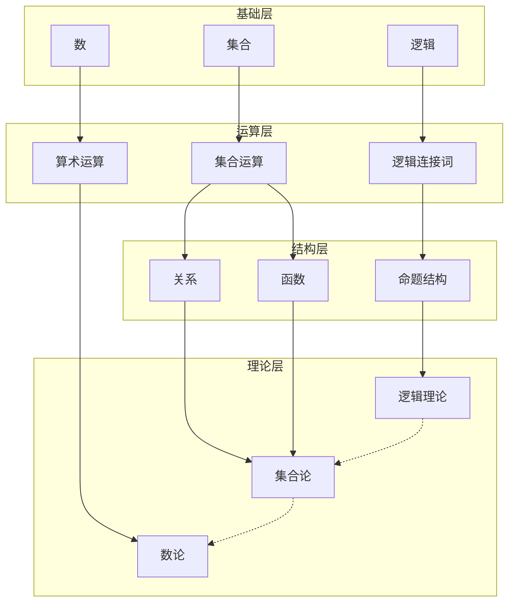

# 基础数学思维导图

> 基础数学是所有数学分支的共同根基，包含集合论、数理逻辑、数学归纳法等核心内容。

---

## 🧠 核心概念层级关系



---

## 🔗 定理依赖关系图



---

## 📍 重要示例分布

### 集合论示例
| 示例名称 | 概念 | 重要性 | 位置 |
|---------|------|-------|------|
| Russell悖论 | 朴素集合论局限性 | ⭐⭐⭐⭐⭐ | 集合论开篇 |
| Cantor对角线论证 | 不可数集合存在性 | ⭐⭐⭐⭐⭐ | 基数理论 |
| 选择公理的等价形式 | Zorn引理、良序定理 | ⭐⭐⭐⭐ | 公理化集合论 |

### 逻辑示例
| 示例名称 | 概念 | 重要性 | 位置 |
|---------|------|-------|------|
| 理发师悖论 | 自指问题 | ⭐⭐⭐⭐ | 命题逻辑 |
| 皮亚诺算术 | 形式系统 | ⭐⭐⭐⭐⭐ | 一阶逻辑 |
| Gödel不完备定理 | 形式系统局限性 | ⭐⭐⭐⭐⭐ | 证明论 |
| 停机问题 | 不可计算性 | ⭐⭐⭐⭐⭐ | 可计算性理论 |

### 数论示例
| 示例名称 | 概念 | 重要性 | 位置 |
|---------|------|-------|------|
| 素数无限性证明 | 反证法经典 | ⭐⭐⭐⭐ | 素数理论 |
| 费马大定理 | 数论里程碑 | ⭐⭐⭐⭐⭐ | 同余理论 |
| RSA加密算法 | 实际应用 | ⭐⭐⭐⭐⭐ | 同余理论 |
| 梅森素数 | 特殊素数 | ⭐⭐⭐ | 素数分布 |

### 归纳法示例
| 示例名称 | 概念 | 重要性 | 位置 |
|---------|------|-------|------|
| 前n项和公式 | 简单归纳 | ⭐⭐⭐ | 归纳法入门 |
| Fibonacci性质 | 强归纳 | ⭐⭐⭐⭐ | 强归纳 |
| 树的性质 | 结构归纳 | ⭐⭐⭐⭐ | 结构归纳 |
| 序数算术 | 超限归纳 | ⭐⭐⭐⭐⭐ | 超限归纳 |

---

## 🔄 与其他分支的连接点



**具体连接说明：**

| 分支 | 连接概念 | 连接方式 |
|-----|---------|---------|
| 代数学 | 函数、关系 | 代数运算的基础 |
| 分析学 | 集合、逻辑 | 极限理论的逻辑基础 |
| 概率统计 | 集合运算 | 事件空间的集合表示 |
| 形式化证明 | 数理逻辑 | 直接继承逻辑系统 |
| 计算理论 | 可计算性 | Turing机理论 |
| 拓扑学 | 无限集、选择公理 | 紧性定理的证明 |
| 代数数论 | 同余理论 | 模运算的推广 |
| 密码学 | RSA算法 | 数论直接应用 |
| 图论 | 组合计数 | 图计数问题 |

---

## 📊 学习难度梯度标记



### 详细难度分级

| 主题 | 入门级 | 基础级 | 进阶级 | 高级 | 专家级 |
|-----|-------|-------|-------|------|-------|
| 集合论 | 朴素集合运算 | 函数与关系 | ZFC公理系统 | 力迫法 | 大基数理论 |
| 数理逻辑 | 命题逻辑 | 一阶逻辑 | 完备性定理 | Gödel定理 | 模型论前沿 |
| 数论 | 整除基础 | 欧几里得算法 | 中国剩余定理 | 素数定理 | 解析数论 |
| 归纳法 | 简单归纳 | 强归纳 | 结构归纳 | 超限归纳 | 递归论 |
| 组合数学 | 基本计数 | 容斥原理 | 生成函数 | 渐近分析 | 极值组合 |

---

## 🎯 学习路径推荐

### 快速入门路径（3个月）
```
集合运算 → 命题逻辑 → 简单归纳 → 整除理论 → 基本计数
```

### 标准学习路径（6个月）
```
集合论（含函数）→ 一阶逻辑 → 数学归纳法 → 数论基础 → 组合数学
```

### 深入研究路径（12个月）
```
公理化集合论 → 证明论/模型论 → 超限归纳 → 解析数论 → 递归论
```

---

## 📚 核心定理清单

### 集合论核心定理
1. **Cantor定理**：任何集合的幂集基数严格大于原集合
2. **Schröder-Bernstein定理**：若|A|≤|B|且|B|≤|A|，则|A|=|B|
3. **Zorn引理**：偏序集中每个链都有上界，则存在极大元

### 逻辑核心定理
1. **完备性定理**：语义有效↔语法可证
2. **紧致性定理**：理论可满足当且仅当每个有限子理论可满足
3. **Gödel不完备定理**：相容的形式系统存在不可判定命题
4. **停机问题不可判定**：不存在判定任意程序是否停机的算法

### 数论核心定理
1. **算术基本定理**：每个大于1的整数可唯一分解为素数乘积
2. **费马小定理**：a^(p-1) ≡ 1 (mod p)，p为素数
3. **欧拉定理**：a^φ(n) ≡ 1 (mod n)，(a,n)=1
4. **中国剩余定理**：同余方程组有唯一解（模乘积）

### 归纳法原理
1. **数学归纳法原理**：P(0)∧∀n(P(n)→P(n+1))→∀nP(n)
2. **良序原理**：自然数集的每个非空子集有最小元
3. **超限归纳**：良序集上的归纳原理

---

## 🔍 概念关系图谱



---

> 💡 **学习提示**：基础数学是整个数学大厦的地基，看似"简单"的概念往往蕴含深刻的数学思想。建议初学者不要急于跳过，而要深入理解每个概念的本质。
