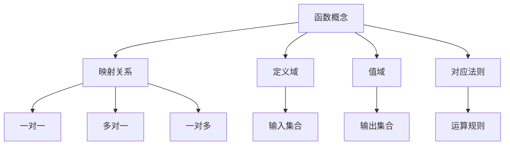
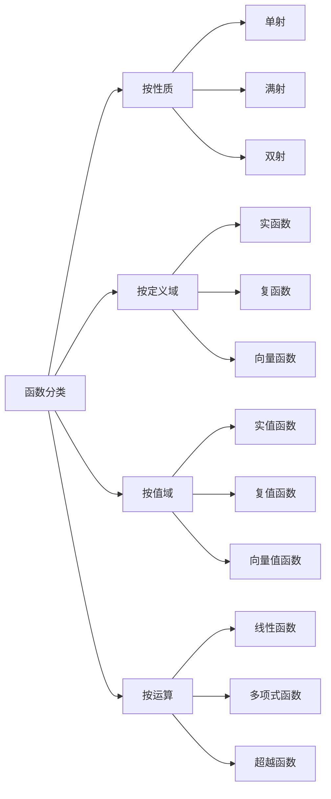
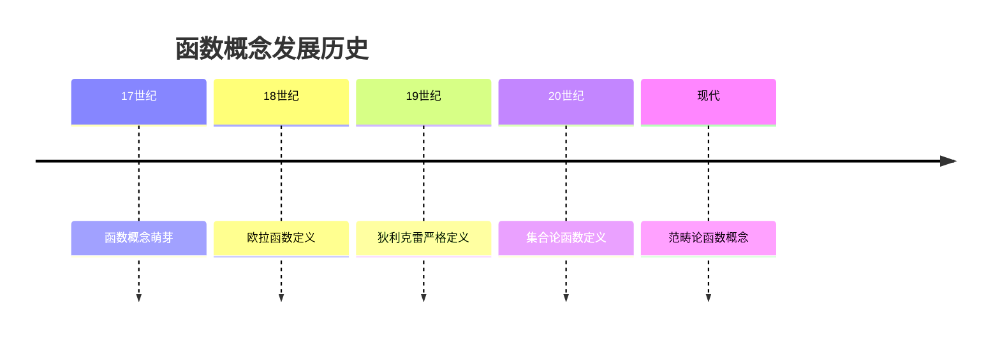
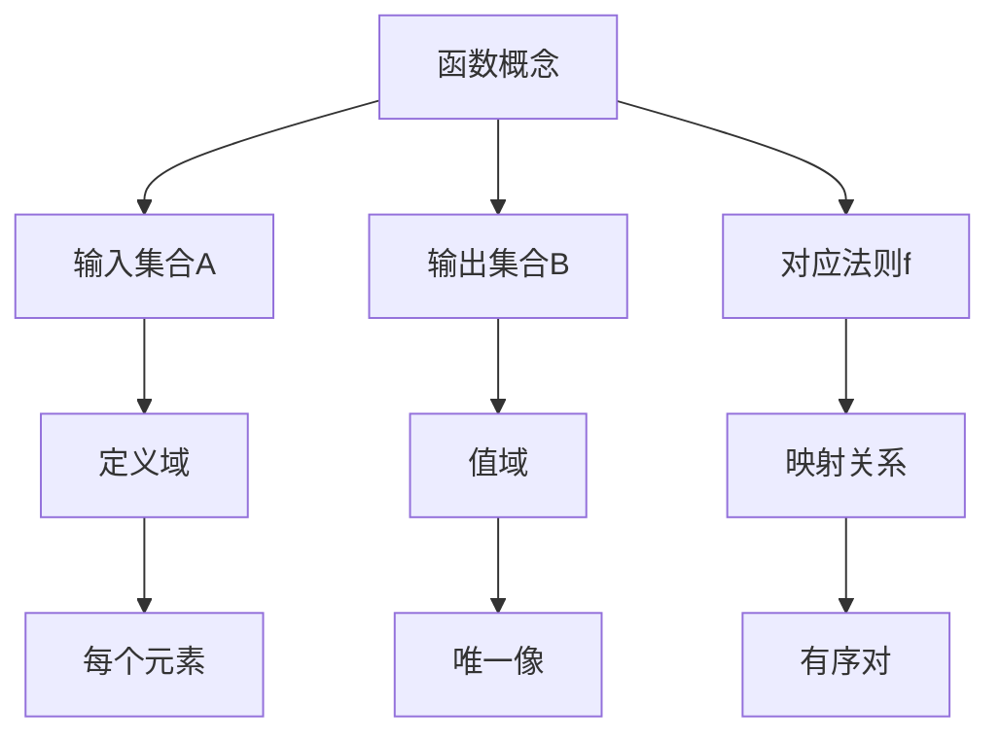
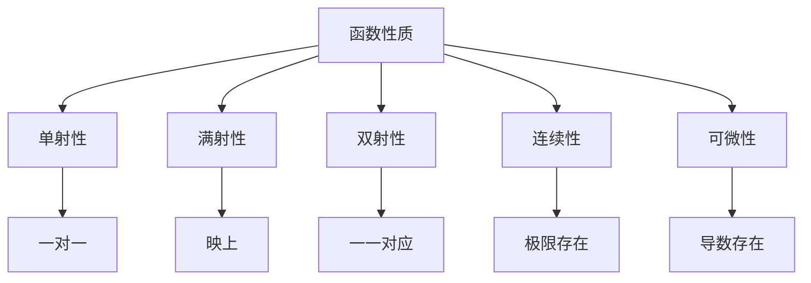
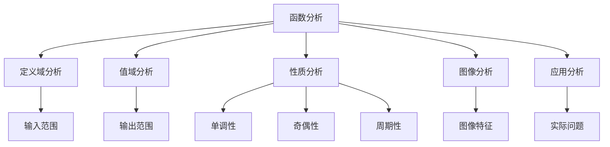
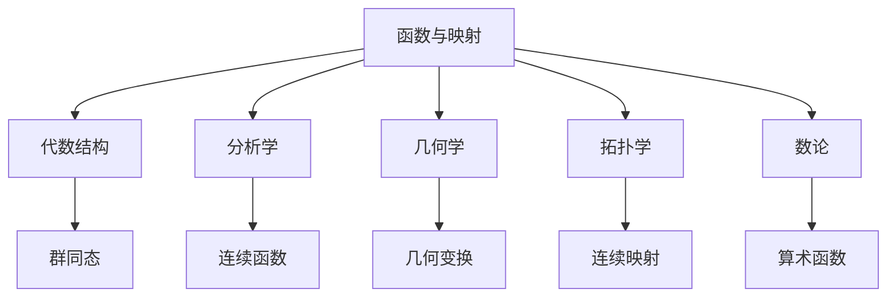

# 3. 函数与映射 / Functions and Mappings

## 目录

- [3. 函数与映射 / Functions and Mappings](#3-函数与映射--functions-and-mappings)
  - [目录](#目录)
  - [3.1 概述 / Overview](#31-概述--overview)
    - [3.1.1 函数概念体系](#311-函数概念体系)
    - [3.1.2 函数分类体系](#312-函数分类体系)
  - [3.2 历史发展 / Historical Development](#32-历史发展--historical-development)
    - [3.2.1 函数概念发展时间线](#321-函数概念发展时间线)
    - [3.2.2 重要人物贡献](#322-重要人物贡献)
    - [3.2.3 理论发展脉络](#323-理论发展脉络)
  - [3.3 基本概念 / Basic Concepts](#33-基本概念--basic-concepts)
    - [3.3.1 函数定义](#331-函数定义)
    - [3.3.2 函数表示方法](#332-函数表示方法)
    - [3.3.3 函数图像](#333-函数图像)
  - [3.4 函数性质 / Function Properties](#34-函数性质--function-properties)
    - [3.4.1 单射性](#341-单射性)
    - [3.4.2 满射性](#342-满射性)
    - [3.4.3 双射性](#343-双射性)
    - [3.4.4 函数性质总结](#344-函数性质总结)
  - [3.5 特殊函数 / Special Functions](#35-特殊函数--special-functions)
    - [3.5.1 初等函数](#351-初等函数)
    - [3.5.2 多项式函数](#352-多项式函数)
    - [3.5.3 有理函数](#353-有理函数)
    - [3.5.4 超越函数](#354-超越函数)
  - [3.6 函数运算 / Function Operations](#36-函数运算--function-operations)
    - [3.6.1 函数复合](#361-函数复合)
    - [3.6.2 函数运算](#362-函数运算)
    - [3.6.3 逆函数](#363-逆函数)
  - [3.7 应用实例 / Application Examples](#37-应用实例--application-examples)
    - [3.7.1 物理学应用](#371-物理学应用)
    - [3.7.2 经济学应用](#372-经济学应用)
    - [3.7.3 计算机科学应用](#373-计算机科学应用)
  - [3.8 思维过程 / Thinking Process](#38-思维过程--thinking-process)
    - [3.8.1 函数分析思维](#381-函数分析思维)
    - [3.8.2 函数构造思维](#382-函数构造思维)
    - [3.8.3 函数应用思维](#383-函数应用思维)
  - [3.9 总结 / Summary](#39-总结--summary)
    - [3.9.1 核心要点](#391-核心要点)
    - [3.9.2 知识关联](#392-知识关联)
    - [3.9.3 进一步学习](#393-进一步学习)

## 3.1 概述 / Overview

函数是数学的核心概念，描述了集合间的对应关系。本文档系统介绍函数的定义、性质、运算和应用。

### 3.1.1 函数概念体系



### 3.1.2 函数分类体系



## 3.2 历史发展 / Historical Development

### 3.2.1 函数概念发展时间线



### 3.2.2 重要人物贡献

```mermaid
graph LR
    A[欧拉] --> B[函数符号f(x)]
    C[狄利克雷] --> D[现代函数定义]
    E[康托尔] --> F[集合论基础]
    G[布尔巴基] --> H[公理化方法]
    I[格罗滕迪克] --> J[范畴论函数]
```

### 3.2.3 理论发展脉络

**阶段 1** (17世纪)：函数概念萌芽

- 几何曲线与代数方程
- 变量与因变量关系
- 函数符号引入

**阶段 2** (18世纪)：欧拉时代

- 函数符号 $f(x)$ 确立
- 初等函数研究
- 微积分与函数结合

**阶段 3** (19世纪)：严格化发展

- 狄利克雷函数定义
- 连续函数理论
- 可积函数研究

**阶段 4** (20世纪)：抽象化发展

- 集合论函数定义
- 泛函分析发展
- 范畴论函数概念

## 3.3 基本概念 / Basic Concepts

### 3.3.1 函数定义

**定义 3.1** (函数 / Function)
设 $A, B$ 为集合，函数 $f: A \rightarrow B$ 是满足以下条件的关系：

- 定义域：$\text{dom}(f) = A$
- 单值性：$(a, b_1) \in f \wedge (a, b_2) \in f \rightarrow b_1 = b_2$

**形式化定义**：
$$f: A \rightarrow B \text{ 是函数 } \Leftrightarrow \forall a \in A, \exists! b \in B, (a, b) \in f$$

**概念图示**：



### 3.3.2 函数表示方法

**方法 1**：解析式
$$f(x) = x^2 + 2x + 1$$

**方法 2**：表格法

| x | f(x) |
|---|------|
| 0 | 1    |
| 1 | 4    |
| 2 | 9    |

**方法 3**：图像法

```mermaid
graph LR
    A[定义域] --> B[对应法则]
    B --> C[值域]
    
    A --> D[输入x]
    B --> E[f(x) = x²]
    C --> F[输出y]
```

**实例 3.1** (函数实例)
$f: \mathbb{R} \rightarrow \mathbb{R}, f(x) = x^2$：

- 定义域：$\mathbb{R}$
- 值域：$[0, \infty)$
- 对应法则：平方运算

### 3.3.3 函数图像

**定义 3.2** (函数图像)
函数 $f: A \rightarrow B$ 的图像是集合：
$$\text{Graph}(f) = \{(a, f(a)) : a \in A\}$$

**实例 3.2** (函数图像)
$f(x) = x^2$ 的图像：

- 抛物线形状
- 对称轴：$x = 0$
- 顶点：$(0, 0)$

## 3.4 函数性质 / Function Properties

### 3.4.1 单射性

**定义 3.3** (单射 / Injective)
函数 $f: A \rightarrow B$ 是单射，当且仅当：
$$\forall x_1, x_2 \in A, f(x_1) = f(x_2) \rightarrow x_1 = x_2$$

**实例 3.3** (单射函数)
$f: \mathbb{R} \rightarrow \mathbb{R}, f(x) = 2x + 1$：

- 是单射函数
- 不同输入对应不同输出

**反例 3.1** (非单射函数)
$f: \mathbb{R} \rightarrow \mathbb{R}, f(x) = x^2$：

- 不是单射函数
- $f(2) = f(-2) = 4$

### 3.4.2 满射性

**定义 3.4** (满射 / Surjective)
函数 $f: A \rightarrow B$ 是满射，当且仅当：
$$\forall b \in B, \exists a \in A, f(a) = b$$

**实例 3.4** (满射函数)
$f: \mathbb{R} \rightarrow \mathbb{R}, f(x) = x^3$：

- 是满射函数
- 值域等于陪域

**反例 3.2** (非满射函数)
$f: \mathbb{R} \rightarrow \mathbb{R}, f(x) = x^2$：

- 不是满射函数
- 负实数不在值域中

### 3.4.3 双射性

**定义 3.5** (双射 / Bijective)
函数 $f: A \rightarrow B$ 是双射，当且仅当它既是单射又是满射。

**实例 3.5** (双射函数)
$f: \mathbb{R} \rightarrow \mathbb{R}, f(x) = x^3$：

- 是双射函数
- 存在逆函数 $f^{-1}(x) = \sqrt[3]{x}$

### 3.4.4 函数性质总结



## 3.5 特殊函数 / Special Functions

### 3.5.1 初等函数

**定义 3.6** (初等函数)
初等函数是由基本初等函数经过有限次四则运算和复合运算得到的函数。

**基本初等函数**：

1. **幂函数**：$f(x) = x^n$
2. **指数函数**：$f(x) = e^x$
3. **对数函数**：$f(x) = \ln x$
4. **三角函数**：$\sin x, \cos x, \tan x$
5. **反三角函数**：$\arcsin x, \arccos x, \arctan x$

**实例 3.6** (初等函数)
$f(x) = e^{x^2} \sin(x)$：

- 由指数函数、幂函数、三角函数复合而成
- 是初等函数

### 3.5.2 多项式函数

**定义 3.7** (多项式函数)
多项式函数形如：
$$P(x) = a_n x^n + a_{n-1} x^{n-1} + \cdots + a_1 x + a_0$$

**实例 3.7** (多项式函数)
$P(x) = 2x^3 - 3x^2 + 4x - 1$：

- 三次多项式
- 系数：$a_3 = 2, a_2 = -3, a_1 = 4, a_0 = -1$

### 3.5.3 有理函数

**定义 3.8** (有理函数)
有理函数是两个多项式的商：
$$R(x) = \frac{P(x)}{Q(x)}$$

**实例 3.8** (有理函数)
$R(x) = \frac{x^2 + 1}{x - 2}$：

- 分子：$P(x) = x^2 + 1$
- 分母：$Q(x) = x - 2$
- 定义域：$\mathbb{R} \setminus \{2\}$

### 3.5.4 超越函数

**定义 3.9** (超越函数)
超越函数不是代数函数的函数。

**实例 3.9** (超越函数)

- 指数函数：$f(x) = e^x$
- 对数函数：$f(x) = \ln x$
- 三角函数：$f(x) = \sin x$

## 3.6 函数运算 / Function Operations

### 3.6.1 函数复合

**定义 3.10** (函数复合)
设 $f: A \rightarrow B, g: B \rightarrow C$，则复合函数 $g \circ f: A \rightarrow C$ 定义为：
$$(g \circ f)(x) = g(f(x))$$

**实例 3.10** (函数复合)
设 $f(x) = x^2, g(x) = x + 1$：

- $(g \circ f)(x) = g(f(x)) = g(x^2) = x^2 + 1$
- $(f \circ g)(x) = f(g(x)) = f(x + 1) = (x + 1)^2$

### 3.6.2 函数运算

**定义 3.11** (函数运算)
设 $f, g: A \rightarrow \mathbb{R}$，则：

- $(f + g)(x) = f(x) + g(x)$
- $(f - g)(x) = f(x) - g(x)$
- $(f \cdot g)(x) = f(x) \cdot g(x)$
- $(\frac{f}{g})(x) = \frac{f(x)}{g(x)}$ (当 $g(x) \neq 0$)

**实例 3.11** (函数运算)
设 $f(x) = x^2, g(x) = x + 1$：

- $(f + g)(x) = x^2 + x + 1$
- $(f \cdot g)(x) = x^2(x + 1) = x^3 + x^2$

### 3.6.3 逆函数

**定义 3.12** (逆函数)
设 $f: A \rightarrow B$ 是双射函数，则其逆函数 $f^{-1}: B \rightarrow A$ 满足：
$$f^{-1}(f(x)) = x, \quad f(f^{-1}(y)) = y$$

**实例 3.12** (逆函数)
$f(x) = 2x + 1$ 的逆函数：

- $f^{-1}(x) = \frac{x - 1}{2}$
- 验证：$f^{-1}(f(x)) = f^{-1}(2x + 1) = \frac{(2x + 1) - 1}{2} = x$

## 3.7 应用实例 / Application Examples

### 3.7.1 物理学应用

**实例 3.13** (运动学函数)
质点的位置函数：

- $s(t) = s_0 + v_0 t + \frac{1}{2} a t^2$
- 速度函数：$v(t) = \frac{ds}{dt} = v_0 + a t$
- 加速度函数：$a(t) = \frac{dv}{dt} = a$

**实例 3.14** (波动函数)
简谐波函数：

- $y(x, t) = A \sin(kx - \omega t + \phi)$
- $A$：振幅
- $k$：波数
- $\omega$：角频率
- $\phi$：初相位

### 3.7.2 经济学应用

**实例 3.15** (需求函数)
商品需求函数：

- $Q = f(P, I, P_s)$
- $Q$：需求量
- $P$：价格
- $I$：收入
- $P_s$：替代品价格

**实例 3.16** (生产函数)
柯布-道格拉斯生产函数：

- $Q = A L^\alpha K^\beta$
- $Q$：产量
- $L$：劳动投入
- $K$：资本投入
- $A, \alpha, \beta$：参数

### 3.7.3 计算机科学应用

**实例 3.17** (哈希函数)
哈希函数 $h: U \rightarrow \{0, 1, \ldots, m-1\}$：

- 将任意输入映射到固定范围
- 用于数据存储和检索
- 理想情况下是均匀分布

**实例 3.18** (激活函数)
神经网络激活函数：

- Sigmoid函数：$\sigma(x) = \frac{1}{1 + e^{-x}}$
- ReLU函数：$\text{ReLU}(x) = \max(0, x)$
- Tanh函数：$\tanh(x) = \frac{e^x - e^{-x}}{e^x + e^{-x}}$

## 3.8 思维过程 / Thinking Process

### 3.8.1 函数分析思维



### 3.8.2 函数构造思维

**函数构造步骤**：

1. **明确需求**：确定函数的输入输出
2. **选择类型**：选择合适的函数类型
3. **确定参数**：根据条件确定参数
4. **验证性质**：检查函数是否满足要求
5. **优化改进**：根据需要优化函数

### 3.8.3 函数应用思维

**函数应用过程**：

1. **问题建模**：将实际问题转化为函数关系
2. **函数选择**：选择合适的函数类型
3. **参数确定**：根据数据确定函数参数
4. **结果分析**：分析函数结果的意义
5. **验证改进**：验证结果的合理性

## 3.9 总结 / Summary

### 3.9.1 核心要点

- 函数是描述集合间对应关系的数学工具
- 函数的性质决定了其应用范围
- 函数运算提供了构造复杂函数的方法
- 函数在各个领域都有重要应用

### 3.9.2 知识关联



### 3.9.3 进一步学习

- 深入学习泛函分析
- 研究函数空间理论
- 探索微分方程中的函数
- 学习复变函数理论

---

*本文档展示了函数与映射的多表征方式，包括符号表征、图表表征、实例表征、历史发展表征、应用场景表征和思维过程表征，为深入理解函数概念提供了全面的视角。*
