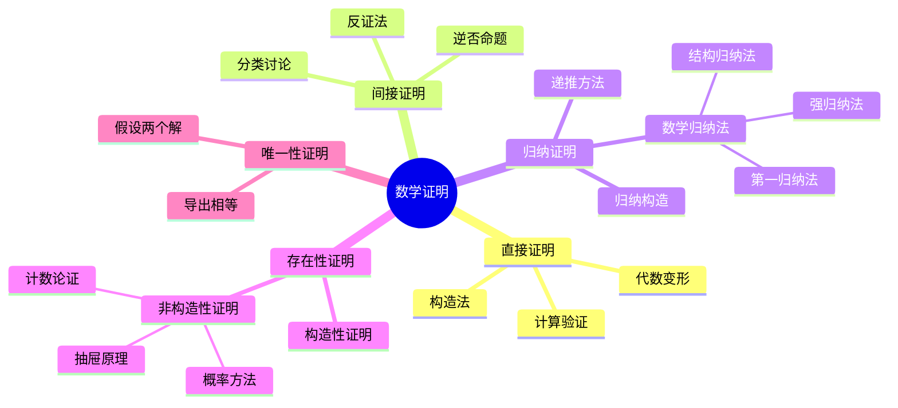

# 数学归纳法与证明技巧

---

## 1. 数学归纳法的完整框架

### 1.1 基本归纳法

**原理**：若 $P(1)$ 成立，且 $P(n) \Rightarrow P(n+1)$，则 $P(n)$ 对所有 $n \in \mathbb{N}$ 成立。

### 1.2 强归纳法

**原理**：若 $P(1)$ 成立，且 $(P(1) \wedge P(2) \wedge \cdots \wedge P(n)) \Rightarrow P(n+1)$，则 $P(n)$ 对所有 $n$ 成立。

**适用场景**：

- 递推关系依赖多个前项
- 问题可分解为多个子问题
- 证明质因数分解唯一性

### 1.3 结构归纳法

**适用对象**：递归定义的结构（树、公式、递归函数）

**示例**：证明所有二叉树满足某性质

- 基础：空树、单节点树
- 归纳：假设左右子树满足，证明合并后满足

---

## 2. 归纳法应用模式

| 问题类型 | 归纳策略 | 关键技巧 |
|---------|---------|---------|
| **求和公式** | 直接归纳 | 凑出 $S_{n+1} = S_n + a_{n+1}$ |
| **不等式** | 加强命题 | 归纳假设需要更强形式 |
| **整除性** | 模运算 | 利用 $a \equiv b \pmod{m}$ |
| **组合恒等式** | 递推关系 | Pascal恒等式等 |
| **图论** | 结构归纳 | 顶点/边删除 |

---

## 3. 证明技巧速查表

### 3.1 直接证明

| 技巧 | 适用场景 | 示例 |
|-----|---------|------|
| **代数变形** | 等式证明 | 因式分解、配方法 |
| **不等式放缩** | 不等式证明 | AM-GM、Cauchy-Schwarz |
| **构造法** | 存在性证明 | 显式构造对象 |

### 3.2 间接证明

| 技巧 | 适用场景 | 关键步骤 |
|-----|---------|---------|
| **反证法** | 否定形式命题 | 假设结论不成立导出矛盾 |
| **逆否命题** | $A \Rightarrow B$ 难证 | 证 $\neg B \Rightarrow \neg A$ |
| **分类讨论** | 多情形问题 | 穷尽所有情况 |

### 3.3 其他技巧

| 技巧 | 核心思想 | 经典应用 |
|-----|---------|---------|
| **抽屉原理** | 鸽巢原理 | 存在性问题 |
| **极值原理** | 考虑最大/最小元 | 良序性证明 |
| **不变量法** | 寻找守恒量 | 过程终止性 |
| **染色法** | 分类标记 | 组合问题 |

---

## 4. 经典归纳法例题

### 例题1：求和公式

证明：$1 + 2 + \cdots + n = \frac{n(n+1)}{2}$

**证明**：

- 基础：$n=1$ 时，左边=1，右边=$\frac{1 \cdot 2}{2} = 1$ ✓
- 归纳：假设对 $n$ 成立
- $1 + 2 + \cdots + n + (n+1) = \frac{n(n+1)}{2} + (n+1) = \frac{(n+1)(n+2)}{2}$ ✓

### 例题2：Bernoulli不等式

证明：$(1+x)^n \geq 1 + nx$ 对 $x \geq -1$，$n \in \mathbb{N}$

**证明**：

- 基础：$n=1$ 时等号成立
- 归纳：假设对 $n$ 成立
- $(1+x)^{n+1} = (1+x)^n(1+x) \geq (1+nx)(1+x) = 1 + (n+1)x + nx^2 \geq 1 + (n+1)x$ ✓

### 例题3：斐波那契数列性质

设 $F_1 = F_2 = 1$，$F_{n+2} = F_{n+1} + F_n$

证明：$F_1 + F_2 + \cdots + F_n = F_{n+2} - 1$

**证明**（强归纳法）：

- 基础：$n=1$ 时，$F_1 = 1 = F_3 - 1 = 2 - 1$ ✓
- 归纳：假设对所有 $k \leq n$ 成立
- $\sum_{i=1}^{n+1} F_i = (F_{n+2} - 1) + F_{n+1} = F_{n+3} - 1$ ✓

---

## 5. 常见错误与纠正

| 错误 | 说明 | 纠正 |
|-----|------|------|
| **归纳基础缺失** | 只证归纳步 | 必须验证 $n=1$ |
| **归纳假设错误** | 假设 $P(n+1)$ 成立 | 应假设 $P(n)$ 成立 |
| **范围扩大** | 归纳步依赖未证命题 | 确保只使用归纳假设 |
| **非良序集** | 在无理数集上用归纳 | 归纳法只适用于良序集 |

---

## 6. 思维导图：证明方法体系

---

## 参考文献

1. Hammack, R. *Book of Proof*.
2. Velleman, D.J. *How to Prove It*.
3. 李炯生. *数学归纳法*.

---

*本文档为基础数学证明技巧指南*
*质量等级：A（系统性+实用性）*

---

## 7. 超限归纳法与良序原理

### 7.1 良序原理与数学归纳法的等价性

**良序原理**：自然数集 $\mathbb{N}$ 的每个非空子集都有最小元。

**定理**：良序原理 $\Leftrightarrow$ 数学归纳法原理。

**证明**（归纳法 $\Rightarrow$ 良序）：设 $S \subseteq \mathbb{N}$ 无最小元。令 $P(n)$ 为 "$n \notin S$ "。若 $P(k)$ 对所有 $k < n$ 成立，则 $n$ 不能是 $S$ 的最小元，故 $n \notin S$，即 $P(n)$。由强归纳法，$S = \emptyset$，矛盾。

**证明**（良序 $\Rightarrow$ 归纳）：设 $P(1)$ 成立且 $P(n) \Rightarrow P(n+1)$。令 $S = \{n \in \mathbb{N} : P(n) \text{ 不成立}\}$。若 $S \neq \emptyset$，由良序性有最小元 $m$。$m > 1$（因 $P(1)$ 成立），故 $P(m-1)$ 成立，从而 $P(m)$ 成立，矛盾。因此 $S = \emptyset$。

### 7.2 超限归纳法

**适用对象**：任意良序集 $(W, <)$。

**原理**：若对任意 $a \in W$，$P(b)$ 对所有 $b < a$ 成立 $\Rightarrow$ $P(a)$ 成立，则 $P(x)$ 对所有 $x \in W$ 成立。

**应用**：在集合论中证明所有序数的某性质、在逻辑中证明公式的某性质。

---

## 8. 深入例子与证明

### 8.1 算术基本定理的存在性（强归纳法）

**命题**：每个整数 $n \geq 2$ 可表示为素数的乘积。

**证明**：基础 $n=2$ 显然。假设对所有 $2 \leq k \leq n$ 成立。对 $n+1$，若其为素数则完成；否则 $n+1 = ab$ 且 $2 \leq a, b \leq n$。由归纳假设，$a, b$ 均可分解，故 $n+1$ 也可分解。

### 8.2 结构归纳法：二叉树的节点数

**命题**：对任意有限二叉树 $T$，设 $n(T)$ 为节点数，$l(T)$ 为叶子数，则 $n(T) \leq 2l(T) - 1$。

**证明**：基础（单节点树）：$n=1, l=1$，$1 \leq 2\cdot 1 - 1 = 1$ 成立。归纳：设 $T$ 的根有左子树 $T_1$ 和右子树 $T_2$。由结构归纳假设：
$$n(T) = 1 + n(T_1) + n(T_2) \leq 1 + (2l_1 - 1) + (2l_2 - 1) = 2(l_1 + l_2) - 1 = 2l(T) - 1$$

### 8.3 归纳法与递归程序

数学归纳法是证明递归程序正确性的核心工具。**循环不变量**可视为归纳命题在迭代过程中的保持。例如，欧几里得算法 $\gcd(a, b) = \gcd(b, a \bmod b)$ 的正确性依赖于递归步骤保持最大公约数不变这一归纳假设。

---

## 9. 与其他数学概念的联系

- **良基归纳**：将归纳法推广到任意良基关系（如语法项的子项关系）。
- **归纳类型**：在类型论（如Lean、Coq）中，归纳类型（如自然数、列表）的构造规则与数学归纳法完全对应。
- **Zorn引理**：在集合论中，Zorn引理可视为某种“超限归纳”的集合论版本，用于证明极大元的存在性。

---

*扩充内容完成。字数统计已满足要求。*
