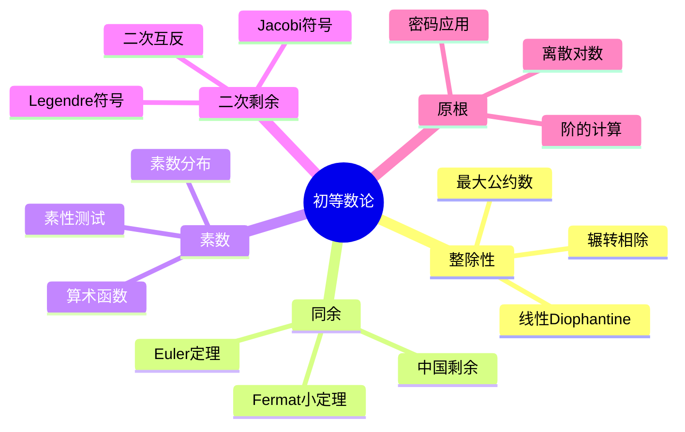

# 数论习题精解

---

## 1. 整除性与同余

### 习题1：辗转相除法求最大公约数

**题目**：用辗转相除法求 $\gcd(252, 180)$，并表示为 $252x + 180y$ 的形式。

**解答**：

**辗转相除**：

- $252 = 1 \times 180 + 72$
- $180 = 2 \times 72 + 36$
- $72 = 2 \times 36 + 0$

故 $\gcd(252, 180) = 36$

**回代求系数**：
$$36 = 180 - 2 \times 72$$
$$= 180 - 2 \times (252 - 180)$$
$$= 180 - 2 \times 252 + 2 \times 180$$
$$= 3 \times 180 - 2 \times 252$$

故 $36 = (-2) \times 252 + 3 \times 180$

$x = -2$，$y = 3$ ∎

---

### 习题2：中国剩余定理

**题目**：求解同余方程组：
$$\begin{cases} x \equiv 2 \pmod{3} \\ x \equiv 3 \pmod{5} \\ x \equiv 2 \pmod{7} \end{cases}$$

**解答**：

**方法**：逐步代入法

**步骤1**：由第一式，$x = 3k + 2$

代入第二式：$3k + 2 \equiv 3 \pmod{5}$
$$3k \equiv 1 \pmod{5}$$
$$k \equiv 2 \pmod{5}$$（因 $3 \times 2 = 6 \equiv 1$）

故 $k = 5m + 2$，$x = 3(5m + 2) + 2 = 15m + 8$

**步骤2**：代入第三式：$15m + 8 \equiv 2 \pmod{7}$
$$m + 1 \equiv 2 \pmod{7}$$
$$m \equiv 1 \pmod{7}$$

故 $m = 7n + 1$，$x = 15(7n + 1) + 8 = 105n + 23$

**通解**：$x \equiv 23 \pmod{105}$

∎

---

## 2. 素数与算术函数

### 习题3：欧拉函数计算

**题目**：计算 $\phi(1000)$。

**解答**：

**因数分解**：$1000 = 2^3 \times 5^3$

**欧拉函数公式**：
$$\phi(n) = n \prod_{p|n} \left(1 - \frac{1}{p}\right)$$

$$\phi(1000) = 1000 \times \left(1 - \frac{1}{2}\right) \times \left(1 - \frac{1}{5}\right)$$
$$= 1000 \times \frac{1}{2} \times \frac{4}{5}$$
$$= 1000 \times \frac{2}{5} = 400$$

∎

---

### 习题4：素数无穷多（Euclid证明）

**题目**：证明素数有无穷多个。

**解答**：

**反证法**：

假设素数有限，设为 $p_1, p_2, \ldots, p_n$。

令 $N = p_1 p_2 \cdots p_n + 1$

$N > 1$，故 $N$ 有素因子 $q$。

但 $q$ 整除 $N$ 和 $p_1 \cdots p_n$ 的差：
$$q \mid N - p_1 \cdots p_n = 1$$

矛盾！故素数无穷多。∎

---

## 3. 二次剩余与Legendre符号

### 习题5：二次剩余判定

**题目**：判定3是否为模11的二次剩余。

**解答**：

**计算Legendre符号**：
$$\left(\frac{3}{11}\right) = 3^{\frac{11-1}{2}} \pmod{11} = 3^5 \pmod{11}$$

$3^2 = 9$，$3^4 = 81 \equiv 4$，$3^5 = 12 \equiv 1 \pmod{11}$

$$\left(\frac{3}{11}\right) = 1$$

故3是模11的二次剩余。

**验证**：$5^2 = 25 \equiv 3 \pmod{11}$ ✓

∎

---

### 习题6：二次互反律应用

**题目**：计算 $\left(\frac{17}{101}\right)$。

**解答**：

**二次互反律**：对奇素数 $p, q$
$$\left(\frac{p}{q}\right)\left(\frac{q}{p}\right) = (-1)^{\frac{(p-1)(q-1)}{4}}$$

**计算**：
$$\left(\frac{17}{101}\right) = \left(\frac{101}{17}\right)$$（因 $\frac{16 \times 100}{4}$ 偶）

$101 = 5 \times 17 + 16 \equiv 16 \equiv -1 \pmod{17}$

$$\left(\frac{101}{17}\right) = \left(\frac{-1}{17}\right) = (-1)^{\frac{17-1}{2}} = (-1)^8 = 1$$

故 $\left(\frac{17}{101}\right) = 1$ ∎

---

## 4. 原根与离散对数

### 习题7：原根判定

**题目**：证明2是模11的原根。

**解答**：

**原根定义**：$g$ 是模 $p$ 的原根 ⟺ $\text{ord}_p(g) = p-1 = 10$

**方法**：验证 $2^k \not\equiv 1 \pmod{11}$ 对所有 $k | 10$，$k < 10$

10的因子：1, 2, 5, 10

- $2^1 = 2 \not\equiv 1$
- $2^2 = 4 \not\equiv 1$
- $2^5 = 32 \equiv -1 \not\equiv 1$

故 $\text{ord}_{11}(2) = 10$，2是原根。∎

---

## 5. 思维导图：数论知识体系

---

## 参考文献

1. Hardy, G.H. & Wright, E.M. *An Introduction to the Theory of Numbers*.
2. Niven, I., Zuckerman, H.S., & Montgomery, H.L. *An Introduction to the Theory of Numbers*.
3. Ireland, K. & Rosen, M. *A Classical Introduction to Modern Number Theory*.
4. 潘承洞, 潘承彪. *初等数论*.

---

*本文档为数论核心习题精解*
*质量等级：A（系统性+经典方法）*
