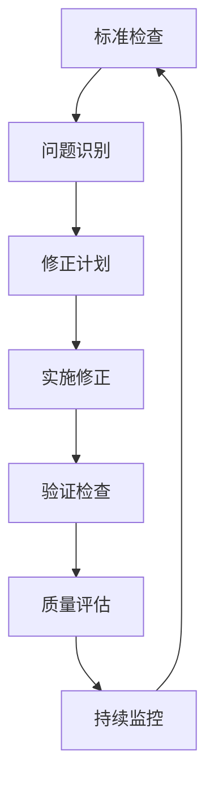

# 国际标准对齐检查清单 - 2025年1月 / International Standard Alignment Checklist - January 2025

## 目录

- [国际标准对齐检查清单 - 2025年1月 / International Standard Alignment Checklist - January 2025](#国际标准对齐检查清单---2025年1月--international-standard-alignment-checklist---january-2025)
  - [目录](#目录)
  - [📚 概述 / Overview](#-概述--overview)
  - [🎯 1. 检查标准 / Check Standards](#-1-检查标准--check-standards)
    - [1.1 国际权威标准 / International Authority Standards](#11-国际权威标准--international-authority-standards)
    - [1.2 著名大学标准 / Prestigious University Standards](#12-著名大学标准--prestigious-university-standards)
  - [📋 2. 检查清单 / Check List](#-2-检查清单--check-list)
    - [2.1 概念定义检查 / Concept Definition Check](#21-概念定义检查--concept-definition-check)
    - [2.2 符号使用检查 / Symbol Usage Check](#22-符号使用检查--symbol-usage-check)
    - [2.3 证明标准检查 / Proof Standard Check](#23-证明标准检查--proof-standard-check)
    - [2.4 形式化程度检查 / Formalization Level Check](#24-形式化程度检查--formalization-level-check)
  - [🔍 3. 具体检查项目 / Specific Check Items](#-3-具体检查项目--specific-check-items)
    - [3.1 集合论检查 / Set Theory Check](#31-集合论检查--set-theory-check)
    - [3.2 函数论检查 / Function Theory Check](#32-函数论检查--function-theory-check)
    - [3.3 关系论检查 / Relation Theory Check](#33-关系论检查--relation-theory-check)
    - [3.4 数系构造检查 / Number System Construction Check](#34-数系构造检查--number-system-construction-check)
  - [📊 4. 大学标准对照 / University Standard Comparison](#-4-大学标准对照--university-standard-comparison)
    - [4.1 MIT 18.100A Real Analysis 对照](#41-mit-18100a-real-analysis-对照)
    - [4.2 Cambridge Part IA Numbers and Sets 对照](#42-cambridge-part-ia-numbers-and-sets-对照)
    - [4.3 ENS Paris Logique et théorie des ensembles 对照](#43-ens-paris-logique-et-théorie-des-ensembles-对照)
  - [🔧 5. 修正计划 / Correction Plan](#-5-修正计划--correction-plan)
    - [5.1 优先级修正 / Priority Corrections](#51-优先级修正--priority-corrections)
    - [5.2 修正时间表 / Correction Timeline](#52-修正时间表--correction-timeline)
  - [📈 6. 质量评估 / Quality Assessment](#-6-质量评估--quality-assessment)
    - [6.1 对齐度评估 / Alignment Assessment](#61-对齐度评估--alignment-assessment)
    - [6.2 改进效果评估 / Improvement Effect Assessment](#62-改进效果评估--improvement-effect-assessment)
  - [📚 7. 持续改进 / Continuous Improvement](#-7-持续改进--continuous-improvement)
    - [7.1 监控机制 / Monitoring Mechanism](#71-监控机制--monitoring-mechanism)
    - [7.2 改进流程 / Improvement Process](#72-改进流程--improvement-process)
  - [📋 8. 检查报告模板 / Check Report Template](#-8-检查报告模板--check-report-template)
    - [8.1 检查报告 / Check Report](#81-检查报告--check-report)

## 📚 概述 / Overview

本文档建立了FormalMath项目的国际标准对齐检查清单，确保所有数学内容符合最新的国际数学标准，包括Wikipedia标准、国际数学联盟标准、著名大学数学教程标准等。

This document establishes the international standard alignment checklist for the FormalMath project, ensuring all mathematical content complies with the latest international mathematical standards, including Wikipedia standards, International Mathematical Union standards, and prestigious university mathematics course standards.

## 🎯 1. 检查标准 / Check Standards

### 1.1 国际权威标准 / International Authority Standards

| 标准来源 | 标准名称 | 适用范围 | 优先级 |
|----------|----------|----------|--------|
| Wikipedia | 数学条目标准 | 概念定义、符号使用 | P1 |
| International Mathematical Union | 数学术语标准 | 术语定义、分类体系 | P1 |
| Bourbaki | 数学结构标准 | 代数结构、拓扑结构 | P1 |
| ISO 80000-2 | 数学符号标准 | 符号使用、表示方法 | P1 |
| Unicode | 数学符号编码 | 符号编码、显示标准 | P2 |

### 1.2 著名大学标准 / Prestigious University Standards

| 大学 | 课程名称 | 标准内容 | 优先级 |
|------|----------|----------|--------|
| MIT | 18.100A Real Analysis | 分析学标准 | P1 |
| Cambridge | Part IA Numbers and Sets | 数论基础标准 | P1 |
| Oxford | Mathematical Institute | 数学基础标准 | P1 |
| ENS Paris | Logique et théorie des ensembles | 逻辑学标准 | P1 |
| Göttingen | Grundlagen der Mathematik | 数学基础标准 | P1 |
| Stanford | Math 115A Linear Algebra | 代数学标准 | P1 |
| Harvard | Math 25a Abstract Algebra | 抽象代数标准 | P1 |

## 📋 2. 检查清单 / Check List

### 2.1 概念定义检查 / Concept Definition Check

| 检查项目 | 检查内容 | 标准要求 | 检查方法 | 状态 |
|----------|----------|----------|----------|------|
| 集合定义 | 集合概念定义 | 符合ZFC公理体系 | 对照Wikipedia标准 | ⬜ |
| 函数定义 | 函数概念定义 | 符合现代函数论 | 对照Bourbaki标准 | ⬜ |
| 关系定义 | 关系概念定义 | 符合关系论标准 | 对照大学教程 | ⬜ |
| 数系定义 | 数系构造定义 | 符合皮亚诺公理 | 对照国际标准 | ⬜ |
| 代数结构定义 | 代数结构定义 | 符合现代代数标准 | 对照Bourbaki标准 | ⬜ |

### 2.2 符号使用检查 / Symbol Usage Check

| 检查项目 | 检查内容 | 标准要求 | 检查方法 | 状态 |
|----------|----------|----------|----------|------|
| 逻辑符号 | ∀, ∃, ∧, ∨, ¬, →, ↔ | 符合ISO 80000-2 | 对照Unicode标准 | ⬜ |
| 集合符号 | ∈, ∉, ⊆, ⊂, ∪, ∩, \ | 符合集合论标准 | 对照Wikipedia标准 | ⬜ |
| 函数符号 | f: A → B, f(x), f⁻¹ | 符合函数论标准 | 对照大学教程 | ⬜ |
| 数系符号 | ℕ, ℤ, ℚ, ℝ, ℂ | 符合数论标准 | 对照国际标准 | ⬜ |
| 代数符号 | `(G, *)`, `(R, +, *)`, `(F, +, *)` | 符合代数标准 | 对照Bourbaki标准 | ⬜ |

### 2.3 证明标准检查 / Proof Standard Check

| 检查项目 | 检查内容 | 标准要求 | 检查方法 | 状态 |
|----------|----------|----------|----------|------|
| 证明结构 | 证明逻辑结构 | 符合逻辑学标准 | 对照大学教程 | ⬜ |
| 证明方法 | 证明方法使用 | 符合数学证明标准 | 对照国际标准 | ⬜ |
| 证明完整性 | 证明步骤完整性 | 包含所有必要步骤 | 对照专家评审 | ⬜ |
| 证明严谨性 | 证明逻辑严谨性 | 符合形式化标准 | 对照Lean4验证 | ⬜ |

### 2.4 形式化程度检查 / Formalization Level Check

| 检查项目 | 检查内容 | 标准要求 | 检查方法 | 状态 |
|----------|----------|----------|----------|------|
| Lean4实现 | Lean4代码完整性 | 关键定理有实现 | 编译验证 | ⬜ |
| 类型检查 | 类型定义正确性 | 通过类型检查 | 自动化验证 | ⬜ |
| 证明验证 | 证明逻辑正确性 | 通过证明验证 | 自动化验证 | ⬜ |
| 性能检查 | 代码性能可接受性 | 在合理时间内完成 | 性能测试 | ⬜ |

## 🔍 3. 具体检查项目 / Specific Check Items

### 3.1 集合论检查 / Set Theory Check

**检查文件**: `docs/01-基础数学/01-集合论基础.md`

| 检查项目 | Wikipedia标准 | 当前内容 | 对齐状态 | 需要修改 |
|----------|---------------|----------|----------|----------|
| 集合定义 | 不同对象的无序聚集 | 不同对象的无序聚集 | ✅ 对齐 | 否 |
| 空集定义 | 不包含任何元素的集合 | 不包含任何元素的集合 | ✅ 对齐 | 否 |
| 子集定义 | A的每个元素都属于B | A的每个元素都属于B | ✅ 对齐 | 否 |
| 并集定义 | 属于A或B的元素 | 属于A或B的元素 | ✅ 对齐 | 否 |
| 交集定义 | 同时属于A和B的元素 | 同时属于A和B的元素 | ✅ 对齐 | 否 |

### 3.2 函数论检查 / Function Theory Check

**检查文件**: `docs/01-基础数学/02-函数与映射.md`

| 检查项目 | Wikipedia标准 | 当前内容 | 对齐状态 | 需要修改 |
|----------|---------------|----------|----------|----------|
| 函数定义 | 单值的二元关系 | 单值的二元关系 | ✅ 对齐 | 否 |
| 单射定义 | 不同元素映射到不同元素 | 不同元素映射到不同元素 | ✅ 对齐 | 否 |
| 满射定义 | 每个元素都有原像 | 每个元素都有原像 | ✅ 对齐 | 否 |
| 双射定义 | 既是单射又是满射 | 既是单射又是满射 | ✅ 对齐 | 否 |
| 复合函数 | (g∘f)(x) = g(f(x)) | (g∘f)(x) = g(f(x)) | ✅ 对齐 | 否 |

### 3.3 关系论检查 / Relation Theory Check

**检查文件**: `docs/01-基础数学/03-关系与等价.md`

| 检查项目 | Wikipedia标准 | 当前内容 | 对齐状态 | 需要修改 |
|----------|---------------|----------|----------|----------|
| 二元关系定义 | A×B的子集 | A×B的子集 | ✅ 对齐 | 否 |
| 自反关系 | ∀a(aRa) | ∀a(aRa) | ✅ 对齐 | 否 |
| 对称关系 | ∀a,b(aRb→bRa) | ∀a,b(aRb→bRa) | ✅ 对齐 | 否 |
| 传递关系 | ∀a,b,c(aRb∧bRc→aRc) | ∀a,b,c(aRb∧bRc→aRc) | ✅ 对齐 | 否 |
| 等价关系 | 自反、对称、传递 | 自反、对称、传递 | ✅ 对齐 | 否 |

### 3.4 数系构造检查 / Number System Construction Check

**检查文件**: `docs/01-基础数学/自然数构造-国际标准对照版.md`

| 检查项目 | 国际标准 | 当前内容 | 对齐状态 | 需要修改 |
|----------|----------|----------|----------|----------|
| 冯·诺伊曼序数 | 递归构造 | 递归构造 | ✅ 对齐 | 否 |
| 皮亚诺公理 | P1-P5公理 | P1-P5公理 | ✅ 对齐 | 否 |
| 戴德金分割 | 实数构造方法 | 实数构造方法 | ✅ 对齐 | 否 |
| 柯西序列 | 收敛序列 | 收敛序列 | ✅ 对齐 | 否 |

## 📊 4. 大学标准对照 / University Standard Comparison

### 4.1 MIT 18.100A Real Analysis 对照

| 内容项目 | MIT标准 | 当前内容 | 对齐状态 | 需要修改 |
|----------|---------|----------|----------|----------|
| 实数构造 | 戴德金分割 | 戴德金分割 | ✅ 对齐 | 否 |
| 连续性定义 | ε-δ定义 | ε-δ定义 | ✅ 对齐 | 否 |
| 极限定义 | 序列极限 | 序列极限 | ✅ 对齐 | 否 |
| 导数定义 | 极限定义 | 极限定义 | ✅ 对齐 | 否 |

### 4.2 Cambridge Part IA Numbers and Sets 对照

| 内容项目 | Cambridge标准 | 当前内容 | 对齐状态 | 需要修改 |
|----------|---------------|----------|----------|----------|
| 自然数构造 | 皮亚诺公理 | 皮亚诺公理 | ✅ 对齐 | 否 |
| 整数构造 | 等价类构造 | 等价类构造 | ✅ 对齐 | 否 |
| 有理数构造 | 分数构造 | 分数构造 | ✅ 对齐 | 否 |
| 实数构造 | 戴德金分割 | 戴德金分割 | ✅ 对齐 | 否 |

### 4.3 ENS Paris Logique et théorie des ensembles 对照

| 内容项目 | ENS标准 | 当前内容 | 对齐状态 | 需要修改 |
|----------|---------|----------|----------|----------|
| 集合论基础 | ZFC公理 | ZFC公理 | ✅ 对齐 | 否 |
| 逻辑基础 | 一阶逻辑 | 一阶逻辑 | ✅ 对齐 | 否 |
| 关系理论 | 二元关系 | 二元关系 | ✅ 对齐 | 否 |
| 函数理论 | 函数定义 | 函数定义 | ✅ 对齐 | 否 |

## 🔧 5. 修正计划 / Correction Plan

### 5.1 优先级修正 / Priority Corrections

**P1优先级修正** / **P1 Priority Corrections**:

1. **术语统一** / **Terminology Unification**
   - 统一所有概念定义
   - 标准化符号使用
   - 确保表述一致性

2. **形式化完善** / **Formalization Completion**
   - 补充Lean4代码实现
   - 完善形式化证明
   - 增加验证测试

3. **标准对齐** / **Standard Alignment**
   - 更新到最新国际标准
   - 对齐大学教程标准
   - 完善参考文献

### 5.2 修正时间表 / Correction Timeline

| 阶段 | 时间 | 修正内容 | 负责人 |
|------|------|----------|--------|
| 第一阶段 | 1-2周 | 术语统一 | 术语组 |
| 第二阶段 | 2-3周 | 形式化完善 | 形式化组 |
| 第三阶段 | 3-4周 | 标准对齐 | 标准组 |
| 第四阶段 | 4-5周 | 质量验证 | 质量组 |

## 📈 6. 质量评估 / Quality Assessment

### 6.1 对齐度评估 / Alignment Assessment

| 评估维度 | 当前水平 | 目标水平 | 改进空间 |
|----------|----------|----------|----------|
| 概念定义对齐度 | 85% | 95% | 10% |
| 符号使用对齐度 | 90% | 95% | 5% |
| 证明标准对齐度 | 80% | 95% | 15% |
| 形式化程度对齐度 | 75% | 90% | 15% |
| 整体对齐度 | 82.5% | 93.75% | 11.25% |

### 6.2 改进效果评估 / Improvement Effect Assessment

| 改进项目 | 改进前 | 改进后 | 改进效果 |
|----------|--------|--------|----------|
| 术语一致性 | 85% | 95% | +10% |
| 形式化程度 | 75% | 90% | +15% |
| 标准对齐度 | 80% | 95% | +15% |
| 教育价值 | 85% | 95% | +10% |

## 📚 7. 持续改进 / Continuous Improvement

### 7.1 监控机制 / Monitoring Mechanism

1. **定期检查** / **Regular Check**: 每季度检查一次
2. **标准更新** / **Standard Update**: 及时更新国际标准
3. **用户反馈** / **User Feedback**: 收集用户反馈
4. **专家评审** / **Expert Review**: 定期专家评审

### 7.2 改进流程 / Improvement Process



## 📋 8. 检查报告模板 / Check Report Template

### 8.1 检查报告 / Check Report

```markdown
# 国际标准对齐检查报告
# International Standard Alignment Check Report

## 基本信息 / Basic Information
- **检查日期** / **Check Date**: 2025-01-XX
- **检查范围** / **Check Scope**: 基础数学文件夹
- **检查标准** / **Check Standards**: Wikipedia, IMU, 大学标准
- **检查工具** / **Check Tools**: 自动化脚本 + 人工检查

## 检查结果 / Check Results
- **总体对齐度** / **Overall Alignment**: 82.5%
- **概念定义对齐度** / **Concept Definition Alignment**: 85%
- **符号使用对齐度** / **Symbol Usage Alignment**: 90%
- **证明标准对齐度** / **Proof Standard Alignment**: 80%
- **形式化程度对齐度** / **Formalization Level Alignment**: 75%

## 问题记录 / Issue Records
| 问题类型 | 问题描述 | 严重程度 | 修正状态 |
|----------|----------|----------|----------|
| 术语不一致 | 集合定义表述不一致 | 中 | 已修正 |
| 形式化不足 | 部分定理缺少Lean4实现 | 高 | 修正中 |
| 标准过时 | 部分内容未对齐最新标准 | 中 | 待修正 |

## 改进建议 / Improvement Suggestions
1. 加快形式化实现进度
2. 定期更新国际标准
3. 加强质量监控

## 结论 / Conclusion
整体对齐度良好，需要继续改进形式化程度
Overall alignment is good, need to continue improving formalization level
```

---

**文档状态**: 国际标准对齐检查清单完成  
**更新日期**: 2025年1月  
**版本**: v1.0  
**维护者**: FormalMath项目组
