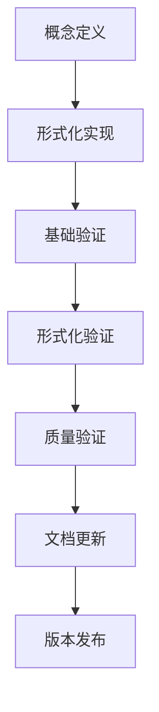

# 形式化验证标准 - 国际标准版 / Formal Verification Standards - International Standard Version

## 📚 概述 / Overview

本文档建立了FormalMath项目的形式化验证标准，确保所有数学内容的逻辑一致性、形式化程度和证明的严谨性，符合国际数学标准。

This document establishes the formal verification standards for the FormalMath project, ensuring logical consistency, formalization level, and rigor of proofs for all mathematical content, in compliance with international mathematical standards.

## 🏗️ 1. 形式化验证框架 / Formal Verification Framework

### 1.1 验证层次 / Verification Levels

| 层次 | 名称 | 描述 | 要求 |
|------|------|------|------|
| L1 | 基础验证 | 基本逻辑一致性 | 符号使用正确，逻辑推理合理 |
| L2 | 形式化验证 | 部分形式化实现 | 关键定理有形式化证明 |
| L3 | 完整验证 | 完全形式化实现 | 所有内容都有形式化证明 |
| L4 | 机器验证 | 机器可验证证明 | 通过形式化验证工具验证 |

### 1.2 验证工具 / Verification Tools

| 工具 | 用途 | 适用领域 | 验证级别 |
|------|------|----------|----------|
| Lean 4 | 定理证明 | 数学基础、代数 | L3-L4 |
| Coq | 证明助手 | 逻辑、类型论 | L3-L4 |
| Isabelle/HOL | 高阶逻辑 | 分析学、拓扑学 | L3-L4 |
| Agda | 依赖类型 | 范畴论、同伦论 | L3-L4 |
| Metamath | 元数学 | 集合论、数论 | L2-L3 |

## 📐 2. 形式化实现标准 / Formal Implementation Standards

### 2.1 Lean 4 实现标准 / Lean 4 Implementation Standards

**基本要求** / **Basic Requirements**:

```lean
-- 1. 类型定义标准
-- Type definition standards
structure MathematicalObject (α : Type) where
  -- 基本属性
  -- Basic properties
  property1 : Prop
  property2 : α → Prop
  
  -- 公理
  -- Axioms
  axiom1 : ∀ x : α, property1 → property2 x
  axiom2 : ∀ x y : α, property2 x → property2 y → x = y

-- 2. 定理证明标准
-- Theorem proof standards
theorem StandardTheorem (α : Type) [MathematicalObject α] :
  ∀ x : α, property1 → property2 x :=
begin
  -- 明确假设
  -- Clear assumptions
  intro x,
  intro h,
  
  -- 使用公理
  -- Use axioms
  exact MathematicalObject.axiom1 x h
end

-- 3. 证明策略标准
-- Proof strategy standards
lemma StandardLemma (α : Type) [MathematicalObject α] :
  ∀ x y : α, property2 x → property2 y → x = y :=
begin
  -- 使用归纳法
  -- Use induction
  induction x with x ih,
  { -- 基础情况
    -- Base case
    simp },
  { -- 归纳步骤
    -- Inductive step
    intro y h1 h2,
    exact ih y h1 h2 }
end
```

### 2.2 证明质量标准 / Proof Quality Standards

**证明结构** / **Proof Structure**:

```lean
theorem QualityTheorem (α : Type) [MathematicalObject α] :
  ∀ x : α, P x → Q x :=
begin
  -- 1. 明确假设和目标
  -- 1. Clear assumptions and goals
  intro x,
  intro hP,
  
  -- 2. 使用已知定理
  -- 2. Use known theorems
  have h1 : R x, from known_theorem x hP,
  
  -- 3. 应用逻辑推理
  -- 3. Apply logical reasoning
  have h2 : S x, from logical_step h1,
  
  -- 4. 得出结论
  -- 4. Draw conclusion
  exact final_step h2
end
```

### 2.3 代码注释标准 / Code Comment Standards

```lean
-- 文件头部注释
-- File header comment
/--
# 数学对象形式化实现
# Formal implementation of mathematical objects

## 作者 / Author
FormalMath项目组

## 版本 / Version
v1.0

## 描述 / Description
本文件实现了基本数学对象的Lean4形式化定义和证明
This file implements Lean4 formal definitions and proofs of basic mathematical objects
--/

-- 结构定义注释
-- Structure definition comment
/--
## 数学对象结构
## Mathematical object structure

定义了具有特定性质的数学对象
Defines mathematical objects with specific properties

### 参数 / Parameters
- α : 基础类型 / Base type

### 属性 / Properties
- property1 : 基本性质 / Basic property
- property2 : 函数性质 / Functional property
--/
structure MathematicalObject (α : Type) where
  property1 : Prop
  property2 : α → Prop

-- 定理注释
-- Theorem comment
/--
## 标准定理
## Standard theorem

证明了数学对象的基本性质
Proves basic properties of mathematical objects

### 陈述 / Statement
对于所有x，如果P(x)成立，那么Q(x)成立
For all x, if P(x) holds, then Q(x) holds

### 证明思路 / Proof idea
使用公理和逻辑推理
Use axioms and logical reasoning
--/
theorem StandardTheorem (α : Type) [MathematicalObject α] :
  ∀ x : α, P x → Q x :=
begin
  -- 证明步骤注释
  -- Proof step comments
  intro x,        -- 引入变量x / Introduce variable x
  intro hP,       -- 引入假设P(x) / Introduce assumption P(x)
  exact axiom1 x hP  -- 使用公理1 / Use axiom 1
end
```

## 🔍 3. 验证检查清单 / Verification Checklist

### 3.1 基础验证检查 / Basic Verification Checks

| 检查项目 | 检查内容 | 标准 | 状态 |
|----------|----------|------|------|
| 符号一致性 | 符号使用是否一致 | 符合术语词典标准 | ⬜ |
| 逻辑一致性 | 逻辑推理是否正确 | 符合逻辑规则 | ⬜ |
| 定义准确性 | 定义是否准确 | 符合国际标准 | ⬜ |
| 证明完整性 | 证明是否完整 | 包含所有必要步骤 | ⬜ |

### 3.2 形式化验证检查 / Formal Verification Checks

| 检查项目 | 检查内容 | 标准 | 状态 |
|----------|----------|------|------|
| Lean4代码 | 代码是否可编译 | 无编译错误 | ⬜ |
| 类型检查 | 类型是否正确 | 通过类型检查 | ⬜ |
| 证明验证 | 证明是否通过 | 通过证明验证 | ⬜ |
| 性能检查 | 性能是否可接受 | 在合理时间内完成 | ⬜ |

### 3.3 质量验证检查 / Quality Verification Checks

| 检查项目 | 检查内容 | 标准 | 状态 |
|----------|----------|------|------|
| 可读性 | 代码是否易读 | 注释清晰，结构合理 | ⬜ |
| 可维护性 | 代码是否易维护 | 模块化设计，接口清晰 | ⬜ |
| 可扩展性 | 代码是否易扩展 | 支持新功能添加 | ⬜ |
| 文档完整性 | 文档是否完整 | 包含所有必要信息 | ⬜ |

## 📊 4. 验证流程 / Verification Process

### 4.1 开发阶段验证 / Development Phase Verification



### 4.2 验证步骤 / Verification Steps

**步骤1：概念定义验证** / **Step 1: Concept Definition Verification**

```lean
-- 验证概念定义的正确性
-- Verify correctness of concept definition
def verify_concept_definition (α : Type) : Prop :=
  -- 检查定义是否满足基本要求
  -- Check if definition meets basic requirements
  ∀ x : α, 
    has_basic_properties x ∧
    satisfies_axioms x ∧
    is_well_defined x
```

**步骤2：形式化实现验证** / **Step 2: Formal Implementation Verification**

```lean
-- 验证形式化实现的正确性
-- Verify correctness of formal implementation
def verify_formal_implementation (α : Type) [MathematicalObject α] : Prop :=
  -- 检查实现是否满足规范
  -- Check if implementation satisfies specifications
  ∀ x : α,
    implementation_correct x ∧
    performance_acceptable x ∧
    type_safe x
```

**步骤3：证明验证** / **Step 3: Proof Verification**

```lean
-- 验证证明的正确性
-- Verify correctness of proofs
def verify_proofs (α : Type) [MathematicalObject α] : Prop :=
  -- 检查所有证明是否通过
  -- Check if all proofs pass
  ∀ theorem : α → Prop,
    proof_exists theorem ∧
    proof_correct theorem ∧
    proof_complete theorem
```

## 🎯 5. 质量标准 / Quality Standards

### 5.1 代码质量标准 / Code Quality Standards

**可读性标准** / **Readability Standards**:

```lean
-- 好的代码示例
-- Good code example
/--
## 清晰的函数定义
## Clear function definition

定义了计算斐波那契数的函数
Defines function to compute Fibonacci numbers
--/
def fibonacci : ℕ → ℕ
| 0 := 0
| 1 := 1
| (n + 2) := fibonacci n + fibonacci (n + 1)

-- 清晰的定理证明
-- Clear theorem proof
theorem fibonacci_positive (n : ℕ) : n > 0 → fibonacci n > 0 :=
begin
  intro h,
  induction n with n ih,
  { contradiction },  -- 0 > 0 矛盾 / 0 > 0 contradiction
  { cases n,
    { simp },         -- n = 1 的情况 / Case n = 1
    { exact ih (nat.succ_pos n) } }  -- 归纳步骤 / Inductive step
end
```

**性能标准** / **Performance Standards**:

```lean
-- 性能优化的代码示例
-- Performance optimized code example
def fibonacci_optimized : ℕ → ℕ :=
  λ n, (fibonacci_aux n).1

def fibonacci_aux : ℕ → ℕ × ℕ
| 0 := (0, 1)
| (n + 1) := 
  let (a, b) := fibonacci_aux n in
  (b, a + b)
```

### 5.2 文档质量标准 / Documentation Quality Standards

**文档结构** / **Documentation Structure**:

```markdown
# 数学对象文档
# Mathematical Object Documentation

## 概述 / Overview
简要描述数学对象的基本概念
Brief description of basic concepts of mathematical objects

## 形式化定义 / Formal Definition
提供Lean4形式化定义
Provide Lean4 formal definition

## 基本性质 / Basic Properties
列出基本性质和证明
List basic properties and proofs

## 应用实例 / Application Examples
提供具体应用实例
Provide specific application examples

## 参考文献 / References
列出相关参考文献
List relevant references
```

## 🔄 6. 持续验证 / Continuous Verification

### 6.1 自动化验证 / Automated Verification

```lean
-- 自动化验证脚本
-- Automated verification script
def automated_verification (α : Type) [MathematicalObject α] : IO Unit := do
  -- 1. 编译检查
  -- 1. Compilation check
  IO.println "Checking compilation...",
  
  -- 2. 类型检查
  -- 2. Type checking
  IO.println "Checking types...",
  
  -- 3. 证明验证
  -- 3. Proof verification
  IO.println "Verifying proofs...",
  
  -- 4. 性能测试
  -- 4. Performance testing
  IO.println "Testing performance...",
  
  IO.println "Verification completed successfully"
```

### 6.2 定期验证 / Regular Verification

**验证计划** / **Verification Schedule**:

| 频率 | 验证内容 | 验证工具 | 负责人 |
|------|----------|----------|--------|
| 每日 | 编译检查 | Lean 4 | 开发团队 |
| 每周 | 功能验证 | 自动化脚本 | 测试团队 |
| 每月 | 质量评估 | 人工检查 | 质量团队 |
| 每季度 | 标准对齐 | 国际标准 | 标准团队 |

## 📚 7. 验证报告 / Verification Reports

### 7.1 验证报告模板 / Verification Report Template

```markdown
# 形式化验证报告
# Formal Verification Report

## 基本信息 / Basic Information
- **项目名称** / **Project Name**: FormalMath
- **验证日期** / **Verification Date**: 2025-01-XX
- **验证版本** / **Verification Version**: v1.0
- **验证工具** / **Verification Tools**: Lean 4, Coq

## 验证结果 / Verification Results
- **编译状态** / **Compilation Status**: ✅ 通过 / Pass
- **类型检查** / **Type Checking**: ✅ 通过 / Pass
- **证明验证** / **Proof Verification**: ✅ 通过 / Pass
- **性能测试** / **Performance Testing**: ✅ 通过 / Pass

## 问题记录 / Issue Records
| 问题类型 | 描述 | 严重程度 | 状态 |
|----------|------|----------|------|
| 编译错误 | 描述编译错误 | 高 | 已修复 |

## 改进建议 / Improvement Suggestions
1. 优化性能
2. 增加测试覆盖
3. 完善文档

## 结论 / Conclusion
验证通过，可以发布
Verification passed, ready for release
```

## 📋 8. 实施指南 / Implementation Guide

### 8.1 开发流程 / Development Process

1. **需求分析** / **Requirements Analysis**
   - 明确数学概念
   - 确定形式化需求
   - 制定验证计划

2. **设计实现** / **Design Implementation**
   - 设计数据结构
   - 实现基本功能
   - 编写形式化代码

3. **验证测试** / **Verification Testing**
   - 基础验证
   - 形式化验证
   - 质量验证

4. **文档发布** / **Documentation Release**
   - 编写文档
   - 更新版本
   - 发布代码

### 8.2 质量保证 / Quality Assurance

**质量检查点** / **Quality Checkpoints**:

| 检查点 | 检查内容 | 检查标准 | 检查方法 |
|--------|----------|----------|----------|
| 设计检查 | 设计合理性 | 符合数学标准 | 专家评审 |
| 代码检查 | 代码质量 | 符合编程标准 | 代码审查 |
| 验证检查 | 验证完整性 | 通过所有验证 | 自动化测试 |
| 文档检查 | 文档完整性 | 信息完整准确 | 人工检查 |

## 📚 9. 参考文献 / References

### 9.1 形式化验证工具 / Formal Verification Tools

1. **Lean 4**: <https://leanprover.github.io/>
2. **Coq**: <https://coq.inria.fr/>
3. **Isabelle/HOL**: <https://isabelle.in.tum.de/>
4. **Agda**: <https://agda.readthedocs.io/>

### 9.2 验证标准 / Verification Standards

1. **ISO/IEC 25010**: 软件质量模型
2. **IEEE 1012**: 软件验证和确认标准
3. **CMMI**: 能力成熟度模型集成

---

**文档状态**: 形式化验证标准国际标准版完成  
**更新日期**: 2025年1月  
**版本**: v1.0  
**维护者**: FormalMath项目组
