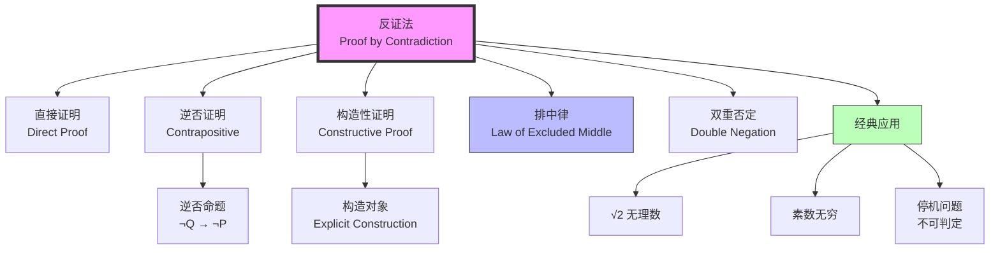
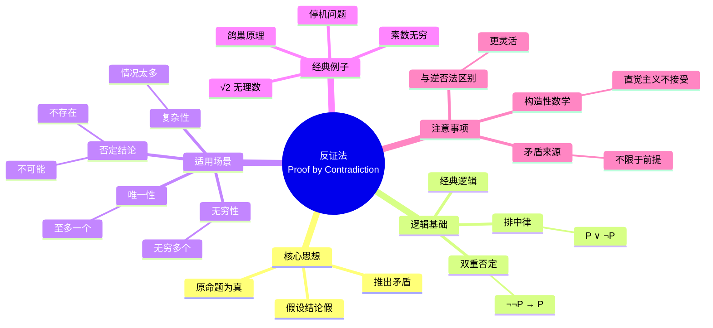
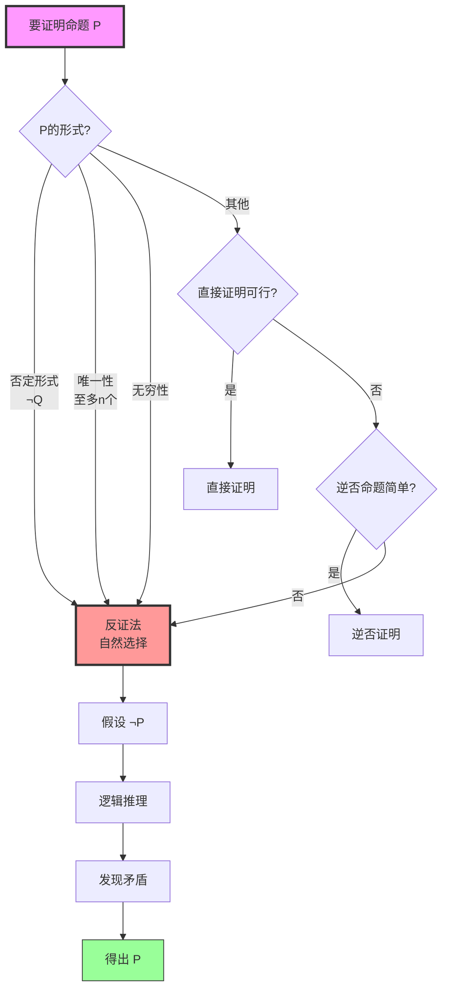

# 概念: 反证法 (Proof by Contradiction)

**主题编号**: B.01.25.02
**难度等级**: ⭐⭐（入门级）
**前置概念**: 命题逻辑、条件语句
**后续概念**: 对角线论证、存在性证明

---

## 概念深度解析

### 直观理解

反证法是一种间接证明方法。其核心思想是：**要证明某命题为真，先假设它为假，然后推导出矛盾，从而说明原假设错误，原命题必为真**。

**类比**: 就像侦探破案——假设嫌疑人无罪，如果这导致与已知事实矛盾，则嫌疑人有罪。

**基本模式**:

1. 要证明命题 $P$
2. 假设 $\neg P$（$P$ 不成立）
3. 从 $\neg P$ 出发进行逻辑推理
4. 推出矛盾（如 $Q \land \neg Q$）
5. 因此 $\neg P$ 为假，即 $P$ 为真

### 形式定义

**定义 1.1 (反证法原理)**

设 $P$ 是一个命题。反证法基于以下逻辑等价:

$$P \iff (\neg P \rightarrow \bot)$$

其中 $\bot$ 表示矛盾（永假命题）。

**形式化表述**:

在自然演绎系统中，反证法对应以下推理规则:

$$\frac{[\neg P] \\ \vdots \\ \bot}{P} \text{ (反证法/归谬法)}$$

### 等价表述

反证法在不同语境下的表述:

| 名称 | 表述 | 适用场景 |
|------|------|----------|
| **归谬法** (Reductio ad absurdum) | 假设结论假，推出荒谬结果 | 经典逻辑 |
| **间接证明** (Indirect Proof) | 通过否定结论来证明原命题 | 一般数学 |
| **逆否证明的强化形式** | 推出任何矛盾即可 | 与逆否法结合 |

**与逆否法的区别**:

- **逆否法**: 证明 $\neg Q \rightarrow \neg P$ 来代替 $P \rightarrow Q$
- **反证法**: 假设结论假，推出任何矛盾（不限于前提的否定）

### 动机与背景

**为什么需要反证法?**

1. **直接证明困难**: 某些命题直接证明很复杂，反证法更自然
2. **否定形式**: 结论本身是"不存在"、"不可能"等否定形式
3. **唯一性证明**: 证明某对象唯一时，反证法常常有效
4. **无穷性证明**: 证明某集合无穷（假设有限推出矛盾）

**历史渊源**:

- **古希腊**: 欧几里得在《几何原本》中广泛使用反证法
- **经典例子**: 证明素数无穷、$\sqrt{2}$ 是无理数
- **现代应用**: 哥德尔不完备性定理、停机问题的不可判定性

---

## 属性与关系

### 核心性质

#### 性质 1: 逻辑有效性

**定理 1.1 (反证法的逻辑有效性)**

反证法在经典逻辑中是有效的推理规则，即:

$$(\neg P \rightarrow \bot) \rightarrow P$$

**证明**:

- 由否定定义，$\neg P$ 等价于 $P \rightarrow \bot$
- 假设 $\neg P \rightarrow \bot$，即 $(P \rightarrow \bot) \rightarrow \bot$
- 在经典逻辑中，这等价于 $P$（双重否定消去）
$\square$

#### 性质 2: 与排中律的关系

**定理 1.2 (反证法与排中律)**

反证法等价于排中律 $P \lor \neg P$。

**证明**:

- $(\Rightarrow)$ 假设反证法成立。要证 $P \lor \neg P$。
  - 假设 $\neg(P \lor \neg P)$，即 $\neg P \land \neg\neg P$，矛盾。
  - 故 $P \lor \neg P$。

- $(\Leftarrow)$ 假设排中律成立。设 $\neg P \rightarrow \bot$。
  - 由排中律，$P \lor \neg P$。
  - 若 $P$，则得证。
  - 若 $\neg P$，则与 $\neg P \rightarrow \bot$ 得 $\bot$，矛盾。
  - 故 $P$ 成立。$\square$

**注意**: 在直觉主义逻辑中，反证法不成立（因为不接受排中律）。

#### 性质 3: 适用性条件

**定理 1.3 (反证法的适用条件)**

反证法特别适用于以下情况:

1. 结论是否定形式 ($\neg Q$)
2. 结论涉及"唯一"、"至多"、"不存在"
3. 结论涉及无穷性
4. 直接证明需要分过多情况

### 与其他概念的关系图



### 层次结构

```
证明方法体系
│
├── 直接方法
│   ├── 直接证明
│   └── 构造性证明
│
├── 间接方法
│   ├── 反证法 ←── 当前节点
│   ├── 逆否证明
│   └── 分情况证明
│
└── 特殊方法
    ├── 数学归纳法
    ├── 抽屉原理
    └── 对角线论证
```

---

## 示例与习题

### 基础示例

#### 示例 1: 证明 $\sqrt{2}$ 是无理数

**定理**: $\sqrt{2}$ 是无理数。

**证明** (反证法):

假设 $\sqrt{2}$ 是有理数，则存在互素的整数 $p, q$ ($q \neq 0$) 使得:
$$\sqrt{2} = \frac{p}{q}$$

两边平方:
$$2 = \frac{p^2}{q^2} \Rightarrow p^2 = 2q^2$$

因此 $p^2$ 是偶数，从而 $p$ 是偶数（奇数的平方是奇数）。

设 $p = 2k$，代入:
$$(2k)^2 = 2q^2 \Rightarrow 4k^2 = 2q^2 \Rightarrow q^2 = 2k^2$$

因此 $q^2$ 是偶数，从而 $q$ 是偶数。

**矛盾**: $p$ 和 $q$ 都是偶数，与它们互素的假设矛盾！

因此 $\sqrt{2}$ 是无理数。$\square$

#### 示例 2: 证明素数有无穷多个

**定理** (欧几里得): 素数有无穷多个。

**证明** (反证法):

假设素数只有有限个，设为 $p_1, p_2, \ldots, p_n$。

考虑数:
$$N = p_1 p_2 \cdots p_n + 1$$

**分析**:

- $N > 1$，故 $N$ 有素因子
- 对任意 $p_i$，$N \equiv 1 \pmod{p_i}$，故 $p_i \nmid N$
- 因此 $N$ 有不在列表中的素因子

**矛盾**: 假设列出了所有素数，但找到了新的素数。

因此素数有无穷多个。$\square$

#### 示例 3: 证明不存在最大的自然数

**定理**: 不存在最大的自然数。

**证明** (反证法):

假设存在最大的自然数，设为 $N$。

考虑 $N + 1$:

- $N + 1$ 是自然数
- $N + 1 > N$

**矛盾**: $N + 1$ 是比 $N$ 更大的自然数，与 $N$ 最大矛盾。

因此不存在最大的自然数。$\square$

#### 示例 4: 证明两个奇数之和是偶数（反证法版）

**定理**: 若 $m, n$ 是奇数，则 $m + n$ 是偶数。

**证明** (反证法):

设 $m, n$ 是奇数，假设 $m + n$ 是奇数。

由奇数定义，存在整数 $a, b$ 使得:
$$m = 2a + 1, \quad n = 2b + 1$$

则:
$$m + n = 2a + 1 + 2b + 1 = 2(a + b + 1)$$

因此 $m + n$ 是偶数，与假设矛盾。

故 $m + n$ 是偶数。$\square$

#### 示例 5: 证明若 $n^2$ 是偶数，则 $n$ 是偶数

**定理**: 若 $n^2$ 是偶数，则 $n$ 是偶数。

**证明** (反证法):

假设 $n^2$ 是偶数，但 $n$ 是奇数。

设 $n = 2k + 1$，则:
$$n^2 = (2k + 1)^2 = 4k^2 + 4k + 1 = 2(2k^2 + 2k) + 1$$

因此 $n^2$ 是奇数，与假设矛盾。

故 $n$ 是偶数。$\square$

### 典型示例

#### 示例 6: 证明 $log_2 3$ 是无理数

**定理**: $\log_2 3$ 是无理数。

**证明** (反证法):

假设 $\log_2 3 = \frac{p}{q}$，其中 $p, q$ 是互素正整数。

则:
$$2^{p/q} = 3 \Rightarrow 2^p = 3^q$$

**分析**:

- 左边 $2^p$ 是偶数
- 右边 $3^q$ 是奇数

**矛盾**: 偶数 = 奇数，不可能。

因此 $\log_2 3$ 是无理数。$\square$

#### 示例 7: 鸽巢原理

**定理** (鸽巢原理): 若 $n+1$ 个物体放入 $n$ 个盒子，至少有一个盒子有至少两个物体。

**证明** (反证法):

假设每个盒子最多有一个物体。

则 $n$ 个盒子最多容纳 $n$ 个物体。

但我们有 $n+1$ 个物体。

**矛盾**: $n+1 \leq n$ 不成立。

因此至少有一个盒子有至少两个物体。$\square$

### 反例

#### 反例 1: 反证法不能证明存在性

**误解**: 用反证法证明存在性（不给出构造）。

**澄清**: 反证法只能证明"不存在"，要证明"存在"最好用构造法。

**正确做法**:

- 要证 $\exists x P(x)$，应该构造具体的 $x$ 使得 $P(x)$ 成立
- 反证法只能证明 $\neg \forall x \neg P(x)$，这不给出构造

#### 反例 2: 混淆反证法与逆否法

**常见错误**: 认为反证法就是证明逆否命题。

**澄清**:

- **反证法**: 假设结论假，推出任何矛盾
- **逆否法**: 证明 $\neg Q \rightarrow \neg P$ 来代替 $P \rightarrow Q$

**区别**: 反证法更灵活，可以推出任何矛盾，不限于前提的否定。

#### 反例 3: 构造性数学中的限制

**注意**: 在直觉主义/构造性数学中，反证法**不被接受**，因为它依赖排中律。

**例子**: Brouwer不承认 "$\sqrt{2}$ 是无理数" 的反证法证明，除非给出具体的有理数逼近误差界。

### 习题

#### 初级难度

**习题 1** (难度 ⭐)
用反证法证明: 若 $n$ 是奇数，则 $n^2$ 是奇数。

<details>
<summary>解答</summary>

**证明**:
假设 $n$ 是奇数，但 $n^2$ 是偶数。

设 $n = 2k + 1$，则:
$$n^2 = (2k+1)^2 = 4k^2 + 4k + 1 = 2(2k^2 + 2k) + 1$$

因此 $n^2$ 是奇数，与假设矛盾。

故 $n^2$ 是奇数。$\square$
</details>

**习题 2** (难度 ⭐)
用反证法证明: 不存在整数 $n$ 使得 $n^2 = 2$。

<details>
<summary>解答</summary>

**证明**:
假设存在整数 $n$ 使得 $n^2 = 2$。

若 $n \geq 2$，则 $n^2 \geq 4 > 2$。
若 $n \leq -2$，则 $n^2 \geq 4 > 2$。
若 $n = 0, \pm 1$，则 $n^2 = 0$ 或 $1 \neq 2$。

所有情况矛盾，故不存在这样的整数。$\square$
</details>

**习题 3** (难度 ⭐)
用反证法证明: 若 $a, b$ 是有理数，$b \neq 0$，且 $r$ 是无理数，则 $a + br$ 是无理数。

<details>
<summary>解答</summary>

**证明**:
假设 $a + br$ 是有理数，设为 $q$。

则 $br = q - a$，故 $r = \frac{q - a}{b}$。

由于有理数对加减除封闭，$r$ 是有理数。

与 $r$ 无理矛盾，故 $a + br$ 是无理数。$\square$
</details>

#### 中级难度

**习题 4** (难度 ⭐⭐)
用反证法证明: 对任意正整数 $n$，$\sqrt{n} + \sqrt{2}$ 是无理数。

<details>
<summary>解答</summary>

**证明**:
假设 $\sqrt{n} + \sqrt{2} = q$ 是有理数。

则 $\sqrt{n} = q - \sqrt{2}$，平方得:
$$n = q^2 - 2q\sqrt{2} + 2$$

因此:
$$\sqrt{2} = \frac{q^2 + 2 - n}{2q}$$

若 $q \neq 0$，右边是有理数，故 $\sqrt{2}$ 是有理数，矛盾。

若 $q = 0$，则 $\sqrt{n} = -\sqrt{2} < 0$，与 $\sqrt{n} \geq 0$ 矛盾。$\square$
</details>

**习题 5** (难度 ⭐⭐)
证明: 在任意6个人中，必有3个人互相认识或3个人互相不认识。

<details>
<summary>解答</summary>

**证明** (Ramsey理论特例):
考虑其中一人A。在其余5人中:

**情况1**: A认识至少3人（设为B, C, D）

- 若B, C, D中有两人认识，则与A形成3人互识组
- 若B, C, D互不认识，则形成3人互不识组

**情况2**: A不认识至少3人

- 类似论证

因此必有3人互识或3人互不识。$\square$
</details>

**习题 6** (难度 ⭐⭐)
用反证法证明: 方程 $x^3 + x + 1 = 0$ 没有有理根。

<details>
<summary>解答</summary>

**证明**:
假设 $\frac{p}{q}$ 是有理根（$p, q$ 互素，$q > 0$）。

代入方程:
$$\frac{p^3}{q^3} + \frac{p}{q} + 1 = 0$$

乘以 $q^3$:
$$p^3 + pq^2 + q^3 = 0$$

**分析**:

- 若 $p$ 偶 $q$ 奇: 左边 = 偶 + 偶 + 奇 = 奇 $\neq 0$
- 若 $p$ 奇 $q$ 偶: 左边 = 奇 + 偶 + 偶 = 奇 $\neq 0$
- 若 $p$ 奇 $q$ 奇: 左边 = 奇 + 奇 + 奇 = 奇 $\neq 0$
- 若 $p$ 偶 $q$ 偶: 与互素矛盾

所有情况矛盾，故无有理根。$\square$
</details>

---

## 形式化实现（Lean4）

### 反证法原理的形式化

```lean
-- 反证法在Lean中的实现
-- 基于经典逻辑（接受排中律）

-- 反证法基本原理
-- 要证 P，假设 ¬P 推出矛盾 ⊥，则 P 成立

example (P : Prop) (h : ¬P → False) : P := by
  by_contra h1  -- 反证法策略
  exact h h1    -- 应用假设推出矛盾

-- 等价表述: (¬P → ⊥) → P
example (P : Prop) : (¬P → False) → P := by
  intro h
  by_contra h1
  exact h h1
```

### 经典示例的形式化

```lean
-- 示例1: 证明 ¬(P ∧ Q) → (¬P ∨ ¬Q) （德摩根律之一）
example (P Q : Prop) : ¬(P ∧ Q) → (¬P ∨ ¬Q) := by
  intro h
  by_contra h1  -- 假设结论假，即 ¬(¬P ∨ ¬Q)，也就是 ¬¬P ∧ ¬¬Q，即 P ∧ Q
  push_neg at h1  -- 将 ¬(¬P ∨ ¬Q) 转换为 P ∧ Q
  exact h h1    -- 矛盾!

-- 示例2: 证明 P → Q 等价于 ¬Q → ¬P （逆否命题）
example (P Q : Prop) : (P → Q) ↔ (¬Q → ¬P) := by
  constructor
  · -- 证明 P → Q 蕴含 ¬Q → ¬P
    intro h nq p
    have q := h p
    contradiction  -- Q 和 ¬Q 矛盾
  · -- 证明 ¬Q → ¬P 蕴含 P → Q （用反证法）
    intro h p
    by_contra nq   -- 假设 ¬Q
    have np := h nq
    contradiction  -- P 和 ¬P 矛盾
```

### 数学示例的形式化

```lean
-- 定义奇偶性
def Even (n : Int) : Prop := ∃ k, n = 2 * k
def Odd (n : Int) : Prop := ∃ k, n = 2 * k + 1

-- 定理: 若 n² 是偶数，则 n 是偶数
example (n : Int) (h : Even (n^2)) : Even n := by
  by_contra h1  -- 假设 n 不是偶数，即 n 是奇数

  -- 证明: n 是奇数 → n² 是奇数
  have h2 : Odd n := by
    by_contra h3
    push_neg at h3
    -- 在整数中，非奇即偶
    have : Even n := by
      sorry  -- 这里需要整数性质: 每个整数是奇数或偶数
    contradiction

  -- n 是奇数，所以 n² 是奇数
  have h3 : Odd (n^2) := by
    rcases h2 with ⟨k, hk⟩
    use 2*k^2 + 2*k
    rw [hk]
    ring

  -- 矛盾: n² 不能既是偶数又是奇数
  rcases h with ⟨m, hm⟩
  rcases h3 with ⟨p, hp⟩
  have : 2 * m = 2 * p + 1 := by linarith
  have : 2 * m % 2 = (2 * p + 1) % 2 := by rw [this]
  simp at this
```

### 关键步骤解释

1. **`by_contra`**: Lean中的反证法策略，引入否定假设
2. **`push_neg`**: 将否定向内推，简化双重否定
3. **`contradiction`**: 自动寻找矛盾并结束证明
4. **`by_cases`**: 分情况讨论，类似于排中律

---

## 应用与拓展

### 实际应用

#### 应用 1: 计算机科学 - 停机问题

**定理** (图灵): 停机问题是不可判定的。

**证明概要** (对角线论证 + 反证法):
假设存在程序 $H$ 能判定任意程序是否停机。构造程序 $D$：

```
D(P):
  if H(P, P) = "停机" then 无限循环
  else 停机
```

问：$D(D)$ 是否停机？

- 若 $H(D, D)$ = "停机"，则 $D$ 无限循环，矛盾
- 若 $H(D, D)$ = "不停机"，则 $D$ 停机，矛盾

**结论**: 假设错误，停机问题不可判定。

#### 应用 2: 密码学安全性证明

许多密码学协议的安全性证明使用反证法:

- 假设攻击者能破解协议
- 证明这意味着能解决某个被认为困难的问题（如大整数分解）
- 因此协议是安全的（基于困难假设）

#### 应用 3: 算法正确性

证明算法正确性时，常用反证法证明:

- 算法不会进入无限循环
- 算法不会违反不变式
- 算法输出的唯一性

### 与其他数学分支的联系

| 分支 | 应用 |
|------|------|
| **数论** | 证明数的无理性、素数无穷性 |
| **分析学** | 证明函数的连续性、可微性性质 |
| **拓扑学** | 证明空间的紧致性、连通性 |
| **集合论** | 证明基数比较、选择公理的等价形式 |
| **计算理论** | 证明问题的不可判定性、复杂性下界 |

---

## 思维表征

### Mermaid思维导图



### 证明策略决策树



---

## 总结

### 核心要点

1. **反证法**是间接证明方法，假设结论假，推出矛盾
2. **逻辑基础**: 等价于排中律，在经典逻辑中有效
3. **适用场景**: 否定结论、唯一性、无穷性、直接证明复杂
4. **经典应用**: $\sqrt{2}$ 无理数、素数无穷、停机问题
5. **限制**: 构造性数学中不被接受

### 反证法 vs 其他方法

| 方法 | 特点 | 适用场景 |
|------|------|----------|
| 直接证明 | 直观清晰 | 条件到结论路径明确 |
| 反证法 | 灵活强大 | 否定形式、复杂情况 |
| 逆否证明 | 逻辑等价转换 | 逆否命题更简单 |
| 构造性证明 | 给出具体构造 | 存在性命题 |

### 进一步学习

- [直接证明法](./概念-直接证明-标准版.md)
- [逆否证明法](./概念-逆否证明-标准版.md)
- [构造性证明](./概念-构造性证明-标准版.md)
- [对角线论证](../集合论/概念-对角线论证-标准版.md)

---

**文档版本**: 1.0
**最后更新**: 2026年4月8日
**维护者**: FormalMath项目组
