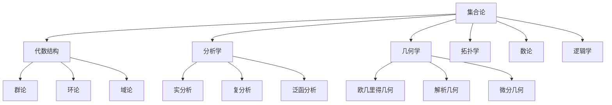
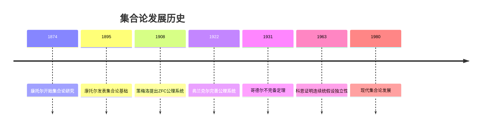
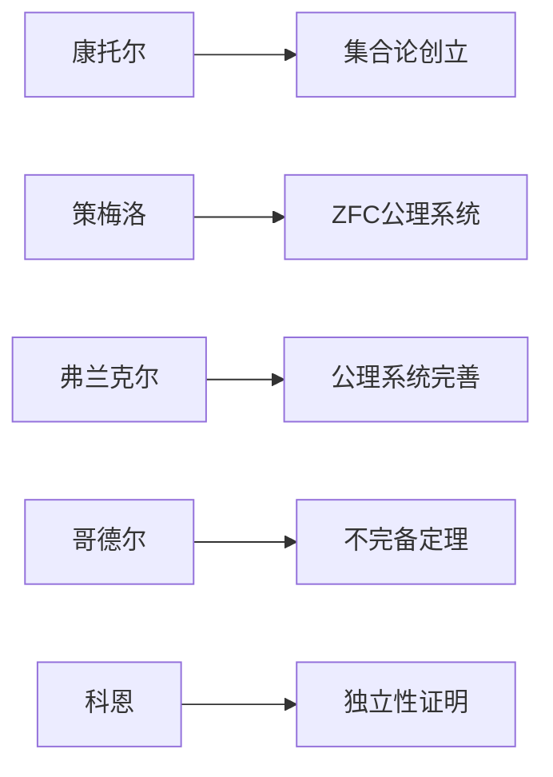
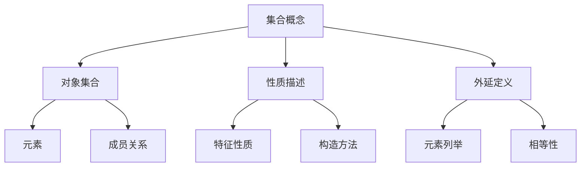
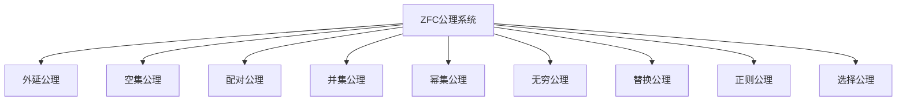
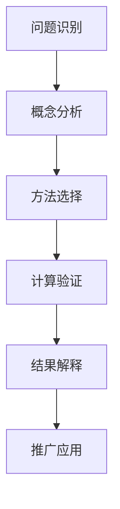
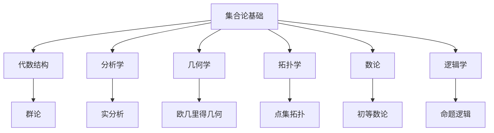

# 1. 集合论基础 / Set Theory Foundations

## 目录

- [1. 集合论基础 / Set Theory Foundations](#1-集合论基础--set-theory-foundations)
  - [目录](#目录)
  - [1.1 概述 / Overview](#11-概述--overview)
    - [1.1.1 核心地位](#111-核心地位)
    - [1.1.2 基本思想](#112-基本思想)
  - [1.2 历史发展 / Historical Development](#12-历史发展--historical-development)
    - [1.2.1 发展时间线](#121-发展时间线)
    - [1.2.2 重要人物贡献](#122-重要人物贡献)
    - [1.2.3 理论发展脉络](#123-理论发展脉络)
  - [1.3 基本概念 / Basic Concepts](#13-基本概念--basic-concepts)
    - [1.3.1 集合的定义 / Definition of Set](#131-集合的定义--definition-of-set)
    - [1.3.2 元素关系 / Element Relation](#132-元素关系--element-relation)
    - [1.3.3 集合的表示方法 / Set Representation](#133-集合的表示方法--set-representation)
  - [1.4 ZFC公理系统 / ZFC Axiom System](#14-zfc公理系统--zfc-axiom-system)
    - [1.4.1 公理系统概述](#141-公理系统概述)
    - [1.4.2 外延公理 / Axiom of Extensionality](#142-外延公理--axiom-of-extensionality)
    - [1.4.3 空集公理 / Axiom of Empty Set](#143-空集公理--axiom-of-empty-set)
    - [1.4.4 配对公理 / Axiom of Pairing](#144-配对公理--axiom-of-pairing)
    - [1.4.5 并集公理 / Axiom of Union](#145-并集公理--axiom-of-union)
    - [1.4.6 幂集公理 / Axiom of Power Set](#146-幂集公理--axiom-of-power-set)
  - [1.5 集合运算 / Set Operations](#15-集合运算--set-operations)
    - [1.5.1 子集关系 / Subset Relation](#151-子集关系--subset-relation)
    - [1.5.2 交集 / Intersection](#152-交集--intersection)
    - [1.5.3 差集 / Set Difference](#153-差集--set-difference)
    - [1.5.4 对称差 / Symmetric Difference](#154-对称差--symmetric-difference)
  - [1.6 关系与函数 / Relations and Functions](#16-关系与函数--relations-and-functions)
    - [1.6.1 关系 / Relations](#161-关系--relations)
    - [1.6.2 函数 / Functions](#162-函数--functions)
  - [1.7 应用实例 / Application Examples](#17-应用实例--application-examples)
    - [1.7.1 计算机科学应用](#171-计算机科学应用)
    - [1.7.2 逻辑学应用](#172-逻辑学应用)
    - [1.7.3 概率论应用](#173-概率论应用)
  - [1.8 思维过程 / Thinking Process](#18-思维过程--thinking-process)
    - [1.8.1 问题解决流程](#181-问题解决流程)
    - [1.8.2 证明思维过程](#182-证明思维过程)
    - [1.8.3 概念理解过程](#183-概念理解过程)
  - [1.9 总结 / Summary](#19-总结--summary)
    - [1.9.1 核心要点](#191-核心要点)
    - [1.9.2 知识关联](#192-知识关联)
    - [1.9.3 进一步学习](#193-进一步学习)
  - [术语对照表 / Terminology Table](#术语对照表--terminology-table)

## 1.1 概述 / Overview

集合论是现代数学的基础，为所有数学分支提供了统一的语言和框架。本文档基于ZFC公理系统（Zermelo-Fraenkel公理系统加上选择公理）构建。

### 1.1.1 核心地位

### 1.1.2 基本思想

集合论的核心思想是：

- **统一性**：所有数学对象都可以表示为集合
- **公理化**：通过严格的公理系统建立理论基础
- **抽象性**：从具体对象中抽象出一般性质

## 1.2 历史发展 / Historical Development

### 1.2.1 发展时间线

### 1.2.2 重要人物贡献

### 1.2.3 理论发展脉络

**阶段 1** (1874-1908)：集合论创立

- 康托尔发现无穷集合的不同层次
- 建立基数理论
- 发现集合论悖论

**阶段 2** (1908-1931)：公理化发展

- 策梅洛提出ZFC公理系统
- 弗兰克尔完善公理系统
- 哥德尔证明不完备定理

**阶段 3** (1931-至今)：现代发展

- 科恩证明连续统假设独立性
- 大基数理论发展
- 内模型理论建立

## 1.3 基本概念 / Basic Concepts

### 1.3.1 集合的定义 / Definition of Set

**定义 1.1** (集合 / Set)
集合是满足特定性质的对象的总和。我们用大写字母表示集合，如 $A, B, C$。

**形式化定义**：
$$\forall x \forall y \forall z (z \in x \leftrightarrow z \in y) \rightarrow x = y$$

**概念图示**：

### 1.3.2 元素关系 / Element Relation

**定义 1.2** (属于关系 / Element Relation)
如果 $a$ 是集合 $A$ 的元素，记作 $a \in A$。

**性质**：

- 自反性：$a \in \{a\}$
- 传递性：如果 $a \in A$ 且 $A \in B$，则 $a \in B$（在特定条件下）

**实例 1.1** (元素关系实例)
考虑集合 $A = \{1, 2, 3\}$：

- $1 \in A$ ✓
- $4 \notin A$ ✓
- $\{1, 2\} \notin A$ ✓

**反例 1.1** (罗素悖论)
考虑集合 $R = \{x : x \notin x\}$：

- 如果 $R \in R$，则 $R \notin R$（矛盾）
- 如果 $R \notin R$，则 $R \in R$（矛盾）
- 因此 $R$ 不是集合

### 1.3.3 集合的表示方法 / Set Representation

**方法 1**：列举法
$$A = \{1, 2, 3, 4, 5\}$$

**方法 2**：描述法
$$B = \{x : x \text{ 是正整数且 } x \leq 5\}$$

**方法 3**：构造法
$$C = \{x^2 : x \in \mathbb{Z}, 1 \leq x \leq 3\} = \{1, 4, 9\}$$

## 1.4 ZFC公理系统 / ZFC Axiom System

### 1.4.1 公理系统概述

### 1.4.2 外延公理 / Axiom of Extensionality

**公理 1.1** (外延公理)
两个集合相等当且仅当它们包含相同的元素：

$$\forall x \forall y [\forall z(z \in x \leftrightarrow z \in y) \rightarrow x = y]$$

**思维过程**：

1. **理解问题**：定义集合相等的标准
2. **分析条件**：集合包含相同元素
3. **构造定义**：外延性原理
4. **验证结果**：确保定义的合理性

**实例 1.2** (外延公理应用)
设 $A = \{1, 2, 3\}$，$B = \{3, 1, 2\}$：

- $A$ 和 $B$ 包含相同元素
- 根据外延公理，$A = B$

### 1.4.3 空集公理 / Axiom of Empty Set

**公理 1.2** (空集公理)
存在一个不包含任何元素的集合：

$$\exists x \forall y (y \notin x)$$

**定义 1.3** (空集 / Empty Set)
空集记作 $\emptyset$，满足 $\forall x (x \notin \emptyset)$。

**实例 1.3** (空集性质)

- $\emptyset \subseteq A$ 对任意集合 $A$ 成立
- $|\emptyset| = 0$（空集的基数为0）
- $\emptyset \cup A = A$（空集是并运算的单位元）

### 1.4.4 配对公理 / Axiom of Pairing

**公理 1.3** (配对公理)
对于任意两个集合，存在一个包含它们的集合：

$$\forall x \forall y \exists z \forall w(w \in z \leftrightarrow w = x \vee w = y)$$

**定义 1.4** (无序对 / Unordered Pair)
集合 $\{a, b\}$ 定义为包含 $a$ 和 $b$ 的集合。

**实例 1.4** (配对公理应用)

- $\{1, 2\}$ 是一个集合
- $\{a, a\} = \{a\}$（重复元素合并）
- $\{1, 2\} = \{2, 1\}$（无序性）

### 1.4.5 并集公理 / Axiom of Union

**公理 1.4** (并集公理)
对于任意集合族，存在一个包含所有成员集合元素的集合：

$$\forall F \exists A \forall x(x \in A \leftrightarrow \exists B(B \in F \wedge x \in B))$$

**定义 1.5** (并集 / Union)
$$\bigcup F = \{x : \exists B(B \in F \wedge x \in B)\}$$

**实例 1.5** (并集运算)
设 $F = \{\{1, 2\}, \{2, 3\}, \{3, 4\}\}$：

- $\bigcup F = \{1, 2, 3, 4\}$

### 1.4.6 幂集公理 / Axiom of Power Set

**公理 1.5** (幂集公理)
对于任意集合，存在一个包含其所有子集的集合：

$$\forall x \exists y \forall z(z \in y \leftrightarrow z \subseteq x)$$

**定义 1.6** (幂集 / Power Set)
集合 $A$ 的幂集记作 $\mathcal{P}(A)$，包含 $A$ 的所有子集。

**实例 1.6** (幂集计算)
设 $A = \{1, 2\}$：

- $\mathcal{P}(A) = \{\emptyset, \{1\}, \{2\}, \{1, 2\}\}$
- $|\mathcal{P}(A)| = 2^{|A|} = 4$

## 1.5 集合运算 / Set Operations

### 1.5.1 子集关系 / Subset Relation

**定义 1.7** (子集 / Subset)
集合 $A$ 是集合 $B$ 的子集，记作 $A \subseteq B$，当且仅当：
$$\forall x(x \in A \rightarrow x \in B)$$

**性质**：

- 自反性：$A \subseteq A$
- 传递性：如果 $A \subseteq B$ 且 $B \subseteq C$，则 $A \subseteq C$
- 反对称性：如果 $A \subseteq B$ 且 $B \subseteq A$，则 $A = B$

**实例 1.7** (子集关系)
设 $A = \{1, 2\}$，$B = \{1, 2, 3\}$：

- $A \subseteq B$ ✓
- $B \not\subseteq A$ ✓

### 1.5.2 交集 / Intersection

**定义 1.8** (交集 / Intersection)
集合 $A$ 和 $B$ 的交集记作 $A \cap B$：
$$A \cap B = \{x : x \in A \wedge x \in B\}$$

**性质**：

- 交换律：$A \cap B = B \cap A$
- 结合律：$(A \cap B) \cap C = A \cap (B \cap C)$
- 分配律：$A \cap (B \cup C) = (A \cap B) \cup (A \cap C)$

**实例 1.8** (交集运算)
设 $A = \{1, 2, 3\}$，$B = \{2, 3, 4\}$：

- $A \cap B = \{2, 3\}$

### 1.5.3 差集 / Set Difference

**定义 1.9** (差集 / Set Difference)
集合 $A$ 和 $B$ 的差集记作 $A \setminus B$：
$$A \setminus B = \{x : x \in A \wedge x \notin B\}$$

**实例 1.9** (差集运算)
设 $A = \{1, 2, 3, 4\}$，$B = \{2, 3\}$：

- $A \setminus B = \{1, 4\}$
- $B \setminus A = \emptyset$

### 1.5.4 对称差 / Symmetric Difference

**定义 1.10** (对称差 / Symmetric Difference)
集合 $A$ 和 $B$ 的对称差记作 $A \triangle B$：
$$A \triangle B = (A \setminus B) \cup (B \setminus A)$$

**实例 1.10** (对称差运算)
设 $A = \{1, 2, 3\}$，$B = \{2, 3, 4\}$：

- $A \triangle B = \{1, 4\}$

## 1.6 关系与函数 / Relations and Functions

### 1.6.1 关系 / Relations

**定义 1.11** (关系 / Relation)
集合 $A$ 和 $B$ 之间的关系是 $A \times B$ 的子集。

**实例 1.11** (关系实例)
设 $A = \{1, 2\}$，$B = \{a, b\}$：

- $R = \{(1, a), (2, b)\}$ 是一个关系
- $R \subseteq A \times B$

### 1.6.2 函数 / Functions

**定义 1.12** (函数 / Function)
函数 $f: A \rightarrow B$ 是满足以下条件的关系：

- 定义域：$\text{dom}(f) = A$
- 单值性：$(a, b_1) \in f \wedge (a, b_2) \in f \rightarrow b_1 = b_2$

**实例 1.12** (函数实例)
$f: \mathbb{R} \rightarrow \mathbb{R}$，$f(x) = x^2$：

- 定义域：$\mathbb{R}$
- 值域：$[0, \infty)$
- 不是单射，是满射

## 1.7 应用实例 / Application Examples

### 1.7.1 计算机科学应用

**实例 1.13** (数据库设计)
关系数据库基于集合论：

- 表是元组的集合
- 查询是集合运算
- 外键是集合间的关系

**实例 1.14** (算法分析)
集合论在算法中的应用：

- 时间复杂度分析
- 空间复杂度计算
- 算法正确性证明

### 1.7.2 逻辑学应用

**实例 1.15** (命题逻辑)
命题逻辑可以嵌入集合论：

- 命题对应集合
- 逻辑运算对应集合运算
- 真值对应集合包含关系

### 1.7.3 概率论应用

**实例 1.16** (概率空间)
概率论基于集合论：

- 样本空间是集合
- 事件是子集
- 概率是集合函数

## 1.8 思维过程 / Thinking Process

### 1.8.1 问题解决流程

### 1.8.2 证明思维过程

**定理 1.1** (德摩根律)
对于任意集合 $A, B, C$：
$$A \setminus (B \cup C) = (A \setminus B) \cap (A \setminus C)$$

**证明思维过程**：

1. **理解问题**：证明集合等式
2. **分析条件**：使用集合运算定义
3. **选择方法**：双向包含证明
4. **构造证明**：
   - 证明 $A \setminus (B \cup C) \subseteq (A \setminus B) \cap (A \setminus C)$
   - 证明 $(A \setminus B) \cap (A \setminus C) \subseteq A \setminus (B \cup C)$
5. **验证结果**：检查证明的完整性

### 1.8.3 概念理解过程

**理解集合概念的步骤**：

1. **直观理解**：集合是对象的聚集
2. **形式化定义**：通过公理系统定义
3. **性质分析**：研究集合的基本性质
4. **运算掌握**：学习集合运算
5. **应用拓展**：在其他领域中的应用

## 1.9 总结 / Summary

### 1.9.1 核心要点

- 集合论是现代数学的基础
- ZFC公理系统提供了严格的理论基础
- 集合运算构成了数学的基本语言
- 集合论在各个领域都有重要应用

### 1.9.2 知识关联

### 1.9.3 进一步学习

- 深入学习ZFC公理系统
- 研究集合论悖论
- 探索大基数理论
- 学习内模型理论

---

*本文档展示了集合论基础的多表征方式，包括符号表征、图表表征、实例表征、历史发展表征、应用场景表征和思维过程表征，为深入理解集合论提供了全面的视角。*

## 术语对照表 / Terminology Table

| 中文 | English |
|---|---|
| 集合 | Set |
| 元素 | Element |
| 子集/真子集 | Subset/Proper subset |
| 并/交/差/补 | Union/Intersection/Difference/Complement |
| 映射/函数 | Mapping/Function |
| 关系 | Relation |
| 公理/公理模式 | Axiom/Axiom schema |
