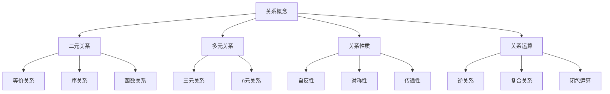
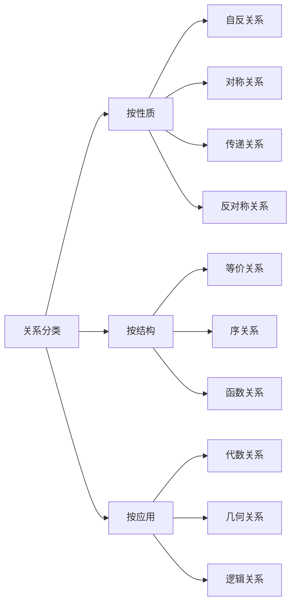
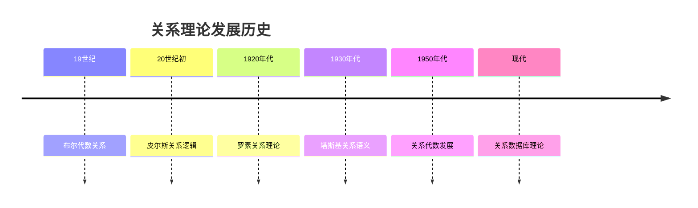
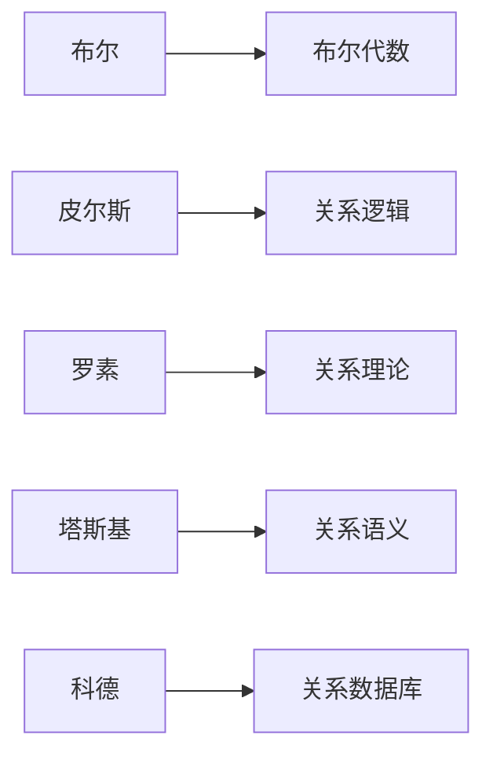
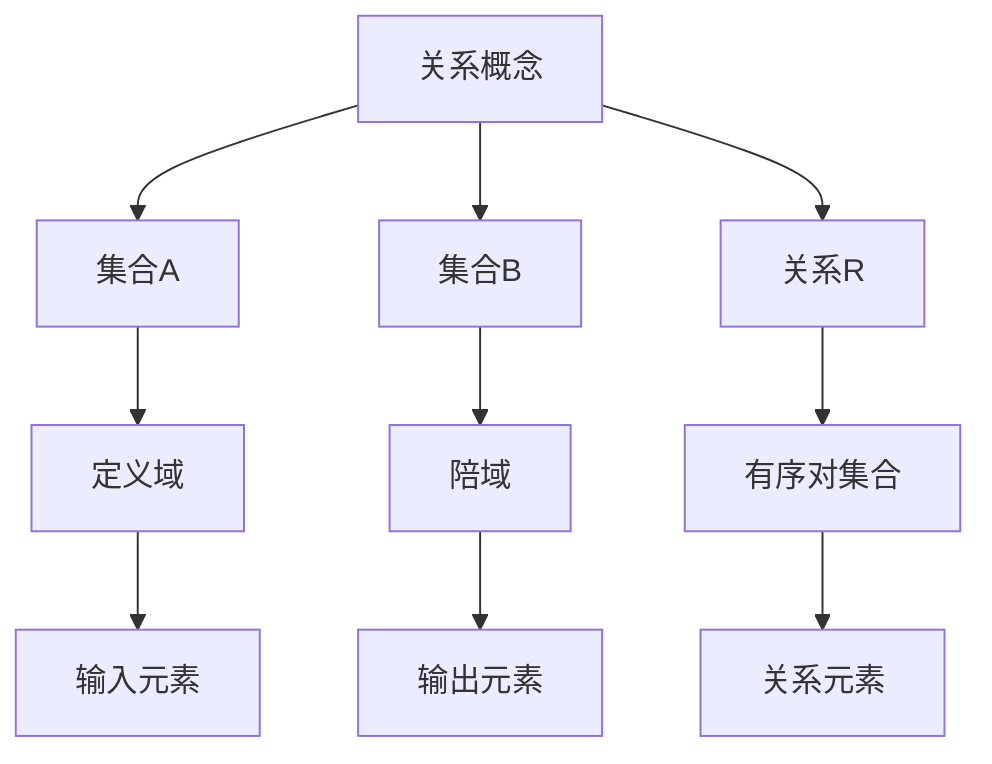
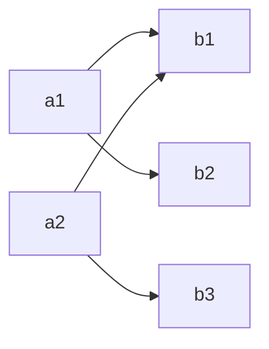
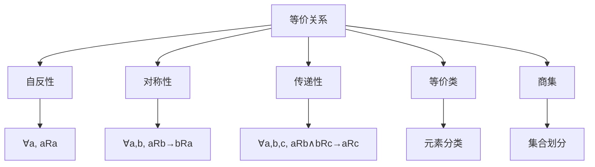
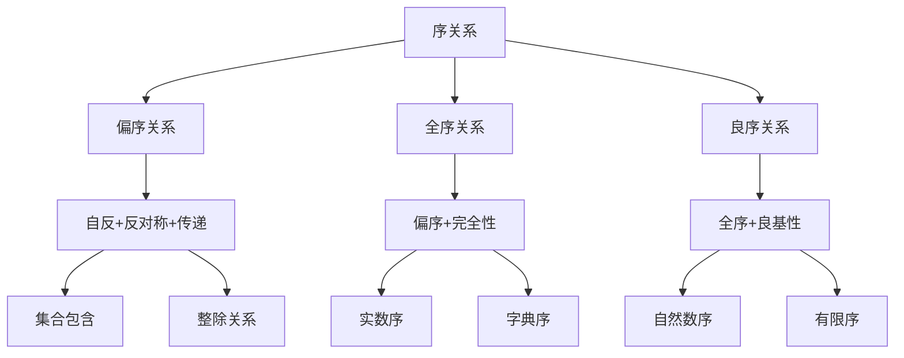
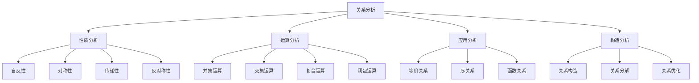
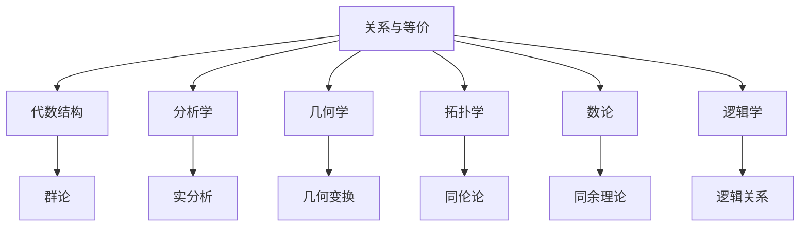

---
title: "04 关系与等价 增强版"
msc_primary: ["03E20"]
msc_secondary: ["03E99"]
---

# 4. 关系与等价 / Relations and Equivalence

## 目录

- [4. 关系与等价 / Relations and Equivalence](#4-关系与等价--relations-and-equivalence)
  - [目录](#目录)
  - [4.1 概述 / Overview](#41-概述--overview)
    - [4.1.1 关系概念体系](#411-关系概念体系)
    - [4.1.2 关系分类体系](#412-关系分类体系)
  - [4.2 历史发展 / Historical Development](#42-历史发展--historical-development)
    - [4.2.1 关系理论发展时间线](#421-关系理论发展时间线)
    - [4.2.2 重要人物贡献](#422-重要人物贡献)
    - [4.2.3 理论发展脉络](#423-理论发展脉络)
  - [4.3 基本概念 / Basic Concepts](#43-基本概念--basic-concepts)
    - [4.3.1 关系定义](#431-关系定义)
    - [4.3.2 关系表示方法](#432-关系表示方法)
    - [4.3.3 关系运算](#433-关系运算)
  - [4.4 关系性质 / Relation Properties](#44-关系性质--relation-properties)
    - [4.4.1 自反性](#441-自反性)
    - [4.4.2 对称性](#442-对称性)
    - [4.4.3 传递性](#443-传递性)
    - [4.4.4 反对称性](#444-反对称性)
    - [4.4.5 关系性质总结](#445-关系性质总结)
  - [4.5 等价关系 / Equivalence Relations](#45-等价关系--equivalence-relations)
    - [4.5.1 等价关系定义](#451-等价关系定义)
    - [4.5.2 等价类](#452-等价类)
    - [4.5.3 商集](#453-商集)
    - [4.5.4 等价关系性质](#454-等价关系性质)
  - [4.6 序关系 / Order Relations](#46-序关系--order-relations)
    - [4.6.1 偏序关系](#461-偏序关系)
    - [4.6.2 全序关系](#462-全序关系)
    - [4.6.3 良序关系](#463-良序关系)
    - [4.6.4 序关系层次](#464-序关系层次)
  - [4.7 闭包运算 / Closure Operations](#47-闭包运算--closure-operations)
    - [4.7.1 自反闭包](#471-自反闭包)
    - [4.7.2 对称闭包](#472-对称闭包)
    - [4.7.3 传递闭包](#473-传递闭包)
    - [4.7.4 闭包运算性质](#474-闭包运算性质)
  - [4.8 应用实例 / Application Examples](#48-应用实例--application-examples)
    - [4.8.1 计算机科学应用](#481-计算机科学应用)
    - [4.8.2 代数应用](#482-代数应用)
    - [4.8.3 几何应用](#483-几何应用)
    - [4.8.4 逻辑学应用](#484-逻辑学应用)
  - [4.9 思维过程 / Thinking Process](#49-思维过程--thinking-process)
    - [4.9.1 关系分析思维](#491-关系分析思维)
    - [4.9.2 等价关系构造思维](#492-等价关系构造思维)
    - [4.9.3 序关系分析思维](#493-序关系分析思维)
  - [4.10 总结 / Summary](#410-总结--summary)
    - [4.10.1 核心要点](#4101-核心要点)
    - [4.10.2 知识关联](#4102-知识关联)
    - [4.10.3 进一步学习](#4103-进一步学习)
  - [术语对照表 / Terminology Table](#术语对照表--terminology-table)

## 4.1 概述 / Overview

关系是集合论的重要概念，描述了集合元素之间的联系。等价关系和序关系是关系理论的核心，在数学的各个分支中都有重要应用。

### 4.1.1 关系概念体系



### 4.1.2 关系分类体系



## 4.2 历史发展 / Historical Development

### 4.2.1 关系理论发展时间线



### 4.2.2 重要人物贡献



### 4.2.3 理论发展脉络

**阶段 1** (19世纪)：布尔代数

- 布尔建立逻辑代数
- 关系作为逻辑运算
- 集合论基础建立

**阶段 2** (20世纪初)：关系逻辑

- 皮尔斯发展关系逻辑
- 关系演算系统
- 形式化关系理论

**阶段 3** (20世纪中期)：关系代数

- 关系代数理论发展
- 关系数据库理论
- 关系程序设计

**阶段 4** (现代)：应用发展

- 关系数据库广泛应用
- 关系编程语言
- 关系机器学习

## 4.3 基本概念 / Basic Concepts

### 4.3.1 关系定义

**定义 4.1** (二元关系 / Binary Relation)
设 $A, B$ 为集合，$A$ 到 $B$ 的二元关系是 $A \times B$ 的子集：
$$R \subseteq A \times B$$

**形式化定义**：
$$R: A \rightarrow B \text{ 是关系 } \leftrightarrow R \subseteq A \times B$$

**概念图示**：



### 4.3.2 关系表示方法

**方法 1**：集合表示
$$R = \{(a, b) : a \in A, b \in B, \text{条件}\}$$

**方法 2**：矩阵表示
对于有限集合，可以用矩阵表示关系：
$$M_{ij} = \begin{cases} 1 & \text{如果 } (a_i, b_j) \in R \\ 0 & \text{否则} \end{cases}$$

**方法 3**：图表示



**实例 4.1** (关系实例)
设 $A = \{1, 2, 3\}, B = \{a, b\}$：

- $R = \{(1, a), (2, b), (3, a)\}$ 是一个关系
- 矩阵表示：$\begin{pmatrix} 1 & 0 \\ 0 & 1 \\ 1 & 0 \end{pmatrix}$

### 4.3.3 关系运算

**定义 4.2** (关系运算)
设 $R, S$ 是 $A$ 到 $B$ 的关系：

- **并集**：$R \cup S = \{(a, b) : (a, b) \in R \vee (a, b) \in S\}$
- **交集**：$R \cap S = \{(a, b) : (a, b) \in R \wedge (a, b) \in S\}$
- **差集**：$R \setminus S = \{(a, b) : (a, b) \in R \wedge (a, b) \notin S\}$
- **补集**：$R^c = \{(a, b) : (a, b) \notin R\}$

**实例 4.2** (关系运算)
设 $R = \{(1, a), (2, b)\}, S = \{(2, b), (3, a)\}$：

- $R \cup S = \{(1, a), (2, b), (3, a)\}$
- $R \cap S = \{(2, b)\}$
- $R \setminus S = \{(1, a)\}$

## 4.4 关系性质 / Relation Properties

### 4.4.1 自反性

**定义 4.3** (自反关系 / Reflexive Relation)
关系 $R$ 在集合 $A$ 上是自反的，当且仅当：
$$\forall a \in A, (a, a) \in R$$

**实例 4.3** (自反关系)

- 相等关系：$R = \{(a, a) : a \in A\}$
- 小于等于关系：$\leq$ 在实数集上是自反的

**反例 4.1** (非自反关系)

- 小于关系：$<$ 在实数集上不是自反的
- 父子关系：不是自反的

### 4.4.2 对称性

**定义 4.4** (对称关系 / Symmetric Relation)
关系 $R$ 在集合 $A$ 上是对称的，当且仅当：
$$\forall a, b \in A, (a, b) \in R \rightarrow (b, a) \in R$$

**实例 4.4** (对称关系)

- 相等关系：是对称的
- 朋友关系：是对称的

**反例 4.2** (非对称关系)

- 小于关系：$<$ 不是对称的
- 父子关系：不是对称的

### 4.4.3 传递性

**定义 4.5** (传递关系 / Transitive Relation)
关系 $R$ 在集合 $A$ 上是传递的，当且仅当：
$$\forall a, b, c \in A, (a, b) \in R \wedge (b, c) \in R \rightarrow (a, c) \in R$$

**实例 4.5** (传递关系)

- 小于关系：$<$ 是传递的
- 包含关系：$\subseteq$ 是传递的

**反例 4.3** (非传递关系)

- 朋友关系：不是传递的（朋友的朋友不一定是朋友）

### 4.4.4 反对称性

**定义 4.6** (反对称关系 / Antisymmetric Relation)
关系 $R$ 在集合 $A$ 上是反对称的，当且仅当：
$$\forall a, b \in A, (a, b) \in R \wedge (b, a) \in R \rightarrow a = b$$

**实例 4.6** (反对称关系)

- 小于等于关系：$\leq$ 是反对称的
- 包含关系：$\subseteq$ 是反对称的

### 4.4.5 关系性质总结

```mermaid
graph TD
    A[关系性质] --> B[自反性]
    A --> C[对称性]
    A --> D[传递性]
    A --> E[反对称性]

    B --> F[∀a, (a,a)∈R]
    C --> G[∀a,b, (a,b)∈R→(b,a)∈R]
    D --> H[∀a,b,c, (a,b)∈R∧(b,c)∈R→(a,c)∈R]
    E --> I[∀a,b, (a,b)∈R∧(b,a)∈R→a=b]
```

## 4.5 等价关系 / Equivalence Relations

### 4.5.1 等价关系定义

**定义 4.7** (等价关系 / Equivalence Relation)
关系 $R$ 在集合 $A$ 上是等价关系，当且仅当它是自反、对称和传递的。

**实例 4.7** (等价关系)

- 模 $n$ 同余关系：$a \equiv b \pmod{n}$
- 集合的相等关系：$A = B$
- 三角形的相似关系：$\triangle ABC \sim \triangle DEF$

### 4.5.2 等价类

**定义 4.8** (等价类 / Equivalence Class)
设 $R$ 是集合 $A$ 上的等价关系，元素 $a \in A$ 的等价类是：
$$[a]_R = \{b \in A : (a, b) \in R\}$$

**实例 4.8** (等价类)
模 $3$ 同余关系的等价类：

- $[0]_3 = \{0, 3, 6, 9, \ldots\}$
- $[1]_3 = \{1, 4, 7, 10, \ldots\}$
- $[2]_3 = \{2, 5, 8, 11, \ldots\}$

### 4.5.3 商集

**定义 4.9** (商集 / Quotient Set)
设 $R$ 是集合 $A$ 上的等价关系，$A$ 关于 $R$ 的商集是：
$$A/R = \{[a]_R : a \in A\}$$

**实例 4.9** (商集)
整数集关于模 $3$ 同余关系的商集：

- $\mathbb{Z}/3\mathbb{Z} = \{[0]_3, [1]_3, [2]_3\}$

### 4.5.4 等价关系性质



## 4.6 序关系 / Order Relations

### 4.6.1 偏序关系

**定义 4.10** (偏序关系 / Partial Order)
关系 $R$ 在集合 $A$ 上是偏序关系，当且仅当它是自反、反对称和传递的。

**实例 4.10** (偏序关系)

- 集合的包含关系：$\subseteq$
- 整数的整除关系：$|$
- 实数的小于等于关系：$\leq$

### 4.6.2 全序关系

**定义 4.11** (全序关系 / Total Order)
偏序关系 $R$ 在集合 $A$ 上是全序关系，当且仅当：
$$\forall a, b \in A, (a, b) \in R \vee (b, a) \in R$$

**实例 4.11** (全序关系)

- 实数的小于等于关系：$\leq$
- 字典序：按字母顺序排列

**反例 4.4** (非全序关系)

- 集合的包含关系：$\subseteq$ 不是全序的
- 整数的整除关系：$|$ 不是全序的

### 4.6.3 良序关系

**定义 4.12** (良序关系 / Well Order)
全序关系 $R$ 在集合 $A$ 上是良序关系，当且仅当 $A$ 的每个非空子集都有最小元素。

**实例 4.12** (良序关系)

- 自然数集的小于关系：$<$
- 有限全序集

### 4.6.4 序关系层次



## 4.7 闭包运算 / Closure Operations

### 4.7.1 自反闭包

**定义 4.13** (自反闭包 / Reflexive Closure)
关系 $R$ 的自反闭包是包含 $R$ 的最小自反关系：
$$r(R) = R \cup \{(a, a) : a \in A\}$$

**实例 4.13** (自反闭包)
设 $R = \{(1, 2), (2, 3)\}$：

- $r(R) = \{(1, 1), (1, 2), (2, 2), (2, 3), (3, 3)\}$

### 4.7.2 对称闭包

**定义 4.14** (对称闭包 / Symmetric Closure)
关系 $R$ 的对称闭包是包含 $R$ 的最小对称关系：
$$s(R) = R \cup R^{-1}$$

其中 $R^{-1} = \{(b, a) : (a, b) \in R\}$。

**实例 4.14** (对称闭包)
设 $R = \{(1, 2), (2, 3)\}$：

- $s(R) = \{(1, 2), (2, 1), (2, 3), (3, 2)\}$

### 4.7.3 传递闭包

**定义 4.15** (传递闭包 / Transitive Closure)
关系 $R$ 的传递闭包是包含 $R$ 的最小传递关系：
$$t(R) = \bigcup_{n=1}^{\infty} R^n$$

其中 $R^n$ 是 $R$ 的 $n$ 次复合。

**实例 4.15** (传递闭包)
设 $R = \{(1, 2), (2, 3)\}$：

- $R^2 = \{(1, 3)\}$
- $t(R) = \{(1, 2), (2, 3), (1, 3)\}$

### 4.7.4 闭包运算性质

```mermaid
graph TD
    A[闭包运算] --> B[自反闭包r(R)]
    A --> C[对称闭包s(R)]
    A --> D[传递闭包t(R)]
    A --> E[等价闭包e(R)]

    B --> F[添加自反对]
    C --> G[添加逆关系]
    D --> H[添加传递对]
    E --> I[自反+对称+传递]

    F --> J[最小自反关系]
    G --> K[最小对称关系]
    H --> L[最小传递关系]
    I --> M[最小等价关系]
```

## 4.8 应用实例 / Application Examples

### 4.8.1 计算机科学应用

**实例 4.16** (数据库关系)
关系数据库基于关系理论：

- 表是关系的实例
- 外键是关系约束
- 查询是关系运算

**实例 4.17** (图论应用)
图论中的关系：

- 顶点集上的邻接关系
- 路径关系
- 连通关系

### 4.8.2 代数应用

**实例 4.18** (群论中的等价关系)
群论中的共轭关系：

- $a \sim b$ 当且仅当存在 $g \in G$ 使得 $b = gag^{-1}$
- 这是等价关系
- 等价类是共轭类

**实例 4.19** (环论中的理想)
环中的理想关系：

- 包含关系是偏序关系
- 生成理想关系
- 商环构造

### 4.8.3 几何应用

**实例 4.20** (几何变换)
几何变换中的关系：

- 相似变换是等价关系
- 全等变换是等价关系
- 变换的复合关系

**实例 4.21** (拓扑学中的同伦)
拓扑学中的同伦关系：

- 路径同伦是等价关系
- 空间同伦等价
- 同伦群构造

### 4.8.4 逻辑学应用

**实例 4.22** (逻辑等价)
命题逻辑中的等价关系：

- 逻辑等价是等价关系
- 重言式等价类
- 矛盾式等价类

**实例 4.23** (模态逻辑)
模态逻辑中的关系：

- 可达关系
- 等价关系
- 序关系

## 4.9 思维过程 / Thinking Process

### 4.9.1 关系分析思维



### 4.9.2 等价关系构造思维

**等价关系构造步骤**：

1. **明确需求**：确定需要什么样的等价关系
2. **选择性质**：确定等价关系的性质
3. **构造关系**：根据性质构造关系
4. **验证等价性**：验证是否满足等价关系条件
5. **分析结构**：分析等价类和商集结构

### 4.9.3 序关系分析思维

**序关系分析过程**：

1. **识别序关系**：判断是否为序关系
2. **分析性质**：分析序关系的性质
3. **确定类型**：确定是偏序、全序还是良序
4. **研究结构**：研究序关系的结构
5. **应用分析**：分析在应用中的作用

## 4.10 总结 / Summary

### 4.10.1 核心要点

- 关系是描述集合元素间联系的数学工具
- 等价关系提供了集合分类的方法
- 序关系建立了集合的层次结构
- 闭包运算提供了关系构造的工具

### 4.10.2 知识关联



### 4.10.3 进一步学习

- 深入学习关系代数
- 研究范畴论中的关系
- 探索关系数据库理论
- 学习关系编程语言

---

*本文档展示了关系与等价的多表征方式，包括符号表征、图表表征、实例表征、历史发展表征、应用场景表征和思维过程表征，为深入理解关系理论提供了全面的视角。*

## 术语对照表 / Terminology Table

| 中文 | English |
|---|---|
| 关系 | Relation |
| 自反/对称/传递 | Reflexive/Symmetric/Transitive |
| 等价关系/等价类 | Equivalence relation/Class |
| 分割 | Partition |
| 偏序/全序 | Partial/Total order |
| 上界/下界 | Upper/Lower bound |
