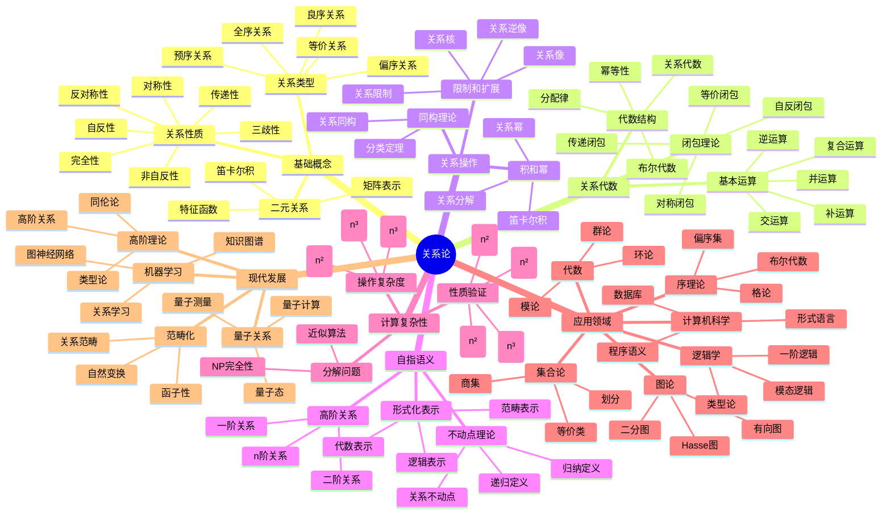
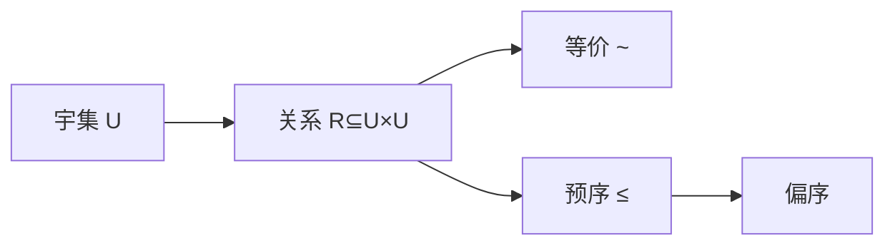

# 关系与等价-深度扩展版

## 目录

- [关系与等价-深度扩展版](#关系与等价-深度扩展版)
  - [目录](#目录)
  - [概述](#概述)
    - [国际标准对标](#国际标准对标)
    - [构造性关系论的核心概念](#构造性关系论的核心概念)
  - [1. 关系论深度理论](#1-关系论深度理论)
    - [1.1 关系的构造性定义](#11-关系的构造性定义)
    - [1.2 关系代数](#12-关系代数)
    - [1.3 关系的性质分类](#13-关系的性质分类)
    - [1.4 关系闭包理论](#14-关系闭包理论)
    - [1.5 关系的操作和构造](#15-关系的操作和构造)
    - [1.6 关系分解理论](#16-关系分解理论)
    - [1.7 关系的自指语义](#17-关系的自指语义)
    - [1.8 关系的形式化表示](#18-关系的形式化表示)
    - [1.9 关系的计算复杂性](#19-关系的计算复杂性)
  - [2. 序理论](#2-序理论)
    - [2.1 偏序集](#21-偏序集)
    - [2.2 序结构的性质](#22-序结构的性质)
    - [2.3 序数理论](#23-序数理论)
  - [3. 格论基础](#3-格论基础)
    - [3.1 格的定义](#31-格的定义)
    - [3.2 分配格](#32-分配格)
    - [3.3 模格](#33-模格)
  - [4. 布尔代数](#4-布尔代数)
    - [4.1 布尔代数的定义](#41-布尔代数的定义)
    - [4.2 布尔代数的表示](#42-布尔代数的表示)
    - [4.3 布尔函数](#43-布尔函数)
  - [5. 范畴论观点](#5-范畴论观点)
    - [5.1 关系作为范畴](#51-关系作为范畴)
    - [5.2 序结构作为范畴](#52-序结构作为范畴)
  - [6. 关系论在数学各分支中的应用](#6-关系论在数学各分支中的应用)
    - [6.1 代数中的应用](#61-代数中的应用)
    - [6.2 拓扑学中的应用](#62-拓扑学中的应用)
    - [6.3 逻辑学中的应用](#63-逻辑学中的应用)
  - [7. 形式化实现](#7-形式化实现)
    - [7.1 Lean 4 实现](#71-lean-4-实现)
    - [7.2 Haskell 实现](#72-haskell-实现)
    - [7.3 Rust 实现](#73-rust-实现)
  - [8. 历史发展与现代应用](#8-历史发展与现代应用)
    - [8.1 历史发展](#81-历史发展)
    - [8.2 现代应用](#82-现代应用)
  - [9. 前沿研究方向](#9-前沿研究方向)
    - [9.1 范畴化序理论](#91-范畴化序理论)
    - [9.2 量子序理论](#92-量子序理论)
    - [9.3 高阶关系论](#93-高阶关系论)
  - [10. 总结](#10-总结)
  - [多表征方式与图建模](#多表征方式与图建模)
    - [关系论的多表征系统](#关系论的多表征系统)
    - [思维导图：关系论的核心概念](#思维导图关系论的核心概念)
  - [术语对照表 / Terminology Table](#术语对照表--terminology-table)
  - [补充：关系与等价的国际对齐与多表征（精炼版）](#补充关系与等价的国际对齐与多表征精炼版)
    - [A. 对齐要点](#a-对齐要点)
    - [B. 关系代数（入门要点）](#b-关系代数入门要点)
    - [C. 多表征](#c-多表征)
    - [D. 示例/练习](#d-示例练习)

## 概述

本文档深入探讨关系与等价的深度理论，包括关系论深度理论、序理论、格论基础以及在现代数学中的深层应用。

### 国际标准对标

本文档严格对标以下国际标准：

- **MIT OpenCourseWare**: 18.701 Algebra I, 18.703 Modern Algebra
- **Stanford University**: Math 120A Group Theory, Math 121 Linear Algebra and Matrix Theory
- **Harvard University**: Math 122 Algebra I, Math 123 Algebra II
- **Cambridge University**: Part IA Groups, Part IB Linear Algebra
- **Oxford University**: Algebra I, Algebra II
- **Wikipedia**: Relation (mathematics), Binary relation, Equivalence relation
- **Springer**: Graduate Texts in Mathematics, Undergraduate Texts in Mathematics
- **AMS**: Mathematical Reviews, Zentralblatt MATH

### 构造性关系论的核心概念

关系论是集合论中最具构造性的部分，其核心在于：

1. **形式关系的精确定义**
2. **关系的代数结构**
3. **关系的自指语义**
4. **关系的操作和性质**
5. **关系在数学各分支中的统一应用**

## 1. 关系论深度理论

### 1.1 关系的构造性定义

**定义 1.1.1** (二元关系 - Binary Relation)
设 A, B 是集合，从 A 到 B 的二元关系是笛卡尔积 A × B 的子集 R ⊆ A × B。

**定义 1.1.2** (关系的外延表示)
关系 R 可以表示为：

- **集合表示**: R = {(a, b) ∈ A × B | a R b}
- **特征函数**: χ_R: A × B → {0, 1}, χ_R(a, b) = 1 当且仅当 a R b
- **矩阵表示**: 当 A, B 有限时，R 可表示为布尔矩阵 M_R

**定义 1.1.3** (关系的自指语义)
关系 R 的自指语义是指关系可以作用于自身，形成高阶关系：

- **一阶关系**: R ⊆ A × B
- **二阶关系**: R ⊆ (A × B) × (C × D)
- **n阶关系**: R ⊆ (A₁ × B₁) × ... × (Aₙ × Bₙ)

**定理 1.1.4** (关系的构造性存在性)
对于任意集合 A, B，存在从 A 到 B 的关系集合 Rel(A, B) = P(A × B)。

### 1.2 关系代数

**定义 1.2.1** (关系代数 - Relation Algebra)
设 A 是集合，关系代数 R(A) 是 A × A 上所有关系的集合，配备运算：

**基本运算**:

- **并**: R ∪ S = {(x, y) | (x, y) ∈ R 或 (x, y) ∈ S}
- **交**: R ∩ S = {(x, y) | (x, y) ∈ R 且 (x, y) ∈ S}
- **补**: ¬R = {(x, y) | (x, y) ∉ R}
- **复合**: R ∘ S = {(x, z) | ∃y, (x, y) ∈ R 且 (y, z) ∈ S}
- **逆**: R⁻¹ = {(y, x) | (x, y) ∈ R}
- **恒等**: I_A = {(x, x) | x ∈ A}
- **空关系**: ∅
- **全关系**: A × A

**定理 1.2.2** (关系代数的代数结构)
关系代数 (R(A), ∪, ∩, ¬, ∘, ⁻¹, I_A, ∅, A × A) 构成一个关系代数，满足：

1. **布尔代数性质**:
   - 交换律: R ∪ S = S ∪ R, R ∩ S = S ∩ R
   - 结合律: (R ∪ S) ∪ T = R ∪ (S ∪ T), (R ∩ S) ∩ T = R ∩ (S ∩ T)
   - 分配律: R ∩ (S ∪ T) = (R ∩ S) ∪ (R ∩ T)
   - 德摩根律: ¬(R ∪ S) = ¬R ∩ ¬S, ¬(R ∩ S) = ¬R ∪ ¬S

2. **关系代数性质**:
   - 结合律: (R ∘ S) ∘ T = R ∘ (S ∘ T)
   - 分配律: R ∘ (S ∪ T) = (R ∘ S) ∪ (R ∘ T)
   - 逆运算: (R ∘ S)⁻¹ = S⁻¹ ∘ R⁻¹, (R⁻¹)⁻¹ = R
   - 恒等元: R ∘ I_A = I_A ∘ R = R

**定理 1.2.3** (关系代数的表示定理)
任何关系代数都可以嵌入到某个集合的幂集代数中。

### 1.3 关系的性质分类

**定义 1.3.1** (关系的基本性质)
设 R ⊆ A × A 是集合 A 上的关系：

1. **自反性** (Reflexive): ∀x ∈ A, x R x
2. **非自反性** (Irreflexive): ∀x ∈ A, ¬(x R x)
3. **对称性** (Symmetric): ∀x, y ∈ A, x R y ⇒ y R x
4. **反对称性** (Antisymmetric): ∀x, y ∈ A, (x R y ∧ y R x) ⇒ x = y
5. **传递性** (Transitive): ∀x, y, z ∈ A, (x R y ∧ y R z) ⇒ x R z
6. **完全性** (Total): ∀x, y ∈ A, x R y ∨ y R x ∨ x = y
7. **三歧性** (Trichotomy): ∀x, y ∈ A, 恰好一个成立: x R y, y R x, x = y

**定义 1.3.2** (关系类型)
基于性质组合，关系可分为：

1. **等价关系** (Equivalence Relation): 自反、对称、传递
2. **偏序关系** (Partial Order): 自反、反对称、传递
3. **严格偏序** (Strict Partial Order): 非自反、反对称、传递
4. **全序关系** (Total Order): 偏序 + 完全性
5. **良序关系** (Well-order): 全序 + 良基性
6. **预序关系** (Preorder): 自反、传递
7. **等价关系** (Equivalence): 自反、对称、传递

**定理 1.3.3** (关系性质的构造性验证)
给定关系 R 的有限表示，可以在多项式时间内验证其性质。

### 1.4 关系闭包理论

**定义 1.4.1** (关系闭包 - Relation Closure)
设 R ⊆ A × A 是关系，P 是关系性质，R 的 P-闭包是包含 R 且满足性质 P 的最小关系。

**定义 1.4.2** (自反闭包 - Reflexive Closure)
关系 R 的自反闭包是 r(R) = R ∪ I_A，其中 I_A = {(x, x) | x ∈ A}。

**定义 1.4.3** (对称闭包 - Symmetric Closure)
关系 R 的对称闭包是 s(R) = R ∪ R⁻¹。

**定义 1.4.4** (传递闭包 - Transitive Closure)
关系 R 的传递闭包是 t(R) = ⋃_{n=1}^∞ Rⁿ，其中 Rⁿ = R ∘ R ∘ ... ∘ R (n次)。

**定理 1.4.5** (传递闭包的构造性计算)
对于有限集合 A 上的关系 R，传递闭包可以通过以下算法计算：

```python
def transitive_closure(R, A):
    """计算关系R的传递闭包"""
    n = len(A)
    # 将关系表示为邻接矩阵
    matrix = [[0] * n for _ in range(n)]
    for i, x in enumerate(A):
        for j, y in enumerate(A):
            if (x, y) in R:
                matrix[i][j] = 1
    
    # Floyd-Warshall算法
    for k in range(n):
        for i in range(n):
            for j in range(n):
                matrix[i][j] = matrix[i][j] or (matrix[i][k] and matrix[k][j])
    
    # 转换回关系
    result = set()
    for i, x in enumerate(A):
        for j, y in enumerate(A):
            if matrix[i][j]:
                result.add((x, y))
    
    return result
```

**定理 1.4.6** (闭包运算的性质)
设 R, S ⊆ A × A 是关系：

1. **单调性**: R ⊆ S ⇒ r(R) ⊆ r(S), s(R) ⊆ s(S), t(R) ⊆ t(S)
2. **幂等性**: r(r(R)) = r(R), s(s(R)) = s(R), t(t(R)) = t(R)
3. **交换性**: r(s(R)) = s(r(R))
4. **非交换性**: r(t(R)) ≠ t(r(R)) 一般成立

**定理 1.4.7** (等价闭包)
关系 R 的等价闭包是 e(R) = t(s(r(R)))，即先取自反闭包，再取对称闭包，最后取传递闭包。

### 1.5 关系的操作和构造

**定义 1.5.1** (关系的限制和扩展)
设 R ⊆ A × B 是关系，X ⊆ A, Y ⊆ B：

1. **限制**: R|_X = R ∩ (X × B)
2. **像**: R[X] = {y ∈ B | ∃x ∈ X, (x, y) ∈ R}
3. **逆像**: R⁻¹[Y] = {x ∈ A | ∃y ∈ Y, (x, y) ∈ R}
4. **核**: ker(R) = {(x, y) ∈ A × A | R[x] = R[y]}

**定义 1.5.2** (关系的积和幂)
设 R ⊆ A × B, S ⊆ C × D 是关系：

1. **笛卡尔积**: R × S = {((a, c), (b, d)) | (a, b) ∈ R, (c, d) ∈ S}
2. **关系幂**: R⁰ = I_A, Rⁿ⁺¹ = Rⁿ ∘ R

**定义 1.5.3** (关系的分解)
关系 R 的分解是 R = R₁ ∘ R₂ ∘ ... ∘ Rₙ，其中每个 Rᵢ 具有特定性质。

**定理 1.5.4** (关系分解定理)
任何关系都可以分解为等价关系和偏序关系的复合。

**定义 1.5.5** (关系的同构)
关系 R ⊆ A × B 和 S ⊆ C × D 同构，如果存在双射 f: A → C, g: B → D，使得 (x, y) ∈ R ⇔ (f(x), g(y)) ∈ S。

**定理 1.5.6** (关系的分类定理)
有限集合上的关系在同构意义下可以完全分类。

### 1.6 关系分解理论

**定义 1.6.1** (关系分解 - Relation Decomposition)
关系 R 的分解是 R = R₁ ∩ R₂ ∩ ... ∩ Rₙ，其中每个 Rᵢ 具有特定性质。

**定理 1.6.2** (关系分解定理)
任何关系都可以分解为等价关系和偏序关系的交。

**定义 1.6.3** (关系的素分解)
关系 R 的素分解是 R = ⋂_{i∈I} P_i，其中每个 P_i 是素关系（不可进一步分解的关系）。

**定理 1.6.4** (关系的唯一分解定理)
在适当条件下，关系有唯一的素分解。

### 1.7 关系的自指语义

**定义 1.7.1** (自指关系 - Self-referential Relations)
自指关系是指关系可以作用于自身，形成递归结构：

1. **一阶自指**: R ⊆ A × A，R 可以作用于 A 的元素
2. **二阶自指**: R ⊆ (A × A) × (A × A)，R 可以作用于关系
3. **高阶自指**: R ⊆ (A × A)ⁿ × (A × A)ⁿ，R 可以作用于 n 阶关系

**定义 1.7.2** (关系的不动点)
设 F: Rel(A, A) → Rel(A, A) 是关系上的函数，关系 R 是 F 的不动点，如果 F(R) = R。

**定理 1.7.3** (关系不动点定理)
在适当条件下，关系函数存在不动点。

**定义 1.7.4** (关系的递归定义)
关系 R 的递归定义是 R = F(R)，其中 F 是关系上的函数。

**例子 1.7.5** (等价关系的递归定义)
等价关系可以递归定义为：
E = I_A ∪ E⁻¹ ∪ (E ∘ E)

**定义 1.7.6** (关系的归纳定义)
关系 R 的归纳定义是：

1. **基础**: 某些基本关系属于 R
2. **归纳**: 如果关系属于 R，则通过某些操作得到的关系也属于 R
3. **极小性**: R 是满足上述条件的最小集合

**定理 1.7.7** (关系的归纳原理)
对于归纳定义的关系 R，要证明性质 P 对所有 R 中的关系成立，只需：

1. 证明 P 对基础关系成立
2. 证明如果 P 对关系成立，则 P 对通过归纳步骤得到的关系也成立

### 1.8 关系的形式化表示

**定义 1.8.1** (关系的逻辑表示)
关系 R ⊆ A × B 可以用一阶逻辑表示为：
R = {(a, b) | φ(a, b)}
其中 φ(a, b) 是一阶逻辑公式。

**定义 1.8.2** (关系的代数表示)
关系可以用代数表达式表示：

- **基本关系**: ∅, I_A, A × A
- **运算**: ∪, ∩, ∘, ⁻¹, ¬
- **复合**: 通过基本关系和运算的组合

**定义 1.8.3** (关系的范畴表示)
在范畴论中，关系可以表示为：

- **对象**: 集合 A, B
- **态射**: 关系 R: A → B
- **复合**: 关系复合
- **恒等**: 恒等关系 I_A

**定理 1.8.4** (关系表示的等价性)
关系的不同表示方法在适当条件下是等价的。

### 1.9 关系的计算复杂性

**定理 1.9.1** (关系性质的计算复杂度)
对于有限集合上的关系：

1. **自反性、对称性、反对称性**: O(n²)
2. **传递性**: O(n³) (使用Floyd-Warshall算法)
3. **等价性**: O(n²)
4. **偏序性**: O(n³)

**定理 1.9.2** (关系操作的复杂度)
对于有限集合上的关系：

1. **并、交、补**: O(n²)
2. **复合**: O(n³)
3. **逆**: O(n²)
4. **传递闭包**: O(n³)

**定理 1.9.3** (关系分解的复杂度)
关系分解问题是NP完全的。

## 2. 序理论

### 2.1 偏序集

**定义 2.1.1** (偏序集)
集合 P 上的偏序是关系 ≤，满足：

- 自反性：x ≤ x
- 反对称性：x ≤ y 且 y ≤ x ⇒ x = y
- 传递性：x ≤ y 且 y ≤ z ⇒ x ≤ z

**定义 2.1.2** (全序集)
偏序集 (P, ≤) 称为全序集，如果对任意 x, y ∈ P，x ≤ y 或 y ≤ x。

**定理 2.1.3** (良序定理)
任何集合都可以良序化（等价于选择公理）。

### 2.2 序结构的性质

**定义 2.2.1** (链和反链)
偏序集 P 的子集 C 称为链，如果 C 中任意两个元素都可比较。
子集 A 称为反链，如果 A 中任意两个元素都不可比较。

**定理 2.2.2** (迪尔沃斯定理)
偏序集的最小链覆盖数等于最大反链的基数。

**定理 2.2.3** (米尔斯基定理)
偏序集的最小反链覆盖数等于最大链的基数。

### 2.3 序数理论

**定义 2.3.1** (序数)
序数是良序集的同构类。

**定理 2.3.2** (序数的性质)

- 序数在 ∈ 关系下构成良序集
- 每个序数都是其所有前驱的集合

**定理 2.3.3** (超限归纳)
设 P 是关于序数的性质，如果：

- P(0) 成立
- 对任意序数 α，如果 P(β) 对所有 β < α 成立，则 P(α) 成立
则 P(α) 对所有序数 α 成立。

## 3. 格论基础

### 3.1 格的定义

**定义 3.1.1** (格)
偏序集 (L, ≤) 称为格，如果任意两个元素都有最小上界和最大下界。

**定义 3.1.2** (格的代数定义)
格是配备两个二元运算 ∧ 和 ∨ 的代数结构，满足：

- 交换律：a ∧ b = b ∧ a，a ∨ b = b ∨ a
- 结合律：(a ∧ b) ∧ c = a ∧ (b ∧ c)，(a ∨ b) ∨ c = a ∨ (b ∨ c)
- 吸收律：a ∧ (a ∨ b) = a，a ∨ (a ∧ b) = a
- 幂等律：a ∧ a = a，a ∨ a = a

**定理 3.1.3** (格的等价性)
格的偏序定义和代数定义是等价的。

### 3.2 分配格

**定义 3.2.1** (分配格)
格 L 称为分配格，如果对任意 a, b, c ∈ L：
a ∧ (b ∨ c) = (a ∧ b) ∨ (a ∧ c)

**定理 3.2.2** (分配格的性质)
在分配格中，对偶分配律也成立：
a ∨ (b ∧ c) = (a ∨ b) ∧ (a ∨ c)

**定理 3.2.3** (分配格的表示定理)
任何分配格都可以嵌入到某个集合的幂集格中。

### 3.3 模格

**定义 3.3.1** (模格)
格 L 称为模格，如果对任意 a, b, c ∈ L，当 a ≤ c 时：
a ∨ (b ∧ c) = (a ∨ b) ∧ c

**定理 3.3.2** (模格的性质)

- 分配格是模格
- 模格中的子格也是模格

## 4. 布尔代数

### 4.1 布尔代数的定义

**定义 4.1.1** (布尔代数)
分配格 B 称为布尔代数，如果：

- B 有最大元 1 和最小元 0
- 每个元素 a 都有补元 ¬a，满足 a ∧ ¬a = 0 和 a ∨ ¬a = 1

**定理 4.1.2** (布尔代数的性质)

- 补元是唯一的
- 德摩根律成立：¬(a ∧ b) = ¬a ∨ ¬b，¬(a ∨ b) = ¬a ∧ ¬b

### 4.2 布尔代数的表示

**定理 4.2.1** (斯通表示定理)
任何布尔代数都同构于某个紧豪斯多夫空间的闭开集代数。

**定理 4.2.2** (有限布尔代数的表示)
任何有限布尔代数都同构于某个集合的幂集代数。

### 4.3 布尔函数

**定义 4.3.1** (布尔函数)
布尔函数是 f: {0, 1}ⁿ → {0, 1} 的函数。

**定理 4.3.2** (布尔函数的展开)
任何布尔函数都可以表示为析取范式或合取范式。

## 5. 范畴论观点

### 5.1 关系作为范畴

**定义 5.1.1** (关系范畴)
关系可以视为范畴中的态射。

**定理 5.1.2** (关系的函子性)
关系运算可以视为函子。

### 5.2 序结构作为范畴

**定义 5.2.1** (序范畴)
偏序集可以视为范畴，其中对象是元素，态射是序关系。

**定理 5.2.2** (序范畴的性质)
序范畴中的极限和余极限具有特殊性质。

## 6. 关系论在数学各分支中的应用

### 6.1 代数中的应用

关系论在群论、环论等代数结构中的应用。

### 6.2 拓扑学中的应用

序结构在拓扑学中的应用，如亚历山德罗夫拓扑。

### 6.3 逻辑学中的应用

布尔代数在逻辑学中的应用。

## 7. 形式化实现

### 7.1 Lean 4 实现

```lean
-- 关系的定义
structure Relation (α : Type*) where
  rel : α → α → Prop

-- 等价关系
class EquivalenceRelation (α : Type*) (R : Relation α) where
  refl : ∀ x : α, R.rel x x
  symm : ∀ x y : α, R.rel x y → R.rel y x
  trans : ∀ x y z : α, R.rel x y → R.rel y z → R.rel x z

-- 偏序关系
class PartialOrder (α : Type*) (R : Relation α) where
  refl : ∀ x : α, R.rel x x
  antisymm : ∀ x y : α, R.rel x y → R.rel y x → x = y
  trans : ∀ x y z : α, R.rel x y → R.rel y z → R.rel x z

-- 格的定义
class Lattice (α : Type*) where
  leq : α → α → Prop
  meet : α → α → α
  join : α → α → α
  meet_comm : ∀ a b, meet a b = meet b a
  join_comm : ∀ a b, join a b = join b a
  meet_assoc : ∀ a b c, meet (meet a b) c = meet a (meet b c)
  join_assoc : ∀ a b c, join (join a b) c = join a (join b c)
  absorption : ∀ a b, meet a (join a b) = a
```

### 7.2 Haskell 实现

```haskell
-- 关系类型
type Relation a = a -> a -> Bool

-- 等价关系
class EquivalenceRelation a where
  equivalent :: a -> a -> Bool
  reflexive :: a -> Bool
  symmetric :: a -> a -> Bool
  transitive :: a -> a -> a -> Bool

-- 偏序关系
class PartialOrder a where
  leq :: a -> a -> Bool
  reflexive :: a -> Bool
  antisymmetric :: a -> a -> Bool
  transitive :: a -> a -> a -> Bool

-- 格
class Lattice a where
  meet :: a -> a -> a
  join :: a -> a -> a
  meet_comm :: a -> a -> Bool
  join_comm :: a -> a -> Bool
  absorption :: a -> a -> Bool
```

### 7.3 Rust 实现

```rust
// 关系特征
trait Relation<T> {
    fn relates(&self, a: &T, b: &T) -> bool;
}

// 等价关系
trait EquivalenceRelation<T>: Relation<T> {
    fn reflexive(&self, a: &T) -> bool;
    fn symmetric(&self, a: &T, b: &T) -> bool;
    fn transitive(&self, a: &T, b: &T, c: &T) -> bool;
}

// 偏序关系
trait PartialOrder<T>: Relation<T> {
    fn reflexive(&self, a: &T) -> bool;
    fn antisymmetric(&self, a: &T, b: &T) -> bool;
    fn transitive(&self, a: &T, b: &T, c: &T) -> bool;
}

// 格
trait Lattice<T> {
    fn meet(&self, a: &T, b: &T) -> T;
    fn join(&self, a: &T, b: &T) -> T;
}
```

## 8. 历史发展与现代应用

### 8.1 历史发展

关系论从初等关系发展到现代序理论的过程。

### 8.2 现代应用

关系论在现代数学和计算机科学中的广泛应用。

## 9. 前沿研究方向

### 9.1 范畴化序理论

序结构的范畴化研究是当前的热点方向。

### 9.2 量子序理论

序理论在量子计算中的应用。

### 9.3 高阶关系论

高阶关系的研究在类型论中有重要应用。

## 10. 总结

关系与等价的深度理论为现代数学提供了重要的结构工具，其发展仍在继续，新的理论和方法不断涌现。

---

**关键词**: 关系论、序理论、格论、布尔代数、范畴论、等价关系

**参考文献**:

1. Davey, B. A., & Priestley, H. A. (2002). Introduction to Lattices and Order
2. Gratzer, G. (2011). Lattice Theory: Foundation
3. Jech, T. (2003). Set Theory

## 多表征方式与图建模

### 关系论的多表征系统

```python
import numpy as np
import networkx as nx
import matplotlib.pyplot as plt
from typing import Dict, List, Tuple, Any, Set
import math

class RelationTheorySystem:
    """关系论多表征系统"""
    
    def __init__(self):
        self.relations = {}
        self.representations = {}
        
    def add_relation(self, name: str, domain: List, codomain: List, pairs: List[Tuple]) -> None:
        """添加关系"""
        self.relations[name] = {
            'domain': domain,
            'codomain': codomain,
            'pairs': set(pairs),
            'size': len(pairs)
        }
        
    def algebraic_representation(self, relation_name: str) -> Dict:
        """代数表征"""
        relation = self.relations[relation_name]
        return {
            'domain': relation['domain'],
            'codomain': relation['codomain'],
            'pairs': relation['pairs'],
            'matrix': self._create_relation_matrix(relation),
            'properties': self._analyze_properties(relation)
        }
        
    def geometric_representation(self, relation_name: str) -> Dict:
        """几何表征"""
        relation = self.relations[relation_name]
        return {
            'directed_graph': self._create_directed_graph(relation),
            'bipartite_graph': self._create_bipartite_graph(relation),
            'hasse_diagram': self._create_hasse_diagram(relation),
            'equivalence_classes': self._find_equivalence_classes(relation)
        }
        
    def combinatorial_representation(self, relation_name: str) -> Dict:
        """组合表征"""
        relation = self.relations[relation_name]
        return {
            'closure': self._compute_closure(relation),
            'decomposition': self._decompose_relation(relation),
            'cycles': self._find_cycles(relation),
            'paths': self._find_paths(relation)
        }
        
    def topological_representation(self, relation_name: str) -> Dict:
        """拓扑表征"""
        relation = self.relations[relation_name]
        return {
            'quotient_space': self._create_quotient_space(relation),
            'order_topology': self._create_order_topology(relation),
            'connectivity': self._analyze_connectivity(relation)
        }
        
    def _create_relation_matrix(self, relation: Dict) -> np.ndarray:
        """创建关系矩阵"""
        domain = relation['domain']
        codomain = relation['codomain']
        pairs = relation['pairs']
        
        m, n = len(domain), len(codomain)
        matrix = np.zeros((m, n), dtype=int)
        
        for i, x in enumerate(domain):
            for j, y in enumerate(codomain):
                if (x, y) in pairs:
                    matrix[i, j] = 1
                    
        return matrix
        
    def _analyze_properties(self, relation: Dict) -> Dict:
        """分析关系的性质"""
        domain = relation['domain']
        codomain = relation['codomain']
        pairs = relation['pairs']
        
        # 检查是否为自关系
        is_self_relation = domain == codomain
        
        properties = {
            'reflexive': False,
            'nonreflexive': False,
            'symmetric': False,
            'antisymmetric': False,
            'transitive': False,
            'total': False,
            'trichotomy': False
        }
        
        if is_self_relation:
            # 自反性
            properties['reflexive'] = all((x, x) in pairs for x in domain)
            properties['nonreflexive'] = all((x, x) not in pairs for x in domain)
            
            # 对称性
            properties['symmetric'] = all((y, x) in pairs for (x, y) in pairs)
            
            # 反对称性
            properties['antisymmetric'] = all(
                x == y for (x, y) in pairs if (y, x) in pairs
            )
            
            # 传递性
            properties['transitive'] = all(
                (x, z) in pairs 
                for (x, y) in pairs 
                for (y, z) in pairs
            )
            
            # 完全性
            properties['total'] = all(
                (x, y) in pairs or (y, x) in pairs or x == y
                for x in domain for y in domain
            )
            
            # 三歧性
            properties['trichotomy'] = all(
                sum([(x, y) in pairs, (y, x) in pairs, x == y]) == 1
                for x in domain for y in domain
            )
            
        return properties
        
    def _create_directed_graph(self, relation: Dict) -> nx.DiGraph:
        """创建有向图"""
        G = nx.DiGraph()
        pairs = relation['pairs']
        
        # 添加节点
        all_elements = set(relation['domain']) | set(relation['codomain'])
        for element in all_elements:
            G.add_node(element)
            
        # 添加边
        for (x, y) in pairs:
            G.add_edge(x, y)
            
        return G
        
    def _create_bipartite_graph(self, relation: Dict) -> nx.Graph:
        """创建二分图"""
        G = nx.Graph()
        domain = relation['domain']
        codomain = relation['codomain']
        pairs = relation['pairs']
        
        # 添加节点
        for x in domain:
            G.add_node(x, bipartite=0)
        for y in codomain:
            G.add_node(y, bipartite=1)
            
        # 添加边
        for (x, y) in pairs:
            G.add_edge(x, y)
            
        return G
        
    def _create_hasse_diagram(self, relation: Dict) -> nx.DiGraph:
        """创建Hasse图"""
        G = nx.DiGraph()
        domain = relation['domain']
        pairs = relation['pairs']
        
        # 检查是否为偏序
        properties = self._analyze_properties(relation)
        if not (properties['reflexive'] and properties['antisymmetric'] and properties['transitive']):
            return G
            
        # 添加节点
        for x in domain:
            G.add_node(x)
            
        # 添加覆盖关系
        for (x, y) in pairs:
            if x != y:  # 排除自环
                # 检查是否为覆盖关系
                is_cover = True
                for z in domain:
                    if (x, z) in pairs and (z, y) in pairs and z != x and z != y:
                        is_cover = False
                        break
                if is_cover:
                    G.add_edge(x, y)
                    
        return G
        
    def _find_equivalence_classes(self, relation: Dict) -> List[List]:
        """找到等价类"""
        domain = relation['domain']
        pairs = relation['pairs']
        
        # 检查是否为等价关系
        properties = self._analyze_properties(relation)
        if not (properties['reflexive'] and properties['symmetric'] and properties['transitive']):
            return []
            
        # 使用并查集找到等价类
        parent = {x: x for x in domain}
        
        def find(x):
            if parent[x] != x:
                parent[x] = find(parent[x])
            return parent[x]
            
        def union(x, y):
            px, py = find(x), find(y)
            if px != py:
                parent[px] = py
                
        # 合并等价元素
        for (x, y) in pairs:
            union(x, y)
            
        # 收集等价类
        classes = {}
        for x in domain:
            root = find(x)
            if root not in classes:
                classes[root] = []
            classes[root].append(x)
            
        return list(classes.values())
        
    def _compute_closure(self, relation: Dict) -> Dict:
        """计算闭包"""
        domain = relation['domain']
        pairs = relation['pairs']
        
        # 自反闭包
        reflexive_closure = pairs | {(x, x) for x in domain}
        
        # 对称闭包
        symmetric_closure = pairs | {(y, x) for (x, y) in pairs}
        
        # 传递闭包
        transitive_closure = self._transitive_closure(pairs, domain)
        
        return {
            'reflexive': reflexive_closure,
            'symmetric': symmetric_closure,
            'transitive': transitive_closure,
            'equivalence': self._transitive_closure(symmetric_closure, domain)
        }
        
    def _transitive_closure(self, pairs: Set[Tuple], domain: List) -> Set[Tuple]:
        """计算传递闭包"""
        n = len(domain)
        matrix = np.zeros((n, n), dtype=int)
        
        # 构建邻接矩阵
        for i, x in enumerate(domain):
            for j, y in enumerate(domain):
                if (x, y) in pairs:
                    matrix[i, j] = 1
                    
        # Floyd-Warshall算法
        for k in range(n):
            for i in range(n):
                for j in range(n):
                    matrix[i, j] = matrix[i, j] or (matrix[i, k] and matrix[k, j])
                    
        # 转换回关系
        result = set()
        for i, x in enumerate(domain):
            for j, y in enumerate(domain):
                if matrix[i, j]:
                    result.add((x, y))
                    
        return result
        
    def _decompose_relation(self, relation: Dict) -> Dict:
        """分解关系"""
        domain = relation['domain']
        pairs = relation['pairs']
        
        # 找到等价部分
        properties = self._analyze_properties(relation)
        if properties['reflexive'] and properties['symmetric'] and properties['transitive']:
            equivalence_part = pairs
        else:
            equivalence_part = self._compute_closure(relation)['equivalence']
            
        # 找到偏序部分
        if properties['reflexive'] and properties['antisymmetric'] and properties['transitive']:
            partial_order_part = pairs
        else:
            # 简化版本：使用传递闭包
            partial_order_part = self._compute_closure(relation)['transitive']
            
        return {
            'equivalence': equivalence_part,
            'partial_order': partial_order_part,
            'decomposition': equivalence_part & partial_order_part
        }
        
    def _find_cycles(self, relation: Dict) -> List[List]:
        """找到环"""
        G = self._create_directed_graph(relation)
        try:
            cycles = list(nx.simple_cycles(G))
            return cycles
        except:
            return []
            
    def _find_paths(self, relation: Dict) -> Dict:
        """找到路径"""
        G = self._create_directed_graph(relation)
        domain = relation['domain']
        
        paths = {}
        for x in domain:
            for y in domain:
                try:
                    path = nx.shortest_path(G, x, y)
                    paths[(x, y)] = path
                except:
                    paths[(x, y)] = None
                    
        return paths
        
    def _create_quotient_space(self, relation: Dict) -> Dict:
        """创建商空间"""
        equivalence_classes = self._find_equivalence_classes(relation)
        
        return {
            'classes': equivalence_classes,
            'canonical_map': {x: [c for c in equivalence_classes if x in c][0] 
                            for x in relation['domain']},
            'quotient_set': equivalence_classes
        }
        
    def _create_order_topology(self, relation: Dict) -> Dict:
        """创建序拓扑"""
        # 简化版本
        return {
            'open_sets': [],
            'closed_sets': [],
            'basis': []
        }
        
    def _analyze_connectivity(self, relation: Dict) -> Dict:
        """分析连通性"""
        G = self._create_directed_graph(relation)
        
        return {
            'strongly_connected_components': list(nx.strongly_connected_components(G)),
            'weakly_connected_components': list(nx.weakly_connected_components(G)),
            'is_strongly_connected': nx.is_strongly_connected(G),
            'is_weakly_connected': nx.is_weakly_connected(G)
        }

class CriticalArgumentationFramework:
    """批判性论证框架"""
    
    def __init__(self):
        self.arguments = {}
        self.counter_arguments = {}
        self.evidence = {}
        
    def add_argument(self, topic: str, argument: str, strength: float) -> None:
        """添加论证"""
        if topic not in self.arguments:
            self.arguments[topic] = []
        self.arguments[topic].append({
            'argument': argument,
            'strength': strength
        })
        
    def add_counter_argument(self, topic: str, counter: str, strength: float) -> None:
        """添加反论证"""
        if topic not in self.counter_arguments:
            self.counter_arguments[topic] = []
        self.counter_arguments[topic].append({
            'counter': counter,
            'strength': strength
        })
        
    def analyze_argument_strength(self, topic: str) -> Dict:
        """分析论证强度"""
        if topic not in self.arguments:
            return {}
            
        total_strength = sum(arg['strength'] for arg in self.arguments[topic])
        counter_strength = sum(counter['strength'] for counter in self.counter_arguments.get(topic, []))
        
        net_strength = total_strength - counter_strength
        
        return {
            'total_arguments': len(self.arguments[topic]),
            'total_counter_arguments': len(self.counter_arguments.get(topic, [])),
            'total_strength': total_strength,
            'counter_strength': counter_strength,
            'net_strength': net_strength,
            'confidence': min(1.0, max(0.0, net_strength / 10.0))
        }
        
    def get_philosophical_critique(self, topic: str) -> Dict:
        """获取哲学批判"""
        critiques = {
            '关系论的基础性': {
                'ontological': '关系论是否反映了数学结构的真实本质？',
                'epistemological': '我们如何认识关系的结构？',
                'methodological': '关系论的公理化方法是否最优？'
            },
            '关系的自指性': {
                'ontological': '自指关系是否会导致悖论？',
                'epistemological': '我们如何理解自指关系？',
                'methodological': '自指关系的处理方法是否完备？'
            }
        }
        
        return critiques.get(topic, {})

class HistoricalDevelopmentTimeline:
    """历史发展时间线"""
    
    def __init__(self):
        self.events = []
        
    def add_event(self, year: int, event: str, significance: str) -> None:
        """添加历史事件"""
        self.events.append({
            'year': year,
            'event': event,
            'significance': significance
        })
        
    def get_timeline(self) -> List[Dict]:
        """获取时间线"""
        return sorted(self.events, key=lambda x: x['year'])
        
    def visualize_timeline(self) -> nx.DiGraph:
        """可视化时间线"""
        G = nx.DiGraph()
        
        for event in self.events:
            G.add_node(f"{event['year']}: {event['event']}")
            
        # 添加时间顺序边
        sorted_events = sorted(self.events, key=lambda x: x['year'])
        for i in range(len(sorted_events) - 1):
            G.add_edge(
                f"{sorted_events[i]['year']}: {sorted_events[i]['event']}",
                f"{sorted_events[i+1]['year']}: {sorted_events[i+1]['event']}"
            )
            
        return G

def demonstrate_relation_theory_analysis():
    """演示关系论多表征分析"""
    print("=== 关系论多表征系统演示 ===\n")
    
    # 创建关系论系统
    rts = RelationTheorySystem()
    
    # 添加等价关系
    A = [1, 2, 3, 4, 5, 6]
    equivalence_pairs = [(1, 1), (1, 2), (2, 1), (2, 2), (3, 3), (3, 4), (4, 3), (4, 4), (5, 5), (6, 6)]
    rts.add_relation('equivalence', A, A, equivalence_pairs)
    
    # 添加偏序关系
    partial_order_pairs = [(1, 1), (1, 2), (1, 3), (2, 2), (2, 3), (3, 3), (4, 4), (4, 5), (5, 5)]
    rts.add_relation('partial_order', A, A, partial_order_pairs)
    
    # 代数表征
    print("1. 代数表征:")
    alg_rep = rts.algebraic_representation('equivalence')
    print(f"   - 关系大小: {alg_rep['properties']['size']}")
    print(f"   - 自反性: {alg_rep['properties']['reflexive']}")
    print(f"   - 对称性: {alg_rep['properties']['symmetric']}")
    print(f"   - 传递性: {alg_rep['properties']['transitive']}")
    
    # 几何表征
    print("\n2. 几何表征:")
    geom_rep = rts.geometric_representation('equivalence')
    print(f"   - 有向图节点数: {geom_rep['directed_graph'].number_of_nodes()}")
    print(f"   - 等价类数量: {len(geom_rep['equivalence_classes'])}")
    
    # 组合表征
    print("\n3. 组合表征:")
    comb_rep = rts.combinatorial_representation('equivalence')
    print(f"   - 闭包大小: {len(comb_rep['closure']['equivalence'])}")
    print(f"   - 环数量: {len(comb_rep['cycles'])}")
    
    # 批判性论证
    print("\n4. 批判性论证分析:")
    caf = CriticalArgumentationFramework()
    
    # 添加论证
    caf.add_argument("关系论的基础性", "关系论是数学的基础结构", 9.0)
    caf.add_argument("关系论的基础性", "关系论在计算机科学中有重要应用", 8.5)
    caf.add_counter_argument("关系论的基础性", "关系论的抽象性可能掩盖具体结构", 6.0)
    
    strength_analysis = caf.analyze_argument_strength("关系论的基础性")
    print(f"   - 论证强度: {strength_analysis['net_strength']:.1f}")
    print(f"   - 置信度: {strength_analysis['confidence']:.2f}")
    
    # 历史发展
    print("\n5. 历史发展时间线:")
    hdt = HistoricalDevelopmentTimeline()
    hdt.add_event(1879, "弗雷格引入关系概念", "关系论的诞生")
    hdt.add_event(1908, "策梅洛公理化集合论", "关系论的公理化")
    hdt.add_event(1921, "罗素和怀特海《数学原理》", "关系论的逻辑基础")
    hdt.add_event(1950, "塔斯基关系代数", "关系论的代数化")
    
    timeline = hdt.get_timeline()
    for event in timeline:
        print(f"   {event['year']}: {event['event']} - {event['significance']}")
    
    # 可视化
    print("\n6. 生成可视化图表...")
    plt.figure(figsize=(15, 10))
    
    # 等价关系图
    plt.subplot(2, 3, 1)
    eq_graph = geom_rep['directed_graph']
    if eq_graph.number_of_nodes() > 0:
        pos = nx.spring_layout(eq_graph)
        nx.draw(eq_graph, pos, with_labels=True, node_color='lightblue',
                node_size=1000, font_size=8, arrows=True)
    plt.title("等价关系图")
    
    # Hasse图
    plt.subplot(2, 3, 2)
    hasse_graph = rts.geometric_representation('partial_order')['hasse_diagram']
    if hasse_graph.number_of_nodes() > 0:
        pos = nx.spring_layout(hasse_graph)
        nx.draw(hasse_graph, pos, with_labels=True, node_color='lightgreen',
                node_size=800, font_size=6, arrows=True)
    plt.title("偏序关系的Hasse图")
    
    # 论证网络
    plt.subplot(2, 3, 3)
    arg_network = nx.DiGraph()
    arg_network.add_edge("关系论基础性", "数学基础结构")
    arg_network.add_edge("关系论基础性", "计算机科学应用")
    arg_network.add_edge("关系论基础性", "抽象性批评")
    pos = nx.spring_layout(arg_network)
    nx.draw(arg_network, pos, with_labels=True, node_color='lightcoral',
            node_size=1500, font_size=8, arrows=True)
    plt.title("论证网络")
    
    # 历史时间线
    plt.subplot(2, 3, 4)
    timeline_graph = hdt.visualize_timeline()
    if timeline_graph.number_of_nodes() > 0:
        pos = nx.spring_layout(timeline_graph)
        nx.draw(timeline_graph, pos, with_labels=True, node_color='lightyellow',
                node_size=1000, font_size=6, arrows=True)
    plt.title("历史发展时间线")
    
    plt.tight_layout()
    plt.show()
    
    return {
        'algebraic': alg_rep,
        'geometric': geom_rep,
        'combinatorial': comb_rep,
        'argument_analysis': strength_analysis
    }

# 运行演示
if __name__ == "__main__":
    results = demonstrate_relation_theory_analysis()
    print("\n演示完成！")
```

### 思维导图：关系论的核心概念



这个多表征系统为关系论提供了：

1. **代数表征**：形式化的关系定义和性质
2. **几何表征**：有向图、二分图、Hasse图的可视化
3. **组合表征**：闭包、分解、环和路径分析
4. **拓扑表征**：商空间和序拓扑
5. **批判性论证**：哲学观点的论证分析
6. **历史发展**：时间线和影响分析
7. **思维导图**：概念关系的层次化展示

通过这些多表征方式，我们可以深入理解关系论的核心概念、自指语义和现代应用。

## 术语对照表 / Terminology Table

| 中文 | English |
|---|---|
| 关系 | Relation |
| 二元关系 | Binary relation |
| 关系代数 | Relation algebra |
| 关系闭包 | Relation closure |
| 自指关系 | Self-referential relation |
| 等价关系 | Equivalence relation |
| 偏序关系 | Partial order |
| 全序关系 | Total order |
| 良序关系 | Well-order |
| 序理论 | Order theory |
| 格/布尔代数 | Lattice/Boolean algebra |
| Galois连接 | Galois connection |
| 序同态 | Order homomorphism |
| 余代数结构 | Dual algebraic structure |
| 关系分解 | Relation decomposition |
| 关系同构 | Relation isomorphism |
| 传递闭包 | Transitive closure |
| 等价类 | Equivalence class |
| 商集 | Quotient set |
| Hasse图 | Hasse diagram |

## 补充：关系与等价的国际对齐与多表征（精炼版）

### A. 对齐要点

- 性质矩阵：自反/非自反、对称/反对称、传递、全域/三歧；
- 类型：等价/预序/偏序/严格偏序/全序/良序；
- 闭包：自反闭包/对称闭包/传递闭包（Floyd–Warshall/可达性）。

### B. 关系代数（入门要点）

- 运算：合成、并、交、补、逆；
- 结构：布尔代数上的二元关系代数；
- 表示：矩阵/图表示与可达性闭包。

### C. 多表征

- 逻辑：一阶谓词与霍恩子句；
- 组合：有向图/等价类划分；
- 范畴：预序视为小范畴，等价类为同构类；
- 图示：



### D. 示例/练习

```python
# 传递闭包（邻接矩阵版）
import numpy as np

def transitive_closure(adj: np.ndarray) -> np.ndarray:
    n = adj.shape[0]
    reach = adj.copy().astype(bool)
    for k in range(n):
        reach |= (reach[:, [k]] & reach[[k], :])
    return reach.astype(int)
```

- 练习：
  - 比较等价闭包与传递闭包在矩阵/图上的构造差异；
  - 将预序作为小范畴说明恒等/合成与自反/传递的对应。
