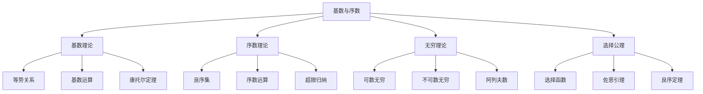
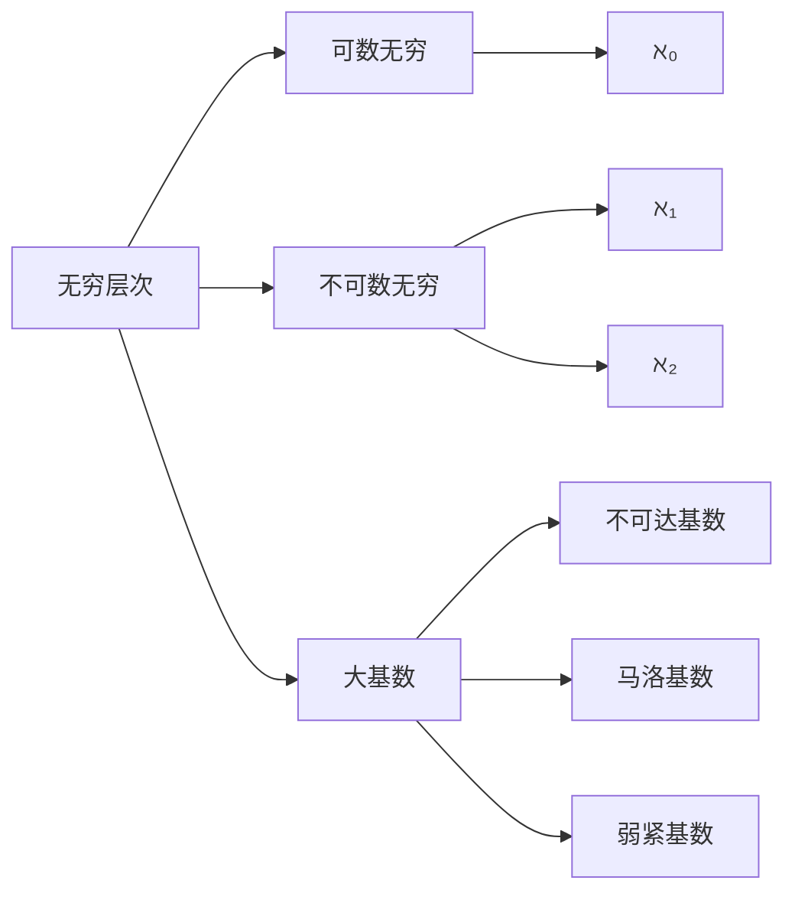
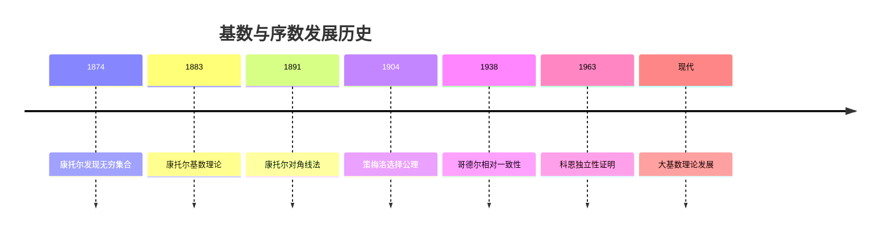
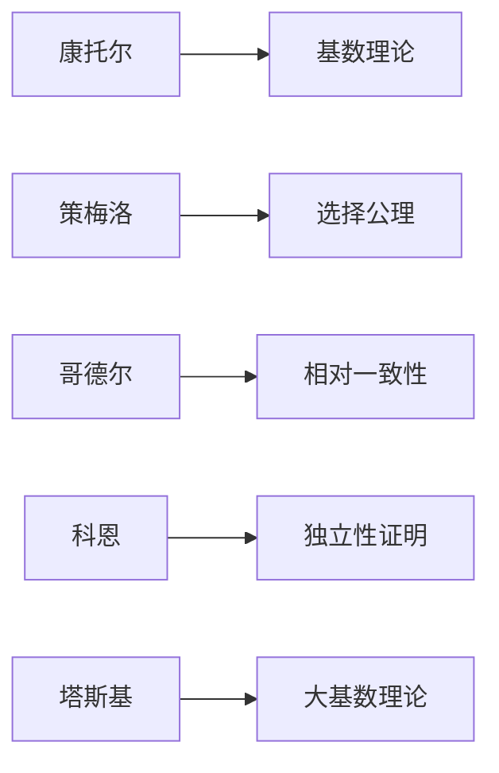
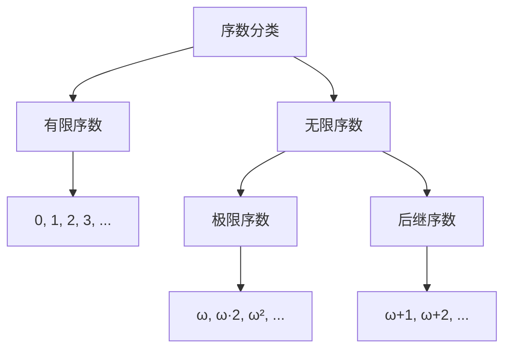
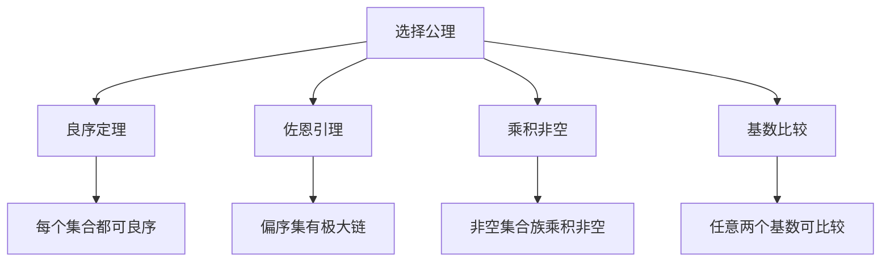
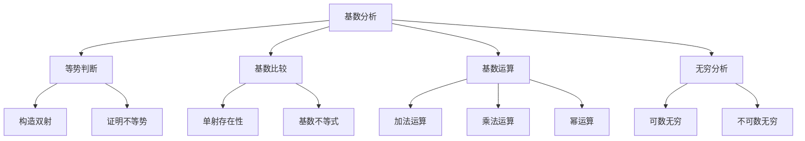
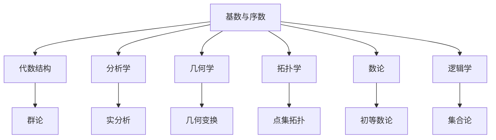

# 5. 基数与序数 / Cardinals and Ordinals

## 目录

- [5. 基数与序数 / Cardinals and Ordinals](#5-基数与序数--cardinals-and-ordinals)
  - [目录](#目录)
  - [5.1 概述 / Overview](#51-概述--overview)
    - [5.1.1 基数与序数概念体系](#511-基数与序数概念体系)
    - [5.1.2 无穷层次结构](#512-无穷层次结构)
  - [5.2 历史发展 / Historical Development](#52-历史发展--historical-development)
    - [5.2.1 基数与序数发展时间线](#521-基数与序数发展时间线)
    - [5.2.2 重要人物贡献](#522-重要人物贡献)
    - [5.2.3 理论发展脉络](#523-理论发展脉络)
  - [5.3 基数理论 / Cardinal Theory](#53-基数理论--cardinal-theory)
    - [5.3.1 等势关系](#531-等势关系)
    - [5.3.2 基数定义](#532-基数定义)
    - [5.3.3 基数运算](#533-基数运算)
    - [5.3.4 基数比较](#534-基数比较)
  - [5.4 序数理论 / Ordinal Theory](#54-序数理论--ordinal-theory)
    - [5.4.1 良序集](#541-良序集)
    - [5.4.2 序数定义](#542-序数定义)
    - [5.4.3 序数运算](#543-序数运算)
    - [5.4.4 序数分类](#544-序数分类)
  - [5.5 康托尔定理 / Cantor's Theorems](#55-康托尔定理--cantors-theorems)
    - [5.5.1 康托尔定理](#551-康托尔定理)
    - [5.5.2 康托尔-伯恩斯坦定理](#552-康托尔-伯恩斯坦定理)
    - [5.5.3 对角线法](#553-对角线法)
  - [5.6 选择公理 / Axiom of Choice](#56-选择公理--axiom-of-choice)
    - [5.6.1 选择公理](#561-选择公理)
    - [5.6.2 等价形式](#562-等价形式)
    - [5.6.3 选择公理的影响](#563-选择公理的影响)
  - [5.7 连续统假设 / Continuum Hypothesis](#57-连续统假设--continuum-hypothesis)
    - [5.7.1 连续统假设](#571-连续统假设)
    - [5.7.2 广义连续统假设](#572-广义连续统假设)
    - [5.7.3 独立性结果](#573-独立性结果)
  - [5.8 应用实例 / Application Examples](#58-应用实例--application-examples)
    - [5.8.1 数学分析应用](#581-数学分析应用)
    - [5.8.2 代数应用](#582-代数应用)
    - [5.8.3 拓扑学应用](#583-拓扑学应用)
    - [5.8.4 计算机科学应用](#584-计算机科学应用)
  - [5.9 思维过程 / Thinking Process](#59-思维过程--thinking-process)
    - [5.9.1 基数分析思维](#591-基数分析思维)
    - [5.9.2 序数分析思维](#592-序数分析思维)
    - [5.9.3 无穷思维过程](#593-无穷思维过程)
  - [5.10 总结 / Summary](#510-总结--summary)
    - [5.10.1 核心要点](#5101-核心要点)
    - [5.10.2 知识关联](#5102-知识关联)
    - [5.10.3 进一步学习](#5103-进一步学习)
  - [术语对照表 / Terminology Table](#术语对照表--terminology-table)

## 5.1 概述 / Overview

基数与序数是集合论的核心概念，分别描述了集合的"大小"和"顺序"。
基数理论处理集合的等势关系，序数理论处理良序集的结构。

### 5.1.1 基数与序数概念体系

### 5.1.2 无穷层次结构

## 5.2 历史发展 / Historical Development

### 5.2.1 基数与序数发展时间线

### 5.2.2 重要人物贡献

### 5.2.3 理论发展脉络

**阶段 1** (1874-1891)：康托尔时代

- 康托尔发现无穷集合的不同层次
- 建立基数理论基础
- 发现康托尔悖论

**阶段 2** (1904-1938)：公理化发展

- 策梅洛提出选择公理
- 弗兰克尔完善公理系统
- 哥德尔证明相对一致性

**阶段 3** (1938-1963)：独立性研究

- 科恩证明连续统假设独立性
- 大基数理论发展
- 内模型理论建立

**阶段 4** (1963-至今)：现代发展

- 大基数理论深入研究
- 描述集合论发展
- 集合论在数学中的应用

## 5.3 基数理论 / Cardinal Theory

### 5.3.1 等势关系

**定义 5.1** (等势 / Equinumerous)
两个集合 $A, B$ 等势，记作 $A \sim B$，当且仅当存在双射 $f: A \rightarrow B$。

**实例 5.1** (等势实例)

- $\mathbb{N} \sim \mathbb{Z}$：通过双射 $f(n) = \begin{cases} n/2 & \text{如果 } n \text{ 是偶数} \\ -(n+1)/2 & \text{如果 } n \text{ 是奇数} \end{cases}$
- $\mathbb{N} \sim \mathbb{Q}$：通过康托尔对角线法构造双射

**反例 5.1** (不等势实例)

- $\mathbb{N} \not\sim \mathbb{R}$：实数集不可数
- $\mathbb{N} \not\sim \mathcal{P}(\mathbb{N})$：幂集基数更大

### 5.3.2 基数定义

**定义 5.2** (基数 / Cardinal)
集合 $A$ 的基数是与 $A$ 等势的所有集合的等价类，记作 $|A|$。

**形式化定义**：
$$|A| = \{B : B \sim A\}$$

**实例 5.2** (基数实例)

- $|\emptyset| = 0$
- $|\{1, 2, 3\}| = 3$
- $|\mathbb{N}| = \aleph_0$
- $|\mathbb{R}| = \mathfrak{c}$

### 5.3.3 基数运算

**定义 5.3** (基数运算)
设 $\kappa, \lambda$ 为基数：

- **加法**：$\kappa + \lambda = |A \sqcup B|$，其中 $|A| = \kappa, |B| = \lambda$
- **乘法**：$\kappa \cdot \lambda = |A \times B|$，其中 $|A| = \kappa, |B| = \lambda$
- **幂运算**：$\kappa^\lambda = |A^B|$，其中 $|A| = \kappa, |B| = \lambda$

**实例 5.3** (基数运算)

- $\aleph_0 + \aleph_0 = \aleph_0$
- $\aleph_0 \cdot \aleph_0 = \aleph_0$
- $2^{\aleph_0} = \mathfrak{c}$

### 5.3.4 基数比较

**定义 5.4** (基数比较)
设 $\kappa, \lambda$ 为基数，$\kappa \leq \lambda$ 当且仅当存在单射 $f: A \rightarrow B$，其中 $|A| = \kappa, |B| = \lambda$。

**实例 5.4** (基数比较)

- $\aleph_0 < \mathfrak{c}$
- $\aleph_0 < \aleph_1$
- $\mathfrak{c} = 2^{\aleph_0}$

## 5.4 序数理论 / Ordinal Theory

### 5.4.1 良序集

**定义 5.5** (良序集 / Well-ordered Set)
集合 $A$ 与关系 $<$ 构成良序集 $(A, <)$，当且仅当：

1. $<$ 是全序关系
2. $A$ 的每个非空子集都有最小元素

**实例 5.5** (良序集)

- $(\mathbb{N}, <)$ 是良序集
- $(\{1, 2, 3\}, <)$ 是良序集
- $(\mathbb{Z}, <)$ 不是良序集（没有最小元素）

### 5.4.2 序数定义

**定义 5.6** (序数 / Ordinal)
序数是良序集的同构类。每个良序集都同构于唯一的序数。

**实例 5.6** (序数实例)

- $0 = \emptyset$
- $1 = \{0\}$
- $2 = \{0, 1\}$
- $\omega = \{0, 1, 2, \ldots\}$（自然数集）

### 5.4.3 序数运算

**定义 5.7** (序数运算)
设 $\alpha, \beta$ 为序数：

- **加法**：$\alpha + \beta$ 是 $\alpha$ 和 $\beta$ 的不交并
- **乘法**：$\alpha \cdot \beta$ 是 $\alpha$ 和 $\beta$ 的字典序积
- **幂运算**：$\alpha^\beta$ 是 $\beta$ 到 $\alpha$ 的函数集

**实例 5.7** (序数运算)

- $\omega + 1 = \{0, 1, 2, \ldots, \omega\}$
- $\omega \cdot 2 = \{0, 1, 2, \ldots, \omega, \omega+1, \omega+2, \ldots\}$
- $2^\omega = \omega$

### 5.4.4 序数分类

## 5.5 康托尔定理 / Cantor's Theorems

### 5.5.1 康托尔定理

**定理 5.1** (康托尔定理)
对于任意集合 $A$，$|A| < |\mathcal{P}(A)|$。

**证明思维过程**：

1. **理解问题**：证明幂集基数大于原集基数
2. **分析条件**：假设存在双射 $f: A \rightarrow \mathcal{P}(A)$
3. **构造矛盾**：考虑集合 $B = \{x \in A : x \notin f(x)\}$
4. **验证矛盾**：$B$ 不在 $f$ 的值域中
5. **得出结论**：不存在这样的双射

**实例 5.8** (康托尔定理应用)

- $|\mathbb{N}| < |\mathcal{P}(\mathbb{N})|$
- $|\mathbb{R}| = |\mathcal{P}(\mathbb{N})| = 2^{\aleph_0}$

### 5.5.2 康托尔-伯恩斯坦定理

**定理 5.2** (康托尔-伯恩斯坦定理)
如果 $|A| \leq |B|$ 且 $|B| \leq |A|$，则 $|A| = |B|$。

**实例 5.9** (康托尔-伯恩斯坦定理应用)
证明 $|\mathbb{N} \times \mathbb{N}| = |\mathbb{N}|$：

- 构造单射 $f: \mathbb{N} \rightarrow \mathbb{N} \times \mathbb{N}, f(n) = (n, 0)$
- 构造单射 $g: \mathbb{N} \times \mathbb{N} \rightarrow \mathbb{N}, g(m, n) = 2^m 3^n$
- 由康托尔-伯恩斯坦定理，$|\mathbb{N} \times \mathbb{N}| = |\mathbb{N}|$

### 5.5.3 对角线法

**实例 5.10** (对角线法)
证明实数集不可数：

- 假设 $[0, 1]$ 可数：$r_1, r_2, r_3, \ldots$
- 构造实数 $r$，其第 $n$ 位与 $r_n$ 的第 $n$ 位不同
- $r$ 不在列表中，矛盾

## 5.6 选择公理 / Axiom of Choice

### 5.6.1 选择公理

**公理 5.1** (选择公理 / Axiom of Choice)
对于任意非空集合族 $\{A_i\}_{i \in I}$，存在选择函数 $f: I \rightarrow \bigcup_{i \in I} A_i$，使得 $f(i) \in A_i$。

**实例 5.11** (选择公理应用)

- 从每个非空集合中选择一个元素
- 构造无穷序列
- 证明良序定理

### 5.6.2 等价形式

**定理 5.3** (选择公理等价形式)
以下命题等价：

1. 选择公理
2. 佐恩引理
3. 良序定理
4. 乘积非空

**实例 5.12** (佐恩引理应用)
证明每个向量空间都有基：

- 考虑所有线性无关子集
- 应用佐恩引理得到极大线性无关集
- 这就是向量空间的基

### 5.6.3 选择公理的影响

## 5.7 连续统假设 / Continuum Hypothesis

### 5.7.1 连续统假设

**假设 5.1** (连续统假设 / Continuum Hypothesis)
不存在基数 $\kappa$ 使得 $\aleph_0 < \kappa < \mathfrak{c}$。

**形式化表述**：
$$\mathfrak{c} = \aleph_1$$

### 5.7.2 广义连续统假设

**假设 5.2** (广义连续统假设 / Generalized Continuum Hypothesis)
对于任意序数 $\alpha$，$2^{\aleph_\alpha} = \aleph_{\alpha + 1}$。

**实例 5.13** (连续统假设实例)

- $\mathfrak{c} = \aleph_1$（连续统假设）
- $2^{\aleph_0} = \aleph_1$（广义连续统假设）
- $2^{\aleph_1} = \aleph_2$（广义连续统假设）

### 5.7.3 独立性结果

**定理 5.4** (哥德尔-科恩定理)
连续统假设相对于ZFC公理系统是独立的。

**证明思维过程**：

1. **哥德尔证明**：构造内模型 $L$，在其中连续统假设成立
2. **科恩证明**：使用强制法构造模型，在其中连续统假设不成立
3. **结论**：连续统假设既不能被证明，也不能被否证

## 5.8 应用实例 / Application Examples

### 5.8.1 数学分析应用

**实例 5.14** (实分析中的基数)
实分析中的基数应用：

- 可数集：$\mathbb{Q}$ 是可数的
- 不可数集：$\mathbb{R}$ 是不可数的
- 完美集：不可数完美集的基数是 $\mathfrak{c}$

**实例 5.15** (函数空间)
函数空间的基数：

- 连续函数空间：$C[0,1]$ 的基数是 $\mathfrak{c}$
- 可测函数空间：基数更大
- 所有函数空间：基数是 $2^{\mathfrak{c}}$

### 5.8.2 代数应用

**实例 5.16** (群论中的基数)
群论中的基数应用：

- 有限群：基数是自然数
- 无限群：可以是可数或不可数
- 自由群：可数生成自由群是可数的

**实例 5.17** (环论中的基数)
环论中的基数应用：

- 有限域：基数是素数幂
- 无限域：可以是可数或不可数
- 代数闭包：基数是 $\mathfrak{c}$

### 5.8.3 拓扑学应用

**实例 5.18** (拓扑空间中的基数)
拓扑空间中的基数：

- 可数紧致空间：每个可数开覆盖有有限子覆盖
- 可分空间：有可数稠密子集
- 第二可数空间：有可数基

**实例 5.19** (度量空间)
度量空间中的基数：

- 可分度量空间：基数是 $\mathfrak{c}$
- 紧致度量空间：基数是 $\mathfrak{c}$
- 完全度量空间：可以是任意基数

### 5.8.4 计算机科学应用

**实例 5.20** (计算理论中的基数)
计算理论中的基数：

- 可计算函数：可数多个
- 所有函数：不可数多个
- 停机问题：基于基数理论

**实例 5.21** (数据库理论)
数据库理论中的基数：

- 关系基数：元组数量
- 连接基数：笛卡尔积大小
- 查询优化：基于基数估计

## 5.9 思维过程 / Thinking Process

### 5.9.1 基数分析思维

### 5.9.2 序数分析思维

**序数分析步骤**：

1. **识别良序集**：判断是否为良序集
2. **确定序数**：找到对应的序数
3. **分析结构**：研究序数的结构
4. **进行运算**：执行序数运算
5. **应用结果**：在数学中应用

### 5.9.3 无穷思维过程

**理解无穷的步骤**：

1. **直观理解**：从有限到无穷的推广
2. **形式化定义**：建立严格的数学定义
3. **性质分析**：研究无穷的性质
4. **层次理解**：理解不同层次的无穷
5. **应用拓展**：在其他领域中的应用

## 5.10 总结 / Summary

### 5.10.1 核心要点

- 基数描述了集合的"大小"
- 序数描述了良序集的"顺序"
- 康托尔定理揭示了无穷的层次
- 选择公理在集合论中起关键作用
- 连续统假设是集合论的核心问题

### 5.10.2 知识关联

### 5.10.3 进一步学习

- 深入学习大基数理论
- 研究描述集合论
- 探索集合论在数学中的应用
- 学习模型论和证明论

---

*本文档展示了基数与序数的多表征方式，包括符号表征、图表表征、实例表征、历史发展表征、应用场景表征和思维过程表征，为深入理解无穷理论提供了全面的视角。*

## 术语对照表 / Terminology Table

| 中文 | English |
|---|---|
| 基数/序数 | Cardinal/Ordinal |
| 阿列夫数 | Aleph numbers |
| 基数算术/序数算术 | Cardinal/Ordinal arithmetic |
| 序型 | Order type |
| 连续统假设 | Continuum hypothesis |
