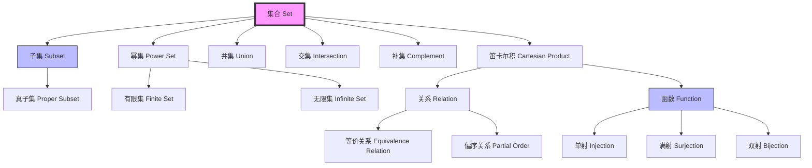
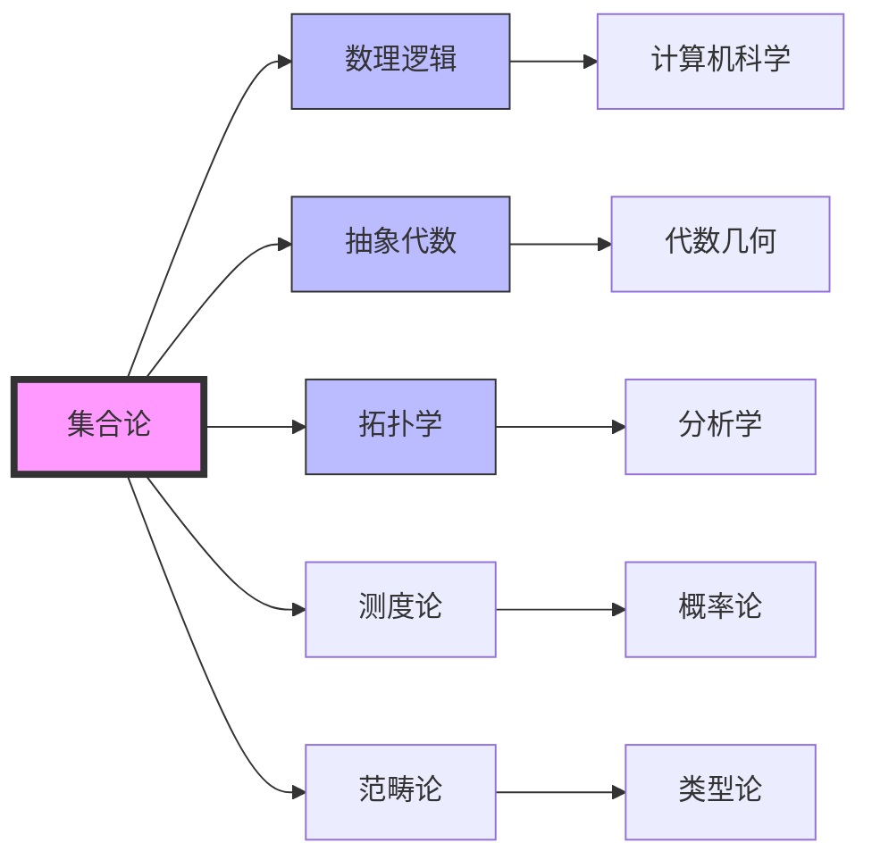
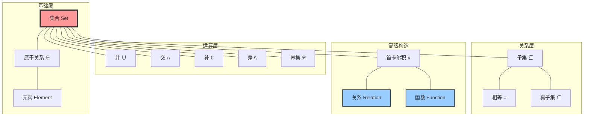

# 概念: 集合 (Set)

**主题编号**: B.01.01.01
**难度等级**: ⭐（入门级）
**前置概念**: 无
**后续概念**: 子集、并集、交集、函数、关系

---

## 概念深度解析

### 直观理解

集合是数学中最基础的概念之一，可以直观地理解为：**将一些确定的、彼此不同的对象汇集在一起形成的整体**。

**生活中的例子**:

- 一个班级的所有学生构成一个集合
- 图书馆的所有书籍构成一个集合
- 自然数 1, 2, 3, ... 构成一个集合

**关键特征**:

1. **确定性**: 任何一个对象，要么属于这个集合，要么不属于，界限清晰
2. **互异性**: 集合中的元素彼此不同，没有重复
3. **无序性**: 集合中的元素没有顺序之分

### 形式定义

**定义 1.1 (朴素集合论定义)**

集合是由某些确定的、彼此不同的对象（称为元素）组成的整体。若对象 $a$ 是集合 $A$ 的元素，记作 $a \in A$；若不是，记作 $a \notin A$。

**定义 1.2 (公理化集合论定义 - ZFC)**

在ZFC公理系统中，集合是通过以下方式构建的:

- 存在空集 $\emptyset$
- 对任意集合 $x, y$，存在集合 $\{x, y\}$（配对公理）
- 对任意集合 $x$，存在其幂集 $\mathcal{P}(x)$
- 等等（其他构造规则参见ZFC公理系统）

### 等价表述

从不同角度，集合可以等价地表述为:

| 视角 | 等价表述 |
|------|----------|
| **外延视角** | 集合完全由其元素决定，与元素顺序、重复无关 |
| **内涵视角** | 集合是具有某种特定性质的对象的全体 |
| **构造视角** | 集合是从空集出发，通过幂集运算和并集运算生成的对象 |

### 动机与背景

**为什么需要集合概念?**

1. **统一语言**: 集合论为整个数学提供了统一的语言和基础
2. **严格性**: 19世纪末，数学家们发现需要严格的基础来避免悖论（如罗素悖论）
3. **表达能力**: 集合可以表达几乎所有数学对象和结构

**历史发展**:

- **1874**: Cantor发表第一篇集合论论文，创立朴素集合论
- **1901**: Russell发现罗素悖论，揭示朴素集合论的矛盾
- **1908**: Zermelo提出Z公理系统
- **1922**: Fraenkel完善为ZFC公理系统，成为现代数学标准基础

---

## 属性与关系

### 核心性质

#### 性质 1: 外延性 (Extensionality)

**定理 1.1 (集合的外延性原理)**
两个集合相等当且仅当它们具有相同的元素。

$$A = B \iff \forall x (x \in A \leftrightarrow x \in B)$$

**证明**:

- $(\Rightarrow)$: 若 $A = B$，则显然元素相同
- $(\Leftarrow)$: 若元素相同，由外延公理得 $A = B$
$\square$

#### 性质 2: 空集的唯一性

**定理 1.2 (空集唯一)**
存在唯一的空集 $\emptyset$，它不包含任何元素。

**证明**:

- **存在性**: 由空集公理保证
- **唯一性**: 假设 $\emptyset_1$ 和 $\emptyset_2$ 都是空集，则它们具有相同的元素（都没有），由外延性得 $\emptyset_1 = \emptyset_2$
$\square$

#### 性质 3: 子集关系

**定义 1.3 (子集)**
集合 $A$ 是集合 $B$ 的子集，记作 $A \subseteq B$，如果:
$$\forall x (x \in A \rightarrow x \in B)$$

**定理 1.3 (子集与相等)**
$$A = B \iff A \subseteq B \land B \subseteq A$$

**证明**: 直接由外延性可得。$\square$

### 与其他概念的关系图



### 层次结构

```
集合论概念层次
│
├── 基础层
│   ├── 集合 (Set)
│   ├── 元素 (Element)
│   └── 属于关系 (∈)
│
├── 运算层
│   ├── 并集 (∪)
│   ├── 交集 (∩)
│   ├── 补集 (∁)
│   ├── 差集 (\)
│   └── 幂集 (𝒫)
│
├── 关系层
│   ├── 子集 (⊆)
│   ├── 相等 (=)
│   └── 真子集 (⊂)
│
└── 构造层
    ├── 笛卡尔积 (×)
    ├── 关系 (Relation)
    └── 函数 (Function)
```

---

## 示例与习题

### 基础示例

#### 示例 1: 列举法表示集合

**问题**: 用列举法表示以下集合:

1. 小于10的正偶数
2. 方程 $x^2 - 5x + 6 = 0$ 的解集

**解答**:

1. $\{2, 4, 6, 8\}$
2. 解方程: $(x-2)(x-3) = 0$，解集为 $\{2, 3\}$

#### 示例 2: 描述法表示集合

**问题**: 用描述法表示:

1. 所有正整数
2. 平面上单位圆上的点

**解答**:

1. $\{x \in \mathbb{Z} : x > 0\}$ 或 $\{x \in \mathbb{Z} \mid x > 0\}$
2. $\{(x, y) \in \mathbb{R}^2 : x^2 + y^2 = 1\}$

#### 示例 3: 验证子集关系

**问题**: 设 $A = \{1, 2, 3\}$，$B = \{1, 2, 3, 4, 5\}$，验证 $A \subseteq B$。

**解答**:
检查 $A$ 的每个元素:

- $1 \in B$ ✓
- $2 \in B$ ✓
- $3 \in B$ ✓

所有元素都属于 $B$，故 $A \subseteq B$。$\square$

#### 示例 4: 集合相等验证

**问题**: 证明 $\{x \in \mathbb{R} : x^2 = 4\} = \{-2, 2\}$。

**解答**:

- 左边 $\subseteq$ 右边: 若 $x^2 = 4$，则 $x = 2$ 或 $x = -2$
- 右边 $\subseteq$ 左边: $(-2)^2 = 4$ 且 $2^2 = 4$

由外延性，两集合相等。$\square$

#### 示例 5: 空集的性质

**问题**: 证明对于任意集合 $A$，有 $\emptyset \subseteq A$。

**解答**:
根据子集定义，需证 $\forall x (x \in \emptyset \rightarrow x \in A)$。

由于 $x \in \emptyset$ 恒假，条件命题恒真。故 $\emptyset \subseteq A$。$\square$

### 典型示例

#### 示例 6: 幂集计算

**问题**: 求 $A = \{1, 2, 3\}$ 的幂集 $\mathcal{P}(A)$。

**解答**:
$\mathcal{P}(A)$ 包含 $A$ 的所有子集:
$$\mathcal{P}(A) = \{\emptyset, \{1\}, \{2\}, \{3\}, \{1,2\}, \{1,3\}, \{2,3\}, \{1,2,3\}\}$$

共 $2^3 = 8$ 个元素。$\square$

#### 示例 7: 集合运算综合

**问题**: 设 $A = \{1, 2, 3, 4\}$，$B = \{3, 4, 5, 6\}$，求:

1. $A \cup B$
2. $A \cap B$
3. $A \setminus B$

**解答**:

1. $A \cup B = \{1, 2, 3, 4, 5, 6\}$
2. $A \cap B = \{3, 4\}$
3. $A \setminus B = \{1, 2\}$
$\square$

### 反例

#### 反例 1: 混淆 ∈ 和 ⊆

**常见误解**: 认为 $a \in A$ 和 $\{a\} \subseteq A$ 是一回事。

**澄清**:

- $2 \in \{1, 2, 3\}$ 是正确的
- $\{2\} \in \{1, 2, 3\}$ 是**错误的**（应为 $\{2\} \subseteq \{1, 2, 3\}$）

#### 反例 2: 认为集合可以包含自身

**罗素悖论**: 考虑 $R = \{x : x \notin x\}$。

**问题**: $R \in R$ 是否成立?

- 若 $R \in R$，则根据定义 $R \notin R$，矛盾!
- 若 $R \notin R$，则根据定义 $R \in R$，矛盾!

**教训**: 这导致朴素集合论被抛弃，转而使用ZFC等公理化集合论。

#### 反例 3: 忽略外延性

**错误**: 认为 $\{1, 2, 3\}$ 和 $\{3, 2, 1\}$ 是不同的集合。

**正确**: 根据外延性，它们是同一个集合，因为元素完全相同。

### 习题

#### 初级难度

**习题 1** (难度 ⭐)
用列举法表示下列集合:

1. 小于20的素数
2. $\{x \in \mathbb{Z} : -3 < x < 3\}$

<details>
<summary>解答</summary>

1. $\{2, 3, 5, 7, 11, 13, 17, 19\}$
2. $\{-2, -1, 0, 1, 2\}$

</details>

**习题 2** (难度 ⭐)
设 $A = \{a, b, c\}$，写出 $A$ 的所有子集。

<details>
<summary>解答</summary>

$\emptyset, \{a\}, \{b\}, \{c\}, \{a,b\}, \{a,c\}, \{b,c\}, \{a,b,c\}$
</details>

**习题 3** (难度 ⭐)
设 $A = \{1, 2, 3, 4\}$，$B = \{2, 4, 6\}$，求:

1. $A \cup B$
2. $A \cap B$
3. $A \setminus B$
4. $B \setminus A$

<details>
<summary>解答</summary>

1. $A \cup B = \{1, 2, 3, 4, 6\}$
2. $A \cap B = \{2, 4\}$
3. $A \setminus B = \{1, 3\}$
4. $B \setminus A = \{6\}$

</details>

#### 中级难度

**习题 4** (难度 ⭐⭐)
证明: $A \subseteq B \iff A \cup B = B$

<details>
<summary>解答</summary>

**证明**:

- $(\Rightarrow)$: 设 $A \subseteq B$。显然 $B \subseteq A \cup B$。对任意 $x \in A \cup B$，有 $x \in A$ 或 $x \in B$。若 $x \in A$，则 $x \in B$（因 $A \subseteq B$）。故 $A \cup B \subseteq B$。因此 $A \cup B = B$。

- $(\Leftarrow)$: 设 $A \cup B = B$。对任意 $x \in A$，有 $x \in A \cup B = B$，故 $x \in B$。因此 $A \subseteq B$。$\square$

</details>

**习题 5** (难度 ⭐⭐)
证明: $A \subseteq B \iff A \cap B = A$

<details>
<summary>解答</summary>

**证明**:

- $(\Rightarrow)$: 设 $A \subseteq B$。显然 $A \cap B \subseteq A$。对任意 $x \in A$，有 $x \in B$（因 $A \subseteq B$），故 $x \in A \cap B$。因此 $A \subseteq A \cap B$，即 $A \cap B = A$。

- $(\Leftarrow)$: 设 $A \cap B = A$。对任意 $x \in A$，有 $x \in A \cap B$，故 $x \in B$。因此 $A \subseteq B$。$\square$

</details>

**习题 6** (难度 ⭐⭐)
设 $A, B, C$ 是任意集合，证明分配律: $A \cap (B \cup C) = (A \cap B) \cup (A \cap C)$

<details>
<summary>解答</summary>

**证明**:

- $(\subseteq)$: 设 $x \in A \cap (B \cup C)$，则 $x \in A$ 且 $x \in B \cup C$。
  - 若 $x \in B$，则 $x \in A \cap B \subseteq (A \cap B) \cup (A \cap C)$
  - 若 $x \in C$，则 $x \in A \cap C \subseteq (A \cap B) \cup (A \cap C)$

- $(\supseteq)$: 设 $x \in (A \cap B) \cup (A \cap C)$。
  - 若 $x \in A \cap B$，则 $x \in A$ 且 $x \in B \subseteq B \cup C$，故 $x \in A \cap (B \cup C)$
  - 若 $x \in A \cap C$，则 $x \in A$ 且 $x \in C \subseteq B \cup C$，故 $x \in A \cap (B \cup C)$
$\square$

</details>

---

## 形式化实现（Lean4）

### 基础定义

```lean
-- 集合论基础定义
-- 在Lean中，集合可以定义为谓词（特征函数）
def Set (α : Type) : Type := α → Prop

namespace Set

-- 属于关系
def mem (x : α) (s : Set α) : Prop := s x
infix:50 " ∈ " => mem

-- 不属于关系
def not_mem (x : α) (s : Set α) : Prop := ¬(s x)
infix:50 " ∉ " => not_mem

-- 子集关系
def subset (s t : Set α) : Prop := ∀ x, x ∈ s → x ∈ t
infix:50 " ⊆ " => subset

-- 集合相等（通过外延性）
def ext (s t : Set α) (h : ∀ x, x ∈ s ↔ x ∈ t) : s = t := by
  funext x
  exact propext (h x)

-- 空集
def empty : Set α := fun _ => False
notation "∅" => empty

-- 全集
def univ : Set α := fun _ => True

-- 并集
def union (s t : Set α) : Set α := fun x => x ∈ s ∨ x ∈ t
infixl:65 " ∪ " => union

-- 交集
def inter (s t : Set α) : Set α := fun x => x ∈ s ∧ x ∈ t
infixl:70 " ∩ " => inter

-- 补集
def compl (s : Set α) : Set α := fun x => ¬(x ∈ s)
prefix:80 "∁" => compl

-- 差集
def diff (s t : Set α) : Set α := fun x => x ∈ s ∧ ¬(x ∈ t)
infix:65 " \\ " => diff

-- 幂集
def powerSet (s : Set α) : Set (Set α) := fun t => t ⊆ s
prefix:80 "𝒫" => powerSet

end Set
```

### 关键定理证明

```lean
namespace Set

-- 外延性定理
example (s t : Set α) : s = t ↔ (∀ x, x ∈ s ↔ x ∈ t) := by
  constructor
  · -- 证明: s = t → ∀ x, x ∈ s ↔ x ∈ t
    intro h x
    rw [h]
  · -- 证明: (∀ x, x ∈ s ↔ x ∈ t) → s = t
    intro h
  exact ext s t h

-- 空集是任何集合的子集
example (s : Set α) : ∅ ⊆ s := by
  intro x h
  contradiction  -- x ∈ ∅ 是假命题

-- 子集的反身性
example (s : Set α) : s ⊆ s := by
  intro x h
  exact h

-- 子集的传递性
example (s t u : Set α) (h₁ : s ⊆ t) (h₂ : t ⊆ u) : s ⊆ u := by
  intro x h
  apply h₂
  apply h₁
  exact h

-- 分配律: A ∩ (B ∪ C) = (A ∩ B) ∪ (A ∩ C)
example (A B C : Set α) : A ∩ (B ∪ C) = (A ∩ B) ∪ (A ∩ C) := by
  apply ext
  intro x
  constructor
  · -- 证明 ⊆
    rintro ⟨hA, hB | hC⟩
    · left
      exact ⟨hA, hB⟩
    · right
      exact ⟨hA, hC⟩
  · -- 证明 ⊇
    rintro (⟨hA, hB⟩ | ⟨hA, hC⟩)
    · exact ⟨hA, Or.inl hB⟩
    · exact ⟨hA, Or.inr hC⟩

-- 德摩根律: ∁(A ∪ B) = ∁A ∩ ∁B
example (A B : Set α) : ∁(A ∪ B) = ∁A ∩ ∁B := by
  apply ext
  intro x
  apply not_or  -- 使用 ¬(P ∨ Q) ↔ ¬P ∧ ¬Q

end Set
```

### 关键步骤解释

1. **集合的表示**: 在Lean中，集合 $\alpha$ 的类型表示为 `α → Prop`，即一个从类型 `α` 到命题的函数（特征函数）。

2. **属于关系**: `x ∈ s` 被定义为 `s x`，即谓词 `s` 应用于 `x` 的结果。

3. **外延性证明**: 使用 `funext`（函数外延性）和 `propext`（命题外延性）将集合相等转换为元素层面的等价。

4. **空集**: 定义为恒假谓词 `fun _ => False`。

5. **分配律证明**: 使用 `ext` 将集合相等转换为双向蕴含，然后分别证明两个方向。

---

## 应用与拓展

### 实际应用

#### 应用 1: 数据库理论

在关系数据库中:

- **表**可以看作集合
- **查询**是集合运算（选择、投影、连接）
- SQL的 `UNION`, `INTERSECT`, `EXCEPT` 对应集合运算

#### 应用 2: 类型系统

在编程语言类型系统中:

- **类型**可以看作值的集合
- **子类型**对应子集关系
- **类型检查**验证表达式是否属于某类型集合

#### 应用 3: 概率论

在概率论中:

- **样本空间**是一个集合
- **事件**是样本空间的子集
- **概率**是定义在事件集合上的函数

### 与其他数学分支的联系



| 分支 | 联系 |
|------|------|
| **数理逻辑** | 集合论是ZFC一阶逻辑的标准模型 |
| **抽象代数** | 群、环、域等代数结构基于集合定义 |
| **拓扑学** | 拓扑空间是配备拓扑结构的集合 |
| **测度论** | 可测空间是可测集的集合代数 |
| **范畴论** | 集合构成范畴 **Set**，对象是集合，态射是函数 |
| **计算机科学** | 数据结构、类型系统、数据库理论的基础 |

---

## 思维表征

### Mermaid思维导图

```mermaid
mindmap
  root((集合 Set))
    定义方式
      列举法
        {1, 2, 3}
      描述法
        {x ∈ A : P(x)}
      构造式
        从公理构建
    基本关系
      属于
        x ∈ A
      包含
        A ⊆ B
      相等
        A = B
    运算
      并集
        A ∪ B
      交集
        A ∩ B
      补集
        ∁A
      差集
        A \\ B
      幂集
        𝒫(A)
    性质
      外延性
        元素决定集合
      空集唯一
        ∃! ∅
      传递性
        A ⊆ B ⊆ C → A ⊆ C
    应用
      数据库
      类型系统
      概率论
      逻辑学
```

### 概念关系图



---

## 总结

### 核心要点

1. **集合**是现代数学的基础概念，由确定的、彼此不同的对象组成
2. **外延性原理**: 集合完全由其元素决定
3. **ZFC公理系统**提供了集合论的严格基础，避免了罗素悖论
4. 集合支持丰富的**运算**: 并、交、补、差、幂集
5. 集合论是**整个数学的统一语言**

### 进一步学习

- [ZFC公理体系](../ZFC公理体系/ZFC公理体系-深度扩展版.md)
- [函数与映射](./03-函数与映射.md)
- [关系与等价](./04-关系与等价.md)
- [基数与序数](./05-基数与序数.md)

---

**文档版本**: 1.0
**最后更新**: 2026年4月8日
**维护者**: FormalMath项目组
