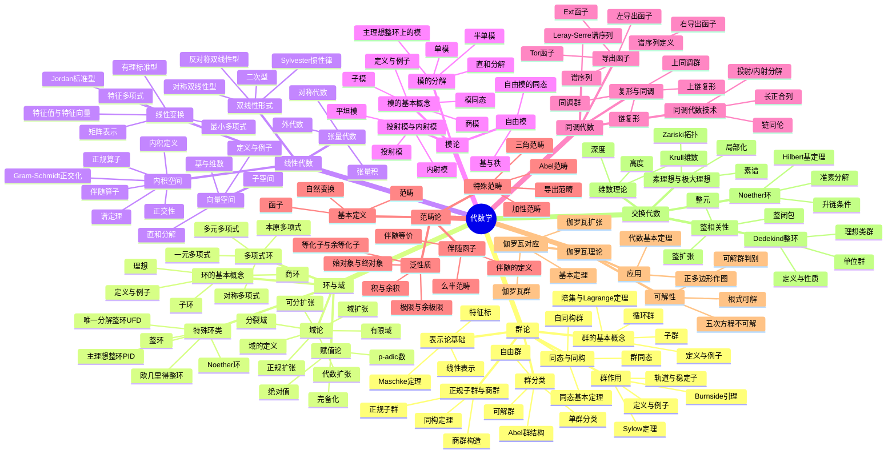
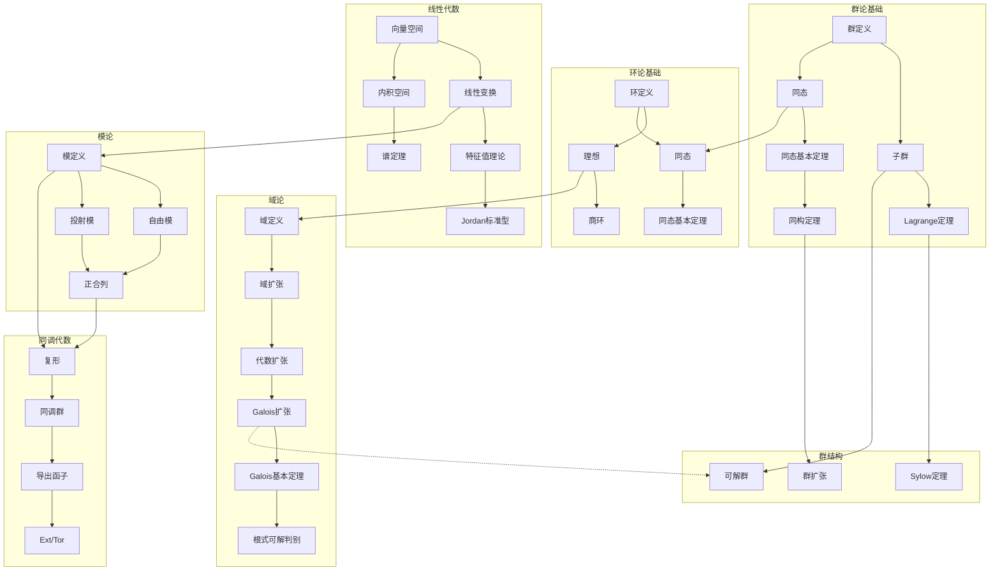
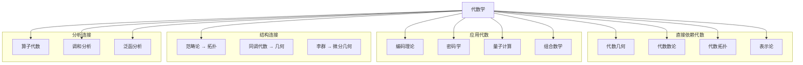
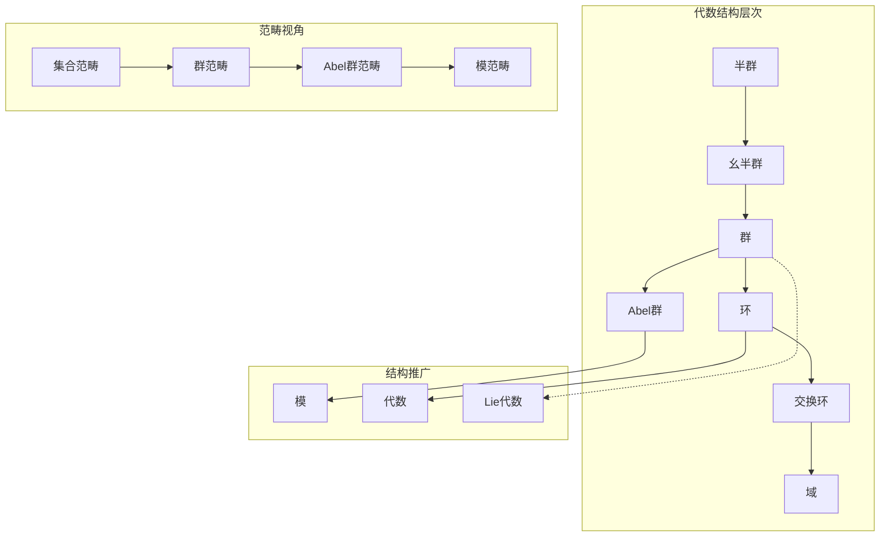

---
references:
  textbooks:
    - id: artin_algebra
      type: textbook
      title: Algebra
      authors:
      - Michael Artin
      publisher: Pearson
      edition: 2nd
      year: 2011
      isbn: 978-0132413770
      msc: 16-01
      chapters: []
      url: ~
    - id: strang_la
      type: textbook
      title: Introduction to Linear Algebra
      authors:
      - Gilbert Strang
      publisher: Wellesley-Cambridge Press
      edition: 5th
      year: 2016
      isbn: 978-0980232776
      msc: 15-01
      chapters: []
      url: ~
    - id: dummit_foote_aa
      type: textbook
      title: Abstract Algebra
      authors:
      - David S. Dummit
      - Richard M. Foote
      publisher: Wiley
      edition: 3rd
      year: 2003
      isbn: 978-0471433347
      msc: 13-01
      chapters: []
      url: ~
  databases:
    - id: nlab
      type: database
      name: nLab
      entry_url: "https://ncatlab.org/nlab/show/{entry}"
      consulted_at: 2026-04-17
    - id: stacks_project
      type: database
      name: Stacks Project
      entry_url: "https://stacks.math.columbia.edu/tag/{tag}"
      consulted_at: 2026-04-17
    - id: zbmath
      type: database
      name: zbMATH Open
      entry_url: "https://zbmath.org/?q=an:{zb_id}"
      consulted_at: 2026-04-17
---
# 代数学思维导图

> 代数学研究数学结构及其运算规律，从群、环、域到范畴论，构建了现代数学的抽象框架。

---

## 🧠 核心概念层级关系



---

## 🔗 定理依赖关系图



---

## 📍 重要示例分布

### 群论经典示例

| 示例 | 概念 | 重要性 | 位置 |
|-----|------|-------|------|
| S_n对称群 | 置换群 | ⭐⭐⭐⭐⭐ | 群论入门 |
| A_n交错群 | 单群 | ⭐⭐⭐⭐⭐ | 正规子群 |
| D_n二面体群 | 对称群 | ⭐⭐⭐⭐ | 群作用 |
| Q_8四元数群 | 非Abel有限群 | ⭐⭐⭐⭐ | 群分类 |
| Z/nZ循环群 | 有限Abel群 | ⭐⭐⭐⭐⭐ | 群结构 |
| 自由群F_n | 自由结构 | ⭐⭐⭐⭐ | 自由群 |

### 环与域示例

| 示例 | 概念 | 重要性 | 位置 |
|-----|------|-------|------|
| Z整数环 | PID | ⭐⭐⭐⭐⭐ | 环论入门 |
| Z/nZ剩余类环 | 商环 | ⭐⭐⭐⭐ | 商环构造 |
| F_p有限域 | 有限域 | ⭐⭐⭐⭐⭐ | 域论 |
| Q(√2)二次扩张 | 代数扩张 | ⭐⭐⭐⭐ | 域扩张 |
| Z_p p-adic整数 | 完备化 | ⭐⭐⭐⭐ | 赋值论 |

### 线性代数示例

| 示例 | 概念 | 重要性 | 位置 |
|-----|------|-------|------|
| R^n空间 | 向量空间 | ⭐⭐⭐⭐⭐ | 线性代数入门 |
| 旋转矩阵 | 正交变换 | ⭐⭐⭐⭐ | 线性变换 |
| Jordan块 | Jordan型 | ⭐⭐⭐⭐⭐ | Jordan标准型 |
| Gram矩阵 | 内积结构 | ⭐⭐⭐⭐ | 内积空间 |
| 外代数Λ(V) | 张量积 | ⭐⭐⭐⭐ | 张量代数 |

### 同调代数示例

| 示例 | 概念 | 重要性 | 位置 |
|-----|------|-------|------|
| 奇异同调 | 拓扑应用 | ⭐⭐⭐⭐⭐ | 复形 |
| 群上同调 | 代数应用 | ⭐⭐⭐⭐ | 上同调 |
| Ext^1_Z(Z/n,Z) | Ext计算 | ⭐⭐⭐⭐ | Ext函子 |
| 蛇引理 | 同调技术 | ⭐⭐⭐⭐⭐ | 长正合列 |

---

## 🔄 与其他分支的连接点



**具体连接说明：**

| 分支 | 连接概念 | 连接深度 |
|-----|---------|---------|
| 代数几何 | 交换代数、概形 | ⭐⭐⭐⭐⭐ |
| 代数数论 | 代数整数、类域论 | ⭐⭐⭐⭐⭐ |
| 代数拓扑 | 同调群、上同调环 | ⭐⭐⭐⭐⭐ |
| 微分几何 | 李群、纤维丛 | ⭐⭐⭐⭐ |
| 数论 | 伽罗瓦表示、模形式 | ⭐⭐⭐⭐⭐ |
| 密码学 | 有限域、椭圆曲线 | ⭐⭐⭐⭐ |
| 编码理论 | 有限域、线性码 | ⭐⭐⭐⭐ |
| 物理 | 群表示、李代数 | ⭐⭐⭐⭐ |
| 计算机科学 | 范畴论、类型论 | ⭐⭐⭐⭐ |

---

## 📊 学习难度梯度标记

```mermaid
graph LR
    subgraph 本科基础 ⭐⭐⭐
        A1[线性代数]
        A2[群论入门]
        A3[环论基础]
    end

    subgraph 本科高阶 ⭐⭐⭐⭐
        B1[域论与Galois理论]
        B2[模论]
        B3[表示论基础]
    end

    subgraph 研究生入门 ⭐⭐⭐⭐⭐
        C1[同调代数]
        C2[交换代数]
        C3[范畴论]
    end

    subgraph 研究前沿 ⭐⭐⭐⭐⭐⭐
        D1[导出范畴]
        D2[高等同调代数]
        D3[代数K理论]
    end
```

### 详细难度分级

| 主题 | 入门 | 基础 | 进阶 | 高级 | 专家 |
|-----|------|------|------|------|------|
| 群论 | 群定义 | Sylow定理 | 表示论 | 有限单群分类 | 群上同调 |
| 环论 | 环/理想 | PID/UFD | Noether环 | 交换代数 | 非交换代数 |
| 域论 | 域扩张 | Galois理论 | 类域论 | 逆Galois问题 | 代数函数域 |
| 线性代数 | 矩阵运算 | 标准型 | 张量 | 多重线性代数 | 表示论 |
| 同调代数 | 复形 | 导出函子 | 谱序列 | 导出范畴 | t-结构 |
| 范畴论 | 范畴/函子 | 极限/伴随 | Abel范畴 | 高阶范畴 | ∞-范畴 |

---

## 🎯 学习路径推荐

### 标准代数路径

```
线性代数 → 群论 → 环论 → 域论/Galois理论 → 模论 → 同调代数
```

### 应用代数路径

```
线性代数 → 群论 → 表示论 → 李群/李代数 → 物理应用
```

### 代数几何路径

```
交换代数 → 层论 → 概形 → 上同调 → 高级代数几何
```

### 同调代数路径

```
模论 → 复形 → 导出函子 → 谱序列 → 导出范畴
```

---

## 📚 核心定理清单

### 群论核心定理

1. **Lagrange定理**：子群阶整除群阶
2. **Sylow定理**：p-子群存在性与共轭性
3. **有限Abel群结构定理**：循环群的直积分解
4. **Jordan-Hölder定理**：合成列的唯一性

### 环论核心定理

1. **同态基本定理**：R/kerφ ≅ imφ
2. **中国剩余定理**：理想互素时的同构
3. **Hilbert基定理**：Noether环上多项式环Noether
4. **准素分解定理**：Noether环中理想的准素分解

### 域论核心定理

1. **Galois基本定理**：子群与中间域的对应
2. **代数基本定理**：复代数闭域
3. **本原元定理**：可分扩张是单扩张
4. **Abel-Ruffini定理**：五次以上方程根式不可解

### 线性代数核心定理

1. **维数定理**：rank + nullity = dimV
2. **Cayley-Hamilton定理**：矩阵满足特征方程
3. **谱定理**：正规算子的对角化
4. **Sylvester惯性律**：二次型的规范形

### 同调代数核心定理

1. **长正合列定理**：短正合列导出长正合列
2. **万有系数定理**：同调与系数的分解
3. **Künneth公式**：积空间的同调
4. **Serre定理**：射影模的刻画

---

## 🔍 概念关系图谱



---

> 💡 **学习建议**：代数学的核心是抽象思维能力的培养。建议从具体例子出发（如Z、Q、R^n），逐步抽象到一般结构。特别注意同态、同构等映射概念，它们是理解代数结构关系的关键。
