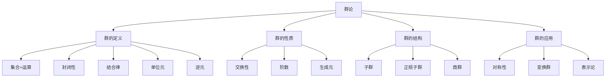
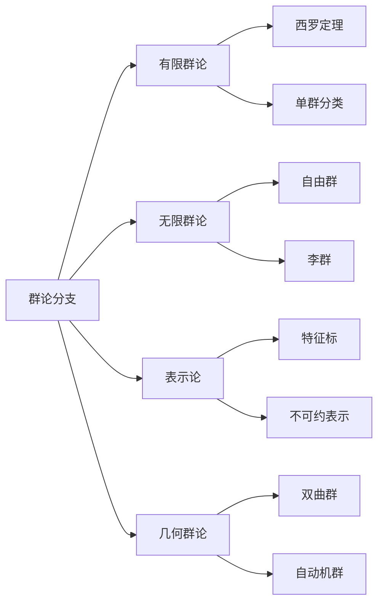
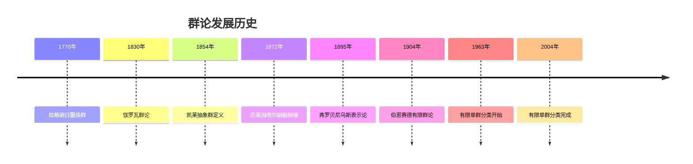
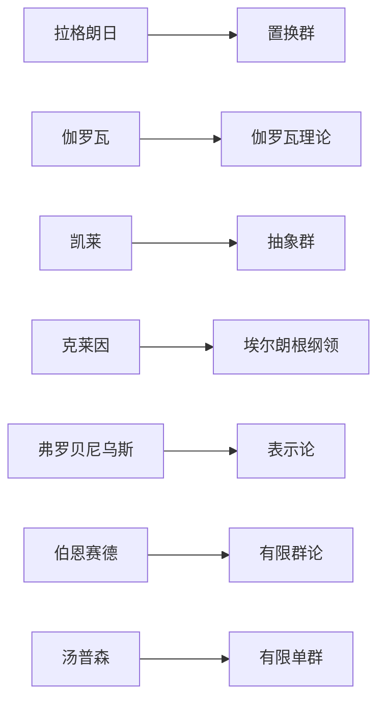
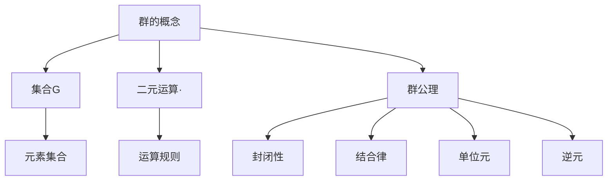
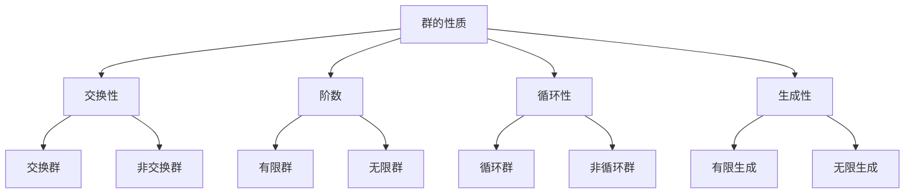
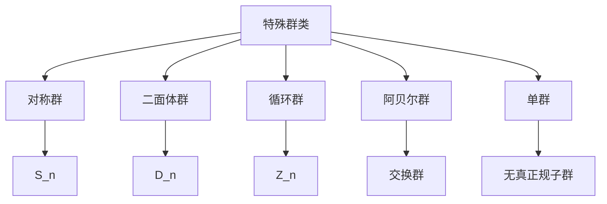
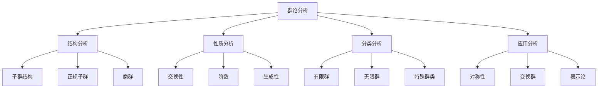
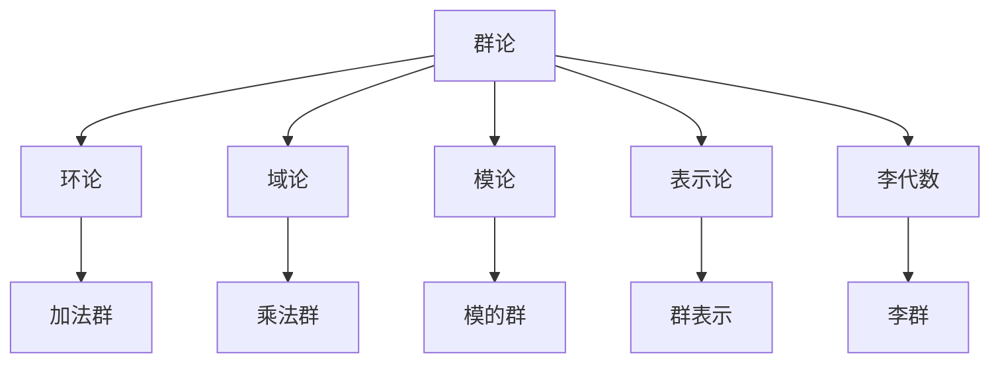

# 1. 群论 / Group Theory

## 目录

- [1. 群论 / Group Theory](#1-群论--group-theory)
  - [目录](#目录)
  - [1.1 概述 / Overview](#11-概述--overview)
    - [1.1.1 群论概念体系](#111-群论概念体系)
    - [1.1.2 群论分支体系](#112-群论分支体系)
  - [1.2 历史发展 / Historical Development](#12-历史发展--historical-development)
    - [1.2.1 群论发展时间线](#121-群论发展时间线)
    - [1.2.2 重要人物贡献](#122-重要人物贡献)
    - [1.2.3 理论发展脉络](#123-理论发展脉络)
  - [1.3 基本概念 / Basic Concepts](#13-基本概念--basic-concepts)
    - [1.3.1 群的定义](#131-群的定义)
    - [1.3.2 群的表示方法](#132-群的表示方法)
    - [1.3.3 群的基本性质](#133-群的基本性质)
  - [1.4 群的性质 / Group Properties](#14-群的性质--group-properties)
    - [1.4.1 交换群](#141-交换群)
    - [1.4.2 群的阶](#142-群的阶)
    - [1.4.3 循环群](#143-循环群)
    - [1.4.4 群的性质总结](#144-群的性质总结)
  - [1.5 子群与陪集 / Subgroups and Cosets](#15-子群与陪集--subgroups-and-cosets)
    - [1.5.1 子群定义](#151-子群定义)
    - [1.5.2 陪集](#152-陪集)
    - [1.5.3 拉格朗日定理](#153-拉格朗日定理)
  - [1.6 同态与同构 / Homomorphisms and Isomorphisms](#16-同态与同构--homomorphisms-and-isomorphisms)
    - [1.6.1 群同态](#161-群同态)
    - [1.6.2 群同构](#162-群同构)
    - [1.6.3 同态基本定理](#163-同态基本定理)
  - [1.7 群的作用 / Group Actions](#17-群的作用--group-actions)
    - [1.7.1 群作用定义](#171-群作用定义)
    - [1.7.2 轨道与稳定子](#172-轨道与稳定子)
    - [1.7.3 轨道-稳定子定理](#173-轨道-稳定子定理)
  - [1.8 特殊群类 / Special Group Classes](#18-特殊群类--special-group-classes)
    - [1.8.1 对称群](#181-对称群)
    - [1.8.2 二面体群](#182-二面体群)
    - [1.8.3 循环群](#183-循环群)
    - [1.8.4 特殊群类总结](#184-特殊群类总结)
  - [1.9 应用实例 / Application Examples](#19-应用实例--application-examples)
    - [1.9.1 代数应用](#191-代数应用)
    - [1.9.2 几何应用](#192-几何应用)
    - [1.9.3 物理学应用](#193-物理学应用)
    - [1.9.4 计算机科学应用](#194-计算机科学应用)
  - [1.10 思维过程 / Thinking Process](#110-思维过程--thinking-process)
    - [1.10.1 群论分析思维](#1101-群论分析思维)
    - [1.10.2 群构造思维](#1102-群构造思维)
    - [1.10.3 群应用思维](#1103-群应用思维)
  - [1.11 总结 / Summary](#111-总结--summary)
    - [1.11.1 核心要点](#1111-核心要点)
    - [1.11.2 知识关联](#1112-知识关联)
    - [1.11.3 进一步学习](#1113-进一步学习)

## 1.1 概述 / Overview

群论是抽象代数的核心分支，研究具有二元运算的代数结构。群的概念统一了数学中许多重要的对称性和变换。

### 1.1.1 群论概念体系

### 1.1.2 群论分支体系

## 1.2 历史发展 / Historical Development

### 1.2.1 群论发展时间线

### 1.2.2 重要人物贡献

### 1.2.3 理论发展脉络

**阶段 1** (1770-1830)：置换群时代

- 拉格朗日研究方程根的置换
- 伽罗瓦建立伽罗瓦理论
- 群论起源于代数方程求解

**阶段 2** (1830-1870)：抽象化发展

- 凯莱提出抽象群概念
- 群论从具体应用中抽象出来
- 建立群论的公理化基础

**阶段 3** (1870-1900)：几何应用

- 克莱因埃尔朗根纲领
- 群论在几何学中的应用
- 变换群理论发展

**阶段 4** (1900-1960)：现代发展

- 弗罗贝尼乌斯表示论
- 伯恩赛德有限群论
- 李群和李代数理论

**阶段 5** (1960-至今)：分类时代

- 有限单群分类
- 几何群论发展
- 群论在多个领域的应用

## 1.3 基本概念 / Basic Concepts

### 1.3.1 群的定义

**定义 1.1** (群 / Group)
群是一个集合 $G$ 连同二元运算 $\cdot: G \times G \rightarrow G$，满足以下公理：

1. **封闭性**：$\forall a, b \in G, a \cdot b \in G$
2. **结合律**：$\forall a, b, c \in G, (a \cdot b) \cdot c = a \cdot (b \cdot c)$
3. **单位元**：$\exists e \in G, \forall a \in G, e \cdot a = a \cdot e = a$
4. **逆元**：$\forall a \in G, \exists a^{-1} \in G, a \cdot a^{-1} = a^{-1} \cdot a = e$

**形式化定义**：
$$
(G, \cdot) \text{ 是群 } \Leftrightarrow \begin{cases}
\forall a, b \in G, a \cdot b \in G \\
\forall a, b, c \in G, (a \cdot b) \cdot c = a \cdot (b \cdot c) \\
\exists e \in G, \forall a \in G, e \cdot a = a \cdot e = a \\
\forall a \in G, \exists a^{-1} \in G, a \cdot a^{-1} = a^{-1} \cdot a = e
\end{cases}
$$

**概念图示**：

### 1.3.2 群的表示方法

**方法 1**：乘法表
对于有限群，可以用乘法表表示：

| · | e | a | b |
|---|----|----|----|
| e | e | a | b |
| a | a | b | e |
| b | b | e | a |

**方法 2**：生成元表示
用生成元和关系表示群：
$$\langle a, b \mid a^2 = b^2 = (ab)^3 = e \rangle$$

**方法 3**：凯莱图
用有向图表示群的结构。

**实例 1.1** (群实例)

- 整数加法群：$(\mathbb{Z}, +)$
- 模 $n$ 加法群：$(\mathbb{Z}_n, +)$
- 对称群：$S_n$（$n$ 个元素的置换群）
- 二面体群：$D_n$（正 $n$ 边形的对称群）

### 1.3.3 群的基本性质

**定理 1.1** (群的基本性质)
设 $G$ 为群，则：

1. 单位元唯一
2. 每个元素的逆元唯一
3. $(ab)^{-1} = b^{-1}a^{-1}$
4. $(a^{-1})^{-1} = a$

**实例 1.2** (群性质验证)
在群 $(\mathbb{Z}, +)$ 中：

- 单位元：$0$
- 逆元：$a$ 的逆元是 $-a$
- 结合律：$(a + b) + c = a + (b + c)$

## 1.4 群的性质 / Group Properties

### 1.4.1 交换群

**定义 1.2** (交换群 / Abelian Group)
群 $G$ 是交换群，当且仅当：
$$\forall a, b \in G, a \cdot b = b \cdot a$$

**实例 1.3** (交换群)

- $(\mathbb{Z}, +)$ 是交换群
- $(\mathbb{R}, +)$ 是交换群
- $(\mathbb{R}^*, \cdot)$ 是交换群

**反例 1.1** (非交换群)

- 对称群 $S_3$ 不是交换群
- 一般线性群 $GL(n, \mathbb{R})$ 不是交换群

### 1.4.2 群的阶

**定义 1.3** (群的阶 / Order of Group)
有限群 $G$ 的阶是 $G$ 中元素的个数，记作 $|G|$。

**定义 1.4** (元素的阶 / Order of Element)
元素 $a \in G$ 的阶是最小的正整数 $n$，使得 $a^n = e$。

**实例 1.4** (群的阶)

- $|\mathbb{Z}_6| = 6$
- $|S_3| = 6$
- $|D_4| = 8$

### 1.4.3 循环群

**定义 1.5** (循环群 / Cyclic Group)
群 $G$ 是循环群，当且仅当存在 $a \in G$，使得 $G = \langle a \rangle$。

**实例 1.5** (循环群)

- $(\mathbb{Z}, +) = \langle 1 \rangle$
- $(\mathbb{Z}_n, +) = \langle 1 \rangle$
- $(\mathbb{Z}_6, +) = \langle 1 \rangle = \{0, 1, 2, 3, 4, 5\}$

### 1.4.4 群的性质总结

## 1.5 子群与陪集 / Subgroups and Cosets

### 1.5.1 子群定义

**定义 1.6** (子群 / Subgroup)
群 $G$ 的子集 $H$ 是子群，当且仅当：

1. $H$ 非空
2. $\forall a, b \in H, ab \in H$
3. $\forall a \in H, a^{-1} \in H$

**实例 1.6** (子群实例)

- $\{0, 2, 4\}$ 是 $\mathbb{Z}_6$ 的子群
- $\{e, (12)\}$ 是 $S_3$ 的子群
- $\{1, -1\}$ 是 $(\mathbb{R}^*, \cdot)$ 的子群

### 1.5.2 陪集

**定义 1.7** (陪集 / Coset)
设 $H$ 是群 $G$ 的子群，$a \in G$：

- 左陪集：$aH = \{ah : h \in H\}$
- 右陪集：$Ha = \{ha : h \in H\}$

**实例 1.7** (陪集实例)
在 $\mathbb{Z}_6$ 中，子群 $H = \{0, 2, 4\}$：

- $1H = \{1, 3, 5\}$
- $2H = \{2, 4, 0\} = H$

### 1.5.3 拉格朗日定理

**定理 1.2** (拉格朗日定理 / Lagrange's Theorem)
设 $H$ 是有限群 $G$ 的子群，则 $|H|$ 整除 $|G|$。

**证明思维过程**：

1. **理解问题**：证明子群阶数整除群阶数
2. **分析条件**：利用陪集分解
3. **构造证明**：$G = \bigcup_{i=1}^k a_iH$（不相交并）
4. **验证结果**：$|G| = k|H|$，其中 $k$ 是陪集个数

**实例 1.8** (拉格朗日定理应用)
在 $S_3$ 中：

- $|S_3| = 6$
- 子群阶数只能是 $1, 2, 3, 6$

## 1.6 同态与同构 / Homomorphisms and Isomorphisms

### 1.6.1 群同态

**定义 1.8** (群同态 / Group Homomorphism)
设 $G, H$ 为群，映射 $\phi: G \rightarrow H$ 是同态，当且仅当：
$$\forall a, b \in G, \phi(ab) = \phi(a)\phi(b)$$

**实例 1.9** (群同态)

- $\phi: \mathbb{Z} \rightarrow \mathbb{Z}_n, \phi(k) = k \bmod n$
- $\phi: \mathbb{R}^* \rightarrow \mathbb{R}^*, \phi(x) = x^2$

### 1.6.2 群同构

**定义 1.9** (群同构 / Group Isomorphism)
群同态 $\phi: G \rightarrow H$ 是同构，当且仅当 $\phi$ 是双射。

**实例 1.10** (群同构)

- $(\mathbb{Z}, +) \cong (\mathbb{Z}_n, +)$（通过商群同构）
- $(\mathbb{R}, +) \cong (\mathbb{R}^+, \cdot)$（通过指数函数）

### 1.6.3 同态基本定理

**定理 1.3** (同态基本定理 / First Isomorphism Theorem)
设 $\phi: G \rightarrow H$ 是群同态，则：
$$G/\ker \phi \cong \text{im} \phi$$

**实例 1.11** (同态基本定理应用)
同态 $\phi: \mathbb{Z} \rightarrow \mathbb{Z}_n, \phi(k) = k \bmod n$：

- $\ker \phi = n\mathbb{Z}$
- $\text{im} \phi = \mathbb{Z}_n$
- $\mathbb{Z}/n\mathbb{Z} \cong \mathbb{Z}_n$

## 1.7 群的作用 / Group Actions

### 1.7.1 群作用定义

**定义 1.10** (群作用 / Group Action)
群 $G$ 作用在集合 $X$ 上，当且仅当存在映射 $G \times X \rightarrow X$，满足：

1. $\forall x \in X, ex = x$
2. $\forall g, h \in G, x \in X, (gh)x = g(hx)$

**实例 1.12** (群作用)

- $S_n$ 作用在 $\{1, 2, \ldots, n\}$ 上
- $GL(n, \mathbb{R})$ 作用在 $\mathbb{R}^n$ 上
- $D_n$ 作用在正 $n$ 边形上

### 1.7.2 轨道与稳定子

**定义 1.11** (轨道 / Orbit)
元素 $x \in X$ 的轨道是：
$$\text{Orb}(x) = \{gx : g \in G\}$$

**定义 1.12** (稳定子 / Stabilizer)
元素 $x \in X$ 的稳定子是：
$$\text{Stab}(x) = \{g \in G : gx = x\}$$

**实例 1.13** (轨道与稳定子)
在 $S_3$ 作用在 $\{1, 2, 3\}$ 上：

- $\text{Orb}(1) = \{1, 2, 3\}$
- $\text{Stab}(1) = \{e, (23)\}$

### 1.7.3 轨道-稳定子定理

**定理 1.4** (轨道-稳定子定理 / Orbit-Stabilizer Theorem)
设 $G$ 作用在 $X$ 上，$x \in X$，则：
$$|\text{Orb}(x)| = |G|/|\text{Stab}(x)|$$

## 1.8 特殊群类 / Special Group Classes

### 1.8.1 对称群

**定义 1.13** (对称群 / Symmetric Group)
$n$ 个元素的对称群 $S_n$ 是所有 $n$ 个元素的置换构成的群。

**实例 1.14** (对称群)

- $S_2 = \{e, (12)\}$
- $S_3 = \{e, (12), (13), (23), (123), (132)\}$
- $|S_n| = n!$

### 1.8.2 二面体群

**定义 1.14** (二面体群 / Dihedral Group)
正 $n$ 边形的对称群 $D_n$ 包含旋转和反射。

**实例 1.15** (二面体群)

- $D_3$：正三角形的对称群
- $D_4$：正方形的对称群
- $|D_n| = 2n$

### 1.8.3 循环群

**定义 1.15** (循环群 / Cyclic Group)
循环群是由单个元素生成的群。

**实例 1.16** (循环群)

- $\mathbb{Z}_n = \langle 1 \rangle$
- $\mathbb{Z} = \langle 1 \rangle$
- 所有循环群都同构于 $\mathbb{Z}$ 或 $\mathbb{Z}_n$

### 1.8.4 特殊群类总结

## 1.9 应用实例 / Application Examples

### 1.9.1 代数应用

**实例 1.17** (伽罗瓦理论)
伽罗瓦理论中的群：

- 伽罗瓦群：域扩张的自同构群
- 可解群：对应可解方程
- 阿贝尔群：对应根式可解方程

**实例 1.18** (环论应用)
环论中的群：

- 加法群：环的加法群
- 单位群：环的可逆元素群
- 理想类群：代数数域的理想类群

### 1.9.2 几何应用

**实例 1.19** (几何变换)
几何学中的群：

- 等距群：保持距离的变换
- 相似群：保持相似性的变换
- 射影群：射影变换群

**实例 1.20** (晶体学)
晶体学中的群：

- 点群：晶体的对称群
- 空间群：晶体的空间对称群
- 230种空间群分类

### 1.9.3 物理学应用

**实例 1.21** (量子力学)
量子力学中的群：

- 李群：连续对称群
- 表示论：量子态的变换
- 规范群：规范场论

**实例 1.22** (粒子物理)
粒子物理中的群：

- $SU(3)$：强相互作用
- $SU(2) \times U(1)$：弱电相互作用
- $SO(10)$：大统一理论

### 1.9.4 计算机科学应用

**实例 1.23** (密码学)
密码学中的群：

- 椭圆曲线群：椭圆曲线密码
- 有限域乘法群：RSA密码
- 置换群：对称密码

**实例 1.24** (组合数学)
组合数学中的群：

- 伯恩赛德引理：计数问题
- 波利亚计数定理：着色问题
- 群论在组合优化中的应用

## 1.10 思维过程 / Thinking Process

### 1.10.1 群论分析思维

### 1.10.2 群构造思维

**群构造步骤**：

1. **明确需求**：确定需要什么样的群
2. **选择结构**：选择合适的群结构
3. **验证公理**：验证群公理
4. **分析性质**：分析群的性质
5. **应用拓展**：在其他领域中的应用

### 1.10.3 群应用思维

**群应用过程**：

1. **问题建模**：将实际问题转化为群论问题
2. **群选择**：选择合适的群
3. **性质分析**：分析群的性质
4. **结果解释**：解释群论结果的意义
5. **验证改进**：验证结果的合理性

## 1.11 总结 / Summary

### 1.11.1 核心要点

- 群是抽象代数的基础结构
- 群论统一了数学中的对称性概念
- 群论在各个领域都有重要应用
- 群论为现代数学提供了重要工具

### 1.11.2 知识关联

### 1.11.3 进一步学习

- 深入学习环论和域论
- 研究群表示论
- 探索李群和李代数
- 学习几何群论

---

*本文档展示了群论的多表征方式，包括符号表征、图表表征、实例表征、历史发展表征、应用场景表征和思维过程表征，为深入理解群论提供了全面的视角。*
