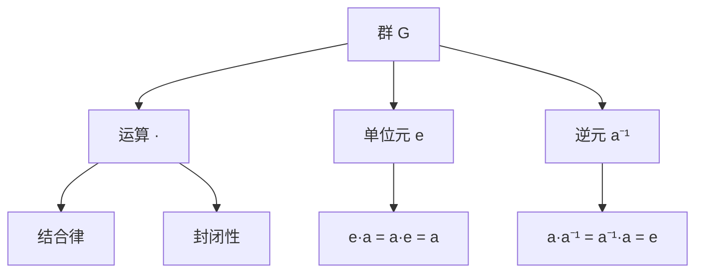

# 群论 - 增强版

## 📚 概述

群论是现代代数学的核心分支，研究具有特定运算结构的集合。群的概念统一了数学中许多重要的结构，从对称性到数论，从几何到物理，群论都发挥着重要作用。

## 🕰️ 历史发展脉络

### 早期发展 (1770-1850)

#### 拉格朗日时代

- **1770年**: 拉格朗日研究代数方程的可解性
- **1799年**: 鲁菲尼提出五次方程不可解的证明
- **1824年**: 阿贝尔严格证明五次方程不可解

#### 伽罗瓦革命

- **1832年**: 伽罗瓦引入群的概念
- **1832年**: 伽罗瓦理论建立
- **1846年**: 刘维尔发表伽罗瓦的论文

### 系统化发展 (1850-1900)

#### 凯莱的贡献

- **1854年**: 凯莱给出群的抽象定义
- **1878年**: 凯莱定理：每个群都是置换群的子群

#### 克莱因的几何群论

- **1872年**: 埃尔朗根纲领
- **1884年**: 克莱因研究几何变换群

### 现代发展 (1900-至今)

#### 有限群论

- **1904年**: 伯恩赛德猜想
- **1963年**: 费特-汤普森定理
- **2004年**: 有限单群分类完成

#### 无限群论

- **1929年**: 冯·诺依曼研究算子群
- **1950年代**: 李群理论发展
- **1970年代**: 几何群论兴起

## 🏗️ 核心概念

### 群的定义

```lean
-- Lean 4 形式化定义
structure Group where
  carrier : Type
  mul : carrier → carrier → carrier
  one : carrier
  inv : carrier → carrier
  mul_assoc : ∀ a b c, mul (mul a b) c = mul a (mul b c)
  one_mul : ∀ a, mul one a = a
  mul_one : ∀ a, mul a one = a
  mul_inv : ∀ a, mul a (inv a) = one
```

### 基本性质

#### 1. 结合律

对于群中的任意元素 $a, b, c$，有：
$$(a \cdot b) \cdot c = a \cdot (b \cdot c)$$

#### 2. 单位元

存在唯一的单位元 $e$，使得：
$$e \cdot a = a \cdot e = a$$

#### 3. 逆元

每个元素 $a$ 都有唯一的逆元 $a^{-1}$：
$$a \cdot a^{-1} = a^{-1} \cdot a = e$$

## 📊 可视化图表

### 群的结构图



### 子群关系图

```mermaid
graph TD
    A[群 G] --> B[子群 H]
    B --> C[正规子群 N]
    C --> D[商群 G/N]
    
    A --> E[中心 Z(G)]
    A --> F[换位子群 [G,G]]
    
    B --> G[左陪集]
    B --> H[右陪集]
```

### 群同态图

```mermaid
graph LR
    A[群 G] -->|φ| B[群 H]
    C[单位元 e_G] -->|φ| D[单位元 e_H]
    E[逆元 a⁻¹] -->|φ| F[逆元 φ(a)⁻¹]
```

## 🔍 实例表征

### 1. 有限群实例

#### 对称群 S₃

```haskell
-- Haskell 实现
data Sym3 = Id | R120 | R240 | F1 | F2 | F3

instance Group Sym3 where
  one = Id
  inv Id = Id
  inv R120 = R240
  inv R240 = R120
  inv F1 = F1
  inv F2 = F2
  inv F3 = F3
  
  mul Id x = x
  mul x Id = x
  mul R120 R120 = R240
  mul R120 R240 = Id
  mul R240 R120 = Id
  mul R240 R240 = R120
  -- ... 其他运算
```

#### 凯莱表

| · | Id | R120 | R240 | F1 | F2 | F3 |
|---|----|----|----|----|----|----|
| Id | Id | R120 | R240 | F1 | F2 | F3 |
| R120 | R120 | R240 | Id | F2 | F3 | F1 |
| R240 | R240 | Id | R120 | F3 | F1 | F2 |
| F1 | F1 | F3 | F2 | Id | R240 | R120 |
| F2 | F2 | F1 | F3 | R120 | Id | R240 |
| F3 | F3 | F2 | F1 | R240 | R120 | Id |

### 2. 无限群实例

#### 整数加法群 (ℤ, +)

```rust
// Rust 实现
#[derive(Debug, Clone, PartialEq)]
pub struct IntegerGroup {
    value: i32,
}

impl IntegerGroup {
    pub fn new(value: i32) -> Self {
        IntegerGroup { value }
    }
    
    pub fn add(&self, other: &IntegerGroup) -> IntegerGroup {
        IntegerGroup::new(self.value + other.value)
    }
    
    pub fn identity() -> IntegerGroup {
        IntegerGroup::new(0)
    }
    
    pub fn inverse(&self) -> IntegerGroup {
        IntegerGroup::new(-self.value)
    }
}
```

#### 实数乘法群 (ℝ*, ×)

```lean
-- Lean 4 实现
structure RealMultiplicativeGroup where
  value : ℝ
  nonzero : value ≠ 0

def mul (a b : RealMultiplicativeGroup) : RealMultiplicativeGroup :=
  ⟨a.value * b.value, by simp [a.nonzero, b.nonzero]⟩

def one : RealMultiplicativeGroup := ⟨1, by simp⟩

def inv (a : RealMultiplicativeGroup) : RealMultiplicativeGroup :=
  ⟨a.value⁻¹, by simp [a.nonzero]⟩
```

### 3. 重要群类

#### 循环群

```haskell
-- 循环群 Cₙ
data CyclicGroup n = CyclicGroup { value :: Int }

instance (KnownNat n) => Group (CyclicGroup n) where
  one = CyclicGroup 0
  inv (CyclicGroup x) = CyclicGroup (mod (-x) n)
  mul (CyclicGroup x) (CyclicGroup y) = CyclicGroup (mod (x + y) n)
```

#### 二面体群 Dₙ

```rust
// 二面体群 Dₙ
pub struct DihedralGroup {
    n: u32,
    rotation: u32,
    reflection: bool,
}

impl DihedralGroup {
    pub fn new(n: u32) -> Self {
        DihedralGroup {
            n,
            rotation: 0,
            reflection: false,
        }
    }
    
    pub fn rotate(&mut self) {
        self.rotation = (self.rotation + 1) % self.n;
    }
    
    pub fn reflect(&mut self) {
        self.reflection = !self.reflection;
    }
}
```

## 🧠 思维过程表征

### 1. 群论问题解决流程

#### 步骤1：识别群结构

```text
问题 → 识别运算 → 验证群公理 → 确定群类型
```

#### 步骤2：分析群性质

```text
群结构 → 阶数分析 → 子群分析 → 同态分析
```

#### 步骤3：应用群论工具

```text
群性质 → 拉格朗日定理 → 西罗定理 → 同构定理
```

### 2. 证明思维过程

#### 拉格朗日定理证明

```text
1. 定义左陪集
2. 证明陪集划分
3. 证明陪集等势
4. 得出阶数关系
```

#### 西罗定理证明

```text
1. 定义p-子群
2. 构造西罗p-子群
3. 证明共轭性质
4. 得出计数公式
```

### 3. 概念理解步骤

#### 理解群的概念

```text
1. 集合 + 运算
2. 满足群公理
3. 抽象代数结构
4. 具体实例验证
```

#### 理解子群概念

```text
1. 子集 + 继承运算
2. 封闭性验证
3. 群公理验证
4. 子群判定
```

## 🌍 应用场景表征

### 1. 自然科学应用

#### 物理学应用

- **对称性**: 晶体学点群
- **量子力学**: 李群表示论
- **相对论**: 洛伦兹群
- **粒子物理**: 规范群

#### 化学应用

- **分子对称性**: 点群理论
- **光谱学**: 群表示论
- **晶体学**: 空间群
- **手性**: 对称性破缺

### 2. 工程技术应用

#### 密码学应用

```haskell
-- 椭圆曲线密码学
data EllipticCurve = EC {
    a :: Integer,
    b :: Integer,
    p :: Integer
}

data ECPoint = Point {
    x :: Integer,
    y :: Integer
} | Infinity

instance Group ECPoint where
    one = Infinity
    inv Infinity = Infinity
    inv (Point x y) = Point x (mod (-y) p)
    -- 点加法实现
```

#### 编码理论

- **纠错码**: 群码理论
- **线性码**: 向量空间群
- **循环码**: 循环群结构

### 3. 计算机科学应用

#### 算法设计

```rust
// 置换群算法
pub struct PermutationGroup {
    elements: Vec<Vec<usize>>,
}

impl PermutationGroup {
    pub fn generate_cyclic(&self, n: usize) -> Vec<Vec<usize>> {
        let mut result = Vec::new();
        for i in 0..n {
            let mut cycle = Vec::new();
            let mut current = i;
            for _ in 0..n {
                cycle.push(current);
                current = (current + 1) % n;
            }
            result.push(cycle);
        }
        result
    }
}
```

#### 数据结构

- **哈希表**: 群运算优化
- **图论**: 自同构群
- **组合优化**: 对称群

### 4. 数学内部应用

#### 代数几何

- **代数簇**: 自同构群
- **概形**: 伽罗瓦群
- **上同调**: 群上同调

#### 数论

- **类域论**: 伽罗瓦群
- **椭圆曲线**: 挠点群
- **模形式**: 模群

## 🔗 知识关联网络

### 与其他数学分支的联系

#### 与线性代数的联系

- 群表示论
- 矩阵群
- 线性变换群

#### 与拓扑学的联系

- 基本群
- 同伦群
- 同调群

#### 与几何学的联系

- 等距变换群
- 射影变换群
- 李群

### 理论发展脉络

#### 从具体到抽象

```text
置换群 → 抽象群 → 群表示 → 范畴论
```

#### 从有限到无限

```text
有限群 → 无限群 → 李群 → 代数群
```

#### 从交换到非交换

```text
交换群 → 非交换群 → 简单群 → 散在群
```

## 📈 现代发展前沿

### 1. 几何群论

- **双曲群**: 负曲率几何
- **CAT(0)群**: 非正曲率
- **自动机群**: 计算复杂性

### 2. 表示论

- **特征标理论**: 有限群表示
- **李群表示**: 无限维表示
- **模表示**: 特征p表示

### 3. 组合群论

- **自由群**: 组合结构
- **双曲群**: 几何性质
- **自动机群**: 计算性质

### 4. 代数群论

- **线性代数群**: 代数几何
- **算术群**: 数论应用
- **p进群**: 局部理论

## 🎯 学习路径建议

### 初学者路径

1. **基础概念**: 群的定义和基本性质
2. **重要例子**: 对称群、循环群、二面体群
3. **基本定理**: 拉格朗日定理、西罗定理
4. **应用实例**: 对称性、编码理论

### 进阶路径

1. **表示论**: 群表示和特征标
2. **李群**: 连续群理论
3. **几何群论**: 群与几何的联系
4. **现代应用**: 密码学、物理应用

### 研究路径

1. **前沿理论**: 几何群论、表示论
2. **交叉应用**: 代数几何、数论
3. **计算群论**: 算法和软件
4. **开放问题**: 未解决的群论问题

## 🌟 总结

群论作为现代代数学的核心，不仅提供了统一的数学语言，还在各个领域发挥着重要作用。从基础的对称性研究到前沿的几何群论，群论的发展展现了数学的深刻性和普适性。

通过多表征的学习方法，我们可以从不同角度理解群论：

- **历史角度**: 了解群论的发展历程
- **结构角度**: 掌握群的基本性质
- **应用角度**: 认识群论的实际价值
- **发展角度**: 关注群论的现代发展

群论将继续在数学和其他科学领域发挥重要作用，为人类认识世界提供强大的工具。

---

**相关文档**:

- [环论-增强版](02-环论-增强版.md)
- [域论-增强版](03-域论-增强版.md)
- [李代数-增强版](05-李代数-增强版.md)
- [范畴论-增强版](06-范畴论-增强版.md)
- [代数几何-增强版](../04-几何学/05-代数几何-增强版.md)
- [表示论-高级主题](../11-高级数学/表示论-高级主题.md)
