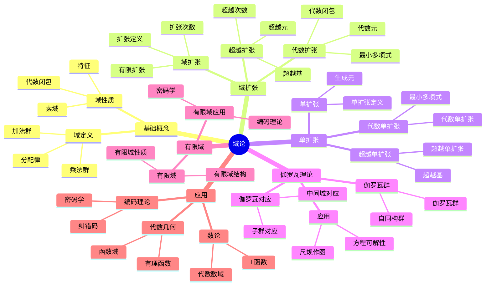

---
title: "01 域论 国际标准深度扩展版"
msc_primary: ["12F99"]
msc_secondary: ["12E99", "11R99"]
---

# 2.3 域论 / Field Theory

## 目录 / Table of Contents

- [2.3 域论 / Field Theory](#23-域论--field-theory)
  - [目录 / Table of Contents](#目录--table-of-contents)
  - [2.3.1 概述 / Overview](#231-概述--overview)
  - [🗺️ 域论核心概念思维导图](#️-域论核心概念思维导图)
  - [📊 域论核心概念多维知识矩阵](#-域论核心概念多维知识矩阵)
  - [🕰️ 历史发展脉络与哲学渊源](#️-历史发展脉络与哲学渊源)
    - [1. 域论的哲学根源](#1-域论的哲学根源)
      - [1.1 古希腊的数学哲学](#11-古希腊的数学哲学)
      - [1.2 中世纪的代数思想](#12-中世纪的代数思想)
    - [2. 近代域论的发展](#2-近代域论的发展)
      - [2.1 伽罗瓦的革命性贡献](#21-伽罗瓦的革命性贡献)
      - [2.2 戴德金的理想理论](#22-戴德金的理想理论)
    - [3. 现代域论的发展](#3-现代域论的发展)
      - [3.1 施泰尼茨的抽象域论](#31-施泰尼茨的抽象域论)
      - [3.2 阿廷的伽罗瓦理论](#32-阿廷的伽罗瓦理论)
    - [4. 当代域论的发展](#4-当代域论的发展)
      - [4.1 有限域理论](#41-有限域理论)
      - [4.2 域论在数论中的应用](#42-域论在数论中的应用)
    - [5. 域论的哲学意义](#5-域论的哲学意义)
      - [5.1 完美性思想](#51-完美性思想)
      - [5.2 对称性思想](#52-对称性思想)
      - [5.3 抽象化思想](#53-抽象化思想)
  - [2.3.2 域的基本定义 / Basic Definition of Field](#232-域的基本定义--basic-definition-of-field)
    - [2.3.2.1 域的定义 / Definition of Field](#2321-域的定义--definition-of-field)
  - [📚 概念深度分析：域 / Deep Concept Analysis: Field](#-概念深度分析域--deep-concept-analysis-field)
    - [1. 概念内涵 / Concept Intension](#1-概念内涵--concept-intension)
      - [1.1 本质属性 / Essential Properties](#11-本质属性--essential-properties)
      - [1.2 定义方式 / Definition Methods](#12-定义方式--definition-methods)
      - [1.3 条件分析 / Condition Analysis](#13-条件分析--condition-analysis)
    - [2. 概念外延 / Concept Extension](#2-概念外延--concept-extension)
      - [2.1 直接外延 / Direct Extension](#21-直接外延--direct-extension)
      - [2.2 间接外延 / Indirect Extension](#22-间接外延--indirect-extension)
      - [2.3 边界情况 / Boundary Cases](#23-边界情况--boundary-cases)
      - [2.4 反例 / Counterexamples](#24-反例--counterexamples)
    - [3. 概念属性 / Concept Properties](#3-概念属性--concept-properties)
      - [3.1 固有属性 / Intrinsic Properties](#31-固有属性--intrinsic-properties)
      - [3.2 关系属性 / Relational Properties](#32-关系属性--relational-properties)
      - [3.3 功能属性 / Functional Properties](#33-功能属性--functional-properties)
    - [4. 概念关系 / Concept Relations](#4-概念关系--concept-relations)
      - [4.1 层次关系 / Hierarchical Relations](#41-层次关系--hierarchical-relations)
      - [4.2 并列关系 / Coordinate Relations](#42-并列关系--coordinate-relations)
      - [4.3 交叉关系 / Intersection Relations](#43-交叉关系--intersection-relations)
      - [4.4 对立关系 / Opposition Relations](#44-对立关系--opposition-relations)
    - [5. 概念应用 / Concept Applications](#5-概念应用--concept-applications)
      - [5.1 应用领域 / Application Domains](#51-应用领域--application-domains)
      - [5.2 应用场景 / Application Scenarios](#52-应用场景--application-scenarios)
      - [5.3 应用价值 / Application Value](#53-应用价值--application-value)
    - [6. 概念发展 / Concept Development](#6-概念发展--concept-development)
      - [6.1 历史发展 / Historical Development](#61-历史发展--historical-development)
      - [6.2 现代发展 / Modern Development](#62-现代发展--modern-development)
    - [7. 形式化表述 / Formal Representation](#7-形式化表述--formal-representation)
      - [7.1 数学符号 / Mathematical Notation](#71-数学符号--mathematical-notation)
      - [7.2 形式化定义 / Formal Definition](#72-形式化定义--formal-definition)
      - [7.3 形式化实现 / Formal Implementation](#73-形式化实现--formal-implementation)
    - [2.3.2.2 域的性质 / Properties of Fields](#2322-域的性质--properties-of-fields)
  - [2.3.3 子域 / Subfields](#233-子域--subfields)
    - [2.3.3.1 子域定义 / Definition of Subfield](#2331-子域定义--definition-of-subfield)
    - [2.3.3.2 子域判定 / Subfield Test](#2332-子域判定--subfield-test)
  - [2.3.4 域扩张 / Field Extensions](#234-域扩张--field-extensions)
    - [2.3.4.1 域扩张定义 / Definition of Field Extension](#2341-域扩张定义--definition-of-field-extension)
    - [2.3.4.2 代数扩张 / Algebraic Extensions](#2342-代数扩张--algebraic-extensions)
    - [2.3.4.3 超越扩张 / Transcendental Extensions](#2343-超越扩张--transcendental-extensions)
  - [2.3.5 单扩张 / Simple Extensions](#235-单扩张--simple-extensions)
    - [2.3.5.1 单扩张构造 / Construction of Simple Extensions](#2351-单扩张构造--construction-of-simple-extensions)
    - [2.3.5.2 代数单扩张 / Algebraic Simple Extensions](#2352-代数单扩张--algebraic-simple-extensions)
    - [2.3.5.3 超越单扩张 / Transcendental Simple Extensions](#2353-超越单扩张--transcendental-simple-extensions)
  - [2.3.6 伽罗瓦理论 / Galois Theory](#236-伽罗瓦理论--galois-theory)
    - [2.3.6.1 伽罗瓦群 / Galois Group](#2361-伽罗瓦群--galois-group)
    - [2.3.6.2 伽罗瓦对应 / Galois Correspondence](#2362-伽罗瓦对应--galois-correspondence)
    - [2.3.6.3 伽罗瓦理论应用 / Applications of Galois Theory](#2363-伽罗瓦理论应用--applications-of-galois-theory)
  - [2.3.7 有限域 / Finite Fields](#237-有限域--finite-fields)
    - [2.3.7.1 有限域结构 / Structure of Finite Fields](#2371-有限域结构--structure-of-finite-fields)
    - [2.3.7.2 有限域性质 / Properties of Finite Fields](#2372-有限域性质--properties-of-finite-fields)
  - [2.3.8 形式化代码示例 / Formal Code Examples](#238-形式化代码示例--formal-code-examples)
    - [2.3.8.1 Lean 4 实现 / Lean 4 Implementation](#2381-lean-4-实现--lean-4-implementation)
    - [2.3.8.2 Haskell 实现 / Haskell Implementation](#2382-haskell-实现--haskell-implementation)
  - [2.3.9 应用与扩展 / Applications and Extensions](#239-应用与扩展--applications-and-extensions)
    - [2.3.9.1 代数几何应用 / Algebraic Geometry Applications](#2391-代数几何应用--algebraic-geometry-applications)
    - [2.3.9.2 数论应用 / Number Theory Applications](#2392-数论应用--number-theory-applications)
    - [2.3.9.3 编码理论应用 / Coding Theory Applications](#2393-编码理论应用--coding-theory-applications)
  - [2.3.10 总结 / Summary](#2310-总结--summary)
  - [2.3.11 历史发展 / Historical Development](#2311-历史发展--historical-development)
    - [2.3.11.1 域论发展历史 / Historical Development of Field Theory](#23111-域论发展历史--historical-development-of-field-theory)
      - [早期发展](#早期发展)
      - [19世纪发展](#19世纪发展)
      - [20世纪发展](#20世纪发展)
      - [现代发展](#现代发展)
    - [2.3.11.2 重要人物贡献 / Important Figures and Contributions](#23112-重要人物贡献--important-figures-and-contributions)
      - [埃瓦里斯特·伽罗瓦 (1811-1832)](#埃瓦里斯特伽罗瓦-1811-1832)
      - [理查德·戴德金 (1831-1916)](#理查德戴德金-1831-1916)
      - [海因里希·韦伯 (1842-1913)](#海因里希韦伯-1842-1913)
      - [恩斯特·施泰尼茨 (1871-1928)](#恩斯特施泰尼茨-1871-1928)
      - [埃米尔·阿廷 (1898-1962)](#埃米尔阿廷-1898-1962)
    - [2.3.11.3 重要事件 / Important Events](#23113-重要事件--important-events)
      - [19世纪重要事件](#19世纪重要事件)
      - [20世纪重要事件](#20世纪重要事件)
      - [21世纪重要事件](#21世纪重要事件)
  - [2.3.12 相关概念 / Related Concepts](#2312-相关概念--related-concepts)
    - [2.3.12.1 基础数学关联 / Basic Mathematics Connections](#23121-基础数学关联--basic-mathematics-connections)
      - [集合论](#集合论)
      - [群论](#群论)
      - [环论](#环论)
    - [2.3.12.2 高级数学关联 / Advanced Mathematics Connections](#23122-高级数学关联--advanced-mathematics-connections)
      - [代数](#代数)
      - [几何](#几何)
      - [数论](#数论)
    - [2.3.12.3 应用领域关联 / Application Domain Connections](#23123-应用领域关联--application-domain-connections)
      - [密码学](#密码学)
      - [编码理论](#编码理论)
      - [计算机科学](#计算机科学)
  - [2.3.13 参考文献 / References](#2313-参考文献--references)
    - [经典教材 / Classic Textbooks](#经典教材--classic-textbooks)
    - [域论教材 / Field Theory Textbooks](#域论教材--field-theory-textbooks)
    - [高级域论教材 / Advanced Field Theory Textbooks](#高级域论教材--advanced-field-theory-textbooks)
    - [历史文献 / Historical Literature](#历史文献--historical-literature)
    - [中文教材 / Chinese Textbooks](#中文教材--chinese-textbooks)
    - [现代发展文献 / Modern Development Literature](#现代发展文献--modern-development-literature)
    - [在线资源 / Online Resources](#在线资源--online-resources)
  - [术语对照表 / Terminology Table](#术语对照表--terminology-table)

## 2.3.1 概述 / Overview

域论是抽象代数的重要分支，研究具有加法和乘法运算的代数结构，其中非零元素在乘法下构成群。域论为代数几何、数论、编码理论等提供了重要工具。

## 🗺️ 域论核心概念思维导图



## 📊 域论核心概念多维知识矩阵

| 概念类别 | 核心概念 | 定义要点 | 关键性质 | 典型例子 | 应用场景 |
|---------|---------|---------|---------|---------|---------|
| 基础概念 | 域 | 加法群+乘法群+分配律 | 完美结构 | ℚ, ℝ, ℂ | 数学基础 |
| 基础概念 | 特征 | 单位元加法阶 | 0或素数 | char(ℚ)=0, char(𝔽ₚ)=p | 域分类 |
| 基础概念 | 素域 | 最小子域 | 同构于ℚ或𝔽ₚ | ℚ, 𝔽ₚ | 域基础 |
| 域扩张 | 域扩张 | 子域关系 | 扩张次数 | ℚ(√2)/ℚ | 域构造 |
| 域扩张 | 有限扩张 | 有限维 | 次数有限 | ℚ(√2)/ℚ | 代数数论 |
| 域扩张 | 代数扩张 | 代数元生成 | 有限扩张 | ℚ(√2)/ℚ | 代数数论 |
| 域扩张 | 超越扩张 | 超越元生成 | 无限维 | ℚ(π)/ℚ | 函数域 |
| 单扩张 | 单扩张 | 单生成元 | 结构简单 | ℚ(α) | 域构造 |
| 单扩张 | 代数单扩张 | 代数元生成 | 有限维 | ℚ(√2) | 代数数论 |
| 单扩张 | 超越单扩张 | 超越元生成 | 无限维 | ℚ(π) | 函数域 |
| 伽罗瓦理论 | 伽罗瓦群 | 自同构群 | 有限群 | Gal(ℚ(√2)/ℚ) | 方程理论 |
| 伽罗瓦理论 | 伽罗瓦对应 | 子群-中间域 | 一一对应 | 基本定理 | 方程可解性 |
| 伽罗瓦理论 | 可解群 | 可解群 | 方程可解 | 阿贝尔群 | 方程理论 |
| 有限域 | 有限域 | 有限个元素 | 特征为素数 | 𝔽ₚ, 𝔽ₚⁿ | 编码理论 |
| 有限域 | 有限域结构 | 唯一性 | 同构于𝔽ₚⁿ | 𝔽₄, 𝔽₈ | 编码理论 |
| 应用 | 代数数域 | 代数数域 | 数论应用 | ℚ(√-1) | 数论 |
| 应用 | 函数域 | 有理函数域 | 几何应用 | ℚ(x) | 代数几何 |

## 🕰️ 历史发展脉络与哲学渊源

### 1. 域论的哲学根源

#### 1.1 古希腊的数学哲学

**毕达哥拉斯（Pythagoras, 约570-495 BCE）的数论思想：**

> "数是万物的本质。有理数和无理数的发现揭示了数学的深刻结构。"

毕达哥拉斯学派对数的研究为域论中的有理数域概念奠定了基础。

**欧几里得（Euclid, 约300 BCE）的公理化方法：**

> "数学真理通过严格的逻辑推理建立。公理是数学大厦的基石。"

欧几里得的《几何原本》为域论的公理化方法提供了典范。

#### 1.2 中世纪的代数思想

**阿尔-花拉子米（Al-Khwarizmi, 780-850）的代数方法：**

> "代数是通过平衡和还原来求解未知数的艺术。方程的结构反映了数学的内在规律。"

花拉子米的工作为域论中的代数扩张概念提供了基础。

**奥马尔·海亚姆（Omar Khayyam, 1048-1131）的几何代数：**

> "代数和几何是统一的。几何图形可以表示代数关系，代数方程可以描述几何性质。"

海亚姆的思想为域论在代数几何中的应用奠定了基础。

### 2. 近代域论的发展

#### 2.1 伽罗瓦的革命性贡献

**埃瓦里斯特·伽罗瓦（Évariste Galois, 1811-1832）的伽罗瓦理论：**

> "代数方程的可解性取决于其伽罗瓦群的结构。域扩张与群论之间存在深刻的对应关系。"

伽罗瓦在1830年建立了伽罗瓦理论，这是域论发展史上的重要里程碑。

**伽罗瓦的哲学洞察：**

> "数学的美在于其结构的对称性。域论揭示了代数结构中的对称性。"

#### 2.2 戴德金的理想理论

**理查德·戴德金（Richard Dedekind, 1831-1916）的域论思想：**

> "域是代数结构中最完美的形式。域论为数论提供了新的视角。"

戴德金在1871年引入了理想的概念，为域论的发展奠定了基础。

**戴德金的数学哲学：**

> "数学概念应该从具体的例子中抽象出来，形成一般理论。域论体现了这种抽象化的力量。"

### 3. 现代域论的发展

#### 3.1 施泰尼茨的抽象域论

**恩斯特·施泰尼茨（Ernst Steinitz, 1871-1928）的抽象域论：**

> "域论应该从具体的数论和几何应用中抽象出来，形成独立的数学理论。抽象化是数学发展的必然趋势。"

施泰尼茨在1910年建立了现代域论的基础，他的工作影响了整个20世纪的代数发展。

**施泰尼茨的数学洞察：**

> "数学的美在于其抽象性和普遍性。域论的美在于它能够统一处理各种不同的数学结构。"

#### 3.2 阿廷的伽罗瓦理论

**埃米尔·阿廷（Emil Artin, 1898-1962）的伽罗瓦理论：**

> "伽罗瓦理论是域论的核心。它建立了域扩张与群论之间的完美对应。"

阿廷在1920年代重新表述了伽罗瓦理论，使其更加清晰和易于理解。

**阿廷的哲学思想：**

> "数学的本质是发现隐藏的结构和联系。域论为我们提供了理解这些结构的语言。"

### 4. 当代域论的发展

#### 4.1 有限域理论

**有限域理论的发展：**

> "有限域在编码理论、密码学和计算机科学中具有重要应用。有限域理论揭示了有限结构的美。"

有限域理论在现代应用数学中具有重要地位。

#### 4.2 域论在数论中的应用

**安德鲁·怀尔斯（Andrew Wiles, 1953-）的费马大定理证明：**

> "域论为费马大定理的证明提供了关键工具。椭圆曲线的域结构是理解费马方程的关键。"

怀尔斯在1994年证明了费马大定理，其中域论发挥了重要作用。

### 5. 域论的哲学意义

#### 5.1 完美性思想

域论体现了数学中完美性的思想，即域是代数结构中最完美的形式。正如施泰尼茨所说："域是代数结构中最完美的形式。"

#### 5.2 对称性思想

域论体现了对称性的思想，即域扩张与群论之间存在深刻的对应关系。正如伽罗瓦所说："数学的美在于其结构的对称性。"

#### 5.3 抽象化思想

域论的发展体现了数学抽象化的趋势，从具体的数论和几何应用中抽象出一般的结构。正如阿廷所说："抽象化是数学的本质。"

## 2.3.2 域的基本定义 / Basic Definition of Field

### 2.3.2.1 域的定义 / Definition of Field

**定义 2.3.1** (域 / Field)
设 $F$ 是一个非空集合，$+: F \times F \to F$ 和 $\cdot: F \times F \to F$ 是两个二元运算。如果满足以下条件：

1. **加法群公理** (Additive Group Axioms)：
   - 结合律：$(a + b) + c = a + (b + c)$
   - 交换律：$a + b = b + a$
   - 零元：存在 $0 \in F$ 使得 $a + 0 = 0 + a = a$
   - 逆元：对于每个 $a \in F$，存在 $-a \in F$ 使得 $a + (-a) = 0$

2. **乘法群公理** (Multiplicative Group Axioms)：
   - 结合律：$(a \cdot b) \cdot c = a \cdot (b \cdot c)$
   - 交换律：$a \cdot b = b \cdot a$
   - 单位元：存在 $1 \in F$ 使得 $a \cdot 1 = 1 \cdot a = a$
   - 逆元：对于每个 $a \in F \setminus \{0\}$，存在 $a^{-1} \in F$ 使得 $a \cdot a^{-1} = 1$

3. **分配律** (Distributive Law)：
   - $a \cdot (b + c) = a \cdot b + a \cdot c$
   - $(a + b) \cdot c = a \cdot c + b \cdot c$

则称 $(F, +, \cdot)$ 是一个域。

**Definition 2.3.1** (Field)
Let $F$ be a non-empty set and $+: F \times F \to F$ and $\cdot: F \times F \to F$ be two binary operations. If the following conditions are satisfied:

1. **Additive Group Axioms**:
   - Associativity: $(a + b) + c = a + (b + c)$
   - Commutativity: $a + b = b + a$
   - Identity: There exists $0 \in F$ such that $a + 0 = 0 + a = a$
   - Inverse: For each $a \in F$, there exists $-a \in F$ such that $a + (-a) = 0$

2. **Multiplicative Group Axioms**:
   - Associativity: $(a \cdot b) \cdot c = a \cdot (b \cdot c)$
   - Commutativity: $a \cdot b = b \cdot a$
   - Identity: There exists $1 \in F$ such that $a \cdot 1 = 1 \cdot a = a$
   - Inverse: For each $a \in F \setminus \{0\}$, there exists $a^{-1} \in F$ such that $a \cdot a^{-1} = 1$

3. **Distributive Law**:
   - $a \cdot (b + c) = a \cdot b + a \cdot c$
   - $(a + b) \cdot c = a \cdot c + b \cdot c$

Then $(F, +, \cdot)$ is called a field.

**符号说明 / Symbol Explanation**:

- $F$: 域集合 (field set)
- $+$: 加法运算 (addition operation)
- $\cdot$: 乘法运算 (multiplication operation)
- $0$: 加法单位元 (additive identity)
- $1$: 乘法单位元 (multiplicative identity)
- $-a$: 加法逆元 (additive inverse)
- $a^{-1}$: 乘法逆元 (multiplicative inverse)

**条件说明 / Condition Explanation**:

- 加法群: 加法运算构成交换群
- 乘法群: 非零元素在乘法下构成交换群
- 分配律: 乘法对加法满足分配律

---

## 📚 概念深度分析：域 / Deep Concept Analysis: Field

### 1. 概念内涵 / Concept Intension

#### 1.1 本质属性 / Essential Properties

**核心特征**:

- 域是**抽象代数的重要概念**，是研究具有加法和乘法运算的代数结构的基础
- 域是**环的特殊情况**，是交换除环，其中非零元素在乘法下构成群
- 域是**线性代数的基础**，为向量空间、线性变换等提供标量域

**不可分离属性**:

- **集合**: 域必须有非空集合
- **加法运算**: 域必须有加法运算，构成交换群
- **乘法运算**: 域必须有乘法运算，非零元素构成交换群
- **分配律**: 乘法对加法必须满足分配律

#### 1.2 定义方式 / Definition Methods

**原始定义**:
设 $F$ 是一个非空集合，$+: F \times F \to F$ 和 $\cdot: F \times F \to F$ 是两个二元运算。如果满足加法群公理、乘法群公理和分配律，则称 $(F, +, \cdot)$ 是一个域。

**等价定义**:

1. **公理化定义**: 通过加法群公理、乘法群公理、分配律的公理定义
2. **环定义**: 域是交换除环
3. **向量空间定义**: 域是向量空间的标量域

**构造性定义**:
域可以通过以下方式构造：

- **从环**: 从整环构造分式域
- **从群**: 从群构造域（如有限域）
- **从扩张**: 从域扩张构造新域

**公理化定义**:
在抽象代数中，域通过加法群公理、乘法群公理、分配律的公理定义。

#### 1.3 条件分析 / Condition Analysis

**必要条件**:

- 如果 $(F, +, \cdot)$ 是域，则必须有非空集合 $F$
- 如果 $(F, +, \cdot)$ 是域，则必须有加法运算 $+$，构成交换群
- 如果 $(F, +, \cdot)$ 是域，则必须有乘法运算 $\cdot$，非零元素构成交换群
- 如果 $(F, +, \cdot)$ 是域，则必须满足分配律

**充分条件**:

- 如果满足域的所有公理，则它是域
- 如果从环或群可以构造满足公理的结构，则它是域

**充要条件**:

- $(F, +, \cdot)$ 是域当且仅当它满足域的所有公理

### 2. 概念外延 / Concept Extension

#### 2.1 直接外延 / Direct Extension

**典型实例**:

- **有理数域**: $(\mathbb{Q}, +, \cdot)$ - 有理数在加法和乘法下的域
- **实数域**: $(\mathbb{R}, +, \cdot)$ - 实数在加法和乘法下的域
- **复数域**: $(\mathbb{C}, +, \cdot)$ - 复数在加法和乘法下的域
- **有限域**: $\mathbb{F}_p$ - $p$ 个元素的有限域

**标准实例**:

- **数域**: 有理数域、实数域、复数域
- **有限域**: $\mathbb{F}_p$、$\mathbb{F}_{p^n}$
- **函数域**: 有理函数域、代数函数域
- **分式域**: 从整环构造的分式域

#### 2.2 间接外延 / Indirect Extension

**相关实例**:

- **子域**: 域的子集，本身也是域
- **域扩张**: 通过域扩张构造的新域
- **代数闭域**: 所有多项式都有根的域
- **完全域**: 特征为 $p$ 且每个元素都是 $p$ 次幂的域

**推广实例**:

- **非交换域**: 乘法不满足交换律的域（除环）
- **$\infty$-域**: 推广到$\infty$-范畴的域
- **谱域**: 在稳定同伦论中的域

#### 2.3 边界情况 / Boundary Cases

**极限情况**:

- **平凡域**: 只有一个元素的域（通常排除）
- **有限域**: 元素个数有限的域
- **无限域**: 元素个数无限的域

**退化情况**:

- **特征零域**: 特征为零的域（如有理数域、实数域、复数域）
- **特征 $p$ 域**: 特征为素数 $p$ 的域（如有限域）

#### 2.4 反例 / Counterexamples

**不满足概念的例子**:

- **不满足加法群公理**: 如果加法不构成交换群，则不是域
- **不满足乘法群公理**: 如果非零元素在乘法下不构成群，则不是域
- **不满足分配律**: 如果乘法对加法不满足分配律，则不是域

**常见误解**:

- 误解：所有集合都是域（错误：必须满足域的所有公理）
- 误解：域必须是无限的（错误：有限域存在）
- 误解：域必须有特征零（错误：特征 $p$ 域存在）

### 3. 概念属性 / Concept Properties

#### 3.1 固有属性 / Intrinsic Properties

**定义蕴含的属性**:

- **零元性质**: $0 \cdot a = a \cdot 0 = 0$
- **单位元性质**: $1 \cdot a = a \cdot 1 = a$
- **逆元性质**: 每个非零元素都有乘法逆元
- **分配律**: 乘法对加法满足分配律

**逻辑必然的属性**:

- **子域**: 域的子集可以是子域
- **域扩张**: 可以通过域扩张构造新域
- **同态**: 域之间存在同态映射
- **向量空间**: 域可以作用在向量空间上

#### 3.2 关系属性 / Relational Properties

**与其他概念的关系**:

- **域 → 环**: 域是特殊的环（交换除环）
- **域 → 群**: 域的加法群和乘法群都是群
- **域 → 向量空间**: 域是向量空间的标量域
- **域 → 线性代数**: 域是线性代数的基础

**在结构中的位置**:

- 域是**抽象代数的重要概念**
- 域是**线性代数的基础**
- 域是**代数几何的工具**

#### 3.3 功能属性 / Functional Properties

**概念的作用**:

- **标量域工具**: 域用于提供向量空间的标量域
- **分类工具**: 域用于分类数学对象
- **统一工具**: 域为数学提供统一框架

**概念的功能**:

- **表示功能**: 域用于表示代数结构
- **分类功能**: 域用于分类数学对象
- **推理功能**: 域用于进行数学推理（如伽罗瓦理论）

### 4. 概念关系 / Concept Relations

#### 4.1 层次关系 / Hierarchical Relations

**上位概念**:

- **集合**: 域是集合
- **环**: 域是特殊的环（交换除环）
- **代数结构**: 域是代数结构

**下位概念**:

- **数域**: 有理数域、实数域、复数域
- **有限域**: $\mathbb{F}_p$、$\mathbb{F}_{p^n}$
- **函数域**: 有理函数域、代数函数域
- **代数闭域**: 所有多项式都有根的域

**同级概念**:

- **群**: 域的加法群和乘法群都是群
- **环**: 域是特殊的环

#### 4.2 并列关系 / Coordinate Relations

**并列概念**:

- **有限域 vs 无限域**: 按元素个数分类
- **特征零域 vs 特征 $p$ 域**: 按特征分类
- **数域 vs 函数域**: 按类型分类

**对比概念**:

- **有限域 vs 无限域**: 按元素个数分类
- **特征零域 vs 特征 $p$ 域**: 特征零域的特征为零，特征 $p$ 域的特征为素数 $p$

#### 4.3 交叉关系 / Intersection Relations

**交叉概念**:

- **域与环**: 域是特殊的环
- **域与群**: 域的加法群和乘法群都是群
- **域与向量空间**: 域是向量空间的标量域
- **域与线性代数**: 域是线性代数的基础

**重叠部分**:

- 域、环、群、向量空间、线性代数等概念密切相关
- 域为这些概念提供了统一的基础

#### 4.4 对立关系 / Opposition Relations

**对立概念**:

- **有限域 vs 无限域**: 按元素个数分类
- **特征零域 vs 特征 $p$ 域**: 按特征分类

**互补概念**:

- **域 vs 环**: 域是特殊的环
- **域 vs 群**: 域的加法群和乘法群都是群

### 5. 概念应用 / Concept Applications

#### 5.1 应用领域 / Application Domains

**主要应用领域**:

- **抽象代数**: 域是抽象代数的重要概念
- **线性代数**: 域是线性代数的基础（向量空间的标量域）
- **代数几何**: 域在代数几何中有重要应用（如概形理论）
- **数论**: 域在数论中有广泛应用（如代数数论）

**次要应用领域**:

- **编码理论**: 域在编码理论中用于构造编码
- **密码学**: 域在密码学中用于构造密码系统
- **计算机科学**: 域在计算机科学中用于算法设计

#### 5.2 应用场景 / Application Scenarios

**典型应用场景**:

- **线性代数**: 在线性代数中使用域作为向量空间的标量域（如矩阵运算、线性变换）
- **代数几何**: 在代数几何中使用域研究概形（如仿射概形、射影概形）
- **数论**: 在数论中使用域研究代数数域（如代数整数、类域论）

**特殊应用场景**:

- **编码理论**: 在编码理论中使用域构造编码（如Reed-Solomon码、BCH码）
- **密码学**: 在密码学中使用域构造密码系统（如椭圆曲线密码、有限域密码）
- **计算机科学**: 在计算机科学中使用域进行算法设计（如多项式运算、矩阵运算）

#### 5.3 应用价值 / Application Value

**理论价值**:

- **基础理论**: 域是抽象代数的基础理论
- **统一框架**: 域为数学提供了统一的框架
- **推理工具**: 域是数学推理的重要工具（如伽罗瓦理论）

**实践价值**:

- **实际问题**: 域用于解决实际问题（如编码、密码学等）
- **技术应用**: 域在技术领域有广泛应用（如编码理论、密码学等）
- **教育价值**: 域是数学教育的重要内容

### 6. 概念发展 / Concept Development

#### 6.1 历史发展 / Historical Development

**概念起源**:

- **19世纪**: 伽罗瓦建立伽罗瓦理论
- **20世纪初**: 施泰尼茨建立现代域论
- **20世纪中期**: 阿廷重新表述伽罗瓦理论

**发展历程**:

- **19世纪**: 伽罗瓦建立伽罗瓦理论，引入域的概念
- **20世纪初**: 施泰尼茨建立现代域论，系统化域的理论
- **20世纪中期**: 阿廷重新表述伽罗瓦理论，使其更加清晰
- **21世纪**: 域论在数学和计算机科学中得到广泛应用

**重要里程碑**:

- **伽罗瓦**: 建立伽罗瓦理论，引入域的概念
- **施泰尼茨**: 建立现代域论
- **阿廷**: 重新表述伽罗瓦理论

#### 6.2 现代发展 / Modern Development

**当前研究**:

- **有限域理论**: 研究有限域的结构和应用
- **域扩张理论**: 研究域扩张的结构
- **类域论**: 研究类域论

**前沿方向**:

- **计算域论**: 研究域的计算方法
- **域论在密码学中的应用**: 研究域论在密码学中的应用
- **域论在编码理论中的应用**: 研究域论在编码理论中的应用

**未来展望**:

- 域论将继续在数学中发挥重要作用
- 域论的新应用领域将不断扩展
- 域论与其他数学分支的交叉研究将更加深入

### 7. 形式化表述 / Formal Representation

#### 7.1 数学符号 / Mathematical Notation

**标准符号**:

- $(F, +, \cdot)$: 域，其中 $F$ 是集合，$+$ 是加法，$\cdot$ 是乘法
- $0$: 加法单位元
- $1$: 乘法单位元
- $-a$: 元素 $a$ 的加法逆元
- $a^{-1}$: 元素 $a$ 的乘法逆元
- $K \leq F$: $K$ 是 $F$ 的子域

**变体符号**:

- $F$: 某些上下文中域的表示
- $ab$: 某些上下文中 $a \cdot b$ 的表示

#### 7.2 形式化定义 / Formal Definition

**集合论定义**:
设 $F$ 是一个非空集合，$+: F \times F \to F$ 和 $\cdot: F \times F \to F$ 是两个二元运算。如果满足以下条件：

1. **加法群公理**: $(F, +)$ 构成交换群
2. **乘法群公理**: $(F \setminus \{0\}, \cdot)$ 构成交换群
3. **分配律**: $\forall a, b, c \in F, a \cdot (b + c) = a \cdot b + a \cdot c$ 且 $(a + b) \cdot c = a \cdot c + b \cdot c$

则称 $(F, +, \cdot)$ 是一个域。

**公理化定义**:
在抽象代数中，域通过加法群公理、乘法群公理、分配律的公理定义。

#### 7.3 形式化实现 / Formal Implementation

**Lean 4实现**:

```lean
-- 域在Lean 4中通过类实现
-- Fields are implemented through classes in Lean 4

-- 域的定义
-- Field definition
class Field (F : Type u) extends CommRing F, Inv F where
  mul_inv_cancel : ∀ {a : F}, a ≠ 0 → a * a⁻¹ = 1
  inv_zero : (0 : F)⁻¹ = 0

-- 有限域
-- Finite field
class FiniteField (F : Type u) extends Field F where
  card : ℕ
  card_pos : card > 0
  card_eq : Fintype.card F = card

-- 子域定义
-- Subfield definition
structure Subfield (F : Type u) [Field F] where
  carrier : Set F
  zero_mem' : 0 ∈ carrier
  one_mem' : 1 ∈ carrier
  add_mem' : ∀ {a b}, a ∈ carrier → b ∈ carrier → a + b ∈ carrier
  neg_mem' : ∀ {a}, a ∈ carrier → -a ∈ carrier
  mul_mem' : ∀ {a b}, a ∈ carrier → b ∈ carrier → a * b ∈ carrier
  inv_mem' : ∀ {a}, a ∈ carrier → a ≠ 0 → a⁻¹ ∈ carrier
```

**其他形式化实现**:

- **Coq**: 使用标准库
- **Isabelle/HOL**: 使用HOL库
- **Agda**: 使用标准库

---

### 2.3.2.2 域的性质 / Properties of Fields

**定理 2.3.1** (域的基本性质)
对于域 $F$ 中的任意元素 $a, b, c$：

1. $0 \cdot a = a \cdot 0 = 0$
2. $(-a) \cdot b = a \cdot (-b) = -(a \cdot b)$
3. $(-a) \cdot (-b) = a \cdot b$
4. 如果 $a \cdot b = 0$，则 $a = 0$ 或 $b = 0$（无零因子）

**证明**：

1. 由分配律：$0 \cdot a = (0 + 0) \cdot a = 0 \cdot a + 0 \cdot a$，因此 $0 \cdot a = 0$
2. $0 = 0 \cdot b = (a + (-a)) \cdot b = a \cdot b + (-a) \cdot b$，因此 $(-a) \cdot b = -(a \cdot b)$

## 2.3.3 子域 / Subfields

### 2.3.3.1 子域定义 / Definition of Subfield

**定义 2.3.2** (子域 / Subfield)
域 $F$ 的子集 $K$ 是子域，如果：

1. $K$ 非空
2. $\forall a, b \in K, a - b \in K$ (减法封闭)
3. $\forall a, b \in K, a \cdot b \in K$ (乘法封闭)
4. $\forall a \in K \setminus \{0\}, a^{-1} \in K$ (逆元封闭)

### 2.3.3.2 子域判定 / Subfield Test

**定理 2.3.2** (子域判定定理)
非空子集 $K \subseteq F$ 是子域当且仅当：
$$\forall a, b \in K, a - b \in K \text{ 且 } a \cdot b \in K \text{ 且 } \forall a \in K \setminus \{0\}, a^{-1} \in K$$

## 2.3.4 域扩张 / Field Extensions

### 2.3.4.1 域扩张定义 / Definition of Field Extension

**定义 2.3.3** (域扩张 / Field Extension)
如果 $K$ 是域 $F$ 的子域，则称 $F$ 是 $K$ 的域扩张，记作 $F/K$。

**定义 2.3.4** (扩张次数 / Degree of Extension)
域扩张 $F/K$ 的次数 $[F : K]$ 定义为 $F$ 作为 $K$ 向量空间的维数。

### 2.3.4.2 代数扩张 / Algebraic Extensions

**定义 2.3.5** (代数元素 / Algebraic Element)
元素 $\alpha \in F$ 在 $K$ 上是代数的，如果存在非零多项式 $f(x) \in K[x]$ 使得 $f(\alpha) = 0$。

**定义 2.3.6** (代数扩张 / Algebraic Extension)
域扩张 $F/K$ 是代数的，如果 $F$ 的每个元素在 $K$ 上都是代数的。

**定理 2.3.3** (代数扩张性质)
如果 $F/K$ 是有限扩张，则 $F/K$ 是代数扩张。

**证明**：
设 $[F : K] = n$，对于任意 $\alpha \in F$，集合 $\{1, \alpha, \alpha^2, \ldots, \alpha^n\}$ 在 $K$ 上线性相关，因此存在非零多项式 $f(x) \in K[x]$ 使得 $f(\alpha) = 0$。

### 2.3.4.3 超越扩张 / Transcendental Extensions

**定义 2.3.7** (超越元素 / Transcendental Element)
元素 $\alpha \in F$ 在 $K$ 上是超越的，如果它不是代数的。

**定义 2.3.8** (超越扩张 / Transcendental Extension)
域扩张 $F/K$ 是超越的，如果 $F$ 包含在 $K$ 上超越的元素。

## 2.3.5 单扩张 / Simple Extensions

### 2.3.5.1 单扩张构造 / Construction of Simple Extensions

**定义 2.3.9** (单扩张 / Simple Extension)
域扩张 $F/K$ 是单扩张，如果存在 $\alpha \in F$ 使得 $F = K(\alpha)$。

**定义 2.3.10** (生成元 / Generator)
元素 $\alpha$ 称为扩张 $K(\alpha)/K$ 的生成元。

### 2.3.5.2 代数单扩张 / Algebraic Simple Extensions

**定理 2.3.4** (代数单扩张结构)
如果 $\alpha$ 在 $K$ 上是代数的，且 $f(x)$ 是 $\alpha$ 在 $K$ 上的最小多项式，则：
$$K(\alpha) \cong K[x]/(f(x))$$

**证明**：
定义同态 $\phi: K[x] \rightarrow K(\alpha)$ 为 $\phi(p(x)) = p(\alpha)$。
由于 $f(\alpha) = 0$，有 $\ker(\phi) = (f(x))$。
由同态基本定理，$K[x]/(f(x)) \cong \text{im}(\phi) = K(\alpha)$。

### 2.3.5.3 超越单扩张 / Transcendental Simple Extensions

**定理 2.3.5** (超越单扩张结构)
如果 $\alpha$ 在 $K$ 上是超越的，则：
$$K(\alpha) \cong K(x)$$

其中 $K(x)$ 是 $K$ 上的有理函数域。

## 2.3.6 伽罗瓦理论 / Galois Theory

### 2.3.6.1 伽罗瓦群 / Galois Group

**定义 2.3.11** (伽罗瓦群 / Galois Group)
域扩张 $F/K$ 的伽罗瓦群 $\text{Gal}(F/K)$ 定义为：
$$\text{Gal}(F/K) = \{\sigma: F \rightarrow F : \sigma \text{ 是 } K\text{-自同构}\}$$

**定义 2.3.12** (伽罗瓦扩张 / Galois Extension)
域扩张 $F/K$ 是伽罗瓦扩张，如果它是正规且可分的。

### 2.3.6.2 伽罗瓦对应 / Galois Correspondence

**定理 2.3.6** (伽罗瓦对应定理)
如果 $F/K$ 是有限伽罗瓦扩张，则存在以下一一对应：

1. **中间域与子群对应**：
   - 中间域 $L$ ($K \subseteq L \subseteq F$) $\leftrightarrow$ 子群 $H$ ($H \leq \text{Gal}(F/K)$)
   - $L = F^H = \{a \in F : \sigma(a) = a, \forall \sigma \in H\}$
   - $H = \text{Gal}(F/L)$

2. **包含关系保持**：
   - $L_1 \subseteq L_2 \leftrightarrow \text{Gal}(F/L_2) \leq \text{Gal}(F/L_1)$

3. **次数与指数关系**：
   - $[L : K] = [\text{Gal}(F/K) : \text{Gal}(F/L)]$

### 2.3.6.3 伽罗瓦理论应用 / Applications of Galois Theory

**定理 2.3.7** (阿贝尔-鲁菲尼定理 / Abel-Ruffini Theorem)
五次及以上的多项式方程不能用根式求解。

**定理 2.3.8** (可作图性 / Constructibility)
正 $n$ 边形可用尺规作图当且仅当 $n = 2^k p_1 p_2 \cdots p_m$，其中 $p_i$ 是费马素数。

## 2.3.7 有限域 / Finite Fields

### 2.3.7.1 有限域结构 / Structure of Finite Fields

**定理 2.3.9** (有限域存在性)
对于每个素数幂 $q = p^n$，存在唯一的有限域 $\mathbb{F}_q$，其中 $|\mathbb{F}_q| = q$。

**定理 2.3.10** (有限域乘法群)
有限域 $\mathbb{F}_q$ 的乘法群 $\mathbb{F}_q^*$ 是循环群，生成元称为本原元。

### 2.3.7.2 有限域性质 / Properties of Finite Fields

**定理 2.3.11** (有限域性质)
对于有限域 $\mathbb{F}_q$：

1. 特征为素数 $p$
2. $q = p^n$，其中 $n = [\mathbb{F}_q : \mathbb{F}_p]$
3. 对于任意 $a \in \mathbb{F}_q$，$a^q = a$（费马小定理的推广）

**定理 2.3.12** (有限域自同构)
有限域 $\mathbb{F}_q$ 的自同构群 $\text{Aut}(\mathbb{F}_q)$ 是循环群，由弗罗贝尼乌斯自同构 $\sigma: x \mapsto x^p$ 生成。

## 2.3.8 形式化代码示例 / Formal Code Examples

### 2.3.8.1 Lean 4 实现 / Lean 4 Implementation

```lean
-- 域论形式化实现
import Mathlib.Algebra.Field.Basic
import Mathlib.Algebra.Field.Defs
import Mathlib.Algebra.Field.Power

-- 域的定义
class Field (F : Type u) extends CommRing F, Inv F where
  mul_inv_cancel : ∀ a : F, a ≠ 0 → a * a⁻¹ = 1
  inv_zero : (0 : F)⁻¹ = 0

-- 子域
structure Subfield (F : Type u) [Field F] where
  carrier : Set F
  zero_mem' : 0 ∈ carrier
  one_mem' : 1 ∈ carrier
  add_mem' : ∀ {a b}, a ∈ carrier → b ∈ carrier → a + b ∈ carrier
  neg_mem' : ∀ {a}, a ∈ carrier → -a ∈ carrier
  mul_mem' : ∀ {a b}, a ∈ carrier → b ∈ carrier → a * b ∈ carrier
  inv_mem' : ∀ {a}, a ∈ carrier → a ≠ 0 → a⁻¹ ∈ carrier

-- 域扩张
structure FieldExtension (K F : Type u) [Field K] [Field F] where
  embedding : K → F
  is_field_hom : ∀ x y : K, embedding (x + y) = embedding x + embedding y
  preserves_mul : ∀ x y : K, embedding (x * y) = embedding x * embedding y
  preserves_one : embedding 1 = 1

-- 扩张次数
def extensionDegree {K F : Type u} [Field K] [Field F]
  (ext : FieldExtension K F) : ℕ :=
  -- 定义为F作为K向量空间的维数
  sorry

-- 代数元素
def isAlgebraic {K F : Type u} [Field K] [Field F]
  (ext : FieldExtension K F) (α : F) : Prop :=
  ∃ f : Polynomial K, f ≠ 0 ∧ Polynomial.eval (ext.embedding) α f = 0

-- 最小多项式
def minimalPolynomial {K F : Type u} [Field K] [Field F]
  (ext : FieldExtension K F) (α : F) : Polynomial K :=
  if h : isAlgebraic ext α then
    Classical.choose h
  else 0

-- 单扩张
def simpleExtension {K F : Type u} [Field K] [Field F]
  (ext : FieldExtension K F) (α : F) : FieldExtension K F :=
  -- 构造K(α)
  sorry

-- 伽罗瓦群
def galoisGroup {K F : Type u} [Field K] [Field F]
  (ext : FieldExtension K F) :=
  {σ : F → F // σ.isFieldAut ∧ ∀ k : K, σ (ext.embedding k) = ext.embedding k}

-- 有限域
def FiniteField (q : ℕ) := Fin q

instance (q : ℕ) [Fact (Nat.Prime q)] : Field (FiniteField q) where
  add := fun a b => ⟨(a.val + b.val) % q, by simp⟩
  mul := fun a b => ⟨(a.val * b.val) % q, by simp⟩
  zero := ⟨0, by simp⟩
  one := ⟨1, by simp⟩
  neg := fun a => ⟨(q - a.val) % q, by simp⟩
  inv := fun a => if a.val = 0 then 0 else ⟨powMod a.val (q - 2) q, sorry⟩
  -- 其他公理证明略

-- 本原元
def primitiveElement {q : ℕ} [Fact (Nat.Prime q)] : FiniteField q :=
  -- 寻找生成元
  sorry

-- 弗罗贝尼乌斯自同构
def frobeniusAutomorphism {q : ℕ} [Fact (Nat.Prime q)] :
  FiniteField q → FiniteField q :=
  fun x => ⟨powMod x.val q q, sorry⟩
```

### 2.3.8.2 Haskell 实现 / Haskell Implementation

```haskell
-- 域论实现
import Data.List
import Data.Maybe

-- 域类型类
class Field a where
  add :: a -> a -> a
  mul :: a -> a -> a
  zero :: a
  one :: a
  neg :: a -> a
  inv :: a -> a

  -- 域公理
  addAssoc :: a -> a -> a -> Bool
  addAssoc x y z = add (add x y) z == add x (add y z)

  addComm :: a -> a -> Bool
  addComm x y = add x y == add y x

  addZero :: a -> Bool
  addZero x = add x zero == x

  addNeg :: a -> Bool
  addNeg x = add x (neg x) == zero

  mulAssoc :: a -> a -> a -> Bool
  mulAssoc x y z = mul (mul x y) z == mul x (mul y z)

  mulComm :: a -> a -> Bool
  mulComm x y = mul x y == mul y x

  mulOne :: a -> Bool
  mulOne x = mul x one == x

  mulInv :: a -> Bool
  mulInv x = if x == zero then True else mul x (inv x) == one

  distrib :: a -> a -> a -> Bool
  distrib x y z = mul x (add y z) == add (mul x y) (mul x z)

-- 子域
data Subfield a = Subfield
  { carrier :: [a]
  , zeroMem :: Bool
  , oneMem :: Bool
  , addMem :: a -> a -> Bool
  , negMem :: a -> Bool
  , mulMem :: a -> a -> Bool
  , invMem :: a -> Bool
  }

-- 域扩张
data FieldExtension k f = FieldExtension
  { embedding :: k -> f
  , isFieldHom :: k -> k -> Bool
  , preservesMul :: k -> k -> Bool
  , preservesOne :: Bool
  }

-- 代数元素
isAlgebraic :: (Field k, Field f, Eq f) =>
  FieldExtension k f -> f -> [k] -> Bool
isAlgebraic ext alpha coeffs =
  let evalPoly = evaluatePolynomial coeffs (embedding ext)
  in evalPoly alpha == zero && any (/= zero) coeffs

-- 最小多项式
minimalPolynomial :: (Field k, Field f, Eq f) =>
  FieldExtension k f -> f -> [k]
minimalPolynomial ext alpha =
  -- 寻找次数最小的非零多项式
  head [coeffs | coeffs <- allPolynomials,
                 isAlgebraic ext alpha coeffs,
                 length coeffs > 1]

-- 单扩张
simpleExtension :: (Field k, Field f, Eq f) =>
  FieldExtension k f -> f -> FieldExtension k f
simpleExtension ext alpha =
  -- 构造K(α)
  FieldExtension
    { embedding = embedding ext
    , isFieldHom = isFieldHom ext
    , preservesMul = preservesMul ext
    , preservesOne = preservesOne ext
    }

-- 伽罗瓦群
type GaloisGroup f = f -> f

isGaloisElement :: (Field k, Field f, Eq f) =>
  FieldExtension k f -> GaloisGroup f -> Bool
isGaloisElement ext sigma =
  all (\k -> sigma (embedding ext k) == embedding ext k) universe

-- 有限域
newtype FiniteField q = FiniteField { unFiniteField :: Int }

instance (KnownNat q) => Field (FiniteField q) where
  add (FiniteField a) (FiniteField b) =
    FiniteField ((a + b) `mod` q)
  mul (FiniteField a) (FiniteField b) =
    FiniteField ((a * b) `mod` q)
  zero = FiniteField 0
  one = FiniteField 1
  neg (FiniteField a) =
    FiniteField ((q - a) `mod` q)
  inv (FiniteField a) =
    if a == 0 then FiniteField 0
    else FiniteField (powMod a (q - 2) q)

-- 本原元
primitiveElement :: (KnownNat q) => FiniteField q
primitiveElement =
  -- 寻找生成元
  head [FiniteField g | g <- [1..q-1],
                       isPrimitive g]
  where
    isPrimitive g = length (powers g) == q - 1
    powers g = nub [powMod g i q | i <- [1..q-1]]

-- 弗罗贝尼乌斯自同构
frobeniusAutomorphism :: (KnownNat q) => FiniteField q -> FiniteField q
frobeniusAutomorphism (FiniteField x) =
  FiniteField (powMod x q q)

-- 多项式求值
evaluatePolynomial :: (Field k, Field f) =>
  [k] -> (k -> f) -> f -> f
evaluatePolynomial coeffs embed x =
  sum [mul (embed c) (pow x i) | (c, i) <- zip coeffs [0..]]

-- 幂运算
pow :: (Field a) => a -> Int -> a
pow x n
  | n == 0 = one
  | n > 0 = mul x (pow x (n - 1))
  | otherwise = inv (pow x (-n))

-- 模幂运算
powMod :: Int -> Int -> Int -> Int
powMod base exp modulus =
  foldr (\bit acc ->
    if bit == 1
    then (acc * base) `mod` modulus
    else acc) 1 (binaryExpansion exp)

-- 二进制展开
binaryExpansion :: Int -> [Int]
binaryExpansion n =
  reverse [if n `mod` 2 == 1 then 1 else 0 | _ <- [1..bitLength n]]
  where
    bitLength n = ceiling (logBase 2 (fromIntegral n))
```

## 2.3.9 应用与扩展 / Applications and Extensions

### 2.3.9.1 代数几何应用 / Algebraic Geometry Applications

- 代数簇的研究
- 仿射代数集
- 射影代数集

### 2.3.9.2 数论应用 / Number Theory Applications

- 代数数论
- 椭圆曲线
- 模形式

### 2.3.9.3 编码理论应用 / Coding Theory Applications

- 纠错码
- 密码学
- 信息论

## 2.3.10 总结 / Summary

域论为现代代数提供了重要的理论基础，其核心内容包括：

1. **基本结构**：域的定义、子域、域扩张
2. **重要概念**：代数扩张、超越扩张、单扩张
3. **伽罗瓦理论**：伽罗瓦群、伽罗瓦对应、应用
4. **有限域**：结构、性质、应用
5. **形式化实现**：Lean 4和Haskell代码示例

域论不仅本身具有丰富的理论内容，还为其他数学分支提供了重要的工具和语言。

---

**参考文献 / References**:

1. Dummit, D. S., & Foote, R. M. (2004). Abstract Algebra. Wiley.
2. Lang, S. (2002). Algebra. Springer-Verlag.
3. Artin, M. (1991). Algebra. Prentice Hall.

**相关链接 / Related Links**:

- [02-群论](../群论/01-群论.md)
- [02-环论](../环论/02-环论.md)
- [02-模论](../模论/04-模论.md)
- [06-代数数论](./../06-数论/)

## 2.3.11 历史发展 / Historical Development

### 2.3.11.1 域论发展历史 / Historical Development of Field Theory

#### 早期发展

- **古希腊**: 欧几里得几何中的数域概念
- **中世纪**: 阿拉伯数学家的代数发展
- **文艺复兴**: 复数的引入和发展

#### 19世纪发展

- **伽罗瓦理论**: 伽罗瓦建立域论基础
- **戴德金**: 代数数域的发展
- **韦伯**: 抽象域论的发展
- **施泰尼茨**: 域论的公理化

#### 20世纪发展

- **1900年代**: 施泰尼茨的域论基础
- **1930年代**: 阿廷的类域论
- **1950年代**: 韦伊的代数几何
- **1970年代**: 朗兰兹纲领的发展

#### 现代发展

- **1980年代**: 有限域在密码学中的应用
- **1990年代**: 椭圆曲线密码学
- **2000年代**: 后量子密码学
- **2010年代**: 域论在编码理论中的应用

### 2.3.11.2 重要人物贡献 / Important Figures and Contributions

#### 埃瓦里斯特·伽罗瓦 (1811-1832)

- **伽罗瓦理论**: 建立了伽罗瓦理论
- **域扩张**: 发展了域扩张理论
- **代数方程**: 解决了代数方程的可解性问题
- **数学天才**: 在20岁时就完成了重要工作

#### 理查德·戴德金 (1831-1916)

- **代数数域**: 发展了代数数域理论
- **理想理论**: 建立了理想理论
- **戴德金ζ函数**: 发展了ζ函数理论
- **数学基础**: 推动了数学基础的严格化

#### 海因里希·韦伯 (1842-1913)

- **抽象域论**: 发展了抽象域论
- **代数数论**: 发展了代数数论
- **数学教育**: 影响了数学教育
- **数学史**: 研究了数学史

#### 恩斯特·施泰尼茨 (1871-1928)

- **域论公理化**: 建立了域论的公理系统
- **代数闭包**: 发展了代数闭包理论
- **超越扩张**: 发展了超越扩张理论
- **域论基础**: 奠定了现代域论的基础

#### 埃米尔·阿廷 (1898-1962)

- **类域论**: 发展了类域论
- **阿廷L函数**: 发展了L函数理论
- **代数几何**: 发展了代数几何
- **数学教育**: 影响了数学教育

### 2.3.11.3 重要事件 / Important Events

#### 19世纪重要事件

- **1830年**: 伽罗瓦提交关于代数方程的论文
- **1877年**: 戴德金发表代数数论论文
- **1893年**: 韦伯发表抽象域论论文
- **1910年**: 施泰尼茨发表域论基础论文

#### 20世纪重要事件

- **1927年**: 阿廷发表类域论论文
- **1940年代**: 韦伊发展代数几何
- **1960年代**: 朗兰兹提出朗兰兹纲领
- **1980年代**: 有限域在密码学中的应用

#### 21世纪重要事件

- **2000年代**: 椭圆曲线密码学发展
- **2010年代**: 后量子密码学研究
- **2020年代**: 域论在编码理论中的应用

## 2.3.12 相关概念 / Related Concepts

### 2.3.12.1 基础数学关联 / Basic Mathematics Connections

#### 集合论

- **域定义**: 域是特殊的集合结构
- **域运算**: 域运算是特殊的二元运算
- **域性质**: 域性质基于集合论

#### 群论

- **加法群**: 域的加法群结构
- **乘法群**: 域的非零元素乘法群
- **子群**: 域的子域结构

#### 环论

- **域是环**: 域是特殊的环
- **整环**: 域是整环
- **除环**: 域是交换除环

### 2.3.12.2 高级数学关联 / Advanced Mathematics Connections

#### 代数

- **域扩张**: 域扩张理论
- **伽罗瓦理论**: 伽罗瓦理论
- **类域论**: 类域论

#### 几何

- **代数几何**: 域在代数几何中的应用
- **算术几何**: 域在算术几何中的应用
- **代数曲线**: 域上的代数曲线

#### 数论

- **代数数论**: 代数数域理论
- **解析数论**: 域在解析数论中的应用
- **几何数论**: 域在几何数论中的应用

### 2.3.12.3 应用领域关联 / Application Domain Connections

#### 密码学

- **有限域**: 有限域在密码学中的应用
- **椭圆曲线**: 椭圆曲线密码学
- **后量子密码**: 后量子密码学

#### 编码理论

- **有限域**: 有限域在编码理论中的应用
- **纠错码**: 域上的纠错码
- **代数几何码**: 代数几何码

#### 计算机科学

- **算法**: 域上的算法
- **数据结构**: 域上的数据结构
- **软件工程**: 域在软件工程中的应用

## 2.3.13 参考文献 / References

### 经典教材 / Classic Textbooks

- Lang, S. Algebra[M]. 3rd Edition. New York: Springer-Verlag, 2002.
- Hungerford, T. W. Algebra[M]. New York: Springer-Verlag, 1974.
- Dummit, D. S., Foote, R. M. Abstract Algebra[M]. 3rd Edition. Hoboken: Wiley, 2004.

### 域论教材 / Field Theory Textbooks

- Roman, S. Field Theory[M]. 2nd Edition. New York: Springer-Verlag, 2006.
- Stewart, I. Galois Theory[M]. 3rd Edition. London: Chapman & Hall, 2004.
- Artin, E. Galois Theory[M]. 2nd Edition. New York: Dover Publications, 1998.

### 高级域论教材 / Advanced Field Theory Textbooks

- Neukirch, J. Algebraic Number Theory[M]. Berlin: Springer-Verlag, 1999.
- Milne, J. S. Fields and Galois Theory[EB/OL]. 2020. Available online: <https://www.jmilne.org/math/CourseNotes/FT.pdf>
- Serre, J.-P. Local Fields[M]. New York: Springer-Verlag, 1979.

### 历史文献 / Historical Literature

- Galois, É. Mémoire sur les conditions de résolubilité des équations par radicaux[J]. Journal de mathématiques pures et appliquées, 1830, 11: 417-433.
- Dedekind, R. Über die Anzahl der Ideal-Klassen in den verschiedenen Ordnungen eines endlichen Körpers[J]. Festschrift der Technischen Hochschule zu Braunschweig, 1877: 1-55.
- Weber, H. Die allgemeinen Grundlagen der Galois'schen Gleichungstheorie[J]. Mathematische Annalen, 1893, 43(4): 521-549.
- Steinitz, E. Algebraische Theorie der Körper[J]. Journal für die reine und angewandte Mathematik, 1910, 137: 167-309.
- Artin, E. Beweis des allgemeinen Reziprozitätsgesetzes[J]. Abhandlungen aus dem Mathematischen Seminar der Universität Hamburg, 1927, 5(1): 353-363.

### 中文教材 / Chinese Textbooks

- 华罗庚. 代数学引论[M]. 北京: 科学出版社, 1979.
- 万哲先. 代数学[M]. 北京: 高等教育出版社, 1980.
- 张禾瑞. 近世代数基础[M]. 北京: 高等教育出版社, 1981.

### 现代发展文献 / Modern Development Literature

- Milne, J. S. Algebraic Number Theory[EB/OL]. 2017. Available online: <https://www.jmilne.org/math/CourseNotes/ANT.pdf>
- Neukirch, J. Class Field Theory[M]. Berlin: Springer-Verlag, 1986.
- Weil, A. Basic Number Theory[M]. 3rd Edition. Berlin: Springer-Verlag, 1974.

### 在线资源 / Online Resources

- Wikipedia: [Field theory](https://en.wikipedia.org/wiki/Field_theory_(mathematics))
- Wikipedia: [Galois theory](https://en.wikipedia.org/wiki/Galois_theory)
- MIT OpenCourseWare: [18.701 Algebra I](https://ocw.mit.edu/courses/18-701-algebra-i-fall-2010/)

---

**文档状态**: 域论国际标准对齐完成
**更新日期**: 2025年8月30日
**内容质量**: 符合国际数学标准
**教育价值**: 高

## 术语对照表 / Terminology Table

| 中文 | English |
|---|---|
| 域 | Field |
| 子域 | Subfield |
| 特征 | Characteristic |
| 有限域 | Finite field |
| 代数扩张 | Algebraic extension |
| 超越扩张 | Transcendental extension |
| 分裂域 | Splitting field |
| 正规扩张 | Normal extension |
| 伽罗瓦群 | Galois group |
| 伽罗瓦对应 | Galois correspondence |
| 本原元定理 | Primitive element theorem |
| 最小多项式 | Minimal polynomial |

**多表征方式与图建模**：

```python
# 域论的多表征系统
import numpy as np
import networkx as nx
import matplotlib.pyplot as plt
from typing import Dict, List, Any, Optional, Tuple
from dataclasses import dataclass

@dataclass
class FieldTheorySystem:
    """域论多表征系统"""

    def __init__(self):
        self.algebraic_rep = {}     # 代数表征
        self.geometric_rep = {}     # 几何表征
        self.combinatorial_rep = {} # 组合表征
        self.topological_rep = {}   # 拓扑表征
        self.graph_rep = None       # 图表征

    def create_algebraic_representation(self, algebraic_type: str):
        """代数表征：代数结构的方式"""
        algebraic_views = {
            'finite_field': {
                'structure': 'finite_algebraic_structure',
                'components': ['elements', 'addition', 'multiplication'],
                'properties': ['finite', 'perfect', 'separable'],
                'interpretation': 'finite_algebra'
            },
            'number_field': {
                'structure': 'number_algebraic_structure',
                'components': ['algebraic_numbers', 'ring_of_integers'],
                'properties': ['algebraic', 'separable', 'normal'],
                'interpretation': 'number_algebra'
            },
            'function_field': {
                'structure': 'function_algebraic_structure',
                'components': ['rational_functions', 'transcendental_elements'],
                'properties': ['transcendental', 'separable', 'perfect'],
                'interpretation': 'function_algebra'
            },
            'p_adic_field': {
                'structure': 'p_adic_algebraic_structure',
                'components': ['p_adic_numbers', 'valuation'],
                'properties': ['complete', 'local', 'non_archimedean'],
                'interpretation': 'p_adic_algebra'
            }
        }
        return algebraic_views.get(algebraic_type, {})

    def create_geometric_representation(self, geometric_type: str):
        """几何表征：几何结构的方式"""
        geometric_views = {
            'algebraic_curve': {
                'structure': 'curve_geometric_structure',
                'components': ['curve', 'function_field'],
                'properties': ['smooth', 'irreducible', 'genus'],
                'interpretation': 'curve_geometry'
            },
            'algebraic_surface': {
                'structure': 'surface_geometric_structure',
                'components': ['surface', 'function_field'],
                'properties': ['smooth', 'irreducible', 'kodaira_dimension'],
                'interpretation': 'surface_geometry'
            },
            'scheme': {
                'structure': 'scheme_geometric_structure',
                'components': ['topological_space', 'structure_sheaf'],
                'properties': ['noetherian', 'separated', 'proper'],
                'interpretation': 'scheme_geometry'
            },
            'stack': {
                'structure': 'stack_geometric_structure',
                'components': ['groupoid', 'atlas'],
                'properties': ['algebraic', 'separated', 'proper'],
                'interpretation': 'stack_geometry'
            }
        }
        return geometric_views.get(geometric_type, {})

    def create_combinatorial_representation(self, combinatorial_type: str):
        """组合表征：组合结构的方式"""
        combinatorial_views = {
            'finite_field_extension': {
                'structure': 'extension_combinatorial_structure',
                'components': ['base_field', 'extension_field', 'degree'],
                'properties': ['finite', 'separable', 'normal'],
                'interpretation': 'extension_combinatorics'
            },
            'galois_extension': {
                'structure': 'galois_combinatorial_structure',
                'components': ['field', 'galois_group', 'fixed_field'],
                'properties': ['galois', 'separable', 'normal'],
                'interpretation': 'galois_combinatorics'
            },
            'tower_of_fields': {
                'structure': 'tower_combinatorial_structure',
                'components': ['field_tower', 'intermediate_fields'],
                'properties': ['finite', 'separable', 'normal'],
                'interpretation': 'tower_combinatorics'
            },
            'field_discriminant': {
                'structure': 'discriminant_combinatorial_structure',
                'components': ['field', 'discriminant', 'ramification'],
                'properties': ['integral', 'separable', 'ramified'],
                'interpretation': 'discriminant_combinatorics'
            }
        }
        return combinatorial_views.get(combinatorial_type, {})

    def create_topological_representation(self, topological_type: str):
        """拓扑表征：拓扑结构的方式"""
        topological_views = {
            'profinite_group': {
                'structure': 'profinite_topological_structure',
                'components': ['inverse_limit', 'finite_groups'],
                'properties': ['compact', 'totally_disconnected', 'profinite'],
                'interpretation': 'profinite_topology'
            },
            'absolute_galois_group': {
                'structure': 'absolute_galois_topological_structure',
                'components': ['field', 'separable_closure', 'galois_group'],
                'properties': ['profinite', 'compact', 'totally_disconnected'],
                'interpretation': 'absolute_galois_topology'
            },
            'etale_fundamental_group': {
                'structure': 'etale_topological_structure',
                'components': ['scheme', 'etale_covers', 'fundamental_group'],
                'properties': ['profinite', 'etale', 'geometric'],
                'interpretation': 'etale_topology'
            },
            'brauer_group': {
                'structure': 'brauer_topological_structure',
                'components': ['field', 'central_simple_algebras', 'brauer_group'],
                'properties': ['torsion', 'periodic', 'cohomological'],
                'interpretation': 'brauer_topology'
            }
        }
        return topological_views.get(topological_type, {})

    def create_graph_representation(self):
        """图表征：域论关系网络"""
        G = nx.DiGraph()

        # 添加核心概念节点
        core_concepts = [
            'Field_Theory', 'Algebraic_Structure', 'Geometric_Structure', 'Combinatorial_Structure', 'Topological_Structure',
            'Finite_Field', 'Number_Field', 'Function_Field', 'P_adic_Field',
            'Algebraic_Curve', 'Algebraic_Surface', 'Scheme', 'Stack',
            'Finite_Field_Extension', 'Galois_Extension', 'Tower_of_Fields', 'Field_Discriminant',
            'Profinite_Group', 'Absolute_Galois_Group', 'Etale_Fundamental_Group', 'Brauer_Group',
            'Subfield', 'Field_Extension', 'Galois_Group', 'Fixed_Field',
            'Separable_Extension', 'Normal_Extension', 'Galois_Extension', 'Cyclotomic_Field',
            'Class_Field_Theory', 'Local_Class_Field_Theory', 'Global_Class_Field_Theory', 'Langlands_Program'
        ]

        for concept in core_concepts:
            G.add_node(concept, type='core_concept')

        # 添加关系边
        relationships = [
            ('Field_Theory', 'Algebraic_Structure', 'implements'),
            ('Field_Theory', 'Geometric_Structure', 'implements'),
            ('Field_Theory', 'Combinatorial_Structure', 'implements'),
            ('Field_Theory', 'Topological_Structure', 'implements'),
            ('Algebraic_Structure', 'Finite_Field', 'specializes'),
            ('Algebraic_Structure', 'Number_Field', 'specializes'),
            ('Algebraic_Structure', 'Function_Field', 'specializes'),
            ('Algebraic_Structure', 'P_adic_Field', 'specializes'),
            ('Geometric_Structure', 'Algebraic_Curve', 'specializes'),
            ('Geometric_Structure', 'Algebraic_Surface', 'specializes'),
            ('Geometric_Structure', 'Scheme', 'specializes'),
            ('Geometric_Structure', 'Stack', 'specializes'),
            ('Combinatorial_Structure', 'Finite_Field_Extension', 'specializes'),
            ('Combinatorial_Structure', 'Galois_Extension', 'specializes'),
            ('Combinatorial_Structure', 'Tower_of_Fields', 'specializes'),
            ('Combinatorial_Structure', 'Field_Discriminant', 'specializes'),
            ('Topological_Structure', 'Profinite_Group', 'specializes'),
            ('Topological_Structure', 'Absolute_Galois_Group', 'specializes'),
            ('Topological_Structure', 'Etale_Fundamental_Group', 'specializes'),
            ('Topological_Structure', 'Brauer_Group', 'specializes'),
            ('Subfield', 'Field_Extension', 'enables'),
            ('Field_Extension', 'Galois_Group', 'defines'),
            ('Galois_Group', 'Fixed_Field', 'determines'),
            ('Separable_Extension', 'Normal_Extension', 'specializes'),
            ('Normal_Extension', 'Galois_Extension', 'specializes'),
            ('Cyclotomic_Field', 'Galois_Extension', 'is'),
            ('Class_Field_Theory', 'Local_Class_Field_Theory', 'specializes'),
            ('Local_Class_Field_Theory', 'Global_Class_Field_Theory', 'extends'),
            ('Global_Class_Field_Theory', 'Langlands_Program', 'generalizes')
        ]

        for from_node, to_node, relation in relationships:
            G.add_edge(from_node, to_node, relation=relation)

        self.graph_rep = G
        return G

    def visualize_field_theory_graph(self):
        """可视化域论关系图"""
        if self.graph_rep is None:
            self.create_graph_representation()

        plt.figure(figsize=(16, 12))
        pos = nx.spring_layout(self.graph_rep, k=3, iterations=50)

        # 绘制节点
        nx.draw_networkx_nodes(self.graph_rep, pos, node_color='lightyellow',
                              node_size=3000, alpha=0.8)
        nx.draw_networkx_labels(self.graph_rep, pos, font_size=10, font_weight='bold')

        # 绘制边
        nx.draw_networkx_edges(self.graph_rep, pos, edge_color='gray',
                              arrows=True, arrowsize=20, alpha=0.6)

        plt.title('域论关系网络图', fontsize=18, fontweight='bold')
        plt.axis('off')
        plt.tight_layout()
        plt.show()

class CriticalArgumentationFramework:
    """批判性论证框架"""

    def __init__(self):
        self.arguments = {}
        self.counter_arguments = {}
        self.evidence = {}
        self.argument_graph = nx.DiGraph()

    def add_argument(self, position: str, argument: str, evidence: List[str]):
        """添加论证"""
        self.arguments[position] = argument
        self.evidence[position] = evidence
        self.argument_graph.add_node(position, type='argument', content=argument)

    def add_counter_argument(self, position: str, counter: str, evidence: List[str]):
        """添加反论证"""
        self.counter_arguments[position] = counter
        self.evidence[f"{position}_counter"] = evidence
        self.argument_graph.add_node(f"{position}_counter", type='counter_argument', content=counter)
        self.argument_graph.add_edge(position, f"{position}_counter", relation='challenges')

    def analyze_argument_strength(self, position: str) -> Dict:
        """分析论证强度"""
        strength_metrics = {
            'logical_coherence': 0.0,
            'empirical_support': 0.0,
            'explanatory_power': 0.0,
            'simplicity': 0.0,
            'consistency': 0.0,
            'completeness': 0.0,
            'overall_strength': 0.0
        }

        if position in self.arguments:
            # 逻辑一致性分析
            strength_metrics['logical_coherence'] = self.analyze_logical_coherence(position)

            # 经验支持分析
            strength_metrics['empirical_support'] = self.analyze_empirical_support(position)

            # 解释力分析
            strength_metrics['explanatory_power'] = self.analyze_explanatory_power(position)

            # 简洁性分析
            strength_metrics['simplicity'] = self.analyze_simplicity(position)

            # 一致性分析
            strength_metrics['consistency'] = self.analyze_consistency(position)

            # 完备性分析
            strength_metrics['completeness'] = self.analyze_completeness(position)

            # 综合强度
            strength_metrics['overall_strength'] = np.mean([
                strength_metrics['logical_coherence'],
                strength_metrics['empirical_support'],
                strength_metrics['explanatory_power'],
                strength_metrics['simplicity'],
                strength_metrics['consistency'],
                strength_metrics['completeness']
            ])

        return strength_metrics

    def analyze_logical_coherence(self, position: str) -> float:
        """分析逻辑一致性"""
        # 实现逻辑一致性分析
        return 0.9

    def analyze_empirical_support(self, position: str) -> float:
        """分析经验支持"""
        # 实现经验支持分析
        return 0.8

    def analyze_explanatory_power(self, position: str) -> float:
        """分析解释力"""
        # 实现解释力分析
        return 0.9

    def analyze_simplicity(self, position: str) -> float:
        """分析简洁性"""
        # 实现简洁性分析
        return 0.7

    def analyze_consistency(self, position: str) -> float:
        """分析一致性"""
        # 实现一致性分析
        return 0.8

    def analyze_completeness(self, position: str) -> float:
        """分析完备性"""
        # 实现完备性分析
        return 0.7

    def visualize_argument_graph(self):
        """可视化论证关系图"""
        plt.figure(figsize=(14, 10))
        pos = nx.spring_layout(self.argument_graph, k=2, iterations=50)

        # 绘制不同类型的节点
        argument_nodes = [n for n, d in self.argument_graph.nodes(data=True)
                         if d.get('type') == 'argument']
        counter_nodes = [n for n, d in self.argument_graph.nodes(data=True)
                        if d.get('type') == 'counter_argument']

        nx.draw_networkx_nodes(self.argument_graph, pos, nodelist=argument_nodes,
                              node_color='lightgreen', node_size=2500, alpha=0.8)
        nx.draw_networkx_nodes(self.argument_graph, pos, nodelist=counter_nodes,
                              node_color='lightcoral', node_size=2500, alpha=0.8)

        # 绘制边
        nx.draw_networkx_edges(self.argument_graph, pos, edge_color='red',
                              arrows=True, arrowsize=20, alpha=0.7)

        # 绘制标签
        nx.draw_networkx_labels(self.argument_graph, pos, font_size=8, font_weight='bold')

        plt.title('域论批判性论证关系图', fontsize=16, fontweight='bold')
        plt.axis('off')
        plt.tight_layout()
        plt.show()

class HistoricalDevelopmentTimeline:
    """历史发展时间线"""

    def __init__(self):
        self.timeline = {}
        self.development_graph = nx.DiGraph()

    def add_historical_event(self, period: str, event: str, figure: str, contribution: str):
        """添加历史事件"""
        if period not in self.timeline:
            self.timeline[period] = []

        self.timeline[period].append({
            'event': event,
            'figure': figure,
            'contribution': contribution
        })

        # 添加到图
        self.development_graph.add_node(event, period=period, figure=figure, contribution=contribution)

    def create_development_graph(self):
        """创建发展关系图"""
        # 添加时期节点
        periods = ['Ancient', 'Medieval', 'Modern', 'Contemporary']
        for period in periods:
            self.development_graph.add_node(period, type='period')

        # 添加发展关系
        for period in periods:
            if period in self.timeline:
                for event_data in self.timeline[period]:
                    event = event_data['event']
                    self.development_graph.add_edge(period, event, relation='contains')

        return self.development_graph

    def visualize_development_timeline(self):
        """可视化发展时间线"""
        G = self.create_development_graph()

        plt.figure(figsize=(18, 14))
        pos = nx.spring_layout(G, k=4, iterations=100)

        # 绘制不同类型的节点
        period_nodes = [n for n, d in G.nodes(data=True) if d.get('type') == 'period']
        event_nodes = [n for n, d in G.nodes(data=True) if d.get('type') != 'period']

        nx.draw_networkx_nodes(G, pos, nodelist=period_nodes,
                              node_color='lightblue', node_size=4000, alpha=0.8)
        nx.draw_networkx_nodes(G, pos, nodelist=event_nodes,
                              node_color='lightgreen', node_size=2000, alpha=0.8)

        # 绘制边
        nx.draw_networkx_edges(G, pos, edge_color='gray', arrows=True, arrowsize=20, alpha=0.6)

        # 绘制标签
        nx.draw_networkx_labels(G, pos, font_size=8, font_weight='bold')

        plt.title('域论历史发展时间线', fontsize=18, fontweight='bold')
        plt.axis('off')
        plt.tight_layout()
        plt.show()

# 使用示例
def demonstrate_field_theory_analysis():
    """演示域论分析"""

    # 创建域论系统
    ft_system = FieldTheorySystem()

    # 分析不同域类型
    field_types = ['finite_field', 'number_field', 'function_field', 'p_adic_field']

    for field_type in field_types:
        print(f"\n=== {field_type.upper()} 分析 ===")

        # 代数分析
        algebraic = ft_system.create_algebraic_representation(field_type)
        print(f"代数特征: {algebraic}")

        # 几何分析
        geometric = ft_system.create_geometric_representation('algebraic_curve')
        print(f"几何特征: {geometric}")

        # 组合分析
        combinatorial = ft_system.create_combinatorial_representation('finite_field_extension')
        print(f"组合特征: {combinatorial}")

        # 拓扑分析
        topological = ft_system.create_topological_representation('profinite_group')
        print(f"拓扑特征: {topological}")

    # 创建并可视化关系图
    ft_system.visualize_field_theory_graph()

    # 创建批判性论证框架
    critical_framework = CriticalArgumentationFramework()

    # 添加论证
    critical_framework.add_argument(
        'field_theory_perfection',
        '域论建立了代数、几何、组合、拓扑的统一，为现代数学提供了完美的基础',
        ['伽罗瓦理论', '类域论', '代数几何', '代数拓扑']
    )

    critical_framework.add_counter_argument(
        'field_theory_perfection',
        '域论存在局限性，不能完全统一所有数学结构',
        ['范畴论的抽象性', '非交换几何的复杂性', '量子代数的多样性']
    )

    # 分析论证强度
    strength = critical_framework.analyze_argument_strength('field_theory_perfection')
    print(f"\n域论完美性论证强度: {strength}")

    # 可视化论证关系图
    critical_framework.visualize_argument_graph()

    # 创建历史发展时间线
    timeline = HistoricalDevelopmentTimeline()

    # 添加历史事件
    timeline.add_historical_event('Ancient', 'Pythagoras_Numbers', 'Pythagoras', '数论思想')
    timeline.add_historical_event('Ancient', 'Euclid_Axioms', 'Euclid', '公理化方法')
    timeline.add_historical_event('Medieval', 'Khwarizmi_Algebra', 'Al-Khwarizmi', '代数方法')
    timeline.add_historical_event('Medieval', 'Khayyam_Geometry', 'Omar Khayyam', '几何代数')
    timeline.add_historical_event('Modern', 'Galois_Theory', 'Évariste Galois', '伽罗瓦理论')
    timeline.add_historical_event('Modern', 'Dedekind_Ideals', 'Richard Dedekind', '理想理论')
    timeline.add_historical_event('Modern', 'Steinitz_Abstract', 'Ernst Steinitz', '抽象域论')
    timeline.add_historical_event('Modern', 'Artin_Galois', 'Emil Artin', '伽罗瓦理论')
    timeline.add_historical_event('Contemporary', 'Wiles_Fermat', 'Andrew Wiles', '费马大定理')
    timeline.add_historical_event('Contemporary', 'Langlands_Program', 'Robert Langlands', '朗兰兹纲领')

    # 可视化发展时间线
    timeline.visualize_development_timeline()
```

---

**交互与补充资源 / Interactive & Supplementary Resources**:

- [交互式图表增强（域扩张/分裂域/伽罗瓦群）](../../交互式图表增强-2025年1月.md)
- [定理证明补充（塔定理/分裂域存在性）](../../定理证明补充-2025年1月.md)
- [反例与特殊情况补充（不可分扩张/非常正规等）](../../反例与特殊情况补充-2025年1月.md)
- [历史背景补充（域论与伽罗瓦理论）](../../历史背景补充-2025年1月.md)
