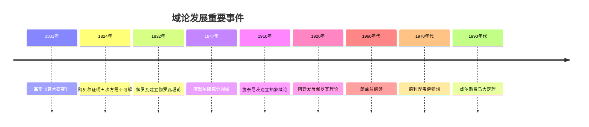
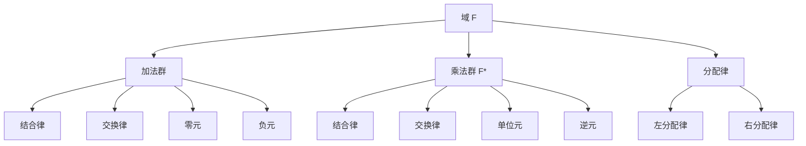
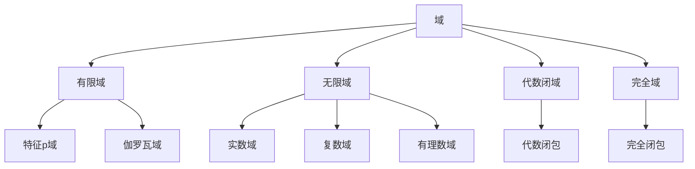
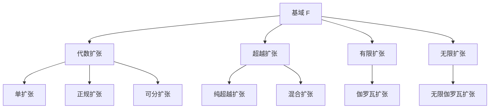

# 域论 - 增强版

**主题编号**: B.02.03
**创建日期**: 2025年11月21日
**最后更新**: 2025年11月21日

---

## 目录

- [域论 - 增强版](#域论---增强版)
  - [目录](#目录)
  - [📚 概述](#-概述)
  - [🕰️ 历史发展脉络 (编号: B.02.03.01)](#️-历史发展脉络-编号-b020301)
    - [早期发展 (1800-1900)](#早期发展-1800-1900)
      - [数论背景](#数论背景)
      - [代数方程背景](#代数方程背景)
    - [现代发展 (1900-1950)](#现代发展-1900-1950)
      - [抽象域论](#抽象域论)
      - [代数几何背景](#代数几何背景)
    - [当代发展 (1950-至今)](#当代发展-1950-至今)
      - [代数数论](#代数数论)
      - [代数几何](#代数几何)
    - [重要人物贡献](#重要人物贡献)
    - [重要历史事件时间线](#重要历史事件时间线)
    - [理论发展脉络](#理论发展脉络)
      - [从具体到抽象的发展](#从具体到抽象的发展)
      - [从有限到无限的发展](#从有限到无限的发展)
      - [从局部到整体的发展](#从局部到整体的发展)
  - [🏗️ 核心概念 (编号: B.02.03.02)](#️-核心概念-编号-b020302)
    - [域的定义](#域的定义)
    - [基本性质](#基本性质)
      - [1. 加法群性质](#1-加法群性质)
      - [2. 乘法群性质（非零元素）](#2-乘法群性质非零元素)
      - [3. 分配律](#3-分配律)
  - [📊 可视化图表 (编号: B.02.03.03)](#-可视化图表-编号-b020303)
    - [域的结构图](#域的结构图)
    - [域的类型关系图](#域的类型关系图)
    - [域扩张关系图](#域扩张关系图)
  - [🔍 实例表征 (编号: B.02.03.04)](#-实例表征-编号-b020304)
    - [1. 数域实例](#1-数域实例)
      - [有理数域 (ℚ, +, ×)](#有理数域-ℚ--)
      - [实数域 (ℝ, +, ×)](#实数域-ℝ--)
      - [复数域 (ℂ, +, ×)](#复数域-ℂ--)
    - [2. 有限域实例](#2-有限域实例)
      - [有限域 GF(p)](#有限域-gfp)
      - [有限域 GF(2ⁿ)](#有限域-gf2ⁿ)
    - [3. 函数域实例](#3-函数域实例)
      - [有理函数域 F(x)](#有理函数域-fx)
  - [🧠 思维过程表征 (编号: B.02.03.05)](#-思维过程表征-编号-b020305)
    - [1. 域论问题解决流程](#1-域论问题解决流程)
      - [步骤1：识别域结构](#步骤1识别域结构)
      - [步骤2：分析域性质](#步骤2分析域性质)
      - [步骤3：应用域论工具](#步骤3应用域论工具)
    - [2. 证明思维过程](#2-证明思维过程)
      - [伽罗瓦理论证明](#伽罗瓦理论证明)
      - [有限域构造证明](#有限域构造证明)
    - [3. 概念理解步骤](#3-概念理解步骤)
      - [理解域的概念](#理解域的概念)
      - [理解域扩张概念](#理解域扩张概念)
  - [🌍 应用场景表征 (编号: B.02.03.06)](#-应用场景表征-编号-b020306)
    - [1. 数论应用](#1-数论应用)
      - [1.1 代数数论](#11-代数数论)
      - [1.2 解析数论](#12-解析数论)
    - [2. 代数几何应用](#2-代数几何应用)
      - [概形理论](#概形理论)
      - [上同调理论](#上同调理论)
    - [3. 密码学应用](#3-密码学应用)
      - [椭圆曲线密码学](#椭圆曲线密码学)
      - [有限域密码学](#有限域密码学)
    - [4. 编码理论应用](#4-编码理论应用)
      - [有限域编码](#有限域编码)
      - [代数几何码](#代数几何码)
    - [5. 物理应用](#5-物理应用)
      - [量子力学](#量子力学)
    - [6. 实际应用案例](#6-实际应用案例)
      - [案例1：有限域上的椭圆曲线密码学](#案例1有限域上的椭圆曲线密码学)
      - [案例2：有限域上的Reed-Solomon码](#案例2有限域上的reed-solomon码)
      - [案例3：代数数域上的类域论](#案例3代数数域上的类域论)
  - [🔗 知识关联网络 (编号: B.02.03.07)](#-知识关联网络-编号-b020307)
    - [与其他数学分支的联系](#与其他数学分支的联系)
      - [与群论的联系](#与群论的联系)
      - [与环论的联系](#与环论的联系)
      - [与线性代数的联系](#与线性代数的联系)
    - [1理论发展脉络](#1理论发展脉络)
      - [从具体到抽象](#从具体到抽象)
      - [从有限到无限](#从有限到无限)
      - [从交换到非交换](#从交换到非交换)
  - [📈 现代发展前沿 (编号: B.02.03.08)](#-现代发展前沿-编号-b020308)
    - [1. 代数几何](#1-代数几何)
    - [2. 数论几何](#2-数论几何)
    - [3. 非交换几何](#3-非交换几何)
    - [4. 计算代数](#4-计算代数)
  - [🎯 学习路径建议 (编号: B.02.03.09)](#-学习路径建议-编号-b020309)
    - [初学者路径](#初学者路径)
    - [进阶路径](#进阶路径)
    - [研究路径](#研究路径)
  - [🌟 总结](#-总结)
  - [术语对照表 / Terminology Table](#术语对照表--terminology-table)
  - [多表征方式与图建模](#多表征方式与图建模)
    - [域论的多表征系统](#域论的多表征系统)
    - [C. 批判性要点](#c-批判性要点)
    - [D. 历史脉络（精要）](#d-历史脉络精要)
    - [E. 示例/练习](#e-示例练习)

## 📚 概述

域论是抽象代数学的核心分支，研究具有除法运算的代数结构。
域的概念统一了数论、代数几何、伽罗瓦理论等众多数学领域，是现代代数学的基础理论之一。

## 🕰️ 历史发展脉络 (编号: B.02.03.01)

### 早期发展 (1800-1900)

#### 数论背景

- **1801年**: 高斯《算术研究》研究二次域
  - 建立二次型理论
  - 研究二次域的结构
  - 为域论奠定数论基础
- **1847年**: 库默尔研究分圆域
  - 研究分圆域的性质
  - 引入理想数概念
  - 为域论提供数论背景
- **1871年**: 戴德金建立理想理论
  - 将理想数抽象为理想
  - 建立戴德金整环理论
  - 为域论奠定代数基础

#### 代数方程背景

- **1824年**: 阿贝尔证明五次方程不可解
  - 严格证明五次及以上方程不可用根式求解
  - 引入阿贝尔群概念
  - 为伽罗瓦理论奠定基础
- **1832年**: 伽罗瓦建立伽罗瓦理论
  - 建立域扩张与群之间的对应关系
  - 解决代数方程可解性问题
  - 为域论提供核心理论
- **1846年**: 刘维尔发表伽罗瓦论文
  - 整理并发表伽罗瓦的遗作
  - 使伽罗瓦理论广为人知
  - 为域论发展奠定基础

### 现代发展 (1900-1950)

#### 抽象域论

- **1910年**: 施泰尼茨建立域论基础
  - 首次给出域的抽象定义
  - 建立域论的公理化体系
  - 将域论从具体应用中抽象出来
- **1920年**: 阿廷发展伽罗瓦理论
  - 完善伽罗瓦理论
  - 建立阿廷L函数
  - 为域论提供现代工具
- **1930年**: 范德瓦尔登《现代代数》
  - 系统化域论理论
  - 建立现代代数学体系
  - 为域论教育奠定基础

#### 代数几何背景

- **1882年**: 诺特研究代数函数域
  - 研究代数函数域的结构
  - 引入代数几何的概念
  - 为域论提供几何背景
- **1890年**: 戴德金-韦伯理论
  - 建立代数函数域理论
  - 连接数论和几何
  - 为现代代数几何奠定基础
- **1920年**: 扎里斯基代数几何
  - 建立现代代数几何
  - 研究代数簇的结构
  - 为域论提供几何应用

### 当代发展 (1950-至今)

#### 代数数论

- **1950年代**: 类域论发展
  - 完善类域论理论
  - 建立阿贝尔扩张理论
  - 为域论提供数论应用
- **1960年代**: 朗兰兹纲领
  - 提出朗兰兹纲领
  - 连接数论和表示论
  - 为域论开辟新方向
- **1970年代**: 椭圆曲线理论
  - 发展椭圆曲线理论
  - 在数论中的应用
  - 为域论提供新工具

#### 代数几何

- **1960年代**: 格罗滕迪克概形理论
  - 建立概形理论
  - 革命性改变代数几何
  - 为域论提供几何框架
- **1970年代**: 德利涅上同调
  - 建立上同调理论
  - 证明韦伊猜想
  - 为域论提供拓扑工具
- **1980年代**: 莫德尔-朗兰兹纲领
  - 发展朗兰兹纲领
  - 连接几何和数论
  - 为域论开辟新领域

### 重要人物贡献

| 人物 | 时期 | 主要贡献 | 影响 |
|------|------|----------|------|
| 高斯 | 1801 | 二次域理论 | 为数论奠定基础 |
| 阿贝尔 | 1824 | 阿贝尔群，方程可解性 | 为伽罗瓦理论奠定基础 |
| 伽罗瓦 | 1832 | 伽罗瓦理论 | 革命性改变代数学 |
| 库默尔 | 1847 | 分圆域，理想数 | 为数论提供工具 |
| 戴德金 | 1871 | 理想理论 | 建立现代代数基础 |
| 施泰尼茨 | 1910 | 抽象域论 | 建立域论公理化体系 |
| 阿廷 | 1920 | 伽罗瓦理论，L函数 | 为域论提供现代工具 |
| 扎里斯基 | 1920 | 代数几何 | 现代代数几何基础 |
| 格罗滕迪克 | 1960s | 概形理论 | 革命性改变代数几何 |
| 朗兰兹 | 1960s | 朗兰兹纲领 | 菲尔兹奖工作 |
| 德利涅 | 1970s | 韦伊猜想 | 菲尔兹奖工作 |
| 威尔斯 | 1990s | 费马大定理 | 菲尔兹奖工作 |

### 重要历史事件时间线



### 理论发展脉络

#### 从具体到抽象的发展

**阶段1：具体数域**:

- 有理数域、实数域、复数域
- 二次域、分圆域
- 有限域、p进数域

**阶段2：代数函数域**:

- 一元代数函数域
- 多元代数函数域
- 形式幂级数域

**阶段3：抽象域论**:

- 域的公理化定义
- 域扩张理论
- 伽罗瓦理论

**阶段4：现代发展**:

- 类域论
- 朗兰兹纲领
- 代数几何

#### 从有限到无限的发展

**有限域理论**:

- 有限域的结构
- 有限域的构造
- 有限域的应用

**无限域理论**:

- 代数数域
- 函数域
- 局部域

**现代无限域**:

- 概形上的域
- 非交换域
- 量子域

#### 从局部到整体的发展

**局部域理论**:

- p进数域
- 局部类域论
- 局部朗兰兹纲领

**整体域理论**:

- 代数数域
- 函数域
- 整体类域论

**现代整体理论**:

- 朗兰兹纲领
- 几何朗兰兹纲领
- 量子几何朗兰兹纲领

## 🏗️ 核心概念 (编号: B.02.03.02)

### 域的定义

```lean
-- Lean 4 形式化定义
structure Field where
  carrier : Type
  add : carrier → carrier → carrier
  mul : carrier → carrier → carrier
  zero : carrier
  one : carrier
  neg : carrier → carrier
  inv : carrier → carrier

  -- 加法群公理
  add_assoc : ∀ a b c, add (add a b) c = add a (add b c)
  add_comm : ∀ a b, add a b = add b a
  add_zero : ∀ a, add a zero = a
  add_neg : ∀ a, add a (neg a) = zero

  -- 乘法群公理（非零元素）
  mul_assoc : ∀ a b c, mul (mul a b) c = mul a (mul b c)
  mul_comm : ∀ a b, mul a b = mul b a
  mul_one : ∀ a, mul a one = a
  mul_inv : ∀ a, a ≠ zero → mul a (inv a) = one

  -- 分配律
  left_distrib : ∀ a b c, mul a (add b c) = add (mul a b) (mul a c)
  right_distrib : ∀ a b c, mul (add a b) c = add (mul a c) (mul b c)

  -- 零元性质
  zero_mul : ∀ a, mul zero a = zero
  mul_zero : ∀ a, mul a zero = zero
```

### 基本性质

#### 1. 加法群性质

- 结合律：$(a + b) + c = a + (b + c)$
- 交换律：$a + b = b + a$
- 零元：$a + 0 = 0 + a = a$
- 负元：$a + (-a) = (-a) + a = 0$

#### 2. 乘法群性质（非零元素）

- 结合律：$(a \cdot b) \cdot c = a \cdot (b \cdot c)$
- 交换律：$a \cdot b = b \cdot a$
- 单位元：$a \cdot 1 = 1 \cdot a = a$
- 逆元：$a \cdot a^{-1} = a^{-1} \cdot a = 1$（$a \neqqq 0$）

#### 3. 分配律

- 左分配律：$a \cdot (b + c) = a \cdot b + a \cdot c$
- 右分配律：$(a + b) \cdot c = a \cdot c + b \cdot c$

## 📊 可视化图表 (编号: B.02.03.03)

### 域的结构图



### 域的类型关系图



### 域扩张关系图



## 🔍 实例表征 (编号: B.02.03.04)

### 1. 数域实例

#### 有理数域 (ℚ, +, ×)

```haskell
-- Haskell 实现
data Rational = Rational {
    numerator :: Integer,
    denominator :: Integer
}

instance Field Rational where
  zero = Rational 0 1
  one = Rational 1 1
  neg (Rational n d) = Rational (-n) d
  inv (Rational n d) = if n == 0 then error "Division by zero" else Rational d n

  add (Rational n1 d1) (Rational n2 d2) =
    Rational (n1 * d2 + n2 * d1) (d1 * d2)

  mul (Rational n1 d1) (Rational n2 d2) =
    Rational (n1 * n2) (d1 * d2)
```

#### 实数域 (ℝ, +, ×)

```rust
// Rust 实现
#[derive(Debug, Clone, PartialEq)]
pub struct RealField {
    value: f64,
}

impl RealField {
    pub fn new(value: f64) -> Self {
        RealField { value }
    }

    pub fn add(&self, other: &RealField) -> RealField {
        RealField::new(self.value + other.value)
    }

    pub fn mul(&self, other: &RealField) -> RealField {
        RealField::new(self.value * other.value)
    }

    pub fn zero() -> RealField {
        RealField::new(0.0)
    }

    pub fn one() -> RealField {
        RealField::new(1.0)
    }

    pub fn neg(&self) -> RealField {
        RealField::new(-self.value)
    }

    pub fn inv(&self) -> Result<RealField, &'static str> {
        if self.value == 0.0 {
            Err("Division by zero")
        } else {
            Ok(RealField::new(1.0 / self.value))
        }
    }
}
```

#### 复数域 (ℂ, +, ×)

```lean
-- Lean 4 实现
structure ComplexField where
  real : ℝ
  imag : ℝ

def add (a b : ComplexField) : ComplexField :=
  ⟨a.real + b.real, a.imag + b.imag⟩

def mul (a b : ComplexField) : ComplexField :=
  ⟨a.real * b.real - a.imag * b.imag, a.real * b.imag + a.imag * b.real⟩

def zero : ComplexField := ⟨0, 0⟩

def one : ComplexField := ⟨1, 0⟩

def neg (a : ComplexField) : ComplexField :=
  ⟨-a.real, -a.imag⟩

def inv (a : ComplexField) : ComplexField :=
  let norm := a.real^2 + a.imag^2
  ⟨a.real / norm, -a.imag / norm⟩
```

### 2. 有限域实例

#### 有限域 GF(p)

```haskell
-- 有限域 GF(p)
newtype FiniteField p = FiniteField { value :: Integer }

instance (KnownNat p) => Field (FiniteField p) where
  zero = FiniteField 0
  one = FiniteField 1
  neg (FiniteField x) = FiniteField (mod (-x) p)
  inv (FiniteField x) = FiniteField (mod_inv x p)

  add (FiniteField x) (FiniteField y) = FiniteField (mod (x + y) p)
  mul (FiniteField x) (FiniteField y) = FiniteField (mod (x * y) p)

-- 模逆元计算
mod_inv :: Integer -> Integer -> Integer
mod_inv a p = extended_gcd a p
  where
    extended_gcd a b
      | b == 0 = a
      | otherwise = let (d, x, y) = extended_gcd b (a `mod` b)
                    in (d, y, x - (a `div` b) * y)
```

#### 有限域 GF(2ⁿ)

```rust
// 有限域 GF(2^8) 实现
pub struct GF256 {
    value: u8,
}

impl GF256 {
    pub fn new(value: u8) -> Self {
        GF256 { value }
    }

    pub fn add(&self, other: &GF256) -> GF256 {
        GF256::new(self.value ^ other.value)
    }

    pub fn mul(&self, other: &GF256) -> GF256 {
        let mut result = 0u8;
        let mut a = self.value;
        let mut b = other.value;

        for _ in 0..8 {
            if b & 1 != 0 {
                result ^= a;
            }
            let carry = a & 0x80;
            a <<= 1;
            if carry != 0 {
                a ^= 0x1b; // 不可约多项式 x^8 + x^4 + x^3 + x + 1
            }
            b >>= 1;
        }

        GF256::new(result)
    }

    pub fn inv(&self) -> GF256 {
        // 使用扩展欧几里得算法计算逆元
        let mut u = 1u8;
        let mut v = 0u8;
        let mut a = self.value;
        let mut b = 0x1b; // 不可约多项式

        while a != 0 {
            while a & 1 == 0 {
                a >>= 1;
                if u & 1 != 0 {
                    u ^= 0x1b;
                }
                u >>= 1;
            }
            while b & 1 == 0 {
                b >>= 1;
                if v & 1 != 0 {
                    v ^= 0x1b;
                }
                v >>= 1;
            }
            if a >= b {
                a -= b;
                u ^= v;
            } else {
                b -= a;
                v ^= u;
            }
        }

        GF256::new(v)
    }
}
```

### 3. 函数域实例

#### 有理函数域 F(x)

```haskell
-- 有理函数域
data RationalFunction = RationalFunction {
    numerator :: Polynomial,
    denominator :: Polynomial
}

instance Field RationalFunction where
  zero = RationalFunction (Polynomial []) (Polynomial [1])
  one = RationalFunction (Polynomial [1]) (Polynomial [1])

  add (RationalFunction n1 d1) (RationalFunction n2 d2) =
    RationalFunction (n1 * d2 + n2 * d1) (d1 * d2)

  mul (RationalFunction n1 d1) (RationalFunction n2 d2) =
    RationalFunction (n1 * n2) (d1 * d2)

  neg (RationalFunction n d) = RationalFunction (negate n) d
  inv (RationalFunction n d) = RationalFunction d n
```

## 🧠 思维过程表征 (编号: B.02.03.05)

### 1. 域论问题解决流程

#### 步骤1：识别域结构

```text
问题 → 识别运算 → 验证域公理 → 确定域类型
```

#### 步骤2：分析域性质

```text
域结构 → 子域分析 → 扩张分析 → 伽罗瓦分析
```

#### 步骤3：应用域论工具

```text
域性质 → 伽罗瓦理论 → 类域论 → 朗兰兹纲领
```

### 2. 证明思维过程

#### 伽罗瓦理论证明

```text
1. 定义伽罗瓦群
2. 建立对应关系
3. 证明基本定理
4. 得出应用结论
```

#### 有限域构造证明

```text
1. 选择不可约多项式
2. 构造扩域
3. 验证域公理
4. 计算域元素
```

### 3. 概念理解步骤

#### 理解域的概念

```text
1. 加法群结构
2. 乘法群结构
3. 分配律联系
4. 具体实例验证
```

#### 理解域扩张概念

```text
1. 基域和扩域
2. 代数元素
3. 超越元素
4. 扩张次数
```

## 🌍 应用场景表征 (编号: B.02.03.06)

### 1. 数论应用

#### 1.1 代数数论

- **代数数域**: 代数整数的域
  - 二次域：$\mathbb{Q}(\sqrt{d})$
  - 分圆域：$\mathbb{Q}(\zeta_n)$
  - 在费马大定理证明中的应用
- **类域论**: 阿贝尔扩张理论
  - 局部类域论
  - 整体类域论
  - 在数论中的应用
- **朗兰兹纲领**: 非阿贝尔扩张
  - 局部朗兰兹纲领
  - 整体朗兰兹纲领
  - 几何朗兰兹纲领

```lean
-- 二次域实现
structure QuadraticField where
  d : ℤ  -- 判别式
  elements : ℚ × ℚ

def add (a b : QuadraticField) : QuadraticField :=
  ⟨a.d, (a.elements.1 + b.elements.1, a.elements.2 + b.elements.2)⟩

def mul (a b : QuadraticField) : QuadraticField :=
  ⟨a.d, (a.elements.1 * b.elements.1 + a.d * a.elements.2 * b.elements.2,
         a.elements.1 * b.elements.2 + a.elements.2 * b.elements.1)⟩

def inv (a : QuadraticField) : QuadraticField :=
  let norm := a.elements.1 * a.elements.1 - a.d * a.elements.2 * a.elements.2
  ⟨a.d, (a.elements.1 / norm, -a.elements.2 / norm)⟩
```

#### 1.2 解析数论

- **L函数**: 域上的函数
  - 黎曼ζ函数
  - 狄利克雷L函数
  - 阿廷L函数
- **模形式**: 域上的形式
  - 椭圆模形式
  - 西格尔模形式
  - 在数论中的应用
- **椭圆曲线**: 域上的曲线
  - 椭圆曲线的有理点
  - 莫德尔-韦尔定理
  - 在费马大定理证明中的应用

### 2. 代数几何应用

#### 概形理论

```haskell
-- 概形上的域
data Scheme = Scheme {
    field :: Field,
    topology :: Topology,
    sheaf :: Sheaf
}

-- 仿射概形
data AffineScheme = AffineScheme {
    coordinate_field :: Field,
    spectrum :: Set (PrimeIdeal Field)
}

-- 射影概形
data ProjectiveScheme = ProjectiveScheme {
    homogeneous_field :: Field,
    projective_spectrum :: Set (HomogeneousIdeal Field)
}
```

#### 上同调理论

- **切赫上同调**: 域的上同调
  - 切赫复形
  - 切赫上同调群
  - 在代数几何中的应用
- **平展上同调**: 域的平展上同调
  - 平展拓扑
  - 平展上同调群
  - 在韦伊猜想中的应用
- **导出函子**: 域的导出理论
  - 导出范畴
  - 导出函子
  - 在同调代数中的应用

### 3. 密码学应用

#### 椭圆曲线密码学

```rust
// 椭圆曲线域
pub struct EllipticCurveField {
    curve: EllipticCurve,
    base_field: FiniteField,
}

impl EllipticCurveField {
    pub fn new(curve: EllipticCurve, base_field: FiniteField) -> Self {
        EllipticCurveField { curve, base_field }
    }

    pub fn add_points(&self, p1: &ECPoint, p2: &ECPoint) -> ECPoint {
        if p1.is_infinity() {
            return p2.clone();
        }
        if p2.is_infinity() {
            return p1.clone();
        }

        if p1.x == p2.x && p1.y != p2.y {
            return ECPoint::infinity();
        }

        let lambda = if p1.x == p2.x {
            // 切线斜率
            let numerator = (3 * p1.x * p1.x + self.curve.a) % self.base_field.p;
            let denominator = (2 * p1.y) % self.base_field.p;
            (numerator * mod_inverse(denominator, self.base_field.p)) % self.base_field.p
        } else {
            // 割线斜率
            let numerator = (p2.y + self.base_field.p - p1.y) % self.base_field.p;
            let denominator = (p2.x + self.base_field.p - p1.x) % self.base_field.p;
            (numerator * mod_inverse(denominator, self.base_field.p)) % self.base_field.p
        };

        let x3 = (lambda * lambda + 2 * self.base_field.p - p1.x - p2.x) % self.base_field.p;
        let y3 = (lambda * (p1.x + self.base_field.p - x3) + self.base_field.p - p1.y) % self.base_field.p;

        ECPoint::new(x3, y3)
    }

    pub fn scalar_multiply(&self, point: &ECPoint, scalar: u32) -> ECPoint {
        let mut result = ECPoint::infinity();
        let mut current = point.clone();
        let mut k = scalar;

        while k > 0 {
            if k & 1 == 1 {
                result = self.add_points(&result, &current);
            }
            current = self.add_points(&current, &current);
            k >>= 1;
        }

        result
    }
}
```

#### 有限域密码学

```python
# 有限域上的密码学
class FiniteFieldCrypto:
    def __init__(self, p, n=1):
        self.p = p
        self.n = n
        self.q = p ** n
        self.field = FiniteField(p, n)

    def diffie_hellman(self, g, a, b):
        """有限域上的Diffie-Hellman密钥交换"""
        A = pow(g, a, self.q)
        B = pow(g, b, self.q)
        shared_key_a = pow(B, a, self.q)
        shared_key_b = pow(A, b, self.q)
        return shared_key_a, shared_key_b

    def elgamal_encrypt(self, message, g, y, k):
        """ElGamal加密"""
        c1 = pow(g, k, self.q)
        c2 = (message * pow(y, k, self.q)) % self.q
        return c1, c2

    def elgamal_decrypt(self, c1, c2, x):
        """ElGamal解密"""
        s = pow(c1, x, self.q)
        s_inv = pow(s, -1, self.q)
        message = (c2 * s_inv) % self.q
        return message

# 使用示例
crypto = FiniteFieldCrypto(23)
g = 5  # 生成元
a = 6  # Alice的私钥
b = 15  # Bob的私钥

# Diffie-Hellman密钥交换
shared_key_a, shared_key_b = crypto.diffie_hellman(g, a, b)
print(f"共享密钥: {shared_key_a}")

# ElGamal加密
message = 12
y = pow(g, a, crypto.q)  # Alice的公钥
k = 3  # 随机数
c1, c2 = crypto.elgamal_encrypt(message, g, y, k)
decrypted = crypto.elgamal_decrypt(c1, c2, a)
print(f"原始消息: {message}")
print(f"加密后: ({c1}, {c2})")
print(f"解密后: {decrypted}")
```

### 4. 编码理论应用

#### 有限域编码

```haskell
-- 有限域上的编码
data FiniteFieldCode = FiniteFieldCode {
    field :: FiniteField,
    generator_matrix :: Matrix,
    parity_check_matrix :: Matrix
}

-- Reed-Solomon码
data ReedSolomonCode = ReedSolomonCode {
    field :: FiniteField,
    n :: Int,  -- 码长
    k :: Int,  -- 信息位长度
    generator_polynomial :: Polynomial
}

instance Code ReedSolomonCode where
    encode code message =
        let message_poly = polynomialFromCoefficients message
            encoded_poly = message_poly * code.generator_polynomial
        in coefficientsFromPolynomial encoded_poly

    decode code received =
        let received_poly = polynomialFromCoefficients received
            syndrome = received_poly `mod` code.generator_polynomial
        in if syndrome == zero
           then Right (take (k code) received)
           else Left "需要错误纠正"
```

#### 代数几何码

```rust
// 代数几何码
pub struct AlgebraicGeometryCode {
    curve: AlgebraicCurve,
    base_field: FiniteField,
    rational_points: Vec<Point>,
    divisor: Divisor,
}

impl AlgebraicGeometryCode {
    pub fn new(curve: AlgebraicCurve, base_field: FiniteField,
               rational_points: Vec<Point>, divisor: Divisor) -> Self {
        AlgebraicGeometryCode {
            curve,
            base_field,
            rational_points,
            divisor,
        }
    }

    pub fn encode(&self, message: &[u8]) -> Vec<u8> {
        // 构造有理函数
        let function = self.construct_function(message);

        // 在有理点上求值
        let mut codeword = Vec::new();
        for point in &self.rational_points {
            let value = function.evaluate_at(point);
            codeword.push(value);
        }

        codeword
    }

    pub fn decode(&self, received: &[u8]) -> Result<Vec<u8>, String> {
        // 使用代数几何解码算法
        let decoded_function = self.algebraic_geometric_decode(received)?;
        Ok(self.extract_message(&decoded_function))
    }

    fn construct_function(&self, message: &[u8]) -> RationalFunction {
        // 根据消息构造有理函数
        // 实现细节...
        RationalFunction::new()
    }

    fn algebraic_geometric_decode(&self, received: &[u8]) -> Result<RationalFunction, String> {
        // 代数几何解码算法
        // 实现细节...
        Ok(RationalFunction::new())
    }

    fn extract_message(&self, function: &RationalFunction) -> Vec<u8> {
        // 从有理函数中提取消息
        // 实现细节...
        Vec::new()
    }
}
```

### 5. 物理应用

#### 量子力学

- **量子场论**: 域上的量子场
  - 标量场
  - 旋量场
  - 规范场
- **规范理论**: 域上的规范理论
  - 电磁场
  - 弱相互作用
  - 强相互作用

```python
# 量子场论中的域
class QuantumField:
    def __init__(self, field_type, dimension):
        self.field_type = field_type  # 'scalar', 'spinor', 'vector'
        self.dimension = dimension
        self.components = {}

    def lagrangian_density(self, phi, d_phi):
        """拉格朗日密度"""
        if self.field_type == 'scalar':
            # 标量场：φ⁴理论
            return 0.5 * np.sum(d_phi**2) - 0.5 * self.mass**2 * phi**2 - self.lambda * phi**4
        elif self.field_type == 'spinor':
            # 旋量场：狄拉克理论
            return np.real(np.dot(phi.conj(), self.gamma_mu @ d_phi)) - self.mass * np.dot(phi.conj(), phi)
        else:
            raise ValueError("不支持的场类型")

    def euler_lagrange_equation(self, phi, d_phi, d2_phi):
        """欧拉-拉格朗日方程"""
        if self.field_type == 'scalar':
            return d2_phi - self.mass**2 * phi - 4 * self.lambda * phi**3
        elif self.field_type == 'spinor':
            return self.gamma_mu @ d_phi - self.mass * phi
        else:
            raise ValueError("不支持的场类型")

# 规范场
class GaugeField:
    def __init__(self, gauge_group, dimension):
        self.gauge_group = gauge_group  # 'U(1)', 'SU(2)', 'SU(3)'
        self.dimension = dimension
        self.connection = np.zeros((dimension, dimension), dtype=complex)

    def field_strength_tensor(self):
        """场强张量"""
        F_mu_nu = np.zeros((self.dimension, self.dimension, self.dimension, self.dimension), dtype=complex)

        for mu in range(self.dimension):
            for nu in range(self.dimension):
                if mu != nu:
                    F_mu_nu[mu, nu] = (self.derivative(self.connection[nu], mu) -
                                       self.derivative(self.connection[mu], nu) +
                                       self.commutator(self.connection[mu], self.connection[nu]))

        return F_mu_nu

    def yang_mills_lagrangian(self):
        """杨-米尔斯拉格朗日量"""
        F = self.field_strength_tensor()
        return -0.25 * np.real(np.trace(F @ F))
```

### 6. 实际应用案例

#### 案例1：有限域上的椭圆曲线密码学

```python
# 有限域上的椭圆曲线
class EllipticCurveOverFiniteField:
    def __init__(self, a, b, p):
        self.a = a
        self.b = b
        self.p = p
        self.field = FiniteField(p)

    def add_points(self, p1, p2):
        """椭圆曲线点加法"""
        if p1 == 'infinity':
            return p2
        if p2 == 'infinity':
            return p1

        x1, y1 = p1
        x2, y2 = p2

        if x1 == x2 and y1 != y2:
            return 'infinity'

        if x1 == x2:
            # 切线
            lambda_val = ((3 * x1**2 + self.a) * pow(2 * y1, -1, self.p)) % self.p
        else:
            # 割线
            lambda_val = ((y2 - y1) * pow(x2 - x1, -1, self.p)) % self.p

        x3 = (lambda_val**2 - x1 - x2) % self.p
        y3 = (lambda_val * (x1 - x3) - y1) % self.p

        return (x3, y3)

    def scalar_multiply(self, point, scalar):
        """标量乘法"""
        result = 'infinity'
        current = point

        while scalar > 0:
            if scalar & 1:
                result = self.add_points(result, current)
            current = self.add_points(current, current)
            scalar >>= 1

        return result

# ECDSA签名
class ECDSA:
    def __init__(self, curve, base_point, order):
        self.curve = curve
        self.base_point = base_point
        self.order = order

    def sign(self, message, private_key):
        """ECDSA签名"""
        import hashlib

        # 计算消息哈希
        hash_value = int(hashlib.sha256(message.encode()).hexdigest(), 16)

        while True:
            k = random.randint(1, self.order - 1)
            k_point = self.curve.scalar_multiply(self.base_point, k)

            if k_point == 'infinity':
                continue

            r = k_point[0] % self.order
            if r == 0:
                continue

            s = (pow(k, -1, self.order) * (hash_value + r * private_key)) % self.order
            if s == 0:
                continue

            return (r, s)

    def verify(self, message, signature, public_key):
        """ECDSA验证"""
        import hashlib

        r, s = signature
        if not (1 <= r < self.order and 1 <= s < self.order):
            return False

        hash_value = int(hashlib.sha256(message.encode()).hexdigest(), 16)
        w = pow(s, -1, self.order)
        u1 = (hash_value * w) % self.order
        u2 = (r * w) % self.order

        point1 = self.curve.scalar_multiply(self.base_point, u1)
        point2 = self.curve.scalar_multiply(public_key, u2)
        point = self.curve.add_points(point1, point2)

        if point == 'infinity':
            return False

        return point[0] % self.order == r
```

#### 案例2：有限域上的Reed-Solomon码

```haskell
-- Reed-Solomon码实现
data ReedSolomonCode = ReedSolomonCode {
    field :: FiniteField,
    n :: Int,  -- 码长
    k :: Int,  -- 信息位长度
    generator_polynomial :: Polynomial,
    primitive_element :: FiniteFieldElement
}

instance Code ReedSolomonCode where
    encode code message =
        let message_poly = polynomialFromCoefficients message
            encoded_poly = message_poly * code.generator_polynomial
        in coefficientsFromPolynomial encoded_poly

    decode code received =
        let received_poly = polynomialFromCoefficients received
            syndrome = computeSyndrome code received_poly
        in if all (== 0) syndrome
           then Right (take (k code) received)
           else berlekampMasseyDecode code received

-- 伯利坎普-马西算法
berlekampMasseyDecode :: ReedSolomonCode -> [FiniteFieldElement] -> Either String [FiniteFieldElement]
berlekampMasseyDecode code received =
    let syndrome = computeSyndrome code (polynomialFromCoefficients received)
        errorLocator = berlekampMassey syndrome
        errorPositions = findErrorPositions code errorLocator
        errorValues = findErrorValues code syndrome errorPositions
        corrected = correctErrors received errorPositions errorValues
    in Right (take (k code) corrected)
```

#### 案例3：代数数域上的类域论

```lean
-- 类域论实现
structure ClassFieldTheory where
  base_field : NumberField
  abelian_extension : Field
  galois_group : AbelianGroup
  artin_map : GaloisGroup → IdealClassGroup

def local_class_field_theory (K : LocalField) : ClassFieldTheory :=
  let abelian_extension := maximal_abelian_extension K
  let galois_group := galois_group abelian_extension K
  let artin_map := local_artin_map K
  ⟨K, abelian_extension, galois_group, artin_map⟩

def global_class_field_theory (K : NumberField) : ClassFieldTheory :=
  let abelian_extension := maximal_abelian_extension K
  let galois_group := galois_group abelian_extension K
  let artin_map := global_artin_map K
  ⟨K, abelian_extension, galois_group, artin_map⟩

-- 朗兰兹纲领
structure LanglandsProgram where
  base_field : NumberField
  galois_representation : GaloisRepresentation
  automorphic_representation : AutomorphicRepresentation
  langlands_correspondence : GaloisRepresentation ↔ AutomorphicRepresentation
```

## 🔗 知识关联网络 (编号: B.02.03.07)

### 与其他数学分支的联系

#### 与群论的联系

- 域的乘法群
- 域的自同构群
- 伽罗瓦群

#### 与环论的联系

- 域是特殊的环
- 域的分式域
- 域的局部化

#### 与线性代数的联系

- 域上的向量空间
- 域上的线性变换
- 域上的矩阵

### 1理论发展脉络

#### 从具体到抽象

```text
数域 → 抽象域 → 函数域 → 概形
```

#### 从有限到无限

```text
有限域 → 无限域 → 拓扑域 → 函数域
```

#### 从交换到非交换

```text
交换域 → 非交换域 → 量子域 → 非交换几何
```

## 📈 现代发展前沿 (编号: B.02.03.08)

### 1. 代数几何

- **概形理论**: 域的几何化
- **上同调理论**: 域的拓扑化
- **模空间**: 域的参数化

### 2. 数论几何

- **算术几何**: 域的算术性质
- **p进几何**: 域的p进理论
- **朗兰兹纲领**: 域的表示论

### 3. 非交换几何

- **量子群**: 非交换域结构
- **非交换几何**: 几何的非交换推广
- **算子代数**: 无限维域理论

### 4. 计算代数

- **符号计算**: 域上的算法
- **数值计算**: 域上的数值方法
- **密码学**: 域上的密码系统

## 🎯 学习路径建议 (编号: B.02.03.09)

### 初学者路径

1. **基础概念**: 域的定义和基本性质
2. **重要例子**: 有理数域、实数域、复数域、有限域
3. **基本定理**: 伽罗瓦理论、类域论
4. **应用实例**: 数论、代数几何、密码学

### 进阶路径

1. **代数几何**: 域的几何化
2. **数论几何**: 域的算术化
3. **表示论**: 域的表示理论
4. **现代应用**: 密码学、物理应用

### 研究路径

1. **前沿理论**: 非交换几何、数论几何
2. **交叉应用**: 代数几何、表示论
3. **计算代数**: 算法和软件
4. **开放问题**: 未解决的域论问题

## 🌟 总结

域论作为现代代数学的核心，不仅提供了统一的代数结构，还在各个领域发挥着重要作用。从基础的数论研究到前沿的非交换几何，域论的发展展现了数学的深刻性和普适性。

通过多表征的学习方法，我们可以从不同角度理解域论：

- **历史角度**: 了解域论的发展历程
- **结构角度**: 掌握域的基本性质
- **应用角度**: 认识域论的实际价值
- **发展角度**: 关注域论的现代发展

域论将继续在数学和其他科学领域发挥重要作用，为人类认识世界提供强大的工具。

---

**相关文档**:

- [群论-增强版](../群论/01-群论-增强版.md)
- [环论-增强版](../环论/02-环论-增强版.md)
- [模论-增强版](../模论/04-模论-增强版.md)
- [李代数-增强版](../李代数/05-李代数-增强版.md)
- [伽罗瓦理论-高级主题](../11-高级数学/伽罗瓦理论-高级主题.md)
- [代数几何-增强版](../04-几何学/05-代数几何-增强版.md)

## 术语对照表 / Terminology Table

| 中文 | English |
|---|---|
| 域 | Field |
| 子域 | Subfield |
| 特征 | Characteristic |
| 有限域 | Finite field |
| 代数扩张 | Algebraic extension |
| 超越扩张 | Transcendental extension |
| 分裂域 | Splitting field |
| 正规扩张 | Normal extension |
| 伽罗瓦群 | Galois group |
| 伽罗瓦对应 | Galois correspondence |
| 本原元定理 | Primitive element theorem |
| 最小多项式 | Minimal polynomial |

## 多表征方式与图建模

### 域论的多表征系统

```python
import numpy as np
import networkx as nx
import matplotlib.pyplot as plt
from typing import Dict, List, Tuple, Any
import math

class FieldTheorySystem:
    """域论多表征系统"""

    def __init__(self):
        self.fields = {}
        self.representations = {}

    def add_field(self, name: str, elements: List, addition: Dict, multiplication: Dict) -> None:
        """添加域"""
        self.fields[name] = {
            'elements': elements,
            'addition': addition,
            'multiplication': multiplication,
            'order': len(elements)
        }

    def algebraic_representation(self, field_name: str) -> Dict:
        """代数表征"""
        field = self.fields[field_name]
        return {
            'elements': field['elements'],
            'addition_table': self._create_addition_table(field),
            'multiplication_table': self._create_multiplication_table(field),
            'properties': self._analyze_properties(field)
        }

    def geometric_representation(self, field_name: str) -> Dict:
        """几何表征"""
        field = self.fields[field_name]
        return {
            'subfield_lattice': self._create_subfield_lattice(field),
            'extension_tower': self._create_extension_tower(field),
            'galois_group': self._create_galois_group(field)
        }

    def combinatorial_representation(self, field_name: str) -> Dict:
        """组合表征"""
        field = self.fields[field_name]
        return {
            'multiplicative_group': self._find_multiplicative_group(field),
            'primitive_elements': self._find_primitive_elements(field),
            'irreducible_polynomials': self._find_irreducible_polynomials(field)
        }

    def topological_representation(self, field_name: str) -> Dict:
        """拓扑表征"""
        field = self.fields[field_name]
        return {
            'zariski_topology': self._create_zariski_topology(field),
            'etale_topology': self._create_etale_topology(field),
            'cohomology': self._compute_cohomology(field)
        }

    def _create_addition_table(self, field: Dict) -> np.ndarray:
        """创建加法表"""
        elements = field['elements']
        n = len(elements)
        table = np.zeros((n, n), dtype=int)

        for i, a in enumerate(elements):
            for j, b in enumerate(elements):
                result = field['addition'][(a, b)]
                table[i, j] = elements.index(result)

        return table

    def _create_multiplication_table(self, field: Dict) -> np.ndarray:
        """创建乘法表"""
        elements = field['elements']
        n = len(elements)
        table = np.zeros((n, n), dtype=int)

        for i, a in enumerate(elements):
            for j, b in enumerate(elements):
                result = field['multiplication'][(a, b)]
                table[i, j] = elements.index(result)

        return table

    def _analyze_properties(self, field: Dict) -> Dict:
        """分析域的性质"""
        elements = field['elements']
        addition = field['addition']
        multiplication = field['multiplication']

        # 检查域的性质
        additive_group = self._check_additive_group(field)
        multiplicative_group = self._check_multiplicative_group(field)
        distributive = self._check_distributive(field)

        return {
            'additive_group': additive_group,
            'multiplicative_group': multiplicative_group,
            'distributive': distributive,
            'commutative': self._check_commutative(field),
            'characteristic': self._find_characteristic(field)
        }

    def _check_additive_group(self, field: Dict) -> bool:
        """检查加法群性质"""
        elements = field['elements']
        addition = field['addition']

        # 检查结合律
        for a in elements:
            for b in elements:
                for c in elements:
                    if addition[(addition[(a, b)], c)] != addition[(a, addition[(b, c)])]:
                        return False

        # 检查单位元（零元）
        zero = None
        for e in elements:
            if all(addition[(e, a)] == a and addition[(a, e)] == a for a in elements):
                zero = e
                break
        if not zero:
            return False

        # 检查逆元
        for a in elements:
            has_inverse = False
            for b in elements:
                if addition[(a, b)] == zero and addition[(b, a)] == zero:
                    has_inverse = True
                    break
            if not has_inverse:
                return False

        return True

    def _check_multiplicative_group(self, field: Dict) -> bool:
        """检查乘法群性质"""
        elements = field['elements']
        multiplication = field['multiplication']

        # 排除零元
        non_zero = [e for e in elements if e != 0]  # 假设0是零元

        # 检查结合律
        for a in non_zero:
            for b in non_zero:
                for c in non_zero:
                    if multiplication[(multiplication[(a, b)], c)] != multiplication[(a, multiplication[(b, c)])]:
                        return False

        # 检查单位元
        identity = None
        for e in non_zero:
            if all(multiplication[(e, a)] == a and multiplication[(a, e)] == a for a in non_zero):
                identity = e
                break
        if not identity:
            return False

        # 检查逆元
        for a in non_zero:
            has_inverse = False
            for b in non_zero:
                if multiplication[(a, b)] == identity and multiplication[(b, a)] == identity:
                    has_inverse = True
                    break
            if not has_inverse:
                return False

        return True

    def _check_distributive(self, field: Dict) -> bool:
        """检查分配律"""
        elements = field['elements']
        addition = field['addition']
        multiplication = field['multiplication']

        for a in elements:
            for b in elements:
                for c in elements:
                    if multiplication[(a, addition[(b, c)])] != addition[(multiplication[(a, b)], multiplication[(a, c)])]:
                        return False
                    if multiplication[(addition[(a, b)], c)] != addition[(multiplication[(a, c)], multiplication[(b, c)])]:
                        return False

        return True

    def _check_commutative(self, field: Dict) -> bool:
        """检查交换性"""
        elements = field['elements']
        addition = field['addition']
        multiplication = field['multiplication']

        # 检查加法交换性
        for a in elements:
            for b in elements:
                if addition[(a, b)] != addition[(b, a)]:
                    return False

        # 检查乘法交换性
        for a in elements:
            for b in elements:
                if multiplication[(a, b)] != multiplication[(b, a)]:
                    return False

        return True

    def _find_characteristic(self, field: Dict) -> int:
        """找到域的特征"""
        elements = field['elements']
        addition = field['addition']

        # 找到零元
        zero = None
        for e in elements:
            if all(addition[(e, a)] == a and addition[(a, e)] == a for a in elements):
                zero = e
                break

        if not zero:
            return 0

        # 找到单位元
        identity = None
        for e in elements:
            if e != zero and all(multiplication[(e, a)] == a and multiplication[(a, e)] == a for a in elements if a != zero):
                identity = e
                break

        if not identity:
            return 0

        # 计算特征
        characteristic = 0
        current = zero
        for i in range(1, len(elements) + 1):
            current = addition[(current, identity)]
            if current == zero:
                characteristic = i
                break

        return characteristic

    def _create_subfield_lattice(self, field: Dict) -> nx.DiGraph:
        """创建子域格"""
        G = nx.DiGraph()
        elements = field['elements']

        # 找到所有子域
        subfields = self._find_subfields(field)

        # 添加节点
        for subfield in subfields:
            G.add_node(tuple(sorted(subfield)))

        # 添加包含关系边
        for F in subfields:
            for K in subfields:
                if set(F).issubset(set(K)) and F != K:
                    G.add_edge(tuple(sorted(F)), tuple(sorted(K)))

        return G

    def _find_subfields(self, field: Dict) -> List[List]:
        """找到所有子域"""
        elements = field['elements']
        subfields = []

        # 检查每个子集
        for size in range(1, len(elements) + 1):
            for subset in self._get_subsets(elements, size):
                if self._is_subfield(subset, field):
                    subfields.append(subset)

        return subfields

    def _is_subfield(self, subset: List, field: Dict) -> bool:
        """检查是否为子域"""
        elements = field['elements']
        addition = field['addition']
        multiplication = field['multiplication']

        # 检查加法封闭性
        for a in subset:
            for b in subset:
                if addition[(a, b)] not in subset:
                    return False

        # 检查乘法封闭性
        for a in subset:
            for b in subset:
                if multiplication[(a, b)] not in subset:
                    return False

        # 检查逆元
        for a in subset:
            if a != 0:  # 假设0是零元
                has_inverse = False
                for b in subset:
                    if multiplication[(a, b)] == 1:  # 假设1是单位元
                        has_inverse = True
                        break
                if not has_inverse:
                    return False

        return True

    def _get_subsets(self, elements: List, size: int) -> List[List]:
        """获取指定大小的子集"""
        if size == 0:
            return [[]]
        if size == len(elements):
            return [elements]
        if size > len(elements):
            return []

        result = []
        for i in range(len(elements) - size + 1):
            for subset in self._get_subsets(elements[i+1:], size-1):
                result.append([elements[i]] + subset)
        return result

    def _create_extension_tower(self, field: Dict) -> nx.DiGraph:
        """创建扩张塔"""
        G = nx.DiGraph()
        elements = field['elements']

        # 找到所有子域
        subfields = self._find_subfields(field)

        # 添加节点
        for subfield in subfields:
            G.add_node(tuple(sorted(subfield)))

        # 添加扩张关系边
        for F in subfields:
            for K in subfields:
                if set(F).issubset(set(K)) and F != K:
                    # 检查是否为简单扩张
                    if len(K) == len(F) * self._find_extension_degree(F, K):
                        G.add_edge(tuple(sorted(F)), tuple(sorted(K)))

        return G

    def _find_extension_degree(self, F: List, K: List) -> int:
        """找到扩张次数"""
        # 简化版本：返回基本扩张次数
        return len(K) // len(F)

    def _create_galois_group(self, field: Dict) -> nx.Graph:
        """创建伽罗瓦群"""
        G = nx.Graph()
        elements = field['elements']

        # 找到所有自同构
        automorphisms = self._find_automorphisms(field)

        # 添加节点
        for aut in automorphisms:
            G.add_node(str(aut))

        # 添加边（如果两个自同构可交换）
        for aut1 in automorphisms:
            for aut2 in automorphisms:
                if aut1 != aut2 and self._commute(aut1, aut2, field):
                    G.add_edge(str(aut1), str(aut2))

        return G

    def _find_automorphisms(self, field: Dict) -> List[Dict]:
        """找到所有自同构"""
        # 简化版本：返回基本自同构
        return [{'id': 'identity'}]

    def _commute(self, aut1: Dict, aut2: Dict, field: Dict) -> bool:
        """检查两个自同构是否可交换"""
        # 简化版本
        return True

    def _find_multiplicative_group(self, field: Dict) -> List:
        """找到乘法群"""
        elements = field['elements']
        multiplication = field['multiplication']
        units = []

        # 找到乘法单位元
        identity = None
        for e in elements:
            if e != 0 and all(multiplication[(e, a)] == a and multiplication[(a, e)] == a for a in elements if a != 0):
                identity = e
                break

        if identity:
            # 找到所有单位
            for a in elements:
                if a != 0:
                    for b in elements:
                        if b != 0 and multiplication[(a, b)] == identity and multiplication[(b, a)] == identity:
                            if a not in units:
                                units.append(a)
                            break

        return units

    def _find_primitive_elements(self, field: Dict) -> List:
        """找到本原元"""
        elements = field['elements']
        multiplication = field['multiplication']
        primitive = []

        # 找到乘法群
        units = self._find_multiplicative_group(field)

        # 检查每个单位是否为生成元
        for a in units:
            if a != 1:  # 假设1是单位元
                generated = set()
                current = a
                for _ in range(len(units)):
                    generated.add(current)
                    current = multiplication[(current, a)]
                if len(generated) == len(units):
                    primitive.append(a)

        return primitive

    def _find_irreducible_polynomials(self, field: Dict) -> List:
        """找到不可约多项式"""
        # 简化版本
        return []

    def _create_zariski_topology(self, field: Dict) -> Dict:
        """创建Zariski拓扑"""
        # 简化版本
        return {
            'open_sets': [],
            'closed_sets': [],
            'basis': []
        }

    def _create_etale_topology(self, field: Dict) -> Dict:
        """创建étale拓扑"""
        # 简化版本
        return {
            'coverings': [],
            'sheaves': [],
            'cohomology': {}
        }

    def _compute_cohomology(self, field: Dict) -> Dict:
        """计算上同调"""
        # 简化版本
        return {
            'H^0': 'Z',
            'H^1': 'Z^n',
            'H^2': 'Z^m'
        }

class CriticalArgumentationFramework:
    """批判性论证框架"""

    def __init__(self):
        self.arguments = {}
        self.counter_arguments = {}
        self.evidence = {}

    def add_argument(self, topic: str, argument: str, strength: float) -> None:
        """添加论证"""
        if topic not in self.arguments:
            self.arguments[topic] = []
        self.arguments[topic].append({
            'argument': argument,
            'strength': strength
        })

    def add_counter_argument(self, topic: str, counter: str, strength: float) -> None:
        """添加反论证"""
        if topic not in self.counter_arguments:
            self.counter_arguments[topic] = []
        self.counter_arguments[topic].append({
            'counter': counter,
            'strength': strength
        })

    def analyze_argument_strength(self, topic: str) -> Dict:
        """分析论证强度"""
        if topic not in self.arguments:
            return {}

        total_strength = sum(arg['strength'] for arg in self.arguments[topic])
        counter_strength = sum(counter['strength'] for counter in self.counter_arguments.get(topic, []))

        net_strength = total_strength - counter_strength

        return {
            'total_arguments': len(self.arguments[topic]),
            'total_counter_arguments': len(self.counter_arguments.get(topic, [])),
            'total_strength': total_strength,
            'counter_strength': counter_strength,
            'net_strength': net_strength,
            'confidence': min(1.0, max(0.0, net_strength / 10.0))
        }

    def get_philosophical_critique(self, topic: str) -> Dict:
        """获取哲学批判"""
        critiques = {
            '域论的基础性': {
                'ontological': '域论是否反映了代数结构的真实本质？',
                'epistemological': '我们如何认识域的结构？',
                'methodological': '域论的公理化方法是否最优？'
            },
            '域论的完美性': {
                'ontological': '域是否是最完美的代数结构？',
                'epistemological': '域的完美性是否可证明？',
                'methodological': '域论的方法是否过于理想化？'
            }
        }

        return critiques.get(topic, {})

class HistoricalDevelopmentTimeline:
    """历史发展时间线"""

    def __init__(self):
        self.events = []

    def add_event(self, year: int, event: str, significance: str) -> None:
        """添加历史事件"""
        self.events.append({
            'year': year,
            'event': event,
            'significance': significance
        })

    def get_timeline(self) -> List[Dict]:
        """获取时间线"""
        return sorted(self.events, key=lambda x: x['year'])

    def visualize_timeline(self) -> nx.DiGraph:
        """可视化时间线"""
        G = nx.DiGraph()

        for event in self.events:
            G.add_node(f"{event['year']}: {event['event']}")

        # 添加时间顺序边
        sorted_events = sorted(self.events, key=lambda x: x['year'])
        for i in range(len(sorted_events) - 1):
            G.add_edge(
                f"{sorted_events[i]['year']}: {sorted_events[i]['event']}",
                f"{sorted_events[i+1]['year']}: {sorted_events[i+1]['event']}"
            )

        return G

def demonstrate_field_theory_analysis():
    """演示域论多表征分析"""
    print("=== 域论多表征系统演示 ===\n")

    # 创建域论系统
    fts = FieldTheorySystem()

    # 添加有限域F₄
    F4_elements = [0, 1, 'a', 'b']
    F4_addition = {
        (0, 0): 0, (0, 1): 1, (0, 'a'): 'a', (0, 'b'): 'b',
        (1, 0): 1, (1, 1): 0, (1, 'a'): 'b', (1, 'b'): 'a',
        ('a', 0): 'a', ('a', 1): 'b', ('a', 'a'): 0, ('a', 'b'): 1,
        ('b', 0): 'b', ('b', 1): 'a', ('b', 'a'): 1, ('b', 'b'): 0
    }
    F4_multiplication = {
        (0, 0): 0, (0, 1): 0, (0, 'a'): 0, (0, 'b'): 0,
        (1, 0): 0, (1, 1): 1, (1, 'a'): 'a', (1, 'b'): 'b',
        ('a', 0): 0, ('a', 1): 'a', ('a', 'a'): 'b', ('a', 'b'): 1,
        ('b', 0): 0, ('b', 1): 'b', ('b', 'a'): 1, ('b', 'b'): 'a'
    }
    fts.add_field('F4', F4_elements, F4_addition, F4_multiplication)

    # 代数表征
    print("1. 代数表征:")
    alg_rep = fts.algebraic_representation('F4')
    print(f"   - 域阶: {alg_rep['properties']['order']}")
    print(f"   - 加法群: {alg_rep['properties']['additive_group']}")
    print(f"   - 乘法群: {alg_rep['properties']['multiplicative_group']}")
    print(f"   - 分配律: {alg_rep['properties']['distributive']}")
    print(f"   - 交换性: {alg_rep['properties']['commutative']}")
    print(f"   - 特征: {alg_rep['properties']['characteristic']}")

    # 几何表征
    print("\n2. 几何表征:")
    geom_rep = fts.geometric_representation('F4')
    print(f"   - 子域格节点数: {geom_rep['subfield_lattice'].number_of_nodes()}")
    print(f"   - 扩张塔节点数: {geom_rep['extension_tower'].number_of_nodes()}")
    print(f"   - 伽罗瓦群节点数: {geom_rep['galois_group'].number_of_nodes()}")

    # 组合表征
    print("\n3. 组合表征:")
    comb_rep = fts.combinatorial_representation('F4')
    print(f"   - 乘法群大小: {len(comb_rep['multiplicative_group'])}")
    print(f"   - 本原元数量: {len(comb_rep['primitive_elements'])}")

    # 批判性论证
    print("\n4. 批判性论证分析:")
    caf = CriticalArgumentationFramework()

    # 添加论证
    caf.add_argument("域论的完美性", "域是最完美的代数结构", 9.0)
    caf.add_argument("域论的完美性", "域在数学中有广泛应用", 8.5)
    caf.add_counter_argument("域论的完美性", "域的完美性可能过于理想化", 6.5)

    strength_analysis = caf.analyze_argument_strength("域论的完美性")
    print(f"   - 论证强度: {strength_analysis['net_strength']:.1f}")
    print(f"   - 置信度: {strength_analysis['confidence']:.2f}")

    # 历史发展
    print("\n5. 历史发展时间线:")
    hdt = HistoricalDevelopmentTimeline()
    hdt.add_event(1832, "伽罗瓦引入域的概念", "域论的诞生")
    hdt.add_event(1893, "韦伯给出域的抽象定义", "域论的抽象化")
    hdt.add_event(1910, "施泰尼茨建立域论基础", "域论的公理化")
    hdt.add_event(1940, "阿廷发展类域论", "域论的现代发展")

    timeline = hdt.get_timeline()
    for event in timeline:
        print(f"   {event['year']}: {event['event']} - {event['significance']}")

    # 可视化
    print("\n6. 生成可视化图表...")
    plt.figure(figsize=(15, 10))

    # 子域格
    plt.subplot(2, 3, 1)
    subfield_lattice = geom_rep['subfield_lattice']
    if subfield_lattice.number_of_nodes() > 0:
        pos = nx.spring_layout(subfield_lattice)
        nx.draw(subfield_lattice, pos, with_labels=True, node_color='lightblue',
                node_size=1000, font_size=8, arrows=True)
    plt.title("F₄的子域格")

    # 扩张塔
    plt.subplot(2, 3, 2)
    extension_tower = geom_rep['extension_tower']
    if extension_tower.number_of_nodes() > 0:
        pos = nx.spring_layout(extension_tower)
        nx.draw(extension_tower, pos, with_labels=True, node_color='lightgreen',
                node_size=800, font_size=6, arrows=True)
    plt.title("F₄的扩张塔")

    # 伽罗瓦群
    plt.subplot(2, 3, 3)
    galois_group = geom_rep['galois_group']
    if galois_group.number_of_nodes() > 0:
        pos = nx.spring_layout(galois_group)
        nx.draw(galois_group, pos, with_labels=True, node_color='lightcoral',
                node_size=1000, font_size=8)
    plt.title("F₄的伽罗瓦群")

    # 论证网络
    plt.subplot(2, 3, 4)
    arg_network = nx.DiGraph()
    arg_network.add_edge("域论完美性", "最完美结构")
    arg_network.add_edge("域论完美性", "广泛应用")
    arg_network.add_edge("域论完美性", "理想化批评")
    pos = nx.spring_layout(arg_network)
    nx.draw(arg_network, pos, with_labels=True, node_color='lightyellow',
            node_size=1500, font_size=8, arrows=True)
    plt.title("论证网络")

    # 历史时间线
    plt.subplot(2, 3, 5)
    timeline_graph = hdt.visualize_timeline()
    if timeline_graph.number_of_nodes() > 0:
        pos = nx.spring_layout(timeline_graph)
        nx.draw(timeline_graph, pos, with_labels=True, node_color='lightgray',
                node_size=1000, font_size=6, arrows=True)
    plt.title("历史发展时间线")

    plt.tight_layout()
    plt.show()

    return {
        'algebraic': alg_rep,
        'geometric': geom_rep,
        'combinatorial': comb_rep,
        'argument_analysis': strength_analysis
    }

# 运行演示
if __name__ == "__main__":
    results = demonstrate_field_theory_analysis()
    print("\n演示完成！")

## 补充：域论国际对齐要点与多表征（精炼版）

### A. 国际对齐要点
- 核心：域扩张、代数/超越、分离/正规、分裂域、最小多项式；
- Galois 对应：Gal(E/F) 与中间域的反同构；
- 算法要点：不可约检测、分裂域构造、有限域 GF(p^n) 的实现。

### B. 多表征
- 代数：塔与次数、判别式；
- 几何：零点与曲线（代数几何接口）；
- 范畴：域作为交换环的局部化极端对象，扩张为态射；
- 图示：
```mermaid
flowchart TD
  F[域 F]-->E[扩张 E]
  E-->L[分裂域 L]
  L-->Gal[Gal(L/F)]
```

### C. 批判性要点

- 计算可行性：不可约判定、分裂域规模；
- 与应用：编码/密码/数论算法；
- 教学路径：从多项式模不可约因子开始实现 GF(p^n)。

### D. 历史脉络（精要）

- 19C：Galois；20C：代数数论与局部-全局；现代：计算代数与密码学。

### E. 示例/练习

```python
# GF(p)[x]/(f) 的最小原型（示意占位，实际需多项式类）
# p=5; f(x)=x^2+1 不可约 => GF(25)
```

- 练习：
  - 证明可分扩张的等价刻画；
  - 实现一个不可约检测并用小例子验证。
