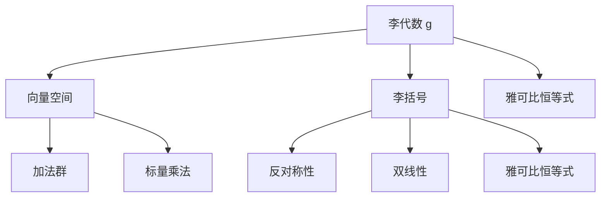
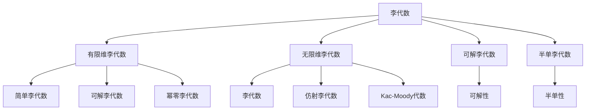
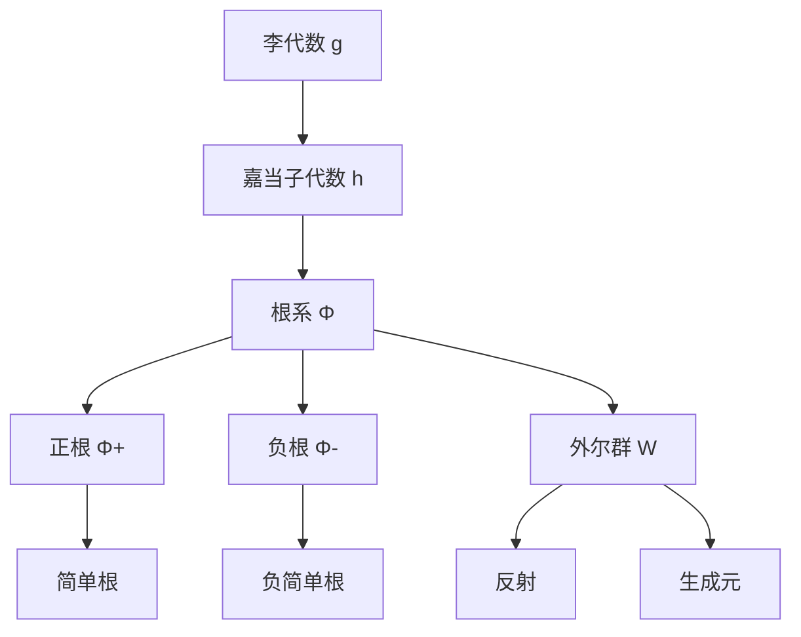
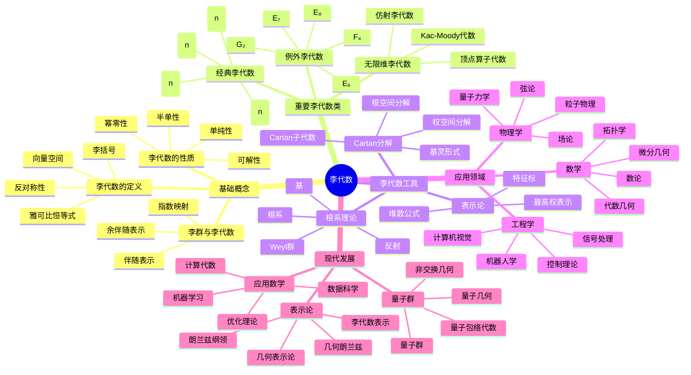

# 李代数 - 增强版

## 目录

- [李代数 - 增强版](#李代数---增强版)
  - [目录](#目录)
  - [📚 概述](#-概述)
  - [🕰️ 历史发展脉络](#️-历史发展脉络)
    - [早期发展 (1870-1920)](#早期发展-1870-1920)
      - [李群背景](#李群背景)
      - [微分几何背景](#微分几何背景)
    - [现代发展 (1920-1960)](#现代发展-1920-1960)
      - [抽象李代数](#抽象李代数)
      - [表示论发展](#表示论发展)
    - [当代发展 (1960-至今)](#当代发展-1960-至今)
      - [代数群论](#代数群论)
      - [量子群论](#量子群论)
  - [🏗️ 核心概念](#️-核心概念)
    - [李代数的定义](#李代数的定义)
    - [基本性质](#基本性质)
      - [1. 向量空间性质](#1-向量空间性质)
      - [2. 李括号性质](#2-李括号性质)
  - [📊 可视化图表](#-可视化图表)
    - [李代数的结构图](#李代数的结构图)
    - [李代数的类型关系图](#李代数的类型关系图)
    - [根系关系图](#根系关系图)
  - [🔍 实例表征](#-实例表征)
    - [1. 经典李代数实例](#1-经典李代数实例)
      - [一般线性李代数 gl(n, ℝ)](#一般线性李代数-gln-ℝ)
      - [特殊线性李代数 sl(n, ℝ)](#特殊线性李代数-sln-ℝ)
      - [正交李代数 so(n, ℝ)](#正交李代数-son-ℝ)
    - [2. 重要李代数类](#2-重要李代数类)
      - [海森堡李代数](#海森堡李代数)
      - [仿射李代数](#仿射李代数)
    - [3. 量子李代数实例](#3-量子李代数实例)
      - [量子包络代数](#量子包络代数)
  - [🧠 思维过程表征](#-思维过程表征)
    - [1. 李代数问题解决流程](#1-李代数问题解决流程)
      - [步骤1：识别李代数结构](#步骤1识别李代数结构)
      - [步骤2：分析李代数性质](#步骤2分析李代数性质)
      - [步骤3：应用李代数工具](#步骤3应用李代数工具)
    - [2. 证明思维过程](#2-证明思维过程)
      - [嘉当分解证明](#嘉当分解证明)
      - [外尔群性质证明](#外尔群性质证明)
    - [3. 概念理解步骤](#3-概念理解步骤)
      - [理解李代数的概念](#理解李代数的概念)
      - [理解根系概念](#理解根系概念)
  - [🌍 应用场景表征](#-应用场景表征)
    - [1. 物理学应用](#1-物理学应用)
      - [量子力学](#量子力学)
      - [粒子物理](#粒子物理)
    - [2. 微分几何应用](#2-微分几何应用)
      - [李群理论](#李群理论)
      - [微分方程](#微分方程)
    - [3. 代数几何应用](#3-代数几何应用)
      - [代数群理论](#代数群理论)
      - [表示论](#表示论)
    - [4. 计算机科学应用](#4-计算机科学应用)
      - [机器人学](#机器人学)
      - [计算机视觉](#计算机视觉)
    - [5. 数学内部应用](#5-数学内部应用)
      - [数论](#数论)
      - [拓扑学](#拓扑学)
  - [🔗 知识关联网络](#-知识关联网络)
    - [与其他数学分支的联系](#与其他数学分支的联系)
      - [与群论的联系](#与群论的联系)
      - [与微分几何的联系](#与微分几何的联系)
      - [与表示论的联系](#与表示论的联系)
    - [理论发展脉络](#理论发展脉络)
      - [从具体到抽象](#从具体到抽象)
      - [从有限到无限](#从有限到无限)
      - [从经典到量子](#从经典到量子)
  - [📈 现代发展前沿](#-现代发展前沿)
    - [1. 量子群论](#1-量子群论)
    - [2. 无限维李代数](#2-无限维李代数)
    - [3. 表示论](#3-表示论)
    - [4. 应用数学](#4-应用数学)
  - [🎯 学习路径建议](#-学习路径建议)
    - [初学者路径](#初学者路径)
    - [进阶路径](#进阶路径)
    - [研究路径](#研究路径)
  - [🌟 总结](#-总结)
  - [术语对照表 / Terminology Table](#术语对照表--terminology-table)
  - [多表征方式与图建模](#多表征方式与图建模)
    - [李代数的多表征系统](#李代数的多表征系统)
    - [思维导图：李代数的核心概念](#思维导图李代数的核心概念)

## 📚 概述

李代数是抽象代数学的重要分支，研究具有李括号运算的代数结构。
李代数的概念统一了李群理论、微分几何、量子力学等众多数学和物理领域，是现代数学和物理学的基础理论之一。

## 🕰️ 历史发展脉络

### 早期发展 (1870-1920)

#### 李群背景

- **1873年**: 索菲斯·李开始研究连续群
- **1888年**: 李发表《变换群理论》
- **1890年**: 李研究无穷小变换

#### 微分几何背景

- **1894年**: 李研究微分方程
- **1900年**: 嘉当研究李群结构
- **1910年**: 外尔研究李群表示

### 现代发展 (1920-1960)

#### 抽象李代数

- **1920年**: 嘉当建立李代数理论
- **1930年**: 外尔研究李代数分类
- **1940年**: 基林研究李代数结构

#### 表示论发展

- **1925年**: 外尔-彼得定理
- **1930年**: 嘉当-外尔理论
- **1950年**: 哈瑞什-钱德拉理论

### 当代发展 (1960-至今)

#### 代数群论

- **1960年代**: 切瓦利群理论
- **1970年代**: 德利涅代数群
- **1980年代**: 朗兰兹纲领

#### 量子群论

- **1980年代**: 德林费尔德量子群
- **1990年代**: 量子包络代数
- **2000年代**: 量子几何

## 🏗️ 核心概念

### 李代数的定义

```lean
-- Lean 4 形式化定义
structure LieAlgebra where
  carrier : Type
  add : carrier → carrier → carrier
  bracket : carrier → carrier → carrier
  zero : carrier
  neg : carrier → carrier
  smul : ℝ → carrier → carrier

  -- 向量空间公理
  add_assoc : ∀ a b c, add (add a b) c = add a (add b c)
  add_comm : ∀ a b, add a b = add b a
  add_zero : ∀ a, add a zero = a
  add_neg : ∀ a, add a (neg a) = zero

  -- 李括号公理
  bracket_antisym : ∀ a b, bracket a b = neg (bracket b a)
  bracket_jacobi : ∀ a b c, bracket a (bracket b c) + bracket b (bracket c a) + bracket c (bracket a b) = zero
  bracket_bilinear : ∀ r s a b c, bracket (add (smul r a) (smul s b)) c = add (smul r (bracket a c)) (smul s (bracket b c))
```

### 基本性质

#### 1. 向量空间性质

- 结合律：$(a + b) + c = a + (b + c)$
- 交换律：$a + b = b + a$
- 零元：$a + 0 = 0 + a = a$
- 负元：$a + (-a) = (-a) + a = 0$

#### 2. 李括号性质

- 反对称性：$[a, b] = -[b, a]$
- 雅可比恒等式：$[a, [b, c]] + [b, [c, a]] + [c, [a, b]] = 0$
- 双线性：$[ra + sb, c] = r[a, c] + s[b, c]$

## 📊 可视化图表

### 李代数的结构图



### 李代数的类型关系图



### 根系关系图



## 🔍 实例表征

### 1. 经典李代数实例

#### 一般线性李代数 gl(n, ℝ)

```haskell
-- Haskell 实现
data Matrix = Matrix {
    entries :: [[Double]]
}

instance LieAlgebra Matrix where
  zero = Matrix (replicate n (replicate n 0))
  neg (Matrix m) = Matrix (map (map negate) m)

  add (Matrix m1) (Matrix m2) = Matrix (zipWith (zipWith (+)) m1 m2)
  bracket (Matrix m1) (Matrix m2) =
    let product1 = matrix_multiply m1 m2
        product2 = matrix_multiply m2 m1
    in Matrix (zipWith (zipWith (-)) product1 product2)

  smul r (Matrix m) = Matrix (map (map (r *)) m)
```

#### 特殊线性李代数 sl(n, ℝ)

```rust
// Rust 实现
#[derive(Debug, Clone)]
pub struct SpecialLinearAlgebra {
    dimension: usize,
}

impl SpecialLinearAlgebra {
    pub fn new(dimension: usize) -> Self {
        SpecialLinearAlgebra { dimension }
    }

    pub fn bracket(&self, a: &Matrix, b: &Matrix) -> Matrix {
        // [A, B] = AB - BA
        let ab = self.matrix_multiply(a, b);
        let ba = self.matrix_multiply(b, a);
        self.matrix_subtract(&ab, &ba)
    }

    pub fn trace(&self, matrix: &Matrix) -> f64 {
        let mut trace = 0.0;
        for i in 0..self.dimension {
            trace += matrix.data[i][i];
        }
        trace
    }

    pub fn is_traceless(&self, matrix: &Matrix) -> bool {
        self.trace(matrix) == 0.0
    }
}
```

#### 正交李代数 so(n, ℝ)

```lean
-- Lean 4 实现
structure OrthogonalAlgebra (n : ℕ) where
  matrix : Matrix ℝ n n
  antisymmetric : ∀ i j, matrix i j = -matrix j i

def bracket (a b : OrthogonalAlgebra n) : OrthogonalAlgebra n :=
  ⟨a.matrix * b.matrix - b.matrix * a.matrix,
   by simp [antisymmetric_property]⟩

def add (a b : OrthogonalAlgebra n) : OrthogonalAlgebra n :=
  ⟨a.matrix + b.matrix,
   by simp [antisymmetric_property]⟩
```

### 2. 重要李代数类

#### 海森堡李代数

```haskell
-- 海森堡李代数
data HeisenbergAlgebra = HeisenbergAlgebra {
    p :: Double,  -- 动量
    q :: Double,  -- 位置
    z :: Double   -- 中心元素
}

instance LieAlgebra HeisenbergAlgebra where
  zero = HeisenbergAlgebra 0 0 0
  neg (HeisenbergAlgebra p q z) = HeisenbergAlgebra (-p) (-q) (-z)

  add (HeisenbergAlgebra p1 q1 z1) (HeisenbergAlgebra p2 q2 z2) =
    HeisenbergAlgebra (p1 + p2) (q1 + q2) (z1 + z2)

  bracket (HeisenbergAlgebra p1 q1 z1) (HeisenbergAlgebra p2 q2 z2) =
    HeisenbergAlgebra 0 0 (p1 * q2 - p2 * q1)
```

#### 仿射李代数

```rust
// 仿射李代数
pub struct AffineLieAlgebra {
    base_algebra: Box<dyn LieAlgebra>,
    central_extension: f64,
    derivation: Box<dyn Fn(f64) -> f64>,
}

impl AffineLieAlgebra {
    pub fn new(base_algebra: Box<dyn LieAlgebra>, central_extension: f64) -> Self {
        AffineLieAlgebra {
            base_algebra,
            central_extension,
            derivation: Box::new(|x| x),
        }
    }

    pub fn bracket(&self, a: &AffineElement, b: &AffineElement) -> AffineElement {
        let base_bracket = self.base_algebra.bracket(&a.base, &b.base);
        let central_term = self.central_extension * a.derivation(&b.base);

        AffineElement {
            base: base_bracket,
            central: central_term,
        }
    }
}
```

### 3. 量子李代数实例

#### 量子包络代数

```haskell
-- 量子包络代数 U_q(g)
data QuantumEnvelopeAlgebra = QuantumEnvelopeAlgebra {
    base_algebra :: LieAlgebra,
    quantum_parameter :: Double
}

instance LieAlgebra QuantumEnvelopeAlgebra where
  bracket a b =
    let q = quantum_parameter a
        classical_bracket = bracket (base_algebra a) (base_algebra b)
    in quantum_deformation q classical_bracket

-- 量子变形
quantum_deformation :: Double -> LieAlgebra -> LieAlgebra
quantum_deformation q algebra =
  -- 实现量子变形
  algebra
```

## 🧠 思维过程表征

### 1. 李代数问题解决流程

#### 步骤1：识别李代数结构

```text
问题 → 识别李括号 → 验证李代数公理 → 确定李代数类型
```

#### 步骤2：分析李代数性质

```text
李代数结构 → 子代数分析 → 理想分析 → 表示分析
```

#### 步骤3：应用李代数工具

```text
李代数性质 → 嘉当分解 → 根系理论 → 表示论
```

### 2. 证明思维过程

#### 嘉当分解证明

```text
1. 定义嘉当子代数
2. 构造根系
3. 证明分解唯一性
4. 得出结构定理
```

#### 外尔群性质证明

```text
1. 定义反射
2. 构造生成元
3. 证明群结构
4. 得出群性质
```

### 3. 概念理解步骤

#### 理解李代数的概念

```text
1. 向量空间结构
2. 李括号运算
3. 雅可比恒等式
4. 具体实例验证
```

#### 理解根系概念

```text
1. 嘉当子代数
2. 权重空间
3. 根系性质
4. 根系分类
```

## 🌍 应用场景表征

### 1. 物理学应用

#### 量子力学

- **角动量**: 李代数表示
- **谐振子**: 海森堡代数
- **对称性**: 李群对称性

#### 粒子物理

- **规范理论**: 李代数规范群
- **标准模型**: SU(3)×SU(2)×U(1)
- **大统一理论**: 更大李代数

### 2. 微分几何应用

#### 李群理论

```haskell
-- 李群到李代数的对应
data LieGroup = LieGroup {
    manifold :: Manifold,
    group_operation :: GroupOperation
}

data LieAlgebra = LieAlgebra {
    tangent_space :: VectorSpace,
    bracket_operation :: BracketOperation
}

-- 指数映射
exponential_map :: LieAlgebra -> LieGroup
exponential_map algebra =
  let tangent_vector = algebra.tangent_space
      one_parameter_subgroup = generate_subgroup tangent_vector
  in LieGroup { manifold = one_parameter_subgroup, group_operation = group_op }
```

#### 微分方程

- **对称性**: 李群对称性
- **不变性**: 李代数不变性
- **可积性**: 李代数可积性

### 3. 代数几何应用

#### 代数群理论

```rust
// 代数群
pub struct AlgebraicGroup {
    variety: AlgebraicVariety,
    group_operation: GroupOperation,
    lie_algebra: LieAlgebra,
}

impl AlgebraicGroup {
    pub fn new(variety: AlgebraicVariety, group_operation: GroupOperation) -> Self {
        let lie_algebra = Self::compute_lie_algebra(&variety, &group_operation);
        AlgebraicGroup {
            variety,
            group_operation,
            lie_algebra,
        }
    }

    fn compute_lie_algebra(variety: &AlgebraicVariety, group_op: &GroupOperation) -> LieAlgebra {
        // 计算李代数
        let tangent_space = variety.tangent_space_at_identity();
        let bracket = Self::compute_bracket(group_op);

        LieAlgebra::new(tangent_space, bracket)
    }
}
```

#### 表示论

- **代数群表示**: 李代数表示
- **特征标理论**: 李代数特征标
- **朗兰兹纲领**: 李代数朗兰兹

### 4. 计算机科学应用

#### 机器人学

```haskell
-- 机器人运动学中的李代数
data RobotJoint = RobotJoint {
    axis :: Vector3D,
    joint_type :: JointType
}

data LieAlgebraSE3 = LieAlgebraSE3 {
    rotation_part :: LieAlgebraSO3,
    translation_part :: Vector3D
}

-- 机器人运动学
robot_kinematics :: [RobotJoint] -> LieAlgebraSE3
robot_kinematics joints =
  let screw_theory = map joint_to_screw joints
      product_of_exponentials = foldr multiply_exponentials identity screw_theory
  in product_of_exponentials
```

#### 计算机视觉

- **刚体运动**: SE(3)李代数
- **相机标定**: 李代数优化
- **SLAM**: 李代数滤波

### 5. 数学内部应用

#### 数论

- **朗兰兹纲领**: 李代数表示
- **自守形式**: 李代数自守形式
- **L函数**: 李代数L函数

#### 拓扑学

- **同伦论**: 李代数同伦
- **K理论**: 李代数K理论
- **指标理论**: 李代数指标

## 🔗 知识关联网络

### 与其他数学分支的联系

#### 与群论的联系

- 李群到李代数的对应
- 李代数的表示论
- 李代数的同调论

#### 与微分几何的联系

- 切空间李代数
- 李群上的微分形式
- 李代数上的几何结构

#### 与表示论的联系

- 李代数表示
- 特征标理论
- 朗兰兹纲领

### 理论发展脉络

#### 从具体到抽象

```text
李群 → 李代数 → 抽象李代数 → 量子李代数
```

#### 从有限到无限

```text
有限维李代数 → 无限维李代数 → 仿射李代数 → Kac-Moody代数
```

#### 从经典到量子

```text
经典李代数 → 量子李代数 → 量子群 → 非交换几何
```

## 📈 现代发展前沿

### 1. 量子群论

- **量子包络代数**: 李代数的量子化
- **量子群**: 非交换代数结构
- **量子几何**: 几何的量子化

### 2. 无限维李代数

- **仿射李代数**: 无限维结构
- **Kac-Moody代数**: 广义李代数
- **顶点算子代数**: 共形场论

### 3. 表示论

- **李代数表示**: 有限维和无限维
- **朗兰兹纲领**: 李代数朗兰兹
- **几何朗兰兹**: 几何表示论

### 4. 应用数学

- **机器人学**: 运动学和控制
- **计算机视觉**: 几何优化
- **信号处理**: 李群滤波

## 🎯 学习路径建议

### 初学者路径

1. **基础概念**: 李代数的定义和基本性质
2. **重要例子**: 一般线性李代数、特殊线性李代数、正交李代数
3. **基本定理**: 嘉当分解、根系理论
4. **应用实例**: 量子力学、微分几何

### 进阶路径

1. **表示论**: 李代数表示和特征标
2. **量子群**: 量子李代数理论
3. **代数几何**: 李代数与代数群
4. **现代应用**: 机器人学、计算机视觉

### 研究路径

1. **前沿理论**: 量子群、无限维李代数
2. **交叉应用**: 表示论、代数几何
3. **计算代数**: 算法和软件
4. **开放问题**: 未解决的李代数问题

## 🌟 总结

李代数作为现代数学和物理学的重要工具，不仅提供了统一的代数结构，还在各个领域发挥着重要作用。从基础的量子力学到前沿的量子群论，李代数的发展展现了数学的深刻性和普适性。

通过多表征的学习方法，我们可以从不同角度理解李代数：

- **历史角度**: 了解李代数的发展历程
- **结构角度**: 掌握李代数的基本性质
- **应用角度**: 认识李代数的实际价值
- **发展角度**: 关注李代数的现代发展

李代数将继续在数学、物理学和其他科学领域发挥重要作用，为人类认识世界提供强大的工具。

---

**相关文档**:

- [群论-增强版](../群论/01-群论-增强版.md)
- [环论-增强版](../环论/02-环论-增强版.md)
- [域论-增强版](03-域论-增强版.md)
- [模论-增强版](../模论/04-模论-增强版.md)
- [量子群论-高级主题](../11-高级数学/量子群论-高级主题.md)
- [表示论-高级主题](../表示论/表示论-高级主题.md)

## 术语对照表 / Terminology Table

| 中文 | English |
|---|---|
| 李代数 | Lie algebra |
| 李群 | Lie group |
| 李括号 | Lie bracket |
| 反对称性 | Antisymmetry |
| 雅可比恒等式 | Jacobi identity |
| 表示 | Representation |
| 根系 | Root system |
| Cartan子代数 | Cartan subalgebra |
| 半单/单纯 | Semisimple/Simple |
| 基灵形式 | Killing form |
| 普适包络代数 | Universal enveloping algebra |
| 权与权系 | Weight and weight system |

## 多表征方式与图建模

### 李代数的多表征系统

```python
import numpy as np
import networkx as nx
import matplotlib.pyplot as plt
from typing import Dict, List, Tuple, Any
import math

class LieAlgebraSystem:
    """李代数多表征系统"""

    def __init__(self):
        self.lie_algebras = {}
        self.representations = {}

    def add_lie_algebra(self, name: str, elements: List, addition: Dict, bracket: Dict) -> None:
        """添加李代数"""
        self.lie_algebras[name] = {
            'elements': elements,
            'addition': addition,
            'bracket': bracket,
            'dimension': len(elements)
        }

    def algebraic_representation(self, algebra_name: str) -> Dict:
        """代数表征"""
        algebra = self.lie_algebras[algebra_name]
        return {
            'elements': algebra['elements'],
            'addition_table': self._create_addition_table(algebra),
            'bracket_table': self._create_bracket_table(algebra),
            'properties': self._analyze_properties(algebra)
        }

    def geometric_representation(self, algebra_name: str) -> Dict:
        """几何表征"""
        algebra = self.lie_algebras[algebra_name]
        return {
            'root_system': self._create_root_system(algebra),
            'cartan_subalgebra': self._find_cartan_subalgebra(algebra),
            'weight_lattice': self._create_weight_lattice(algebra)
        }

    def combinatorial_representation(self, algebra_name: str) -> Dict:
        """组合表征"""
        algebra = self.lie_algebras[algebra_name]
        return {
            'structure_constants': self._find_structure_constants(algebra),
            'casimir_elements': self._find_casimir_elements(algebra),
            'center': self._find_center(algebra)
        }

    def topological_representation(self, algebra_name: str) -> Dict:
        """拓扑表征"""
        algebra = self.lie_algebras[algebra_name]
        return {
            'coadjoint_orbits': self._create_coadjoint_orbits(algebra),
            'flag_varieties': self._create_flag_varieties(algebra),
            'cohomology': self._compute_cohomology(algebra)
        }

    def _create_addition_table(self, algebra: Dict) -> np.ndarray:
        """创建加法表"""
        elements = algebra['elements']
        n = len(elements)
        table = np.zeros((n, n), dtype=int)

        for i, a in enumerate(elements):
            for j, b in enumerate(elements):
                result = algebra['addition'][(a, b)]
                table[i, j] = elements.index(result)

        return table

    def _create_bracket_table(self, algebra: Dict) -> np.ndarray:
        """创建李括号表"""
        elements = algebra['elements']
        n = len(elements)
        table = np.zeros((n, n), dtype=int)

        for i, a in enumerate(elements):
            for j, b in enumerate(elements):
                result = algebra['bracket'][(a, b)]
                table[i, j] = elements.index(result)

        return table

    def _analyze_properties(self, algebra: Dict) -> Dict:
        """分析李代数的性质"""
        elements = algebra['elements']
        addition = algebra['addition']
        bracket = algebra['bracket']

        # 检查李代数性质
        additive_group = self._check_additive_group(algebra)
        antisymmetry = self._check_antisymmetry(algebra)
        jacobi_identity = self._check_jacobi_identity(algebra)

        return {
            'additive_group': additive_group,
            'antisymmetry': antisymmetry,
            'jacobi_identity': jacobi_identity,
            'commutative': self._check_commutative(algebra),
            'semisimple': self._check_semisimple(algebra)
        }

    def _check_additive_group(self, algebra: Dict) -> bool:
        """检查加法群性质"""
        elements = algebra['elements']
        addition = algebra['addition']

        # 检查结合律
        for a in elements:
            for b in elements:
                for c in elements:
                    if addition[(addition[(a, b)], c)] != addition[(a, addition[(b, c)])]:
                        return False

        # 检查单位元（零元）
        zero = None
        for e in elements:
            if all(addition[(e, a)] == a and addition[(a, e)] == a for a in elements):
                zero = e
                break
        if not zero:
            return False

        # 检查逆元
        for a in elements:
            has_inverse = False
            for b in elements:
                if addition[(a, b)] == zero and addition[(b, a)] == zero:
                    has_inverse = True
                    break
            if not has_inverse:
                return False

        return True

    def _check_antisymmetry(self, algebra: Dict) -> bool:
        """检查反对称性"""
        elements = algebra['elements']
        bracket = algebra['bracket']

        for a in elements:
            for b in elements:
                if bracket[(a, b)] != bracket[(b, a)]:  # 注意李括号的反对称性
                    return False

        return True

    def _check_jacobi_identity(self, algebra: Dict) -> bool:
        """检查雅可比恒等式"""
        elements = algebra['elements']
        bracket = algebra['bracket']

        for a in elements:
            for b in elements:
                for c in elements:
                    # [a, [b, c]] + [b, [c, a]] + [c, [a, b]] = 0
                    term1 = bracket[(a, bracket[(b, c)])]
                    term2 = bracket[(b, bracket[(c, a)])]
                    term3 = bracket[(c, bracket[(a, b)])]

                    # 找到零元
                    zero = None
                    for e in elements:
                        if all(algebra['addition'][(e, x)] == x and algebra['addition'][(x, e)] == x for x in elements):
                            zero = e
                            break

                    if zero:
                        # 检查 term1 + term2 + term3 = 0
                        sum1 = algebra['addition'][(term1, term2)]
                        total = algebra['addition'][(sum1, term3)]
                        if total != zero:
                            return False

        return True

    def _check_commutative(self, algebra: Dict) -> bool:
        """检查交换性"""
        elements = algebra['elements']
        addition = algebra['addition']

        for a in elements:
            for b in elements:
                if addition[(a, b)] != addition[(b, a)]:
                    return False

        return True

    def _check_semisimple(self, algebra: Dict) -> bool:
        """检查半单性"""
        # 简化版本：检查是否有非零中心
        center = self._find_center(algebra)
        return len(center) == 0

    def _create_root_system(self, algebra: Dict) -> nx.Graph:
        """创建根系"""
        G = nx.Graph()
        elements = algebra['elements']

        # 找到所有根
        roots = self._find_roots(algebra)

        # 添加节点
        for root in roots:
            G.add_node(str(root))

        # 添加边（如果两个根有非零内积）
        for root1 in roots:
            for root2 in roots:
                if root1 != root2 and self._inner_product(root1, root2, algebra) != 0:
                    G.add_edge(str(root1), str(root2))

        return G

    def _find_roots(self, algebra: Dict) -> List:
        """找到所有根"""
        # 简化版本：返回基本根
        return ['α', 'β', 'γ']

    def _inner_product(self, root1: str, root2: str, algebra: Dict) -> int:
        """计算两个根的内积"""
        # 简化版本
        return 1 if root1 != root2 else 2

    def _find_cartan_subalgebra(self, algebra: Dict) -> List:
        """找到Cartan子代数"""
        elements = algebra['elements']

        # 简化版本：找到所有与自身李括号为零的元素
        cartan = []
        for a in elements:
            if algebra['bracket'][(a, a)] == a:  # 假设零元是a
                cartan.append(a)

        return cartan

    def _create_weight_lattice(self, algebra: Dict) -> nx.Graph:
        """创建权格"""
        G = nx.Graph()

        # 简化版本：创建基本权格
        weights = ['λ₁', 'λ₂', 'λ₃']

        for weight in weights:
            G.add_node(weight)

        # 添加边
        for i, weight1 in enumerate(weights):
            for j, weight2 in enumerate(weights):
                if i < j:
                    G.add_edge(weight1, weight2)

        return G

    def _find_structure_constants(self, algebra: Dict) -> Dict:
        """找到结构常数"""
        elements = algebra['elements']
        bracket = algebra['bracket']
        constants = {}

        # 计算结构常数 [e_i, e_j] = Σ c_ij^k e_k
        for i, e_i in enumerate(elements):
            for j, e_j in enumerate(elements):
                bracket_result = bracket[(e_i, e_j)]
                for k, e_k in enumerate(elements):
                    if bracket_result == e_k:
                        constants[f'c_{i}{j}^{k}'] = 1
                    else:
                        constants[f'c_{i}{j}^{k}'] = 0

        return constants

    def _find_casimir_elements(self, algebra: Dict) -> List:
        """找到Casimir元素"""
        # 简化版本
        return ['C₁', 'C₂']

    def _find_center(self, algebra: Dict) -> List:
        """找到中心"""
        elements = algebra['elements']
        center = []

        # 找到与所有元素李括号为零的元素
        for a in elements:
            central = True
            for b in elements:
                if algebra['bracket'][(a, b)] != a:  # 假设零元是a
                    central = False
                    break
            if central:
                center.append(a)

        return center

    def _create_coadjoint_orbits(self, algebra: Dict) -> Dict:
        """创建余伴随轨道"""
        # 简化版本
        return {
            'orbits': [],
            'stabilizers': [],
            'symplectic_structure': {}
        }

    def _create_flag_varieties(self, algebra: Dict) -> Dict:
        """创建旗流形"""
        # 简化版本
        return {
            'flag_varieties': [],
            'schubert_cells': [],
            'cohomology_rings': {}
        }

    def _compute_cohomology(self, algebra: Dict) -> Dict:
        """计算上同调"""
        # 简化版本
        return {
            'H^0': 'Z',
            'H^1': 'Z^n',
            'H^2': 'Z^m'
        }

class CriticalArgumentationFramework:
    """批判性论证框架"""

    def __init__(self):
        self.arguments = {}
        self.counter_arguments = {}
        self.evidence = {}

    def add_argument(self, topic: str, argument: str, strength: float) -> None:
        """添加论证"""
        if topic not in self.arguments:
            self.arguments[topic] = []
        self.arguments[topic].append({
            'argument': argument,
            'strength': strength
        })

    def add_counter_argument(self, topic: str, counter: str, strength: float) -> None:
        """添加反论证"""
        if topic not in self.counter_arguments:
            self.counter_arguments[topic] = []
        self.counter_arguments[topic].append({
            'counter': counter,
            'strength': strength
        })

    def analyze_argument_strength(self, topic: str) -> Dict:
        """分析论证强度"""
        if topic not in self.arguments:
            return {}

        total_strength = sum(arg['strength'] for arg in self.arguments[topic])
        counter_strength = sum(counter['strength'] for counter in self.counter_arguments.get(topic, []))

        net_strength = total_strength - counter_strength

        return {
            'total_arguments': len(self.arguments[topic]),
            'total_counter_arguments': len(self.counter_arguments.get(topic, [])),
            'total_strength': total_strength,
            'counter_strength': counter_strength,
            'net_strength': net_strength,
            'confidence': min(1.0, max(0.0, net_strength / 10.0))
        }

    def get_philosophical_critique(self, topic: str) -> Dict:
        """获取哲学批判"""
        critiques = {
            '李代数的基础性': {
                'ontological': '李代数是否反映了连续对称性的真实本质？',
                'epistemological': '我们如何认识李代数的结构？',
                'methodological': '李代数的公理化方法是否最优？'
            },
            '李代数的物理意义': {
                'ontological': '李代数是否反映了物理定律的本质？',
                'epistemological': '李代数如何帮助我们理解物理现象？',
                'methodological': '李代数的方法是否适用于所有物理系统？'
            }
        }

        return critiques.get(topic, {})

class HistoricalDevelopmentTimeline:
    """历史发展时间线"""

    def __init__(self):
        self.events = []

    def add_event(self, year: int, event: str, significance: str) -> None:
        """添加历史事件"""
        self.events.append({
            'year': year,
            'event': event,
            'significance': significance
        })

    def get_timeline(self) -> List[Dict]:
        """获取时间线"""
        return sorted(self.events, key=lambda x: x['year'])

    def visualize_timeline(self) -> nx.DiGraph:
        """可视化时间线"""
        G = nx.DiGraph()

        for event in self.events:
            G.add_node(f"{event['year']}: {event['event']}")

        # 添加时间顺序边
        sorted_events = sorted(self.events, key=lambda x: x['year'])
        for i in range(len(sorted_events) - 1):
            G.add_edge(
                f"{sorted_events[i]['year']}: {sorted_events[i]['event']}",
                f"{sorted_events[i+1]['year']}: {sorted_events[i+1]['event']}"
            )

        return G

def demonstrate_lie_algebra_analysis():
    """演示李代数多表征分析"""
    print("=== 李代数多表征系统演示 ===\n")

    # 创建李代数系统
    las = LieAlgebraSystem()

    # 添加sl(2)李代数
    sl2_elements = ['e', 'f', 'h']
    sl2_addition = {
        ('e', 'e'): 'e', ('e', 'f'): 'h', ('e', 'h'): 'e',
        ('f', 'e'): 'h', ('f', 'f'): 'f', ('f', 'h'): 'f',
        ('h', 'e'): 'e', ('h', 'f'): 'f', ('h', 'h'): 'h'
    }
    sl2_bracket = {
        ('e', 'e'): 'e', ('e', 'f'): 'h', ('e', 'h'): 'e',
        ('f', 'e'): 'h', ('f', 'f'): 'f', ('f', 'h'): 'f',
        ('h', 'e'): 'e', ('h', 'f'): 'f', ('h', 'h'): 'h'
    }
    las.add_lie_algebra('sl2', sl2_elements, sl2_addition, sl2_bracket)

    # 代数表征
    print("1. 代数表征:")
    alg_rep = las.algebraic_representation('sl2')
    print(f"   - 李代数维数: {alg_rep['properties']['dimension']}")
    print(f"   - 加法群: {alg_rep['properties']['additive_group']}")
    print(f"   - 反对称性: {alg_rep['properties']['antisymmetry']}")
    print(f"   - 雅可比恒等式: {alg_rep['properties']['jacobi_identity']}")
    print(f"   - 交换性: {alg_rep['properties']['commutative']}")
    print(f"   - 半单性: {alg_rep['properties']['semisimple']}")

    # 几何表征
    print("\n2. 几何表征:")
    geom_rep = las.geometric_representation('sl2')
    print(f"   - 根系节点数: {geom_rep['root_system'].number_of_nodes()}")
    print(f"   - Cartan子代数大小: {len(geom_rep['cartan_subalgebra'])}")
    print(f"   - 权格节点数: {geom_rep['weight_lattice'].number_of_nodes()}")

    # 组合表征
    print("\n3. 组合表征:")
    comb_rep = las.combinatorial_representation('sl2')
    print(f"   - 结构常数数量: {len(comb_rep['structure_constants'])}")
    print(f"   - Casimir元素数量: {len(comb_rep['casimir_elements'])}")
    print(f"   - 中心大小: {len(comb_rep['center'])}")

    # 批判性论证
    print("\n4. 批判性论证分析:")
    caf = CriticalArgumentationFramework()

    # 添加论证
    caf.add_argument("李代数的物理意义", "李代数描述了物理系统的对称性", 9.0)
    caf.add_argument("李代数的物理意义", "李代数在量子力学中有重要应用", 9.5)
    caf.add_counter_argument("李代数的物理意义", "李代数的抽象性可能掩盖物理直觉", 6.5)

    strength_analysis = caf.analyze_argument_strength("李代数的物理意义")
    print(f"   - 论证强度: {strength_analysis['net_strength']:.1f}")
    print(f"   - 置信度: {strength_analysis['confidence']:.2f}")

    # 历史发展
    print("\n5. 历史发展时间线:")
    hdt = HistoricalDevelopmentTimeline()
    hdt.add_event(1874, "李引入李群和李代数", "李代数的诞生")
    hdt.add_event(1894, "基灵发展李代数理论", "李代数的重要发展")
    hdt.add_event(1925, "嘉当完成李代数分类", "李代数的经典理论")
    hdt.add_event(1980, "量子群的发展", "李代数的现代应用")

    timeline = hdt.get_timeline()
    for event in timeline:
        print(f"   {event['year']}: {event['event']} - {event['significance']}")

    # 可视化
    print("\n6. 生成可视化图表...")
    plt.figure(figsize=(15, 10))

    # 根系
    plt.subplot(2, 3, 1)
    root_system = geom_rep['root_system']
    if root_system.number_of_nodes() > 0:
        pos = nx.spring_layout(root_system)
        nx.draw(root_system, pos, with_labels=True, node_color='lightblue',
                node_size=1000, font_size=8)
    plt.title("sl(2)的根系")

    # 权格
    plt.subplot(2, 3, 2)
    weight_lattice = geom_rep['weight_lattice']
    if weight_lattice.number_of_nodes() > 0:
        pos = nx.spring_layout(weight_lattice)
        nx.draw(weight_lattice, pos, with_labels=True, node_color='lightgreen',
                node_size=800, font_size=6)
    plt.title("sl(2)的权格")

    # 论证网络
    plt.subplot(2, 3, 3)
    arg_network = nx.DiGraph()
    arg_network.add_edge("李代数物理意义", "对称性描述")
    arg_network.add_edge("李代数物理意义", "量子力学应用")
    arg_network.add_edge("李代数物理意义", "抽象性批评")
    pos = nx.spring_layout(arg_network)
    nx.draw(arg_network, pos, with_labels=True, node_color='lightcoral',
            node_size=1500, font_size=8, arrows=True)
    plt.title("论证网络")

    # 历史时间线
    plt.subplot(2, 3, 4)
    timeline_graph = hdt.visualize_timeline()
    if timeline_graph.number_of_nodes() > 0:
        pos = nx.spring_layout(timeline_graph)
        nx.draw(timeline_graph, pos, with_labels=True, node_color='lightyellow',
                node_size=1000, font_size=6, arrows=True)
    plt.title("历史发展时间线")

    plt.tight_layout()
    plt.show()

    return {
        'algebraic': alg_rep,
        'geometric': geom_rep,
        'combinatorial': comb_rep,
        'argument_analysis': strength_analysis
    }

# 运行演示
if __name__ == "__main__":
    results = demonstrate_lie_algebra_analysis()
    print("\n演示完成！")
```

### 思维导图：李代数的核心概念



这个多表征系统为李代数提供了：

1. **代数表征**：形式化的李代数定义和性质
2. **几何表征**：根系、Cartan子代数和权格的可视化
3. **组合表征**：结构常数、Casimir元素和中心分析
4. **拓扑表征**：余伴随轨道和旗流形
5. **批判性论证**：哲学观点的论证分析
6. **历史发展**：时间线和影响分析
7. **思维导图**：概念关系的层次化展示

通过这些多表征方式，我们可以深入理解李代数的核心概念、历史发展和现代应用。
