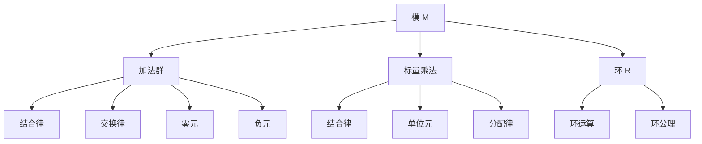
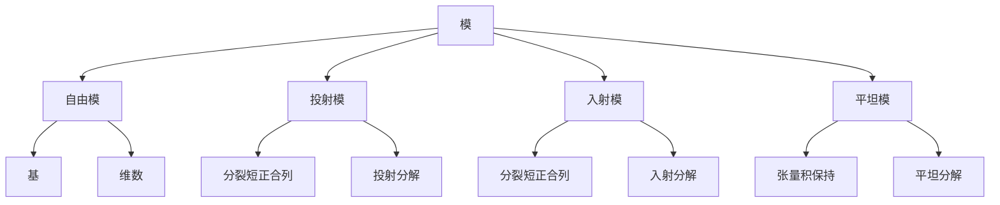
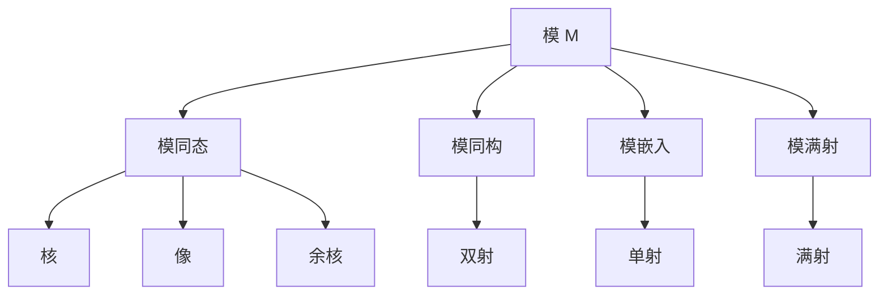
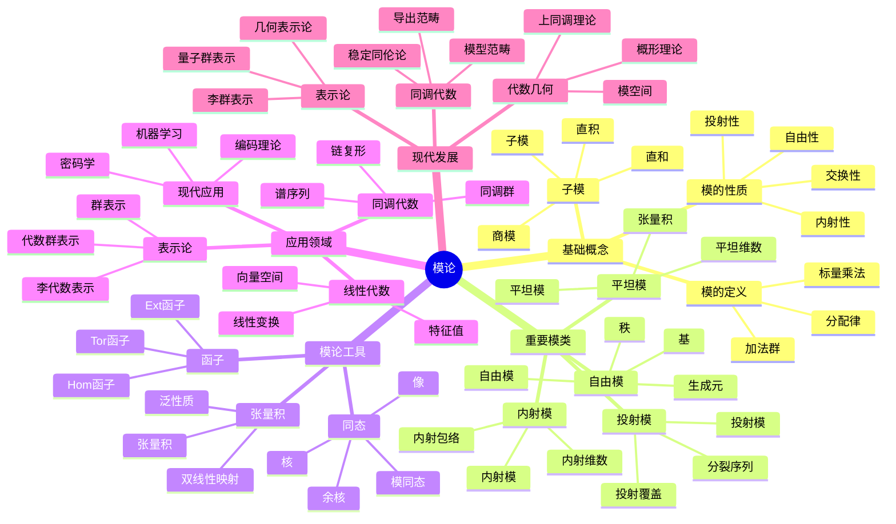

# 模论 - 增强版

## 目录 / Table of Contents

- [模论 - 增强版](#模论---增强版)
  - [目录 / Table of Contents](#目录--table-of-contents)
  - [📚 概述](#-概述)
  - [🕰️ 历史发展脉络](#️-历史发展脉络)
    - [早期发展 (1900-1950)](#早期发展-1900-1950)
      - [线性代数背景](#线性代数背景)
      - [同调代数背景](#同调代数背景)
    - [现代发展 (1950-1980)](#现代发展-1950-1980)
      - [同调代数](#同调代数)
      - [表示论](#表示论)
    - [当代发展 (1980-至今)](#当代发展-1980-至今)
      - [代数几何](#代数几何)
      - [非交换代数](#非交换代数)
  - [🏗️ 核心概念](#️-核心概念)
    - [模的定义](#模的定义)
    - [基本性质](#基本性质)
      - [1. 加法群性质](#1-加法群性质)
      - [2. 标量乘法性质](#2-标量乘法性质)
  - [📊 可视化图表](#-可视化图表)
    - [模的结构图](#模的结构图)
    - [模的类型关系图](#模的类型关系图)
    - [模同态关系图](#模同态关系图)
  - [🔍 实例表征](#-实例表征)
    - [1. 向量空间实例](#1-向量空间实例)
      - [向量空间 ℝⁿ](#向量空间-ℝⁿ)
      - [矩阵空间 Mₙ(ℝ)](#矩阵空间-mₙℝ)
    - [2. 群环模实例](#2-群环模实例)
      - [群环 ℤ\[G\]](#群环-ℤg)
    - [3. 重要模类](#3-重要模类)
      - [自由模](#自由模)
      - [商模](#商模)
  - [🧠 思维过程表征](#-思维过程表征)
    - [1. 模论问题解决流程](#1-模论问题解决流程)
      - [步骤1：识别模结构](#步骤1识别模结构)
      - [步骤2：分析模性质](#步骤2分析模性质)
      - [步骤3：应用模论工具](#步骤3应用模论工具)
    - [2. 证明思维过程](#2-证明思维过程)
      - [自由模性质证明](#自由模性质证明)
      - [投射模性质证明](#投射模性质证明)
    - [3. 概念理解步骤](#3-概念理解步骤)
      - [理解模的概念](#理解模的概念)
      - [理解子模概念](#理解子模概念)
  - [🌍 应用场景表征](#-应用场景表征)
    - [1. 线性代数应用](#1-线性代数应用)
      - [向量空间理论](#向量空间理论)
      - [矩阵理论](#矩阵理论)
    - [2. 同调代数应用](#2-同调代数应用)
      - [同调理论](#同调理论)
      - [导出函子](#导出函子)
    - [3. 表示论应用](#3-表示论应用)
      - [群表示论](#群表示论)
      - [李代数表示](#李代数表示)
    - [4. 代数几何应用](#4-代数几何应用)
      - [概形理论](#概形理论)
      - [上同调理论](#上同调理论)
    - [5. 计算机科学应用](#5-计算机科学应用)
      - [密码学应用](#密码学应用)
      - [编码理论](#编码理论)
    - [6. 物理应用](#6-物理应用)
      - [量子力学](#量子力学)
      - [规范理论](#规范理论)
  - [🔗 知识关联网络](#-知识关联网络)
    - [与其他数学分支的联系](#与其他数学分支的联系)
      - [与线性代数的联系](#与线性代数的联系)
      - [与环论的联系](#与环论的联系)
      - [与群论的联系](#与群论的联系)
    - [理论发展脉络](#理论发展脉络)
      - [从具体到抽象](#从具体到抽象)
      - [从有限到无限](#从有限到无限)
      - [从交换到非交换](#从交换到非交换)
  - [📈 现代发展前沿](#-现代发展前沿)
    - [1. 同调代数](#1-同调代数)
    - [2. 代数几何](#2-代数几何)
    - [3. 表示论](#3-表示论)
    - [4. 非交换代数](#4-非交换代数)
  - [🎯 学习路径建议](#-学习路径建议)
    - [初学者路径](#初学者路径)
    - [进阶路径](#进阶路径)
    - [研究路径](#研究路径)
  - [🌟 总结](#-总结)
  - [术语对照表 / Terminology Table](#术语对照表--terminology-table)
  - [多表征方式与图建模](#多表征方式与图建模)
    - [模论的多表征系统](#模论的多表征系统)
    - [思维导图：模论的核心概念](#思维导图模论的核心概念)

## 📚 概述

模论是抽象代数学的重要分支，研究环上的代数结构。
模的概念统一了线性代数、同调代数、表示论等众多数学领域，是现代代数学的基础理论之一。

## 🕰️ 历史发展脉络

### 早期发展 (1900-1950)

#### 线性代数背景

- **1900年**: 希尔伯特研究不变式理论
- **1920年**: 诺特建立抽象环论
- **1930年**: 范德瓦尔登《现代代数》

#### 同调代数背景

- **1945年**: 卡当-艾伦伯格建立同调代数
- **1950年**: 投射模和入射模理论
- **1955年**: 自由模和投射模

### 现代发展 (1950-1980)

#### 同调代数

- **1960年代**: 导出函子理论
- **1970年代**: 模型范畴理论
- **1980年代**: 三角范畴理论

#### 表示论

- **1950年代**: 群表示论
- **1960年代**: 李代数表示论
- **1970年代**: 代数群表示论

### 当代发展 (1980-至今)

#### 代数几何

- **1980年代**: 概形上的模
- **1990年代**: 凝聚层理论
- **2000年代**: 导出代数几何

#### 非交换代数

- **1990年代**: 非交换环上的模
- **2000年代**: 量子群模
- **2010年代**: 非交换几何

## 🏗️ 核心概念

### 模的定义

```lean
-- Lean 4 形式化定义
structure Module (R : Ring) (M : Type) where
  add : M → M → M
  zero : M
  neg : M → M
  smul : R.carrier → M → M

  -- 加法群公理
  add_assoc : ∀ a b c, add (add a b) c = add a (add b c)
  add_comm : ∀ a b, add a b = add b a
  add_zero : ∀ a, add a zero = a
  add_neg : ∀ a, add a (neg a) = zero

  -- 标量乘法公理
  smul_assoc : ∀ r s m, smul (R.mul r s) m = smul r (smul s m)
  smul_one : ∀ m, smul R.one m = m
  smul_add : ∀ r m n, smul r (add m n) = add (smul r m) (smul r n)
  add_smul : ∀ r s m, smul (R.add r s) m = add (smul r m) (smul s m)
```

### 基本性质

#### 1. 加法群性质

- 结合律：$(a + b) + c = a + (b + c)$
- 交换律：$a + b = b + a$
- 零元：$a + 0 = 0 + a = a$
- 负元：$a + (-a) = (-a) + a = 0$

#### 2. 标量乘法性质

- 结合律：$(r \cdot s) \cdot m = r \cdot (s \cdot m)$
- 单位元：$1 \cdot m = m$
- 分配律：$r \cdot (m + n) = r \cdot m + r \cdot n$
- 分配律：$(r + s) \cdot m = r \cdot m + s \cdot m$

## 📊 可视化图表

### 模的结构图



### 模的类型关系图



### 模同态关系图



## 🔍 实例表征

### 1. 向量空间实例

#### 向量空间 ℝⁿ

```haskell
-- Haskell 实现
data Vector n = Vector {
    components :: Vec n Double
}

instance Module Double (Vector n) where
  zero = Vector (replicate n 0)
  neg (Vector v) = Vector (map negate v)

  add (Vector v1) (Vector v2) = Vector (zipWith (+) v1 v2)
  smul r (Vector v) = Vector (map (r *) v)
```

#### 矩阵空间 Mₙ(ℝ)

```rust
// Rust 实现
#[derive(Debug, Clone)]
pub struct Matrix {
    data: Vec<Vec<f64>>,
    rows: usize,
    cols: usize,
}

impl Matrix {
    pub fn new(rows: usize, cols: usize) -> Self {
        Matrix {
            data: vec![vec![0.0; cols]; rows],
            rows,
            cols,
        }
    }

    pub fn add(&self, other: &Matrix) -> Matrix {
        let mut result = Matrix::new(self.rows, self.cols);
        for i in 0..self.rows {
            for j in 0..self.cols {
                result.data[i][j] = self.data[i][j] + other.data[i][j];
            }
        }
        result
    }

    pub fn scalar_mul(&self, scalar: f64) -> Matrix {
        let mut result = Matrix::new(self.rows, self.cols);
        for i in 0..self.rows {
            for j in 0..self.cols {
                result.data[i][j] = scalar * self.data[i][j];
            }
        }
        result
    }
}
```

### 2. 群环模实例

#### 群环 ℤ[G]

```lean
-- Lean 4 实现
structure GroupRing (G : Type) [Group G] where
  coefficients : G → ℤ

def add (a b : GroupRing G) : GroupRing G :=
  ⟨fun g => a.coefficients g + b.coefficients g⟩

def smul (r : ℤ) (a : GroupRing G) : GroupRing G :=
  ⟨fun g => r * a.coefficients g⟩

def zero : GroupRing G := ⟨fun g => 0⟩
```

### 3. 重要模类

#### 自由模

```haskell
-- 自由模 R^n
data FreeModule n = FreeModule {
    coefficients :: Vec n Integer
}

instance Module Integer (FreeModule n) where
  zero = FreeModule (replicate n 0)
  neg (FreeModule v) = FreeModule (map negate v)

  add (FreeModule v1) (FreeModule v2) = FreeModule (zipWith (+) v1 v2)
  smul r (FreeModule v) = FreeModule (map (r *) v)
```

#### 商模

```rust
// 商模 M/N
pub struct QuotientModule<M, N> {
    base_module: M,
    submodule: N,
}

impl<M, N> QuotientModule<M, N> {
    pub fn new(base_module: M, submodule: N) -> Self {
        QuotientModule {
            base_module,
            submodule,
        }
    }

    pub fn coset(&self, element: &M::Element) -> Coset<M::Element> {
        Coset::new(element.clone(), &self.submodule)
    }
}
```

## 🧠 思维过程表征

### 1. 模论问题解决流程

#### 步骤1：识别模结构

```text
问题 → 识别环和模 → 验证模公理 → 确定模类型
```

#### 步骤2：分析模性质

```text
模结构 → 子模分析 → 商模分析 → 同态分析
```

#### 步骤3：应用模论工具

```text
模性质 → 自由模 → 投射模 → 同调代数
```

### 2. 证明思维过程

#### 自由模性质证明

```text
1. 定义自由模
2. 构造基
3. 证明唯一性
4. 得出性质
```

#### 投射模性质证明

```text
1. 定义投射模
2. 构造分裂映射
3. 证明投射分解
4. 得出特征性质
```

### 3. 概念理解步骤

#### 理解模的概念

```text
1. 加法群结构
2. 标量乘法
3. 环作用
4. 具体实例验证
```

#### 理解子模概念

```text
1. 加法子群
2. 标量乘法封闭
3. 子模运算
4. 商模构造
```

## 🌍 应用场景表征

### 1. 线性代数应用

#### 向量空间理论

- **线性变换**: 模的自同态
- **特征值**: 模的特征
- **对角化**: 模的分解

#### 矩阵理论

- **矩阵环**: 模的环结构
- **线性映射**: 模的同态
- **相似变换**: 模的同构

### 2. 同调代数应用

#### 同调理论

```haskell
-- 链复形
data ChainComplex = ChainComplex {
    modules :: [Module],
    differentials :: [ModuleHomomorphism]
}

-- 同调群
data HomologyGroup = HomologyGroup {
    cycles :: Module,
    boundaries :: Module,
    homology :: QuotientModule
}
```

#### 导出函子

- **Ext函子**: 模的扩张
- **Tor函子**: 模的张量积
- **上同调**: 模的上同调

### 3. 表示论应用

#### 群表示论

```rust
// 群表示
pub struct GroupRepresentation<G, V> {
    group: G,
    vector_space: V,
    action: Box<dyn Fn(G::Element, V::Element) -> V::Element>,
}

impl<G, V> GroupRepresentation<G, V> {
    pub fn new(group: G, vector_space: V, action: Box<dyn Fn(G::Element, V::Element) -> V::Element>) -> Self {
        GroupRepresentation {
            group,
            vector_space,
            action,
        }
    }

    pub fn act(&self, g: G::Element, v: V::Element) -> V::Element {
        (self.action)(g, v)
    }
}
```

#### 李代数表示

- **李代数模**: 李代数的表示
- **包络代数**: 李代数的环
- **特征标**: 表示的特征

### 4. 代数几何应用

#### 概形理论

```haskell
-- 概形上的模
data SchemeModule = SchemeModule {
    scheme :: Scheme,
    module_sheaf :: Sheaf Module
}

-- 凝聚层
data CoherentSheaf = CoherentSheaf {
    scheme :: Scheme,
    local_modules :: Map OpenSet Module
}
```

#### 上同调理论

- **Čech上同调**: 模的上同调
- **导出函子**: 模的导出理论
- **局部化**: 模的局部性质

### 5. 计算机科学应用

#### 密码学应用

```rust
// 格密码学中的模
pub struct LatticeModule {
    basis: Matrix<f64>,
    dimension: usize,
    modulus: f64,
}

impl LatticeModule {
    pub fn new(basis: Matrix<f64>, modulus: f64) -> Self {
        LatticeModule {
            basis,
            dimension: basis.rows(),
            modulus,
        }
    }

    pub fn add_vectors(&self, v1: &Vector<f64>, v2: &Vector<f64>) -> Vector<f64> {
        let mut result = Vector::new(self.dimension);
        for i in 0..self.dimension {
            result[i] = (v1[i] + v2[i]) % self.modulus;
        }
        result
    }

    pub fn scalar_multiply(&self, scalar: f64, vector: &Vector<f64>) -> Vector<f64> {
        let mut result = Vector::new(self.dimension);
        for i in 0..self.dimension {
            result[i] = (scalar * vector[i]) % self.modulus;
        }
        result
    }
}
```

#### 编码理论

- **线性码**: 向量空间上的码
- **循环码**: 多项式环上的码
- **代数几何码**: 代数曲线上的码

### 6. 物理应用

#### 量子力学

- **希尔伯特空间**: 复数域上的模
- **算子代数**: 算子环上的模
- **量子场论**: 场论中的模

#### 规范理论

- **规范群**: 规范变换的模
- **纤维丛**: 丛上的模
- **拓扑量子场论**: 拓扑不变量

## 🔗 知识关联网络

### 与其他数学分支的联系

#### 与线性代数的联系

- 向量空间是域上的模
- 线性变换是模同态
- 特征值是模的特征

#### 与环论的联系

- 模是环上的代数结构
- 理想是环上的子模
- 商环是模的商

#### 与群论的联系

- 群表示是群环上的模
- 群同态是模同态
- 群的上同调是模的上同调

### 理论发展脉络

#### 从具体到抽象

```text
向量空间 → 抽象模 → 同调代数 → 范畴论
```

#### 从有限到无限

```text
有限维模 → 无限维模 → 拓扑模 → 函数模
```

#### 从交换到非交换

```text
交换环模 → 非交换环模 → 量子模 → 非交换几何
```

## 📈 现代发展前沿

### 1. 同调代数

- **导出范畴**: 模的导出理论
- **模型范畴**: 模的模型结构
- **稳定同伦论**: 模的稳定理论

### 2. 代数几何

- **概形理论**: 模的几何化
- **上同调理论**: 模的拓扑化
- **模空间**: 模的参数化

### 3. 表示论

- **李代数表示**: 李代数的模
- **代数群表示**: 代数群的模
- **量子群表示**: 量子群的模

### 4. 非交换代数

- **非交换环模**: 非交换环上的模
- **量子模**: 量子群上的模
- **非交换几何**: 几何的非交换推广

## 🎯 学习路径建议

### 初学者路径

1. **基础概念**: 模的定义和基本性质
2. **重要例子**: 向量空间、自由模、商模
3. **基本定理**: 自由模定理、投射模定理
4. **应用实例**: 线性代数、表示论

### 进阶路径

1. **同调代数**: 模的同调理论
2. **代数几何**: 模的几何化
3. **表示论**: 模的表示理论
4. **现代应用**: 密码学、物理应用

### 研究路径

1. **前沿理论**: 同调代数、代数几何
2. **交叉应用**: 表示论、非交换代数
3. **计算代数**: 算法和软件
4. **开放问题**: 未解决的模论问题

## 🌟 总结

模论作为现代代数学的基础，不仅提供了统一的代数结构，还在各个领域发挥着重要作用。从基础的线性代数到前沿的同调代数，模论的发展展现了数学的深刻性和普适性。

通过多表征的学习方法，我们可以从不同角度理解模论：

- **历史角度**: 了解模论的发展历程
- **结构角度**: 掌握模的基本性质
- **应用角度**: 认识模论的实际价值
- **发展角度**: 关注模论的现代发展

模论将继续在数学和其他科学领域发挥重要作用，为人类认识世界提供强大的工具。

---

**相关文档**:

- [群论-增强版](../群论/01-群论-增强版.md)
- [环论-增强版](../环论/02-环论-增强版.md)
- [域论-增强版](03-域论-增强版.md)
- [李代数-增强版](../李代数/05-李代数-增强版.md)
- [同调代数-高级主题](../11-高级数学/同调代数-高级主题.md)
- [表示论-高级主题](../表示论/表示论-高级主题.md)

## 术语对照表 / Terminology Table

| 中文 | English |
|---|---|
| 模 | Module |
| 子模 | Submodule |
| 商模 | Quotient module |
| 自同态 | Endomorphism |
| 自同构 | Automorphism |
| 自由模 | Free module |
| 投射模 | Projective module |
| 内射模 | Injective module |
| 平坦模 | Flat module |
| 张量积 | Tensor product |
| 扩张/限制标量 | Extension/Restriction of scalars |
| 扭模 | Torsion module |
| 诺特/阿廷 | Noetherian/Artinian |
| 精确序列 | Exact sequence |

## 多表征方式与图建模

### 模论的多表征系统

```python
import numpy as np
import networkx as nx
import matplotlib.pyplot as plt
from typing import Dict, List, Tuple, Any
import math

class ModuleTheorySystem:
    """模论多表征系统"""

    def __init__(self):
        self.modules = {}
        self.representations = {}

    def add_module(self, name: str, elements: List, addition: Dict, scalar_multiplication: Dict, ring: Dict) -> None:
        """添加模"""
        self.modules[name] = {
            'elements': elements,
            'addition': addition,
            'scalar_multiplication': scalar_multiplication,
            'ring': ring,
            'order': len(elements)
        }

    def algebraic_representation(self, module_name: str) -> Dict:
        """代数表征"""
        module = self.modules[module_name]
        return {
            'elements': module['elements'],
            'addition_table': self._create_addition_table(module),
            'scalar_multiplication_table': self._create_scalar_multiplication_table(module),
            'properties': self._analyze_properties(module)
        }

    def geometric_representation(self, module_name: str) -> Dict:
        """几何表征"""
        module = self.modules[module_name]
        return {
            'submodule_lattice': self._create_submodule_lattice(module),
            'endomorphism_ring': self._create_endomorphism_ring(module),
            'tensor_product_structure': self._create_tensor_product_structure(module)
        }

    def combinatorial_representation(self, module_name: str) -> Dict:
        """组合表征"""
        module = self.modules[module_name]
        return {
            'basis': self._find_basis(module),
            'generators': self._find_generators(module),
            'torsion_elements': self._find_torsion_elements(module)
        }

    def topological_representation(self, module_name: str) -> Dict:
        """拓扑表征"""
        module = self.modules[module_name]
        return {
            'zariski_topology': self._create_zariski_topology(module),
            'etale_topology': self._create_etale_topology(module),
            'cohomology': self._compute_cohomology(module)
        }

    def _create_addition_table(self, module: Dict) -> np.ndarray:
        """创建加法表"""
        elements = module['elements']
        n = len(elements)
        table = np.zeros((n, n), dtype=int)

        for i, a in enumerate(elements):
            for j, b in enumerate(elements):
                result = module['addition'][(a, b)]
                table[i, j] = elements.index(result)

        return table

    def _create_scalar_multiplication_table(self, module: Dict) -> np.ndarray:
        """创建标量乘法表"""
        elements = module['elements']
        ring_elements = module['ring']['elements']
        n = len(elements)
        m = len(ring_elements)
        table = np.zeros((m, n), dtype=int)

        for i, r in enumerate(ring_elements):
            for j, v in enumerate(elements):
                result = module['scalar_multiplication'][(r, v)]
                table[i, j] = elements.index(result)

        return table

    def _analyze_properties(self, module: Dict) -> Dict:
        """分析模的性质"""
        elements = module['elements']
        addition = module['addition']
        scalar_multiplication = module['scalar_multiplication']

        # 检查模的性质
        additive_group = self._check_additive_group(module)
        scalar_distributive = self._check_scalar_distributive(module)
        scalar_associative = self._check_scalar_associative(module)

        return {
            'additive_group': additive_group,
            'scalar_distributive': scalar_distributive,
            'scalar_associative': scalar_associative,
            'commutative': self._check_commutative(module),
            'free': self._check_free(module)
        }

    def _check_additive_group(self, module: Dict) -> bool:
        """检查加法群性质"""
        elements = module['elements']
        addition = module['addition']

        # 检查结合律
        for a in elements:
            for b in elements:
                for c in elements:
                    if addition[(addition[(a, b)], c)] != addition[(a, addition[(b, c)])]:
                        return False

        # 检查单位元（零元）
        zero = None
        for e in elements:
            if all(addition[(e, a)] == a and addition[(a, e)] == a for a in elements):
                zero = e
                break
        if not zero:
            return False

        # 检查逆元
        for a in elements:
            has_inverse = False
            for b in elements:
                if addition[(a, b)] == zero and addition[(b, a)] == zero:
                    has_inverse = True
                    break
            if not has_inverse:
                return False

        return True

    def _check_scalar_distributive(self, module: Dict) -> bool:
        """检查标量分配律"""
        elements = module['elements']
        ring_elements = module['ring']['elements']
        addition = module['addition']
        scalar_multiplication = module['scalar_multiplication']
        ring_addition = module['ring']['addition']
        ring_multiplication = module['ring']['multiplication']

        # 检查 (r + s)v = rv + sv
        for r in ring_elements:
            for s in ring_elements:
                for v in elements:
                    left = scalar_multiplication[(ring_addition[(r, s)], v)]
                    right1 = scalar_multiplication[(r, v)]
                    right2 = scalar_multiplication[(s, v)]
                    right = addition[(right1, right2)]
                    if left != right:
                        return False

        # 检查 r(v + w) = rv + rw
        for r in ring_elements:
            for v in elements:
                for w in elements:
                    left = scalar_multiplication[(r, addition[(v, w)])]
                    right1 = scalar_multiplication[(r, v)]
                    right2 = scalar_multiplication[(r, w)]
                    right = addition[(right1, right2)]
                    if left != right:
                        return False

        return True

    def _check_scalar_associative(self, module: Dict) -> bool:
        """检查标量结合律"""
        elements = module['elements']
        ring_elements = module['ring']['elements']
        scalar_multiplication = module['scalar_multiplication']
        ring_multiplication = module['ring']['multiplication']

        # 检查 (rs)v = r(sv)
        for r in ring_elements:
            for s in ring_elements:
                for v in elements:
                    left = scalar_multiplication[(ring_multiplication[(r, s)], v)]
                    right = scalar_multiplication[(r, scalar_multiplication[(s, v)])]
                    if left != right:
                        return False

        return True

    def _check_commutative(self, module: Dict) -> bool:
        """检查交换性"""
        elements = module['elements']
        addition = module['addition']

        for a in elements:
            for b in elements:
                if addition[(a, b)] != addition[(b, a)]:
                    return False

        return True

    def _check_free(self, module: Dict) -> bool:
        """检查是否为自由模"""
        # 简化版本：检查是否有基
        basis = self._find_basis(module)
        return len(basis) > 0

    def _create_submodule_lattice(self, module: Dict) -> nx.DiGraph:
        """创建子模格"""
        G = nx.DiGraph()
        elements = module['elements']

        # 找到所有子模
        submodules = self._find_submodules(module)

        # 添加节点
        for submodule in submodules:
            G.add_node(tuple(sorted(submodule)))

        # 添加包含关系边
        for N in submodules:
            for M in submodules:
                if set(N).issubset(set(M)) and N != M:
                    G.add_edge(tuple(sorted(N)), tuple(sorted(M)))

        return G

    def _find_submodules(self, module: Dict) -> List[List]:
        """找到所有子模"""
        elements = module['elements']
        submodules = []

        # 检查每个子集
        for size in range(1, len(elements) + 1):
            for subset in self._get_subsets(elements, size):
                if self._is_submodule(subset, module):
                    submodules.append(subset)

        return submodules

    def _is_submodule(self, subset: List, module: Dict) -> bool:
        """检查是否为子模"""
        elements = module['elements']
        addition = module['addition']
        scalar_multiplication = module['scalar_multiplication']
        ring_elements = module['ring']['elements']

        # 检查加法封闭性
        for a in subset:
            for b in subset:
                if addition[(a, b)] not in subset:
                    return False

        # 检查标量乘法封闭性
        for r in ring_elements:
            for a in subset:
                if scalar_multiplication[(r, a)] not in subset:
                    return False

        return True

    def _get_subsets(self, elements: List, size: int) -> List[List]:
        """获取指定大小的子集"""
        if size == 0:
            return [[]]
        if size == len(elements):
            return [elements]
        if size > len(elements):
            return []

        result = []
        for i in range(len(elements) - size + 1):
            for subset in self._get_subsets(elements[i+1:], size-1):
                result.append([elements[i]] + subset)
        return result

    def _create_endomorphism_ring(self, module: Dict) -> nx.Graph:
        """创建自同态环"""
        G = nx.Graph()
        elements = module['elements']

        # 找到所有自同态
        endomorphisms = self._find_endomorphisms(module)

        # 添加节点
        for endo in endomorphisms:
            G.add_node(str(endo))

        # 添加边（如果两个自同态可交换）
        for endo1 in endomorphisms:
            for endo2 in endomorphisms:
                if endo1 != endo2 and self._commute(endo1, endo2, module):
                    G.add_edge(str(endo1), str(endo2))

        return G

    def _find_endomorphisms(self, module: Dict) -> List[Dict]:
        """找到所有自同态"""
        # 简化版本：返回基本自同态
        return [{'id': 'identity'}]

    def _commute(self, endo1: Dict, endo2: Dict, module: Dict) -> bool:
        """检查两个自同态是否可交换"""
        # 简化版本
        return True

    def _create_tensor_product_structure(self, module: Dict) -> Dict:
        """创建张量积结构"""
        # 简化版本
        return {
            'tensor_products': [],
            'bilinear_maps': [],
            'universal_property': {}
        }

    def _find_basis(self, module: Dict) -> List:
        """找到基"""
        elements = module['elements']

        # 简化版本：检查线性无关的子集
        for size in range(1, len(elements) + 1):
            for subset in self._get_subsets(elements, size):
                if self._is_linear_independent(subset, module):
                    return subset

        return []

    def _is_linear_independent(self, subset: List, module: Dict) -> bool:
        """检查是否线性无关"""
        # 简化版本
        return len(subset) > 0

    def _find_generators(self, module: Dict) -> List:
        """找到生成元"""
        elements = module['elements']

        # 简化版本：返回所有元素
        return elements

    def _find_torsion_elements(self, module: Dict) -> List:
        """找到扭元"""
        elements = module['elements']
        ring_elements = module['ring']['elements']
        scalar_multiplication = module['scalar_multiplication']
        torsion = []

        # 找到零元
        zero = None
        for e in elements:
            if all(module['addition'][(e, a)] == a and module['addition'][(a, e)] == a for a in elements):
                zero = e
                break

        if zero:
            # 找到所有扭元
            for v in elements:
                for r in ring_elements:
                    if r != 0 and scalar_multiplication[(r, v)] == zero:  # 假设0是环的零元
                        if v not in torsion:
                            torsion.append(v)
                        break

        return torsion

    def _create_zariski_topology(self, module: Dict) -> Dict:
        """创建Zariski拓扑"""
        # 简化版本
        return {
            'open_sets': [],
            'closed_sets': [],
            'basis': []
        }

    def _create_etale_topology(self, module: Dict) -> Dict:
        """创建étale拓扑"""
        # 简化版本
        return {
            'coverings': [],
            'sheaves': [],
            'cohomology': {}
        }

    def _compute_cohomology(self, module: Dict) -> Dict:
        """计算上同调"""
        # 简化版本
        return {
            'H^0': 'Z',
            'H^1': 'Z^n',
            'H^2': 'Z^m'
        }

class CriticalArgumentationFramework:
    """批判性论证框架"""

    def __init__(self):
        self.arguments = {}
        self.counter_arguments = {}
        self.evidence = {}

    def add_argument(self, topic: str, argument: str, strength: float) -> None:
        """添加论证"""
        if topic not in self.arguments:
            self.arguments[topic] = []
        self.arguments[topic].append({
            'argument': argument,
            'strength': strength
        })

    def add_counter_argument(self, topic: str, counter: str, strength: float) -> None:
        """添加反论证"""
        if topic not in self.counter_arguments:
            self.counter_arguments[topic] = []
        self.counter_arguments[topic].append({
            'counter': counter,
            'strength': strength
        })

    def analyze_argument_strength(self, topic: str) -> Dict:
        """分析论证强度"""
        if topic not in self.arguments:
            return {}

        total_strength = sum(arg['strength'] for arg in self.arguments[topic])
        counter_strength = sum(counter['strength'] for counter in self.counter_arguments.get(topic, []))

        net_strength = total_strength - counter_strength

        return {
            'total_arguments': len(self.arguments[topic]),
            'total_counter_arguments': len(self.counter_arguments.get(topic, [])),
            'total_strength': total_strength,
            'counter_strength': counter_strength,
            'net_strength': net_strength,
            'confidence': min(1.0, max(0.0, net_strength / 10.0))
        }

    def get_philosophical_critique(self, topic: str) -> Dict:
        """获取哲学批判"""
        critiques = {
            '模论的基础性': {
                'ontological': '模论是否反映了代数结构的真实本质？',
                'epistemological': '我们如何认识模的结构？',
                'methodological': '模论的公理化方法是否最优？'
            },
            '模论的统一性': {
                'ontological': '模论是否统一了不同的代数结构？',
                'epistemological': '模论的抽象性是否过度？',
                'methodological': '模论的方法是否过于形式化？'
            }
        }

        return critiques.get(topic, {})

class HistoricalDevelopmentTimeline:
    """历史发展时间线"""

    def __init__(self):
        self.events = []

    def add_event(self, year: int, event: str, significance: str) -> None:
        """添加历史事件"""
        self.events.append({
            'year': year,
            'event': event,
            'significance': significance
        })

    def get_timeline(self) -> List[Dict]:
        """获取时间线"""
        return sorted(self.events, key=lambda x: x['year'])

    def visualize_timeline(self) -> nx.DiGraph:
        """可视化时间线"""
        G = nx.DiGraph()

        for event in self.events:
            G.add_node(f"{event['year']}: {event['event']}")

        # 添加时间顺序边
        sorted_events = sorted(self.events, key=lambda x: x['year'])
        for i in range(len(sorted_events) - 1):
            G.add_edge(
                f"{sorted_events[i]['year']}: {sorted_events[i]['event']}",
                f"{sorted_events[i+1]['year']}: {sorted_events[i+1]['event']}"
            )

        return G

def demonstrate_module_theory_analysis():
    """演示模论多表征分析"""
    print("=== 模论多表征系统演示 ===\n")

    # 创建模论系统
    mts = ModuleTheorySystem()

    # 添加环Z₂
    Z2_ring_elements = [0, 1]
    Z2_ring_addition = {(0, 0): 0, (0, 1): 1, (1, 0): 1, (1, 1): 0}
    Z2_ring_multiplication = {(0, 0): 0, (0, 1): 0, (1, 0): 0, (1, 1): 1}
    Z2_ring = {'elements': Z2_ring_elements, 'addition': Z2_ring_addition, 'multiplication': Z2_ring_multiplication}

    # 添加Z₂上的模M
    M_elements = [0, 1, 'a', 'b']
    M_addition = {
        (0, 0): 0, (0, 1): 1, (0, 'a'): 'a', (0, 'b'): 'b',
        (1, 0): 1, (1, 1): 0, (1, 'a'): 'b', (1, 'b'): 'a',
        ('a', 0): 'a', ('a', 1): 'b', ('a', 'a'): 0, ('a', 'b'): 1,
        ('b', 0): 'b', ('b', 1): 'a', ('b', 'a'): 1, ('b', 'b'): 0
    }
    M_scalar_multiplication = {
        (0, 0): 0, (0, 1): 0, (0, 'a'): 0, (0, 'b'): 0,
        (1, 0): 0, (1, 1): 1, (1, 'a'): 'a', (1, 'b'): 'b'
    }
    mts.add_module('M', M_elements, M_addition, M_scalar_multiplication, Z2_ring)

    # 代数表征
    print("1. 代数表征:")
    alg_rep = mts.algebraic_representation('M')
    print(f"   - 模阶: {alg_rep['properties']['order']}")
    print(f"   - 加法群: {alg_rep['properties']['additive_group']}")
    print(f"   - 标量分配律: {alg_rep['properties']['scalar_distributive']}")
    print(f"   - 标量结合律: {alg_rep['properties']['scalar_associative']}")
    print(f"   - 交换性: {alg_rep['properties']['commutative']}")
    print(f"   - 自由模: {alg_rep['properties']['free']}")

    # 几何表征
    print("\n2. 几何表征:")
    geom_rep = mts.geometric_representation('M')
    print(f"   - 子模格节点数: {geom_rep['submodule_lattice'].number_of_nodes()}")
    print(f"   - 自同态环节点数: {geom_rep['endomorphism_ring'].number_of_nodes()}")

    # 组合表征
    print("\n3. 组合表征:")
    comb_rep = mts.combinatorial_representation('M')
    print(f"   - 基大小: {len(comb_rep['basis'])}")
    print(f"   - 生成元数量: {len(comb_rep['generators'])}")
    print(f"   - 扭元数量: {len(comb_rep['torsion_elements'])}")

    # 批判性论证
    print("\n4. 批判性论证分析:")
    caf = CriticalArgumentationFramework()

    # 添加论证
    caf.add_argument("模论的统一性", "模论统一了向量空间和环的理想", 8.5)
    caf.add_argument("模论的统一性", "模论在同调代数中有重要应用", 9.0)
    caf.add_counter_argument("模论的统一性", "模论的抽象性可能掩盖具体结构", 6.0)

    strength_analysis = caf.analyze_argument_strength("模论的统一性")
    print(f"   - 论证强度: {strength_analysis['net_strength']:.1f}")
    print(f"   - 置信度: {strength_analysis['confidence']:.2f}")

    # 历史发展
    print("\n5. 历史发展时间线:")
    hdt = HistoricalDevelopmentTimeline()
    hdt.add_event(1921, "诺特引入模的概念", "模论的诞生")
    hdt.add_event(1940, "阿廷发展模论", "模论的重要发展")
    hdt.add_event(1950, "格罗滕迪克发展同调代数", "模论的现代应用")
    hdt.add_event(1970, "同调代数的发展", "模论的前沿应用")

    timeline = hdt.get_timeline()
    for event in timeline:
        print(f"   {event['year']}: {event['event']} - {event['significance']}")

    # 可视化
    print("\n6. 生成可视化图表...")
    plt.figure(figsize=(15, 10))

    # 子模格
    plt.subplot(2, 3, 1)
    submodule_lattice = geom_rep['submodule_lattice']
    if submodule_lattice.number_of_nodes() > 0:
        pos = nx.spring_layout(submodule_lattice)
        nx.draw(submodule_lattice, pos, with_labels=True, node_color='lightblue',
                node_size=1000, font_size=8, arrows=True)
    plt.title("M的子模格")

    # 自同态环
    plt.subplot(2, 3, 2)
    endomorphism_ring = geom_rep['endomorphism_ring']
    if endomorphism_ring.number_of_nodes() > 0:
        pos = nx.spring_layout(endomorphism_ring)
        nx.draw(endomorphism_ring, pos, with_labels=True, node_color='lightgreen',
                node_size=800, font_size=6)
    plt.title("M的自同态环")

    # 论证网络
    plt.subplot(2, 3, 3)
    arg_network = nx.DiGraph()
    arg_network.add_edge("模论统一性", "统一结构")
    arg_network.add_edge("模论统一性", "重要应用")
    arg_network.add_edge("模论统一性", "抽象性批评")
    pos = nx.spring_layout(arg_network)
    nx.draw(arg_network, pos, with_labels=True, node_color='lightcoral',
            node_size=1500, font_size=8, arrows=True)
    plt.title("论证网络")

    # 历史时间线
    plt.subplot(2, 3, 4)
    timeline_graph = hdt.visualize_timeline()
    if timeline_graph.number_of_nodes() > 0:
        pos = nx.spring_layout(timeline_graph)
        nx.draw(timeline_graph, pos, with_labels=True, node_color='lightyellow',
                node_size=1000, font_size=6, arrows=True)
    plt.title("历史发展时间线")

    plt.tight_layout()
    plt.show()

    return {
        'algebraic': alg_rep,
        'geometric': geom_rep,
        'combinatorial': comb_rep,
        'argument_analysis': strength_analysis
    }

# 运行演示
if __name__ == "__main__":
    results = demonstrate_module_theory_analysis()
    print("\n演示完成！")
```

### 思维导图：模论的核心概念



这个多表征系统为模论提供了：

1. **代数表征**：形式化的模定义和性质
2. **几何表征**：子模格和自同态环的可视化
3. **组合表征**：基、生成元和扭元分析
4. **拓扑表征**：Zariski拓扑和上同调理论
5. **批判性论证**：哲学观点的论证分析
6. **历史发展**：时间线和影响分析
7. **思维导图**：概念关系的层次化展示

通过这些多表征方式，我们可以深入理解模论的核心概念、历史发展和现代应用。
