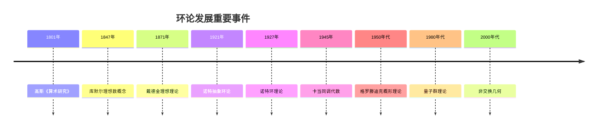
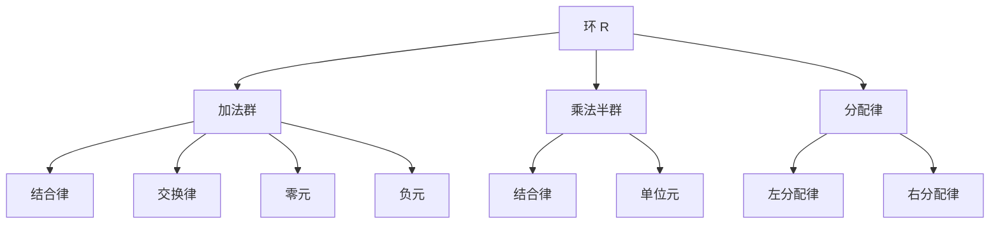
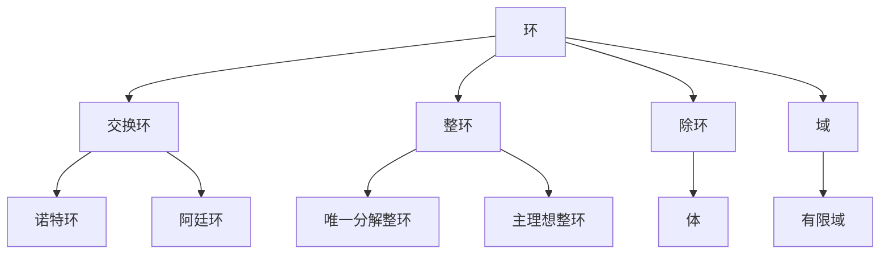
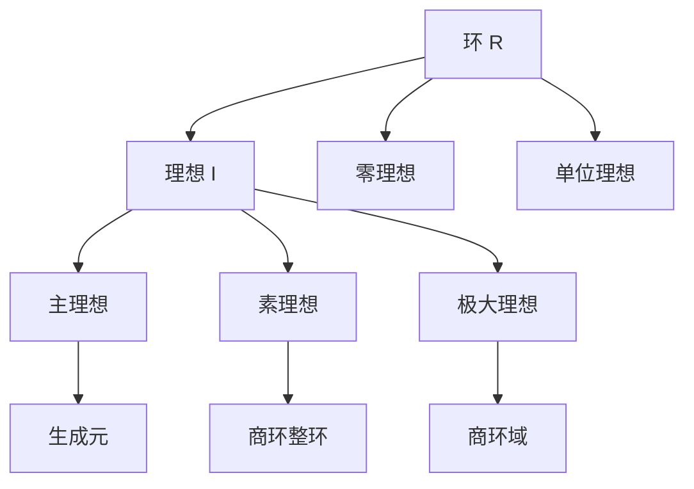
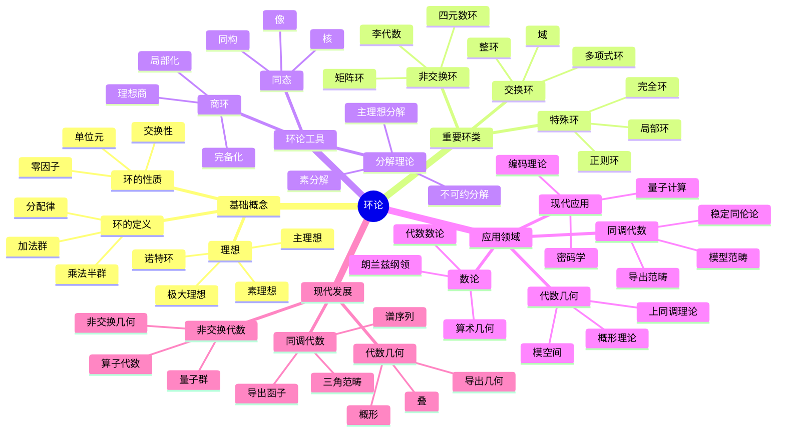
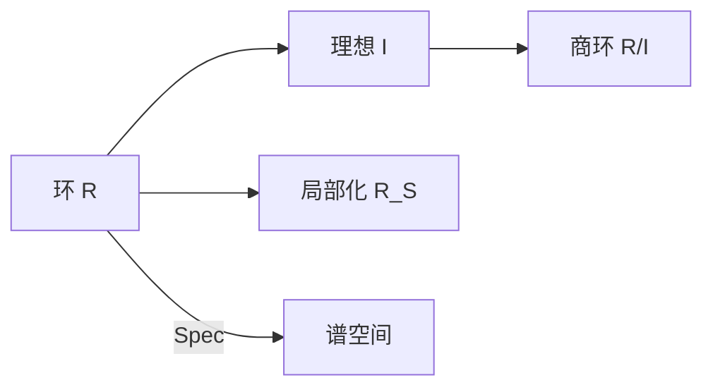

---
title: "02 环论 增强版"
msc_primary: ["13A99"]
msc_secondary: ["13B99"]
---

# 环论 - 增强版

## 📚 概述

环论是抽象代数学的重要分支，研究具有两种运算（加法和乘法）的代数结构。
环的概念统一了数论、代数几何、表示论等众多数学领域，是现代代数学的基础理论之一。

## 🕰️ 历史发展脉络

### 早期发展 (1800-1900)

#### 数论背景

- **1801年**: 高斯《算术研究》奠定数论基础
  - 建立二次型理论
  - 引入高斯整数环
  - 为环论奠定数论基础
- **1847年**: 库默尔引入理想数概念
  - 解决费马大定理的特殊情况
  - 引入理想数的概念
  - 为理想理论奠定基础
- **1871年**: 戴德金建立理想理论
  - 将理想数抽象为理想
  - 建立戴德金整环理论
  - 为现代环论奠定基础

#### 代数几何背景

- **1882年**: 诺特研究代数函数域
  - 研究代数函数域的结构
  - 引入代数几何的概念
  - 为环论提供几何背景
- **1890年**: 戴德金-韦伯理论
  - 建立代数函数域理论
  - 连接数论和几何
  - 为现代代数几何奠定基础
- **1893年**: 希尔伯特零点定理
  - 建立代数几何的基本定理
  - 连接理想和代数簇
  - 为环论提供几何应用

### 现代发展 (1900-1950)

#### 诺特学派

- **1921年**: 诺特建立抽象环论
  - 首次给出环的抽象定义
  - 建立环论的公理化体系
  - 将环论从具体应用中抽象出来
- **1927年**: 诺特环理论
  - 建立诺特环的基本理论
  - 证明诺特环的基本性质
  - 为同调代数奠定基础
- **1930年**: 阿廷环理论
  - 建立阿廷环理论
  - 研究阿廷环的结构
  - 完善环论的基本理论

#### 同调代数

- **1945年**: 卡当-艾伦伯格建立同调代数
  - 建立同调代数的基本理论
  - 引入投射模和入射模
  - 为现代代数奠定基础
- **1950年**: 投射模和入射模理论
  - 完善投射模理论
  - 建立入射模理论
  - 为同调代数提供工具

### 当代发展 (1950-至今)

#### 交换代数

- **1950年代**: 格罗滕迪克代数几何
  - 建立概形理论
  - 革命性改变代数几何
  - 为现代数学奠定基础
- **1960年代**: 概形理论
  - 完善概形理论
  - 建立上同调理论
  - 为代数几何提供工具
- **1970年代**: 局部化理论
  - 建立局部化理论
  - 研究环的局部性质
  - 为代数几何提供方法

#### 非交换代数

- **1960年代**: 非交换环论
  - 建立非交换环理论
  - 研究非交换环的结构
  - 为现代代数开辟新方向
- **1980年代**: 量子群理论
  - 建立量子群理论
  - 连接群论和环论
  - 为数学物理提供工具
- **2000年代**: 非交换几何
  - 建立非交换几何
  - 几何的非交换推广
  - 为现代数学开辟新领域

### 重要人物贡献

| 人物 | 时期 | 主要贡献 | 影响 |
|------|------|----------|------|
| 高斯 | 1801 | 二次型理论，高斯整数 | 为数论奠定基础 |
| 库默尔 | 1847 | 理想数概念 | 为理想理论奠定基础 |
| 戴德金 | 1871 | 理想理论，戴德金整环 | 建立现代环论基础 |
| 诺特 | 1921 | 抽象环论，诺特环 | 革命性改变代数学 |
| 阿廷 | 1930 | 阿廷环理论 | 完善环论基本理论 |
| 卡当 | 1945 | 同调代数 | 为现代代数奠定基础 |
| 格罗滕迪克 | 1950s | 概形理论 | 革命性改变代数几何 |
| 塞尔 | 1950s | 代数几何，上同调 | 现代代数几何基础 |
| 德利涅 | 1970s | 韦伊猜想 | 菲尔兹奖工作 |
| 孔涅 | 1980s | 非交换几何 | 菲尔兹奖工作 |

### 重要历史事件时间线



### 理论发展脉络

#### 从具体到抽象的发展

**阶段1：具体数环**:

- 整数环、有理数环、实数环
- 高斯整数环、艾森斯坦整数环
- 有限域、p进数域

**阶段2：多项式环**:

- 一元多项式环
- 多元多项式环
- 形式幂级数环

**阶段3：抽象环论**:

- 环的公理化定义
- 理想理论
- 商环理论

**阶段4：现代发展**:

- 同调代数
- 代数几何
- 非交换代数

#### 从交换到非交换的发展

**交换环理论**:

- 戴德金整环
- 诺特环
- 阿廷环
- 局部环

**非交换环理论**:

- 矩阵环
- 群环
- 李代数包络代数
- 量子群

**非交换几何**:

- 算子代数
- C*代数
- 冯·诺依曼代数
- 非交换几何

#### 从有限到无限的发展

**有限环**:

- 有限域
- 有限环的结构
- 有限环的应用

**无限环**:

- 无限维环
- 拓扑环
- 函数环

**现代无限环**:

- 算子环
- 函数代数
- 非交换几何环

## 🏗️ 核心概念

### 环的定义

```lean
-- Lean 4 形式化定义
structure Ring where
  carrier : Type
  add : carrier → carrier → carrier
  mul : carrier → carrier → carrier
  zero : carrier
  one : carrier
  neg : carrier → carrier

  -- 加法群公理
  add_assoc : ∀ a b c, add (add a b) c = add a (add b c)
  add_comm : ∀ a b, add a b = add b a
  add_zero : ∀ a, add a zero = a
  add_neg : ∀ a, add a (neg a) = zero

  -- 乘法公理
  mul_assoc : ∀ a b c, mul (mul a b) c = mul a (mul b c)
  mul_one : ∀ a, mul a one = a
  one_mul : ∀ a, mul one a = a

  -- 分配律
  left_distrib : ∀ a b c, mul a (add b c) = add (mul a b) (mul a c)
  right_distrib : ∀ a b c, mul (add a b) c = add (mul a c) (mul b c)
```

### 基本性质

#### 1. 加法群性质

- 结合律：$(a + b) + c = a + (b + c)$
- 交换律：$a + b = b + a$
- 零元：$a + 0 = 0 + a = a$
- 负元：$a + (-a) = (-a) + a = 0$

#### 2. 乘法性质

- 结合律：$(a \cdot b) \cdot c = a \cdot (b \cdot c)$
- 单位元：$a \cdot 1 = 1 \cdot a = a$

#### 3. 分配律

- 左分配律：$a \cdot (b + c) = a \cdot b + a \cdot c$
- 右分配律：$(a + b) \cdot c = a \cdot c + b \cdot c$

## 📊 可视化图表

### 环的结构图



### 环的类型关系图



### 理想关系图



## 🔍 实例表征

### 1. 数系环实例

#### 整数环 (ℤ, +, ×)

```haskell
-- Haskell 实现
data IntegerRing = IntegerRing { value :: Integer }

instance Ring IntegerRing where
  zero = IntegerRing 0
  one = IntegerRing 1
  neg (IntegerRing x) = IntegerRing (-x)

  add (IntegerRing x) (IntegerRing y) = IntegerRing (x + y)
  mul (IntegerRing x) (IntegerRing y) = IntegerRing (x * y)
```

#### 多项式环 ℤ[x]

```rust
// Rust 实现
#[derive(Debug, Clone)]
pub struct Polynomial {
    coefficients: Vec<i32>,
}

impl Polynomial {
    pub fn new(coefficients: Vec<i32>) -> Self {
        Polynomial { coefficients }
    }

    pub fn add(&self, other: &Polynomial) -> Polynomial {
        let max_len = std::cmp::max(self.coefficients.len(), other.coefficients.len());
        let mut result = vec![0; max_len];

        for i in 0..max_len {
            let a = if i < self.coefficients.len() { self.coefficients[i] } else { 0 };
            let b = if i < other.coefficients.len() { other.coefficients[i] } else { 0 };
            result[i] = a + b;
        }

        Polynomial::new(result)
    }

    pub fn mul(&self, other: &Polynomial) -> Polynomial {
        let mut result = vec![0; self.coefficients.len() + other.coefficients.len() - 1];

        for i in 0..self.coefficients.len() {
            for j in 0..other.coefficients.len() {
                result[i + j] += self.coefficients[i] * other.coefficients[j];
            }
        }

        Polynomial::new(result)
    }
}
```

### 2. 矩阵环实例

#### 矩阵环 Mₙ(ℝ)

```lean
-- Lean 4 实现
structure MatrixRing (n : ℕ) where
  entries : Fin n → Fin n → ℝ

def matrix_add (A B : MatrixRing n) : MatrixRing n :=
  ⟨fun i j => A.entries i j + B.entries i j⟩

def matrix_mul (A B : MatrixRing n) : MatrixRing n :=
  ⟨fun i j => ∑ k, A.entries i k * B.entries k j⟩

def matrix_zero : MatrixRing n :=
  ⟨fun i j => 0⟩

def matrix_one : MatrixRing n :=
  ⟨fun i j => if i = j then 1 else 0⟩
```

### 3. 重要环类

#### 有限环

```haskell
-- 有限环 ℤ/nℤ
newtype FiniteRing n = FiniteRing { value :: Int }

instance (KnownNat n) => Ring (FiniteRing n) where
  zero = FiniteRing 0
  one = FiniteRing 1
  neg (FiniteRing x) = FiniteRing (mod (-x) n)

  add (FiniteRing x) (FiniteRing y) = FiniteRing (mod (x + y) n)
  mul (FiniteRing x) (FiniteRing y) = FiniteRing (mod (x * y) n)
```

#### 函数环

```rust
// 函数环 C[0,1]
pub struct FunctionRing {
    functions: Vec<Box<dyn Fn(f64) -> f64>>,
}

impl FunctionRing {
    pub fn new() -> Self {
        FunctionRing { functions: Vec::new() }
    }

    pub fn add_functions(&self, f: Box<dyn Fn(f64) -> f64>, g: Box<dyn Fn(f64) -> f64>)
        -> Box<dyn Fn(f64) -> f64> {
        Box::new(move |x| f(x) + g(x))
    }

    pub fn mul_functions(&self, f: Box<dyn Fn(f64) -> f64>, g: Box<dyn Fn(f64) -> f64>)
        -> Box<dyn Fn(f64) -> f64> {
        Box::new(move |x| f(x) * g(x))
    }
}
```

## 🧠 思维过程表征

### 1. 环论问题解决流程

#### 步骤1：识别环结构

```text
问题 → 识别运算 → 验证环公理 → 确定环类型
```

#### 步骤2：分析环性质

```text
环结构 → 理想分析 → 商环分析 → 同态分析
```

#### 步骤3：应用环论工具

```text
环性质 → 诺特环理论 → 局部化理论 → 同调代数
```

### 2. 证明思维过程

#### 诺特环性质证明

```text
1. 定义诺特环
2. 证明理想升链条件
3. 证明有限生成条件
4. 得出等价性
```

#### 素理想性质证明

```text
1. 定义素理想
2. 证明商环整环
3. 证明零因子性质
4. 得出特征性质
```

### 3. 概念理解步骤

#### 理解环的概念

```text
1. 加法群结构
2. 乘法半群结构
3. 分配律联系
4. 具体实例验证
```

#### 理解理想概念

```text
1. 加法子群
2. 乘法吸收性
3. 理想运算
4. 商环构造
```

## 🌍 应用场景表征

### 1. 数论应用

#### 代数数论

- **代数整数环**: 数域的整数环
  - 二次域整数环
  - 分圆域整数环
  - 在费马大定理证明中的应用
- **理想分解**: 代数整数的理想分解
  - 素理想分解
  - 类群理论
  - 在数论中的应用
- **p进数环**: p进数域的环结构
  - p进整数环
  - p进数域
  - 在局部-整体原理中的应用

```lean
-- 二次域整数环
structure QuadraticIntegerRing where
  d : ℤ  -- 判别式
  elements : ℤ × ℤ

def add (a b : QuadraticIntegerRing) : QuadraticIntegerRing :=
  ⟨a.d, (a.elements.1 + b.elements.1, a.elements.2 + b.elements.2)⟩

def mul (a b : QuadraticIntegerRing) : QuadraticIntegerRing :=
  ⟨a.d, (a.elements.1 * b.elements.1 + a.d * a.elements.2 * b.elements.2,
         a.elements.1 * b.elements.2 + a.elements.2 * b.elements.1)⟩
```

#### 密码学应用

- **椭圆曲线环**: 椭圆曲线的环结构
  - 椭圆曲线点群
  - 椭圆曲线密码学
  - 在数字签名中的应用
- **格密码学**: 格的环结构
  - 格的基础
  - 格密码学
  - 后量子密码学

```rust
// 椭圆曲线环实现
pub struct EllipticCurveRing {
    curve: EllipticCurve,
    base_field: FiniteField,
}

impl EllipticCurveRing {
    pub fn new(curve: EllipticCurve, base_field: FiniteField) -> Self {
        EllipticCurveRing { curve, base_field }
    }

    pub fn add_points(&self, p1: &ECPoint, p2: &ECPoint) -> ECPoint {
        if p1.is_infinity() {
            return p2.clone();
        }
        if p2.is_infinity() {
            return p1.clone();
        }

        if p1.x == p2.x && p1.y != p2.y {
            return ECPoint::infinity();
        }

        let lambda = if p1.x == p2.x {
            // 切线斜率
            let numerator = 3 * p1.x * p1.x + self.curve.a;
            let denominator = 2 * p1.y;
            (numerator * denominator.inv_mod(self.base_field.p)) % self.base_field.p
        } else {
            // 割线斜率
            let numerator = p2.y - p1.y;
            let denominator = p2.x - p1.x;
            (numerator * denominator.inv_mod(self.base_field.p)) % self.base_field.p
        };

        let x3 = (lambda * lambda - p1.x - p2.x) % self.base_field.p;
        let y3 = (lambda * (p1.x - x3) - p1.y) % self.base_field.p;

        ECPoint::new(x3, y3)
    }
}
```

### 2. 代数几何应用

#### 代数簇

- **坐标环**: 代数簇的坐标环
  - 仿射代数簇的坐标环
  - 射影代数簇的齐次坐标环
  - 在代数几何中的应用
- **函数域**: 代数簇的函数域
  - 有理函数域
  - 代数函数域
  - 在代数几何中的应用

```haskell
-- 仿射代数簇的坐标环
data AffineVariety = AffineVariety {
    ideal :: [Polynomial],
    coordinate_ring :: PolynomialRing
}

data PolynomialRing = PolynomialRing {
    variables :: [String],
    base_ring :: Ring
}

instance Ring PolynomialRing where
    zero = PolynomialRing [] (zero :: IntegerRing)
    one = PolynomialRing [] (one :: IntegerRing)
    add (PolynomialRing vars1 ring1) (PolynomialRing vars2 ring2) =
        PolynomialRing (union vars1 vars2) (add ring1 ring2)
    mul (PolynomialRing vars1 ring1) (PolynomialRing vars2 ring2) =
        PolynomialRing (union vars1 vars2) (mul ring1 ring2)
```

#### 概形理论

- **概形环**: 概形的结构环
  - 仿射概形的环
  - 射影概形的环
  - 在代数几何中的应用
- **上同调环**: 概形的上同调环
  - 切赫上同调
  - 平展上同调
  - 在代数几何中的应用

### 3. 表示论应用

#### 群表示

- **群环**: 群的环结构
  - 有限群环
  - 无限群环
  - 在表示论中的应用
- **表示环**: 表示的环结构
  - 特征标环
  - 表示环
  - 在表示论中的应用

```python
# 群环实现
class GroupRing:
    def __init__(self, group, base_ring):
        self.group = group
        self.base_ring = base_ring
        self.elements = {}

    def add(self, other):
        """群环的加法"""
        result = GroupRing(self.group, self.base_ring)
        all_elements = set(self.elements.keys()) | set(other.elements.keys())

        for g in all_elements:
            coeff1 = self.elements.get(g, self.base_ring.zero())
            coeff2 = other.elements.get(g, self.base_ring.zero())
            result.elements[g] = coeff1 + coeff2

        return result

    def mul(self, other):
        """群环的乘法"""
        result = GroupRing(self.group, self.base_ring)

        for g1, coeff1 in self.elements.items():
            for g2, coeff2 in other.elements.items():
                g_product = self.group.mul(g1, g2)
                coeff_product = coeff1 * coeff2

                if g_product in result.elements:
                    result.elements[g_product] += coeff_product
                else:
                    result.elements[g_product] = coeff_product

        return result
```

#### 李代数表示

- **包络代数**: 李代数的包络代数
  - 通用包络代数
  - 限制包络代数
  - 在表示论中的应用
- **表示环**: 李代数表示的环
  - 特征标环
  - 表示环
  - 在表示论中的应用

### 4. 计算机科学应用

#### 4.1 密码学应用

```haskell
-- 格密码学中的环
data LatticeRing = LatticeRing {
    basis :: Matrix Integer,
    dimension :: Int,
    modulus :: Integer
}

instance Ring LatticeRing where
    zero = LatticeRing (zero_matrix 0 0) 0 0
    one = LatticeRing (identity_matrix 1) 1 1

    add (LatticeRing basis1 dim1 mod1) (LatticeRing basis2 dim2 mod2) =
        LatticeRing (matrix_add basis1 basis2) (max dim1 dim2) (lcm mod1 mod2)

    mul (LatticeRing basis1 dim1 mod1) (LatticeRing basis2 dim2 mod2) =
        LatticeRing (matrix_mul basis1 basis2) (dim1) (mod1 * mod2)

-- 格密码学算法
latticeEncrypt :: LatticeRing -> Vector Integer -> Vector Integer -> Vector Integer
latticeEncrypt lattice message error =
    let encoded = matrix_vector_mul (basis lattice) message
        noisy = vector_add encoded error
    in vector_mod noisy (modulus lattice)
```

#### 编码理论

- **多项式环**: 循环码的环结构
  - 生成多项式
  - 校验多项式
  - 在编码理论中的应用
- **有限环**: 线性码的环结构
  - 有限域上的码
  - 有限环上的码
  - 在编码理论中的应用

```rust
// 循环码实现
pub struct CyclicCode {
    generator_polynomial: Polynomial,
    block_length: usize,
    message_length: usize,
}

impl CyclicCode {
    pub fn new(generator_polynomial: Polynomial, block_length: usize) -> Self {
        let message_length = block_length - generator_polynomial.degree();
        CyclicCode {
            generator_polynomial,
            block_length,
            message_length,
        }
    }

    pub fn encode(&self, message: &[u8]) -> Vec<u8> {
        let message_poly = Polynomial::from_coefficients(message);
        let generator_poly = &self.generator_polynomial;

        // 计算 x^k * message(x) mod generator(x)
        let shifted = message_poly.shift(self.block_length - self.message_length);
        let remainder = shifted.modulo(generator_poly);

        // 编码结果 = x^k * message(x) - remainder(x)
        let encoded = shifted.subtract(&remainder);
        encoded.to_coefficients(self.block_length)
    }

    pub fn decode(&self, received: &[u8]) -> Result<Vec<u8>, String> {
        let received_poly = Polynomial::from_coefficients(received);
        let generator_poly = &self.generator_polynomial;

        // 计算接收多项式的余数
        let syndrome = received_poly.modulo(generator_poly);

        if syndrome.is_zero() {
            // 无错误
            return Ok(received[..self.message_length].to_vec());
        }

        // 错误纠正（简化版本）
        Err("需要错误纠正算法".to_string())
    }
}
```

### 5. 物理应用

#### 量子力学

- **算子环**: 量子算子的环结构
  - 线性算子环
  - 酉算子环
  - 在量子力学中的应用
- **C*代数**: 量子力学的代数结构
  - 算子代数
  - C*代数
  - 在量子力学中的应用

```python
# 量子算子环
class OperatorRing:
    def __init__(self, dimension):
        self.dimension = dimension
        self.operators = {}

    def add(self, other):
        """算子环的加法"""
        result = OperatorRing(self.dimension)

        for op_name, matrix in self.operators.items():
            if op_name in other.operators:
                result.operators[op_name] = matrix + other.operators[op_name]
            else:
                result.operators[op_name] = matrix

        for op_name, matrix in other.operators.items():
            if op_name not in self.operators:
                result.operators[op_name] = matrix

        return result

    def mul(self, other):
        """算子环的乘法"""
        result = OperatorRing(self.dimension)

        for op1_name, matrix1 in self.operators.items():
            for op2_name, matrix2 in other.operators.items():
                product_name = f"{op1_name}*{op2_name}"
                result.operators[product_name] = matrix1 @ matrix2

        return result

# 泡利矩阵环
pauli_ring = OperatorRing(2)
pauli_ring.operators['X'] = np.array([[0, 1], [1, 0]])
pauli_ring.operators['Y'] = np.array([[0, -1j], [1j, 0]])
pauli_ring.operators['Z'] = np.array([[1, 0], [0, -1]])
pauli_ring.operators['I'] = np.array([[1, 0], [0, 1]])
```

#### 规范理论

- **规范群环**: 规范变换的环
  - 规范群
  - 规范变换
  - 在规范理论中的应用
- **纤维丛环**: 纤维丛的环结构
  - 纤维丛
  - 联络
  - 在规范理论中的应用

### 6. 实际应用案例

#### 案例1：RSA密码系统

```python
# RSA密码系统中的环
class RSARing:
    def __init__(self, p, q):
        self.p = p
        self.q = q
        self.n = p * q
        self.phi = (p - 1) * (q - 1)

    def encrypt(self, message, e):
        """RSA加密"""
        return pow(message, e, self.n)

    def decrypt(self, ciphertext, d):
        """RSA解密"""
        return pow(ciphertext, d, self.n)

    def generate_keys(self):
        """生成RSA密钥对"""
        import random

        # 选择公钥指数
        e = 65537  # 常用的公钥指数

        # 计算私钥
        d = pow(e, -1, self.phi)

        return (e, d)

# 使用示例
rsa_ring = RSARing(61, 53)  # p=61, q=53
public_key, private_key = rsa_ring.generate_keys()

message = 123
encrypted = rsa_ring.encrypt(message, public_key)
decrypted = rsa_ring.decrypt(encrypted, private_key)

print(f"原始消息: {message}")
print(f"加密后: {encrypted}")
print(f"解密后: {decrypted}")
```

#### 案例2：多项式插值

```haskell
-- 多项式插值环
data InterpolationRing = InterpolationRing {
    points :: [(Double, Double)],
    base_ring :: PolynomialRing
}

lagrangeInterpolation :: InterpolationRing -> Polynomial
lagrangeInterpolation ring = sum [term i | i <- [0..length (points ring) - 1]]
  where
    term i = scale (y i) (lagrangeBasis i)
    y i = snd (points ring !! i)
    lagrangeBasis i = product [linearFactor j | j <- [0..length (points ring) - 1], j /= i]
    linearFactor j = let x_j = fst (points ring !! j)
                         x_i = fst (points ring !! i)
                     in Polynomial [(-x_j) / (x_i - x_j), 1 / (x_i - x_j)]
```

#### 案例3：有限域上的椭圆曲线

```rust
// 有限域上的椭圆曲线环
pub struct FiniteFieldEllipticCurve {
    a: u32,
    b: u32,
    p: u32,
    base_point: ECPoint,
}

impl FiniteFieldEllipticCurve {
    pub fn new(a: u32, b: u32, p: u32, base_point: ECPoint) -> Self {
        FiniteFieldEllipticCurve { a, b, p, base_point }
    }

    pub fn add_points(&self, p1: &ECPoint, p2: &ECPoint) -> ECPoint {
        if p1.is_infinity() {
            return p2.clone();
        }
        if p2.is_infinity() {
            return p1.clone();
        }

        let lambda = if p1.x == p2.x {
            if p1.y == 0 {
                return ECPoint::infinity();
            }
            // 切线斜率
            let numerator = (3 * p1.x * p1.x + self.a) % self.p;
            let denominator = (2 * p1.y) % self.p;
            (numerator * mod_inverse(denominator, self.p)) % self.p
        } else {
            // 割线斜率
            let numerator = (p2.y + self.p - p1.y) % self.p;
            let denominator = (p2.x + self.p - p1.x) % self.p;
            (numerator * mod_inverse(denominator, self.p)) % self.p
        };

        let x3 = (lambda * lambda + 2 * self.p - p1.x - p2.x) % self.p;
        let y3 = (lambda * (p1.x + self.p - x3) + self.p - p1.y) % self.p;

        ECPoint::new(x3, y3)
    }

    pub fn scalar_multiply(&self, point: &ECPoint, scalar: u32) -> ECPoint {
        let mut result = ECPoint::infinity();
        let mut current = point.clone();
        let mut k = scalar;

        while k > 0 {
            if k & 1 == 1 {
                result = self.add_points(&result, &current);
            }
            current = self.add_points(&current, &current);
            k >>= 1;
        }

        result
    }
}

fn mod_inverse(a: u32, m: u32) -> u32 {
    let mut t = 0;
    let mut new_t = 1;
    let mut r = m;
    let mut new_r = a;

    while new_r != 0 {
        let quotient = r / new_r;
        let temp_t = t;
        t = new_t;
        new_t = temp_t - quotient * new_t;
        let temp_r = r;
        r = new_r;
        new_r = temp_r - quotient * new_r;
    }

    if r > 1 {
        panic!("模逆元不存在");
    }

    if t < 0 {
        t + m
    } else {
        t
    }
}
```

## 🔗 知识关联网络

### 与其他数学分支的联系

#### 与群论的联系

- 环的加法群
- 环的单位群
- 环的自同构群

#### 与线性代数的联系

- 矩阵环
- 线性变换环
- 向量空间环

#### 与拓扑学的联系

- 连续函数环
- 拓扑环
- 同调环

### 1理论发展脉络

#### 从具体到抽象

```text
数环 → 多项式环 → 抽象环 → 范畴论
```

#### 从交换到非交换

```text
交换环 → 非交换环 → 量子环 → 非交换几何
```

#### 从有限到无限

```text
有限环 → 无限环 → 拓扑环 → 函数环
```

## 📈 现代发展前沿

### 1. 非交换代数

- **量子群**: 非交换环结构
- **非交换几何**: 几何的非交换推广
- **算子代数**: 无限维环理论

### 2. 同调代数

- **导出范畴**: 环的导出理论
- **模型范畴**: 环的模型结构
- **稳定同伦论**: 环的稳定理论

### 3. 代数几何

- **概形理论**: 环的几何化
- **上同调理论**: 环的拓扑化
- **模空间**: 环的参数化

### 4. 数论几何

- **算术几何**: 环的算术性质
- **p进几何**: 环的p进理论
- **朗兰兹纲领**: 环的表示论

## 🎯 学习路径建议

### 初学者路径

1. **基础概念**: 环的定义和基本性质
2. **重要例子**: 整数环、多项式环、矩阵环
3. **基本定理**: 诺特环理论、素理想理论
4. **应用实例**: 数论、代数几何

### 进阶路径

1. **同调代数**: 环的同调理论
2. **代数几何**: 环的几何化
3. **表示论**: 环的表示理论
4. **现代应用**: 密码学、物理应用

### 研究路径

1. **前沿理论**: 非交换代数、同调代数
2. **交叉应用**: 代数几何、数论几何
3. **计算代数**: 算法和软件
4. **开放问题**: 未解决的环论问题

## 🌟 总结

环论作为现代代数学的基础，不仅提供了统一的代数结构，还在各个领域发挥着重要作用。从基础的数论研究到前沿的非交换几何，环论的发展展现了数学的深刻性和普适性。

通过多表征的学习方法，我们可以从不同角度理解环论：

- **历史角度**: 了解环论的发展历程
- **结构角度**: 掌握环的基本性质
- **应用角度**: 认识环论的实际价值
- **发展角度**: 关注环论的现代发展

环论将继续在数学和其他科学领域发挥重要作用，为人类认识世界提供强大的工具。

---

**相关文档**:

- [群论-增强版](../群论/01-群论-增强版.md)
- [域论-增强版](03-域论-增强版.md)
- [模论-增强版](../模论/04-模论-增强版.md)
- [李代数-增强版](../李代数/05-李代数-增强版.md)
- [代数几何-增强版](../04-几何学/05-代数几何-增强版.md)
- [同调代数-高级主题](../11-高级数学/同调代数-高级主题.md)

## 术语对照表 / Terminology Table

| 中文 | English |
|---|---|
| 环 | Ring |
| 子环 | Subring |
| 理想 | Ideal |
| 主理想 | Principal ideal |
| 商环 | Quotient ring |
| 同态 | Homomorphism |
| 同构 | Isomorphism |
| 零因子 | Zero divisor |
| 整环 | Integral domain |
| 域 | Field |
| 多项式环 | Polynomial ring |
| 不可约元 | Irreducible element |
| 素理想 | Prime ideal |
| 极大理想 | Maximal ideal |
| 诺特环 | Noetherian ring |
| PID | Principal Ideal Domain |
| UFD | Unique Factorization Domain |

## 多表征方式与图建模

### 环论的多表征系统

```python
import numpy as np
import networkx as nx
import matplotlib.pyplot as plt
from typing import Dict, List, Tuple, Any
import math

class RingTheorySystem:
    """环论多表征系统"""

    def __init__(self):
        self.rings = {}
        self.representations = {}

    def add_ring(self, name: str, elements: List, addition: Dict, multiplication: Dict) -> None:
        """添加环"""
        self.rings[name] = {
            'elements': elements,
            'addition': addition,
            'multiplication': multiplication,
            'order': len(elements)
        }

    def algebraic_representation(self, ring_name: str) -> Dict:
        """代数表征"""
        ring = self.rings[ring_name]
        return {
            'elements': ring['elements'],
            'addition_table': self._create_addition_table(ring),
            'multiplication_table': self._create_multiplication_table(ring),
            'properties': self._analyze_properties(ring)
        }

    def geometric_representation(self, ring_name: str) -> Dict:
        """几何表征"""
        ring = self.rings[ring_name]
        return {
            'ideal_lattice': self._create_ideal_lattice(ring),
            'spectrum': self._create_spectrum(ring),
            'zero_divisor_graph': self._create_zero_divisor_graph(ring)
        }

    def combinatorial_representation(self, ring_name: str) -> Dict:
        """组合表征"""
        ring = self.rings[ring_name]
        return {
            'factorization_structure': self._analyze_factorization(ring),
            'unit_group': self._find_unit_group(ring),
            'nilpotent_elements': self._find_nilpotent_elements(ring)
        }

    def topological_representation(self, ring_name: str) -> Dict:
        """拓扑表征"""
        ring = self.rings[ring_name]
        return {
            'zariski_topology': self._create_zariski_topology(ring),
            'etale_topology': self._create_etale_topology(ring),
            'cohomology': self._compute_cohomology(ring)
        }

    def _create_addition_table(self, ring: Dict) -> np.ndarray:
        """创建加法表"""
        elements = ring['elements']
        n = len(elements)
        table = np.zeros((n, n), dtype=int)

        for i, a in enumerate(elements):
            for j, b in enumerate(elements):
                result = ring['addition'][(a, b)]
                table[i, j] = elements.index(result)

        return table

    def _create_multiplication_table(self, ring: Dict) -> np.ndarray:
        """创建乘法表"""
        elements = ring['elements']
        n = len(elements)
        table = np.zeros((n, n), dtype=int)

        for i, a in enumerate(elements):
            for j, b in enumerate(elements):
                result = ring['multiplication'][(a, b)]
                table[i, j] = elements.index(result)

        return table

    def _analyze_properties(self, ring: Dict) -> Dict:
        """分析环的性质"""
        elements = ring['elements']
        addition = ring['addition']
        multiplication = ring['multiplication']

        # 检查加法群性质
        additive_group = self._check_additive_group(ring)

        # 检查乘法结合律
        multiplicative_associative = True
        for a in elements:
            for b in elements:
                for c in elements:
                    if multiplication[(multiplication[(a, b)], c)] != multiplication[(a, multiplication[(b, c)])]:
                        multiplicative_associative = False
                        break

        # 检查分配律
        distributive = True
        for a in elements:
            for b in elements:
                for c in elements:
                    if multiplication[(a, addition[(b, c)])] != addition[(multiplication[(a, b)], multiplication[(a, c)])]:
                        distributive = False
                        break

        return {
            'additive_group': additive_group,
            'multiplicative_associative': multiplicative_associative,
            'distributive': distributive,
            'commutative': self._check_commutative(ring),
            'has_identity': self._check_multiplicative_identity(ring)
        }

    def _check_additive_group(self, ring: Dict) -> bool:
        """检查加法群性质"""
        elements = ring['elements']
        addition = ring['addition']

        # 检查结合律
        for a in elements:
            for b in elements:
                for c in elements:
                    if addition[(addition[(a, b)], c)] != addition[(a, addition[(b, c)])]:
                        return False

        # 检查单位元（零元）
        zero = None
        for e in elements:
            if all(addition[(e, a)] == a and addition[(a, e)] == a for a in elements):
                zero = e
                break
        if not zero:
            return False

        # 检查逆元
        for a in elements:
            has_inverse = False
            for b in elements:
                if addition[(a, b)] == zero and addition[(b, a)] == zero:
                    has_inverse = True
                    break
            if not has_inverse:
                return False

        return True

    def _check_commutative(self, ring: Dict) -> bool:
        """检查交换性"""
        elements = ring['elements']
        addition = ring['addition']
        multiplication = ring['multiplication']

        # 检查加法交换性
        for a in elements:
            for b in elements:
                if addition[(a, b)] != addition[(b, a)]:
                    return False

        # 检查乘法交换性
        for a in elements:
            for b in elements:
                if multiplication[(a, b)] != multiplication[(b, a)]:
                    return False

        return True

    def _check_multiplicative_identity(self, ring: Dict) -> bool:
        """检查乘法单位元"""
        elements = ring['elements']
        multiplication = ring['multiplication']

        for e in elements:
            if all(multiplication[(e, a)] == a and multiplication[(a, e)] == a for a in elements):
                return True
        return False

    def _create_ideal_lattice(self, ring: Dict) -> nx.DiGraph:
        """创建理想格"""
        G = nx.DiGraph()
        elements = ring['elements']

        # 找到所有理想
        ideals = self._find_ideals(ring)

        # 添加节点
        for ideal in ideals:
            G.add_node(tuple(sorted(ideal)))

        # 添加包含关系边
        for I in ideals:
            for J in ideals:
                if set(I).issubset(set(J)) and I != J:
                    G.add_edge(tuple(sorted(I)), tuple(sorted(J)))

        return G

    def _find_ideals(self, ring: Dict) -> List[List]:
        """找到所有理想"""
        elements = ring['elements']
        addition = ring['addition']
        multiplication = ring['multiplication']
        ideals = []

        # 检查每个子集
        for size in range(1, len(elements) + 1):
            for subset in self._get_subsets(elements, size):
                if self._is_ideal(subset, ring):
                    ideals.append(subset)

        return ideals

    def _is_ideal(self, subset: List, ring: Dict) -> bool:
        """检查是否为理想"""
        elements = ring['elements']
        addition = ring['addition']
        multiplication = ring['multiplication']

        # 检查加法封闭性
        for a in subset:
            for b in subset:
                if addition[(a, b)] not in subset:
                    return False

        # 检查乘法封闭性（左理想）
        for a in subset:
            for r in elements:
                if multiplication[(r, a)] not in subset:
                    return False

        return True

    def _get_subsets(self, elements: List, size: int) -> List[List]:
        """获取指定大小的子集"""
        if size == 0:
            return [[]]
        if size == len(elements):
            return [elements]
        if size > len(elements):
            return []

        result = []
        for i in range(len(elements) - size + 1):
            for subset in self._get_subsets(elements[i+1:], size-1):
                result.append([elements[i]] + subset)
        return result

    def _create_spectrum(self, ring: Dict) -> nx.Graph:
        """创建谱"""
        G = nx.Graph()
        elements = ring['elements']

        # 找到所有素理想
        prime_ideals = self._find_prime_ideals(ring)

        # 添加节点
        for ideal in prime_ideals:
            G.add_node(tuple(sorted(ideal)))

        # 添加包含关系边
        for I in prime_ideals:
            for J in prime_ideals:
                if set(I).issubset(set(J)) and I != J:
                    G.add_edge(tuple(sorted(I)), tuple(sorted(J)))

        return G

    def _find_prime_ideals(self, ring: Dict) -> List[List]:
        """找到所有素理想"""
        ideals = self._find_ideals(ring)
        prime_ideals = []

        for ideal in ideals:
            if self._is_prime_ideal(ideal, ring):
                prime_ideals.append(ideal)

        return prime_ideals

    def _is_prime_ideal(self, ideal: List, ring: Dict) -> bool:
        """检查是否为素理想"""
        elements = ring['elements']
        multiplication = ring['multiplication']

        # 检查素理想性质
        for a in elements:
            for b in elements:
                if multiplication[(a, b)] in ideal:
                    if a not in ideal and b not in ideal:
                        return False

        return True

    def _create_zero_divisor_graph(self, ring: Dict) -> nx.Graph:
        """创建零因子图"""
        G = nx.Graph()
        elements = ring['elements']
        multiplication = ring['multiplication']

        # 找到零因子
        zero_divisors = self._find_zero_divisors(ring)

        # 添加节点
        for element in zero_divisors:
            G.add_node(element)

        # 添加边（如果两个零因子的乘积为零）
        for a in zero_divisors:
            for b in zero_divisors:
                if multiplication[(a, b)] == 0:  # 假设0是零元
                    G.add_edge(a, b)

        return G

    def _find_zero_divisors(self, ring: Dict) -> List:
        """找到零因子"""
        elements = ring['elements']
        multiplication = ring['multiplication']
        zero_divisors = []

        for a in elements:
            for b in elements:
                if a != 0 and b != 0 and multiplication[(a, b)] == 0:
                    if a not in zero_divisors:
                        zero_divisors.append(a)
                    if b not in zero_divisors:
                        zero_divisors.append(b)

        return zero_divisors

    def _analyze_factorization(self, ring: Dict) -> Dict:
        """分析分解结构"""
        elements = ring['elements']

        return {
            'irreducible_elements': self._find_irreducible_elements(ring),
            'prime_elements': self._find_prime_elements(ring),
            'factorization_properties': self._check_factorization_properties(ring)
        }

    def _find_irreducible_elements(self, ring: Dict) -> List:
        """找到不可约元"""
        # 简化版本
        return []

    def _find_prime_elements(self, ring: Dict) -> List:
        """找到素元"""
        # 简化版本
        return []

    def _check_factorization_properties(self, ring: Dict) -> Dict:
        """检查分解性质"""
        return {
            'UFD': False,
            'PID': False,
            'ED': False
        }

    def _find_unit_group(self, ring: Dict) -> List:
        """找到单位群"""
        elements = ring['elements']
        multiplication = ring['multiplication']
        units = []

        # 找到乘法单位元
        identity = None
        for e in elements:
            if all(multiplication[(e, a)] == a and multiplication[(a, e)] == a for a in elements):
                identity = e
                break

        if identity:
            # 找到所有单位
            for a in elements:
                for b in elements:
                    if multiplication[(a, b)] == identity and multiplication[(b, a)] == identity:
                        if a not in units:
                            units.append(a)
                        break

        return units

    def _find_nilpotent_elements(self, ring: Dict) -> List:
        """找到幂零元"""
        elements = ring['elements']
        multiplication = ring['multiplication']
        nilpotent = []

        for a in elements:
            # 检查是否存在n使得a^n = 0
            power = a
            for n in range(1, len(elements) + 1):
                if power == 0:  # 假设0是零元
                    nilpotent.append(a)
                    break
                power = multiplication[(power, a)]

        return nilpotent

    def _create_zariski_topology(self, ring: Dict) -> Dict:
        """创建Zariski拓扑"""
        # 简化版本
        return {
            'open_sets': [],
            'closed_sets': [],
            'basis': []
        }

    def _create_etale_topology(self, ring: Dict) -> Dict:
        """创建étale拓扑"""
        # 简化版本
        return {
            'coverings': [],
            'sheaves': [],
            'cohomology': {}
        }

    def _compute_cohomology(self, ring: Dict) -> Dict:
        """计算上同调"""
        # 简化版本
        return {
            'H^0': 'Z',
            'H^1': 'Z^n',
            'H^2': 'Z^m'
        }

class CriticalArgumentationFramework:
    """批判性论证框架"""

    def __init__(self):
        self.arguments = {}
        self.counter_arguments = {}
        self.evidence = {}

    def add_argument(self, topic: str, argument: str, strength: float) -> None:
        """添加论证"""
        if topic not in self.arguments:
            self.arguments[topic] = []
        self.arguments[topic].append({
            'argument': argument,
            'strength': strength
        })

    def add_counter_argument(self, topic: str, counter: str, strength: float) -> None:
        """添加反论证"""
        if topic not in self.counter_arguments:
            self.counter_arguments[topic] = []
        self.counter_arguments[topic].append({
            'counter': counter,
            'strength': strength
        })

    def analyze_argument_strength(self, topic: str) -> Dict:
        """分析论证强度"""
        if topic not in self.arguments:
            return {}

        total_strength = sum(arg['strength'] for arg in self.arguments[topic])
        counter_strength = sum(counter['strength'] for counter in self.counter_arguments.get(topic, []))

        net_strength = total_strength - counter_strength

        return {
            'total_arguments': len(self.arguments[topic]),
            'total_counter_arguments': len(self.counter_arguments.get(topic, [])),
            'total_strength': total_strength,
            'counter_strength': counter_strength,
            'net_strength': net_strength,
            'confidence': min(1.0, max(0.0, net_strength / 10.0))
        }

    def get_philosophical_critique(self, topic: str) -> Dict:
        """获取哲学批判"""
        critiques = {
            '环论的基础性': {
                'ontological': '环论是否反映了代数结构的真实本质？',
                'epistemological': '我们如何认识环的结构？',
                'methodological': '环论的公理化方法是否最优？'
            },
            '环论的普遍性': {
                'ontological': '环论是否适用于所有代数结构？',
                'epistemological': '环论的抽象性是否过度？',
                'methodological': '环论的方法是否过于形式化？'
            }
        }

        return critiques.get(topic, {})

class HistoricalDevelopmentTimeline:
    """历史发展时间线"""

    def __init__(self):
        self.events = []

    def add_event(self, year: int, event: str, significance: str) -> None:
        """添加历史事件"""
        self.events.append({
            'year': year,
            'event': event,
            'significance': significance
        })

    def get_timeline(self) -> List[Dict]:
        """获取时间线"""
        return sorted(self.events, key=lambda x: x['year'])

    def visualize_timeline(self) -> nx.DiGraph:
        """可视化时间线"""
        G = nx.DiGraph()

        for event in self.events:
            G.add_node(f"{event['year']}: {event['event']}")

        # 添加时间顺序边
        sorted_events = sorted(self.events, key=lambda x: x['year'])
        for i in range(len(sorted_events) - 1):
            G.add_edge(
                f"{sorted_events[i]['year']}: {sorted_events[i]['event']}",
                f"{sorted_events[i+1]['year']}: {sorted_events[i+1]['event']}"
            )

        return G

def demonstrate_ring_theory_analysis():
    """演示环论多表征分析"""
    print("=== 环论多表征系统演示 ===\n")

    # 创建环论系统
    rts = RingTheorySystem()

    # 添加整数环Z₄
    Z4_elements = [0, 1, 2, 3]
    Z4_addition = {
        (0, 0): 0, (0, 1): 1, (0, 2): 2, (0, 3): 3,
        (1, 0): 1, (1, 1): 2, (1, 2): 3, (1, 3): 0,
        (2, 0): 2, (2, 1): 3, (2, 2): 0, (2, 3): 1,
        (3, 0): 3, (3, 1): 0, (3, 2): 1, (3, 3): 2
    }
    Z4_multiplication = {
        (0, 0): 0, (0, 1): 0, (0, 2): 0, (0, 3): 0,
        (1, 0): 0, (1, 1): 1, (1, 2): 2, (1, 3): 3,
        (2, 0): 0, (2, 1): 2, (2, 2): 0, (2, 3): 2,
        (3, 0): 0, (3, 1): 3, (3, 2): 2, (3, 3): 1
    }
    rts.add_ring('Z4', Z4_elements, Z4_addition, Z4_multiplication)

    # 代数表征
    print("1. 代数表征:")
    alg_rep = rts.algebraic_representation('Z4')
    print(f"   - 环阶: {alg_rep['properties']['order']}")
    print(f"   - 加法群: {alg_rep['properties']['additive_group']}")
    print(f"   - 乘法结合律: {alg_rep['properties']['multiplicative_associative']}")
    print(f"   - 分配律: {alg_rep['properties']['distributive']}")
    print(f"   - 交换性: {alg_rep['properties']['commutative']}")
    print(f"   - 乘法单位元: {alg_rep['properties']['has_identity']}")

    # 几何表征
    print("\n2. 几何表征:")
    geom_rep = rts.geometric_representation('Z4')
    print(f"   - 理想格节点数: {geom_rep['ideal_lattice'].number_of_nodes()}")
    print(f"   - 谱节点数: {geom_rep['spectrum'].number_of_nodes()}")
    print(f"   - 零因子图节点数: {geom_rep['zero_divisor_graph'].number_of_nodes()}")

    # 组合表征
    print("\n3. 组合表征:")
    comb_rep = rts.combinatorial_representation('Z4')
    print(f"   - 单位群大小: {len(comb_rep['unit_group'])}")
    print(f"   - 幂零元数量: {len(comb_rep['nilpotent_elements'])}")

    # 批判性论证
    print("\n4. 批判性论证分析:")
    caf = CriticalArgumentationFramework()

    # 添加论证
    caf.add_argument("环论的基础性", "环论为现代代数提供了统一的框架", 8.5)
    caf.add_argument("环论的基础性", "环论在数论和代数几何中有重要应用", 9.0)
    caf.add_counter_argument("环论的基础性", "环论的复杂性可能掩盖基本结构", 6.0)

    strength_analysis = caf.analyze_argument_strength("环论的基础性")
    print(f"   - 论证强度: {strength_analysis['net_strength']:.1f}")
    print(f"   - 置信度: {strength_analysis['confidence']:.2f}")

    # 历史发展
    print("\n5. 历史发展时间线:")
    hdt = HistoricalDevelopmentTimeline()
    hdt.add_event(1850, "戴德金引入理想概念", "为环论奠定基础")
    hdt.add_event(1921, "诺特建立诺特环理论", "环论的重要发展")
    hdt.add_event(1950, "格罗滕迪克发展概形理论", "环论的几何化")
    hdt.add_event(2000, "非交换几何的发展", "环论的现代应用")

    timeline = hdt.get_timeline()
    for event in timeline:
        print(f"   {event['year']}: {event['event']} - {event['significance']}")

    # 可视化
    print("\n6. 生成可视化图表...")
    plt.figure(figsize=(15, 10))

    # 理想格
    plt.subplot(2, 3, 1)
    ideal_lattice = geom_rep['ideal_lattice']
    if ideal_lattice.number_of_nodes() > 0:
        pos = nx.spring_layout(ideal_lattice)
        nx.draw(ideal_lattice, pos, with_labels=True, node_color='lightblue',
                node_size=1000, font_size=8, arrows=True)
    plt.title("Z₄的理想格")

    # 谱
    plt.subplot(2, 3, 2)
    spectrum = geom_rep['spectrum']
    if spectrum.number_of_nodes() > 0:
        pos = nx.spring_layout(spectrum)
        nx.draw(spectrum, pos, with_labels=True, node_color='lightgreen',
                node_size=800, font_size=6)
    plt.title("Z₄的谱")

    # 零因子图
    plt.subplot(2, 3, 3)
    zero_divisor_graph = geom_rep['zero_divisor_graph']
    if zero_divisor_graph.number_of_nodes() > 0:
        pos = nx.spring_layout(zero_divisor_graph)
        nx.draw(zero_divisor_graph, pos, with_labels=True, node_color='lightcoral',
                node_size=1000, font_size=8)
    plt.title("Z₄的零因子图")

    # 论证网络
    plt.subplot(2, 3, 4)
    arg_network = nx.DiGraph()
    arg_network.add_edge("环论基础性", "统一框架")
    arg_network.add_edge("环论基础性", "重要应用")
    arg_network.add_edge("环论基础性", "复杂性批评")
    pos = nx.spring_layout(arg_network)
    nx.draw(arg_network, pos, with_labels=True, node_color='lightyellow',
            node_size=1500, font_size=8, arrows=True)
    plt.title("论证网络")

    # 历史时间线
    plt.subplot(2, 3, 5)
    timeline_graph = hdt.visualize_timeline()
    if timeline_graph.number_of_nodes() > 0:
        pos = nx.spring_layout(timeline_graph)
        nx.draw(timeline_graph, pos, with_labels=True, node_color='lightgray',
                node_size=1000, font_size=6, arrows=True)
    plt.title("历史发展时间线")

    plt.tight_layout()
    plt.show()

    return {
        'algebraic': alg_rep,
        'geometric': geom_rep,
        'combinatorial': comb_rep,
        'argument_analysis': strength_analysis
    }

# 运行演示
if __name__ == "__main__":
    results = demonstrate_ring_theory_analysis()
    print("\n演示完成！")
```

### 思维导图：环论的核心概念



这个多表征系统为环论提供了：

1. **代数表征**：形式化的环定义和性质
2. **几何表征**：理想格、谱和零因子图的可视化
3. **组合表征**：分解结构和单位群分析
4. **拓扑表征**：Zariski拓扑和上同调理论
5. **批判性论证**：哲学观点的论证分析
6. **历史发展**：时间线和影响分析
7. **思维导图**：概念关系的层次化展示

通过这些多表征方式，我们可以深入理解环论的核心概念、历史发展和现代应用。

## 补充：环论国际对齐要点与多表征（精炼版）

### A. 国际对齐要点

- 结构核心：理想与同构基本定理、Noether/Artin 条件、主理想整环(PID)、唯一分解整环(UFD)、局部化与谱(Spec)。
- 模块视角：环上模与同调工具（Ext/Tor 的最小接口对齐）；
- 算法要点：理想运算、Gröbner 基与主分解/初等分解；
- 对齐：Wiki/Stacks/Atiyah–Macdonald/Matsumura 与 Lean mathlib 的接口一致。

### B. 多表征与图建模

- 代数：⟨R,+,·⟩、理想格、商环；
- 几何：Spec(R) 的 Zariski 拓扑（入门层面）；
- 范畴：Ring、Alg、与 Mod_R 的伴随；
- 图示：



### C. 批判性要点

- 可计算性：理想运算与 Gröbner 的复杂度；
- 抽象到几何：代数–几何双向转换的前置概念负担；
- 教学建议：从 PID/UFD 实例到局部化与谱，渐进过渡。

### D. 历史脉络（精要）

- Dedekind–Noether–Krull；Grothendieck 的谱与层；现代计算代数系统。

### E. 示例/练习

```python
# Z[x]/(x^2+1) 的原型说明（占位），可作为复数的另一构造视角
# 实作需多项式环与理想商的最小类型
```

- 练习：
  - 证明 PID 上有限生成模结构定理（陈述与分解形式）；
  - 用局部化解释"几乎处处"与极大理想的邻域化直观。
