# 环论 - 增强版

## 📚 概述

环论是抽象代数学的重要分支，研究具有两种运算（加法和乘法）的代数结构。
环的概念统一了数论、代数几何、表示论等众多数学领域，是现代代数学的基础理论之一。

## 🕰️ 历史发展脉络

### 早期发展 (1800-1900)

#### 数论背景

- **1801年**: 高斯《算术研究》奠定数论基础
  - 建立二次型理论
  - 引入高斯整数环
  - 为环论奠定数论基础
- **1847年**: 库默尔引入理想数概念
  - 解决费马大定理的特殊情况
  - 引入理想数的概念
  - 为理想理论奠定基础
- **1871年**: 戴德金建立理想理论
  - 将理想数抽象为理想
  - 建立戴德金整环理论
  - 为现代环论奠定基础

#### 代数几何背景

- **1882年**: 诺特研究代数函数域
  - 研究代数函数域的结构
  - 引入代数几何的概念
  - 为环论提供几何背景
- **1890年**: 戴德金-韦伯理论
  - 建立代数函数域理论
  - 连接数论和几何
  - 为现代代数几何奠定基础
- **1893年**: 希尔伯特零点定理
  - 建立代数几何的基本定理
  - 连接理想和代数簇
  - 为环论提供几何应用

### 现代发展 (1900-1950)

#### 诺特学派

- **1921年**: 诺特建立抽象环论
  - 首次给出环的抽象定义
  - 建立环论的公理化体系
  - 将环论从具体应用中抽象出来
- **1927年**: 诺特环理论
  - 建立诺特环的基本理论
  - 证明诺特环的基本性质
  - 为同调代数奠定基础
- **1930年**: 阿廷环理论
  - 建立阿廷环理论
  - 研究阿廷环的结构
  - 完善环论的基本理论

#### 同调代数

- **1945年**: 卡当-艾伦伯格建立同调代数
  - 建立同调代数的基本理论
  - 引入投射模和入射模
  - 为现代代数奠定基础
- **1950年**: 投射模和入射模理论
  - 完善投射模理论
  - 建立入射模理论
  - 为同调代数提供工具

### 当代发展 (1950-至今)

#### 交换代数

- **1950年代**: 格罗滕迪克代数几何
  - 建立概形理论
  - 革命性改变代数几何
  - 为现代数学奠定基础
- **1960年代**: 概形理论
  - 完善概形理论
  - 建立上同调理论
  - 为代数几何提供工具
- **1970年代**: 局部化理论
  - 建立局部化理论
  - 研究环的局部性质
  - 为代数几何提供方法

#### 非交换代数

- **1960年代**: 非交换环论
  - 建立非交换环理论
  - 研究非交换环的结构
  - 为现代代数开辟新方向
- **1980年代**: 量子群理论
  - 建立量子群理论
  - 连接群论和环论
  - 为数学物理提供工具
- **2000年代**: 非交换几何
  - 建立非交换几何
  - 几何的非交换推广
  - 为现代数学开辟新领域

### 重要人物贡献

| 人物 | 时期 | 主要贡献 | 影响 |
|------|------|----------|------|
| 高斯 | 1801 | 二次型理论，高斯整数 | 为数论奠定基础 |
| 库默尔 | 1847 | 理想数概念 | 为理想理论奠定基础 |
| 戴德金 | 1871 | 理想理论，戴德金整环 | 建立现代环论基础 |
| 诺特 | 1921 | 抽象环论，诺特环 | 革命性改变代数学 |
| 阿廷 | 1930 | 阿廷环理论 | 完善环论基本理论 |
| 卡当 | 1945 | 同调代数 | 为现代代数奠定基础 |
| 格罗滕迪克 | 1950s | 概形理论 | 革命性改变代数几何 |
| 塞尔 | 1950s | 代数几何，上同调 | 现代代数几何基础 |
| 德利涅 | 1970s | 韦伊猜想 | 菲尔兹奖工作 |
| 孔涅 | 1980s | 非交换几何 | 菲尔兹奖工作 |

### 重要历史事件时间线

```mermaid
timeline
    title 环论发展重要事件
    1801年 : 高斯《算术研究》
    1847年 : 库默尔理想数概念
    1871年 : 戴德金理想理论
    1921年 : 诺特抽象环论
    1927年 : 诺特环理论
    1945年 : 卡当同调代数
    1950年代 : 格罗滕迪克概形理论
    1980年代 : 量子群理论
    2000年代 : 非交换几何
```



### 理论发展脉络

#### 从具体到抽象的发展

**阶段1：具体数环**:

- 整数环、有理数环、实数环
- 高斯整数环、艾森斯坦整数环
- 有限域、p进数域

**阶段2：多项式环**:

- 一元多项式环
- 多元多项式环
- 形式幂级数环

**阶段3：抽象环论**:

- 环的公理化定义
- 理想理论
- 商环理论

**阶段4：现代发展**:

- 同调代数
- 代数几何
- 非交换代数

#### 从交换到非交换的发展

**交换环理论**:

- 戴德金整环
- 诺特环
- 阿廷环
- 局部环

**非交换环理论**:

- 矩阵环
- 群环
- 李代数包络代数
- 量子群

**非交换几何**:

- 算子代数
- C*代数
- 冯·诺依曼代数
- 非交换几何

#### 从有限到无限的发展

**有限环**:

- 有限域
- 有限环的结构
- 有限环的应用

**无限环**:

- 无限维环
- 拓扑环
- 函数环

**现代无限环**:

- 算子环
- 函数代数
- 非交换几何环

## 🏗️ 核心概念

### 环的定义

```lean
-- Lean 4 形式化定义
structure Ring where
  carrier : Type
  add : carrier → carrier → carrier
  mul : carrier → carrier → carrier
  zero : carrier
  one : carrier
  neg : carrier → carrier
  
  -- 加法群公理
  add_assoc : ∀ a b c, add (add a b) c = add a (add b c)
  add_comm : ∀ a b, add a b = add b a
  add_zero : ∀ a, add a zero = a
  add_neg : ∀ a, add a (neg a) = zero
  
  -- 乘法公理
  mul_assoc : ∀ a b c, mul (mul a b) c = mul a (mul b c)
  mul_one : ∀ a, mul a one = a
  one_mul : ∀ a, mul one a = a
  
  -- 分配律
  left_distrib : ∀ a b c, mul a (add b c) = add (mul a b) (mul a c)
  right_distrib : ∀ a b c, mul (add a b) c = add (mul a c) (mul b c)
```

### 基本性质

#### 1. 加法群性质

- 结合律：$(a + b) + c = a + (b + c)$
- 交换律：$a + b = b + a$
- 零元：$a + 0 = 0 + a = a$
- 负元：$a + (-a) = (-a) + a = 0$

#### 2. 乘法性质

- 结合律：$(a \cdot b) \cdot c = a \cdot (b \cdot c)$
- 单位元：$a \cdot 1 = 1 \cdot a = a$

#### 3. 分配律

- 左分配律：$a \cdot (b + c) = a \cdot b + a \cdot c$
- 右分配律：$(a + b) \cdot c = a \cdot c + b \cdot c$

## 📊 可视化图表

### 环的结构图

```mermaid
graph TD
    A[环 R] --> B[加法群]
    A --> C[乘法半群]
    A --> D[分配律]
    
    B --> E[结合律]
    B --> F[交换律]
    B --> G[零元]
    B --> H[负元]
    
    C --> I[结合律]
    C --> J[单位元]
    
    D --> K[左分配律]
    D --> L[右分配律]
```



### 环的类型关系图

```mermaid
graph TD
    A[环] --> B[交换环]
    A --> C[整环]
    A --> D[除环]
    A --> E[域]
    
    B --> F[诺特环]
    B --> G[阿廷环]
    
    C --> H[唯一分解整环]
    C --> I[主理想整环]
    
    D --> J[体]
    E --> K[有限域]
```



### 理想关系图

```mermaid
graph TD
    A[环 R] --> B[理想 I]
    B --> C[主理想]
    B --> D[素理想]
    B --> E[极大理想]
    
    C --> F[生成元]
    D --> G[商环整环]
    E --> H[商环域]
    
    A --> I[零理想]
    A --> J[单位理想]
```



## 🔍 实例表征

### 1. 数系环实例

#### 整数环 (ℤ, +, ×)

```haskell
-- Haskell 实现
data IntegerRing = IntegerRing { value :: Integer }

instance Ring IntegerRing where
  zero = IntegerRing 0
  one = IntegerRing 1
  neg (IntegerRing x) = IntegerRing (-x)
  
  add (IntegerRing x) (IntegerRing y) = IntegerRing (x + y)
  mul (IntegerRing x) (IntegerRing y) = IntegerRing (x * y)
```

#### 多项式环 ℤ[x]

```rust
// Rust 实现
#[derive(Debug, Clone)]
pub struct Polynomial {
    coefficients: Vec<i32>,
}

impl Polynomial {
    pub fn new(coefficients: Vec<i32>) -> Self {
        Polynomial { coefficients }
    }
    
    pub fn add(&self, other: &Polynomial) -> Polynomial {
        let max_len = std::cmp::max(self.coefficients.len(), other.coefficients.len());
        let mut result = vec![0; max_len];
        
        for i in 0..max_len {
            let a = if i < self.coefficients.len() { self.coefficients[i] } else { 0 };
            let b = if i < other.coefficients.len() { other.coefficients[i] } else { 0 };
            result[i] = a + b;
        }
        
        Polynomial::new(result)
    }
    
    pub fn mul(&self, other: &Polynomial) -> Polynomial {
        let mut result = vec![0; self.coefficients.len() + other.coefficients.len() - 1];
        
        for i in 0..self.coefficients.len() {
            for j in 0..other.coefficients.len() {
                result[i + j] += self.coefficients[i] * other.coefficients[j];
            }
        }
        
        Polynomial::new(result)
    }
}
```

### 2. 矩阵环实例

#### 矩阵环 Mₙ(ℝ)

```lean
-- Lean 4 实现
structure MatrixRing (n : ℕ) where
  entries : Fin n → Fin n → ℝ

def matrix_add (A B : MatrixRing n) : MatrixRing n :=
  ⟨fun i j => A.entries i j + B.entries i j⟩

def matrix_mul (A B : MatrixRing n) : MatrixRing n :=
  ⟨fun i j => ∑ k, A.entries i k * B.entries k j⟩

def matrix_zero : MatrixRing n :=
  ⟨fun i j => 0⟩

def matrix_one : MatrixRing n :=
  ⟨fun i j => if i = j then 1 else 0⟩
```

### 3. 重要环类

#### 有限环

```haskell
-- 有限环 ℤ/nℤ
newtype FiniteRing n = FiniteRing { value :: Int }

instance (KnownNat n) => Ring (FiniteRing n) where
  zero = FiniteRing 0
  one = FiniteRing 1
  neg (FiniteRing x) = FiniteRing (mod (-x) n)
  
  add (FiniteRing x) (FiniteRing y) = FiniteRing (mod (x + y) n)
  mul (FiniteRing x) (FiniteRing y) = FiniteRing (mod (x * y) n)
```

#### 函数环

```rust
// 函数环 C[0,1]
pub struct FunctionRing {
    functions: Vec<Box<dyn Fn(f64) -> f64>>,
}

impl FunctionRing {
    pub fn new() -> Self {
        FunctionRing { functions: Vec::new() }
    }
    
    pub fn add_functions(&self, f: Box<dyn Fn(f64) -> f64>, g: Box<dyn Fn(f64) -> f64>) 
        -> Box<dyn Fn(f64) -> f64> {
        Box::new(move |x| f(x) + g(x))
    }
    
    pub fn mul_functions(&self, f: Box<dyn Fn(f64) -> f64>, g: Box<dyn Fn(f64) -> f64>) 
        -> Box<dyn Fn(f64) -> f64> {
        Box::new(move |x| f(x) * g(x))
    }
}
```

## 🧠 思维过程表征

### 1. 环论问题解决流程

#### 步骤1：识别环结构

```text
问题 → 识别运算 → 验证环公理 → 确定环类型
```

#### 步骤2：分析环性质

```text
环结构 → 理想分析 → 商环分析 → 同态分析
```

#### 步骤3：应用环论工具

```text
环性质 → 诺特环理论 → 局部化理论 → 同调代数
```

### 2. 证明思维过程

#### 诺特环性质证明

```text
1. 定义诺特环
2. 证明理想升链条件
3. 证明有限生成条件
4. 得出等价性
```

#### 素理想性质证明

```text
1. 定义素理想
2. 证明商环整环
3. 证明零因子性质
4. 得出特征性质
```

### 3. 概念理解步骤

#### 理解环的概念

```text
1. 加法群结构
2. 乘法半群结构
3. 分配律联系
4. 具体实例验证
```

#### 理解理想概念

```text
1. 加法子群
2. 乘法吸收性
3. 理想运算
4. 商环构造
```

## 🌍 应用场景表征

### 1. 数论应用

#### 代数数论

- **代数整数环**: 数域的整数环
  - 二次域整数环
  - 分圆域整数环
  - 在费马大定理证明中的应用
- **理想分解**: 代数整数的理想分解
  - 素理想分解
  - 类群理论
  - 在数论中的应用
- **p进数环**: p进数域的环结构
  - p进整数环
  - p进数域
  - 在局部-整体原理中的应用

```lean
-- 二次域整数环
structure QuadraticIntegerRing where
  d : ℤ  -- 判别式
  elements : ℤ × ℤ

def add (a b : QuadraticIntegerRing) : QuadraticIntegerRing :=
  ⟨a.d, (a.elements.1 + b.elements.1, a.elements.2 + b.elements.2)⟩

def mul (a b : QuadraticIntegerRing) : QuadraticIntegerRing :=
  ⟨a.d, (a.elements.1 * b.elements.1 + a.d * a.elements.2 * b.elements.2,
         a.elements.1 * b.elements.2 + a.elements.2 * b.elements.1)⟩
```

#### 密码学应用

- **椭圆曲线环**: 椭圆曲线的环结构
  - 椭圆曲线点群
  - 椭圆曲线密码学
  - 在数字签名中的应用
- **格密码学**: 格的环结构
  - 格的基础
  - 格密码学
  - 后量子密码学

```rust
// 椭圆曲线环实现
pub struct EllipticCurveRing {
    curve: EllipticCurve,
    base_field: FiniteField,
}

impl EllipticCurveRing {
    pub fn new(curve: EllipticCurve, base_field: FiniteField) -> Self {
        EllipticCurveRing { curve, base_field }
    }
    
    pub fn add_points(&self, p1: &ECPoint, p2: &ECPoint) -> ECPoint {
        if p1.is_infinity() {
            return p2.clone();
        }
        if p2.is_infinity() {
            return p1.clone();
        }
        
        if p1.x == p2.x && p1.y != p2.y {
            return ECPoint::infinity();
        }
        
        let lambda = if p1.x == p2.x {
            // 切线斜率
            let numerator = 3 * p1.x * p1.x + self.curve.a;
            let denominator = 2 * p1.y;
            (numerator * denominator.inv_mod(self.base_field.p)) % self.base_field.p
        } else {
            // 割线斜率
            let numerator = p2.y - p1.y;
            let denominator = p2.x - p1.x;
            (numerator * denominator.inv_mod(self.base_field.p)) % self.base_field.p
        };
        
        let x3 = (lambda * lambda - p1.x - p2.x) % self.base_field.p;
        let y3 = (lambda * (p1.x - x3) - p1.y) % self.base_field.p;
        
        ECPoint::new(x3, y3)
    }
}
```

### 2. 代数几何应用

#### 代数簇

- **坐标环**: 代数簇的坐标环
  - 仿射代数簇的坐标环
  - 射影代数簇的齐次坐标环
  - 在代数几何中的应用
- **函数域**: 代数簇的函数域
  - 有理函数域
  - 代数函数域
  - 在代数几何中的应用

```haskell
-- 仿射代数簇的坐标环
data AffineVariety = AffineVariety {
    ideal :: [Polynomial],
    coordinate_ring :: PolynomialRing
}

data PolynomialRing = PolynomialRing {
    variables :: [String],
    base_ring :: Ring
}

instance Ring PolynomialRing where
    zero = PolynomialRing [] (zero :: IntegerRing)
    one = PolynomialRing [] (one :: IntegerRing)
    add (PolynomialRing vars1 ring1) (PolynomialRing vars2 ring2) = 
        PolynomialRing (union vars1 vars2) (add ring1 ring2)
    mul (PolynomialRing vars1 ring1) (PolynomialRing vars2 ring2) = 
        PolynomialRing (union vars1 vars2) (mul ring1 ring2)
```

#### 概形理论

- **概形环**: 概形的结构环
  - 仿射概形的环
  - 射影概形的环
  - 在代数几何中的应用
- **上同调环**: 概形的上同调环
  - 切赫上同调
  - 平展上同调
  - 在代数几何中的应用

### 3. 表示论应用

#### 群表示

- **群环**: 群的环结构
  - 有限群环
  - 无限群环
  - 在表示论中的应用
- **表示环**: 表示的环结构
  - 特征标环
  - 表示环
  - 在表示论中的应用

```python
# 群环实现
class GroupRing:
    def __init__(self, group, base_ring):
        self.group = group
        self.base_ring = base_ring
        self.elements = {}
        
    def add(self, other):
        """群环的加法"""
        result = GroupRing(self.group, self.base_ring)
        all_elements = set(self.elements.keys()) | set(other.elements.keys())
        
        for g in all_elements:
            coeff1 = self.elements.get(g, self.base_ring.zero())
            coeff2 = other.elements.get(g, self.base_ring.zero())
            result.elements[g] = coeff1 + coeff2
            
        return result
    
    def mul(self, other):
        """群环的乘法"""
        result = GroupRing(self.group, self.base_ring)
        
        for g1, coeff1 in self.elements.items():
            for g2, coeff2 in other.elements.items():
                g_product = self.group.mul(g1, g2)
                coeff_product = coeff1 * coeff2
                
                if g_product in result.elements:
                    result.elements[g_product] += coeff_product
                else:
                    result.elements[g_product] = coeff_product
                    
        return result
```

#### 李代数表示

- **包络代数**: 李代数的包络代数
  - 通用包络代数
  - 限制包络代数
  - 在表示论中的应用
- **表示环**: 李代数表示的环
  - 特征标环
  - 表示环
  - 在表示论中的应用

### 4. 计算机科学应用

#### 4.1 密码学应用

```haskell
-- 格密码学中的环
data LatticeRing = LatticeRing {
    basis :: Matrix Integer,
    dimension :: Int,
    modulus :: Integer
}

instance Ring LatticeRing where
    zero = LatticeRing (zero_matrix 0 0) 0 0
    one = LatticeRing (identity_matrix 1) 1 1
    
    add (LatticeRing basis1 dim1 mod1) (LatticeRing basis2 dim2 mod2) =
        LatticeRing (matrix_add basis1 basis2) (max dim1 dim2) (lcm mod1 mod2)
    
    mul (LatticeRing basis1 dim1 mod1) (LatticeRing basis2 dim2 mod2) =
        LatticeRing (matrix_mul basis1 basis2) (dim1) (mod1 * mod2)

-- 格密码学算法
latticeEncrypt :: LatticeRing -> Vector Integer -> Vector Integer -> Vector Integer
latticeEncrypt lattice message error =
    let encoded = matrix_vector_mul (basis lattice) message
        noisy = vector_add encoded error
    in vector_mod noisy (modulus lattice)
```

#### 编码理论

- **多项式环**: 循环码的环结构
  - 生成多项式
  - 校验多项式
  - 在编码理论中的应用
- **有限环**: 线性码的环结构
  - 有限域上的码
  - 有限环上的码
  - 在编码理论中的应用

```rust
// 循环码实现
pub struct CyclicCode {
    generator_polynomial: Polynomial,
    block_length: usize,
    message_length: usize,
}

impl CyclicCode {
    pub fn new(generator_polynomial: Polynomial, block_length: usize) -> Self {
        let message_length = block_length - generator_polynomial.degree();
        CyclicCode {
            generator_polynomial,
            block_length,
            message_length,
        }
    }
    
    pub fn encode(&self, message: &[u8]) -> Vec<u8> {
        let message_poly = Polynomial::from_coefficients(message);
        let generator_poly = &self.generator_polynomial;
        
        // 计算 x^k * message(x) mod generator(x)
        let shifted = message_poly.shift(self.block_length - self.message_length);
        let remainder = shifted.modulo(generator_poly);
        
        // 编码结果 = x^k * message(x) - remainder(x)
        let encoded = shifted.subtract(&remainder);
        encoded.to_coefficients(self.block_length)
    }
    
    pub fn decode(&self, received: &[u8]) -> Result<Vec<u8>, String> {
        let received_poly = Polynomial::from_coefficients(received);
        let generator_poly = &self.generator_polynomial;
        
        // 计算接收多项式的余数
        let syndrome = received_poly.modulo(generator_poly);
        
        if syndrome.is_zero() {
            // 无错误
            return Ok(received[..self.message_length].to_vec());
        }
        
        // 错误纠正（简化版本）
        Err("需要错误纠正算法".to_string())
    }
}
```

### 5. 物理应用

#### 量子力学

- **算子环**: 量子算子的环结构
  - 线性算子环
  - 酉算子环
  - 在量子力学中的应用
- **C*代数**: 量子力学的代数结构
  - 算子代数
  - C*代数
  - 在量子力学中的应用

```python
# 量子算子环
class OperatorRing:
    def __init__(self, dimension):
        self.dimension = dimension
        self.operators = {}
        
    def add(self, other):
        """算子环的加法"""
        result = OperatorRing(self.dimension)
        
        for op_name, matrix in self.operators.items():
            if op_name in other.operators:
                result.operators[op_name] = matrix + other.operators[op_name]
            else:
                result.operators[op_name] = matrix
                
        for op_name, matrix in other.operators.items():
            if op_name not in self.operators:
                result.operators[op_name] = matrix
                
        return result
    
    def mul(self, other):
        """算子环的乘法"""
        result = OperatorRing(self.dimension)
        
        for op1_name, matrix1 in self.operators.items():
            for op2_name, matrix2 in other.operators.items():
                product_name = f"{op1_name}*{op2_name}"
                result.operators[product_name] = matrix1 @ matrix2
                
        return result

# 泡利矩阵环
pauli_ring = OperatorRing(2)
pauli_ring.operators['X'] = np.array([[0, 1], [1, 0]])
pauli_ring.operators['Y'] = np.array([[0, -1j], [1j, 0]])
pauli_ring.operators['Z'] = np.array([[1, 0], [0, -1]])
pauli_ring.operators['I'] = np.array([[1, 0], [0, 1]])
```

#### 规范理论

- **规范群环**: 规范变换的环
  - 规范群
  - 规范变换
  - 在规范理论中的应用
- **纤维丛环**: 纤维丛的环结构
  - 纤维丛
  - 联络
  - 在规范理论中的应用

### 6. 实际应用案例

#### 案例1：RSA密码系统

```python
# RSA密码系统中的环
class RSARing:
    def __init__(self, p, q):
        self.p = p
        self.q = q
        self.n = p * q
        self.phi = (p - 1) * (q - 1)
        
    def encrypt(self, message, e):
        """RSA加密"""
        return pow(message, e, self.n)
    
    def decrypt(self, ciphertext, d):
        """RSA解密"""
        return pow(ciphertext, d, self.n)
    
    def generate_keys(self):
        """生成RSA密钥对"""
        import random
        
        # 选择公钥指数
        e = 65537  # 常用的公钥指数
        
        # 计算私钥
        d = pow(e, -1, self.phi)
        
        return (e, d)

# 使用示例
rsa_ring = RSARing(61, 53)  # p=61, q=53
public_key, private_key = rsa_ring.generate_keys()

message = 123
encrypted = rsa_ring.encrypt(message, public_key)
decrypted = rsa_ring.decrypt(encrypted, private_key)

print(f"原始消息: {message}")
print(f"加密后: {encrypted}")
print(f"解密后: {decrypted}")
```

#### 案例2：多项式插值

```haskell
-- 多项式插值环
data InterpolationRing = InterpolationRing {
    points :: [(Double, Double)],
    base_ring :: PolynomialRing
}

lagrangeInterpolation :: InterpolationRing -> Polynomial
lagrangeInterpolation ring = sum [term i | i <- [0..length (points ring) - 1]]
  where
    term i = scale (y i) (lagrangeBasis i)
    y i = snd (points ring !! i)
    lagrangeBasis i = product [linearFactor j | j <- [0..length (points ring) - 1], j /= i]
    linearFactor j = let x_j = fst (points ring !! j)
                         x_i = fst (points ring !! i)
                     in Polynomial [(-x_j) / (x_i - x_j), 1 / (x_i - x_j)]
```

#### 案例3：有限域上的椭圆曲线

```rust
// 有限域上的椭圆曲线环
pub struct FiniteFieldEllipticCurve {
    a: u32,
    b: u32,
    p: u32,
    base_point: ECPoint,
}

impl FiniteFieldEllipticCurve {
    pub fn new(a: u32, b: u32, p: u32, base_point: ECPoint) -> Self {
        FiniteFieldEllipticCurve { a, b, p, base_point }
    }
    
    pub fn add_points(&self, p1: &ECPoint, p2: &ECPoint) -> ECPoint {
        if p1.is_infinity() {
            return p2.clone();
        }
        if p2.is_infinity() {
            return p1.clone();
        }
        
        let lambda = if p1.x == p2.x {
            if p1.y == 0 {
                return ECPoint::infinity();
            }
            // 切线斜率
            let numerator = (3 * p1.x * p1.x + self.a) % self.p;
            let denominator = (2 * p1.y) % self.p;
            (numerator * mod_inverse(denominator, self.p)) % self.p
        } else {
            // 割线斜率
            let numerator = (p2.y + self.p - p1.y) % self.p;
            let denominator = (p2.x + self.p - p1.x) % self.p;
            (numerator * mod_inverse(denominator, self.p)) % self.p
        };
        
        let x3 = (lambda * lambda + 2 * self.p - p1.x - p2.x) % self.p;
        let y3 = (lambda * (p1.x + self.p - x3) + self.p - p1.y) % self.p;
        
        ECPoint::new(x3, y3)
    }
    
    pub fn scalar_multiply(&self, point: &ECPoint, scalar: u32) -> ECPoint {
        let mut result = ECPoint::infinity();
        let mut current = point.clone();
        let mut k = scalar;
        
        while k > 0 {
            if k & 1 == 1 {
                result = self.add_points(&result, &current);
            }
            current = self.add_points(&current, &current);
            k >>= 1;
        }
        
        result
    }
}

fn mod_inverse(a: u32, m: u32) -> u32 {
    let mut t = 0;
    let mut new_t = 1;
    let mut r = m;
    let mut new_r = a;
    
    while new_r != 0 {
        let quotient = r / new_r;
        let temp_t = t;
        t = new_t;
        new_t = temp_t - quotient * new_t;
        let temp_r = r;
        r = new_r;
        new_r = temp_r - quotient * new_r;
    }
    
    if r > 1 {
        panic!("模逆元不存在");
    }
    
    if t < 0 {
        t + m
    } else {
        t
    }
}
```

## 🔗 知识关联网络

### 与其他数学分支的联系

#### 与群论的联系

- 环的加法群
- 环的单位群
- 环的自同构群

#### 与线性代数的联系

- 矩阵环
- 线性变换环
- 向量空间环

#### 与拓扑学的联系

- 连续函数环
- 拓扑环
- 同调环

### 1理论发展脉络

#### 从具体到抽象

```text
数环 → 多项式环 → 抽象环 → 范畴论
```

#### 从交换到非交换

```text
交换环 → 非交换环 → 量子环 → 非交换几何
```

#### 从有限到无限

```text
有限环 → 无限环 → 拓扑环 → 函数环
```

## 📈 现代发展前沿

### 1. 非交换代数

- **量子群**: 非交换环结构
- **非交换几何**: 几何的非交换推广
- **算子代数**: 无限维环理论

### 2. 同调代数

- **导出范畴**: 环的导出理论
- **模型范畴**: 环的模型结构
- **稳定同伦论**: 环的稳定理论

### 3. 代数几何

- **概形理论**: 环的几何化
- **上同调理论**: 环的拓扑化
- **模空间**: 环的参数化

### 4. 数论几何

- **算术几何**: 环的算术性质
- **p进几何**: 环的p进理论
- **朗兰兹纲领**: 环的表示论

## 🎯 学习路径建议

### 初学者路径

1. **基础概念**: 环的定义和基本性质
2. **重要例子**: 整数环、多项式环、矩阵环
3. **基本定理**: 诺特环理论、素理想理论
4. **应用实例**: 数论、代数几何

### 进阶路径

1. **同调代数**: 环的同调理论
2. **代数几何**: 环的几何化
3. **表示论**: 环的表示理论
4. **现代应用**: 密码学、物理应用

### 研究路径

1. **前沿理论**: 非交换代数、同调代数
2. **交叉应用**: 代数几何、数论几何
3. **计算代数**: 算法和软件
4. **开放问题**: 未解决的环论问题

## 🌟 总结

环论作为现代代数学的基础，不仅提供了统一的代数结构，还在各个领域发挥着重要作用。从基础的数论研究到前沿的非交换几何，环论的发展展现了数学的深刻性和普适性。

通过多表征的学习方法，我们可以从不同角度理解环论：

- **历史角度**: 了解环论的发展历程
- **结构角度**: 掌握环的基本性质
- **应用角度**: 认识环论的实际价值
- **发展角度**: 关注环论的现代发展

环论将继续在数学和其他科学领域发挥重要作用，为人类认识世界提供强大的工具。

---

**相关文档**:

- [群论-增强版](../群论/01-群论-增强版.md)
- [域论-增强版](03-域论-增强版.md)
- [模论-增强版](../模论/04-模论-增强版.md)
- [李代数-增强版](../李代数/05-李代数-增强版.md)
- [代数几何-增强版](../04-几何学/05-代数几何-增强版.md)
- [同调代数-高级主题](../11-高级数学/同调代数-高级主题.md)

## 术语对照表 / Terminology Table

| 中文 | English |
|---|---|
| 环 | Ring |
| 子环 | Subring |
| 理想 | Ideal |
| 主理想 | Principal ideal |
| 商环 | Quotient ring |
| 同态 | Homomorphism |
| 同构 | Isomorphism |
| 零因子 | Zero divisor |
| 整环 | Integral domain |
| 域 | Field |
| 多项式环 | Polynomial ring |
| 不可约元 | Irreducible element |
| 素理想 | Prime ideal |
| 极大理想 | Maximal ideal |
| 诺特环 | Noetherian ring |
| PID | Principal Ideal Domain |
| UFD | Unique Factorization Domain |

## 多表征方式与图建模

### 环论的多表征系统

```python
import numpy as np
import networkx as nx
import matplotlib.pyplot as plt
from typing import Dict, List, Tuple, Any
import math

class RingTheorySystem:
    """环论多表征系统"""
    
    def __init__(self):
        self.rings = {}
        self.representations = {}
        
    def add_ring(self, name: str, elements: List, addition: Dict, multiplication: Dict) -> None:
        """添加环"""
        self.rings[name] = {
            'elements': elements,
            'addition': addition,
            'multiplication': multiplication,
            'order': len(elements)
        }
        
    def algebraic_representation(self, ring_name: str) -> Dict:
        """代数表征"""
        ring = self.rings[ring_name]
        return {
            'elements': ring['elements'],
            'addition_table': self._create_addition_table(ring),
            'multiplication_table': self._create_multiplication_table(ring),
            'properties': self._analyze_properties(ring)
        }
        
    def geometric_representation(self, ring_name: str) -> Dict:
        """几何表征"""
        ring = self.rings[ring_name]
        return {
            'ideal_lattice': self._create_ideal_lattice(ring),
            'spectrum': self._create_spectrum(ring),
            'zero_divisor_graph': self._create_zero_divisor_graph(ring)
        }
        
    def combinatorial_representation(self, ring_name: str) -> Dict:
        """组合表征"""
        ring = self.rings[ring_name]
        return {
            'factorization_structure': self._analyze_factorization(ring),
            'unit_group': self._find_unit_group(ring),
            'nilpotent_elements': self._find_nilpotent_elements(ring)
        }
        
    def topological_representation(self, ring_name: str) -> Dict:
        """拓扑表征"""
        ring = self.rings[ring_name]
        return {
            'zariski_topology': self._create_zariski_topology(ring),
            'etale_topology': self._create_etale_topology(ring),
            'cohomology': self._compute_cohomology(ring)
        }
        
    def _create_addition_table(self, ring: Dict) -> np.ndarray:
        """创建加法表"""
        elements = ring['elements']
        n = len(elements)
        table = np.zeros((n, n), dtype=int)
        
        for i, a in enumerate(elements):
            for j, b in enumerate(elements):
                result = ring['addition'][(a, b)]
                table[i, j] = elements.index(result)
                
        return table
        
    def _create_multiplication_table(self, ring: Dict) -> np.ndarray:
        """创建乘法表"""
        elements = ring['elements']
        n = len(elements)
        table = np.zeros((n, n), dtype=int)
        
        for i, a in enumerate(elements):
            for j, b in enumerate(elements):
                result = ring['multiplication'][(a, b)]
                table[i, j] = elements.index(result)
                
        return table
        
    def _analyze_properties(self, ring: Dict) -> Dict:
        """分析环的性质"""
        elements = ring['elements']
        addition = ring['addition']
        multiplication = ring['multiplication']
        
        # 检查加法群性质
        additive_group = self._check_additive_group(ring)
        
        # 检查乘法结合律
        multiplicative_associative = True
        for a in elements:
            for b in elements:
                for c in elements:
                    if multiplication[(multiplication[(a, b)], c)] != multiplication[(a, multiplication[(b, c)])]:
                        multiplicative_associative = False
                        break
                        
        # 检查分配律
        distributive = True
        for a in elements:
            for b in elements:
                for c in elements:
                    if multiplication[(a, addition[(b, c)])] != addition[(multiplication[(a, b)], multiplication[(a, c)])]:
                        distributive = False
                        break
                        
        return {
            'additive_group': additive_group,
            'multiplicative_associative': multiplicative_associative,
            'distributive': distributive,
            'commutative': self._check_commutative(ring),
            'has_identity': self._check_multiplicative_identity(ring)
        }
        
    def _check_additive_group(self, ring: Dict) -> bool:
        """检查加法群性质"""
        elements = ring['elements']
        addition = ring['addition']
        
        # 检查结合律
        for a in elements:
            for b in elements:
                for c in elements:
                    if addition[(addition[(a, b)], c)] != addition[(a, addition[(b, c)])]:
                        return False
                        
        # 检查单位元（零元）
        zero = None
        for e in elements:
            if all(addition[(e, a)] == a and addition[(a, e)] == a for a in elements):
                zero = e
                break
        if not zero:
            return False
            
        # 检查逆元
        for a in elements:
            has_inverse = False
            for b in elements:
                if addition[(a, b)] == zero and addition[(b, a)] == zero:
                    has_inverse = True
                    break
            if not has_inverse:
                return False
                
        return True
        
    def _check_commutative(self, ring: Dict) -> bool:
        """检查交换性"""
        elements = ring['elements']
        addition = ring['addition']
        multiplication = ring['multiplication']
        
        # 检查加法交换性
        for a in elements:
            for b in elements:
                if addition[(a, b)] != addition[(b, a)]:
                    return False
                    
        # 检查乘法交换性
        for a in elements:
            for b in elements:
                if multiplication[(a, b)] != multiplication[(b, a)]:
                    return False
                    
        return True
        
    def _check_multiplicative_identity(self, ring: Dict) -> bool:
        """检查乘法单位元"""
        elements = ring['elements']
        multiplication = ring['multiplication']
        
        for e in elements:
            if all(multiplication[(e, a)] == a and multiplication[(a, e)] == a for a in elements):
                return True
        return False
        
    def _create_ideal_lattice(self, ring: Dict) -> nx.DiGraph:
        """创建理想格"""
        G = nx.DiGraph()
        elements = ring['elements']
        
        # 找到所有理想
        ideals = self._find_ideals(ring)
        
        # 添加节点
        for ideal in ideals:
            G.add_node(tuple(sorted(ideal)))
            
        # 添加包含关系边
        for I in ideals:
            for J in ideals:
                if set(I).issubset(set(J)) and I != J:
                    G.add_edge(tuple(sorted(I)), tuple(sorted(J)))
                    
        return G
        
    def _find_ideals(self, ring: Dict) -> List[List]:
        """找到所有理想"""
        elements = ring['elements']
        addition = ring['addition']
        multiplication = ring['multiplication']
        ideals = []
        
        # 检查每个子集
        for size in range(1, len(elements) + 1):
            for subset in self._get_subsets(elements, size):
                if self._is_ideal(subset, ring):
                    ideals.append(subset)
                    
        return ideals
        
    def _is_ideal(self, subset: List, ring: Dict) -> bool:
        """检查是否为理想"""
        elements = ring['elements']
        addition = ring['addition']
        multiplication = ring['multiplication']
        
        # 检查加法封闭性
        for a in subset:
            for b in subset:
                if addition[(a, b)] not in subset:
                    return False
                    
        # 检查乘法封闭性（左理想）
        for a in subset:
            for r in elements:
                if multiplication[(r, a)] not in subset:
                    return False
                    
        return True
        
    def _get_subsets(self, elements: List, size: int) -> List[List]:
        """获取指定大小的子集"""
        if size == 0:
            return [[]]
        if size == len(elements):
            return [elements]
        if size > len(elements):
            return []
            
        result = []
        for i in range(len(elements) - size + 1):
            for subset in self._get_subsets(elements[i+1:], size-1):
                result.append([elements[i]] + subset)
        return result
        
    def _create_spectrum(self, ring: Dict) -> nx.Graph:
        """创建谱"""
        G = nx.Graph()
        elements = ring['elements']
        
        # 找到所有素理想
        prime_ideals = self._find_prime_ideals(ring)
        
        # 添加节点
        for ideal in prime_ideals:
            G.add_node(tuple(sorted(ideal)))
            
        # 添加包含关系边
        for I in prime_ideals:
            for J in prime_ideals:
                if set(I).issubset(set(J)) and I != J:
                    G.add_edge(tuple(sorted(I)), tuple(sorted(J)))
                    
        return G
        
    def _find_prime_ideals(self, ring: Dict) -> List[List]:
        """找到所有素理想"""
        ideals = self._find_ideals(ring)
        prime_ideals = []
        
        for ideal in ideals:
            if self._is_prime_ideal(ideal, ring):
                prime_ideals.append(ideal)
                
        return prime_ideals
        
    def _is_prime_ideal(self, ideal: List, ring: Dict) -> bool:
        """检查是否为素理想"""
        elements = ring['elements']
        multiplication = ring['multiplication']
        
        # 检查素理想性质
        for a in elements:
            for b in elements:
                if multiplication[(a, b)] in ideal:
                    if a not in ideal and b not in ideal:
                        return False
                        
        return True
        
    def _create_zero_divisor_graph(self, ring: Dict) -> nx.Graph:
        """创建零因子图"""
        G = nx.Graph()
        elements = ring['elements']
        multiplication = ring['multiplication']
        
        # 找到零因子
        zero_divisors = self._find_zero_divisors(ring)
        
        # 添加节点
        for element in zero_divisors:
            G.add_node(element)
            
        # 添加边（如果两个零因子的乘积为零）
        for a in zero_divisors:
            for b in zero_divisors:
                if multiplication[(a, b)] == 0:  # 假设0是零元
                    G.add_edge(a, b)
                    
        return G
        
    def _find_zero_divisors(self, ring: Dict) -> List:
        """找到零因子"""
        elements = ring['elements']
        multiplication = ring['multiplication']
        zero_divisors = []
        
        for a in elements:
            for b in elements:
                if a != 0 and b != 0 and multiplication[(a, b)] == 0:
                    if a not in zero_divisors:
                        zero_divisors.append(a)
                    if b not in zero_divisors:
                        zero_divisors.append(b)
                        
        return zero_divisors
        
    def _analyze_factorization(self, ring: Dict) -> Dict:
        """分析分解结构"""
        elements = ring['elements']
        
        return {
            'irreducible_elements': self._find_irreducible_elements(ring),
            'prime_elements': self._find_prime_elements(ring),
            'factorization_properties': self._check_factorization_properties(ring)
        }
        
    def _find_irreducible_elements(self, ring: Dict) -> List:
        """找到不可约元"""
        # 简化版本
        return []
        
    def _find_prime_elements(self, ring: Dict) -> List:
        """找到素元"""
        # 简化版本
        return []
        
    def _check_factorization_properties(self, ring: Dict) -> Dict:
        """检查分解性质"""
        return {
            'UFD': False,
            'PID': False,
            'ED': False
        }
        
    def _find_unit_group(self, ring: Dict) -> List:
        """找到单位群"""
        elements = ring['elements']
        multiplication = ring['multiplication']
        units = []
        
        # 找到乘法单位元
        identity = None
        for e in elements:
            if all(multiplication[(e, a)] == a and multiplication[(a, e)] == a for a in elements):
                identity = e
                break
                
        if identity:
            # 找到所有单位
            for a in elements:
                for b in elements:
                    if multiplication[(a, b)] == identity and multiplication[(b, a)] == identity:
                        if a not in units:
                            units.append(a)
                        break
                        
        return units
        
    def _find_nilpotent_elements(self, ring: Dict) -> List:
        """找到幂零元"""
        elements = ring['elements']
        multiplication = ring['multiplication']
        nilpotent = []
        
        for a in elements:
            # 检查是否存在n使得a^n = 0
            power = a
            for n in range(1, len(elements) + 1):
                if power == 0:  # 假设0是零元
                    nilpotent.append(a)
                    break
                power = multiplication[(power, a)]
                
        return nilpotent
        
    def _create_zariski_topology(self, ring: Dict) -> Dict:
        """创建Zariski拓扑"""
        # 简化版本
        return {
            'open_sets': [],
            'closed_sets': [],
            'basis': []
        }
        
    def _create_etale_topology(self, ring: Dict) -> Dict:
        """创建étale拓扑"""
        # 简化版本
        return {
            'coverings': [],
            'sheaves': [],
            'cohomology': {}
        }
        
    def _compute_cohomology(self, ring: Dict) -> Dict:
        """计算上同调"""
        # 简化版本
        return {
            'H^0': 'Z',
            'H^1': 'Z^n',
            'H^2': 'Z^m'
        }

class CriticalArgumentationFramework:
    """批判性论证框架"""
    
    def __init__(self):
        self.arguments = {}
        self.counter_arguments = {}
        self.evidence = {}
        
    def add_argument(self, topic: str, argument: str, strength: float) -> None:
        """添加论证"""
        if topic not in self.arguments:
            self.arguments[topic] = []
        self.arguments[topic].append({
            'argument': argument,
            'strength': strength
        })
        
    def add_counter_argument(self, topic: str, counter: str, strength: float) -> None:
        """添加反论证"""
        if topic not in self.counter_arguments:
            self.counter_arguments[topic] = []
        self.counter_arguments[topic].append({
            'counter': counter,
            'strength': strength
        })
        
    def analyze_argument_strength(self, topic: str) -> Dict:
        """分析论证强度"""
        if topic not in self.arguments:
            return {}
            
        total_strength = sum(arg['strength'] for arg in self.arguments[topic])
        counter_strength = sum(counter['strength'] for counter in self.counter_arguments.get(topic, []))
        
        net_strength = total_strength - counter_strength
        
        return {
            'total_arguments': len(self.arguments[topic]),
            'total_counter_arguments': len(self.counter_arguments.get(topic, [])),
            'total_strength': total_strength,
            'counter_strength': counter_strength,
            'net_strength': net_strength,
            'confidence': min(1.0, max(0.0, net_strength / 10.0))
        }
        
    def get_philosophical_critique(self, topic: str) -> Dict:
        """获取哲学批判"""
        critiques = {
            '环论的基础性': {
                'ontological': '环论是否反映了代数结构的真实本质？',
                'epistemological': '我们如何认识环的结构？',
                'methodological': '环论的公理化方法是否最优？'
            },
            '环论的普遍性': {
                'ontological': '环论是否适用于所有代数结构？',
                'epistemological': '环论的抽象性是否过度？',
                'methodological': '环论的方法是否过于形式化？'
            }
        }
        
        return critiques.get(topic, {})

class HistoricalDevelopmentTimeline:
    """历史发展时间线"""
    
    def __init__(self):
        self.events = []
        
    def add_event(self, year: int, event: str, significance: str) -> None:
        """添加历史事件"""
        self.events.append({
            'year': year,
            'event': event,
            'significance': significance
        })
        
    def get_timeline(self) -> List[Dict]:
        """获取时间线"""
        return sorted(self.events, key=lambda x: x['year'])
        
    def visualize_timeline(self) -> nx.DiGraph:
        """可视化时间线"""
        G = nx.DiGraph()
        
        for event in self.events:
            G.add_node(f"{event['year']}: {event['event']}")
            
        # 添加时间顺序边
        sorted_events = sorted(self.events, key=lambda x: x['year'])
        for i in range(len(sorted_events) - 1):
            G.add_edge(
                f"{sorted_events[i]['year']}: {sorted_events[i]['event']}",
                f"{sorted_events[i+1]['year']}: {sorted_events[i+1]['event']}"
            )
            
        return G

def demonstrate_ring_theory_analysis():
    """演示环论多表征分析"""
    print("=== 环论多表征系统演示 ===\n")
    
    # 创建环论系统
    rts = RingTheorySystem()
    
    # 添加整数环Z₄
    Z4_elements = [0, 1, 2, 3]
    Z4_addition = {
        (0, 0): 0, (0, 1): 1, (0, 2): 2, (0, 3): 3,
        (1, 0): 1, (1, 1): 2, (1, 2): 3, (1, 3): 0,
        (2, 0): 2, (2, 1): 3, (2, 2): 0, (2, 3): 1,
        (3, 0): 3, (3, 1): 0, (3, 2): 1, (3, 3): 2
    }
    Z4_multiplication = {
        (0, 0): 0, (0, 1): 0, (0, 2): 0, (0, 3): 0,
        (1, 0): 0, (1, 1): 1, (1, 2): 2, (1, 3): 3,
        (2, 0): 0, (2, 1): 2, (2, 2): 0, (2, 3): 2,
        (3, 0): 0, (3, 1): 3, (3, 2): 2, (3, 3): 1
    }
    rts.add_ring('Z4', Z4_elements, Z4_addition, Z4_multiplication)
    
    # 代数表征
    print("1. 代数表征:")
    alg_rep = rts.algebraic_representation('Z4')
    print(f"   - 环阶: {alg_rep['properties']['order']}")
    print(f"   - 加法群: {alg_rep['properties']['additive_group']}")
    print(f"   - 乘法结合律: {alg_rep['properties']['multiplicative_associative']}")
    print(f"   - 分配律: {alg_rep['properties']['distributive']}")
    print(f"   - 交换性: {alg_rep['properties']['commutative']}")
    print(f"   - 乘法单位元: {alg_rep['properties']['has_identity']}")
    
    # 几何表征
    print("\n2. 几何表征:")
    geom_rep = rts.geometric_representation('Z4')
    print(f"   - 理想格节点数: {geom_rep['ideal_lattice'].number_of_nodes()}")
    print(f"   - 谱节点数: {geom_rep['spectrum'].number_of_nodes()}")
    print(f"   - 零因子图节点数: {geom_rep['zero_divisor_graph'].number_of_nodes()}")
    
    # 组合表征
    print("\n3. 组合表征:")
    comb_rep = rts.combinatorial_representation('Z4')
    print(f"   - 单位群大小: {len(comb_rep['unit_group'])}")
    print(f"   - 幂零元数量: {len(comb_rep['nilpotent_elements'])}")
    
    # 批判性论证
    print("\n4. 批判性论证分析:")
    caf = CriticalArgumentationFramework()
    
    # 添加论证
    caf.add_argument("环论的基础性", "环论为现代代数提供了统一的框架", 8.5)
    caf.add_argument("环论的基础性", "环论在数论和代数几何中有重要应用", 9.0)
    caf.add_counter_argument("环论的基础性", "环论的复杂性可能掩盖基本结构", 6.0)
    
    strength_analysis = caf.analyze_argument_strength("环论的基础性")
    print(f"   - 论证强度: {strength_analysis['net_strength']:.1f}")
    print(f"   - 置信度: {strength_analysis['confidence']:.2f}")
    
    # 历史发展
    print("\n5. 历史发展时间线:")
    hdt = HistoricalDevelopmentTimeline()
    hdt.add_event(1850, "戴德金引入理想概念", "为环论奠定基础")
    hdt.add_event(1921, "诺特建立诺特环理论", "环论的重要发展")
    hdt.add_event(1950, "格罗滕迪克发展概形理论", "环论的几何化")
    hdt.add_event(2000, "非交换几何的发展", "环论的现代应用")
    
    timeline = hdt.get_timeline()
    for event in timeline:
        print(f"   {event['year']}: {event['event']} - {event['significance']}")
    
    # 可视化
    print("\n6. 生成可视化图表...")
    plt.figure(figsize=(15, 10))
    
    # 理想格
    plt.subplot(2, 3, 1)
    ideal_lattice = geom_rep['ideal_lattice']
    if ideal_lattice.number_of_nodes() > 0:
        pos = nx.spring_layout(ideal_lattice)
        nx.draw(ideal_lattice, pos, with_labels=True, node_color='lightblue',
                node_size=1000, font_size=8, arrows=True)
    plt.title("Z₄的理想格")
    
    # 谱
    plt.subplot(2, 3, 2)
    spectrum = geom_rep['spectrum']
    if spectrum.number_of_nodes() > 0:
        pos = nx.spring_layout(spectrum)
        nx.draw(spectrum, pos, with_labels=True, node_color='lightgreen',
                node_size=800, font_size=6)
    plt.title("Z₄的谱")
    
    # 零因子图
    plt.subplot(2, 3, 3)
    zero_divisor_graph = geom_rep['zero_divisor_graph']
    if zero_divisor_graph.number_of_nodes() > 0:
        pos = nx.spring_layout(zero_divisor_graph)
        nx.draw(zero_divisor_graph, pos, with_labels=True, node_color='lightcoral',
                node_size=1000, font_size=8)
    plt.title("Z₄的零因子图")
    
    # 论证网络
    plt.subplot(2, 3, 4)
    arg_network = nx.DiGraph()
    arg_network.add_edge("环论基础性", "统一框架")
    arg_network.add_edge("环论基础性", "重要应用")
    arg_network.add_edge("环论基础性", "复杂性批评")
    pos = nx.spring_layout(arg_network)
    nx.draw(arg_network, pos, with_labels=True, node_color='lightyellow',
            node_size=1500, font_size=8, arrows=True)
    plt.title("论证网络")
    
    # 历史时间线
    plt.subplot(2, 3, 5)
    timeline_graph = hdt.visualize_timeline()
    if timeline_graph.number_of_nodes() > 0:
        pos = nx.spring_layout(timeline_graph)
        nx.draw(timeline_graph, pos, with_labels=True, node_color='lightgray',
                node_size=1000, font_size=6, arrows=True)
    plt.title("历史发展时间线")
    
    plt.tight_layout()
    plt.show()
    
    return {
        'algebraic': alg_rep,
        'geometric': geom_rep,
        'combinatorial': comb_rep,
        'argument_analysis': strength_analysis
    }

# 运行演示
if __name__ == "__main__":
    results = demonstrate_ring_theory_analysis()
    print("\n演示完成！")
```

### 思维导图：环论的核心概念

```mermaid
mindmap
  root((环论))
    基础概念
      环的定义
        加法群
        乘法半群
        分配律
      环的性质
        交换性
        单位元
        零因子
      理想
        主理想
        素理想
        极大理想
        诺特环
    重要环类
      交换环
        整环
        域
        多项式环
      非交换环
        矩阵环
        四元数环
        李代数
      特殊环
        局部环
        完全环
        正则环
    环论工具
      同态
        核
        像
        同构
      商环
        理想商
        局部化
        完备化
      分解理论
        素分解
        不可约分解
        主理想分解
    应用领域
      数论
        代数数论
        算术几何
        朗兰兹纲领
      代数几何
        概形理论
        上同调理论
        模空间
      同调代数
        导出范畴
        模型范畴
        稳定同伦论
      现代应用
        密码学
        编码理论
        量子计算
    现代发展
      非交换代数
        量子群
        非交换几何
        算子代数
      同调代数
        导出函子
        谱序列
        三角范畴
      代数几何
        概形
        叠
        导出几何
```



这个多表征系统为环论提供了：

1. **代数表征**：形式化的环定义和性质
2. **几何表征**：理想格、谱和零因子图的可视化
3. **组合表征**：分解结构和单位群分析
4. **拓扑表征**：Zariski拓扑和上同调理论
5. **批判性论证**：哲学观点的论证分析
6. **历史发展**：时间线和影响分析
7. **思维导图**：概念关系的层次化展示

通过这些多表征方式，我们可以深入理解环论的核心概念、历史发展和现代应用。

## 补充：环论国际对齐要点与多表征（精炼版）

### A. 国际对齐要点

- 结构核心：理想与同构基本定理、Noether/Artin 条件、主理想整环(PID)、唯一分解整环(UFD)、局部化与谱(Spec)。
- 模块视角：环上模与同调工具（Ext/Tor 的最小接口对齐）；
- 算法要点：理想运算、Gröbner 基与主分解/初等分解；
- 对齐：Wiki/Stacks/Atiyah–Macdonald/Matsumura 与 Lean mathlib 的接口一致。

### B. 多表征与图建模

- 代数：⟨R,+,·⟩、理想格、商环；
- 几何：Spec(R) 的 Zariski 拓扑（入门层面）；
- 范畴：Ring、Alg、与 Mod_R 的伴随；
- 图示：

```mermaid
flowchart LR
  R[环 R]-->I[理想 I]
  I-->Q[商环 R/I]
  R-->Loc[局部化 R_S]
  R-->|Spec| Spec[谱空间]
```



### C. 批判性要点

- 可计算性：理想运算与 Gröbner 的复杂度；
- 抽象到几何：代数–几何双向转换的前置概念负担；
- 教学建议：从 PID/UFD 实例到局部化与谱，渐进过渡。

### D. 历史脉络（精要）

- Dedekind–Noether–Krull；Grothendieck 的谱与层；现代计算代数系统。

### E. 示例/练习

```python
# Z[x]/(x^2+1) 的原型说明（占位），可作为复数的另一构造视角
# 实作需多项式环与理想商的最小类型
```

- 练习：
  - 证明 PID 上有限生成模结构定理（陈述与分解形式）；
  - 用局部化解释"几乎处处"与极大理想的邻域化直观。
