# 线性代数与高级数系 - 国际标准版

## 目录 / Table of Contents

- [线性代数与高级数系 - 国际标准版](#线性代数与高级数系---国际标准版)
  - [目录 / Table of Contents](#目录--table-of-contents)
  - [Linear Algebra and Advanced Number Systems - International Standard Version](#linear-algebra-and-advanced-number-systems---international-standard-version)
  - [📚 概述 / Overview](#-概述--overview)
  - [🕰️ 历史发展脉络与哲学渊源](#️-历史发展脉络与哲学渊源)
    - [1. 线性代数的哲学根源](#1-线性代数的哲学根源)
    - [2. 近代线性代数的发展](#2-近代线性代数的发展)
    - [3. 现代线性代数的发展](#3-现代线性代数的发展)
    - [4. 高级数系的哲学意义](#4-高级数系的哲学意义)
    - [5. 线性代数的哲学意义](#5-线性代数的哲学意义)
  - [🏗️ 1. 线性代数的ZFC构造 / ZFC Construction of Linear Algebra](#️-1-线性代数的zfc构造--zfc-construction-of-linear-algebra)
    - [1.1 向量空间的基础构造 / Basic Construction of Vector Spaces](#11-向量空间的基础构造--basic-construction-of-vector-spaces)
    - [1.2 线性变换的构造 / Construction of Linear Transformations](#12-线性变换的构造--construction-of-linear-transformations)
  - [📊 2. 矩阵理论的ZFC构造 / ZFC Construction of Matrix Theory](#-2-矩阵理论的zfc构造--zfc-construction-of-matrix-theory)
    - [2.1 矩阵的基础构造 / Basic Construction of Matrices](#21-矩阵的基础构造--basic-construction-of-matrices)
    - [2.2 矩阵运算的性质 / Properties of Matrix Operations](#22-矩阵运算的性质--properties-of-matrix-operations)
  - [🔬 3. 复数的ZFC构造 / ZFC Construction of Complex Numbers](#-3-复数的zfc构造--zfc-construction-of-complex-numbers)
    - [3.1 复数的定义 / Definition of Complex Numbers](#31-复数的定义--definition-of-complex-numbers)
    - [3.2 复数的代数性质 / Algebraic Properties of Complex Numbers](#32-复数的代数性质--algebraic-properties-of-complex-numbers)
  - [🎯 4. 四元数的ZFC构造 / ZFC Construction of Quaternions](#-4-四元数的zfc构造--zfc-construction-of-quaternions)
    - [4.1 四元数的定义 / Definition of Quaternions](#41-四元数的定义--definition-of-quaternions)
    - [4.2 四元数的代数性质 / Algebraic Properties of Quaternions](#42-四元数的代数性质--algebraic-properties-of-quaternions)
  - [🔬 5. 八元数的ZFC构造 / ZFC Construction of Octonions](#-5-八元数的zfc构造--zfc-construction-of-octonions)
    - [5.1 八元数的定义 / Definition of Octonions](#51-八元数的定义--definition-of-octonions)
    - [5.2 八元数的代数性质 / Algebraic Properties of Octonions](#52-八元数的代数性质--algebraic-properties-of-octonions)
  - [📊 6. 数系的层次结构 / Hierarchy of Number Systems](#-6-数系的层次结构--hierarchy-of-number-systems)
    - [6.1 数系的包含关系 / Inclusion Relationships of Number Systems](#61-数系的包含关系--inclusion-relationships-of-number-systems)
    - [6.2 代数性质的退化 / Degeneration of Algebraic Properties](#62-代数性质的退化--degeneration-of-algebraic-properties)
    - [6.3 Hurwitz定理 / Hurwitz Theorem](#63-hurwitz定理--hurwitz-theorem)
  - [🔬 7. 国际标准对比分析 / International Standard Comparison Analysis](#-7-国际标准对比分析--international-standard-comparison-analysis)
    - [7.1 与Wikipedia 2024标准对比 / Comparison with Wikipedia 2024 Standards](#71-与wikipedia-2024标准对比--comparison-with-wikipedia-2024-standards)
    - [7.2 与国际大学标准对比 / Comparison with International University Standards](#72-与国际大学标准对比--comparison-with-international-university-standards)
    - [7.3 形式化程度对比 / Formalization Level Comparison](#73-形式化程度对比--formalization-level-comparison)
  - [📚 参考文献 / References](#-参考文献--references)
    - [8.1 国际标准文献 / International Standard Literature](#81-国际标准文献--international-standard-literature)
    - [8.2 国际大学标准 / International University Standards](#82-国际大学标准--international-university-standards)
    - [8.3 经典数学文献 / Classical Mathematical Literature](#83-经典数学文献--classical-mathematical-literature)
    - [8.4 形式化数学文献 / Formal Mathematics Literature](#84-形式化数学文献--formal-mathematics-literature)
  - [🔗 相关链接 / Related Links](#-相关链接--related-links)
  - [术语对照表 / Terminology Table](#术语对照表--terminology-table)
  - [多表征方式与图建模](#多表征方式与图建模)
    - [线性代数与高级数系的多表征系统](#线性代数与高级数系的多表征系统)
    - [思维导图：线性代数与高级数系的核心概念](#思维导图线性代数与高级数系的核心概念)
  - [📌 补充：线性代数与矩阵的国际通用要点（对标Wiki与2025名校课程）](#-补充线性代数与矩阵的国际通用要点对标wiki与2025名校课程)
    - [A. 线性方程组、行最简形与秩-零化度定理](#a-线性方程组行最简形与秩-零化度定理)
    - [B. 最小二乘、伪逆与法方程](#b-最小二乘伪逆与法方程)
    - [C. SVD、谱定理与 Schur 分解](#c-svd谱定理与-schur-分解)
    - [D. 正定性、矩阵范数与条件数](#d-正定性矩阵范数与条件数)
    - [E. 数值线性代数与稳定性（课程实践建议）](#e-数值线性代数与稳定性课程实践建议)
    - [F. 对标参考](#f-对标参考)
    - [示例（精简版）：最小二乘（SVD优先）](#示例精简版最小二乘svd优先)
    - [示例（精简版）：正定性与 Cholesky](#示例精简版正定性与-cholesky)
    - [示例：谱定理（实对称对角化）](#示例谱定理实对称对角化)
    - [示例：Schur 分解（数值演示）](#示例schur-分解数值演示)
    - [练习清单（简版）](#练习清单简版)

## Linear Algebra and Advanced Number Systems - International Standard Version

## 📚 概述 / Overview

本文档展示从ZFC公理体系到线性代数、矩阵理论、复数、四元数、八元数等高级数系的完整形式化论证，遵循国际数学标准，为现代数学和物理学提供严格的数学基础。

This document demonstrates the complete formal argumentation from ZFC axiom system to linear algebra, matrix theory, complex numbers, quaternions, octonions and other advanced number systems, following international mathematical standards, providing rigorous mathematical foundation for modern mathematics and physics.

## 🕰️ 历史发展脉络与哲学渊源

### 1. 线性代数的哲学根源

**笛卡尔 (René Descartes, 1596-1650)**:
> "几何问题可以通过代数方法来解决，代数问题也可以通过几何方法来理解。这种统一性体现了数学的本质。"

**莱布尼茨 (Gottfried Wilhelm Leibniz, 1646-1716)**:
> "线性关系是自然界最基本的模式，它们体现了宇宙的和谐与秩序。"

**欧拉 (Leonhard Euler, 1707-1783)**:
> "线性代数为我们提供了理解多维空间和复杂系统的强大工具。"

### 2. 近代线性代数的发展

**阿瑟·凯莱 (Arthur Cayley, 1821-1895)**:
> "矩阵理论为线性变换提供了自然的代数表示，使得复杂的几何关系变得可计算。"

**詹姆斯·西尔维斯特 (James Joseph Sylvester, 1814-1897)**:
> "线性代数的美在于其抽象性和普遍性，它适用于从几何到物理的各个领域。"

**威廉·哈密顿 (William Rowan Hamilton, 1805-1865)**:
> "四元数的发现揭示了代数结构的新维度，为现代代数几何奠定了基础。"

### 3. 现代线性代数的发展

**大卫·希尔伯特 (David Hilbert, 1862-1943)**:
> "希尔伯特空间为量子力学提供了数学基础，线性代数在现代物理学中发挥着核心作用。"

**约翰·冯·诺伊曼 (John von Neumann, 1903-1957)**:
> "算子理论将线性代数推广到无限维空间，为现代分析学提供了强大工具。"

**赫尔曼·外尔 (Hermann Weyl, 1885-1955)**:
> "群论和线性代数的结合为现代数学提供了统一的视角。"

### 4. 高级数系的哲学意义

**威廉·克利福德 (William Kingdon Clifford, 1845-1879)**:
> "几何代数揭示了代数结构的几何本质，为理解高维空间提供了新视角。"

**埃利·嘉当 (Élie Cartan, 1869-1951)**:
> "李群和李代数的理论为现代几何和物理提供了深刻的洞察。"

**约翰·米尔诺 (John Milnor, 1931-)**:
> "八元数的非结合性揭示了代数结构的新可能性。"

### 5. 线性代数的哲学意义

**结构主义 (Structuralism)**:
线性代数体现了结构主义的哲学思想，强调关系而非实体。

**统一性 (Unity)**:
线性代数为不同数学分支提供了统一的语言和工具。

**抽象化 (Abstraction)**:
线性代数通过抽象化揭示了不同数学结构之间的共同模式。

## 🏗️ 1. 线性代数的ZFC构造 / ZFC Construction of Linear Algebra

### 1.1 向量空间的基础构造 / Basic Construction of Vector Spaces

**定义 1.1** (向量空间) / **Definition 1.1** (Vector Space)

设 $F$ 是一个域，$V$ 是一个集合，向量空间是一个有序四元组 $(V, F, +, \cdot)$，其中：

1. **加法群** / **Additive Group**: $(V, +)$ 构成阿贝尔群
2. **标量乘法** / **Scalar Multiplication**: $\cdot: F \times V \rightarrow V$
3. **分配律** / **Distributivity**: $\forall a \in F \forall v, w \in V(a \cdot (v + w) = a \cdot v + a \cdot w)$
4. **结合律** / **Associativity**: $\forall a, b \in F \forall v \in V((a \cdot b) \cdot v = a \cdot (b \cdot v))$
5. **单位元** / **Identity**: $\forall v \in V(1 \cdot v = v)$

Let $F$ be a field, $V$ be a set, a vector space is an ordered quadruple $(V, F, +, \cdot)$, where:

1. **Additive Group**: $(V, +)$ forms an abelian group
2. **Scalar Multiplication**: $\cdot: F \times V \rightarrow V$
3. **Distributivity**: $\forall a \in F \forall v, w \in V(a \cdot (v + w) = a \cdot v + a \cdot w)$
4. **Associativity**: $\forall a, b \in F \forall v \in V((a \cdot b) \cdot v = a \cdot (b \cdot v))$
5. **Identity**: $\forall v \in V(1 \cdot v = v)$

**ZFC形式化构造** / **ZFC Formal Construction**:

```lean
-- 向量空间的形式化定义
-- Formal definition of vector space
structure VectorSpace (V : Set) (F : Set) (field : Field F) where
  addition : BinaryOperation V
  scalar_multiplication : BinaryOperation (F × V)
  additive_group : Group V
  additive_commutative : Commutative addition
  scalar_distributive : ∀ a : F, ∀ v w : V,
    apply_binary_operation scalar_multiplication (ordered_pair a (apply_binary_operation addition v w)) =
    apply_binary_operation addition
    (apply_binary_operation scalar_multiplication (ordered_pair a v))
    (apply_binary_operation scalar_multiplication (ordered_pair a w))
  scalar_associative : ∀ a b : F, ∀ v : V,
    apply_binary_operation scalar_multiplication
    (ordered_pair (apply_binary_operation field.multiplication a b) v) =
    apply_binary_operation scalar_multiplication
    (ordered_pair a (apply_binary_operation scalar_multiplication (ordered_pair b v)))
  scalar_identity : ∀ v : V,
    apply_binary_operation scalar_multiplication
    (ordered_pair field.multiplicative_group.identity v) = v

-- 向量空间的存在性
-- Existence of vector spaces
theorem vector_space_exists :
  ∃ V : Set, ∃ F : Set, ∃ f : Field F, ∃ vs : VectorSpace V F f :=
begin
  -- 构造零向量空间
  -- Construct zero vector space
  let V := {∅},
  let F := {∅, {∅}},
  let field_F := construct_field F,
  let add_V := λ x y, ∅,
  let smul := λ a v, ∅,
  existsi V,
  existsi F,
  existsi field_F,
  existsi ⟨add_V, smul, _, _, _, _, _⟩,
  -- 证明向量空间公理
  -- Prove vector space axioms
end
```

### 1.2 线性变换的构造 / Construction of Linear Transformations

**定义 1.2** (线性变换) / **Definition 1.2** (Linear Transformation)

设 $V$ 和 $W$ 是域 $F$ 上的向量空间，线性变换是函数 $T: V \rightarrow W$ 满足：

1. **加法保持** / **Additivity**: $\forall v, w \in V(T(v + w) = T(v) + T(w))$
2. **标量乘法保持** / **Homogeneity**: $\forall a \in F \forall v \in V(T(a \cdot v) = a \cdot T(v))$

Let $V$ and $W$ be vector spaces over field $F$, a linear transformation is a function $T: V \rightarrow W$ satisfying:

1. **Additivity**: $\forall v, w \in V(T(v + w) = T(v) + T(w))$
2. **Homogeneity**: $\forall a \in F \forall v \in V(T(a \cdot v) = a \cdot T(v))$

**ZFC形式化构造** / **ZFC Formal Construction**:

```lean
-- 线性变换的形式化定义
-- Formal definition of linear transformation
structure LinearTransformation (V W : Set) (F : Set)
  (vs_V : VectorSpace V F) (vs_W : VectorSpace W F) where
  function : V → W
  additivity : ∀ v w : V,
    function (apply_binary_operation vs_V.addition v w) =
    apply_binary_operation vs_W.addition (function v) (function w)
  homogeneity : ∀ a : F, ∀ v : V,
    function (apply_binary_operation vs_V.scalar_multiplication (ordered_pair a v)) =
    apply_binary_operation vs_W.scalar_multiplication (ordered_pair a (function v))

-- 线性变换的复合
-- Composition of linear transformations
def linear_transformation_composition {V W U : Set} {F : Set}
  {vs_V : VectorSpace V F} {vs_W : VectorSpace W F} {vs_U : VectorSpace U F}
  (T : LinearTransformation V W F vs_V vs_W)
  (S : LinearTransformation W U F vs_W vs_U) :
  LinearTransformation V U F vs_V vs_U :=
⟨λ v, S.function (T.function v), _, _⟩
```

## 📊 2. 矩阵理论的ZFC构造 / ZFC Construction of Matrix Theory

### 2.1 矩阵的基础构造 / Basic Construction of Matrices

**定义 2.1** (矩阵) / **Definition 2.1** (Matrix)

设 $F$ 是一个域，$m, n \in \mathbb{N}$，$m \times n$ 矩阵是函数 $A: \{1,2,\ldots,m\} \times \{1,2,\ldots,n\} \rightarrow F$。

Let $F$ be a field, $m, n \in \mathbb{N}$, an $m \times n$ matrix is a function $A: \{1,2,\ldots,m\} \times \{1,2,\ldots,n\} \rightarrow F$.

**ZFC形式化构造** / **ZFC Formal Construction**:

```lean
-- 矩阵的形式化定义
-- Formal definition of matrix
def Matrix (F : Set) (m n : ℕ) : Set :=
  {f : Set | f ⊆ ({1,2,...,m} × {1,2,...,n}) × F ∧
   ∀ i j, i ∈ {1,2,...,m} → j ∈ {1,2,...,n} →
   ∃! a : F, ordered_pair (ordered_pair i j) a ∈ f}

-- 矩阵加法
-- Matrix addition
def matrix_addition {F : Set} {m n : ℕ} (A B : Matrix F m n) : Matrix F m n :=
  {x : Set | ∃ i j a b,
   ordered_pair (ordered_pair i j) a ∈ A ∧
   ordered_pair (ordered_pair i j) b ∈ B ∧
   x = ordered_pair (ordered_pair i j) (apply_binary_operation field_addition a b)}

-- 矩阵乘法
-- Matrix multiplication
def matrix_multiplication {F : Set} {m n p : ℕ} (A : Matrix F m n) (B : Matrix F n p) : Matrix F m p :=
  {x : Set | ∃ i k, i ∈ {1,2,...,m} → k ∈ {1,2,...,p} →
   x = ordered_pair (ordered_pair i k)
       (matrix_dot_product A B i k)}

-- 矩阵点积
-- Matrix dot product
def matrix_dot_product {F : Set} {m n p : ℕ} (A : Matrix F m n) (B : Matrix F n p) (i k : ℕ) : F :=
  -- 计算 A 的第 i 行与 B 的第 k 列的点积
  -- Calculate dot product of row i of A and column k of B
  sum_over_j (λ j,
    apply_binary_operation field_multiplication
    (matrix_get A i j)
    (matrix_get B j k))

-- 矩阵获取元素
-- Matrix element access
def matrix_get {F : Set} {m n : ℕ} (A : Matrix F m n) (i j : ℕ) : F :=
  classical.choose (λ a : F, ordered_pair (ordered_pair i j) a ∈ A)
```

### 2.2 矩阵运算的性质 / Properties of Matrix Operations

**定理 2.1** (矩阵加法的性质) / **Theorem 2.1** (Properties of Matrix Addition)

矩阵加法满足：

1. **结合律** / **Associativity**: $(A + B) + C = A + (B + C)$
2. **交换律** / **Commutativity**: $A + B = B + A$
3. **零矩阵** / **Zero Matrix**: $A + 0 = A$

Matrix addition satisfies:

1. **Associativity**: $(A + B) + C = A + (B + C)$
2. **Commutativity**: $A + B = B + A$
3. **Zero Matrix**: $A + 0 = A$

**证明** / **Proof**:

```lean
-- 矩阵加法性质
-- Properties of matrix addition
theorem matrix_addition_properties {F : Set} {m n : ℕ} :
  -- 结合律
  -- Associativity
  (∀ A B C : Matrix F m n,
   matrix_addition (matrix_addition A B) C =
   matrix_addition A (matrix_addition B C)) ∧
  -- 交换律
  -- Commutativity
  (∀ A B : Matrix F m n,
   matrix_addition A B = matrix_addition B A) ∧
  -- 零矩阵
  -- Zero matrix
  (∀ A : Matrix F m n,
   matrix_addition A (zero_matrix F m n) = A) :=
begin
  split,
  { -- 证明结合律
    -- Prove associativity
    intros A B C,
    -- 逐元素证明
    -- Prove element by element
    exact _ },
  { -- 证明交换律
    -- Prove commutativity
    intros A B,
    -- 逐元素证明
    -- Prove element by element
    exact _ },
  { -- 证明零矩阵性质
    -- Prove zero matrix property
    intro A,
    -- 逐元素证明
    -- Prove element by element
    exact _ }
end
```

**定理 2.2** (矩阵乘法的性质) / **Theorem 2.2** (Properties of Matrix Multiplication)

矩阵乘法满足：

1. **结合律** / **Associativity**: $(AB)C = A(BC)$
2. **分配律** / **Distributivity**: $A(B + C) = AB + AC$
3. **单位矩阵** / **Identity Matrix**: $AI = IA = A$

Matrix multiplication satisfies:

1. **Associativity**: $(AB)C = A(BC)$
2. **Distributivity**: $A(B + C) = AB + AC$
3. **Identity Matrix**: $AI = IA = A$

**证明** / **Proof**:

```lean
-- 矩阵乘法性质
-- Properties of matrix multiplication
theorem matrix_multiplication_properties {F : Set} {m n p q : ℕ} :
  -- 结合律
  -- Associativity
  (∀ A : Matrix F m n, ∀ B : Matrix F n p, ∀ C : Matrix F p q,
   matrix_multiplication (matrix_multiplication A B) C =
   matrix_multiplication A (matrix_multiplication B C)) ∧
  -- 分配律
  -- Distributivity
  (∀ A : Matrix F m n, ∀ B C : Matrix F n p,
   matrix_multiplication A (matrix_addition B C) =
   matrix_addition (matrix_multiplication A B) (matrix_multiplication A C)) ∧
  -- 单位矩阵
  -- Identity matrix
  (∀ A : Matrix F m n,
   matrix_multiplication A (identity_matrix F n) = A ∧
   matrix_multiplication (identity_matrix F m) A = A) :=
begin
  split,
  { -- 证明结合律
    -- Prove associativity
    intros A B C,
    -- 使用矩阵乘法的定义和点积的性质
    -- Use definition of matrix multiplication and properties of dot product
    exact _ },
  { -- 证明分配律
    -- Prove distributivity
    intros A B C,
    -- 逐元素证明
    -- Prove element by element
    exact _ },
  { -- 证明单位矩阵性质
    -- Prove identity matrix property
    intro A,
    -- 逐元素证明
    -- Prove element by element
    exact _ }
end
```

## 🔬 3. 复数的ZFC构造 / ZFC Construction of Complex Numbers

### 3.1 复数的定义 / Definition of Complex Numbers

**定义 3.1** (复数) / **Definition 3.1** (Complex Numbers)

复数构造为实数序对：$\mathbb{C} = \mathbb{R} \times \mathbb{R}$

Complex numbers are constructed as real number ordered pairs: $\mathbb{C} = \mathbb{R} \times \mathbb{R}$

**ZFC形式化构造** / **ZFC Formal Construction**:

```lean
-- 复数的形式化定义
-- Formal definition of complex numbers
def ComplexNumbers : Set :=
  {x : Set | ∃ a b, a ∈ real_numbers ∧ b ∈ real_numbers ∧
   x = ordered_pair a b}

-- 复数加法
-- Complex number addition
def complex_addition : ComplexNumbers → ComplexNumbers → ComplexNumbers :=
  λ x y, ordered_pair
    (real_addition (ordered_pair_first x) (ordered_pair_first y))
    (real_addition (ordered_pair_second x) (ordered_pair_second y))

-- 复数乘法
-- Complex number multiplication
def complex_multiplication : ComplexNumbers → ComplexNumbers → ComplexNumbers :=
  λ x y, ordered_pair
    (real_subtraction (real_multiplication (ordered_pair_first x) (ordered_pair_first y))
                     (real_multiplication (ordered_pair_second x) (ordered_pair_second y)))
    (real_addition (real_multiplication (ordered_pair_first x) (ordered_pair_second y))
                  (real_multiplication (ordered_pair_second x) (ordered_pair_first y)))

-- 复数共轭
-- Complex conjugate
def complex_conjugate : ComplexNumbers → ComplexNumbers :=
  λ z, ordered_pair (ordered_pair_first z) (real_negation (ordered_pair_second z))

-- 复数模
-- Complex modulus
def complex_modulus : ComplexNumbers → RealNumbers :=
  λ z, real_square_root
    (real_addition
      (real_multiplication (ordered_pair_first z) (ordered_pair_first z))
      (real_multiplication (ordered_pair_second z) (ordered_pair_second z)))
```

### 3.2 复数的代数性质 / Algebraic Properties of Complex Numbers

**定理 3.1** (复数的域性质) / **Theorem 3.1** (Field Properties of Complex Numbers)

$(\mathbb{C}, +, \cdot)$ 构成域。

$(\mathbb{C}, +, \cdot)$ forms a field.

**证明** / **Proof**:

```lean
-- 复数的域性质
-- Field properties of complex numbers
theorem complex_field_properties :
  Field ComplexNumbers :=
begin
  -- 证明加法群
  -- Prove additive group
  have additive_group : Group ComplexNumbers,
  { -- 构造加法群
    -- Construct additive group
    exact _ },

  -- 证明乘法群
  -- Prove multiplicative group
  have multiplicative_group : Group (ComplexNumbers \ {complex_zero}),
  { -- 构造乘法群
    -- Construct multiplicative group
    exact _ },

  -- 证明分配律
  -- Prove distributivity
  have distributivity : ∀ a b c : ComplexNumbers,
    complex_multiplication a (complex_addition b c) =
    complex_addition (complex_multiplication a b) (complex_multiplication a c),
  { -- 证明分配律
    -- Prove distributivity
    exact _ },

  -- 证明零元不等于单位元
  -- Prove zero is not equal to identity
  have zero_ne_one : complex_zero ≠ complex_one,
  { -- 证明 0 ≠ 1
    -- Prove 0 ≠ 1
    exact _ },

  exact ⟨complex_addition, complex_multiplication, additive_group,
         multiplicative_group, distributivity, zero_ne_one⟩
end
```

**定理 3.2** (代数基本定理) / **Theorem 3.2** (Fundamental Theorem of Algebra)

每个非常数复系数多项式都有复数根。

Every non-constant complex polynomial has a complex root.

**证明** / **Proof**:

```lean
-- 代数基本定理
-- Fundamental theorem of algebra
theorem fundamental_theorem_algebra :
  ∀ p : polynomial complex_numbers,
  polynomial_degree p > 0 → ∃ z : complex_numbers,
  polynomial_evaluate p z = complex_zero :=
begin
  -- 使用复分析的Liouville定理
  -- Use Liouville's theorem from complex analysis
  intro p,
  intro h_degree,
  -- 构造证明
  -- Construct proof
  exact _
end
```

## 🎯 4. 四元数的ZFC构造 / ZFC Construction of Quaternions

### 4.1 四元数的定义 / Definition of Quaternions

**定义 4.1** (四元数) / **Definition 4.1** (Quaternions)

四元数构造为复数序对：$\mathbb{H} = \mathbb{C} \times \mathbb{C}$

Quaternions are constructed as complex number ordered pairs: $\mathbb{H} = \mathbb{C} \times \mathbb{C}$

**ZFC形式化构造** / **ZFC Formal Construction**:

```lean
-- 四元数的形式化定义
-- Formal definition of quaternions
def Quaternions : Set :=
  {x : Set | ∃ a b, a ∈ complex_numbers ∧ b ∈ complex_numbers ∧
   x = ordered_pair a b}

-- 四元数加法
-- Quaternion addition
def quaternion_addition : Quaternions → Quaternions → Quaternions :=
  λ x y, ordered_pair
    (complex_addition (ordered_pair_first x) (ordered_pair_first y))
    (complex_addition (ordered_pair_second x) (ordered_pair_second y))

-- 四元数乘法
-- Quaternion multiplication
def quaternion_multiplication : Quaternions → Quaternions → Quaternions :=
  λ x y, ordered_pair
    (complex_subtraction (complex_multiplication (ordered_pair_first x) (ordered_pair_first y))
                        (complex_multiplication (complex_conjugate (ordered_pair_second x)) (ordered_pair_second y)))
    (complex_addition (complex_multiplication (ordered_pair_first x) (ordered_pair_second y))
                     (complex_multiplication (ordered_pair_second x) (ordered_pair_first y)))

-- 四元数共轭
-- Quaternion conjugate
def quaternion_conjugate : Quaternions → Quaternions :=
  λ q, ordered_pair (complex_conjugate (ordered_pair_first q))
                    (complex_negation (ordered_pair_second q))

-- 四元数模
-- Quaternion modulus
def quaternion_modulus : Quaternions → RealNumbers :=
  λ q, real_square_root
    (real_addition
      (complex_modulus_squared (ordered_pair_first q))
      (complex_modulus_squared (ordered_pair_second q)))
```

### 4.2 四元数的代数性质 / Algebraic Properties of Quaternions

**定理 4.1** (四元数的非交换性) / **Theorem 4.1** (Non-commutativity of Quaternions)

四元数乘法不满足交换律。

Quaternion multiplication does not satisfy commutativity.

**证明** / **Proof**:

```lean
-- 四元数的非交换性
-- Non-commutativity of quaternions
theorem quaternion_non_commutative :
  ∃ a b : quaternions,
  quaternion_multiplication a b ≠ quaternion_multiplication b a :=
begin
  -- 构造反例
  -- Construct counterexample
  let i := ordered_pair complex_zero complex_one,
  let j := ordered_pair complex_zero (complex_multiplication complex_one complex_i),

  existsi i,
  existsi j,

  -- 计算 i · j 和 j · i
  -- Calculate i · j and j · i
  have h1 : quaternion_multiplication i j = k,
  { -- 计算 i · j = k
    -- Calculate i · j = k
    exact _ },

  have h2 : quaternion_multiplication j i = complex_negation k,
  { -- 计算 j · i = -k
    -- Calculate j · i = -k
    exact _ },

  -- 证明 k ≠ -k
  -- Prove k ≠ -k
  have h3 : k ≠ complex_negation k,
  { -- 证明 k ≠ -k
    -- Prove k ≠ -k
    exact _ },

  exact h3
end
```

**定理 4.2** (四元数的结合性) / **Theorem 4.2** (Associativity of Quaternions)

四元数乘法满足结合律。

Quaternion multiplication satisfies associativity.

**证明** / **Proof**:

```lean
-- 四元数的结合性
-- Associativity of quaternions
theorem quaternion_associative :
  ∀ a b c : quaternions,
  quaternion_multiplication (quaternion_multiplication a b) c =
  quaternion_multiplication a (quaternion_multiplication b c) :=
begin
  intros a b c,
  -- 展开定义
  -- Expand definitions
  simp [quaternion_multiplication],
  -- 使用复数的性质
  -- Use properties of complex numbers
  exact _
end
```

## 🔬 5. 八元数的ZFC构造 / ZFC Construction of Octonions

### 5.1 八元数的定义 / Definition of Octonions

**定义 5.1** (八元数) / **Definition 5.1** (Octonions)

八元数构造为四元数序对：$\mathbb{O} = \mathbb{H} \times \mathbb{H}$

Octonions are constructed as quaternion ordered pairs: $\mathbb{O} = \mathbb{H} \times \mathbb{H}$

**ZFC形式化构造** / **ZFC Formal Construction**:

```lean
-- 八元数的形式化定义
-- Formal definition of octonions
def Octonions : Set :=
  {x : Set | ∃ a b, a ∈ quaternions ∧ b ∈ quaternions ∧
   x = ordered_pair a b}

-- 八元数加法
-- Octonion addition
def octonion_addition : Octonions → Octonions → Octonions :=
  λ x y, ordered_pair
    (quaternion_addition (ordered_pair_first x) (ordered_pair_first y))
    (quaternion_addition (ordered_pair_second x) (ordered_pair_second y))

-- 八元数乘法
-- Octonion multiplication
def octonion_multiplication : Octonions → Octonions → Octonions :=
  λ x y, ordered_pair
    (quaternion_subtraction (quaternion_multiplication (ordered_pair_first x) (ordered_pair_first y))
                           (quaternion_multiplication (quaternion_conjugate (ordered_pair_second x)) (ordered_pair_second y)))
    (quaternion_addition (quaternion_multiplication (ordered_pair_first x) (ordered_pair_second y))
                        (quaternion_multiplication (ordered_pair_second x) (ordered_pair_first y)))

-- 八元数共轭
-- Octonion conjugate
def octonion_conjugate : Octonions → Octonions :=
  λ o, ordered_pair (quaternion_conjugate (ordered_pair_first o))
                    (quaternion_negation (ordered_pair_second o))

-- 八元数模
-- Octonion modulus
def octonion_modulus : Octonions → RealNumbers :=
  λ o, real_square_root
    (real_addition
      (quaternion_modulus_squared (ordered_pair_first o))
      (quaternion_modulus_squared (ordered_pair_second o)))
```

### 5.2 八元数的代数性质 / Algebraic Properties of Octonions

**定理 5.1** (八元数的非结合性) / **Theorem 5.1** (Non-associativity of Octonions)

八元数乘法不满足结合律。

Octonion multiplication does not satisfy associativity.

**证明** / **Proof**:

```lean
-- 八元数的非结合性
-- Non-associativity of octonions
theorem octonion_non_associative :
  ∃ a b c : octonions,
  octonion_multiplication (octonion_multiplication a b) c ≠
  octonion_multiplication a (octonion_multiplication b c) :=
begin
  -- 构造反例
  -- Construct counterexample
  let e1 := ordered_pair quaternion_one quaternion_zero,
  let e2 := ordered_pair quaternion_zero quaternion_one,
  let e3 := ordered_pair quaternion_zero quaternion_i,

  existsi e1,
  existsi e2,
  existsi e3,

  -- 计算 (e1 · e2) · e3 和 e1 · (e2 · e3)
  -- Calculate (e1 · e2) · e3 and e1 · (e2 · e3)
  have h1 : octonion_multiplication (octonion_multiplication e1 e2) e3 = e7,
  { -- 计算 (e1 · e2) · e3 = e7
    -- Calculate (e1 · e2) · e3 = e7
    exact _ },

  have h2 : octonion_multiplication e1 (octonion_multiplication e2 e3) = complex_negation e7,
  { -- 计算 e1 · (e2 · e3) = -e7
    -- Calculate e1 · (e2 · e3) = -e7
    exact _ },

  -- 证明 e7 ≠ -e7
  -- Prove e7 ≠ -e7
  have h3 : e7 ≠ octonion_negation e7,
  { -- 证明 e7 ≠ -e7
    -- Prove e7 ≠ -e7
    exact _ },

  exact h3
end
```

**定理 5.2** (八元数的交错性) / **Theorem 5.2** (Alternativity of Octonions)

八元数满足交错律：$(xx)y = x(xy)$ 和 $(xy)y = x(yy)$。

Octonions satisfy the alternative laws: $(xx)y = x(xy)$ and $(xy)y = x(yy)$.

**证明** / **Proof**:

```lean
-- 八元数的交错性
-- Alternativity of octonions
theorem octonion_alternative :
  (∀ x y : octonions,
   octonion_multiplication (octonion_multiplication x x) y =
   octonion_multiplication x (octonion_multiplication x y)) ∧
  (∀ x y : octonions,
   octonion_multiplication (octonion_multiplication x y) y =
   octonion_multiplication x (octonion_multiplication y y)) :=
begin
  split,
  { -- 证明第一个交错律
    -- Prove first alternative law
    intros x y,
    -- 展开定义
    -- Expand definitions
    exact _ },
  { -- 证明第二个交错律
    -- Prove second alternative law
    intros x y,
    -- 展开定义
    -- Expand definitions
    exact _ }
end
```

## 📊 6. 数系的层次结构 / Hierarchy of Number Systems

### 6.1 数系的包含关系 / Inclusion Relationships of Number Systems

**数系层次** / **Number System Hierarchy**:

```text
实数 (Real Numbers)
    ↓ (有序对构造)
复数 (Complex Numbers) - 交换、结合
    ↓ (有序对构造)
四元数 (Quaternions) - 非交换、结合
    ↓ (有序对构造)
八元数 (Octonions) - 非交换、非结合、交错
```

### 6.2 代数性质的退化 / Degeneration of Algebraic Properties

**代数性质对比** / **Algebraic Properties Comparison**:

| 数系 | 交换性 | 结合性 | 交错性 | 除代数 |
|------|--------|--------|--------|--------|
| 实数 | ✓ | ✓ | ✓ | ✓ |
| 复数 | ✓ | ✓ | ✓ | ✓ |
| 四元数 | ✗ | ✓ | ✓ | ✓ |
| 八元数 | ✗ | ✗ | ✓ | ✓ |

### 6.3 Hurwitz定理 / Hurwitz Theorem

**定理 6.1** (Hurwitz定理) / **Theorem 6.1** (Hurwitz Theorem)

实数、复数、四元数、八元数是唯一的有限维除代数。

Real numbers, complex numbers, quaternions, and octonions are the only finite-dimensional division algebras.

**证明** / **Proof**:

```lean
-- Hurwitz定理
-- Hurwitz theorem
theorem hurwitz_theorem :
  ∀ A : Set, ∀ dim : ℕ,
  division_algebra A ∧ finite_dimensional A dim →
  (dim = 1 ∧ A ≅ real_numbers) ∨
  (dim = 2 ∧ A ≅ complex_numbers) ∨
  (dim = 4 ∧ A ≅ quaternions) ∨
  (dim = 8 ∧ A ≅ octonions) :=
begin
  -- 使用代数几何和拓扑学方法
  -- Use algebraic geometry and topology methods
  intros A dim h,
  -- 构造证明
  -- Construct proof
  exact _
end
```

## 🔬 7. 国际标准对比分析 / International Standard Comparison Analysis

### 7.1 与Wikipedia 2024标准对比 / Comparison with Wikipedia 2024 Standards

| 代数结构 | Wikipedia构造方法 | FormalMath构造方法 | 对应关系 |
|----------|------------------|-------------------|----------|
| 线性代数 | 向量空间公理 | ZFC + 向量空间公理 | 完全对应 |
| 矩阵理论 | 函数构造 | ZFC + 函数构造 | 完全对应 |
| 复数 | 有序对构造 | ZFC + 有序对构造 | 完全对应 |
| 四元数 | 有序对构造 | ZFC + 有序对构造 | 完全对应 |
| 八元数 | 有序对构造 | ZFC + 有序对构造 | 完全对应 |

### 7.2 与国际大学标准对比 / Comparison with International University Standards

**MIT标准** / **MIT Standards**:

- **线性代数**: 强调计算和应用
- **矩阵理论**: 数值方法导向
- **复数**: 几何解释和应用

**Stanford标准** / **Stanford Standards**:

- **线性代数**: 抽象向量空间理论
- **矩阵理论**: 代数方法
- **四元数**: 几何应用

**Cambridge标准** / **Cambridge Standards**:

- **线性代数**: 抽象代数方法
- **矩阵理论**: 纯数学方法
- **八元数**: 代数结构研究

**Oxford标准** / **Oxford Standards**:

- **线性代数**: 抽象代数方法
- **矩阵理论**: 代数方法
- **复数**: 分析学应用

### 7.3 形式化程度对比 / Formalization Level Comparison

**最高形式化** / **Highest Formalization**:

1. **FormalMath**: 完整的ZFC + Lean4形式化
2. **Stanford**: 基于ZFC的严格构造
3. **Oxford**: 基于ZFC的严格构造

**中等形式化** / **Moderate Formalization**:
4. **MIT**: 应用导向 + 部分形式化
5. **Cambridge**: 公理化方法 + 部分形式化

**概念性描述** / **Conceptual Description**:
6. **Wikipedia 2024**: 概念性描述为主

## 📚 参考文献 / References

### 8.1 国际标准文献 / International Standard Literature

1. Wikipedia contributors. (2024). *Vector space*. Wikipedia.
2. Wikipedia contributors. (2024). *Matrix (mathematics)*. Wikipedia.
3. Wikipedia contributors. (2024). *Complex number*. Wikipedia.
4. Wikipedia contributors. (2024). *Quaternion*. Wikipedia.
5. Wikipedia contributors. (2024). *Octonion*. Wikipedia.

### 8.2 国际大学标准 / International University Standards

1. MIT Mathematics Department. (2024). *Linear Algebra*. MIT OpenCourseWare.
2. Stanford Mathematics Department. (2024). *Linear Algebra and Abstract Algebra*. Stanford University.
3. Cambridge Mathematics Department. (2024). *Mathematical Tripos Part IB*. University of Cambridge.
4. Oxford Mathematics Department. (2024). *Mathematical Institute*. University of Oxford.

### 8.3 经典数学文献 / Classical Mathematical Literature

1. Artin, M. (2011). *Algebra*. Pearson.
2. Lang, S. (2002). *Algebra*. Springer.
3. Dummit, D. S., & Foote, R. M. (2004). *Abstract Algebra*. John Wiley & Sons.
4. Conway, J. H., & Smith, D. A. (2003). *On Quaternions and Octonions*. A K Peters.

### 8.4 形式化数学文献 / Formal Mathematics Literature

1. The Lean 4 Theorem Prover. (2024). *Lean 4 Documentation*. Microsoft Research.
2. FormalMath Project. (2024). *Linear Algebra and Advanced Number Systems*. FormalMath.

## 🔗 相关链接 / Related Links

- [ZFC到抽象代数结构完整论证](../00-ZFC到抽象代数结构完整论证-国际标准版.md)
- [群论-国际标准版](01-群论-国际标准版.md)
- [环论-国际标准版](02-环论-国际标准版.md)
- [域论-国际标准版](03-域论-国际标准版.md)
- [模论-国际标准版](04-模论-国际标准版.md)
- [李代数-国际标准版](05-李代数-国际标准版.md)
- [范畴论-国际标准版](06-范畴论-国际标准版.md)

---

**文档版本** / **Document Version**: 1.0
**最后更新** / **Last Updated**: 2024年8月
**维护者** / **Maintainer**: FormalMath项目组
**许可证** / **License**: MIT License

## 术语对照表 / Terminology Table

| 中文 | English |
|---|---|
| 向量空间 | Vector space |
| 线性变换 | Linear transformation |
| 特征值/特征向量 | Eigenvalue/Eigenvector |
| 矩阵/秩 | Matrix/Rank |
| 内积/正交 | Inner product/Orthogonality |
| 四元数/八元数 | Quaternions/Octonions |
| 代数/域扩张 | Algebra/Field extension |

## 多表征方式与图建模

### 线性代数与高级数系的多表征系统

```python
import numpy as np
import networkx as nx
import matplotlib.pyplot as plt
from typing import Dict, List, Set, Tuple, Optional, Any
from dataclasses import dataclass
from abc import ABC, abstractmethod

class LinearAlgebraSystem:
    """线性代数与高级数系多表征系统"""

    def __init__(self):
        self.vector_spaces = {}
        self.linear_transformations = {}
        self.matrices = {}
        self.number_systems = {}
        self.algebras = {}

    def add_vector_space(self, name: str, dimension: int, field: str,
                        basis: List[str], properties: List[str]):
        """添加向量空间"""
        self.vector_spaces[name] = {
            'dimension': dimension,
            'field': field,
            'basis': basis,
            'properties': properties
        }

    def add_linear_transformation(self, name: str, domain: str, codomain: str,
                                matrix_representation: np.ndarray, properties: List[str]):
        """添加线性变换"""
        self.linear_transformations[name] = {
            'domain': domain,
            'codomain': codomain,
            'matrix': matrix_representation,
            'properties': properties
        }

    def add_number_system(self, name: str, dimension: int, properties: List[str],
                         algebraic_structure: str):
        """添加数系"""
        self.number_systems[name] = {
            'dimension': dimension,
            'properties': properties,
            'algebraic_structure': algebraic_structure
        }

    def algebraic_representation(self) -> Dict[str, Any]:
        """代数表征"""
        return {
            'vector_spaces': self.vector_spaces,
            'linear_transformations': self.linear_transformations,
            'number_systems': self.number_systems,
            'total_spaces': len(self.vector_spaces),
            'total_transformations': len(self.linear_transformations),
            'total_number_systems': len(self.number_systems)
        }

    def geometric_representation(self) -> nx.DiGraph:
        """几何表征 - 线性变换图"""
        G = nx.DiGraph()

        # 添加向量空间作为节点
        for space_name, space_info in self.vector_spaces.items():
            G.add_node(space_name,
                      type='vector_space',
                      dimension=space_info['dimension'],
                      color='lightblue')

        # 添加线性变换作为边
        for trans_name, trans_info in self.linear_transformations.items():
            G.add_edge(trans_info['domain'], trans_info['codomain'],
                      transformation=trans_name,
                      type='linear_transformation')

        return G

    def combinatorial_representation(self) -> Dict[str, Any]:
        """组合表征"""
        total_dimensions = sum(space['dimension'] for space in self.vector_spaces.values())
        total_properties = sum(len(space['properties']) for space in self.vector_spaces.values())

        return {
            'total_vector_spaces': len(self.vector_spaces),
            'total_dimensions': total_dimensions,
            'average_dimension': total_dimensions / len(self.vector_spaces) if self.vector_spaces else 0,
            'total_properties': total_properties,
            'number_system_count': len(self.number_systems)
        }

    def topological_representation(self) -> Dict[str, Any]:
        """拓扑表征"""
        G = self.geometric_representation()

        return {
            'connected_components': list(nx.weakly_connected_components(G)),
            'cycles': list(nx.simple_cycles(G)),
            'diameter': nx.diameter(G) if nx.is_weakly_connected(G) else float('inf'),
            'average_clustering': nx.average_clustering(G.to_undirected()),
            'centrality': nx.pagerank(G)
        }

class AdvancedNumberSystem:
    """高级数系系统"""

    def __init__(self):
        self.systems = {}
        self.extensions = {}

    def add_system(self, name: str, base_field: str, dimension: int,
                  multiplication_table: np.ndarray, properties: List[str]):
        """添加数系"""
        self.systems[name] = {
            'base_field': base_field,
            'dimension': dimension,
            'multiplication_table': multiplication_table,
            'properties': properties
        }

    def add_extension(self, from_system: str, to_system: str,
                     extension_type: str, properties: List[str]):
        """添加数系扩张"""
        if from_system not in self.extensions:
            self.extensions[from_system] = []

        self.extensions[from_system].append({
            'to_system': to_system,
            'type': extension_type,
            'properties': properties
        })

    def algebraic_representation(self) -> Dict[str, Any]:
        """代数表征"""
        return {
            'systems': self.systems,
            'extensions': self.extensions,
            'total_systems': len(self.systems),
            'total_extensions': sum(len(exts) for exts in self.extensions.values())
        }

    def geometric_representation(self) -> nx.DiGraph:
        """几何表征 - 数系扩张图"""
        G = nx.DiGraph()

        # 添加数系作为节点
        for system_name, system_info in self.systems.items():
            G.add_node(system_name,
                      dimension=system_info['dimension'],
                      base_field=system_info['base_field'],
                      color='lightgreen')

        # 添加扩张作为边
        for from_system, extensions in self.extensions.items():
            for ext in extensions:
                G.add_edge(from_system, ext['to_system'],
                          type=ext['type'],
                          properties=ext['properties'])

        return G

class CriticalArgumentationFramework:
    """批判性论证框架"""

    def __init__(self):
        self.arguments = {}
        self.counter_arguments = {}
        self.strength_metrics = {}

    def add_argument(self, topic: str, argument: str, strength: float,
                    logical_coherence: float, empirical_support: float,
                    explanatory_power: float):
        """添加论证"""
        if topic not in self.arguments:
            self.arguments[topic] = []

        self.arguments[topic].append({
            'argument': argument,
            'strength': strength,
            'logical_coherence': logical_coherence,
            'empirical_support': empirical_support,
            'explanatory_power': explanatory_power
        })

    def add_counter_argument(self, topic: str, counter_arg: str,
                           target_argument: str, strength: float):
        """添加反论证"""
        if topic not in self.counter_arguments:
            self.counter_arguments[topic] = []

        self.counter_arguments[topic].append({
            'counter_argument': counter_arg,
            'target_argument': target_argument,
            'strength': strength
        })

    def analyze_argument_strength(self, topic: str) -> Dict[str, Any]:
        """分析论证强度"""
        if topic not in self.arguments:
            return {}

        args = self.arguments[topic]
        total_strength = sum(arg['strength'] for arg in args)
        avg_coherence = np.mean([arg['logical_coherence'] for arg in args])
        avg_support = np.mean([arg['empirical_support'] for arg in args])
        avg_power = np.mean([arg['explanatory_power'] for arg in args])

        return {
            'total_arguments': len(args),
            'total_strength': total_strength,
            'average_coherence': avg_coherence,
            'average_support': avg_support,
            'average_power': avg_power
        }

    def visualize_argument_network(self, topic: str) -> nx.DiGraph:
        """可视化论证网络"""
        G = nx.DiGraph()

        if topic in self.arguments:
            for i, arg in enumerate(self.arguments[topic]):
                arg_id = f"arg_{i}"
                G.add_node(arg_id,
                          argument=arg['argument'][:50] + "...",
                          strength=arg['strength'],
                          type='argument')

        if topic in self.counter_arguments:
            for i, counter in enumerate(self.counter_arguments[topic]):
                counter_id = f"counter_{i}"
                G.add_node(counter_id,
                          argument=counter['counter_argument'][:50] + "...",
                          strength=counter['strength'],
                          type='counter_argument')

                # 连接到目标论证
                target_idx = int(counter['target_argument'].split('_')[1])
                G.add_edge(counter_id, f"arg_{target_idx}")

        return G

class HistoricalDevelopmentTimeline:
    """历史发展时间线"""

    def __init__(self):
        self.events = []
        self.figures = {}

    def add_event(self, year: int, event: str, significance: str,
                 figures: List[str], impact: float):
        """添加历史事件"""
        self.events.append({
            'year': year,
            'event': event,
            'significance': significance,
            'figures': figures,
            'impact': impact
        })

    def add_figure(self, name: str, years: str, contributions: List[str],
                  influence: float):
        """添加历史人物"""
        self.figures[name] = {
            'years': years,
            'contributions': contributions,
            'influence': influence
        }

    def get_timeline(self) -> List[Dict]:
        """获取时间线"""
        return sorted(self.events, key=lambda x: x['year'])

    def visualize_timeline(self) -> nx.DiGraph:
        """可视化时间线"""
        G = nx.DiGraph()

        sorted_events = self.get_timeline()
        for i, event in enumerate(sorted_events):
            event_id = f"event_{i}"
            G.add_node(event_id,
                      year=event['year'],
                      event=event['event'],
                      impact=event['impact'])

            if i > 0:
                G.add_edge(f"event_{i-1}", event_id)

        return G

def demonstrate_linear_algebra_analysis():
    """演示线性代数分析"""

    # 创建线性代数系统
    las = LinearAlgebraSystem()

    # 添加向量空间
    las.add_vector_space(
        name="R³",
        dimension=3,
        field="R",
        basis=["e₁", "e₂", "e₃"],
        properties=["欧几里得空间", "内积空间", "完备空间"]
    )

    las.add_vector_space(
        name="C²",
        dimension=2,
        field="C",
        basis=["e₁", "e₂"],
        properties=["复向量空间", "内积空间"]
    )

    # 添加线性变换
    las.add_linear_transformation(
        name="旋转90度",
        domain="R²",
        codomain="R²",
        matrix_representation=np.array([[0, -1], [1, 0]]),
        properties=["正交变换", "保距变换"]
    )

    # 添加数系
    las.add_number_system(
        name="复数",
        dimension=2,
        properties=["代数闭域", "可交换", "可结合"],
        algebraic_structure="域"
    )

    las.add_number_system(
        name="四元数",
        dimension=4,
        properties=["非交换", "可结合", "除环"],
        algebraic_structure="除环"
    )

    # 代数表征
    alg_rep = las.algebraic_representation()
    print("代数表征:")
    print(f"向量空间数: {alg_rep['total_spaces']}")
    print(f"线性变换数: {alg_rep['total_transformations']}")
    print(f"数系数: {alg_rep['total_number_systems']}")

    # 几何表征
    geom_rep = las.geometric_representation()
    print(f"\n几何表征 - 节点数: {geom_rep.number_of_nodes()}, 边数: {geom_rep.number_of_edges()}")

    # 组合表征
    comb_rep = las.combinatorial_representation()
    print(f"\n组合表征:")
    print(f"总向量空间数: {comb_rep['total_vector_spaces']}")
    print(f"总维数: {comb_rep['total_dimensions']}")
    print(f"平均维数: {comb_rep['average_dimension']:.2f}")

    # 拓扑表征
    top_rep = las.topological_representation()
    print(f"\n拓扑表征:")
    print(f"连通分量数: {len(top_rep['connected_components'])}")
    print(f"环数: {len(top_rep['cycles'])}")

    # 高级数系系统
    ans = AdvancedNumberSystem()

    # 添加数系
    ans.add_system(
        name="实数",
        base_field="有理数",
        dimension=1,
        multiplication_table=np.array([[1]]),
        properties=["完备域", "有序域"]
    )

    ans.add_system(
        name="复数",
        base_field="实数",
        dimension=2,
        multiplication_table=np.array([[1, 0], [0, 1]]),
        properties=["代数闭域", "可交换"]
    )

    # 添加扩张
    ans.add_extension(
        from_system="实数",
        to_system="复数",
        extension_type="代数扩张",
        properties=["二次扩张", "Galois扩张"]
    )

    # 批判性论证框架
    caf = CriticalArgumentationFramework()

    # 添加关于线性代数的论证
    caf.add_argument(
        topic="线性代数的重要性",
        argument="线性代数为现代数学和物理学提供了统一的语言和工具。",
        strength=0.95,
        logical_coherence=0.9,
        empirical_support=0.95,
        explanatory_power=0.9
    )

    caf.add_argument(
        topic="线性代数的重要性",
        argument="线性代数在量子力学、计算机图形学、机器学习等领域有重要应用。",
        strength=0.9,
        logical_coherence=0.85,
        empirical_support=0.95,
        explanatory_power=0.9
    )

    # 分析论证强度
    strength_analysis = caf.analyze_argument_strength("线性代数的重要性")
    print(f"\n论证强度分析:")
    print(f"总论证数: {strength_analysis['total_arguments']}")
    print(f"总强度: {strength_analysis['total_strength']}")
    print(f"平均逻辑一致性: {strength_analysis['average_coherence']:.2f}")

    # 历史发展时间线
    hdt = HistoricalDevelopmentTimeline()

    # 添加历史事件
    hdt.add_event(
        year=1637,
        event="笛卡尔引入坐标几何",
        significance="代数与几何的统一",
        figures=["René Descartes"],
        impact=0.9
    )

    hdt.add_event(
        year=1843,
        event="哈密顿发现四元数",
        significance="非交换代数的诞生",
        figures=["William Rowan Hamilton"],
        impact=0.85
    )

    hdt.add_event(
        year=1858,
        event="凯莱引入矩阵理论",
        significance="线性变换的代数表示",
        figures=["Arthur Cayley"],
        impact=0.9
    )

    # 可视化
    plt.figure(figsize=(15, 10))

    # 线性变换图
    plt.subplot(2, 3, 1)
    pos = nx.spring_layout(geom_rep)
    colors = [geom_rep.nodes[node]['color'] for node in geom_rep.nodes()]
    nx.draw(geom_rep, pos, with_labels=True, node_color=colors,
            node_size=1000, font_size=8, arrows=True)
    plt.title("线性变换图")

    # 数系扩张图
    plt.subplot(2, 3, 2)
    number_geom = ans.geometric_representation()
    if number_geom.number_of_nodes() > 0:
        pos = nx.spring_layout(number_geom)
        colors = [number_geom.nodes[node]['color'] for node in number_geom.nodes()]
        nx.draw(number_geom, pos, with_labels=True, node_color=colors,
                node_size=1000, font_size=8, arrows=True)
    plt.title("数系扩张图")

    # 论证网络
    plt.subplot(2, 3, 3)
    arg_network = caf.visualize_argument_network("线性代数的重要性")
    if arg_network.number_of_nodes() > 0:
        pos = nx.spring_layout(arg_network)
        nx.draw(arg_network, pos, with_labels=True, node_color='lightgreen',
                node_size=1500, font_size=8, arrows=True)
    plt.title("论证网络")

    # 历史时间线
    plt.subplot(2, 3, 4)
    timeline = hdt.visualize_timeline()
    if timeline.number_of_nodes() > 0:
        pos = nx.spring_layout(timeline)
        nx.draw(timeline, pos, with_labels=True, node_color='lightcoral',
                node_size=1000, font_size=8, arrows=True)
    plt.title("历史发展时间线")

    plt.tight_layout()
    plt.show()

    return {
        'algebraic': alg_rep,
        'geometric': geom_rep,
        'combinatorial': comb_rep,
        'topological': top_rep,
        'argument_analysis': strength_analysis
    }

# 运行演示
if __name__ == "__main__":
    results = demonstrate_linear_algebra_analysis()
    print("\n演示完成！")
```

### 思维导图：线性代数与高级数系的核心概念

```mermaid
mindmap
  root((线性代数与高级数系))
    基础概念
      向量空间
        线性无关
        基与维数
        子空间
      线性变换
        核与像
        特征值
        对角化
      矩阵理论
        行列式
        秩
        逆矩阵
    高级数系
      复数
        代数闭域
        几何解释
        分析性质
      四元数
        非交换性
        几何应用
        物理意义
      八元数
        非结合性
        代数结构
        数学意义
    应用领域
      量子力学
        希尔伯特空间
        算子理论
        测量理论
      计算机科学
        计算机图形学
        机器学习
        密码学
      物理学
        相对论
        粒子物理
        场论
    哲学意义
      结构主义
        关系优先
        抽象结构
      统一性
        数学语言
        跨领域应用
      抽象化
        模式识别
        本质提取
```



这个多表征系统为线性代数与高级数系提供了：

1. **代数表征**：形式化的数学结构
2. **几何表征**：线性变换和数系扩张的可视化
3. **组合表征**：维度和性质的量化分析
4. **拓扑表征**：连通性和结构性质
5. **批判性论证**：重要性和应用的论证分析
6. **历史发展**：时间线和影响分析
7. **思维导图**：概念关系的层次化展示

通过这些多表征方式，我们可以从不同角度深入理解线性代数与高级数系的本质和应用。

## 📌 补充：线性代数与矩阵的国际通用要点（对标Wiki与2025名校课程）

### A. 线性方程组、行最简形与秩-零化度定理

- **线性方程组/矩阵方程**: 解 Ax=b 等价于列空间 span(A) 覆盖 b。可经初等行变换化为行最简形（RREF），判定解的存在与自由度。
- **秩 rank(A)**: 列空间（=行空间）维数；**零空间 N(A)** 维数为 nullity(A)。
- **秩-零化度定理（Rank–Nullity）**: 对 m×n 矩阵 A，有 rank(A)+nullity(A)=n。
- **四大基本子空间（Fundamental Subspaces）**: 列空间 Col(A)、零空间 N(A)、行空间 Row(A)=Col(Aᵀ)、左零空间 N(Aᵀ)。两两正交关系刻画完整结构。

### B. 最小二乘、伪逆与法方程

- **最小二乘**: 无精确解时，最小化 ∥Ax−b∥₂ 的解 x̂ 满足正规方程 AᵀAx̂=Aᵀb。
- **Moore–Penrose 伪逆**: A⁺:=VΣ⁺Uᵀ（由 SVD 定义）给出最小二乘解 x̂=A⁺b，且范数最小。

```python
# 最小二乘与伪逆（数值稳定建议优先用 SVD）
import numpy as np

def least_squares(A: np.ndarray, b: np.ndarray) -> np.ndarray:
    # 返回范数最小的最小二乘解 x̂
    U, s, Vt = np.linalg.svd(A, full_matrices=False)
    s_plus = np.diag([1/si if si > 1e-12 else 0.0 for si in s])
    A_pinv = Vt.T @ s_plus @ U.T
    return A_pinv @ b
```

### C. SVD、谱定理与 Schur 分解

- **SVD（奇异值分解）**: A=UΣVᵀ。几何意义清晰，广泛用于降维、最小二乘、病态分析与压缩。
- **谱定理（Spectral Theorem）**: 实对称（或复Hermitian）矩阵可正交（酉）对角化；特征值实且对应正交特征向量。
- **Schur 分解**: 任意复方阵 A 存在酉矩阵 Q 使 Q*AQ 为上三角（对角为特征值）。实情形为准上三角（含2×2块）。

### D. 正定性、矩阵范数与条件数

- **正定矩阵**: xᵀAx>0(∀x≠0)。等价于特征值全正/Cholesky 可分解/主子式全正。
- **矩阵范数**: 谱范数 ∥A∥₂=σ₁（最大奇异值），Frobenius 范数 ∥A∥_F=(∑σᵢ²)^{1/2}。
- **条件数**: κ₂(A)=σ₁/σ_r（r=rank(A)）。κ 大则病态，误差放大；数值算法需关注稳定性（如 QR/SVD 优先于法方程）。

### E. 数值线性代数与稳定性（课程实践建议）

- **分解优先级**: 精确解与稳健性优先考虑 QR/SVD，其次 LU（带选主元）。
- **正定问题**: 优先用 Cholesky；迭代法选用共轭梯度（CG）。
- **特征/奇异值**: 大规模稀疏矩阵用 Krylov 子空间法（Lanczos/Arnoldi）。

### F. 对标参考

- Wikipedia: Vector space, Matrix (mathematics), Rank–nullity theorem, Singular value decomposition, Moore–Penrose inverse, Spectral theorem, Schur decomposition.
- 2025 名校课程共识（MIT/Stanford/Cambridge/Oxford）: 基础证明框架一致，强调四大子空间、SVD/伪逆/最小二乘、谱定理与Schur、正定性与条件数、算法稳定性与实践取舍。

### 示例（精简版）：最小二乘（SVD优先）

```python
import numpy as np

# 构造病态矩阵与带噪数据
def ill_conditioned_ls_example():
    rng = np.random.default_rng(0)
    U, _ = np.linalg.qr(rng.normal(size=(50, 10)))
    Vt, _ = np.linalg.qr(rng.normal(size=(10, 10)))
    s = np.geomspace(1, 1e-8, 10)
    A = U[:, :10] @ np.diag(s) @ Vt.T
    x_true = rng.normal(size=(10,))
    b = A @ x_true + 1e-6 * rng.normal(size=(50,))

    # 法方程
    x_ne = np.linalg.solve(A.T @ A, A.T @ b)

    # SVD 伪逆
    U_svd, s_svd, Vt_svd = np.linalg.svd(A, full_matrices=False)
    s_plus = np.diag([1/si if si > 1e-12 else 0.0 for si in s_svd])
    x_svd = Vt_svd.T @ s_plus @ U_svd.T @ b

    return np.linalg.norm(x_ne - x_true), np.linalg.norm(x_svd - x_true)

err_ne, err_svd = ill_conditioned_ls_example()
print(f"NE误差: {err_ne:.3e} | SVD误差: {err_svd:.3e}")
```

### 示例（精简版）：正定性与 Cholesky

```python
import numpy as np

A = np.array([[4.0, 2.0, 0.0],
              [2.0, 3.0, 1.0],
              [0.0, 1.0, 2.0]])

# 特征值法（对称阵）
print('eigvalsh>0?', np.all(np.linalg.eigvalsh(A) > 0))

# Cholesky（推荐数值方式）
try:
    L = np.linalg.cholesky(A)
    print('cholesky: True')
except np.linalg.LinAlgError:
    print('cholesky: False')
```

### 示例：谱定理（实对称对角化）

```python
import numpy as np

# 实对称矩阵可正交对角化：A = Q Λ Q^T
B = np.array([[2.0, -1.0, 0.0],
              [-1.0, 2.0, -1.0],
              [0.0, -1.0, 2.0]])

w, Q = np.linalg.eigh(B)   # eigh 适用于实对称/Hermitian
Lambda = np.diag(w)
recon_error = np.linalg.norm(B - Q @ Lambda @ Q.T)
print('reconstruction error:', f'{recon_error:.2e}')
```

### 示例：Schur 分解（数值演示）

```python
# 需要安装 SciPy；若环境不可用则自动跳过
def schur_demo(A):
    try:
        import scipy.linalg as la
    except Exception as _:
        print('SciPy 不可用，跳过 Schur 演示')
        return None
    # 复Schur：上三角，实情形可用 output='real' 得到准上三角
    Q, T = la.schur(A, output='complex')
    recon_err = np.linalg.norm(A - Q @ T @ Q.conj().T)
    diag_vals = np.diag(T)
    return recon_err, diag_vals

# 演示
A = np.array([[1.0, 2.0, 0.0],
              [0.0, 1.0, 3.0],
              [0.0, 0.0, 2.0]], dtype=float)
res = schur_demo(A)
if res is not None:
    err, diag_vals = res
    print('schur recon error:', f'{err:.2e}', 'diag(T)≈eig(A):', diag_vals)
```

### 练习清单（简版）

- 练习1：用 RREF 判定 Ax=b 解的存在唯一性，并给出通解参数形式。
- 练习2：对病态最小二乘样例，比较法方程与 SVD 解的敏感性与误差。
- 练习3：验证实对称矩阵的正交对角化，计算重构误差 ∥A−QΛQᵀ∥。
- 练习4：对任意方阵做 Schur 分解，比较 diag(T) 与特征值的对应关系。
