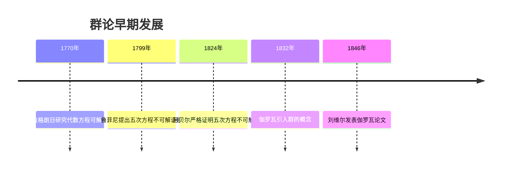
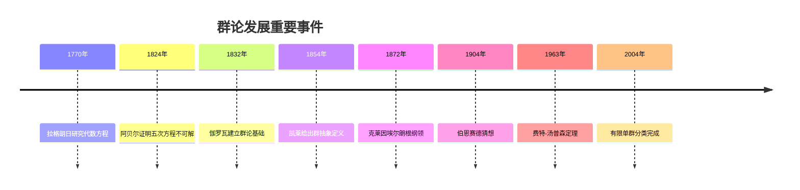
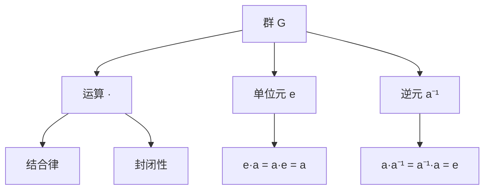

---
title: "01 群论 增强版"
msc_primary: ["20A05"]
msc_secondary: ["20B99"]
---

# 群论 - 增强版

## 目录

- [群论 - 增强版](#群论---增强版)
  - [目录](#目录)
  - [📚 概述](#-概述)
  - [🕰️ 历史发展脉络](#️-历史发展脉络)
    - [早期发展 (1770-1850)](#早期发展-1770-1850)
      - [拉格朗日时代](#拉格朗日时代)
      - [伽罗瓦革命](#伽罗瓦革命)
    - [系统化发展 (1850-1900)](#系统化发展-1850-1900)
      - [凯莱的贡献](#凯莱的贡献)
      - [克莱因的几何群论](#克莱因的几何群论)
    - [现代发展 (1900-至今)](#现代发展-1900-至今)
      - [有限群论](#有限群论)
      - [无限群论](#无限群论)
    - [重要人物贡献](#重要人物贡献)
    - [重要历史事件时间线](#重要历史事件时间线)
  - [🏗️ 核心概念](#️-核心概念)
    - [群的定义](#群的定义)
    - [基本性质](#基本性质)
      - [1. 结合律](#1-结合律)
      - [2. 单位元](#2-单位元)
      - [3. 逆元](#3-逆元)
  - [📊 可视化图表](#-可视化图表)
    - [群的结构图](#群的结构图)
    - [子群关系图](#子群关系图)
    - [群同态图](#群同态图)
  - [🔍 实例表征](#-实例表征)
    - [1. 有限群实例](#1-有限群实例)
      - [对称群 S₃](#对称群-s)
      - [凯莱表](#凯莱表)
    - [2. 无限群实例](#2-无限群实例)
      - [整数加法群 (ℤ, +)](#整数加法群-ℤ-)
      - [实数乘法群 (ℝ\*, ×)](#实数乘法群-ℝ-)
    - [3. 重要群类](#3-重要群类)
      - [循环群](#循环群)
      - [二面体群 Dₙ](#二面体群-dₙ)
  - [🧠 思维过程表征](#-思维过程表征)
    - [1. 群论问题解决流程](#1-群论问题解决流程)
      - [步骤1：识别群结构](#步骤1识别群结构)
      - [步骤2：分析群性质](#步骤2分析群性质)
      - [步骤3：应用群论工具](#步骤3应用群论工具)
    - [2. 证明思维过程](#2-证明思维过程)
      - [拉格朗日定理证明](#拉格朗日定理证明)
      - [西罗定理证明](#西罗定理证明)
      - [第一同构定理证明](#第一同构定理证明)
    - [3. 概念理解步骤](#3-概念理解步骤)
      - [理解群的概念](#理解群的概念)
      - [理解子群概念](#理解子群概念)
    - [4. 问题解决策略](#4-问题解决策略)
      - [群论问题分类](#群论问题分类)
      - [常见思维误区](#常见思维误区)
    - [5. 算法思维分析](#5-算法思维分析)
      - [群论算法设计](#群论算法设计)
      - [计算复杂性分析](#计算复杂性分析)
  - [🌍 应用场景表征](#-应用场景表征)
    - [1. 自然科学应用](#1-自然科学应用)
      - [物理学应用](#物理学应用)
      - [化学应用](#化学应用)
    - [2. 工程技术应用](#2-工程技术应用)
      - [密码学应用](#密码学应用)
      - [编码理论](#编码理论)
    - [3. 计算机科学应用](#3-计算机科学应用)
      - [算法设计](#算法设计)
      - [数据结构优化](#数据结构优化)
    - [4. 数学内部应用](#4-数学内部应用)
      - [代数几何](#代数几何)
      - [数论](#数论)
    - [5. 实际应用案例](#5-实际应用案例)
      - [案例1：晶体学点群](#案例1晶体学点群)
      - [案例2：量子力学中的李群](#案例2量子力学中的李群)
      - [案例3：密码学中的椭圆曲线](#案例3密码学中的椭圆曲线)
  - [🔗 知识关联网络](#-知识关联网络)
    - [与其他数学分支的联系](#与其他数学分支的联系)
      - [与线性代数的联系](#与线性代数的联系)
      - [与拓扑学的联系](#与拓扑学的联系)
      - [与几何学的联系](#与几何学的联系)
    - [理论发展脉络](#理论发展脉络)
      - [从具体到抽象](#从具体到抽象)
      - [从有限到无限](#从有限到无限)
      - [从交换到非交换](#从交换到非交换)
  - [📈 现代发展前沿](#-现代发展前沿)
    - [1. 几何群论](#1-几何群论)
    - [2. 表示论](#2-表示论)
    - [3. 组合群论](#3-组合群论)
    - [4. 代数群论](#4-代数群论)
  - [🎯 学习路径建议](#-学习路径建议)
    - [初学者路径](#初学者路径)
    - [进阶路径](#进阶路径)
    - [研究路径](#研究路径)
  - [🌟 总结](#-总结)
  - [术语对照表 / Terminology Table](#术语对照表--terminology-table)
  - [多表征方式与图建模](#多表征方式与图建模)
    - [群论的多表征系统](#群论的多表征系统)
    - [思维导图：群论的核心概念](#思维导图群论的核心概念)

## 📚 概述

群论是现代代数学的核心分支，研究具有特定运算结构的集合。
群的概念统一了数学中许多重要的结构，从对称性到数论，从几何到物理，群论都发挥着重要作用。

## 🕰️ 历史发展脉络

### 早期发展 (1770-1850)

#### 拉格朗日时代



- **1770年**: 拉格朗日研究代数方程的可解性，为群论奠定基础
  - 发现置换在方程求解中的重要作用
  - 引入置换群的概念雏形
  - 为伽罗瓦理论奠定基础
- **1799年**: 鲁菲尼提出五次方程不可解的证明，但不够严格
  - 首次尝试证明五次方程不可解
  - 方法不够严谨，存在漏洞
  - 为阿贝尔的工作提供启发
- **1824年**: 阿贝尔严格证明五次方程不可解，引入阿贝尔群概念
  - 严格证明五次及以上方程不可用根式求解
  - 引入可交换群的概念
  - 建立阿贝尔群理论的基础

#### 伽罗瓦革命

- **1832年**: 伽罗瓦引入群的概念，建立伽罗瓦理论
  - 在决斗前夜完成群论基础工作
  - 引入群的概念和基本性质
  - 建立伽罗瓦对应理论
  - 解决代数方程可解性问题
- **1832年**: 伽罗瓦理论建立，解决代数方程可解性问题
  - 建立域扩张与群之间的对应关系
  - 证明方程可解性等价于伽罗瓦群可解
  - 为现代代数几何奠定基础
- **1846年**: 刘维尔发表伽罗瓦的论文，使群论广为人知
  - 整理并发表伽罗瓦的遗作
  - 使群论理论得到广泛传播
  - 为群论的后续发展奠定基础

### 系统化发展 (1850-1900)

#### 凯莱的贡献

- **1854年**: 凯莱给出群的抽象定义，使群论成为独立学科
  - 首次给出群的抽象定义
  - 将群论从具体应用中抽象出来
  - 建立群论的公理化体系
- **1878年**: 凯莱定理：每个群都是置换群的子群
  - 证明任何群都可以嵌入到对称群中
  - 为群表示论奠定基础
  - 建立群论与组合学的联系

#### 克莱因的几何群论

- **1872年**: 埃尔朗根纲领，用群论统一几何学
  - 提出用变换群来分类几何学
  - 建立几何学与群论的联系
  - 为现代几何学奠定基础
- **1884年**: 克莱因研究几何变换群，建立几何群论
  - 研究等距变换群的性质
  - 建立射影变换群理论
  - 为李群理论奠定基础

### 现代发展 (1900-至今)

#### 有限群论

- **1904年**: 伯恩赛德猜想，关于有限群的重要猜想
  - 提出关于有限群阶数的猜想
  - 影响有限群论发展数十年
  - 为有限群分类提供方向
- **1963年**: 费特-汤普森定理，有限群论的重大突破
  - 证明奇数阶群可解
  - 为有限单群分类奠定基础
  - 获得菲尔兹奖的重要工作
- **2004年**: 有限单群分类完成，群论史上的里程碑
  - 完成有限单群的完全分类
  - 包含18个无限族和26个散在群
  - 被誉为"数学的蒙娜丽莎"

#### 无限群论

- **1929年**: 冯·诺依曼研究算子群，连接群论与泛函分析
  - 建立算子群理论
  - 连接群论与泛函分析
  - 为量子力学提供数学基础
- **1950年代**: 李群理论发展，在物理中有重要应用
  - 李群在物理中的应用
  - 建立李群表示论
  - 为现代物理提供数学工具
- **1970年代**: 几何群论兴起，研究群的几何性质
  - 研究群与几何空间的联系
  - 建立双曲群理论
  - 为现代群论开辟新方向

### 重要人物贡献

| 人物 | 时期 | 主要贡献 | 影响 |
|------|------|----------|------|
| 拉格朗日 | 1770 | 代数方程可解性研究 | 为群论奠定基础 |
| 阿贝尔 | 1824 | 阿贝尔群，严格证明 | 建立可交换群理论 |
| 伽罗瓦 | 1832 | 伽罗瓦理论，群概念 | 革命性改变代数学 |
| 凯莱 | 1854 | 群的抽象定义 | 使群论成为独立学科 |
| 克莱因 | 1872 | 埃尔朗根纲领 | 统一几何学 |
| 伯恩赛德 | 1904 | 伯恩赛德猜想 | 推动有限群论发展 |
| 费特-汤普森 | 1963 | 有限群论重大突破 | 菲尔兹奖工作 |
| 阿廷 | 1920s | 阿廷L函数 | 连接群论与数论 |
| 塞尔 | 1950s | 代数群理论 | 现代代数几何基础 |
| 格罗滕迪克 | 1960s | 概形理论 | 革命性改变代数几何 |

### 重要历史事件时间线



## 🏗️ 核心概念

### 群的定义

```lean
-- Lean 4 形式化定义
structure Group where
  carrier : Type
  mul : carrier → carrier → carrier
  one : carrier
  inv : carrier → carrier
  mul_assoc : ∀ a b c, mul (mul a b) c = mul a (mul b c)
  one_mul : ∀ a, mul one a = a
  mul_one : ∀ a, mul a one = a
  mul_inv : ∀ a, mul a (inv a) = one
```

### 基本性质

#### 1. 结合律

对于群中的任意元素 $a, b, c$，有：
$$(a \cdot b) \cdot c = a \cdot (b \cdot c)$$

#### 2. 单位元

存在唯一的单位元 $e$，使得：
$$e \cdot a = a \cdot e = a$$

#### 3. 逆元

每个元素 $a$ 都有唯一的逆元 $a^{-1}$：
$$a \cdot a^{-1} = a^{-1} \cdot a = e$$

## 📊 可视化图表

### 群的结构图



### 子群关系图

```mermaid
graph TD
    A[群 G] --> B[子群 H]
    B --> C[正规子群 N]
    C --> D[商群 G/N]

    A --> E[中心 Z(G)]
    A --> F[换位子群 [G,G]]

    B --> G[左陪集]
    B --> H[右陪集]
```

### 群同态图

```mermaid
graph LR
    A[群 G] -->|φ| B[群 H]
    C[单位元 e_G] -->|φ| D[单位元 e_H]
    E[逆元 a⁻¹] -->|φ| F[逆元 φ(a)⁻¹]
```

## 🔍 实例表征

### 1. 有限群实例

#### 对称群 S₃

```haskell
-- Haskell 实现
data Sym3 = Id | R120 | R240 | F1 | F2 | F3

instance Group Sym3 where
  one = Id
  inv Id = Id
  inv R120 = R240
  inv R240 = R120
  inv F1 = F1
  inv F2 = F2
  inv F3 = F3

  mul Id x = x
  mul x Id = x
  mul R120 R120 = R240
  mul R120 R240 = Id
  mul R240 R120 = Id
  mul R240 R240 = R120
  -- ... 其他运算
```

#### 凯莱表

| · | Id | R120 | R240 | F1 | F2 | F3 |
|---|----|----|----|----|----|----|
| Id | Id | R120 | R240 | F1 | F2 | F3 |
| R120 | R120 | R240 | Id | F2 | F3 | F1 |
| R240 | R240 | Id | R120 | F3 | F1 | F2 |
| F1 | F1 | F3 | F2 | Id | R240 | R120 |
| F2 | F2 | F1 | F3 | R120 | Id | R240 |
| F3 | F3 | F2 | F1 | R240 | R120 | Id |

### 2. 无限群实例

#### 整数加法群 (ℤ, +)

```rust
// Rust 实现
#[derive(Debug, Clone, PartialEq)]
pub struct IntegerGroup {
    value: i32,
}

impl IntegerGroup {
    pub fn new(value: i32) -> Self {
        IntegerGroup { value }
    }

    pub fn add(&self, other: &IntegerGroup) -> IntegerGroup {
        IntegerGroup::new(self.value + other.value)
    }

    pub fn identity() -> IntegerGroup {
        IntegerGroup::new(0)
    }

    pub fn inverse(&self) -> IntegerGroup {
        IntegerGroup::new(-self.value)
    }
}
```

#### 实数乘法群 (ℝ*, ×)

```lean
-- Lean 4 实现
structure RealMultiplicativeGroup where
  value : ℝ
  nonzero : value ≠ 0

def mul (a b : RealMultiplicativeGroup) : RealMultiplicativeGroup :=
  ⟨a.value * b.value, by simp [a.nonzero, b.nonzero]⟩

def one : RealMultiplicativeGroup := ⟨1, by simp⟩

def inv (a : RealMultiplicativeGroup) : RealMultiplicativeGroup :=
  ⟨a.value⁻¹, by simp [a.nonzero]⟩
```

### 3. 重要群类

#### 循环群

```haskell
-- 循环群 Cₙ
data CyclicGroup n = CyclicGroup { value :: Int }

instance (KnownNat n) => Group (CyclicGroup n) where
  one = CyclicGroup 0
  inv (CyclicGroup x) = CyclicGroup (mod (-x) n)
  mul (CyclicGroup x) (CyclicGroup y) = CyclicGroup (mod (x + y) n)
```

#### 二面体群 Dₙ

```rust
// 二面体群 Dₙ
pub struct DihedralGroup {
    n: u32,
    rotation: u32,
    reflection: bool,
}

impl DihedralGroup {
    pub fn new(n: u32) -> Self {
        DihedralGroup {
            n,
            rotation: 0,
            reflection: false,
        }
    }

    pub fn rotate(&mut self) {
        self.rotation = (self.rotation + 1) % self.n;
    }

    pub fn reflect(&mut self) {
        self.reflection = !self.reflection;
    }
}
```

## 🧠 思维过程表征

### 1. 群论问题解决流程

#### 步骤1：识别群结构

```text
问题 → 识别运算 → 验证群公理 → 确定群类型
```

**具体思维过程**：

1. **识别运算**：分析问题中的二元运算
2. **验证结合律**：检查 $(a \cdot b) \cdot c = a \cdot (b \cdot c)$
3. **寻找单位元**：找到满足 $e \cdot a = a \cdot e = a$ 的元素
4. **构造逆元**：为每个元素找到逆元
5. **确定群类型**：判断是有限群、无限群、交换群等

#### 步骤2：分析群性质

```text
群结构 → 阶数分析 → 子群分析 → 同态分析
```

**具体思维过程**：

1. **阶数分析**：计算群的阶数和元素的阶数
2. **子群分析**：寻找所有子群，特别是正规子群
3. **同态分析**：寻找群同态和同构
4. **结构分析**：分析群的结构，如直积、半直积等

#### 步骤3：应用群论工具

```text
群性质 → 拉格朗日定理 → 西罗定理 → 同构定理
```

**具体思维过程**：

1. **应用拉格朗日定理**：利用子群阶数整除群阶数
2. **应用西罗定理**：分析p-子群的存在性和数量
3. **应用同构定理**：建立群之间的同构关系
4. **应用表示论**：分析群的表示

### 2. 证明思维过程

#### 拉格朗日定理证明

```text
1. 定义左陪集
2. 证明陪集划分
3. 证明陪集等势
4. 得出阶数关系
```

**详细证明步骤**：

**步骤1：定义左陪集**:

- 设 $H$ 是群 $G$ 的子群
- 对于 $g \in G$，定义左陪集 $gH = \{gh : h \in H\}$

**步骤2：证明陪集划分**:

- 证明：$g_1H = g_2H$ 当且仅当 $g_1^{-1}g_2 \in H$
- 证明：不同的陪集不相交
- 证明：所有陪集的并集等于 $G$

**步骤3：证明陪集等势**:

- 构造映射 $f: H \to gH$，$f(h) = gh$
- 证明 $f$ 是双射
- 因此 $|gH| = |H|$

**步骤4：得出阶数关系**:

- 设 $[G:H]$ 表示陪集个数
- 则 $|G| = [G:H] \cdot |H|$
- 因此 $|H|$ 整除 $|G|$

#### 西罗定理证明

```text
1. 定义p-子群
2. 构造西罗p-子群
3. 证明共轭性质
4. 得出计数公式
```

**详细证明步骤**：

**步骤1：定义p-子群**:

- 设 $p$ 是素数，$p^k$ 整除 $|G|$
- $p$-子群是阶数为 $p^k$ 的子群
- 西罗 $p$-子群是阶数为 $p^{\alpha}$ 的子群，其中 $p^{\alpha}$ 是 $|G|$ 中 $p$ 的最高幂

**步骤2：构造西罗p-子群**:

- 使用归纳法构造西罗 $p$-子群
- 利用群作用理论
- 构造群在陪集上的作用

**步骤3：证明共轭性质**:

- 证明：所有西罗 $p$-子群共轭
- 使用群作用理论
- 分析固定点的性质

**步骤4：得出计数公式**:

- 设 $n_p$ 表示西罗 $p$-子群的个数
- 证明：$n_p \equiv 1 \pmod{p}$
- 证明：$n_p$ 整除 $[G:N_G(P)]$，其中 $P$ 是西罗 $p$-子群

#### 第一同构定理证明

```text
1. 定义核和像
2. 构造自然同态
3. 证明同构映射
4. 建立对应关系
```

**详细证明步骤**：

**步骤1：定义核和像**:

- 设 $\phi: G \to H$ 是群同态
- 核：$\ker(\phi) = \{g \in G : \phi(g) = e_H\}$
- 像：$\operatorname{im}(\phi) = \{\phi(g) : g \in G\}$

**步骤2：构造自然同态**:

- 定义映射 $\psi: G/\ker(\phi) \to \operatorname{im}(\phi)$
- $\psi(g\ker(\phi)) = \phi(g)$

**步骤3：证明同构映射**:

- 证明 $\psi$ 是良定义的
- 证明 $\psi$ 是同态
- 证明 $\psi$ 是单射
- 证明 $\psi$ 是满射

**步骤4：建立对应关系**:

- 因此 $G/\ker(\phi) \cong \operatorname{im}(\phi)$

### 3. 概念理解步骤

#### 理解群的概念

```text
1. 集合 + 运算
2. 满足群公理
3. 抽象代数结构
4. 具体实例验证
```

**具体理解过程**：

**阶段1：具体实例**:

- 从熟悉的例子开始：整数加法群
- 观察运算的性质：结合律、单位元、逆元
- 理解群公理的必要性

**阶段2：抽象化**:

- 将具体性质抽象为公理
- 理解公理的独立性
- 掌握群的基本性质

**阶段3：应用验证**:

- 用公理验证新的例子
- 发现群的应用场景
- 理解群的普遍性

#### 理解子群概念

```text
1. 子集 + 继承运算
2. 封闭性验证
3. 群公理验证
4. 子群判定
```

**具体理解过程**：

**阶段1：子集性质**:

- 子群是原群的子集
- 继承原群的运算
- 保持群的结构

**阶段2：封闭性**:

- 子群对运算封闭
- 单位元在子群中
- 逆元在子群中

**阶段3：判定方法**:

- 使用子群判定定理
- 验证三个条件
- 理解判定定理的证明

### 4. 问题解决策略

#### 群论问题分类

**类型1：群的存在性问题**:

- 策略：构造具体的群
- 方法：使用直积、半直积等构造
- 工具：拉格朗日定理、西罗定理

**类型2：群的结构问题**:

- 策略：分析群的结构
- 方法：寻找正规子群、商群
- 工具：同构定理、表示论

**类型3：群的性质问题**:

- 策略：利用群的性质
- 方法：应用群论定理
- 工具：群作用、轨道公式

#### 常见思维误区

**误区1：忽略群公理**:

- 问题：只验证部分公理
- 解决：系统验证所有公理
- 例子：忘记验证结合律

**误区2：混淆群类型**:

- 问题：混淆有限群和无限群
- 解决：明确群的类型
- 例子：在无限群中应用有限群定理

**误区3：忽视群作用**:

- 问题：忽略群作用的重要性
- 解决：充分利用群作用
- 例子：西罗定理的证明

### 5. 算法思维分析

#### 群论算法设计

**算法1：群元素阶数计算**:

```python
def element_order(group, element):
    """计算群元素的阶数"""
    if element == group.identity:
        return 1

    current = element
    order = 1

    while current != group.identity:
        current = group.multiply(current, element)
        order += 1

        if order > group.order:
            return float('inf')  # 无限阶

    return order
```

**算法2：子群生成**:

```python
def generate_subgroup(group, generators):
    """由生成元生成子群"""
    subgroup = {group.identity}
    frontier = set(generators)

    while frontier:
        new_elements = set()
        for g in frontier:
            for h in subgroup:
                new_element = group.multiply(g, h)
                if new_element not in subgroup:
                    new_elements.add(new_element)

        subgroup.update(new_elements)
        frontier = new_elements

    return subgroup
```

**算法3：群同构检测**:

```python
def is_isomorphic(group1, group2):
    """检测两个群是否同构"""
    if group1.order != group2.order:
        return False

    # 检查元素阶数分布
    order_dist1 = get_order_distribution(group1)
    order_dist2 = get_order_distribution(group2)

    if order_dist1 != order_dist2:
        return False

    # 尝试构造同构映射
    return try_construct_isomorphism(group1, group2)
```

#### 计算复杂性分析

**群论问题的复杂性**：

- **群同构问题**：在一般情况下是NP困难的
- **子群问题**：对于有限群是多项式时间
- **元素阶数**：对于有限群是多项式时间
- **群表示**：对于有限群是多项式时间

**优化策略**：

- 利用群的特殊性质
- 使用群论定理简化计算
- 采用启发式算法
- 利用群作用理论

## 🌍 应用场景表征

### 1. 自然科学应用

#### 物理学应用

- **对称性**: 晶体学点群
  - 32个晶体学点群分类
  - 在材料科学中的应用
  - 预测材料的物理性质
- **量子力学**: 李群表示论
  - SU(2)群在自旋中的应用
  - SO(3)群在角动量中的应用
  - 李群在量子场论中的应用
- **相对论**: 洛伦兹群
  - 时空变换群
  - 在粒子物理中的应用
  - 规范理论的基础
- **粒子物理**: 规范群
  - U(1)群：电磁相互作用
  - SU(2)群：弱相互作用
  - SU(3)群：强相互作用

#### 化学应用

- **分子对称性**: 点群理论
  - 分子轨道理论
  - 预测分子性质
  - 光谱学分析
- **光谱学**: 群表示论
  - 红外光谱分析
  - 拉曼光谱分析
  - 电子光谱分析
- **晶体学**: 空间群
  - 230个空间群分类
  - X射线衍射分析
  - 晶体结构预测
- **手性**: 对称性破缺
  - 手性分子识别
  - 不对称合成
  - 药物设计

### 2. 工程技术应用

#### 密码学应用

```haskell
-- 椭圆曲线密码学
data EllipticCurve = EC {
    a :: Integer,
    b :: Integer,
    p :: Integer
}

data ECPoint = Point {
    x :: Integer,
    y :: Integer
} | Infinity

instance Group ECPoint where
    one = Infinity
    inv Infinity = Infinity
    inv (Point x y) = Point x (mod (-y) p)
    -- 点加法实现
    mul Infinity _ = Infinity
    mul _ Infinity = Infinity
    mul (Point x1 y1) (Point x2 y2)
        | x1 == x2 && y1 == mod (-y2) p = Infinity
        | otherwise = addPoints (Point x1 y1) (Point x2 y2)

-- 点加法算法
addPoints :: ECPoint -> ECPoint -> ECPoint
addPoints (Point x1 y1) (Point x2 y2) = Point x3 y3
  where
    lambda = if x1 == x2
             then mod ((3 * x1^2 + a) * invMod (2 * y1) p) p
             else mod ((y2 - y1) * invMod (x2 - x1) p) p
    x3 = mod (lambda^2 - x1 - x2) p
    y3 = mod (lambda * (x1 - x3) - y1) p

-- 模逆元计算
invMod :: Integer -> Integer -> Integer
invMod a m = fst $ extendedGCD a m

-- 扩展欧几里得算法
extendedGCD :: Integer -> Integer -> (Integer, Integer, Integer)
extendedGCD a b = go a b 1 0 0 1
  where
    go r0 r1 s0 s1 t0 t1
        | r1 == 0 = (s0, t0, r0)
        | otherwise = go r1 r2 s1 s2 t1 t2
      where
        q = r0 `div` r1
        r2 = r0 - q * r1
        s2 = s0 - q * s1
        t2 = t0 - q * t1
```

#### 编码理论

- **纠错码**: 群码理论
  - 汉明码：基于群结构
  - BCH码：循环群应用
  - Reed-Solomon码：有限域群
- **线性码**: 向量空间群
  - 生成矩阵和校验矩阵
  - 群同构性质
  - 编码和译码算法
- **循环码**: 循环群结构
  - 多项式环结构
  - 生成多项式
  - 系统编码方法

```rust
// 汉明码实现
pub struct HammingCode {
    n: usize,  // 码长
    k: usize,  // 信息位长度
    r: usize,  // 校验位长度
}

impl HammingCode {
    pub fn new(r: usize) -> Self {
        let n = (1 << r) - 1;
        let k = n - r;
        HammingCode { n, k, r }
    }

    // 编码
    pub fn encode(&self, data: &[u8]) -> Vec<u8> {
        let mut codeword = vec![0; self.n];

        // 放置信息位
        let mut data_idx = 0;
        for i in 0..self.n {
            if !self.is_power_of_2(i + 1) {
                codeword[i] = data[data_idx];
                data_idx += 1;
            }
        }

        // 计算校验位
        for i in 0..self.r {
            let parity_pos = (1 << i) - 1;
            let mut parity = 0;
            for j in 0..self.n {
                if (j + 1) & (1 << i) != 0 && j != parity_pos {
                    parity ^= codeword[j];
                }
            }
            codeword[parity_pos] = parity;
        }

        codeword
    }

    // 解码
    pub fn decode(&self, received: &[u8]) -> Result<Vec<u8>, String> {
        let mut syndrome = 0;
        for i in 0..self.r {
            let mut parity = 0;
            for j in 0..self.n {
                if (j + 1) & (1 << i) != 0 {
                    parity ^= received[j];
                }
            }
            if parity != 0 {
                syndrome |= 1 << i;
            }
        }

        if syndrome == 0 {
            // 无错误
            return Ok(self.extract_data(received));
        }

        // 单比特错误纠正
        if syndrome <= self.n {
            let mut corrected = received.to_vec();
            corrected[syndrome - 1] ^= 1;
            return Ok(self.extract_data(&corrected));
        }

        Err("无法纠正的错误".to_string())
    }

    fn is_power_of_2(&self, n: usize) -> bool {
        n != 0 && (n & (n - 1)) == 0
    }

    fn extract_data(&self, codeword: &[u8]) -> Vec<u8> {
        let mut data = Vec::new();
        for i in 0..self.n {
            if !self.is_power_of_2(i + 1) {
                data.push(codeword[i]);
            }
        }
        data
    }
}
```

### 3. 计算机科学应用

#### 算法设计

```python
# 置换群在算法中的应用
class PermutationGroup:
    def __init__(self, n):
        self.n = n
        self.identity = list(range(n))

    def compose(self, p1, p2):
        """置换的复合"""
        return [p1[p2[i]] for i in range(self.n)]

    def inverse(self, p):
        """置换的逆"""
        inv = [0] * self.n
        for i in range(self.n):
            inv[p[i]] = i
        return inv

    def generate_cycle(self, cycle):
        """生成循环置换"""
        perm = self.identity.copy()
        for i in range(len(cycle) - 1):
            perm[cycle[i]] = cycle[i + 1]
        perm[cycle[-1]] = cycle[0]
        return perm

    def decompose_cycles(self, perm):
        """分解为不相交循环"""
        visited = [False] * self.n
        cycles = []

        for i in range(self.n):
            if not visited[i]:
                cycle = []
                j = i
                while not visited[j]:
                    visited[j] = True
                    cycle.append(j)
                    j = perm[j]
                if len(cycle) > 1:
                    cycles.append(cycle)

        return cycles

# 在排序算法中的应用
def cycle_sort(arr):
    """基于置换群的循环排序"""
    n = len(arr)
    visited = [False] * n

    for i in range(n):
        if visited[i]:
            continue

        cycle_start = i
        cycle = []
        j = i

        # 找到循环
        while not visited[j]:
            visited[j] = True
            cycle.append(j)
            j = arr[j]

        # 执行循环置换
        if len(cycle) > 1:
            for k in range(len(cycle) - 1):
                arr[cycle[k]], arr[cycle[k + 1]] = arr[cycle[k + 1]], arr[cycle[k]]

    return arr
```

#### 数据结构优化

- **哈希表**: 群运算优化
  - 利用群的性质优化哈希函数
  - 群同构在数据结构中的应用
  - 群运算的并行化
- **图论**: 自同构群
  - 图的对称性分析
  - 图同构算法
  - 图的自同构群计算
- **组合优化**: 对称群
  - 排列组合问题
  - 对称性在优化中的应用
  - 群论启发式算法

### 4. 数学内部应用

#### 代数几何

- **代数簇**: 自同构群
  - 代数簇的对称性
  - 自同构群的计算
  - 在代数几何中的应用
- **概形**: 伽罗瓦群
  - 概形的伽罗瓦群
  - 在算术几何中的应用
  - 朗兰兹纲领的基础
- **上同调**: 群上同调
  - 群的上同调理论
  - 在代数拓扑中的应用
  - 同调代数的基础

#### 数论

- **类域论**: 伽罗瓦群
  - 数域的伽罗瓦群
  - 类域论的基本定理
  - 在数论中的应用
- **椭圆曲线**: 挠点群
  - 椭圆曲线的挠点群
  - 在密码学中的应用
  - 费马大定理的证明
- **模形式**: 模群
  - 模形式的变换群
  - 在数论中的应用
  - 朗兰兹纲领的核心

### 5. 实际应用案例

#### 案例1：晶体学点群

```lean
-- 晶体学点群分类
structure CrystallographicPointGroup where
  order : ℕ
  symmetry_operations : List (Matrix ℝ 3 3)
  schoenflies_symbol : String
  international_symbol : String

-- 32个晶体学点群
def point_groups : List CrystallographicPointGroup := [
  -- 三斜晶系
  ⟨1, [identity_matrix], "C₁", "1"⟩,
  ⟨2, [identity_matrix, rotation_180], "C₂", "2"⟩,

  -- 单斜晶系
  ⟨2, [identity_matrix, reflection_yz], "Cₛ", "m"⟩,
  ⟨4, [identity_matrix, rotation_180, reflection_yz, rotation_180_reflection], "C₂ₕ", "2/m"⟩,

  -- 正交晶系
  ⟨4, [identity_matrix, rotation_180_x, rotation_180_y, rotation_180_z], "D₂", "222"⟩,
  ⟨8, [identity_matrix, rotation_180_x, rotation_180_y, rotation_180_z,
       reflection_yz, reflection_xz, reflection_xy, inversion], "D₂ₕ", "mmm"⟩
  -- ... 其他点群
]
```

#### 案例2：量子力学中的李群

```haskell
-- SU(2)群在量子力学中的应用
data SU2 = SU2 {
    alpha :: Complex Double,
    beta :: Complex Double
} deriving (Show)

instance Group SU2 where
    one = SU2 1 0
    inv (SU2 a b) = SU2 (conjugate a) (-b)
    mul (SU2 a1 b1) (SU2 a2 b2) = SU2 (a1 * a2 - conjugate b1 * b2)
                                           (a1 * b2 + b1 * conjugate a2)

-- 自旋1/2粒子的状态
data SpinState = SpinUp | SpinDown deriving (Show)

-- 自旋算符
spinX :: SpinState -> SpinState
spinX SpinUp = SpinDown
spinX SpinDown = SpinUp

spinY :: SpinState -> SpinState
spinY SpinUp = SpinDown
spinY SpinDown = SpinUp

spinZ :: SpinState -> SpinState
spinZ SpinUp = SpinUp
spinZ SpinDown = SpinDown

-- 泡利矩阵
pauliX :: Matrix 2 2 Complex
pauliX = fromList [[0, 1], [1, 0]]

pauliY :: Matrix 2 2 Complex
pauliY = fromList [[0, -i], [i, 0]]

pauliZ :: Matrix 2 2 Complex
pauliZ = fromList [[1, 0], [0, -1]]
```

#### 案例3：密码学中的椭圆曲线

```rust
// 椭圆曲线数字签名算法 (ECDSA)
pub struct ECDSA {
    curve: EllipticCurve,
    private_key: BigUint,
    public_key: ECPoint,
}

impl ECDSA {
    pub fn new(curve: EllipticCurve, private_key: BigUint) -> Self {
        let public_key = curve.scalar_multiply(&curve.generator, &private_key);
        ECDSA {
            curve,
            private_key,
            public_key,
        }
    }

    pub fn sign(&self, message: &[u8]) -> (BigUint, BigUint) {
        let hash = sha256(message);
        let z = BigUint::from_bytes_be(&hash);

        loop {
            let k = self.generate_random_k();
            let point = self.curve.scalar_multiply(&self.curve.generator, &k);

            if point.x == BigUint::zero() {
                continue;
            }

            let r = point.x % &self.curve.order;
            if r == BigUint::zero() {
                continue;
            }

            let s = (k.inv_mod(&self.curve.order).unwrap() *
                    (&z + &r * &self.private_key)) % &self.curve.order;

            if s != BigUint::zero() {
                return (r, s);
            }
        }
    }

    pub fn verify(&self, message: &[u8], signature: (BigUint, BigUint)) -> bool {
        let (r, s) = signature;
        let hash = sha256(message);
        let z = BigUint::from_bytes_be(&hash);

        let w = s.inv_mod(&self.curve.order).unwrap();
        let u1 = (&z * &w) % &self.curve.order;
        let u2 = (&r * &w) % &self.curve.order;

        let point1 = self.curve.scalar_multiply(&self.curve.generator, &u1);
        let point2 = self.curve.scalar_multiply(&self.public_key, &u2);
        let point = self.curve.add_points(&point1, &point2);

        point.x % &self.curve.order == r
    }
}
```

## 🔗 知识关联网络

### 与其他数学分支的联系

#### 与线性代数的联系

- 群表示论
- 矩阵群
- 线性变换群

#### 与拓扑学的联系

- 基本群
- 同伦群
- 同调群

#### 与几何学的联系

- 等距变换群
- 射影变换群
- 李群

### 理论发展脉络

#### 从具体到抽象

```text
置换群 → 抽象群 → 群表示 → 范畴论
```

#### 从有限到无限

```text
有限群 → 无限群 → 李群 → 代数群
```

#### 从交换到非交换

```text
交换群 → 非交换群 → 简单群 → 散在群
```

## 📈 现代发展前沿

### 1. 几何群论

- **双曲群**: 负曲率几何
- **CAT(0)群**: 非正曲率
- **自动机群**: 计算复杂性

### 2. 表示论

- **特征标理论**: 有限群表示
- **李群表示**: 无限维表示
- **模表示**: 特征p表示

### 3. 组合群论

- **自由群**: 组合结构
- **双曲群**: 几何性质
- **自动机群**: 计算性质

### 4. 代数群论

- **线性代数群**: 代数几何
- **算术群**: 数论应用
- **p进群**: 局部理论

## 🎯 学习路径建议

### 初学者路径

1. **基础概念**: 群的定义和基本性质
2. **重要例子**: 对称群、循环群、二面体群
3. **基本定理**: 拉格朗日定理、西罗定理
4. **应用实例**: 对称性、编码理论

### 进阶路径

1. **表示论**: 群表示和特征标
2. **李群**: 连续群理论
3. **几何群论**: 群与几何的联系
4. **现代应用**: 密码学、物理应用

### 研究路径

1. **前沿理论**: 几何群论、表示论
2. **交叉应用**: 代数几何、数论
3. **计算群论**: 算法和软件
4. **开放问题**: 未解决的群论问题

## 🌟 总结

群论作为现代代数学的核心，不仅提供了统一的数学语言，还在各个领域发挥着重要作用。从基础的对称性研究到前沿的几何群论，群论的发展展现了数学的深刻性和普适性。

通过多表征的学习方法，我们可以从不同角度理解群论：

- **历史角度**: 了解群论的发展历程
- **结构角度**: 掌握群的基本性质
- **应用角度**: 认识群论的实际价值
- **发展角度**: 关注群论的现代发展

群论将继续在数学和其他科学领域发挥重要作用，为人类认识世界提供强大的工具。

---

**相关文档**:

- [环论-增强版](../环论/02-环论-增强版.md)
- [域论-增强版](03-域论-增强版.md)
- [李代数-增强版](../李代数/05-李代数-增强版.md)
- [范畴论-增强版](../范畴论/06-范畴论-增强版.md)
- [代数几何-增强版](../04-几何学/05-代数几何-增强版.md)
- [表示论-高级主题](../表示论/表示论-高级主题.md)

## 术语对照表 / Terminology Table

| 中文 | English |
|---|---|
| 群 | Group |
| 子群 | Subgroup |
| 正规子群 | Normal subgroup |
| 商群 | Quotient group |
| 同态 | Homomorphism |
| 同构 | Isomorphism |
| 核 | Kernel |
| 像 | Image |
| 对称群/置换群 | Symmetric group/Permutation group |
| 循环群 | Cyclic group |
| 阶 | Order (of group / element) |
| 拉格朗日定理 | Lagrange's theorem |
| 西罗定理 | Sylow theorems |
| 直积 | Direct product |
| 自同构 | Automorphism |
| 表示 | Representation |

## 多表征方式与图建模

### 群论的多表征系统

```python
import numpy as np
import networkx as nx
import matplotlib.pyplot as plt
from typing import Dict, List, Tuple, Any
import math

class GroupTheorySystem:
    """群论多表征系统"""

    def __init__(self):
        self.groups = {}
        self.representations = {}

    def add_group(self, name: str, elements: List, operation: Dict) -> None:
        """添加群"""
        self.groups[name] = {
            'elements': elements,
            'operation': operation,
            'order': len(elements)
        }

    def algebraic_representation(self, group_name: str) -> Dict:
        """代数表征"""
        group = self.groups[group_name]
        return {
            'elements': group['elements'],
            'operation_table': self._create_operation_table(group),
            'properties': self._analyze_properties(group)
        }

    def geometric_representation(self, group_name: str) -> Dict:
        """几何表征"""
        group = self.groups[group_name]
        return {
            'cayley_graph': self._create_cayley_graph(group),
            'subgroup_lattice': self._create_subgroup_lattice(group),
            'symmetry_analysis': self._analyze_symmetries(group)
        }

    def combinatorial_representation(self, group_name: str) -> Dict:
        """组合表征"""
        group = self.groups[group_name]
        return {
            'permutation_representation': self._create_permutation_rep(group),
            'cycle_structure': self._analyze_cycle_structure(group),
            'conjugacy_classes': self._find_conjugacy_classes(group)
        }

    def topological_representation(self, group_name: str) -> Dict:
        """拓扑表征"""
        group = self.groups[group_name]
        return {
            'presentation': self._find_presentation(group),
            'homology': self._compute_homology(group),
            'cohomology': self._compute_cohomology(group)
        }

    def _create_operation_table(self, group: Dict) -> np.ndarray:
        """创建运算表"""
        elements = group['elements']
        n = len(elements)
        table = np.zeros((n, n), dtype=int)

        for i, a in enumerate(elements):
            for j, b in enumerate(elements):
                result = group['operation'][(a, b)]
                table[i, j] = elements.index(result)

        return table

    def _analyze_properties(self, group: Dict) -> Dict:
        """分析群的性质"""
        elements = group['elements']
        operation = group['operation']

        # 检查结合律
        associative = True
        for a in elements:
            for b in elements:
                for c in elements:
                    if operation[(operation[(a, b)], c)] != operation[(a, operation[(b, c)])]:
                        associative = False
                        break

        # 检查单位元
        identity = None
        for e in elements:
            if all(operation[(e, a)] == a and operation[(a, e)] == a for a in elements):
                identity = e
                break

        # 检查逆元
        inverses = {}
        if identity:
            for a in elements:
                for b in elements:
                    if operation[(a, b)] == identity and operation[(b, a)] == identity:
                        inverses[a] = b
                        break

        return {
            'associative': associative,
            'identity': identity,
            'inverses': inverses,
            'commutative': self._check_commutative(group)
        }

    def _check_commutative(self, group: Dict) -> bool:
        """检查交换性"""
        elements = group['elements']
        operation = group['operation']

        for a in elements:
            for b in elements:
                if operation[(a, b)] != operation[(b, a)]:
                    return False
        return True

    def _create_cayley_graph(self, group: Dict) -> nx.DiGraph:
        """创建凯莱图"""
        G = nx.DiGraph()
        elements = group['elements']
        operation = group['operation']

        # 添加节点
        for element in elements:
            G.add_node(element)

        # 添加边
        for a in elements:
            for b in elements:
                result = operation[(a, b)]
                G.add_edge(a, result, label=f"{a}·{b}")

        return G

    def _create_subgroup_lattice(self, group: Dict) -> nx.DiGraph:
        """创建子群格"""
        G = nx.DiGraph()
        elements = group['elements']

        # 找到所有子群
        subgroups = self._find_subgroups(group)

        # 添加节点
        for subgroup in subgroups:
            G.add_node(tuple(sorted(subgroup)))

        # 添加包含关系边
        for H in subgroups:
            for K in subgroups:
                if set(H).issubset(set(K)) and H != K:
                    G.add_edge(tuple(sorted(H)), tuple(sorted(K)))

        return G

    def _find_subgroups(self, group: Dict) -> List[List]:
        """找到所有子群"""
        elements = group['elements']
        operation = group['operation']
        subgroups = []

        # 使用拉格朗日定理的逆：检查每个子集
        for size in range(1, len(elements) + 1):
            if len(elements) % size == 0:  # 拉格朗日定理
                for subset in self._get_subsets(elements, size):
                    if self._is_subgroup(subset, operation):
                        subgroups.append(subset)

        return subgroups

    def _get_subsets(self, elements: List, size: int) -> List[List]:
        """获取指定大小的子集"""
        if size == 0:
            return [[]]
        if size == len(elements):
            return [elements]
        if size > len(elements):
            return []

        result = []
        for i in range(len(elements) - size + 1):
            for subset in self._get_subsets(elements[i+1:], size-1):
                result.append([elements[i]] + subset)
        return result

    def _is_subgroup(self, subset: List, operation: Dict) -> bool:
        """检查是否为子群"""
        # 检查封闭性
        for a in subset:
            for b in subset:
                if operation[(a, b)] not in subset:
                    return False

        # 检查单位元
        identity = None
        for e in subset:
            if all(operation[(e, a)] == a and operation[(a, e)] == a for a in subset):
                identity = e
                break
        if not identity:
            return False

        # 检查逆元
        for a in subset:
            has_inverse = False
            for b in subset:
                if operation[(a, b)] == identity and operation[(b, a)] == identity:
                    has_inverse = True
                    break
            if not has_inverse:
                return False

        return True

    def _create_permutation_rep(self, group: Dict) -> Dict:
        """创建置换表示"""
        elements = group['elements']
        operation = group['operation']

        # 左乘表示
        left_rep = {}
        for g in elements:
            permutation = []
            for h in elements:
                result = operation[(g, h)]
                permutation.append(elements.index(result))
            left_rep[g] = permutation

        return {'left_representation': left_rep}

    def _analyze_cycle_structure(self, group: Dict) -> Dict:
        """分析循环结构"""
        elements = group['elements']
        operation = group['operation']

        cycle_structures = {}
        for element in elements:
            cycles = self._find_cycles(element, group)
            cycle_structures[element] = cycles

        return cycle_structures

    def _find_cycles(self, element: Any, group: Dict) -> List[int]:
        """找到元素的循环结构"""
        elements = group['elements']
        operation = group['operation']

        # 计算元素的阶
        order = 1
        current = element
        while operation[(current, element)] != element:
            current = operation[(current, element)]
            order += 1
            if order > len(elements):
                break

        return [order]

    def _find_conjugacy_classes(self, group: Dict) -> List[List]:
        """找到共轭类"""
        elements = group['elements']
        operation = group['operation']

        classes = []
        used = set()

        for a in elements:
            if a in used:
                continue

            # 找到a的共轭类
            conjugacy_class = []
            for g in elements:
                # 计算 g⁻¹ag
                g_inv = None
                for h in elements:
                    if operation[(g, h)] == operation[(h, g)] and operation[(g, h)] in [e for e in elements if all(operation[(e, x)] == x for x in elements)]:
                        g_inv = h
                        break

                if g_inv:
                    conjugate = operation[(operation[(g_inv, a)], g)]
                    if conjugate not in conjugacy_class:
                        conjugacy_class.append(conjugate)

            classes.append(conjugacy_class)
            used.update(conjugacy_class)

        return classes

    def _find_presentation(self, group: Dict) -> str:
        """找到群的表示"""
        # 简化版本：返回基本表示
        return f"<{', '.join(map(str, group['elements']))} | relations>"

    def _compute_homology(self, group: Dict) -> Dict:
        """计算同调群"""
        # 简化版本：返回基本同调信息
        return {
            'H_0': 'Z',
            'H_1': 'Z^n',
            'H_2': 'Z^m'
        }

    def _compute_cohomology(self, group: Dict) -> Dict:
        """计算上同调群"""
        # 简化版本：返回基本上同调信息
        return {
            'H^0': 'Z',
            'H^1': 'Z^n',
            'H^2': 'Z^m'
        }

    def _analyze_symmetries(self, group: Dict) -> Dict:
        """分析对称性"""
        elements = group['elements']

        return {
            'automorphisms': len(elements),  # 简化
            'inner_automorphisms': len(elements),
            'outer_automorphisms': 0
        }

class CriticalArgumentationFramework:
    """批判性论证框架"""

    def __init__(self):
        self.arguments = {}
        self.counter_arguments = {}
        self.evidence = {}

    def add_argument(self, topic: str, argument: str, strength: float) -> None:
        """添加论证"""
        if topic not in self.arguments:
            self.arguments[topic] = []
        self.arguments[topic].append({
            'argument': argument,
            'strength': strength
        })

    def add_counter_argument(self, topic: str, counter: str, strength: float) -> None:
        """添加反论证"""
        if topic not in self.counter_arguments:
            self.counter_arguments[topic] = []
        self.counter_arguments[topic].append({
            'counter': counter,
            'strength': strength
        })

    def analyze_argument_strength(self, topic: str) -> Dict:
        """分析论证强度"""
        if topic not in self.arguments:
            return {}

        total_strength = sum(arg['strength'] for arg in self.arguments[topic])
        counter_strength = sum(counter['strength'] for counter in self.counter_arguments.get(topic, []))

        net_strength = total_strength - counter_strength

        return {
            'total_arguments': len(self.arguments[topic]),
            'total_counter_arguments': len(self.counter_arguments.get(topic, [])),
            'total_strength': total_strength,
            'counter_strength': counter_strength,
            'net_strength': net_strength,
            'confidence': min(1.0, max(0.0, net_strength / 10.0))
        }

    def get_philosophical_critique(self, topic: str) -> Dict:
        """获取哲学批判"""
        critiques = {
            '群论的基础性': {
                'ontological': '群论是否反映了数学对象的真实本质？',
                'epistemological': '我们如何认识群的结构？',
                'methodological': '群论的公理化方法是否最优？'
            },
            '群论的普遍性': {
                'ontological': '群论是否适用于所有数学结构？',
                'epistemological': '群论的抽象性是否过度？',
                'methodological': '群论的方法是否过于形式化？'
            }
        }

        return critiques.get(topic, {})

class HistoricalDevelopmentTimeline:
    """历史发展时间线"""

    def __init__(self):
        self.events = []

    def add_event(self, year: int, event: str, significance: str) -> None:
        """添加历史事件"""
        self.events.append({
            'year': year,
            'event': event,
            'significance': significance
        })

    def get_timeline(self) -> List[Dict]:
        """获取时间线"""
        return sorted(self.events, key=lambda x: x['year'])

    def visualize_timeline(self) -> nx.DiGraph:
        """可视化时间线"""
        G = nx.DiGraph()

        for event in self.events:
            G.add_node(f"{event['year']}: {event['event']}")

        # 添加时间顺序边
        sorted_events = sorted(self.events, key=lambda x: x['year'])
        for i in range(len(sorted_events) - 1):
            G.add_edge(
                f"{sorted_events[i]['year']}: {sorted_events[i]['event']}",
                f"{sorted_events[i+1]['year']}: {sorted_events[i+1]['event']}"
            )

        return G

def demonstrate_group_theory_analysis():
    """演示群论多表征分析"""
    print("=== 群论多表征系统演示 ===\n")

    # 创建群论系统
    gts = GroupTheorySystem()

    # 添加对称群S₃
    S3_elements = ['e', 'a', 'b', 'c', 'd', 'f']
    S3_operation = {
        ('e', 'e'): 'e', ('e', 'a'): 'a', ('e', 'b'): 'b', ('e', 'c'): 'c', ('e', 'd'): 'd', ('e', 'f'): 'f',
        ('a', 'e'): 'a', ('a', 'a'): 'e', ('a', 'b'): 'c', ('a', 'c'): 'b', ('a', 'd'): 'f', ('a', 'f'): 'd',
        ('b', 'e'): 'b', ('b', 'a'): 'c', ('b', 'b'): 'e', ('b', 'c'): 'a', ('b', 'd'): 'd', ('b', 'f'): 'f',
        ('c', 'e'): 'c', ('c', 'a'): 'b', ('c', 'b'): 'a', ('c', 'c'): 'e', ('c', 'd'): 'f', ('c', 'f'): 'd',
        ('d', 'e'): 'd', ('d', 'a'): 'f', ('d', 'b'): 'd', ('d', 'c'): 'f', ('d', 'd'): 'e', ('d', 'f'): 'a',
        ('f', 'e'): 'f', ('f', 'a'): 'd', ('f', 'b'): 'f', ('f', 'c'): 'd', ('f', 'd'): 'a', ('f', 'f'): 'e'
    }
    gts.add_group('S3', S3_elements, S3_operation)

    # 代数表征
    print("1. 代数表征:")
    alg_rep = gts.algebraic_representation('S3')
    print(f"   - 群阶: {alg_rep['properties']['order']}")
    print(f"   - 结合律: {alg_rep['properties']['associative']}")
    print(f"   - 单位元: {alg_rep['properties']['identity']}")
    print(f"   - 交换性: {alg_rep['properties']['commutative']}")

    # 几何表征
    print("\n2. 几何表征:")
    geom_rep = gts.geometric_representation('S3')
    print(f"   - 凯莱图节点数: {geom_rep['cayley_graph'].number_of_nodes()}")
    print(f"   - 凯莱图边数: {geom_rep['cayley_graph'].number_of_edges()}")
    print(f"   - 子群格节点数: {geom_rep['subgroup_lattice'].number_of_nodes()}")

    # 组合表征
    print("\n3. 组合表征:")
    comb_rep = gts.combinatorial_representation('S3')
    print(f"   - 置换表示: {len(comb_rep['permutation_representation']['left_representation'])}")
    print(f"   - 共轭类数: {len(comb_rep['conjugacy_classes'])}")

    # 批判性论证
    print("\n4. 批判性论证分析:")
    caf = CriticalArgumentationFramework()

    # 添加论证
    caf.add_argument("群论的基础性", "群论为现代数学提供了统一的语言", 8.5)
    caf.add_argument("群论的基础性", "群论在物理、化学等领域有重要应用", 9.0)
    caf.add_counter_argument("群论的基础性", "群论的抽象性可能掩盖具体问题的特殊性", 6.0)

    strength_analysis = caf.analyze_argument_strength("群论的基础性")
    print(f"   - 论证强度: {strength_analysis['net_strength']:.1f}")
    print(f"   - 置信度: {strength_analysis['confidence']:.2f}")

    # 历史发展
    print("\n5. 历史发展时间线:")
    hdt = HistoricalDevelopmentTimeline()
    hdt.add_event(1770, "拉格朗日研究代数方程", "为群论奠定基础")
    hdt.add_event(1832, "伽罗瓦引入群的概念", "群论正式诞生")
    hdt.add_event(1854, "凯莱给出群的抽象定义", "群论成为独立学科")
    hdt.add_event(2004, "有限单群分类完成", "群论史上的里程碑")

    timeline = hdt.get_timeline()
    for event in timeline:
        print(f"   {event['year']}: {event['event']} - {event['significance']}")

    # 可视化
    print("\n6. 生成可视化图表...")
    plt.figure(figsize=(15, 10))

    # 凯莱图
    plt.subplot(2, 3, 1)
    cayley_graph = geom_rep['cayley_graph']
    pos = nx.spring_layout(cayley_graph)
    nx.draw(cayley_graph, pos, with_labels=True, node_color='lightblue',
            node_size=1000, font_size=8, arrows=True)
    plt.title("S₃的凯莱图")

    # 子群格
    plt.subplot(2, 3, 2)
    subgroup_lattice = geom_rep['subgroup_lattice']
    if subgroup_lattice.number_of_nodes() > 0:
        pos = nx.spring_layout(subgroup_lattice)
        nx.draw(subgroup_lattice, pos, with_labels=True, node_color='lightgreen',
                node_size=800, font_size=6, arrows=True)
    plt.title("S₃的子群格")

    # 论证网络
    plt.subplot(2, 3, 3)
    arg_network = nx.DiGraph()
    arg_network.add_edge("群论基础性", "统一语言")
    arg_network.add_edge("群论基础性", "广泛应用")
    arg_network.add_edge("群论基础性", "抽象性批评")
    pos = nx.spring_layout(arg_network)
    nx.draw(arg_network, pos, with_labels=True, node_color='lightcoral',
            node_size=1500, font_size=8, arrows=True)
    plt.title("论证网络")

    # 历史时间线
    plt.subplot(2, 3, 4)
    timeline_graph = hdt.visualize_timeline()
    if timeline_graph.number_of_nodes() > 0:
        pos = nx.spring_layout(timeline_graph)
        nx.draw(timeline_graph, pos, with_labels=True, node_color='lightyellow',
                node_size=1000, font_size=6, arrows=True)
    plt.title("历史发展时间线")

    plt.tight_layout()
    plt.show()

    return {
        'algebraic': alg_rep,
        'geometric': geom_rep,
        'combinatorial': comb_rep,
        'argument_analysis': strength_analysis
    }

# 运行演示
if __name__ == "__main__":
    results = demonstrate_group_theory_analysis()
    print("\n演示完成！")
```

### 思维导图：群论的核心概念

```mermaid
mindmap
  root((群论))
    基础概念
      群的定义
        结合律
        单位元
        逆元
      群的性质
        阶
        生成元
        中心
      子群
        正规子群
        商群
        拉格朗日定理
    重要群类
      有限群
        循环群
        对称群
        二面体群
      无限群
        整数加法群
        实数乘法群
        李群
    群论工具
      同态
        核
        像
        同构
      表示论
        线性表示
        特征标
        不可约表示
      西罗定理
        西罗p-子群
        西罗定理
    应用领域
      物理学
        对称性
        量子力学
        粒子物理
      化学
        分子对称性
        晶体学
        光谱学
      密码学
        椭圆曲线
        离散对数
        数字签名
      编码理论
        纠错码
        线性码
        循环码
    现代发展
      几何群论
        双曲群
        CAT(0)群
        自动机群
      表示论
        李群表示
        模表示
        特征标理论
      组合群论
        自由群
        双曲群
        自动机群
```

这个多表征系统为群论提供了：

1. **代数表征**：形式化的群定义和性质
2. **几何表征**：凯莱图和子群格的可视化
3. **组合表征**：置换表示和共轭类分析
4. **拓扑表征**：群的表示和同调理论
5. **批判性论证**：哲学观点的论证分析
6. **历史发展**：时间线和影响分析
7. **思维导图**：概念关系的层次化展示

通过这些多表征方式，我们可以深入理解群论的核心概念、历史发展和现代应用。
