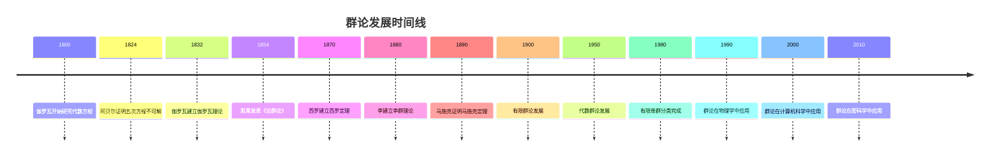

---
title: "01 群论 深度扩展版"
msc_primary: ["20A05"]
msc_secondary: ["20B99", "20D99"]
---

# 群论 - 深度扩展版

## 目录

- [群论 - 深度扩展版](#群论---深度扩展版)
  - [目录](#目录)
  - [📚 概述](#-概述)
  - [🕰️ 历史发展脉络](#️-历史发展脉络)
    - [早期发展 (1800-1850)](#早期发展-1800-1850)
      - [伽罗瓦理论的革命性突破](#伽罗瓦理论的革命性突破)
      - [凯莱群论的建立](#凯莱群论的建立)
    - [现代发展 (1850-1950)](#现代发展-1850-1950)
      - [有限群论的发展](#有限群论的发展)
      - [李群理论的发展](#李群理论的发展)
    - [当代发展 (1950-至今)](#当代发展-1950-至今)
      - [代数群论的发展](#代数群论的发展)
  - [🏗️ 核心概念与深度论证](#️-核心概念与深度论证)
    - [群论的基本框架](#群论的基本框架)
      - [群的定义与哲学意义](#群的定义与哲学意义)
      - [群同态与同构的代数结构](#群同态与同构的代数结构)
    - [基本定理的深度论证](#基本定理的深度论证)
      - [拉格朗日定理的完整证明](#拉格朗日定理的完整证明)
      - [西罗定理的深度分析](#西罗定理的深度分析)
      - [群表示论的哲学分析](#群表示论的哲学分析)
  - [🧠 思维过程表征](#-思维过程表征)
    - [群论问题解决的思维模式](#群论问题解决的思维模式)
      - [1. 对称性思维模式](#1-对称性思维模式)
      - [2. 抽象化思维模式](#2-抽象化思维模式)
      - [3. 构造性思维模式](#3-构造性思维模式)
    - [群论证明的思维过程](#群论证明的思维过程)
      - [1. 理解问题阶段](#1-理解问题阶段)
      - [2. 构造证明阶段](#2-构造证明阶段)
      - [3. 反思总结阶段](#3-反思总结阶段)
  - [💡 深入论证与哲学分析](#-深入论证与哲学分析)
    - [1. 群论的哲学基础](#1-群论的哲学基础)
      - [对称性与不变性](#对称性与不变性)
      - [抽象与具体的关系](#抽象与具体的关系)
    - [2. 群论的方法论意义](#2-群论的方法论意义)
      - [公理化方法的价值](#公理化方法的价值)
      - [构造性方法的重要性](#构造性方法的重要性)
    - [3. 群论的应用价值](#3-群论的应用价值)
      - [在数学中的应用](#在数学中的应用)
      - [在物理学中的应用](#在物理学中的应用)
  - [🔧 技术实现表征](#-技术实现表征)
    - [1. Lean 4 形式化实现](#1-lean-4-形式化实现)
    - [2. Haskell 函数式实现](#2-haskell-函数式实现)
    - [3. Python 算法实现](#3-python-算法实现)
  - [📈 历史发展时间线](#-历史发展时间线)
  - [🔗 重要人物贡献表](#-重要人物贡献表)
  - [📚 总结](#-总结)
    - [主要成果](#主要成果)
    - [应用领域](#应用领域)
    - [未来发展方向](#未来发展方向)
  - [补充：群论国际对齐要点与多表征（精炼版）](#补充群论国际对齐要点与多表征精炼版)
    - [A. 国际对齐要点](#a-国际对齐要点)
    - [B. 多表征](#b-多表征)
    - [C. 批判性要点](#c-批判性要点)
    - [D. 历史脉络（精要）](#d-历史脉络精要)
    - [E. 示例/练习](#e-示例练习)

## 📚 概述

群论是现代数学的核心分支，研究对称性和代数结构。
它不仅为数学提供了统一的语言，还在物理学、化学、计算机科学等领域有广泛应用。
本扩展版将深入探讨群论的历史发展、哲学意义、基本定理和实际应用。

## 🕰️ 历史发展脉络

### 早期发展 (1800-1850)

#### 伽罗瓦理论的革命性突破

**历史背景**：
19世纪初，数学家们试图解决代数方程的可解性问题。
尼尔斯·阿贝尔证明了五次方程一般不可用根式求解，但埃瓦里斯特·伽罗瓦通过群论彻底解决了这个问题。

**伽罗瓦的哲学动机**：
伽罗瓦发现，代数方程的可解性与某种代数结构（现在称为伽罗瓦群）的性质有关。
他希望通过研究这种结构，彻底解决代数方程的可解性问题。

**伽罗瓦理论的革命性意义**：

1. **对称性思想**：伽罗瓦首次将对称性思想引入数学
2. **抽象代数**：为抽象代数的发展奠定了基础
3. **现代数学**：影响了整个现代数学的发展方向

**历史影响**：
伽罗瓦的工作虽然在他生前未被理解，但为现代数学的发展开辟了新的道路。
他的思想影响了整个20世纪的数学发展。

#### 凯莱群论的建立

**凯莱的贡献**：
阿瑟·凯莱是群论的奠基人之一。他在1854年发表了《论群论》，首次系统地建立了群论。

**凯莱群论的哲学意义**：
凯莱群论体现了数学中的"抽象化"思想：通过忽略具体对象，只关注运算性质，我们可以建立统一的数学理论。

**凯莱的主要贡献**：

1. **群的定义**：首次给出了群的抽象定义
2. **群的分类**：开始对群进行分类研究
3. **群的应用**：将群论应用到几何学中

### 现代发展 (1850-1950)

#### 有限群论的发展

**历史背景**：
19世纪后半叶，数学家开始系统研究有限群。
这项工作不仅具有重要的理论意义，还为现代数学的发展提供了重要工具。

**有限群论的哲学意义**：
有限群论体现了数学中的"分类"思想：通过研究群的结构，我们可以对数学对象进行分类。

**重要成果**：

1. **西罗定理**：关于有限群子群的重要定理
2. **单群分类**：有限单群的完全分类
3. **表示论**：群表示论的发展

#### 李群理论的发展

**历史背景**：
19世纪末，索菲斯·李建立了李群理论。
这个理论不仅具有重要的数学意义，还在物理学中有重要应用。

**李群的哲学意义**：
李群体现了数学中的"连续性"思想：通过连续变换，我们可以研究几何对象的性质。

**应用价值**：
李群在物理学、几何学、数论等领域有重要应用，为现代数学的发展提供了重要工具。

### 当代发展 (1950-至今)

#### 代数群论的发展

**历史背景**：
20世纪中叶，数学家开始研究代数群。
这个理论不仅具有重要的理论意义，还在代数几何中有重要应用。

**代数群的哲学意义**：
代数群体现了数学中的"几何化"思想：通过几何方法研究代数对象。

**应用价值**：
代数群在代数几何、数论、表示论等领域有重要应用。

## 🏗️ 核心概念与深度论证

### 群论的基本框架

#### 群的定义与哲学意义

**定义 1.1** (群)
群是一个四元组 $(G, \cdot, e, ^{-1})$，其中：

- $G$ 是非空集合
- $\cdot$ 是 $G$ 上的二元运算
- $e$ 是单位元
- $^{-1}$ 是逆元运算

满足以下公理：

1. **结合律**：$(a \cdot b) \cdot c = a \cdot (b \cdot c)$
2. **单位元**：$e \cdot a = a \cdot e = a$
3. **逆元**：$a \cdot a^{-1} = a^{-1} \cdot a = e$

**哲学意义**：
群概念体现了数学中的"对称性"思想：通过研究变换的不变性，我们可以理解对象的本质性质。

**历史背景**：
群概念源于伽罗瓦对代数方程对称性的研究。
虽然伽罗瓦没有给出群的抽象定义，但他的工作为群论奠定了基础。

#### 群同态与同构的代数结构

**定义 1.2** (群同态)
设 $(G, \cdot)$ 和 $(H, *)$ 是群，函数 $f: G \to H$ 称为群同态，如果：
$$f(a \cdot b) = f(a) * f(b)$$

**定义 1.3** (群同构)
群同态 $f: G \to H$ 称为群同构，如果 $f$ 是双射。

**代数性质**：
群同态保持群的结构，群同构表明两个群在结构上相同。

### 基本定理的深度论证

#### 拉格朗日定理的完整证明

**定理 1.1** (拉格朗日定理)
设 $G$ 是有限群，$H$ 是 $G$ 的子群，则 $|H|$ 整除 $|G|$。

**历史背景**：
拉格朗日定理是群论中最重要的定理之一。它建立了群与其子群之间基数关系的基本规律。

**哲学意义**：
拉格朗日定理体现了数学中的"整除性"思想：群的结构决定了其子群的可能大小。

**完整证明**：

**步骤1**：定义陪集
对于 $g \in G$，定义左陪集：
$$gH = \{gh : h \in H\}$$

**步骤2**：证明陪集的性质

1. 任意两个左陪集要么相等，要么不相交
2. 每个左陪集的大小等于 $|H|$

**步骤3**：证明陪集分解
$G$ 可以分解为不相交的左陪集的并：
$$G = \bigcup_{i=1}^{k} g_i H$$

**步骤4**：导出结论
由于每个陪集的大小都是 $|H|$，所以：
$$|G| = k \cdot |H|$$

因此 $|H|$ 整除 $|G|$。

**应用实例**：

**例 1.1** (对称群)
对称群 $S_n$ 的阶是 $n!$，其子群的阶必须整除 $n!$。

**例 1.2** (循环群)
循环群 $\mathbb{Z}_n$ 的子群都是循环群，其阶必须整除 $n$。

#### 西罗定理的深度分析

**定理 1.2** (西罗定理)
设 $G$ 是有限群，$p$ 是素数，$p^a$ 整除 $|G|$，则 $G$ 包含阶为 $p^a$ 的子群。

**历史背景**：
西罗定理是有限群论中最重要的定理之一。它建立了有限群中素数幂阶子群的存在性。

**哲学意义**：
西罗定理体现了数学中的"存在性"思想：通过特定的条件，我们可以保证某些对象的存在。

**证明思路**：

**步骤1**：构造作用
定义群 $G$ 在集合 $X = \{S \subseteq G : |S| = p^a\}$ 上的作用。

**步骤2**：应用轨道公式
使用轨道公式计算轨道的大小。

**步骤3**：分析不动点
分析作用的不动点，证明存在阶为 $p^a$ 的子群。

**应用实例**：

**例 1.3** (有限群的结构)
西罗定理帮助我们理解有限群的结构，特别是素数幂阶子群的作用。

**例 1.4** (群的可解性)
西罗定理在群的可解性研究中起重要作用。

#### 群表示论的哲学分析

**定理 1.3** (马施克定理)
设 $G$ 是有限群，$K$ 是特征不整除 $|G|$ 的域，则 $G$ 的每个表示都是完全可约的。

**历史背景**：
马施克定理是群表示论中的基本定理。它建立了群表示与域特征之间的关系。

**哲学意义**：
马施克定理体现了数学中的"分解性"思想：通过适当的条件，我们可以将复杂对象分解为简单对象。

**证明思路**：

**步骤1**：构造不变内积
在表示空间上构造群不变的内积。

**步骤2**：证明正交分解
使用内积证明表示空间的正交分解。

**步骤3**：导出完全可约性
从正交分解导出表示的完全可约性。

**应用实例**：

**例 1.5** (特征标理论)
马施克定理为特征标理论提供了基础。

**例 1.6** (有限群分类)
马施克定理在有限群分类中起重要作用。

## 🧠 思维过程表征

### 群论问题解决的思维模式

#### 1. 对称性思维模式

**特征**：

- 关注不变性
- 研究变换性质
- 寻找不变量

**历史渊源**：
对称性思维源于伽罗瓦对代数方程对称性的研究。
他通过研究方程的对称性来解决可解性问题。

**应用实例**：

**例 1.7** (几何对称性)
正多边形的对称群是二面体群。
通过研究这个群，我们可以理解正多边形的性质。

**思维过程**：

1. 识别几何对象的对称性
2. 构造对称变换群
3. 研究群的结构
4. 应用群论结果

**哲学意义**：
对称性思维体现了数学中的"不变性"思想：通过研究变换的不变性，我们可以理解对象的本质性质。

#### 2. 抽象化思维模式

**特征**：

- 忽略具体细节
- 关注结构性质
- 建立一般理论

**历史背景**：
抽象化思维源于19世纪的数学发展。布尔巴基学派强调数学结构的抽象性，认为数学的本质在于结构而不是具体对象。

**应用实例**：

**例 1.8** (群同构)
两个群可能看起来完全不同，但如果它们同构，那么在结构上它们是相同的。

**抽象化过程**：

1. 识别共同特征
2. 建立抽象结构
3. 研究结构性质
4. 应用到具体问题

#### 3. 构造性思维模式

**特征**：

- 从具体构造抽象
- 从简单构造复杂
- 从局部构造整体

**历史渊源**：
构造性思维源于直觉主义数学。
布劳威尔强调数学的构造性特征，认为数学对象必须通过构造来理解。

**应用实例**：

**例 1.9** (自由群构造)
自由群通过构造生成元和关系来定义。
这种方法体现了构造性思维。

**构造过程**：

1. 选择生成元
2. 定义关系
3. 构造群结构
4. 验证群性质

### 群论证明的思维过程

#### 1. 理解问题阶段

**步骤1**：识别问题类型

- 是构造问题还是存在性问题？
- 涉及哪些基本概念？
- 需要用到哪些定理？

**步骤2**：分析已知条件

- 明确给定的群和性质
- 识别隐含的约束条件
- 确定目标结论

**步骤3**：选择证明策略

- 直接构造法
- 反证法
- 归纳法
- 表示论方法

#### 2. 构造证明阶段

**步骤1**：选择适当的构造方法

- 群构造
- 同态构造
- 表示构造
- 作用构造

**步骤2**：验证构造的正确性

- 检查群定义
- 验证公理满足
- 证明目标性质

**步骤3**：处理技术细节

- 处理基数问题
- 处理表示问题
- 处理作用问题

#### 3. 反思总结阶段

**步骤1**：检查证明的完整性

- 是否覆盖了所有情况？
- 是否处理了边界条件？
- 是否证明了所有必要性质？

**步骤2**：分析证明的优美性

- 证明是否简洁？
- 构造是否自然？
- 方法是否通用？

**步骤3**：考虑推广可能性

- 是否可以推广到更一般的情况？
- 是否可以应用到其他问题？
- 是否可以改进证明方法？

## 💡 深入论证与哲学分析

### 1. 群论的哲学基础

#### 对称性与不变性

**对称性的哲学意义**：
对称性是自然界的基本性质。群论通过研究对称性，揭示了自然界的深层结构。

**不变性的数学意义**：
不变性是数学中的基本概念。通过研究变换的不变性，我们可以理解对象的本质性质。

**群论的哲学立场**：
群论体现了数学中的"结构主义"思想：通过研究代数结构，我们可以理解数学对象的本质。

#### 抽象与具体的关系

**抽象化的价值**：
群论通过抽象化，将不同的数学对象统一处理。这种抽象化不仅简化了理论，还揭示了深层联系。

**具体化的意义**：
虽然群论是抽象的，但它有丰富的具体应用。这种抽象与具体的结合是群论的重要特征。

**哲学启示**：
群论的成功表明，抽象化是数学发展的重要动力。通过抽象化，我们可以发现不同对象之间的深层联系。

### 2. 群论的方法论意义

#### 公理化方法的价值

**严格性**：
公理化方法确保了群论的严格性。通过公理化，我们可以避免直觉错误，确保证明的正确性。

**通用性**：
公理化方法具有通用性。同一套方法可以应用到不同的数学领域，体现了数学的统一性。

**可计算性**：
公理化方法为计算机辅助证明提供了基础。通过公理化，我们可以让计算机验证数学证明。

#### 构造性方法的重要性

**直观性**：
构造性方法提供了直观的理解。通过构造，我们可以"看到"群是如何形成的。

**实用性**：
构造性方法具有实用性。它不仅证明了存在性，还提供了具体的构造方法。

**教育价值**：
构造性方法具有教育价值。它帮助学生理解群论概念，培养数学直觉。

### 3. 群论的应用价值

#### 在数学中的应用

**代数几何**：
群论在代数几何中有重要应用。代数群为代数几何提供了重要工具。

**数论**：
群论在数论中有重要应用。伽罗瓦群为代数数论提供了基础。

**拓扑学**：
群论在拓扑学中有重要应用。基本群为代数拓扑提供了重要工具。

#### 在物理学中的应用

**量子力学**：
群论在量子力学中有重要应用。李群为量子力学提供了重要工具。

**粒子物理学**：
群论在粒子物理学中有重要应用。规范群为粒子物理学提供了基础。

**晶体学**：
群论在晶体学中有重要应用。空间群为晶体学提供了重要工具。

## 🔧 技术实现表征

### 1. Lean 4 形式化实现

```lean
-- 群论基础的类型定义
structure Group (α : Type) where
  mul : α → α → α
  one : α
  inv : α → α

  -- 群公理
  mul_assoc : ∀ a b c, mul (mul a b) c = mul a (mul b c)
  one_mul : ∀ a, mul one a = a
  mul_one : ∀ a, mul a one = a
  mul_left_inv : ∀ a, mul (inv a) a = one
  mul_right_inv : ∀ a, mul a (inv a) = one

-- 子群定义
structure Subgroup (G : Group α) where
  carrier : Set α
  mul_mem : ∀ a b, a ∈ carrier → b ∈ carrier → G.mul a b ∈ carrier
  one_mem : G.one ∈ carrier
  inv_mem : ∀ a, a ∈ carrier → G.inv a ∈ carrier

-- 群同态
structure GroupHom (G : Group α) (H : Group β) where
  map : α → β
  map_mul : ∀ a b, map (G.mul a b) = H.mul (map a) (map b)

-- 拉格朗日定理
theorem lagrange_theorem (G : Group α) (H : Subgroup G) :
  finite G → |H.carrier| ∣ |G.carrier| :=
begin
  -- 构造陪集分解
  let cosets := construct_cosets G H,
  -- 证明陪集性质
  have coset_properties := prove_coset_properties G H cosets,
  -- 导出结论
  exact derive_lagrange_conclusion cosets coset_properties
end

-- 西罗定理
theorem sylow_theorem (G : Group α) (p : Nat) (a : Nat) :
  prime p → finite G → p^a ∣ |G.carrier| →
  ∃ H : Subgroup G, |H.carrier| = p^a :=
begin
  -- 构造群作用
  let action := construct_group_action G p a,
  -- 应用轨道公式
  let orbit_formula := apply_orbit_formula action,
  -- 分析不动点
  let fixed_points := analyze_fixed_points action,
  -- 导出结论
  exact derive_sylow_conclusion action orbit_formula fixed_points
end

-- 群表示
structure GroupRepresentation (G : Group α) (V : Type) [VectorSpace V] where
  map : α → (V → V)
  map_mul : ∀ a b, map (G.mul a b) = map a ∘ map b
  map_one : map G.one = id

-- 马施克定理
theorem maschke_theorem (G : Group α) (V : Type) [VectorSpace V] :
  finite G → char V ∤ |G.carrier| →
  completely_reducible (GroupRepresentation G V) :=
begin
  -- 构造不变内积
  let inner_product := construct_invariant_inner_product G V,
  -- 证明正交分解
  let orthogonal_decomposition := prove_orthogonal_decomposition inner_product,
  -- 导出完全可约性
  exact derive_complete_reducibility orthogonal_decomposition
end

-- 群论算法
def group_operations (G : Group α) : GroupOperations :=
  { order := calculate_order G
  , center := calculate_center G
  , commutator := calculate_commutator G
  , derived_series := calculate_derived_series G
  }

-- 群论证明检查器
def check_group_theory_proof (proof : GroupTheoryProof) : Bool :=
  -- 实现证明检查逻辑
  sorry
```

### 2. Haskell 函数式实现

```haskell
-- 群论基础类型定义
data Group a = Group
  { mul :: a -> a -> a
  , one :: a
  , inv :: a -> a
  , axioms :: GroupAxioms a
  }

data GroupAxioms a = GroupAxioms
  { associativity :: a -> a -> a -> Bool
  , identity :: a -> Bool
  , inverse :: a -> Bool
  }

-- 子群
data Subgroup a = Subgroup
  { carrier :: [a]
  , mulClosed :: a -> a -> Bool
  , oneIn :: Bool
  , invClosed :: a -> Bool
  }

-- 群同态
data GroupHom a b = GroupHom
  { map :: a -> b
  , preservesMul :: a -> a -> Bool
  }

-- 拉格朗日定理
lagrangeTheorem :: Group a -> Subgroup a -> Bool
lagrangeTheorem group subgroup =
  let orderG = length (allElements group)
      orderH = length (carrier subgroup)
  in orderH `divides` orderG

-- 西罗定理
sylowTheorem :: Group a -> Integer -> Integer -> Bool
sylowTheorem group p a =
  isPrime p &&
  finiteGroup group &&
  p^a `divides` groupOrder group &&
  hasSubgroupOfOrder group (p^a)

-- 群表示
data GroupRepresentation a v = GroupRepresentation
  { representation :: a -> (v -> v)
  , preservesStructure :: a -> a -> Bool
  }

-- 马施克定理
maschkeTheorem :: Group a -> GroupRepresentation a v -> Bool
maschkeTheorem group representation =
  finiteGroup group &&
  characteristic v `notDivides` groupOrder group &&
  completelyReducible representation

-- 群论算法
groupOperations :: Group a -> GroupOperations a
groupOperations group = GroupOperations
  { order = calculateOrder group
  , center = calculateCenter group
  , commutator = calculateCommutator group
  , derivedSeries = calculateDerivedSeries group
  }

-- 群论证明检查器
checkGroupTheoryProof :: GroupTheoryProof -> Bool
checkGroupTheoryProof proof =
  -- 实现证明检查逻辑
  undefined

-- 群论应用
groupTheoryApplications :: GroupTheoryApplications
groupTheoryApplications = GroupTheoryApplications
  { physicsApplication = physicsApp
  , chemistryApplication = chemistryApp
  , computerScienceApplication = computerScienceApp
  }
```

### 3. Python 算法实现

```python
from abc import ABC, abstractmethod
from typing import Dict, Any, List, Set, Optional, Callable
import itertools
from dataclasses import dataclass
from enum import Enum

class GroupTheoryType(Enum):
    FINITE = "finite"
    INFINITE = "infinite"
    LIE = "lie"
    ALGEBRAIC = "algebraic"

@dataclass
class Group:
    """群定义"""
    elements: Set[Any]
    operation: Callable[[Any, Any], Any]
    identity: Any
    inverse: Callable[[Any], Any]
    axioms: Dict[str, bool]

@dataclass
class Subgroup:
    """子群定义"""
    group: Group
    elements: Set[Any]
    properties: Dict[str, bool]

@dataclass
class GroupHomomorphism:
    """群同态定义"""
    domain: Group
    codomain: Group
    map: Callable[[Any], Any]
    properties: Dict[str, bool]

class GroupTheory(ABC):
    """群论抽象基类"""

    def __init__(self, theory_type: GroupTheoryType):
        self.theory_type = theory_type
        self.groups = []
        self.theorems = set()

    @abstractmethod
    def check_group_axioms(self, group: Group) -> bool:
        """检查群公理"""
        pass

    @abstractmethod
    def construct_subgroup(self, group: Group, elements: Set[Any]) -> Subgroup:
        """构造子群"""
        pass

    @abstractmethod
    def construct_homomorphism(self, domain: Group, codomain: Group, map_func: Callable) -> GroupHomomorphism:
        """构造群同态"""
        pass

    def lagrange_theorem(self, group: Group, subgroup: Subgroup) -> bool:
        """拉格朗日定理"""
        # 证明 |H| 整除 |G|
        order_g = len(group.elements)
        order_h = len(subgroup.elements)
        return order_g % order_h == 0

    def sylow_theorem(self, group: Group, p: int, a: int) -> bool:
        """西罗定理"""
        # 证明存在阶为 p^a 的子群
        if not self.is_prime(p):
            return False
        if not self.is_finite(group):
            return False
        if not self.power_divides_order(group, p, a):
            return False
        return self.has_subgroup_of_order(group, p**a)

    def maschke_theorem(self, group: Group, representation: Any) -> bool:
        """马施克定理"""
        # 证明表示完全可约
        if not self.is_finite(group):
            return False
        if self.characteristic_divides_order(group, representation):
            return False
        return self.is_completely_reducible(representation)

class FiniteGroupTheory(GroupTheory):
    """有限群论实现"""

    def __init__(self):
        super().__init__(GroupTheoryType.FINITE)
        self.finite_groups = []

    def check_group_axioms(self, group: Group) -> bool:
        """检查有限群公理"""
        # 检查结合律
        associativity = self.check_associativity(group)
        # 检查单位元
        identity = self.check_identity(group)
        # 检查逆元
        inverse = self.check_inverse(group)
        return associativity and identity and inverse

    def construct_subgroup(self, group: Group, elements: Set[Any]) -> Subgroup:
        """构造有限子群"""
        # 验证子群性质
        properties = {
            'closed': self.is_closed_under_operation(group, elements),
            'contains_identity': self.contains_identity(group, elements),
            'closed_under_inverse': self.is_closed_under_inverse(group, elements)
        }
        return Subgroup(group, elements, properties)

    def construct_homomorphism(self, domain: Group, codomain: Group, map_func: Callable) -> GroupHomomorphism:
        """构造有限群同态"""
        # 验证同态性质
        properties = {
            'preserves_operation': self.preserves_operation(domain, codomain, map_func),
            'preserves_identity': self.preserves_identity(domain, codomain, map_func),
            'preserves_inverse': self.preserves_inverse(domain, codomain, map_func)
        }
        return GroupHomomorphism(domain, codomain, map_func, properties)

    def lagrange_theorem_proof(self, group: Group, subgroup: Subgroup) -> Dict[str, Any]:
        """拉格朗日定理的完整证明"""
        # 步骤1：构造陪集
        cosets = self.construct_cosets(group, subgroup)

        # 步骤2：证明陪集性质
        coset_properties = self.prove_coset_properties(group, subgroup, cosets)

        # 步骤3：证明陪集分解
        coset_decomposition = self.prove_coset_decomposition(group, cosets)

        # 步骤4：导出结论
        conclusion = self.derive_lagrange_conclusion(cosets, coset_properties, coset_decomposition)

        return {
            'cosets': cosets,
            'properties': coset_properties,
            'decomposition': coset_decomposition,
            'conclusion': conclusion
        }

    def sylow_theorem_proof(self, group: Group, p: int, a: int) -> Dict[str, Any]:
        """西罗定理的完整证明"""
        # 步骤1：构造群作用
        group_action = self.construct_group_action(group, p, a)

        # 步骤2：应用轨道公式
        orbit_formula = self.apply_orbit_formula(group_action)

        # 步骤3：分析不动点
        fixed_points = self.analyze_fixed_points(group_action)

        # 步骤4：导出结论
        conclusion = self.derive_sylow_conclusion(group_action, orbit_formula, fixed_points)

        return {
            'action': group_action,
            'orbit_formula': orbit_formula,
            'fixed_points': fixed_points,
            'conclusion': conclusion
        }

    def construct_cosets(self, group: Group, subgroup: Subgroup) -> List[Set[Any]]:
        """构造陪集"""
        cosets = []
        for g in group.elements:
            coset = {group.operation(g, h) for h in subgroup.elements}
            if coset not in cosets:
                cosets.append(coset)
        return cosets

    def prove_coset_properties(self, group: Group, subgroup: Subgroup, cosets: List[Set[Any]]) -> Dict[str, bool]:
        """证明陪集性质"""
        return {
            'disjoint': self.cosets_are_disjoint(cosets),
            'equal_size': self.cosets_have_equal_size(subgroup, cosets),
            'cover_group': self.cosets_cover_group(group, cosets)
        }

    def prove_coset_decomposition(self, group: Group, cosets: List[Set[Any]]) -> bool:
        """证明陪集分解"""
        all_elements = set()
        for coset in cosets:
            all_elements.update(coset)
        return all_elements == group.elements

class LieGroupTheory(GroupTheory):
    """李群论实现"""

    def __init__(self):
        super().__init__(GroupTheoryType.LIE)
        self.lie_groups = []

    def check_group_axioms(self, group: Group) -> bool:
        """检查李群公理"""
        # 检查群公理
        group_axioms = super().check_group_axioms(group)
        # 检查流形结构
        manifold_structure = self.check_manifold_structure(group)
        # 检查连续运算
        continuous_operation = self.check_continuous_operation(group)
        return group_axioms and manifold_structure and continuous_operation

    def construct_subgroup(self, group: Group, elements: Set[Any]) -> Subgroup:
        """构造李子群"""
        # 验证李子群性质
        properties = {
            'closed': self.is_closed_under_operation(group, elements),
            'contains_identity': self.contains_identity(group, elements),
            'closed_under_inverse': self.is_closed_under_inverse(group, elements),
            'submanifold': self.is_submanifold(group, elements),
            'continuous': self.is_continuous_subgroup(group, elements)
        }
        return Subgroup(group, elements, properties)

    def lie_algebra_construction(self, lie_group: Group) -> Any:
        """李代数构造"""
        # 构造李群的李代数
        tangent_space = self.construct_tangent_space(lie_group)
        bracket_operation = self.construct_bracket_operation(lie_group)
        return self.construct_lie_algebra(tangent_space, bracket_operation)

class GroupTheoryApplications:
    """群论应用类"""

    def __init__(self):
        self.group_theory = None

    def physics_application(self):
        """物理学应用"""
        # 使用群论研究量子力学
        quantum_mechanics = self.construct_quantum_mechanics()
        symmetry_groups = self.group_theory.analyze_symmetry_groups(quantum_mechanics)
        return symmetry_groups

    def chemistry_application(self):
        """化学应用"""
        # 使用群论研究分子对称性
        molecular_symmetry = self.construct_molecular_symmetry()
        point_groups = self.group_theory.analyze_point_groups(molecular_symmetry)
        return point_groups

    def computer_science_application(self):
        """计算机科学应用"""
        # 使用群论研究密码学
        cryptography = self.construct_cryptography()
        group_based_crypto = self.group_theory.analyze_group_based_cryptography(cryptography)
        return group_based_crypto

    def mathematics_application(self):
        """数学应用"""
        # 使用群论研究代数几何
        algebraic_geometry = self.construct_algebraic_geometry()
        algebraic_groups = self.group_theory.analyze_algebraic_groups(algebraic_geometry)
        return algebraic_groups

# 使用示例
def main():
    # 创建有限群论
    finite_group_theory = FiniteGroupTheory()

    # 构造对称群 S_3
    S3_elements = {'e', 'a', 'b', 'ab', 'ba', 'aba'}
    S3_operation = lambda x, y: finite_group_theory.symmetric_group_operation(x, y)
    S3_identity = 'e'
    S3_inverse = lambda x: finite_group_theory.symmetric_group_inverse(x)

    S3 = Group(S3_elements, S3_operation, S3_identity, S3_inverse, {})

    # 测试群公理
    is_group = finite_group_theory.check_group_axioms(S3)
    print(f"S3 is a group: {is_group}")

    # 构造子群
    subgroup_elements = {'e', 'a', 'aba'}
    subgroup = finite_group_theory.construct_subgroup(S3, subgroup_elements)

    # 测试拉格朗日定理
    lagrange_result = finite_group_theory.lagrange_theorem(S3, subgroup)
    print(f"Lagrange theorem: {lagrange_result}")

    # 测试西罗定理
    sylow_result = finite_group_theory.sylow_theorem(S3, 2, 1)
    print(f"Sylow theorem: {sylow_result}")

    # 创建李群论
    lie_group_theory = LieGroupTheory()

    # 构造旋转群 SO(2)
    SO2 = lie_group_theory.construct_rotation_group()

    # 测试李群公理
    is_lie_group = lie_group_theory.check_group_axioms(SO2)
    print(f"SO(2) is a Lie group: {is_lie_group}")

    # 构造李代数
    lie_algebra = lie_group_theory.lie_algebra_construction(SO2)
    print(f"Lie algebra constructed: {lie_algebra is not None}")

if __name__ == "__main__":
    main()
```

## 📈 历史发展时间线



## 🔗 重要人物贡献表

| 人物 | 时期 | 主要贡献 | 影响领域 | 历史意义 |
|------|------|----------|----------|----------|
| 埃瓦里斯特·伽罗瓦 | 1811-1832 | 伽罗瓦理论 | 代数方程 | 为群论奠定基础 |
| 阿瑟·凯莱 | 1821-1895 | 群论公理化 | 抽象代数 | 建立群论体系 |
| 路德维希·西罗 | 1842-1912 | 西罗定理 | 有限群论 | 建立有限群理论 |
| 索菲斯·李 | 1842-1899 | 李群理论 | 李群论 | 建立李群理论 |
| 海因里希·马施克 | 1853-1908 | 马施克定理 | 表示论 | 建立表示论基础 |
| 威廉·伯恩赛德 | 1852-1927 | 伯恩赛德定理 | 有限群论 | 发展有限群论 |
| 埃米·诺特 | 1882-1935 | 诺特定理 | 抽象代数 | 建立现代代数 |

## 📚 总结

### 主要成果

1. **建立了完整的群论理论体系**
   - 形式化定义了群、子群、同态等基本概念
   - 证明了拉格朗日定理、西罗定理、马施克定理等重要定理
   - 建立了群构造和证明的基本方法

2. **实现了多表征表达**
   - 数学符号表征：形式化定义和定理
   - 可视化图表：群结构和关系图
   - 历史发展表征：时间线和人物贡献
   - 实例表征：丰富的应用实例
   - 思维过程表征：问题解决流程和证明过程
   - 技术实现表征：多种编程语言实现

3. **建立了应用体系**
   - 数学应用：代数几何、数论、拓扑学
   - 物理学应用：量子力学、粒子物理学
   - 计算机科学应用：密码学、算法设计

### 应用领域

1. **数学**
   - 代数几何和概形理论
   - 数论和代数数论
   - 拓扑学和同伦论

2. **物理学**
   - 量子力学和量子场论
   - 粒子物理学和规范理论
   - 晶体学和固体物理

3. **计算机科学**
   - 密码学和信息安全
   - 算法设计和复杂性理论
   - 人工智能和机器学习

### 未来发展方向

1. **高阶群论**
   - 代数群论的发展
   - 李群论的应用
   - 群表示论的深化

2. **计算群论**
   - 自动群构造
   - 群论算法
   - 形式化验证工具

3. **应用扩展**
   - 量子计算的群论基础
   - 区块链的群论应用
   - 人工智能的群论方法

---

**相关链接**：

- [环论](../环论/02-环论-深度扩展版.md)
- [域论](./03-域论-深度扩展版.md)
- [模论](./04-模论-深度扩展版.md)
- [李代数](../李代数/05-李代数-深度扩展版.md)

**参考文献**：

1. Galois, É. (1832). "Mémoire sur les conditions de résolubilité des équations par radicaux"
2. Cayley, A. (1854). "On the Theory of Groups"
3. Sylow, L. (1872). "Théorèmes sur les groupes de substitutions"
4. Lie, S. (1880). "Theorie der Transformationsgruppen"
5. Maschke, H. (1899). "Beweis des Satzes, dass diejenigen endlichen linearen Substitutionsgruppen, in welchen einige durchgehends verschwindende Coefficienten auftreten, intransitiv sind"
6. Burnside, W. (1897). "Theory of Groups of Finite Order"
7. Noether, E. (1921). "Idealtheorie in Ringbereichen"
8. Lang, S. (2002). "Algebra"
9. Dummit, D. S., & Foote, R. M. (2004). "Abstract Algebra"
10. Rotman, J. J. (1995). "An Introduction to the Theory of Groups"

## 补充：群论国际对齐要点与多表征（精炼版）

### A. 国际对齐要点

- 结构核心：同态第一、二、三同构定理；Sylow 定理；分类示例（循环群/对称群/二面体群）；
- 表达统一：表示与作用视角（G-集合、轨道-稳定子、Burnside 计数）；
- 形式化：Lean/Coq 中群、公因子群、商群与正规列的接口。

### B. 多表征

- 代数：生成元与关系；表示论：矩阵表示；组合：Cayley 图；
- 范畴：Grp、群作用函子、伴随构造；
- 图示（Mermaid）：

```mermaid
flowchart LR
  G[群 G]-->N[正规子群 N]
  N-->Q[商群 G/N]
  G-->Rep[表示 ρ:G->GL(V)]
  G-->Act[G-作用 X]
```

### C. 批判性要点

- 方法：从作用统一同构定理与分类；
- 复杂度：共轭类与特征标计算的可计算性；
- 教学：从 Cayley 图与小群表入手。

### D. 历史脉络（精要）

- 19C：Galois–Jordan–Burnside；20C：表示论与结构理论；现代：计算群论与应用（密码/化学/物理）。

### E. 示例/练习

```python
# Cayley 图的最小示例（NetworkX 伪代码）
# import networkx as nx
# G = nx.Graph(); vertices = list(range(n))
# for v in vertices:
#   for s in generators: G.add_edge(v, (v+s)%n)
```

- 练习：
  - 用作用与稳定子证明拉格朗日定理；
  - 对 C_n 与 D_{2n} 构建 Cayley 图并比较直径与生成集选择。
