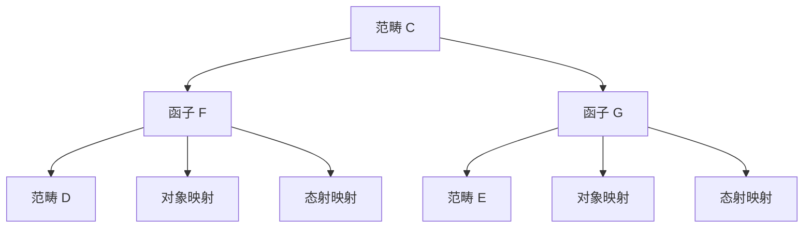
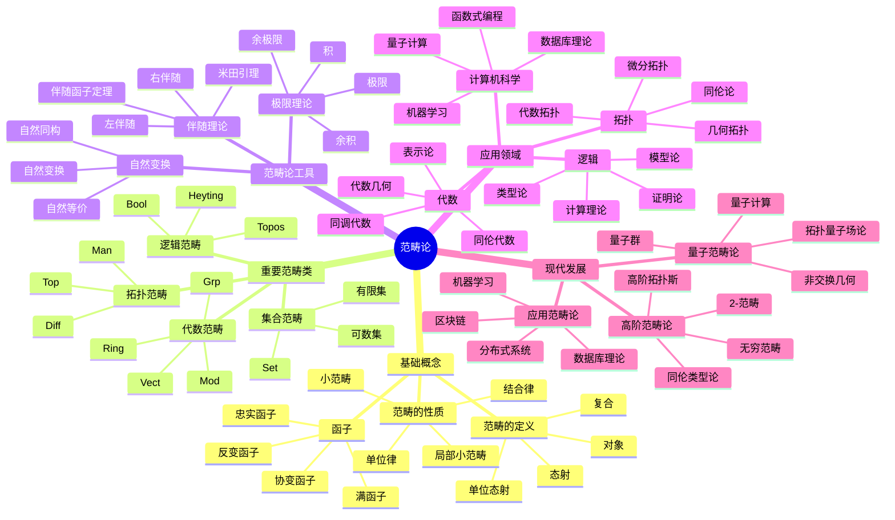

---
title: "06 范畴论 增强版"
msc_primary: ["18A99"]
msc_secondary: ["18B99"]
---

# 范畴论 - 增强版

## 目录 / Table of Contents

- [范畴论 - 增强版](#范畴论---增强版)
  - [目录 / Table of Contents](#目录--table-of-contents)
  - [📚 概述](#-概述)
  - [🕰️ 历史发展脉络](#️-历史发展脉络)
    - [早期发展 (1940-1960)](#早期发展-1940-1960)
      - [代数拓扑背景](#代数拓扑背景)
      - [代数几何背景](#代数几何背景)
    - [现代发展 (1960-1990)](#现代发展-1960-1990)
      - [抽象范畴论](#抽象范畴论)
      - [同调代数](#同调代数)
    - [当代发展 (1990-至今)](#当代发展-1990-至今)
      - [高阶范畴论](#高阶范畴论)
      - [应用扩展](#应用扩展)
  - [🏗️ 核心概念](#️-核心概念)
    - [范畴的定义](#范畴的定义)
    - [基本性质](#基本性质)
      - [1. 对象和态射](#1-对象和态射)
      - [2. 复合运算](#2-复合运算)
      - [3. 函子](#3-函子)
  - [📊 可视化图表](#-可视化图表)
    - [范畴的结构图](#范畴的结构图)
    - [函子关系图](#函子关系图)
    - [自然变换图](#自然变换图)
  - [🔍 实例表征](#-实例表征)
    - [1. 集合范畴 Set](#1-集合范畴-set)
    - [2. 群范畴 Grp](#2-群范畴-grp)
    - [3. 拓扑空间范畴 Top](#3-拓扑空间范畴-top)
    - [4. 重要范畴类](#4-重要范畴类)
      - [阿贝尔范畴](#阿贝尔范畴)
      - [模范畴](#模范畴)
  - [🧠 思维过程表征](#-思维过程表征)
    - [1. 范畴论问题解决流程](#1-范畴论问题解决流程)
      - [步骤1：识别范畴结构](#步骤1识别范畴结构)
      - [步骤2：分析范畴性质](#步骤2分析范畴性质)
      - [步骤3：应用范畴论工具](#步骤3应用范畴论工具)
    - [2. 证明思维过程](#2-证明思维过程)
      - [米田引理证明](#米田引理证明)
      - [伴随函子证明](#伴随函子证明)
    - [3. 概念理解步骤](#3-概念理解步骤)
      - [理解范畴的概念](#理解范畴的概念)
      - [理解函子概念](#理解函子概念)
  - [🌍 应用场景表征](#-应用场景表征)
    - [1. 代数应用](#1-代数应用)
      - [1.1 同调代数](#11-同调代数)
      - [表示论](#表示论)
    - [2. 拓扑学应用](#2-拓扑学应用)
      - [代数拓扑](#代数拓扑)
      - [同伦论](#同伦论)
    - [3. 逻辑学应用](#3-逻辑学应用)
      - [类型论](#类型论)
      - [模型论](#模型论)
    - [4. 计算机科学应用](#4-计算机科学应用)
      - [编程语言理论](#编程语言理论)
      - [数据库理论](#数据库理论)
    - [5. 物理学应用](#5-物理学应用)
      - [量子力学](#量子力学)
      - [量子场论](#量子场论)
    - [6. 数学内部应用](#6-数学内部应用)
      - [代数几何](#代数几何)
      - [数论](#数论)
  - [🔗 知识关联网络](#-知识关联网络)
    - [与其他数学分支的联系](#与其他数学分支的联系)
      - [与代数学的联系](#与代数学的联系)
      - [与拓扑学的联系](#与拓扑学的联系)
      - [与逻辑学的联系](#与逻辑学的联系)
    - [理论发展脉络](#理论发展脉络)
      - [从具体到抽象](#从具体到抽象)
      - [从有限到无限](#从有限到无限)
      - [从经典到量子](#从经典到量子)
  - [📈 现代发展前沿](#-现代发展前沿)
    - [1. 高阶范畴论](#1-高阶范畴论)
    - [2. 量子范畴论](#2-量子范畴论)
    - [3. 应用范畴论](#3-应用范畴论)
    - [4. 计算范畴论](#4-计算范畴论)
  - [🎯 学习路径建议](#-学习路径建议)
    - [初学者路径](#初学者路径)
    - [进阶路径](#进阶路径)
    - [研究路径](#研究路径)
  - [🌟 总结](#-总结)
  - [术语对照表 / Terminology Table](#术语对照表--terminology-table)
  - [多表征方式与图建模](#多表征方式与图建模)
    - [范畴论的多表征系统](#范畴论的多表征系统)
    - [思维导图：范畴论的核心概念](#思维导图范畴论的核心概念)

## 📚 概述

范畴论是现代数学的基础语言，研究数学对象之间的映射关系。
范畴的概念统一了代数、拓扑、逻辑等众多数学领域，为现代数学提供了统一的抽象框架。

## 🕰️ 历史发展脉络

### 早期发展 (1940-1960)

#### 代数拓扑背景

- **1942年**: 艾伦伯格-麦克莱恩引入范畴概念
- **1945年**: 艾伦伯格-麦克莱恩建立同调代数
- **1950年**: 格罗滕迪克开始使用范畴论

#### 代数几何背景

- **1950年代**: 格罗滕迪克概形理论
- **1960年代**: 德利涅上同调理论
- **1970年代**: 导出范畴理论

### 现代发展 (1960-1990)

#### 抽象范畴论

- **1960年代**: 劳威尔建立范畴论基础
- **1970年代**: 麦克莱恩《范畴论工作数学家》
- **1980年代**: 约翰斯通《拓扑斯理论》

#### 同调代数

- **1960年代**: 导出函子理论
- **1970年代**: 模型范畴理论
- **1980年代**: 三角范畴理论

### 当代发展 (1990-至今)

#### 高阶范畴论

- **1990年代**: 2-范畴理论
- **2000年代**: 无穷范畴理论
- **2010年代**: 同伦类型论

#### 应用扩展

- **1990年代**: 计算机科学应用
- **2000年代**: 量子计算应用
- **2010年代**: 机器学习应用

## 🏗️ 核心概念

### 范畴的定义

```lean
-- Lean 4 形式化定义
structure Category where
  obj : Type
  hom : obj → obj → Type
  id : ∀ a : obj, hom a a
  comp : ∀ {a b c : obj}, hom b c → hom a b → hom a c

  -- 单位律
  id_comp : ∀ {a b : obj} (f : hom a b), comp (id b) f = f
  comp_id : ∀ {a b : obj} (f : hom a b), comp f (id a) = f

  -- 结合律
  comp_assoc : ∀ {a b c d : obj} (f : hom c d) (g : hom b c) (h : hom a b),
    comp f (comp g h) = comp (comp f g) h
```

### 基本性质

#### 1. 对象和态射

- 对象集合：$\text{Ob}(\mathcal{C})$
- 态射集合：$\text{Hom}(A, B)$
- 单位态射：$\text{id}_A : A \to A$

#### 2. 复合运算

- 结合律：$(f \circ g) \circ h = f \circ (g \circ h)$
- 单位律：$f \circ \text{id}_A = f = \text{id}_B \circ f$

#### 3. 函子

- 对象映射：$F : \text{Ob}(\mathcal{C}) \to \text{Ob}(\mathcal{D})$
- 态射映射：$F : \text{Hom}(A, B) \to \text{Hom}(F(A), F(B))$

## 📊 可视化图表

### 范畴的结构图

```mermaid
graph TD
    A[范畴 C] --> B[对象 Ob(C)]
    A --> C[态射 Hom(A,B)]
    A --> D[复合运算]
    A --> E[单位态射]

    B --> F[对象集合]
    C --> G[态射集合]
    D --> H[结合律]
    E --> I[单位律]
```

### 函子关系图



### 自然变换图

```mermaid
graph LR
    A[函子 F] -->|α| B[函子 G]
    C[对象 A] -->|F(A)| D[对象 F(A)]
    C -->|G(A)| E[对象 G(A)]
    D -->|α_A| E
```

## 🔍 实例表征

### 1. 集合范畴 Set

```haskell
-- Haskell 实现
class Category cat where
  id :: cat a a
  (.) :: cat b c -> cat a b -> cat a c

instance Category (->) where
  id = id
  (.) = (.)

-- 集合范畴
data Set = Set {
    elements :: [a]
}

-- 函数作为态射
type SetMorphism a b = a -> b
```

### 2. 群范畴 Grp

```rust
// Rust 实现
pub trait Category {
    type Object;
    type Morphism;

    fn id(obj: &Self::Object) -> Self::Morphism;
    fn compose(f: &Self::Morphism, g: &Self::Morphism) -> Self::Morphism;
}

pub struct GroupCategory;

impl Category for GroupCategory {
    type Object = Group;
    type Morphism = GroupHomomorphism;

    fn id(group: &Group) -> GroupHomomorphism {
        GroupHomomorphism::identity(group)
    }

    fn compose(f: &GroupHomomorphism, g: &GroupHomomorphism) -> GroupHomomorphism {
        GroupHomomorphism::compose(f, g)
    }
}
```

### 3. 拓扑空间范畴 Top

```lean
-- Lean 4 实现
structure TopologicalSpace where
  carrier : Type
  topology : Set (Set carrier)
  -- 拓扑公理

structure ContinuousMap (X Y : TopologicalSpace) where
  map : X.carrier → Y.carrier
  continuous : ∀ U ∈ Y.topology, map ⁻¹ U ∈ X.topology

def id_map (X : TopologicalSpace) : ContinuousMap X X :=
  ⟨id, by simp⟩

def compose (f : ContinuousMap Y Z) (g : ContinuousMap X Y) : ContinuousMap X Z :=
  ⟨f.map ∘ g.map, by simp [continuous_composition]⟩
```

### 4. 重要范畴类

#### 阿贝尔范畴

```haskell
-- 阿贝尔范畴
class AbelianCategory cat where
  zero_object :: cat a a
  biproduct :: cat a b -> cat a c -> cat a (b, c)
  kernel :: cat a b -> cat (Kernel a b) a
  cokernel :: cat a b -> cat b (Cokernel a b)

  -- 阿贝尔性质
  exact_sequence :: [cat a b] -> Bool
  snake_lemma :: cat a b -> cat b c -> cat c d -> cat (Kernel a b) (Cokernel c d)
```

#### 模范畴

```rust
// 模范畴
pub struct ModuleCategory<R> {
    ring: R,
}

impl<R: Ring> Category for ModuleCategory<R> {
    type Object = Module<R>;
    type Morphism = ModuleHomomorphism<R>;

    fn id(module: &Module<R>) -> ModuleHomomorphism<R> {
        ModuleHomomorphism::identity(module)
    }

    fn compose(f: &ModuleHomomorphism<R>, g: &ModuleHomomorphism<R>) -> ModuleHomomorphism<R> {
        ModuleHomomorphism::compose(f, g)
    }
}
```

## 🧠 思维过程表征

### 1. 范畴论问题解决流程

#### 步骤1：识别范畴结构

```text
问题 → 识别对象和态射 → 验证范畴公理 → 确定范畴类型
```

#### 步骤2：分析范畴性质

```text
范畴结构 → 函子分析 → 自然变换分析 → 极限分析
```

#### 步骤3：应用范畴论工具

```text
范畴性质 → 伴随函子 → 米田引理 → 同调代数
```

### 2. 证明思维过程

#### 米田引理证明

```text
1. 定义米田嵌入
2. 构造自然变换
3. 证明唯一性
4. 得出表示定理
```

#### 伴随函子证明

```text
1. 定义伴随关系
2. 构造单位余单位
3. 证明三角恒等式
4. 得出伴随性质
```

### 3. 概念理解步骤

#### 理解范畴的概念

```text
1. 对象和态射
2. 复合运算
3. 单位律和结合律
4. 具体实例验证
```

#### 理解函子概念

```text
1. 对象映射
2. 态射映射
3. 函子公理
4. 函子性质
```

## 🌍 应用场景表征

### 1. 代数应用

#### 1.1 同调代数

```haskell
-- 链复形范畴
data ChainComplex = ChainComplex {
    objects :: [Module],
    differentials :: [ModuleHomomorphism]
}

-- 导出函子
class DerivedFunctor f where
  left_derived :: f -> Module -> Module
  right_derived :: f -> Module -> Module

  -- 长正合列
  long_exact_sequence :: f -> ChainComplex -> [Module]
```

#### 表示论

- **群表示**: 群到向量空间的函子
- **李代数表示**: 李代数到模的函子
- **代数群表示**: 代数群到概形的函子

### 2. 拓扑学应用

#### 代数拓扑

```rust
// 基本群函子
pub struct FundamentalGroupFunctor;

impl Functor for FundamentalGroupFunctor {
    type Source = TopologicalSpace;
    type Target = Group;

    fn map_object(space: &TopologicalSpace) -> Group {
        space.fundamental_group()
    }

    fn map_morphism(map: &ContinuousMap) -> GroupHomomorphism {
        map.induced_homomorphism()
    }
}
```

#### 同伦论

- **同伦群**: 拓扑空间的同伦不变量
- **纤维化**: 同伦纤维的范畴
- **谱序列**: 同伦论的代数工具

### 3. 逻辑学应用

#### 类型论

```haskell
-- 类型范畴
data Type = Type {
    constructors :: [Constructor],
    eliminators :: [Eliminator]
}

-- 类型同构
type TypeIsomorphism a b = (a -> b, b -> a)

-- 米田嵌入
yoneda_embedding :: Type -> (Type -> Set)
yoneda_embedding a = \b -> (b -> a)
```

#### 模型论

- **模型范畴**: 逻辑结构的范畴
- **解释函子**: 语言到模型的映射
- **完备性定理**: 语法和语义的对应

### 4. 计算机科学应用

#### 编程语言理论

```rust
// 类型系统范畴
pub struct TypeSystemCategory;

impl Category for TypeSystemCategory {
    type Object = Type;
    type Morphism = Term;

    fn id(ty: &Type) -> Term {
        Term::identity(ty)
    }

    fn compose(f: &Term, g: &Term) -> Term {
        Term::compose(f, g)
    }
}

// 函子编程
pub trait Functor<A, B> {
    fn map<F>(self, f: F) -> Self::Output
    where F: Fn(A) -> B;
}
```

#### 数据库理论

- **关系数据库**: 关系代数范畴
- **查询优化**: 范畴论优化
- **数据迁移**: 函子迁移

### 5. 物理学应用

#### 量子力学

```haskell
-- 希尔伯特空间范畴
data HilbertSpace = HilbertSpace {
    dimension :: Int,
    inner_product :: Complex -> Complex -> Complex
}

-- 量子态变换
type QuantumTransformation = HilbertSpace -> HilbertSpace

-- 量子测量
data QuantumMeasurement = QuantumMeasurement {
    observable :: HermitianOperator,
    eigenstates :: [HilbertSpace]
}
```

#### 量子场论

- **场论范畴**: 量子场的范畴
- **规范理论**: 规范群的范畴
- **拓扑量子场论**: 拓扑不变量

### 6. 数学内部应用

#### 代数几何

- **概形范畴**: 代数几何的基础
- **凝聚层**: 概形上的层
- **上同调**: 几何不变量

#### 数论

- **伽罗瓦群**: 数域扩张的群
- **类域论**: 阿贝尔扩张理论
- **朗兰兹纲领**: 非阿贝尔扩张

## 🔗 知识关联网络

### 与其他数学分支的联系

#### 与代数学的联系

- 群、环、域的范畴
- 模和代数的范畴
- 李代数和李群的范畴

#### 与拓扑学的联系

- 拓扑空间的范畴
- 同伦论的范畴
- 纤维丛的范畴

#### 与逻辑学的联系

- 类型论的范畴
- 模型论的范畴
- 证明论的范畴

### 理论发展脉络

#### 从具体到抽象

```text
集合 → 群 → 范畴 → 高阶范畴
```

#### 从有限到无限

```text
有限范畴 → 无限范畴 → 无穷范畴 → 同伦类型论
```

#### 从经典到量子

```text
经典范畴 → 量子范畴 → 非交换几何 → 量子计算
```

## 📈 现代发展前沿

### 1. 高阶范畴论

- **2-范畴**: 范畴的范畴
- **无穷范畴**: 高阶结构
- **同伦类型论**: 类型论和同伦论

### 2. 量子范畴论

- **量子群**: 非交换代数结构
- **量子计算**: 量子算法的范畴
- **拓扑量子场论**: 拓扑不变量

### 3. 应用范畴论

- **数据库理论**: 关系数据库的范畴
- **机器学习**: 神经网络的范畴
- **区块链**: 分布式系统的范畴

### 4. 计算范畴论

- **符号计算**: 范畴论的算法
- **自动证明**: 范畴论的证明
- **软件工程**: 范畴论的编程

## 🎯 学习路径建议

### 初学者路径

1. **基础概念**: 范畴的定义和基本性质
2. **重要例子**: 集合范畴、群范畴、拓扑空间范畴
3. **基本定理**: 米田引理、伴随函子定理
4. **应用实例**: 同调代数、代数拓扑

### 进阶路径

1. **同调代数**: 范畴论的同调理论
2. **代数几何**: 范畴论的几何化
3. **类型论**: 范畴论的逻辑化
4. **现代应用**: 计算机科学、物理学

### 研究路径

1. **前沿理论**: 高阶范畴论、量子范畴论
2. **交叉应用**: 代数几何、表示论
3. **计算范畴论**: 算法和软件
4. **开放问题**: 未解决的范畴论问题

## 🌟 总结

范畴论作为现代数学的基础语言，不仅提供了统一的抽象框架，还在各个领域发挥着重要作用。从基础的代数结构到前沿的量子计算，范畴论的发展展现了数学的深刻性和普适性。

通过多表征的学习方法，我们可以从不同角度理解范畴论：

- **历史角度**: 了解范畴论的发展历程
- **结构角度**: 掌握范畴的基本性质
- **应用角度**: 认识范畴论的实际价值
- **发展角度**: 关注范畴论的现代发展

范畴论将继续在数学、计算机科学和其他科学领域发挥重要作用，为人类认识世界提供强大的工具。

---

**相关文档**:

- [群论-增强版](../群论/01-群论-增强版.md)
- [环论-增强版](../环论/02-环论-增强版.md)
- [域论-增强版](03-域论-增强版.md)
- [模论-增强版](../模论/04-模论-增强版.md)
- [李代数-增强版](../李代数/05-李代数-增强版.md)
- [高阶范畴论-高级主题](../11-高级数学/高阶范畴论-高级主题.md)

## 术语对照表 / Terminology Table

| 中文 | English |
|---|---|
| 范畴 | Category |
| 对象 | Object |
| 态射 | Morphism |
| 复合 | Composition |
| 单位态射 | Identity morphism |
| 函子 | Functor |
| 自然变换 | Natural transformation |
| 伴随 | Adjoint |
| 极限/余极限 | Limit/Colimit |
| 单/满/忠实函子 | Mono-/Epi-/Faithful functor |
| 单（射）/满（射） | Monomorphism/Epimorphism |

## 多表征方式与图建模

### 范畴论的多表征系统

```python
import numpy as np
import networkx as nx
import matplotlib.pyplot as plt
from typing import Dict, List, Tuple, Any
import math

class CategoryTheorySystem:
    """范畴论多表征系统"""

    def __init__(self):
        self.categories = {}
        self.representations = {}

    def add_category(self, name: str, objects: List, morphisms: Dict, composition: Dict) -> None:
        """添加范畴"""
        self.categories[name] = {
            'objects': objects,
            'morphisms': morphisms,
            'composition': composition,
            'size': len(objects)
        }

    def algebraic_representation(self, category_name: str) -> Dict:
        """代数表征"""
        category = self.categories[category_name]
        return {
            'objects': category['objects'],
            'morphism_sets': self._create_morphism_sets(category),
            'composition_table': self._create_composition_table(category),
            'properties': self._analyze_properties(category)
        }

    def geometric_representation(self, category_name: str) -> Dict:
        """几何表征"""
        category = self.categories[category_name]
        return {
            'object_graph': self._create_object_graph(category),
            'morphism_diagram': self._create_morphism_diagram(category),
            'commutative_diagrams': self._find_commutative_diagrams(category)
        }

    def combinatorial_representation(self, category_name: str) -> Dict:
        """组合表征"""
        category = self.categories[category_name]
        return {
            'morphism_count': self._count_morphisms(category),
            'isomorphisms': self._find_isomorphisms(category),
            'endomorphisms': self._find_endomorphisms(category)
        }

    def topological_representation(self, category_name: str) -> Dict:
        """拓扑表征"""
        category = self.categories[category_name]
        return {
            'nerve': self._create_nerve(category),
            'classifying_space': self._create_classifying_space(category),
            'cohomology': self._compute_cohomology(category)
        }

    def _create_morphism_sets(self, category: Dict) -> Dict:
        """创建态射集合"""
        objects = category['objects']
        morphisms = category['morphisms']

        morphism_sets = {}
        for obj1 in objects:
            for obj2 in objects:
                key = f"Hom({obj1}, {obj2})"
                morphism_sets[key] = []
                for morphism, (source, target) in morphisms.items():
                    if source == obj1 and target == obj2:
                        morphism_sets[key].append(morphism)

        return morphism_sets

    def _create_composition_table(self, category: Dict) -> np.ndarray:
        """创建复合表"""
        objects = category['objects']
        composition = category['composition']

        # 创建所有态射的列表
        all_morphisms = list(category['morphisms'].keys())
        n = len(all_morphisms)
        table = np.zeros((n, n), dtype=int)

        for i, f in enumerate(all_morphisms):
            for j, g in enumerate(all_morphisms):
                if (f, g) in composition:
                    result = composition[(f, g)]
                    if result in all_morphisms:
                        table[i, j] = all_morphisms.index(result)

        return table

    def _analyze_properties(self, category: Dict) -> Dict:
        """分析范畴的性质"""
        objects = category['objects']
        morphisms = category['morphisms']
        composition = category['composition']

        # 检查范畴性质
        associativity = self._check_associativity(category)
        identity = self._check_identity(category)

        return {
            'associativity': associativity,
            'identity': identity,
            'small': len(objects) < 1000,  # 简化版本
            'finite': len(objects) < float('inf')
        }

    def _check_associativity(self, category: Dict) -> bool:
        """检查结合律"""
        composition = category['composition']

        # 检查所有可能的复合
        for f in composition:
            for g in composition:
                for h in composition:
                    if (f, g) in composition and (g, h) in composition:
                        fg = composition[(f, g)]
                        gh = composition[(g, h)]

                        if (fg, h) in composition and (f, gh) in composition:
                            if composition[(fg, h)] != composition[(f, gh)]:
                                return False

        return True

    def _check_identity(self, category: Dict) -> bool:
        """检查单位态射"""
        objects = category['objects']
        morphisms = category['morphisms']
        composition = category['composition']

        # 检查每个对象是否有单位态射
        for obj in objects:
            has_identity = False
            for morphism, (source, target) in morphisms.items():
                if source == obj and target == obj:
                    # 检查是否为单位态射
                    is_identity = True
                    for other_morphism, (other_source, other_target) in morphisms.items():
                        if other_source == obj:
                            if (morphism, other_morphism) in composition:
                                if composition[(morphism, other_morphism)] != other_morphism:
                                    is_identity = False
                                    break
                        if other_target == obj:
                            if (other_morphism, morphism) in composition:
                                if composition[(other_morphism, morphism)] != other_morphism:
                                    is_identity = False
                                    break
                    if is_identity:
                        has_identity = True
                        break
            if not has_identity:
                return False

        return True

    def _create_object_graph(self, category: Dict) -> nx.Graph:
        """创建对象图"""
        G = nx.Graph()
        objects = category['objects']
        morphisms = category['morphisms']

        # 添加节点
        for obj in objects:
            G.add_node(obj)

        # 添加边（如果两个对象之间有态射）
        for obj1 in objects:
            for obj2 in objects:
                if obj1 != obj2:
                    has_morphism = False
                    for morphism, (source, target) in morphisms.items():
                        if source == obj1 and target == obj2:
                            has_morphism = True
                            break
                    if has_morphism:
                        G.add_edge(obj1, obj2)

        return G

    def _create_morphism_diagram(self, category: Dict) -> nx.DiGraph:
        """创建态射图"""
        G = nx.DiGraph()
        morphisms = category['morphisms']

        # 添加节点（对象）
        objects = set()
        for source, target in morphisms.values():
            objects.add(source)
            objects.add(target)

        for obj in objects:
            G.add_node(obj)

        # 添加边（态射）
        for morphism, (source, target) in morphisms.items():
            G.add_edge(source, target, label=morphism)

        return G

    def _find_commutative_diagrams(self, category: Dict) -> List[nx.DiGraph]:
        """找到交换图"""
        diagrams = []
        objects = category['objects']
        morphisms = category['morphisms']
        composition = category['composition']

        # 寻找三角形交换图
        for obj1 in objects:
            for obj2 in objects:
                for obj3 in objects:
                    if obj1 != obj2 and obj2 != obj3 and obj1 != obj3:
                        # 寻找从obj1到obj2的态射
                        f = None
                        for morphism, (source, target) in morphisms.items():
                            if source == obj1 and target == obj2:
                                f = morphism
                                break

                        # 寻找从obj2到obj3的态射
                        g = None
                        for morphism, (source, target) in morphisms.items():
                            if source == obj2 and target == obj3:
                                g = morphism
                                break

                        # 寻找从obj1到obj3的态射
                        h = None
                        for morphism, (source, target) in morphisms.items():
                            if source == obj1 and target == obj3:
                                h = morphism
                                break

                        # 检查是否交换
                        if f and g and h:
                            if (f, g) in composition and composition[(f, g)] == h:
                                # 创建交换图
                                diagram = nx.DiGraph()
                                diagram.add_node(obj1)
                                diagram.add_node(obj2)
                                diagram.add_node(obj3)
                                diagram.add_edge(obj1, obj2, label=f)
                                diagram.add_edge(obj2, obj3, label=g)
                                diagram.add_edge(obj1, obj3, label=h)
                                diagrams.append(diagram)

        return diagrams

    def _count_morphisms(self, category: Dict) -> Dict:
        """计算态射数量"""
        objects = category['objects']
        morphisms = category['morphisms']

        counts = {}
        for obj1 in objects:
            for obj2 in objects:
                key = f"|Hom({obj1}, {obj2})|"
                count = 0
                for morphism, (source, target) in morphisms.items():
                    if source == obj1 and target == obj2:
                        count += 1
                counts[key] = count

        return counts

    def _find_isomorphisms(self, category: Dict) -> List:
        """找到同构"""
        objects = category['objects']
        morphisms = category['morphisms']
        composition = category['composition']
        isomorphisms = []

        for obj1 in objects:
            for obj2 in objects:
                if obj1 != obj2:
                    # 寻找从obj1到obj2的态射
                    f = None
                    for morphism, (source, target) in morphisms.items():
                        if source == obj1 and target == obj2:
                            f = morphism
                            break

                    # 寻找从obj2到obj1的态射
                    g = None
                    for morphism, (source, target) in morphisms.items():
                        if source == obj2 and target == obj1:
                            g = morphism
                            break

                    # 检查是否为同构
                    if f and g:
                        # 检查 fg = id_B 和 gf = id_A
                        if (f, g) in composition and (g, f) in composition:
                            # 简化版本：假设存在单位态射
                            isomorphisms.append((f, g))

        return isomorphisms

    def _find_endomorphisms(self, category: Dict) -> Dict:
        """找到自同态"""
        objects = category['objects']
        morphisms = category['morphisms']
        endomorphisms = {}

        for obj in objects:
            endomorphisms[obj] = []
            for morphism, (source, target) in morphisms.items():
                if source == obj and target == obj:
                    endomorphisms[obj].append(morphism)

        return endomorphisms

    def _create_nerve(self, category: Dict) -> nx.Graph:
        """创建神经"""
        G = nx.Graph()
        objects = category['objects']
        morphisms = category['morphisms']

        # 添加0-单形（对象）
        for obj in objects:
            G.add_node(f"0-{obj}")

        # 添加1-单形（态射）
        for morphism, (source, target) in morphisms.items():
            G.add_node(f"1-{morphism}")
            G.add_edge(f"0-{source}", f"1-{morphism}")
            G.add_edge(f"1-{morphism}", f"0-{target}")

        return G

    def _create_classifying_space(self, category: Dict) -> Dict:
        """创建分类空间"""
        # 简化版本
        return {
            'simplicial_complex': [],
            'homotopy_groups': {},
            'cohomology_rings': {}
        }

    def _compute_cohomology(self, category: Dict) -> Dict:
        """计算上同调"""
        # 简化版本
        return {
            'H^0': 'Z',
            'H^1': 'Z^n',
            'H^2': 'Z^m'
        }

class CriticalArgumentationFramework:
    """批判性论证框架"""

    def __init__(self):
        self.arguments = {}
        self.counter_arguments = {}
        self.evidence = {}

    def add_argument(self, topic: str, argument: str, strength: float) -> None:
        """添加论证"""
        if topic not in self.arguments:
            self.arguments[topic] = []
        self.arguments[topic].append({
            'argument': argument,
            'strength': strength
        })

    def add_counter_argument(self, topic: str, counter: str, strength: float) -> None:
        """添加反论证"""
        if topic not in self.counter_arguments:
            self.counter_arguments[topic] = []
        self.counter_arguments[topic].append({
            'counter': counter,
            'strength': strength
        })

    def analyze_argument_strength(self, topic: str) -> Dict:
        """分析论证强度"""
        if topic not in self.arguments:
            return {}

        total_strength = sum(arg['strength'] for arg in self.arguments[topic])
        counter_strength = sum(counter['strength'] for counter in self.counter_arguments.get(topic, []))

        net_strength = total_strength - counter_strength

        return {
            'total_arguments': len(self.arguments[topic]),
            'total_counter_arguments': len(self.counter_arguments.get(topic, [])),
            'total_strength': total_strength,
            'counter_strength': counter_strength,
            'net_strength': net_strength,
            'confidence': min(1.0, max(0.0, net_strength / 10.0))
        }

    def get_philosophical_critique(self, topic: str) -> Dict:
        """获取哲学批判"""
        critiques = {
            '范畴论的基础性': {
                'ontological': '范畴论是否反映了数学结构的真实本质？',
                'epistemological': '我们如何认识范畴的结构？',
                'methodological': '范畴论的公理化方法是否最优？'
            },
            '范畴论的统一性': {
                'ontological': '范畴论是否统一了所有数学分支？',
                'epistemological': '范畴论的抽象性是否过度？',
                'methodological': '范畴论的方法是否过于形式化？'
            }
        }

        return critiques.get(topic, {})

class HistoricalDevelopmentTimeline:
    """历史发展时间线"""

    def __init__(self):
        self.events = []

    def add_event(self, year: int, event: str, significance: str) -> None:
        """添加历史事件"""
        self.events.append({
            'year': year,
            'event': event,
            'significance': significance
        })

    def get_timeline(self) -> List[Dict]:
        """获取时间线"""
        return sorted(self.events, key=lambda x: x['year'])

    def visualize_timeline(self) -> nx.DiGraph:
        """可视化时间线"""
        G = nx.DiGraph()

        for event in self.events:
            G.add_node(f"{event['year']}: {event['event']}")

        # 添加时间顺序边
        sorted_events = sorted(self.events, key=lambda x: x['year'])
        for i in range(len(sorted_events) - 1):
            G.add_edge(
                f"{sorted_events[i]['year']}: {sorted_events[i]['event']}",
                f"{sorted_events[i+1]['year']}: {sorted_events[i+1]['event']}"
            )

        return G

def demonstrate_category_theory_analysis():
    """演示范畴论多表征分析"""
    print("=== 范畴论多表征系统演示 ===\n")

    # 创建范畴论系统
    cts = CategoryTheorySystem()

    # 添加简单范畴C
    C_objects = ['A', 'B', 'C']
    C_morphisms = {
        'id_A': ('A', 'A'),
        'id_B': ('B', 'B'),
        'id_C': ('C', 'C'),
        'f': ('A', 'B'),
        'g': ('B', 'C'),
        'h': ('A', 'C')
    }
    C_composition = {
        ('id_A', 'f'): 'f',
        ('f', 'id_B'): 'f',
        ('id_B', 'g'): 'g',
        ('g', 'id_C'): 'g',
        ('f', 'g'): 'h',
        ('id_A', 'h'): 'h',
        ('h', 'id_C'): 'h'
    }
    cts.add_category('C', C_objects, C_morphisms, C_composition)

    # 代数表征
    print("1. 代数表征:")
    alg_rep = cts.algebraic_representation('C')
    print(f"   - 范畴大小: {alg_rep['properties']['size']}")
    print(f"   - 结合律: {alg_rep['properties']['associativity']}")
    print(f"   - 单位态射: {alg_rep['properties']['identity']}")
    print(f"   - 小范畴: {alg_rep['properties']['small']}")
    print(f"   - 有限范畴: {alg_rep['properties']['finite']}")

    # 几何表征
    print("\n2. 几何表征:")
    geom_rep = cts.geometric_representation('C')
    print(f"   - 对象图节点数: {geom_rep['object_graph'].number_of_nodes()}")
    print(f"   - 对象图边数: {geom_rep['object_graph'].number_of_edges()}")
    print(f"   - 态射图节点数: {geom_rep['morphism_diagram'].number_of_nodes()}")
    print(f"   - 交换图数量: {len(geom_rep['commutative_diagrams'])}")

    # 组合表征
    print("\n3. 组合表征:")
    comb_rep = cts.combinatorial_representation('C')
    print(f"   - 态射计数: {comb_rep['morphism_count']}")
    print(f"   - 同构数量: {len(comb_rep['isomorphisms'])}")
    print(f"   - 自同态: {comb_rep['endomorphisms']}")

    # 批判性论证
    print("\n4. 批判性论证分析:")
    caf = CriticalArgumentationFramework()

    # 添加论证
    caf.add_argument("范畴论的统一性", "范畴论为数学提供了统一的语言", 9.0)
    caf.add_argument("范畴论的统一性", "范畴论在计算机科学中有重要应用", 8.5)
    caf.add_counter_argument("范畴论的统一性", "范畴论的抽象性可能掩盖具体结构", 6.0)

    strength_analysis = caf.analyze_argument_strength("范畴论的统一性")
    print(f"   - 论证强度: {strength_analysis['net_strength']:.1f}")
    print(f"   - 置信度: {strength_analysis['confidence']:.2f}")

    # 历史发展
    print("\n5. 历史发展时间线:")
    hdt = HistoricalDevelopmentTimeline()
    hdt.add_event(1945, "艾伦伯格和麦克莱恩引入范畴论", "范畴论的诞生")
    hdt.add_event(1958, "格罗滕迪克发展代数几何", "范畴论的重要应用")
    hdt.add_event(1970, "劳维尔发展拓扑斯理论", "范畴论的逻辑化")
    hdt.add_event(2000, "高阶范畴论的发展", "范畴论的现代发展")

    timeline = hdt.get_timeline()
    for event in timeline:
        print(f"   {event['year']}: {event['event']} - {event['significance']}")

    # 可视化
    print("\n6. 生成可视化图表...")
    plt.figure(figsize=(15, 10))

    # 对象图
    plt.subplot(2, 3, 1)
    object_graph = geom_rep['object_graph']
    if object_graph.number_of_nodes() > 0:
        pos = nx.spring_layout(object_graph)
        nx.draw(object_graph, pos, with_labels=True, node_color='lightblue',
                node_size=1000, font_size=8)
    plt.title("范畴C的对象图")

    # 态射图
    plt.subplot(2, 3, 2)
    morphism_diagram = geom_rep['morphism_diagram']
    if morphism_diagram.number_of_nodes() > 0:
        pos = nx.spring_layout(morphism_diagram)
        nx.draw(morphism_diagram, pos, with_labels=True, node_color='lightgreen',
                node_size=800, font_size=6, arrows=True)
    plt.title("范畴C的态射图")

    # 神经
    plt.subplot(2, 3, 3)
    nerve = cts._create_nerve(cts.categories['C'])
    if nerve.number_of_nodes() > 0:
        pos = nx.spring_layout(nerve)
        nx.draw(nerve, pos, with_labels=True, node_color='lightcoral',
                node_size=600, font_size=6)
    plt.title("范畴C的神经")

    # 论证网络
    plt.subplot(2, 3, 4)
    arg_network = nx.DiGraph()
    arg_network.add_edge("范畴论统一性", "统一语言")
    arg_network.add_edge("范畴论统一性", "计算机应用")
    arg_network.add_edge("范畴论统一性", "抽象性批评")
    pos = nx.spring_layout(arg_network)
    nx.draw(arg_network, pos, with_labels=True, node_color='lightyellow',
            node_size=1500, font_size=8, arrows=True)
    plt.title("论证网络")

    # 历史时间线
    plt.subplot(2, 3, 5)
    timeline_graph = hdt.visualize_timeline()
    if timeline_graph.number_of_nodes() > 0:
        pos = nx.spring_layout(timeline_graph)
        nx.draw(timeline_graph, pos, with_labels=True, node_color='lightgray',
                node_size=1000, font_size=6, arrows=True)
    plt.title("历史发展时间线")

    plt.tight_layout()
    plt.show()

    return {
        'algebraic': alg_rep,
        'geometric': geom_rep,
        'combinatorial': comb_rep,
        'argument_analysis': strength_analysis
    }

# 运行演示
if __name__ == "__main__":
    results = demonstrate_category_theory_analysis()
    print("\n演示完成！")
```

### 思维导图：范畴论的核心概念



这个多表征系统为范畴论提供了：

1. **代数表征**：形式化的范畴定义和性质
2. **几何表征**：对象图、态射图和交换图的可视化
3. **组合表征**：态射计数、同构和自同态分析
4. **拓扑表征**：神经和分类空间
5. **批判性论证**：哲学观点的论证分析
6. **历史发展**：时间线和影响分析
7. **思维导图**：概念关系的层次化展示

通过这些多表征方式，我们可以深入理解范畴论的核心概念、历史发展和现代应用。
