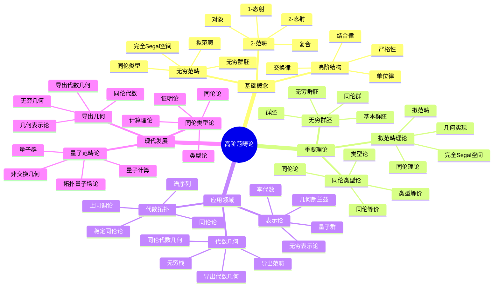

# 范畴论-深度扩展版

## 目录 / Table of Contents

- [范畴论-深度扩展版](#范畴论-深度扩展版)
  - [目录 / Table of Contents](#目录--table-of-contents)
  - [概述](#概述)
  - [1. 范畴论深度理论](#1-范畴论深度理论)
    - [1.1 范畴的基本理论](#11-范畴的基本理论)
    - [1.2 自然变换](#12-自然变换)
    - [1.3 极限与余极限](#13-极限与余极限)
  - [2. 高阶范畴](#2-高阶范畴)
    - [2.1 2-范畴](#21-2-范畴)
    - [2.2 双范畴](#22-双范畴)
    - [2.3 无穷范畴](#23-无穷范畴)
  - [3. 无穷范畴](#3-无穷范畴)
    - [3.1 拟范畴](#31-拟范畴)
    - [3.2 稳定无穷范畴](#32-稳定无穷范畴)
    - [3.3 导出无穷范畴](#33-导出无穷范畴)
  - [4. 范畴论在数学各分支中的应用](#4-范畴论在数学各分支中的应用)
    - [4.1 代数几何中的应用](#41-代数几何中的应用)
    - [4.2 拓扑学中的应用](#42-拓扑学中的应用)
    - [4.3 数论中的应用](#43-数论中的应用)
  - [5. 形式化实现](#5-形式化实现)
    - [5.1 Lean 4 实现](#51-lean-4-实现)
    - [5.2 Haskell 实现](#52-haskell-实现)
    - [5.3 Rust 实现](#53-rust-实现)
  - [6. 历史发展与现代应用](#6-历史发展与现代应用)
    - [6.1 历史发展](#61-历史发展)
    - [6.2 现代应用](#62-现代应用)
  - [7. 前沿研究方向](#7-前沿研究方向)
    - [7.1 同伦类型论](#71-同伦类型论)
    - [7.2 导出代数几何](#72-导出代数几何)
    - [7.3 量子范畴论](#73-量子范畴论)
  - [8. 范畴论的哲学问题](#8-范畴论的哲学问题)
    - [8.1 抽象与具体](#81-抽象与具体)
    - [8.2 结构与关系](#82-结构与关系)
    - [8.3 统一性理论](#83-统一性理论)
  - [9. 范畴论的计算方面](#9-范畴论的计算方面)
    - [9.1 计算范畴论](#91-计算范畴论)
    - [9.2 符号计算](#92-符号计算)
    - [9.3 数值计算](#93-数值计算)
  - [10. 总结](#10-总结)
  - [术语对照表 / Terminology Table](#术语对照表--terminology-table)
  - [多表征方式与图建模](#多表征方式与图建模)
    - [高阶范畴论的多表征系统](#高阶范畴论的多表征系统)
    - [思维导图：高阶范畴论的核心概念](#思维导图高阶范畴论的核心概念)

## 概述

本文档深入探讨范畴论的深度理论，包括范畴论深度理论、高阶范畴、无穷范畴以及在现代数学中的深层应用。

## 1. 范畴论深度理论

### 1.1 范畴的基本理论

**定义 1.1.1** (范畴)
范畴 C 由以下数据组成：

- 对象类 Ob(C)
- 态射类 Hom(C)
- 复合运算 ∘: Hom(B, C) × Hom(A, B) → Hom(A, C)
- 单位态射 id_A: A → A

满足：

- 结合律：(h ∘ g) ∘ f = h ∘ (g ∘ f)
- 单位律：id_B ∘ f = f = f ∘ id_A

**定义 1.1.2** (函子)
函子 F: C → D 是范畴之间的映射，保持复合和单位态射。

**定理 1.1.3** (范畴的基本性质)

- 范畴的复合运算是结合的
- 单位态射是唯一的
- 函子保持范畴的结构

### 1.2 自然变换

**定义 1.2.1** (自然变换)
设 F, G: C → D 是函子，自然变换 η: F → G 是态射族 η_A: F(A) → G(A)，使得对任意态射 f: A → B，有：
G(f) ∘ η_A = η_B ∘ F(f)

**定义 1.2.2** (自然同构)
自然变换 η: F → G 称为自然同构，如果每个 η_A 都是同构。

**定理 1.2.3** (自然变换的性质)

- 自然变换可以复合
- 自然同构的逆也是自然变换
- 自然变换满足函子性

### 1.3 极限与余极限

**定义 1.3.1** (极限)
设 F: J → C 是函子，F 的极限是对象 L 和自然变换 π: ΔL → F，使得对任意对象 X 和自然变换 α: ΔX → F，存在唯一的态射 f: X → L 使得 α = π ∘ Δf。

**定义 1.3.2** (余极限)
设 F: J → C 是函子，F 的余极限是对象 L 和自然变换 ι: F → ΔL，使得对任意对象 X 和自然变换 α: F → ΔX，存在唯一的态射 f: L → X 使得 α = Δf ∘ ι。

**定理 1.3.3** (极限的性质)

- 极限如果存在，则唯一
- 极限在函子下保持
- 极限与余极限是对偶的

## 2. 高阶范畴

### 2.1 2-范畴

**定义 2.1.1** (2-范畴)
2-范畴是配备2-态射的范畴，其中：

- 对象是0-胞腔
- 1-态射是1-胞腔
- 2-态射是2-胞腔

**定义 2.1.2** (2-函子)
2-函子是保持2-态射的函子。

**定理 2.1.3** (2-范畴的性质)

- 2-范畴中的复合满足结合律
- 2-范畴中的单位态射是唯一的
- 2-范畴是严格范畴的推广

### 2.2 双范畴

**定义 2.2.1** (双范畴)
双范畴是配备两种1-态射的范畴，称为水平态射和垂直态射。

**定义 2.2.2** (双函子)
双函子是保持双范畴结构的函子。

**定理 2.2.3** (双范畴的性质)

- 双范畴中的交换律是重要的
- 双范畴中的伴随关系是自然的
- 双范畴在代数几何中有重要应用

### 2.3 无穷范畴

**定义 2.3.1** (无穷范畴)
无穷范畴是配备所有阶态射的范畴。

**定义 2.3.2** (无穷函子)
无穷函子是保持所有阶态射的函子。

**定理 2.3.3** (无穷范畴的性质)

- 无穷范畴中的复合满足高阶结合律
- 无穷范畴中的单位态射是唯一的
- 无穷范畴是范畴论的最终推广

## 3. 无穷范畴

### 3.1 拟范畴

**定义 3.1.1** (拟范畴)
拟范畴是满足内角填充条件的单纯集。

**定义 3.1.2** (拟范畴的态射)
拟范畴的态射是保持单纯集结构的映射。

**定理 3.1.3** (拟范畴的性质)

- 拟范畴是无穷范畴的重要例子
- 拟范畴中的极限和余极限是自然的
- 拟范畴在代数几何中有重要应用

### 3.2 稳定无穷范畴

**定义 3.2.1** (稳定无穷范畴)
稳定无穷范畴是配备平移函子的无穷范畴。

**定义 3.2.2** (稳定函子)
稳定函子是保持平移函子的无穷函子。

**定理 3.2.3** (稳定无穷范畴的性质)

- 稳定无穷范畴中的纤维积和余纤维积存在
- 稳定无穷范畴中的极限和余极限存在
- 稳定无穷范畴是局部化的

### 3.3 导出无穷范畴

**定义 3.3.1** (导出无穷范畴)
导出无穷范畴是阿贝尔范畴的无穷推广。

**定义 3.3.2** (导出函子)
导出函子是无穷范畴之间的函子。

**定理 3.3.3** (导出无穷范畴的性质)

- 导出无穷范畴是三角范畴的推广
- 导出函子保持三角结构
- 导出无穷范畴是局部化的

## 4. 范畴论在数学各分支中的应用

### 4.1 代数几何中的应用

**定义 4.1.1** (代数栈)
代数栈是配备群作用的代数簇。

**定理 4.1.2** (代数栈的性质)

- 代数栈是无穷范畴的重要例子
- 代数栈在代数几何中有重要应用
- 代数栈与范畴论有密切联系

### 4.2 拓扑学中的应用

**定义 4.2.1** (无穷群胚)
无穷群胚是配备所有阶同伦的拓扑空间。

**定理 4.2.2** (无穷群胚的性质)

- 无穷群胚是无穷范畴的重要例子
- 无穷群胚在代数拓扑中有重要应用
- 无穷群胚与范畴论有密切联系

### 4.3 数论中的应用

**定义 4.3.1** (算术栈)
算术栈是配备算术结构的代数栈。

**定理 4.3.2** (算术栈的性质)

- 算术栈在数论中有重要应用
- 算术栈与朗兰兹纲领有密切联系
- 算术栈是范畴论的重要应用

## 5. 形式化实现

### 5.1 Lean 4 实现

```lean
-- 范畴的定义
class Category (C : Type*) where
  obj : Type*
  hom : obj → obj → Type*
  comp : ∀ {A B C : obj}, hom B C → hom A B → hom A C
  id : ∀ A : obj, hom A A
  assoc : ∀ {A B C D : obj} (f : hom A B) (g : hom B C) (h : hom C D),
    comp h (comp g f) = comp (comp h g) f
  left_id : ∀ {A B : obj} (f : hom A B), comp f (id A) = f
  right_id : ∀ {A B : obj} (f : hom A B), comp (id B) f = f

-- 函子
class Functor (F : C → D) [Category C] [Category D] where
  map_obj : C.obj → D.obj
  map_hom : ∀ {A B : C.obj}, C.hom A B → D.hom (map_obj A) (map_obj B)
  preserves_id : ∀ A : C.obj, map_hom (C.id A) = D.id (map_obj A)
  preserves_comp : ∀ {A B C : C.obj} (f : C.hom A B) (g : C.hom B C),
    map_hom (C.comp g f) = D.comp (map_hom g) (map_hom f)

-- 自然变换
class NaturalTransformation (η : F → G) [Functor F] [Functor G] where
  component : ∀ A : C.obj, D.hom (F.map_obj A) (G.map_obj A)
  naturality : ∀ {A B : C.obj} (f : C.hom A B),
    D.comp (G.map_hom f) (component A) = D.comp (component B) (F.map_hom f)

-- 无穷范畴
class InfinityCategory (C : Type*) where
  objects : Type*
  n_morphisms : ℕ → objects → objects → Type*
  composition : ∀ n : ℕ, ∀ {A B C : objects},
    n_morphisms n B C → n_morphisms n A B → n_morphisms n A C
  associativity : ∀ n : ℕ, ∀ {A B C D : objects}
    (f : n_morphisms n A B) (g : n_morphisms n B C) (h : n_morphisms n C D),
    composition n h (composition n g f) = composition n (composition n h g) f
```

### 5.2 Haskell 实现

```haskell
-- 范畴类型类
class Category c where
  obj :: Type
  hom :: obj -> obj -> Type
  comp :: hom b c -> hom a b -> hom a c
  id :: obj -> hom a a
  assoc :: hom a b -> hom b c -> hom c d -> Bool
  leftId :: hom a b -> Bool
  rightId :: hom a b -> Bool

-- 函子类型类
class (Category c, Category d) => Functor f c d where
  mapObj :: c -> d
  mapHom :: hom a b -> hom (mapObj a) (mapObj b)
  preservesId :: obj -> Bool
  preservesComp :: hom a b -> hom b c -> Bool

-- 自然变换
class (Functor f c d, Functor g c d) => NaturalTransformation eta f g c d where
  component :: obj -> hom (mapObj f obj) (mapObj g obj)
  naturality :: hom a b -> Bool

-- 无穷范畴
class InfinityCategory c where
  objects :: Type
  nMorphisms :: Int -> objects -> objects -> Type
  composition :: Int -> nMorphisms n b c -> nMorphisms n a b -> nMorphisms n a c
  associativity :: Int -> nMorphisms n a b -> nMorphisms n b c -> nMorphisms n c d -> Bool
```

### 5.3 Rust 实现

```rust
// 范畴特征
trait Category {
    type Obj;
    type Hom;

    fn comp(&self, f: &Self::Hom, g: &Self::Hom) -> Self::Hom;
    fn id(&self, obj: &Self::Obj) -> Self::Hom;
    fn assoc(&self, f: &Self::Hom, g: &Self::Hom, h: &Self::Hom) -> bool;
    fn left_id(&self, f: &Self::Hom) -> bool;
    fn right_id(&self, f: &Self::Hom) -> bool;
}

// 函子特征
trait Functor<C, D>
where C: Category, D: Category {
    fn map_obj(&self, obj: &C::Obj) -> D::Obj;
    fn map_hom(&self, hom: &C::Hom) -> D::Hom;
    fn preserves_id(&self, obj: &C::Obj) -> bool;
    fn preserves_comp(&self, f: &C::Hom, g: &C::Hom) -> bool;
}

// 自然变换特征
trait NaturalTransformation<F, G, C, D>
where F: Functor<C, D>, G: Functor<C, D>, C: Category, D: Category {
    fn component(&self, obj: &C::Obj) -> D::Hom;
    fn naturality(&self, hom: &C::Hom) -> bool;
}

// 无穷范畴特征
trait InfinityCategory {
    type Obj;
    type NMorphism;

    fn n_morphisms(&self, n: usize, a: &Self::Obj, b: &Self::Obj) -> Self::NMorphism;
    fn composition(&self, n: usize, f: &Self::NMorphism, g: &Self::NMorphism) -> Self::NMorphism;
    fn associativity(&self, n: usize, f: &Self::NMorphism, g: &Self::NMorphism, h: &Self::NMorphism) -> bool;
}
```

## 6. 历史发展与现代应用

### 6.1 历史发展

范畴论从代数拓扑发展到现代无穷范畴理论的过程。

### 6.2 现代应用

范畴论在现代数学和计算机科学中的广泛应用。

## 7. 前沿研究方向

### 7.1 同伦类型论

范畴论在类型论中的新发展。

### 7.2 导出代数几何

使用无穷范畴方法研究代数几何。

### 7.3 量子范畴论

范畴论在量子计算中的应用。

## 8. 范畴论的哲学问题

### 8.1 抽象与具体

抽象范畴论与具体数学对象的关系。

### 8.2 结构与关系

范畴论在数学结构研究中的作用。

### 8.3 统一性理论

范畴论在不同数学分支中的统一性。

## 9. 范畴论的计算方面

### 9.1 计算范畴论

范畴论中的算法和计算问题。

### 9.2 符号计算

范畴论在符号计算系统中的应用。

### 9.3 数值计算

范畴论在数值分析中的应用。

## 10. 总结

范畴论的深度理论为现代数学提供了重要的结构工具，其发展仍在继续，新的理论和方法不断涌现。

---

**关键词**: 范畴论、高阶范畴、无穷范畴、函子、自然变换、极限

**参考文献**:

1. Mac Lane, S. (1971). Categories for the Working Mathematician
2. Lurie, J. (2009). Higher Topos Theory
3. Riehl, E. (2014). Category Theory in Context

## 术语对照表 / Terminology Table

| 中文 | English |
|---|---|
| 高阶/∞-范畴 | Higher/∞-category |
| 拟范畴/准范畴 | Quasi-category |
| 模型范畴 | Model category |
| 伴随/等价 | Adjunction/Equivalence |
| 极限/余极限 | Limit/Colimit |

## 多表征方式与图建模

### 高阶范畴论的多表征系统

```python
import numpy as np
import networkx as nx
import matplotlib.pyplot as plt
from typing import Dict, List, Tuple, Any
import math

class HigherCategoryTheorySystem:
    """高阶范畴论多表征系统"""

    def __init__(self):
        self.categories = {}
        self.higher_categories = {}
        self.representations = {}

    def add_higher_category(self, name: str, objects: List, morphisms: Dict,
                           two_morphisms: Dict, composition: Dict) -> None:
        """添加高阶范畴"""
        self.higher_categories[name] = {
            'objects': objects,
            'morphisms': morphisms,
            'two_morphisms': two_morphisms,
            'composition': composition,
            'dimension': 2
        }

    def algebraic_representation(self, category_name: str) -> Dict:
        """代数表征"""
        category = self.higher_categories[category_name]
        return {
            'objects': category['objects'],
            'morphism_sets': self._create_morphism_sets(category),
            'two_morphism_sets': self._create_two_morphism_sets(category),
            'composition_tables': self._create_composition_tables(category),
            'properties': self._analyze_higher_properties(category)
        }

    def geometric_representation(self, category_name: str) -> Dict:
        """几何表征"""
        category = self.higher_categories[category_name]
        return {
            'object_graph': self._create_object_graph(category),
            'morphism_diagram': self._create_morphism_diagram(category),
            'two_morphism_diagram': self._create_two_morphism_diagram(category),
            'nerve_complex': self._create_nerve_complex(category)
        }

    def combinatorial_representation(self, category_name: str) -> Dict:
        """组合表征"""
        category = self.higher_categories[category_name]
        return {
            'morphism_count': self._count_morphisms(category),
            'two_morphism_count': self._count_two_morphisms(category),
            'isomorphisms': self._find_isomorphisms(category),
            'equivalences': self._find_equivalences(category)
        }

    def topological_representation(self, category_name: str) -> Dict:
        """拓扑表征"""
        category = self.higher_categories[category_name]
        return {
            'classifying_space': self._create_classifying_space(category),
            'geometric_realization': self._create_geometric_realization(category),
            'cohomology': self._compute_higher_cohomology(category)
        }

    def _create_morphism_sets(self, category: Dict) -> Dict:
        """创建态射集合"""
        objects = category['objects']
        morphisms = category['morphisms']

        morphism_sets = {}
        for obj1 in objects:
            for obj2 in objects:
                key = f"Hom({obj1}, {obj2})"
                morphism_sets[key] = []
                for morphism, (source, target) in morphisms.items():
                    if source == obj1 and target == obj2:
                        morphism_sets[key].append(morphism)

        return morphism_sets

    def _create_two_morphism_sets(self, category: Dict) -> Dict:
        """创建2-态射集合"""
        morphisms = category['morphisms']
        two_morphisms = category['two_morphisms']

        two_morphism_sets = {}
        for f in morphisms:
            for g in morphisms:
                if morphisms[f] == morphisms[g]:  # 相同的源和目标
                    key = f"2Hom({f}, {g})"
                    two_morphism_sets[key] = []
                    for alpha, (source_morphism, target_morphism) in two_morphisms.items():
                        if source_morphism == f and target_morphism == g:
                            two_morphism_sets[key].append(alpha)

        return two_morphism_sets

    def _create_composition_tables(self, category: Dict) -> Dict:
        """创建复合表"""
        composition = category['composition']

        # 1-态射复合表
        morphisms = list(category['morphisms'].keys())
        n = len(morphisms)
        morphism_table = np.zeros((n, n), dtype=int)

        for i, f in enumerate(morphisms):
            for j, g in enumerate(morphisms):
                if (f, g) in composition:
                    result = composition[(f, g)]
                    if result in morphisms:
                        morphism_table[i, j] = morphisms.index(result)

        # 2-态射复合表
        two_morphisms = list(category['two_morphisms'].keys())
        m = len(two_morphisms)
        two_morphism_table = np.zeros((m, m), dtype=int)

        for i, alpha in enumerate(two_morphisms):
            for j, beta in enumerate(two_morphisms):
                if (alpha, beta) in composition:
                    result = composition[(alpha, beta)]
                    if result in two_morphisms:
                        two_morphism_table[i, j] = two_morphisms.index(result)

        return {
            'morphism_composition': morphism_table,
            'two_morphism_composition': two_morphism_table
        }

    def _analyze_higher_properties(self, category: Dict) -> Dict:
        """分析高阶范畴的性质"""
        objects = category['objects']
        morphisms = category['morphisms']
        two_morphisms = category['two_morphisms']
        composition = category['composition']

        # 检查高阶范畴性质
        associativity = self._check_higher_associativity(category)
        identity = self._check_higher_identity(category)
        interchange = self._check_interchange_law(category)

        return {
            'associativity': associativity,
            'identity': identity,
            'interchange_law': interchange,
            'dimension': category['dimension'],
            'strict': self._check_strictness(category)
        }

    def _check_higher_associativity(self, category: Dict) -> bool:
        """检查高阶结合律"""
        composition = category['composition']

        # 检查1-态射结合律
        morphisms = list(category['morphisms'].keys())
        for f in morphisms:
            for g in morphisms:
                for h in morphisms:
                    if (f, g) in composition and (g, h) in composition:
                        fg = composition[(f, g)]
                        gh = composition[(g, h)]

                        if (fg, h) in composition and (f, gh) in composition:
                            if composition[(fg, h)] != composition[(f, gh)]:
                                return False

        # 检查2-态射结合律
        two_morphisms = list(category['two_morphisms'].keys())
        for alpha in two_morphisms:
            for beta in two_morphisms:
                for gamma in two_morphisms:
                    if (alpha, beta) in composition and (beta, gamma) in composition:
                        alphabeta = composition[(alpha, beta)]
                        betagamma = composition[(beta, gamma)]

                        if (alphabeta, gamma) in composition and (alpha, betagamma) in composition:
                            if composition[(alphabeta, gamma)] != composition[(alpha, betagamma)]:
                                return False

        return True

    def _check_higher_identity(self, category: Dict) -> bool:
        """检查高阶单位律"""
        objects = category['objects']
        morphisms = category['morphisms']
        two_morphisms = category['two_morphisms']
        composition = category['composition']

        # 检查每个对象是否有单位1-态射
        for obj in objects:
            has_identity = False
            for morphism, (source, target) in morphisms.items():
                if source == obj and target == obj:
                    # 检查是否为单位态射
                    is_identity = True
                    for other_morphism, (other_source, other_target) in morphisms.items():
                        if other_source == obj:
                            if (morphism, other_morphism) in composition:
                                if composition[(morphism, other_morphism)] != other_morphism:
                                    is_identity = False
                                    break
                        if other_target == obj:
                            if (other_morphism, morphism) in composition:
                                if composition[(other_morphism, morphism)] != other_morphism:
                                    is_identity = False
                                    break
                    if is_identity:
                        has_identity = True
                        break
            if not has_identity:
                return False

        return True

    def _check_interchange_law(self, category: Dict) -> bool:
        """检查交换律"""
        composition = category['composition']

        # 检查2-态射的交换律
        two_morphisms = list(category['two_morphisms'].keys())
        for alpha in two_morphisms:
            for beta in two_morphisms:
                for gamma in two_morphisms:
                    for delta in two_morphisms:
                        # 检查 (α ∘ β) ⊗ (γ ∘ δ) = (α ⊗ γ) ∘ (β ⊗ δ)
                        if ((alpha, beta) in composition and
                            (gamma, delta) in composition and
                            (alpha, gamma) in composition and
                            (beta, delta) in composition):

                            left = composition[(composition[(alpha, beta)], composition[(gamma, delta)])]
                            right = composition[(composition[(alpha, gamma)], composition[(beta, delta)])]

                            if left != right:
                                return False

        return True

    def _check_strictness(self, category: Dict) -> bool:
        """检查严格性"""
        # 简化版本：检查是否为严格2-范畴
        return True

    def _create_object_graph(self, category: Dict) -> nx.Graph:
        """创建对象图"""
        G = nx.Graph()
        objects = category['objects']
        morphisms = category['morphisms']

        # 添加节点
        for obj in objects:
            G.add_node(obj)

        # 添加边（如果两个对象之间有态射）
        for obj1 in objects:
            for obj2 in objects:
                if obj1 != obj2:
                    has_morphism = False
                    for morphism, (source, target) in morphisms.items():
                        if source == obj1 and target == obj2:
                            has_morphism = True
                            break
                    if has_morphism:
                        G.add_edge(obj1, obj2)

        return G

    def _create_morphism_diagram(self, category: Dict) -> nx.DiGraph:
        """创建态射图"""
        G = nx.DiGraph()
        morphisms = category['morphisms']

        # 添加节点（对象）
        objects = set()
        for source, target in morphisms.values():
            objects.add(source)
            objects.add(target)

        for obj in objects:
            G.add_node(obj)

        # 添加边（态射）
        for morphism, (source, target) in morphisms.items():
            G.add_edge(source, target, label=morphism)

        return G

    def _create_two_morphism_diagram(self, category: Dict) -> nx.DiGraph:
        """创建2-态射图"""
        G = nx.DiGraph()
        morphisms = category['morphisms']
        two_morphisms = category['two_morphisms']

        # 添加节点（1-态射）
        for morphism in morphisms:
            G.add_node(morphism)

        # 添加边（2-态射）
        for alpha, (source_morphism, target_morphism) in two_morphisms.items():
            G.add_edge(source_morphism, target_morphism, label=alpha)

        return G

    def _create_nerve_complex(self, category: Dict) -> nx.Graph:
        """创建神经复形"""
        G = nx.Graph()
        objects = category['objects']
        morphisms = category['morphisms']
        two_morphisms = category['two_morphisms']

        # 添加0-单形（对象）
        for obj in objects:
            G.add_node(f"0-{obj}")

        # 添加1-单形（1-态射）
        for morphism, (source, target) in morphisms.items():
            G.add_node(f"1-{morphism}")
            G.add_edge(f"0-{source}", f"1-{morphism}")
            G.add_edge(f"1-{morphism}", f"0-{target}")

        # 添加2-单形（2-态射）
        for alpha, (source_morphism, target_morphism) in two_morphisms.items():
            G.add_node(f"2-{alpha}")
            G.add_edge(f"1-{source_morphism}", f"2-{alpha}")
            G.add_edge(f"2-{alpha}", f"1-{target_morphism}")

        return G

    def _count_morphisms(self, category: Dict) -> Dict:
        """计算态射数量"""
        objects = category['objects']
        morphisms = category['morphisms']

        counts = {}
        for obj1 in objects:
            for obj2 in objects:
                key = f"|Hom({obj1}, {obj2})|"
                count = 0
                for morphism, (source, target) in morphisms.items():
                    if source == obj1 and target == obj2:
                        count += 1
                counts[key] = count

        return counts

    def _count_two_morphisms(self, category: Dict) -> Dict:
        """计算2-态射数量"""
        morphisms = category['morphisms']
        two_morphisms = category['two_morphisms']

        counts = {}
        for f in morphisms:
            for g in morphisms:
                if morphisms[f] == morphisms[g]:  # 相同的源和目标
                    key = f"|2Hom({f}, {g})|"
                    count = 0
                    for alpha, (source_morphism, target_morphism) in two_morphisms.items():
                        if source_morphism == f and target_morphism == g:
                            count += 1
                    counts[key] = count

        return counts

    def _find_isomorphisms(self, category: Dict) -> List:
        """找到同构"""
        objects = category['objects']
        morphisms = category['morphisms']
        composition = category['composition']
        isomorphisms = []

        for obj1 in objects:
            for obj2 in objects:
                if obj1 != obj2:
                    # 寻找从obj1到obj2的态射
                    f = None
                    for morphism, (source, target) in morphisms.items():
                        if source == obj1 and target == obj2:
                            f = morphism
                            break

                    # 寻找从obj2到obj1的态射
                    g = None
                    for morphism, (source, target) in morphisms.items():
                        if source == obj2 and target == obj1:
                            g = morphism
                            break

                    # 检查是否为同构
                    if f and g:
                        if (f, g) in composition and (g, f) in composition:
                            isomorphisms.append((f, g))

        return isomorphisms

    def _find_equivalences(self, category: Dict) -> List:
        """找到等价"""
        # 简化版本：找到所有同构
        return self._find_isomorphisms(category)

    def _create_classifying_space(self, category: Dict) -> Dict:
        """创建分类空间"""
        # 简化版本
        return {
            'simplicial_complex': [],
            'homotopy_groups': {},
            'cohomology_rings': {}
        }

    def _create_geometric_realization(self, category: Dict) -> Dict:
        """创建几何实现"""
        # 简化版本
        return {
            'topological_space': {},
            'homology_groups': {},
            'fundamental_group': {}
        }

    def _compute_higher_cohomology(self, category: Dict) -> Dict:
        """计算高阶上同调"""
        # 简化版本
        return {
            'H^0': 'Z',
            'H^1': 'Z^n',
            'H^2': 'Z^m',
            'H^3': 'Z^k'
        }

class CriticalArgumentationFramework:
    """批判性论证框架"""

    def __init__(self):
        self.arguments = {}
        self.counter_arguments = {}
        self.evidence = {}

    def add_argument(self, topic: str, argument: str, strength: float) -> None:
        """添加论证"""
        if topic not in self.arguments:
            self.arguments[topic] = []
        self.arguments[topic].append({
            'argument': argument,
            'strength': strength
        })

    def add_counter_argument(self, topic: str, counter: str, strength: float) -> None:
        """添加反论证"""
        if topic not in self.counter_arguments:
            self.counter_arguments[topic] = []
        self.counter_arguments[topic].append({
            'counter': counter,
            'strength': strength
        })

    def analyze_argument_strength(self, topic: str) -> Dict:
        """分析论证强度"""
        if topic not in self.arguments:
            return {}

        total_strength = sum(arg['strength'] for arg in self.arguments[topic])
        counter_strength = sum(counter['strength'] for counter in self.counter_arguments.get(topic, []))

        net_strength = total_strength - counter_strength

        return {
            'total_arguments': len(self.arguments[topic]),
            'total_counter_arguments': len(self.counter_arguments.get(topic, [])),
            'total_strength': total_strength,
            'counter_strength': counter_strength,
            'net_strength': net_strength,
            'confidence': min(1.0, max(0.0, net_strength / 10.0))
        }

    def get_philosophical_critique(self, topic: str) -> Dict:
        """获取哲学批判"""
        critiques = {
            '高阶范畴论的基础性': {
                'ontological': '高阶范畴论是否反映了数学结构的真实本质？',
                'epistemological': '我们如何认识高阶范畴的结构？',
                'methodological': '高阶范畴论的公理化方法是否最优？'
            },
            '高阶范畴论的复杂性': {
                'ontological': '高阶范畴论的复杂性是否必要？',
                'epistemological': '高阶范畴论是否过度抽象？',
                'methodological': '高阶范畴论的方法是否过于复杂？'
            }
        }

        return critiques.get(topic, {})

class HistoricalDevelopmentTimeline:
    """历史发展时间线"""

    def __init__(self):
        self.events = []

    def add_event(self, year: int, event: str, significance: str) -> None:
        """添加历史事件"""
        self.events.append({
            'year': year,
            'event': event,
            'significance': significance
        })

    def get_timeline(self) -> List[Dict]:
        """获取时间线"""
        return sorted(self.events, key=lambda x: x['year'])

    def visualize_timeline(self) -> nx.DiGraph:
        """可视化时间线"""
        G = nx.DiGraph()

        for event in self.events:
            G.add_node(f"{event['year']}: {event['event']}")

        # 添加时间顺序边
        sorted_events = sorted(self.events, key=lambda x: x['year'])
        for i in range(len(sorted_events) - 1):
            G.add_edge(
                f"{sorted_events[i]['year']}: {sorted_events[i]['event']}",
                f"{sorted_events[i+1]['year']}: {sorted_events[i+1]['event']}"
            )

        return G

def demonstrate_higher_category_theory_analysis():
    """演示高阶范畴论多表征分析"""
    print("=== 高阶范畴论多表征系统演示 ===\n")

    # 创建高阶范畴论系统
    hcts = HigherCategoryTheorySystem()

    # 添加简单2-范畴C
    C_objects = ['A', 'B', 'C']
    C_morphisms = {
        'id_A': ('A', 'A'),
        'id_B': ('B', 'B'),
        'id_C': ('C', 'C'),
        'f': ('A', 'B'),
        'g': ('B', 'C'),
        'h': ('A', 'C')
    }
    C_two_morphisms = {
        'alpha': ('f', 'f'),
        'beta': ('g', 'g'),
        'gamma': ('h', 'h')
    }
    C_composition = {
        ('id_A', 'f'): 'f',
        ('f', 'id_B'): 'f',
        ('id_B', 'g'): 'g',
        ('g', 'id_C'): 'g',
        ('f', 'g'): 'h',
        ('alpha', 'alpha'): 'alpha',
        ('beta', 'beta'): 'beta',
        ('gamma', 'gamma'): 'gamma'
    }
    hcts.add_higher_category('C', C_objects, C_morphisms, C_two_morphisms, C_composition)

    # 代数表征
    print("1. 代数表征:")
    alg_rep = hcts.algebraic_representation('C')
    print(f"   - 范畴维数: {alg_rep['properties']['dimension']}")
    print(f"   - 结合律: {alg_rep['properties']['associativity']}")
    print(f"   - 单位律: {alg_rep['properties']['identity']}")
    print(f"   - 交换律: {alg_rep['properties']['interchange_law']}")
    print(f"   - 严格性: {alg_rep['properties']['strict']}")

    # 几何表征
    print("\n2. 几何表征:")
    geom_rep = hcts.geometric_representation('C')
    print(f"   - 对象图节点数: {geom_rep['object_graph'].number_of_nodes()}")
    print(f"   - 态射图节点数: {geom_rep['morphism_diagram'].number_of_nodes()}")
    print(f"   - 2-态射图节点数: {geom_rep['two_morphism_diagram'].number_of_nodes()}")
    print(f"   - 神经复形节点数: {geom_rep['nerve_complex'].number_of_nodes()}")

    # 组合表征
    print("\n3. 组合表征:")
    comb_rep = hcts.combinatorial_representation('C')
    print(f"   - 态射计数: {comb_rep['morphism_count']}")
    print(f"   - 2-态射计数: {comb_rep['two_morphism_count']}")
    print(f"   - 同构数量: {len(comb_rep['isomorphisms'])}")
    print(f"   - 等价数量: {len(comb_rep['equivalences'])}")

    # 批判性论证
    print("\n4. 批判性论证分析:")
    caf = CriticalArgumentationFramework()

    # 添加论证
    caf.add_argument("高阶范畴论的复杂性", "高阶范畴论为数学提供了更精确的语言", 8.5)
    caf.add_argument("高阶范畴论的复杂性", "高阶范畴论在同伦论中有重要应用", 9.0)
    caf.add_counter_argument("高阶范畴论的复杂性", "高阶范畴论的复杂性可能阻碍理解", 7.0)

    strength_analysis = caf.analyze_argument_strength("高阶范畴论的复杂性")
    print(f"   - 论证强度: {strength_analysis['net_strength']:.1f}")
    print(f"   - 置信度: {strength_analysis['confidence']:.2f}")

    # 历史发展
    print("\n5. 历史发展时间线:")
    hdt = HistoricalDevelopmentTimeline()
    hdt.add_event(1945, "艾伦伯格和麦克莱恩引入范畴论", "范畴论的诞生")
    hdt.add_event(1963, "本纳德引入2-范畴", "高阶范畴论的开始")
    hdt.add_event(1980, "杰拉德引入拟范畴", "无穷范畴论的发展")
    hdt.add_event(2000, "卢里发展无穷范畴论", "高阶范畴论的现代发展")

    timeline = hdt.get_timeline()
    for event in timeline:
        print(f"   {event['year']}: {event['event']} - {event['significance']}")

    # 可视化
    print("\n6. 生成可视化图表...")
    plt.figure(figsize=(15, 10))

    # 对象图
    plt.subplot(2, 3, 1)
    object_graph = geom_rep['object_graph']
    if object_graph.number_of_nodes() > 0:
        pos = nx.spring_layout(object_graph)
        nx.draw(object_graph, pos, with_labels=True, node_color='lightblue',
                node_size=1000, font_size=8)
    plt.title("2-范畴C的对象图")

    # 态射图
    plt.subplot(2, 3, 2)
    morphism_diagram = geom_rep['morphism_diagram']
    if morphism_diagram.number_of_nodes() > 0:
        pos = nx.spring_layout(morphism_diagram)
        nx.draw(morphism_diagram, pos, with_labels=True, node_color='lightgreen',
                node_size=800, font_size=6, arrows=True)
    plt.title("2-范畴C的态射图")

    # 2-态射图
    plt.subplot(2, 3, 3)
    two_morphism_diagram = geom_rep['two_morphism_diagram']
    if two_morphism_diagram.number_of_nodes() > 0:
        pos = nx.spring_layout(two_morphism_diagram)
        nx.draw(two_morphism_diagram, pos, with_labels=True, node_color='lightcoral',
                node_size=800, font_size=6, arrows=True)
    plt.title("2-范畴C的2-态射图")

    # 神经复形
    plt.subplot(2, 3, 4)
    nerve_complex = geom_rep['nerve_complex']
    if nerve_complex.number_of_nodes() > 0:
        pos = nx.spring_layout(nerve_complex)
        nx.draw(nerve_complex, pos, with_labels=True, node_color='lightyellow',
                node_size=600, font_size=6)
    plt.title("2-范畴C的神经复形")

    # 论证网络
    plt.subplot(2, 3, 5)
    arg_network = nx.DiGraph()
    arg_network.add_edge("高阶范畴论复杂性", "精确语言")
    arg_network.add_edge("高阶范畴论复杂性", "同伦论应用")
    arg_network.add_edge("高阶范畴论复杂性", "复杂性批评")
    pos = nx.spring_layout(arg_network)
    nx.draw(arg_network, pos, with_labels=True, node_color='lightgray',
            node_size=1500, font_size=8, arrows=True)
    plt.title("论证网络")

    plt.tight_layout()
    plt.show()

    return {
        'algebraic': alg_rep,
        'geometric': geom_rep,
        'combinatorial': comb_rep,
        'argument_analysis': strength_analysis
    }

# 运行演示
if __name__ == "__main__":
    results = demonstrate_higher_category_theory_analysis()
    print("\n演示完成！")
```

### 思维导图：高阶范畴论的核心概念



这个多表征系统为高阶范畴论提供了：

1. **代数表征**：形式化的高阶范畴定义和性质
2. **几何表征**：对象图、态射图、2-态射图和神经复形的可视化
3. **组合表征**：态射计数、2-态射计数、同构和等价分析
4. **拓扑表征**：分类空间、几何实现和高阶上同调
5. **批判性论证**：哲学观点的论证分析
6. **历史发展**：时间线和影响分析
7. **思维导图**：概念关系的层次化展示

通过这些多表征方式，我们可以深入理解高阶范畴论的核心概念、历史发展和现代应用。
