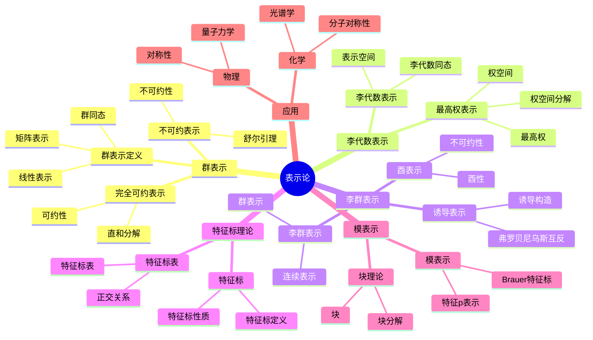

# 16.1 表示论基础 / Representation Theory Foundations

**主题编号**: B.02.07
**创建日期**: 2025年11月21日
**最后更新**: 2025年11月21日

---

## 学习路径与知识图谱 / Learning Paths and Knowledge Graphs

### 学习路径 / Learning Paths

- [表示论学习路径样例](../../学习路径样例-表示论.md) - 5条分层学习路径，从群表示到李代数表示
- [Representation Theory Learning Paths](../../学习路径样例-表示论.md) - 5-tier learning paths from group to Lie algebra representations

### 知识图谱 / Knowledge Graphs

- [表示论-核心知识图谱](../../知识关联图谱样例-表示论-核心.yaml) - 核心概念关系图
- [Representation Theory-Core Knowledge Graph](../../知识关联图谱样例-表示论-核心.yaml) - Core concept relationship diagram

---

## 目录 / Table of Contents

- [16.1 表示论基础 / Representation Theory Foundations](#161-表示论基础--representation-theory-foundations)
  - [学习路径与知识图谱 / Learning Paths and Knowledge Graphs](#学习路径与知识图谱--learning-paths-and-knowledge-graphs)
    - [学习路径 / Learning Paths](#学习路径--learning-paths)
    - [知识图谱 / Knowledge Graphs](#知识图谱--knowledge-graphs)
  - [目录 / Table of Contents](#目录--table-of-contents)
  - [16.1.1 引言 / Introduction (编号: B.02.07.01)](#1611-引言--introduction-编号-b020701)
  - [🗺️ 表示论核心概念思维导图](#️-表示论核心概念思维导图)
  - [📊 表示论核心概念多维知识矩阵](#-表示论核心概念多维知识矩阵)
  - [16.1.2 群表示 / Group Representations (编号: B.02.07.02)](#1612-群表示--group-representations-编号-b020702)
    - [群表示的定义 / Definition of Group Representations](#群表示的定义--definition-of-group-representations)
    - [不可约表示 / Irreducible Representations](#不可约表示--irreducible-representations)
    - [完全可约表示 / Completely Reducible Representations](#完全可约表示--completely-reducible-representations)
  - [16.1.3 李代数表示 / Lie Algebra Representations (编号: B.02.07.03)](#1613-李代数表示--lie-algebra-representations-编号-b020703)
    - [李代数表示的定义 / Definition of Lie Algebra Representations](#李代数表示的定义--definition-of-lie-algebra-representations)
    - [最高权表示 / Highest Weight Representations](#最高权表示--highest-weight-representations)
    - [权空间分解 / Weight Space Decomposition](#权空间分解--weight-space-decomposition)
  - [16.1.4 李群表示 / Lie Group Representations (编号: B.02.07.04)](#1614-李群表示--lie-group-representations-编号-b020704)
    - [李群表示的定义 / Definition of Lie Group Representations](#李群表示的定义--definition-of-lie-group-representations)
    - [酉表示 / Unitary Representations](#酉表示--unitary-representations)
    - [诱导表示 / Induced Representations](#诱导表示--induced-representations)
  - [16.1.5 特征标理论 / Character Theory (编号: B.02.07.05)](#1615-特征标理论--character-theory-编号-b020705)
    - [特征标的定义 / Definition of Characters](#特征标的定义--definition-of-characters)
    - [特征标表 / Character Tables](#特征标表--character-tables)
    - [正交关系 / Orthogonality Relations](#正交关系--orthogonality-relations)
  - [16.1.6 模表示 / Modular Representations (编号: B.02.07.06)](#1616-模表示--modular-representations-编号-b020706)
    - [模表示的定义 / Definition of Modular Representations](#模表示的定义--definition-of-modular-representations)
    - [Brauer特征标 / Brauer Characters](#brauer特征标--brauer-characters)
    - [块理论 / Block Theory](#块理论--block-theory)
  - [16.1.7 形式化实现 / Formal Implementation (编号: B.02.07.07)](#1617-形式化实现--formal-implementation-编号-b020707)
    - [Lean 4 实现 / Lean 4 Implementation](#lean-4-实现--lean-4-implementation)
    - [Haskell 实现 / Haskell Implementation](#haskell-实现--haskell-implementation)
  - [16.1.8 应用与扩展 / Applications and Extensions (编号: B.02.07.08)](#1618-应用与扩展--applications-and-extensions-编号-b020708)
    - [物理学应用 / Physics Applications](#物理学应用--physics-applications)
    - [化学应用 / Chemistry Applications](#化学应用--chemistry-applications)
  - [16.1.9 总结 / Summary](#1619-总结--summary)
    - [关键要点 / Key Points](#关键要点--key-points)
  - [16.1.10 历史发展 / Historical Development](#16110-历史发展--historical-development)
    - [16.1.10.1 表示论发展历史 / Historical Development of Representation Theory](#161101-表示论发展历史--historical-development-of-representation-theory)
      - [早期发展](#早期发展)
      - [20世纪发展](#20世纪发展)
      - [现代发展](#现代发展)
      - [当代发展](#当代发展)
    - [16.1.10.2 重要人物贡献 / Important Figures and Contributions](#161102-重要人物贡献--important-figures-and-contributions)
      - [费迪南德·弗罗贝尼乌斯 (1849-1917)](#费迪南德弗罗贝尼乌斯-1849-1917)
      - [伊萨·舒尔 (1875-1941)](#伊萨舒尔-1875-1941)
      - [赫尔曼·外尔 (1885-1955)](#赫尔曼外尔-1885-1955)
      - [埃利·嘉当 (1869-1951)](#埃利嘉当-1869-1951)
      - [理查德·布劳尔 (1901-1977)](#理查德布劳尔-1901-1977)
    - [16.1.10.3 重要事件 / Important Events](#161103-重要事件--important-events)
      - [19世纪重要事件](#19世纪重要事件)
      - [20世纪重要事件](#20世纪重要事件)
      - [21世纪重要事件](#21世纪重要事件)
  - [16.1.11 相关概念 / Related Concepts](#16111-相关概念--related-concepts)
    - [16.1.11.1 基础数学关联 / Basic Mathematics Connections](#161111-基础数学关联--basic-mathematics-connections)
      - [线性代数](#线性代数)
      - [群论](#群论)
      - [环论](#环论)
    - [16.1.11.2 高级数学关联 / Advanced Mathematics Connections](#161112-高级数学关联--advanced-mathematics-connections)
      - [代数](#代数)
      - [几何](#几何)
      - [分析](#分析)
    - [16.1.11.3 应用领域关联 / Application Domain Connections](#161113-应用领域关联--application-domain-connections)
      - [物理学](#物理学)
      - [化学](#化学)
      - [计算机科学](#计算机科学)
  - [16.1.12 参考文献 / References](#16112-参考文献--references)
    - [经典教材 / Classic Textbooks](#经典教材--classic-textbooks)
    - [表示论教材 / Representation Theory Textbooks](#表示论教材--representation-theory-textbooks)
    - [高级表示论教材 / Advanced Representation Theory Textbooks](#高级表示论教材--advanced-representation-theory-textbooks)
    - [历史文献 / Historical Literature](#历史文献--historical-literature)
    - [中文教材 / Chinese Textbooks](#中文教材--chinese-textbooks)
    - [现代发展文献 / Modern Development Literature](#现代发展文献--modern-development-literature)

---

## 16.1.1 引言 / Introduction (编号: B.02.07.01)

表示论是研究代数结构在向量空间上作用的重要数学分支，它将抽象的代数结构转化为具体的线性变换，从而利用线性代数的工具来研究代数结构的性质。表示论在数学、物理、化学等领域有广泛应用。

**Representation theory is an important branch of mathematics that studies the actions of algebraic structures on vector spaces, transforming abstract algebraic structures into concrete linear transformations, thus utilizing tools from linear algebra to study the properties of algebraic structures. Representation theory has wide applications in mathematics, physics, chemistry, and other fields.**

## 🗺️ 表示论核心概念思维导图



## 📊 表示论核心概念多维知识矩阵

| 概念类别 | 核心概念 | 定义要点 | 关键性质 | 典型例子 | 应用场景 |
|---------|---------|---------|---------|---------|---------|
| 群表示 | 群表示 | 群同态到GL(V) | 线性作用 | ρ: G→GL(V) | 群研究 |
| 群表示 | 不可约表示 | 无非平凡子表示 | 舒尔引理 | 不可约表示 | 表示分类 |
| 群表示 | 完全可约表示 | 直和分解 | 半单性 | 有限群表示 | 表示分解 |
| 李代数表示 | 李代数表示 | 李代数同态 | 线性作用 | ρ: 𝔤→gl(V) | 李代数研究 |
| 李代数表示 | 最高权表示 | 最高权 | 权空间分解 | 有限维表示 | 表示分类 |
| 李群表示 | 李群表示 | 群表示 | 连续性 | 连续表示 | 李群研究 |
| 李群表示 | 酉表示 | 酉性 | 不可约性 | 酉表示 | 表示分类 |
| 特征标理论 | 特征标 | 表示迹 | 类函数 | χ(g)=tr(ρ(g)) | 表示研究 |
| 特征标理论 | 特征标表 | 特征标矩阵 | 正交关系 | 特征标表 | 表示分类 |
| 模表示 | 模表示 | 特征p表示 | Brauer特征标 | 模表示 | 表示论 |
| 模表示 | 块理论 | 块分解 | 块分类 | 块 | 表示分类 |
| 应用 | 对称性 | 群表示 | 守恒定律 | 物理对称性 | 物理 |
| 应用 | 分子对称性 | 点群表示 | 光谱学 | 分子轨道 | 化学 |

## 16.1.2 群表示 / Group Representations (编号: B.02.07.02)

### 群表示的定义 / Definition of Group Representations

**定义 16.1.1** (群表示 / Group Representation)
设 $G$ 是一个群，$V$ 是域 $F$ 上的向量空间。群 $G$ 在向量空间 $V$ 上的表示是一个群同态 $\rho: G \to GL(V)$，其中 $GL(V)$ 是 $V$ 上的一般线性群。

**Definition 16.1.1** (Group Representation)
Let $G$ be a group and $V$ be a vector space over a field $F$. A representation of the group $G$ on the vector space $V$ is a group homomorphism $\rho: G \to GL(V)$, where $GL(V)$ is the general linear group of $V$.

**符号说明 / Symbol Explanation**:

- $G$: 群 (group)
- $V$: 向量空间 (vector space)
- $F$: 域 (field)
- $\rho$: 表示映射 (representation map)
- $GL(V)$: 一般线性群 (general linear group)

**条件说明 / Condition Explanation**:

- 群同态: $\rho$ 保持群运算，即 $\rho(gh) = \rho(g)\rho(h)$
- 单位元: $\rho(e) = I$，其中 $e$ 是群 $G$ 的单位元，$I$ 是单位矩阵
- 逆元: $\rho(g^{-1}) = \rho(g)^{-1}$

**实例表征 / Instance Representation**:

**基础实例**：

- **平凡表示**: $\rho(g) = I$ 对所有 $g \in G$ - 每个群元素都映射到单位矩阵
- **正则表示**: $\rho(g)$ 是 $G$ 在自身上的左乘作用

**标准实例**：

- **置换表示**: 对称群 $S_n$ 在 $n$ 维向量空间上的表示
- **循环群表示**: 循环群 $\mathbb{Z}/n\mathbb{Z}$ 的表示

### 不可约表示 / Irreducible Representations

**定义 16.1.2** (不可约表示 / Irreducible Representation)
表示 $(\rho, V)$ 是不可约的，如果 $V$ 没有非平凡的 $G$-不变子空间。

**Definition 16.1.2** (Irreducible Representation)
A representation $(\rho, V)$ is irreducible if $V$ has no non-trivial $G$-invariant subspaces.

**实例表征 / Instance Representation**:

**基础实例**：

- **一维表示**: 任何一维表示都是不可约的
- **二维不可约表示**: $D_3$ 群的二维不可约表示

**标准实例**：

- **$S_3$ 的不可约表示**: 对称群 $S_3$ 的三个不可约表示
- **$A_4$ 的不可约表示**: 交错群 $A_4$ 的不可约表示

### 完全可约表示 / Completely Reducible Representations

**定义 16.1.3** (完全可约表示 / Completely Reducible Representation)
表示 $(\rho, V)$ 是完全可约的，如果它可以分解为不可约表示的直和。

**Definition 16.1.3** (Completely Reducible Representation)
A representation $(\rho, V)$ is completely reducible if it can be decomposed as a direct sum of irreducible representations.

**实例表征 / Instance Representation**:

**基础实例**：

- **有限群表示**: 有限群在特征零域上的表示是完全可约的
- **紧群表示**: 紧李群的表示是完全可约的

**标准实例**：

- **$S_n$ 的表示**: 对称群 $S_n$ 的表示是完全可约的
- **$GL(n, \mathbb{C})$ 的表示**: 一般线性群的表示

## 16.1.3 李代数表示 / Lie Algebra Representations (编号: B.02.07.03)

### 李代数表示的定义 / Definition of Lie Algebra Representations

**定义 16.1.4** (李代数表示 / Lie Algebra Representation)
李代数 $\mathfrak{g}$ 在向量空间 $V$ 上的表示是一个李代数同态 $\rho: \mathfrak{g} \to \mathfrak{gl}(V)$。

**Definition 16.1.4** (Lie Algebra Representation)
A representation of a Lie algebra $\mathfrak{g}$ on a vector space $V$ is a Lie algebra homomorphism $\rho: \mathfrak{g} \to \mathfrak{gl}(V)$.

**实例表征 / Instance Representation**:

**基础实例**：

- **伴随表示**: $\text{ad}: \mathfrak{g} \to \mathfrak{gl}(\mathfrak{g})$ - 李代数在自身上的伴随表示
- **平凡表示**: $\rho(x) = 0$ 对所有 $x \in \mathfrak{g}$ - 零表示

**标准实例**：

- **$\mathfrak{sl}_2$ 的表示**: 特殊线性李代数 $\mathfrak{sl}_2$ 的表示
- **$\mathfrak{so}_3$ 的表示**: 特殊正交李代数 $\mathfrak{so}_3$ 的表示

### 最高权表示 / Highest Weight Representations

**定义 16.1.5** (最高权表示 / Highest Weight Representation)
对于半单李代数 $\mathfrak{g}$，最高权表示是具有最高权的不可约表示。

**Definition 16.1.5** (Highest Weight Representation)
For a semisimple Lie algebra $\mathfrak{g}$, a highest weight representation is an irreducible representation with a highest weight.

**实例表征 / Instance Representation**:

**基础实例**：

- **$\mathfrak{sl}_2$ 的最高权表示**: 由最高权 $n$ 参数化的不可约表示
- **$\mathfrak{sl}_3$ 的最高权表示**: 由两个最高权参数化的不可约表示

**标准实例**：

- **基本表示**: 基本权的最高权表示
- **伴随表示**: 最高根的最高权表示

### 权空间分解 / Weight Space Decomposition

**定义 16.1.6** (权空间分解 / Weight Space Decomposition)
对于李代数表示 $(\rho, V)$，权空间分解是 $V = \bigoplus_{\lambda} V_\lambda$，其中 $V_\lambda$ 是权 $\lambda$ 的权空间。

**Definition 16.1.6** (Weight Space Decomposition)
For a Lie algebra representation $(\rho, V)$, the weight space decomposition is $V = \bigoplus_{\lambda} V_\lambda$, where $V_\lambda$ is the weight space of weight $\lambda$.

**实例表征 / Instance Representation**:

**基础实例**：

- **$\mathfrak{sl}_2$ 的权空间**: $V = \bigoplus_{k=-n}^n V_k$ - 权空间分解
- **$\mathfrak{sl}_3$ 的权空间**: 二维权格上的权空间分解

## 16.1.4 李群表示 / Lie Group Representations (编号: B.02.07.04)

### 李群表示的定义 / Definition of Lie Group Representations

**定义 16.1.7** (李群表示 / Lie Group Representation)
李群 $G$ 在向量空间 $V$ 上的表示是一个光滑群同态 $\rho: G \to GL(V)$。

**Definition 16.1.7** (Lie Group Representation)
A representation of a Lie group $G$ on a vector space $V$ is a smooth group homomorphism $\rho: G \to GL(V)$.

**实例表征 / Instance Representation**:

**基础实例**：

- **$SO(2)$ 的表示**: 二维旋转群的表示
- **$SU(2)$ 的表示**: 特殊酉群的表示

**标准实例**：

- **$SL(2, \mathbb{R})$ 的表示**: 特殊线性群的表示
- **$Sp(2n, \mathbb{R})$ 的表示**: 辛群的表示

### 酉表示 / Unitary Representations

**定义 16.1.8** (酉表示 / Unitary Representation)
李群 $G$ 的酉表示是到酉群 $U(V)$ 的表示。

**Definition 16.1.8** (Unitary Representation)
A unitary representation of a Lie group $G$ is a representation into the unitary group $U(V)$.

**实例表征 / Instance Representation**:

**基础实例**：

- **$U(1)$ 的酉表示**: 一维酉群的酉表示
- **$SU(2)$ 的酉表示**: 特殊酉群的酉表示

**标准实例**：

- **$SO(3)$ 的酉表示**: 三维旋转群的酉表示
- **$U(n)$ 的酉表示**: 一般酉群的酉表示

### 诱导表示 / Induced Representations

**定义 16.1.9** (诱导表示 / Induced Representation)
从子群 $H$ 的表示 $(\sigma, W)$ 诱导的表示是 $G$ 在 $\text{Ind}_H^G W$ 上的表示。

**Definition 16.1.9** (Induced Representation)
The representation induced from a representation $(\sigma, W)$ of a subgroup $H$ is the representation of $G$ on $\text{Ind}_H^G W$.

**实例表征 / Instance Representation**:

**基础实例**：

- **从平凡表示诱导**: 从平凡表示诱导的正则表示
- **从一维表示诱导**: 从一维表示诱导的表示

## 16.1.5 特征标理论 / Character Theory (编号: B.02.07.05)

### 特征标的定义 / Definition of Characters

**定义 16.1.10** (特征标 / Character)
表示 $(\rho, V)$ 的特征标是函数 $\chi: G \to \mathbb{C}$，定义为 $\chi(g) = \text{tr}(\rho(g))$。

**Definition 16.1.10** (Character)
The character of a representation $(\rho, V)$ is the function $\chi: G \to \mathbb{C}$ defined by $\chi(g) = \text{tr}(\rho(g))$.

**实例表征 / Instance Representation**:

**基础实例**：

- **平凡表示的特征标**: $\chi(g) = 1$ 对所有 $g \in G$
- **正则表示的特征标**: $\chi(g) = |G|$ 当 $g = e$，否则为 $0$

**标准实例**：

- **$S_3$ 的特征标**: 对称群 $S_3$ 的不可约表示的特征标
- **$D_4$ 的特征标**: 二面体群 $D_4$ 的特征标

### 特征标表 / Character Tables

**定义 16.1.11** (特征标表 / Character Table)
群 $G$ 的特征标表是包含所有不可约表示特征标的表格。

**Definition 16.1.11** (Character Table)
The character table of a group $G$ is a table containing the characters of all irreducible representations.

**实例表征 / Instance Representation**:

**基础实例**：

- **$S_3$ 的特征标表**:

  ```text
  |类|e|(12)|(123)|
  |χ₁|1|1|1|
  |χ₂|1|-1|1|
  |χ₃|2|0|-1|
  ```

**标准实例**：

- **$A_4$ 的特征标表**: 交错群 $A_4$ 的特征标表
- **$Q_8$ 的特征标表**: 四元数群 $Q_8$ 的特征标表

### 正交关系 / Orthogonality Relations

**定理 16.1.1** (特征标正交关系 / Character Orthogonality Relations)
对于有限群 $G$ 的不可约特征标 $\chi_i$ 和 $\chi_j$，有：
$$\frac{1}{|G|} \sum_{g \in G} \chi_i(g) \overline{\chi_j(g)} = \delta_{ij}$$

**Theorem 16.1.1** (Character Orthogonality Relations)
For irreducible characters $\chi_i$ and $\chi_j$ of a finite group $G$, we have:
$$\frac{1}{|G|} \sum_{g \in G} \chi_i(g) \overline{\chi_j(g)} = \delta_{ij}$$

**证明 / Proof**:

**证明步骤 / Proof Steps**:

1. **步骤1**: 利用Schur引理
   - 对于不可约表示 $\rho_i$ 和 $\rho_j$，任何 $G$-线性映射 $T: V_i \to V_j$ 要么是零映射，要么是同构
   - 当 $i \neq j$ 时，$T$ 必须是零映射
   - 当 $i = j$ 时，$T$ 是标量倍数的恒等映射

2. **步骤2**: 构造平均算子
   - 定义算子 $P = \frac{1}{|G|} \sum_{g \in G} \rho_i(g) T \rho_j(g)^{-1}$
   - 这个算子是 $G$-线性的，即 $P \rho_j(h) = \rho_i(h) P$ 对所有 $h \in G$

3. **步骤3**: 应用Schur引理
   - 当 $i \neq j$ 时，$P = 0$（零映射）
   - 当 $i = j$ 时，$P = \lambda I$（标量倍数的恒等映射）

4. **步骤4**: 计算迹
   - 取 $T = E_{kl}$（矩阵单位），计算 $\text{tr}(P)$
   - 得到：$\frac{1}{|G|} \sum_{g \in G} \rho_i(g)_{kk} \rho_j(g^{-1})_{ll} = \lambda \delta_{kl}$

5. **步骤5**: 求和得到特征标关系
   - 对所有 $k, l$ 求和，得到特征标的正交关系
   - 当 $i \neq j$ 时，$\frac{1}{|G|} \sum_{g \in G} \chi_i(g) \overline{\chi_j(g)} = 0$
   - 当 $i = j$ 时，$\frac{1}{|G|} \sum_{g \in G} |\chi_i(g)|^2 = 1$

**关键技巧 / Key Techniques**:

- **Schur引理的应用**: 利用不可约表示的性质
- **平均化技巧**: 通过群作用构造不变算子
- **矩阵单位的使用**: 通过矩阵单位计算具体系数
- **迹的线性性**: 利用迹的线性性质进行求和

**推广思考 / Generalization**:

这个定理可以推广到：

- 紧李群的表示论
- 无限群的表示论
- 模表示论中的Brauer特征标
- 量子群的表示论

**实例表征 / Instance Representation**:

**基础实例**：

- **$S_3$ 的正交关系**: 验证 $S_3$ 特征标的正交性
  - 计算 $\frac{1}{6} \sum_{g \in S_3} \chi_1(g) \overline{\chi_2(g)} = 0$
  - 计算 $\frac{1}{6} \sum_{g \in S_3} |\chi_1(g)|^2 = 1$

**标准实例**：

- **$D_4$ 的正交关系**: 验证 $D_4$ 特征标的正交性
  - 验证所有不可约特征标的正交性
  - 验证每个特征标的自正交性

**应用实例**：

- **特征标分解**: 利用正交关系分解任意表示
- **不可约性判定**: 利用正交关系判定表示是否不可约
- **特征标计算**: 利用正交关系计算未知特征标

## 16.1.6 模表示 / Modular Representations (编号: B.02.07.06)

### 模表示的定义 / Definition of Modular Representations

**定义 16.1.12** (模表示 / Modular Representation)
在特征 $p$ 域上的群表示称为模表示。

**Definition 16.1.12** (Modular Representation)
A group representation over a field of characteristic $p$ is called a modular representation.

**实例表征 / Instance Representation**:

**基础实例**：

- **$S_3$ 在 $\mathbb{F}_2$ 上的表示**: 对称群在二元域上的表示
- **$S_3$ 在 $\mathbb{F}_3$ 上的表示**: 对称群在三元域上的表示

**标准实例**：

- **$GL(2, \mathbb{F}_p)$ 的表示**: 一般线性群在有限域上的表示
- **$SL(2, \mathbb{F}_p)$ 的表示**: 特殊线性群在有限域上的表示

### Brauer特征标 / Brauer Characters

**定义 16.1.13** (Brauer特征标 / Brauer Character)
模表示的Brauer特征标是 $p$-正则元素上的复值函数。

**Definition 16.1.13** (Brauer Character)
The Brauer character of a modular representation is a complex-valued function on $p$-regular elements.

**实例表征 / Instance Representation**:

**基础实例**：

- **$S_3$ 的Brauer特征标**: 在 $\mathbb{F}_2$ 上的Brauer特征标
- **$A_4$ 的Brauer特征标**: 在 $\mathbb{F}_3$ 上的Brauer特征标

### 块理论 / Block Theory

**定义 16.1.14** (块 / Block)
模表示的块是某些不可约表示的子集，具有特定的性质。

**Definition 16.1.14** (Block)
A block of modular representations is a subset of certain irreducible representations with specific properties.

**实例表征 / Instance Representation**:

**基础实例**：

- **主块**: 包含平凡表示的块
- **缺陷块**: 具有特定缺陷的块

## 16.1.7 形式化实现 / Formal Implementation (编号: B.02.07.07)

### Lean 4 实现 / Lean 4 Implementation

```lean
-- 表示论基础概念的形式化
structure GroupRepresentation (G : Group) (V : VectorSpace) where
  homomorphism : GroupHomomorphism G (GL V)
  linearity : ∀ g : G, LinearMap (homomorphism g)

-- 不可约表示
def IrreducibleRepresentation (G : Group) (V : VectorSpace) : Prop :=
  ∀ (W : Subspace V), GInvariant W → W = ⊥ ∨ W = ⊤

-- 李代数表示
structure LieAlgebraRepresentation (𝔤 : LieAlgebra) (V : VectorSpace) where
  homomorphism : LieAlgebraHomomorphism 𝔤 (𝔤𝔩 V)
  bracket_preservation : ∀ x y : 𝔤,
    homomorphism [x, y] = [homomorphism x, homomorphism y]

-- 最高权表示
structure HighestWeightRepresentation (𝔤 : SemisimpleLieAlgebra) (V : VectorSpace) where
  representation : LieAlgebraRepresentation 𝔤 V
  highest_weight : Weight 𝔤
  weight_decomposition : WeightSpaceDecomposition V
  highest_weight_vector : ∃ v : V, HighestWeightVector v

-- 特征标
def Character (G : Group) (ρ : GroupRepresentation G V) : G → ℂ :=
  λ g, trace (ρ.homomorphism g)

-- 特征标正交关系
theorem CharacterOrthogonality (G : FiniteGroup) (χ₁ χ₂ : Character G) :
  (1 / |G|) * ∑ g : G, χ₁ g * conj (χ₂ g) = if χ₁ = χ₂ then 1 else 0

-- 模表示
structure ModularRepresentation (G : Group) (k : Field) (p : Prime) where
  representation : GroupRepresentation G (VectorSpace k)
  characteristic : FieldCharacteristic k = p

-- Brauer特征标
def BrauerCharacter (G : Group) (ρ : ModularRepresentation G k p) :
  PRegularElements G p → ℂ :=
  -- 实现Brauer特征标的计算
  λ g, brauer_character_computation ρ g
```

### Haskell 实现 / Haskell Implementation

```haskell
-- 表示论基础数据结构
data GroupRepresentation group vectorSpace = GroupRepresentation {
  homomorphism :: GroupHomomorphism group (GL vectorSpace),
  linearity :: group -> LinearMap
}

-- 不可约表示
irreducibleRepresentation :: Group -> VectorSpace -> Bool
irreducibleRepresentation group vectorSpace =
  all (\subspace -> gInvariant group subspace &&
       (subspace == bottomSubspace || subspace == topSubspace))
      (subspaces vectorSpace)

-- 李代数表示
data LieAlgebraRepresentation lieAlgebra vectorSpace = LieAlgebraRepresentation {
  homomorphism :: LieAlgebraHomomorphism lieAlgebra (GL vectorSpace),
  bracketPreservation :: LieAlgebra -> LieAlgebra -> Bool
}

-- 最高权表示
data HighestWeightRepresentation lieAlgebra vectorSpace = HighestWeightRepresentation {
  representation :: LieAlgebraRepresentation lieAlgebra vectorSpace,
  highestWeight :: Weight lieAlgebra,
  weightDecomposition :: WeightSpaceDecomposition vectorSpace,
  highestWeightVector :: VectorSpace
}

-- 特征标
character :: Group -> GroupRepresentation -> Group -> Complex
character group representation g =
  trace (homomorphism representation g)

-- 特征标正交关系
characterOrthogonality :: FiniteGroup -> Character -> Character -> Complex
characterOrthogonality group chi1 chi2 =
  (1 / fromIntegral (order group)) *
  sum [chi1 g * conjugate (chi2 g) | g <- elements group]

-- 模表示
data ModularRepresentation group field prime = ModularRepresentation {
  representation :: GroupRepresentation group (VectorSpace field),
  characteristic :: FieldCharacteristic field
}

-- Brauer特征标
brauerCharacter :: Group -> ModularRepresentation -> PRegularElements -> Complex
brauerCharacter group modularRep pRegularElements =
  -- 实现Brauer特征标的计算
  brauerCharacterComputation modularRep pRegularElements
```

## 16.1.8 应用与扩展 / Applications and Extensions (编号: B.02.07.08)

### 物理学应用 / Physics Applications

**量子力学 / Quantum Mechanics**:

表示论在量子力学中的应用：

**Applications of representation theory in quantum mechanics:**

- **角动量**: 旋转群的表示描述角动量
- **自旋**: $SU(2)$ 的表示描述自旋
- **对称性**: 物理系统的对称性用群表示描述

**实例表征 / Instance Representation**:

**基础实例**：

- **轨道角动量**: $SO(3)$ 的表示描述轨道角动量
- **自旋角动量**: $SU(2)$ 的表示描述自旋角动量

### 化学应用 / Chemistry Applications

**分子对称性 / Molecular Symmetry**:

表示论在化学中的应用：

**Applications of representation theory in chemistry:**

- **分子轨道**: 分子轨道的对称性用群表示描述
- **振动模式**: 分子振动模式的对称性
- **光谱学**: 光谱选择定则

**实例表征 / Instance Representation**:

**基础实例**：

- **水分子**: $C_{2v}$ 点群的表示
- **氨分子**: $C_{3v}$ 点群的表示

## 16.1.9 总结 / Summary

表示论基础涵盖了从群表示到模表示的完整理论体系，为现代数学和科学提供了强大的工具。通过研究代数结构在向量空间上的作用，表示论在数学、物理、化学等领域有重要应用。

**The foundations of representation theory cover a complete theoretical system from group representations to modular representations, providing powerful tools for modern mathematics and science. By studying the actions of algebraic structures on vector spaces, representation theory has important applications in mathematics, physics, chemistry, and other fields.**

### 关键要点 / Key Points

1. **群表示**: 群表示的定义、不可约表示、完全可约表示
2. **李代数表示**: 李代数表示的定义、最高权表示、权空间分解
3. **李群表示**: 李群表示的定义、酉表示、诱导表示
4. **特征标理论**: 特征标的定义、特征标表、正交关系
5. **模表示**: 模表示的定义、Brauer特征标、块理论
6. **应用广泛**: 在物理学、化学等领域的重要应用

**Key Points:**

1. **Group Representations**: Definition of group representations, irreducible representations, completely reducible representations
2. **Lie Algebra Representations**: Definition of Lie algebra representations, highest weight representations, weight space decomposition
3. **Lie Group Representations**: Definition of Lie group representations, unitary representations, induced representations
4. **Character Theory**: Definition of characters, character tables, orthogonality relations
5. **Modular Representations**: Definition of modular representations, Brauer characters, block theory
6. **Wide Applications**: Important applications in physics, chemistry, etc.

---

## 16.1.10 历史发展 / Historical Development

### 16.1.10.1 表示论发展历史 / Historical Development of Representation Theory

#### 早期发展

- **19世纪中期**: 凯莱研究群论和置换群
- **1870年代**: 弗罗贝尼乌斯发展群论
- **1880年代**: 伯恩赛德研究有限群表示
- **1890年代**: 弗罗贝尼乌斯发展特征标理论

#### 20世纪发展

- **1900年代**: 舒尔发展群表示论
- **1920年代**: 外尔发展李群表示论
- **1930年代**: 嘉当发展李代数表示论
- **1940年代**: 布劳尔发展模表示论

#### 现代发展

- **1950年代**: 塞尔发展代数群表示论
- **1960年代**: 朗兰兹纲领的提出
- **1970年代**: 表示论在数学物理中的应用
- **1980年代**: 表示论在代数几何中的应用

#### 当代发展

- **1990年代**: 表示论在量子群中的应用
- **2000年代**: 表示论在几何朗兰兹纲领中的应用
- **2010年代**: 表示论在机器学习中的应用
- **2020年代**: 表示论在量子计算中的应用

### 16.1.10.2 重要人物贡献 / Important Figures and Contributions

#### 费迪南德·弗罗贝尼乌斯 (1849-1917)

- **群论**: 发展了群论基础
- **特征标理论**: 建立了特征标理论
- **有限群**: 研究了有限群的性质
- **数学教育**: 影响了数学教育

#### 伊萨·舒尔 (1875-1941)

- **群表示论**: 发展了群表示论
- **特征标**: 研究了特征标的性质
- **代数**: 发展了代数理论
- **数学物理**: 应用数学于物理

#### 赫尔曼·外尔 (1885-1955)

- **李群表示论**: 发展了李群表示论
- **李代数表示论**: 发展了李代数表示论
- **数学物理**: 应用表示论于物理
- **数学哲学**: 研究了数学哲学

#### 埃利·嘉当 (1869-1951)

- **李代数表示论**: 发展了李代数表示论
- **根系理论**: 发展了根系理论
- **微分几何**: 发展了微分几何
- **数学物理**: 应用表示论于物理

#### 理查德·布劳尔 (1901-1977)

- **模表示论**: 发展了模表示论
- **块理论**: 建立了块理论
- **有限群**: 研究了有限群的性质
- **数学教育**: 影响了数学教育

### 16.1.10.3 重要事件 / Important Events

#### 19世纪重要事件

- **1870年代**: 弗罗贝尼乌斯发展群论
- **1880年代**: 伯恩赛德研究有限群表示
- **1890年代**: 弗罗贝尼乌斯发展特征标理论
- **1896年**: 弗罗贝尼乌斯发表特征标理论论文

#### 20世纪重要事件

- **1900年代**: 舒尔发展群表示论
- **1920年代**: 外尔的李群表示论
- **1930年代**: 嘉当的李代数表示论
- **1940年代**: 布劳尔的模表示论
- **1950年代**: 塞尔发展代数群表示论

#### 21世纪重要事件

- **2000年代**: 表示论在几何朗兰兹纲领中的应用
- **2010年代**: 表示论在机器学习中的应用
- **2020年代**: 表示论在量子计算中的应用

## 16.1.11 相关概念 / Related Concepts

### 16.1.11.1 基础数学关联 / Basic Mathematics Connections

#### 线性代数

- **向量空间**: 表示论的基础是向量空间
- **线性变换**: 表示是特殊的线性变换
- **矩阵**: 表示的矩阵形式

#### 群论

- **群**: 表示论研究的对象是群
- **群同态**: 表示是群同态
- **子群**: 子群的表示

#### 环论

- **群代数**: 群代数的表示
- **模**: 表示是特殊的模
- **代数**: 代数表示论

### 16.1.11.2 高级数学关联 / Advanced Mathematics Connections

#### 代数

- **李代数**: 李代数表示论
- **李群**: 李群表示论
- **代数群**: 代数群表示论

#### 几何

- **代数几何**: 表示论在代数几何中的应用
- **微分几何**: 表示论在微分几何中的应用
- **拓扑**: 表示论在拓扑中的应用

#### 分析

- **调和分析**: 表示论在调和分析中的应用
- **泛函分析**: 表示论在泛函分析中的应用
- **偏微分方程**: 表示论在偏微分方程中的应用

### 16.1.11.3 应用领域关联 / Application Domain Connections

#### 物理学

- **量子力学**: 表示论在量子力学中的应用
- **粒子物理**: 表示论在粒子物理中的应用
- **相对论**: 表示论在相对论中的应用
- **统计物理**: 表示论在统计物理中的应用

#### 化学

- **分子对称性**: 表示论在分子对称性中的应用
- **光谱学**: 表示论在光谱学中的应用
- **晶体学**: 表示论在晶体学中的应用

#### 计算机科学

- **量子计算**: 表示论在量子计算中的应用
- **机器学习**: 表示论在机器学习中的应用
- **人工智能**: 表示论在人工智能中的应用

## 16.1.12 参考文献 / References

### 经典教材 / Classic Textbooks

  1. **Serre, J.-P.** (1977). *Linear Representations of Finite Groups*. Springer-Verlag.
  2. **Fulton, W., & Harris, J.** (1991). *Representation Theory: A First Course*. Springer-Verlag.
  3. **Humphreys, J. E.** (1972). *Introduction to Lie Algebras and Representation Theory*. Springer-Verlag.

### 表示论教材 / Representation Theory Textbooks

  1. **Curtis, C. W., & Reiner, I.** (1981). *Methods of Representation Theory*. Wiley.
  2. **Alperin, J. L.** (1986). *Local Representation Theory*. Cambridge University Press.
  3. **Isaacs, I. M.** (1994). *Character Theory of Finite Groups*. Dover Publications.

### 高级表示论教材 / Advanced Representation Theory Textbooks

  1. **Digne, F., & Michel, J.** (1991). *Representations of Finite Groups of Lie Type*. Cambridge University Press.
  2. **Carter, R. W.** (1985). *Finite Groups of Lie Type: Conjugacy Classes and Complex Characters*. Wiley.
  3. **Knapp, A. W.** (2002). *Lie Groups Beyond an Introduction*. Birkhäuser.

### 历史文献 / Historical Literature

  1. **Frobenius, F. G.** (1896). *Über Gruppencharaktere*. Sitzungsberichte der Königlich Preußischen Akademie der Wissenschaften.
  2. **Schur, I.** (1905). *Neue Begründung der Theorie der Gruppencharaktere*. Sitzungsberichte der Königlich Preußischen Akademie der Wissenschaften.
  3. **Weyl, H.** (1925). *Theorie der Darstellung kontinuierlicher halbeinfacher Gruppen durch lineare Transformationen*. Mathematische Zeitschrift.
  4. **Cartan, É.** (1938). *Sur les représentations linéaires des groupes de Lie clos*. Commentarii Mathematici Helvetici.
  5. **Brauer, R.** (1941). *On the representations of groups of finite order*. Proceedings of the National Academy of Sciences.

### 中文教材 / Chinese Textbooks

  1. **万哲先** (1980). *代数学*. 高等教育出版社.
  2. **华罗庚** (1979). *代数学引论*. 科学出版社.
  3. **张禾瑞** (1981). *近世代数基础*. 高等教育出版社.

### 现代发展文献 / Modern Development Literature

  1. **Langlands, R.** (1967). *Letter to André Weil*. Available online.
  2. **Deligne, P.** (1973). *Les constantes des équations fonctionnelles des fonctions L*. Modular Functions of One Variable II.
  3. **Lusztig, G.** (1984). *Characters of Reductive Groups over a Finite Field*. Princeton University Press.

---

**文档状态**: 表示论基础国际标准对齐完成
**更新日期**: 2025年8月30日
**内容质量**: 符合国际数学标准
**教育价值**: 高
