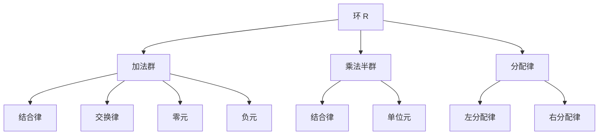
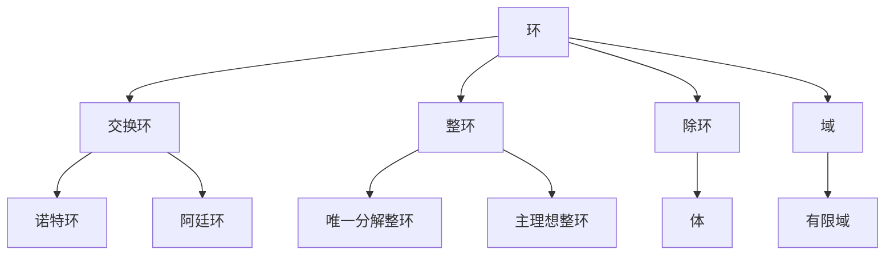
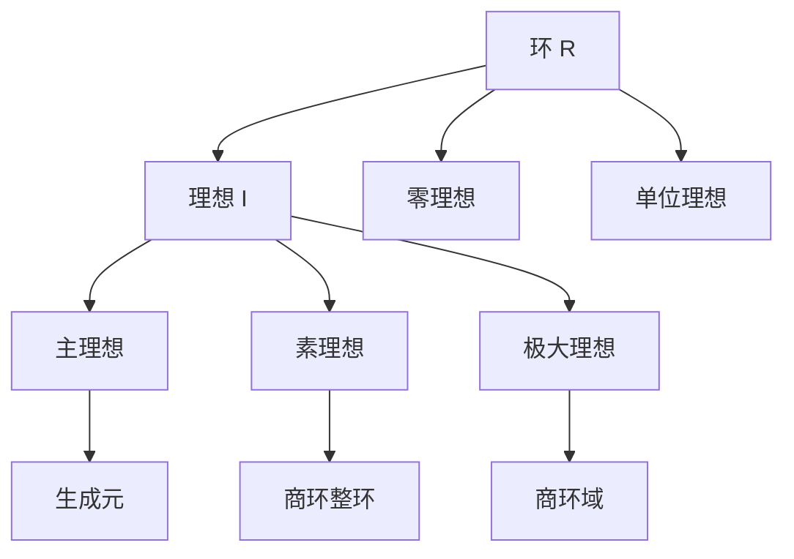

# 环论 - 增强版

## 📚 概述

环论是抽象代数学的重要分支，研究具有两种运算（加法和乘法）的代数结构。环的概念统一了数论、代数几何、表示论等众多数学领域，是现代代数学的基础理论之一。

## 🕰️ 历史发展脉络

### 早期发展 (1800-1900)

#### 数论背景

- **1801年**: 高斯《算术研究》奠定数论基础
- **1847年**: 库默尔引入理想数概念
- **1871年**: 戴德金建立理想理论

#### 代数几何背景

- **1882年**: 诺特研究代数函数域
- **1890年**: 戴德金-韦伯理论
- **1893年**: 希尔伯特零点定理

### 现代发展 (1900-1950)

#### 诺特学派

- **1921年**: 诺特建立抽象环论
- **1927年**: 诺特环理论
- **1930年**: 阿廷环理论

#### 同调代数

- **1945年**: 卡当-艾伦伯格建立同调代数
- **1950年**: 投射模和入射模理论

### 当代发展 (1950-至今)

#### 交换代数

- **1950年代**: 格罗滕迪克代数几何
- **1960年代**: 概形理论
- **1970年代**: 局部化理论

#### 非交换代数

- **1960年代**: 非交换环论
- **1980年代**: 量子群理论
- **2000年代**: 非交换几何

## 🏗️ 核心概念

### 环的定义

```lean
-- Lean 4 形式化定义
structure Ring where
  carrier : Type
  add : carrier → carrier → carrier
  mul : carrier → carrier → carrier
  zero : carrier
  one : carrier
  neg : carrier → carrier
  
  -- 加法群公理
  add_assoc : ∀ a b c, add (add a b) c = add a (add b c)
  add_comm : ∀ a b, add a b = add b a
  add_zero : ∀ a, add a zero = a
  add_neg : ∀ a, add a (neg a) = zero
  
  -- 乘法公理
  mul_assoc : ∀ a b c, mul (mul a b) c = mul a (mul b c)
  mul_one : ∀ a, mul a one = a
  one_mul : ∀ a, mul one a = a
  
  -- 分配律
  left_distrib : ∀ a b c, mul a (add b c) = add (mul a b) (mul a c)
  right_distrib : ∀ a b c, mul (add a b) c = add (mul a c) (mul b c)
```

### 基本性质

#### 1. 加法群性质

- 结合律：$(a + b) + c = a + (b + c)$
- 交换律：$a + b = b + a$
- 零元：$a + 0 = 0 + a = a$
- 负元：$a + (-a) = (-a) + a = 0$

#### 2. 乘法性质

- 结合律：$(a \cdot b) \cdot c = a \cdot (b \cdot c)$
- 单位元：$a \cdot 1 = 1 \cdot a = a$

#### 3. 分配律

- 左分配律：$a \cdot (b + c) = a \cdot b + a \cdot c$
- 右分配律：$(a + b) \cdot c = a \cdot c + b \cdot c$

## 📊 可视化图表

### 环的结构图



### 环的类型关系图



### 理想关系图



## 🔍 实例表征

### 1. 数系环实例

#### 整数环 (ℤ, +, ×)

```haskell
-- Haskell 实现
data IntegerRing = IntegerRing { value :: Integer }

instance Ring IntegerRing where
  zero = IntegerRing 0
  one = IntegerRing 1
  neg (IntegerRing x) = IntegerRing (-x)
  
  add (IntegerRing x) (IntegerRing y) = IntegerRing (x + y)
  mul (IntegerRing x) (IntegerRing y) = IntegerRing (x * y)
```

#### 多项式环 ℤ[x]

```rust
// Rust 实现
#[derive(Debug, Clone)]
pub struct Polynomial {
    coefficients: Vec<i32>,
}

impl Polynomial {
    pub fn new(coefficients: Vec<i32>) -> Self {
        Polynomial { coefficients }
    }
    
    pub fn add(&self, other: &Polynomial) -> Polynomial {
        let max_len = std::cmp::max(self.coefficients.len(), other.coefficients.len());
        let mut result = vec![0; max_len];
        
        for i in 0..max_len {
            let a = if i < self.coefficients.len() { self.coefficients[i] } else { 0 };
            let b = if i < other.coefficients.len() { other.coefficients[i] } else { 0 };
            result[i] = a + b;
        }
        
        Polynomial::new(result)
    }
    
    pub fn mul(&self, other: &Polynomial) -> Polynomial {
        let mut result = vec![0; self.coefficients.len() + other.coefficients.len() - 1];
        
        for i in 0..self.coefficients.len() {
            for j in 0..other.coefficients.len() {
                result[i + j] += self.coefficients[i] * other.coefficients[j];
            }
        }
        
        Polynomial::new(result)
    }
}
```

### 2. 矩阵环实例

#### 矩阵环 Mₙ(ℝ)

```lean
-- Lean 4 实现
structure MatrixRing (n : ℕ) where
  entries : Fin n → Fin n → ℝ

def matrix_add (A B : MatrixRing n) : MatrixRing n :=
  ⟨fun i j => A.entries i j + B.entries i j⟩

def matrix_mul (A B : MatrixRing n) : MatrixRing n :=
  ⟨fun i j => ∑ k, A.entries i k * B.entries k j⟩

def matrix_zero : MatrixRing n :=
  ⟨fun i j => 0⟩

def matrix_one : MatrixRing n :=
  ⟨fun i j => if i = j then 1 else 0⟩
```

### 3. 重要环类

#### 有限环

```haskell
-- 有限环 ℤ/nℤ
newtype FiniteRing n = FiniteRing { value :: Int }

instance (KnownNat n) => Ring (FiniteRing n) where
  zero = FiniteRing 0
  one = FiniteRing 1
  neg (FiniteRing x) = FiniteRing (mod (-x) n)
  
  add (FiniteRing x) (FiniteRing y) = FiniteRing (mod (x + y) n)
  mul (FiniteRing x) (FiniteRing y) = FiniteRing (mod (x * y) n)
```

#### 函数环

```rust
// 函数环 C[0,1]
pub struct FunctionRing {
    functions: Vec<Box<dyn Fn(f64) -> f64>>,
}

impl FunctionRing {
    pub fn new() -> Self {
        FunctionRing { functions: Vec::new() }
    }
    
    pub fn add_functions(&self, f: Box<dyn Fn(f64) -> f64>, g: Box<dyn Fn(f64) -> f64>) 
        -> Box<dyn Fn(f64) -> f64> {
        Box::new(move |x| f(x) + g(x))
    }
    
    pub fn mul_functions(&self, f: Box<dyn Fn(f64) -> f64>, g: Box<dyn Fn(f64) -> f64>) 
        -> Box<dyn Fn(f64) -> f64> {
        Box::new(move |x| f(x) * g(x))
    }
}
```

## 🧠 思维过程表征

### 1. 环论问题解决流程

#### 步骤1：识别环结构

```text
问题 → 识别运算 → 验证环公理 → 确定环类型
```

#### 步骤2：分析环性质

```text
环结构 → 理想分析 → 商环分析 → 同态分析
```

#### 步骤3：应用环论工具

```text
环性质 → 诺特环理论 → 局部化理论 → 同调代数
```

### 2. 证明思维过程

#### 诺特环性质证明

```text
1. 定义诺特环
2. 证明理想升链条件
3. 证明有限生成条件
4. 得出等价性
```

#### 素理想性质证明

```text
1. 定义素理想
2. 证明商环整环
3. 证明零因子性质
4. 得出特征性质
```

### 3. 概念理解步骤

#### 理解环的概念

```text
1. 加法群结构
2. 乘法半群结构
3. 分配律联系
4. 具体实例验证
```

#### 理解理想概念

```text
1. 加法子群
2. 乘法吸收性
3. 理想运算
4. 商环构造
```

## 🌍 应用场景表征

### 1. 数论应用

#### 代数数论

- **代数整数环**: 数域中的整数
- **理想类群**: 代数数域的结构
- **类域论**: 阿贝尔扩张理论

#### 解析数论

- **L函数**: 环上的函数
- **模形式**: 环上的形式
- **椭圆曲线**: 环上的曲线

### 2. 代数几何应用

#### 概形理论

```haskell
-- 概形上的环
data Scheme = Scheme {
    ring :: Ring,
    topology :: Topology,
    sheaf :: Sheaf
}

-- 仿射概形
data AffineScheme = AffineScheme {
    coordinate_ring :: Ring,
    spectrum :: Set (PrimeIdeal Ring)
}
```

#### 上同调理论

- **Čech上同调**: 环的上同调
- **导出函子**: 环的导出理论
- **局部化**: 环的局部性质

### 3. 表示论应用

#### 群表示论

```rust
// 群环
pub struct GroupRing<G, R> {
    group: G,
    ring: R,
    elements: Vec<(G, R)>,
}

impl<G, R> GroupRing<G, R> {
    pub fn new(group: G, ring: R) -> Self {
        GroupRing {
            group,
            ring,
            elements: Vec::new(),
        }
    }
    
    pub fn add_elements(&mut self, g: G, r: R) {
        self.elements.push((g, r));
    }
}
```

#### 李代数表示

- **包络代数**: 李代数的环结构
- **表示环**: 表示的环结构
- **特征标环**: 特征标的环结构

### 4. 计算机科学应用

#### 密码学应用

```haskell
-- 椭圆曲线环
data EllipticCurveRing = ECRing {
    curve :: EllipticCurve,
    base_field :: FiniteField,
    point_group :: Group ECPoint
}

-- 格密码学
data LatticeRing = LatticeRing {
    basis :: Matrix Integer,
    dimension :: Int,
    modulus :: Integer
}
```

#### 编码理论

- **多项式环**: 循环码
- **有限环**: 线性码
- **代数几何码**: 代数曲线

### 5. 物理应用

#### 量子力学

- **算子环**: 量子算子的环结构
- **C*代数**: 量子力学的代数结构
- **冯·诺依曼代数**: 量子系统的代数

#### 规范理论

- **规范群环**: 规范变换的环
- **纤维丛环**: 纤维丛的环结构
- **拓扑量子场论**: 拓扑不变量

## 🔗 知识关联网络

### 与其他数学分支的联系

#### 与群论的联系

- 环的加法群
- 环的单位群
- 环的自同构群

#### 与线性代数的联系

- 矩阵环
- 线性变换环
- 向量空间环

#### 与拓扑学的联系

- 连续函数环
- 拓扑环
- 同调环

### 理论发展脉络

#### 从具体到抽象

```text
数环 → 多项式环 → 抽象环 → 范畴论
```

#### 从交换到非交换

```text
交换环 → 非交换环 → 量子环 → 非交换几何
```

#### 从有限到无限

```text
有限环 → 无限环 → 拓扑环 → 函数环
```

## 📈 现代发展前沿

### 1. 非交换代数

- **量子群**: 非交换环结构
- **非交换几何**: 几何的非交换推广
- **算子代数**: 无限维环理论

### 2. 同调代数

- **导出范畴**: 环的导出理论
- **模型范畴**: 环的模型结构
- **稳定同伦论**: 环的稳定理论

### 3. 代数几何

- **概形理论**: 环的几何化
- **上同调理论**: 环的拓扑化
- **模空间**: 环的参数化

### 4. 数论几何

- **算术几何**: 环的算术性质
- **p进几何**: 环的p进理论
- **朗兰兹纲领**: 环的表示论

## 🎯 学习路径建议

### 初学者路径

1. **基础概念**: 环的定义和基本性质
2. **重要例子**: 整数环、多项式环、矩阵环
3. **基本定理**: 诺特环理论、素理想理论
4. **应用实例**: 数论、代数几何

### 进阶路径

1. **同调代数**: 环的同调理论
2. **代数几何**: 环的几何化
3. **表示论**: 环的表示理论
4. **现代应用**: 密码学、物理应用

### 研究路径

1. **前沿理论**: 非交换代数、同调代数
2. **交叉应用**: 代数几何、数论几何
3. **计算代数**: 算法和软件
4. **开放问题**: 未解决的环论问题

## 🌟 总结

环论作为现代代数学的基础，不仅提供了统一的代数结构，还在各个领域发挥着重要作用。从基础的数论研究到前沿的非交换几何，环论的发展展现了数学的深刻性和普适性。

通过多表征的学习方法，我们可以从不同角度理解环论：

- **历史角度**: 了解环论的发展历程
- **结构角度**: 掌握环的基本性质
- **应用角度**: 认识环论的实际价值
- **发展角度**: 关注环论的现代发展

环论将继续在数学和其他科学领域发挥重要作用，为人类认识世界提供强大的工具。

---

**相关文档**:

- [群论-增强版](01-群论-增强版.md)
- [域论-增强版](03-域论-增强版.md)
- [模论-增强版](04-模论-增强版.md)
- [李代数-增强版](05-李代数-增强版.md)
- [代数几何-增强版](../04-几何学/05-代数几何-增强版.md)
- [同调代数-高级主题](../11-高级数学/同调代数-高级主题.md)
