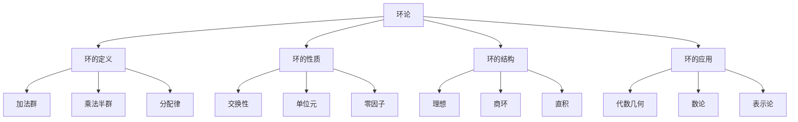
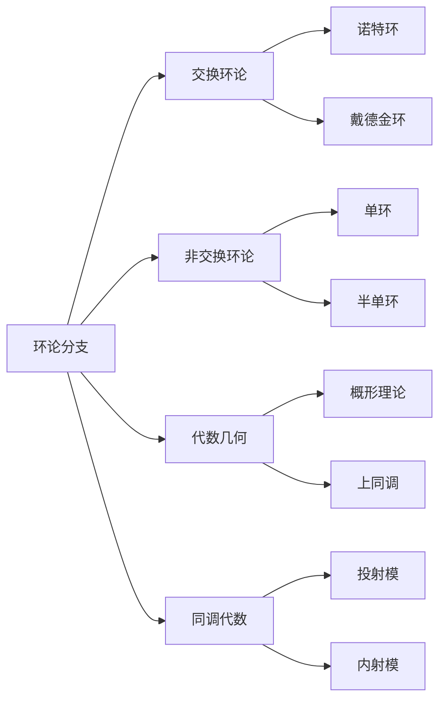
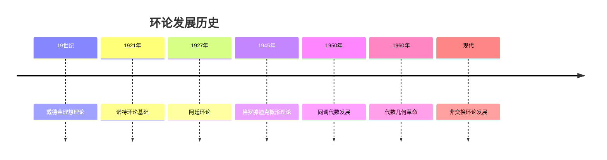
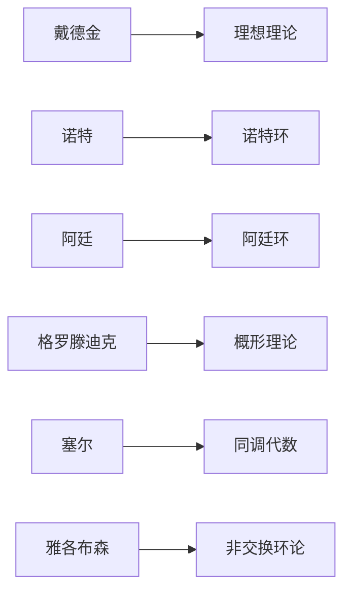
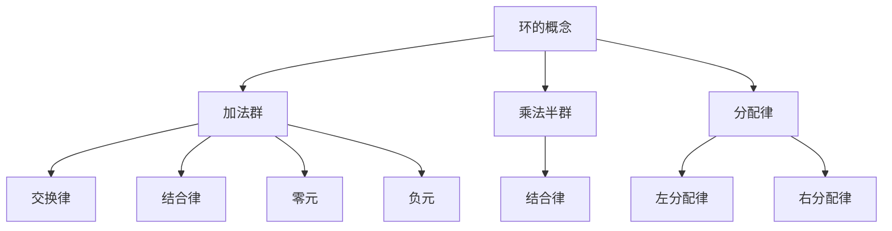
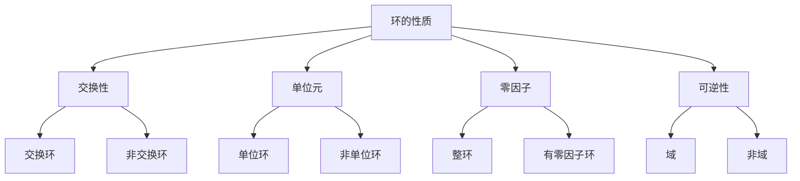
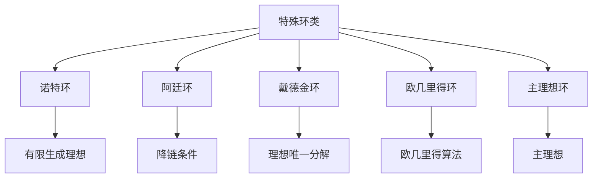
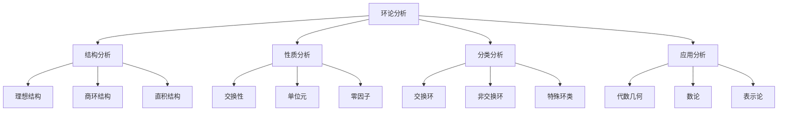
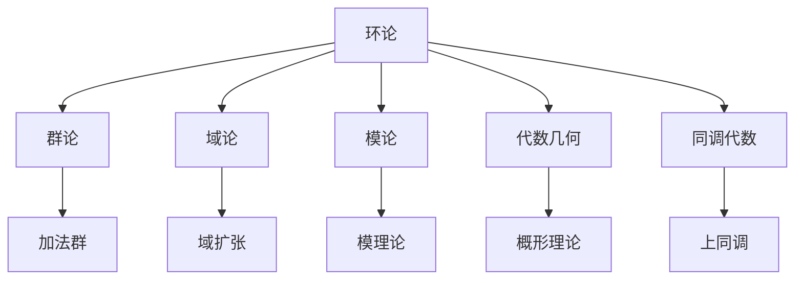

# 2. 环论 / Ring Theory

## 目录

- [2. 环论 / Ring Theory](#2-环论--ring-theory)
  - [目录](#目录)
  - [2.1 概述 / Overview](#21-概述--overview)
    - [2.1.1 环论概念体系](#211-环论概念体系)
    - [2.1.2 环论分支体系](#212-环论分支体系)
  - [2.2 历史发展 / Historical Development](#22-历史发展--historical-development)
    - [2.2.1 环论发展时间线](#221-环论发展时间线)
    - [2.2.2 重要人物贡献](#222-重要人物贡献)
    - [2.2.3 理论发展脉络](#223-理论发展脉络)
  - [2.3 基本概念 / Basic Concepts](#23-基本概念--basic-concepts)
    - [2.3.1 环的定义](#231-环的定义)
    - [2.3.2 环的表示方法](#232-环的表示方法)
    - [2.3.3 环的基本性质](#233-环的基本性质)
  - [2.4 环的性质 / Ring Properties](#24-环的性质--ring-properties)
    - [2.4.1 交换环](#241-交换环)
    - [2.4.2 单位环](#242-单位环)
    - [2.4.3 整环](#243-整环)
    - [2.4.4 环的性质总结](#244-环的性质总结)
  - [2.5 理想理论 / Ideal Theory](#25-理想理论--ideal-theory)
    - [2.5.1 理想定义](#251-理想定义)
    - [2.5.2 主理想](#252-主理想)
    - [2.5.3 素理想](#253-素理想)
    - [2.5.4 极大理想](#254-极大理想)
  - [2.6 商环与同态 / Quotient Rings and Homomorphisms](#26-商环与同态--quotient-rings-and-homomorphisms)
    - [2.6.1 商环](#261-商环)
    - [2.6.2 环同态](#262-环同态)
    - [2.6.3 同态基本定理](#263-同态基本定理)
  - [2.7 多项式环 / Polynomial Rings](#27-多项式环--polynomial-rings)
    - [2.7.1 多项式环定义](#271-多项式环定义)
    - [2.7.2 多项式运算](#272-多项式运算)
    - [2.7.3 多项式环的性质](#273-多项式环的性质)
  - [2.8 特殊环类 / Special Ring Classes](#28-特殊环类--special-ring-classes)
    - [2.8.1 诺特环](#281-诺特环)
    - [2.8.2 阿廷环](#282-阿廷环)
    - [2.8.3 戴德金环](#283-戴德金环)
    - [2.8.4 特殊环类总结](#284-特殊环类总结)
  - [2.9 应用实例 / Application Examples](#29-应用实例--application-examples)
    - [2.9.1 代数应用](#291-代数应用)
    - [2.9.2 几何应用](#292-几何应用)
    - [2.9.3 物理学应用](#293-物理学应用)
    - [2.9.4 计算机科学应用](#294-计算机科学应用)
  - [2.10 思维过程 / Thinking Process](#210-思维过程--thinking-process)
    - [2.10.1 环论分析思维](#2101-环论分析思维)
    - [2.10.2 环构造思维](#2102-环构造思维)
    - [2.10.3 环应用思维](#2103-环应用思维)
  - [2.11 总结 / Summary](#211-总结--summary)
    - [2.11.1 核心要点](#2111-核心要点)
    - [2.11.2 知识关联](#2112-知识关联)
    - [2.11.3 进一步学习](#2113-进一步学习)

## 2.1 概述 / Overview

环论是抽象代数的重要分支，研究具有两个二元运算的代数结构。环的概念统一了数学中许多重要的代数系统。

### 2.1.1 环论概念体系

### 2.1.2 环论分支体系

## 2.2 历史发展 / Historical Development

### 2.2.1 环论发展时间线

### 2.2.2 重要人物贡献

### 2.2.3 理论发展脉络

**阶段 1** (19世纪)：理想理论

- 戴德金建立理想理论
- 代数数论中的理想
- 戴德金环的概念

**阶段 2** (1920-1940)：诺特时代

- 诺特建立环论基础
- 阿廷环论发展
- 同调代数萌芽

**阶段 3** (1940-1960)：代数几何

- 格罗滕迪克概形理论
- 塞尔同调代数
- 代数几何革命

**阶段 4** (1960-至今)：现代发展

- 非交换环论发展
- 表示论应用
- 环论在多个领域的应用

## 2.3 基本概念 / Basic Concepts

### 2.3.1 环的定义

**定义 2.1** (环 / Ring)
环是一个集合 $R$ 连同两个二元运算 $+$ 和 $\cdot$，满足以下公理：

1. **加法群**：$(R, +)$ 是阿贝尔群
2. **乘法半群**：$(R, \cdot)$ 是半群
3. **分配律**：$\forall a, b, c \in R$：
   - $a \cdot (b + c) = a \cdot b + a \cdot c$
   - $(a + b) \cdot c = a \cdot c + b \cdot c$

**形式化定义**：
$$
(R, +, \cdot) \text{ 是环 } \Leftrightarrow \begin{cases}
(R, +) \text{ 是阿贝尔群} \\
(R, \cdot) \text{ 是半群} \\
\forall a, b, c \in R, a \cdot (b + c) = a \cdot b + a \cdot c \\
\forall a, b, c \in R, (a + b) \cdot c = a \cdot c + b \cdot c
\end{cases}
$$

**概念图示**：

### 2.3.2 环的表示方法

**方法 1**：运算表
对于有限环，可以用运算表表示。

**方法 2**：生成元表示
用生成元和关系表示环：
$$\mathbb{Z}[x]/(x^2 + 1)$$

**方法 3**：构造方法
通过已知环构造新环。

**实例 2.1** (环实例)

- 整数环：$(\mathbb{Z}, +, \cdot)$
- 多项式环：$(\mathbb{Z}[x], +, \cdot)$
- 矩阵环：$(M_n(\mathbb{R}), +, \cdot)$
- 模 $n$ 环：$(\mathbb{Z}_n, +, \cdot)$

### 2.3.3 环的基本性质

**定理 2.1** (环的基本性质)
设 $R$ 为环，则：

1. $0 \cdot a = a \cdot 0 = 0$
2. $(-a) \cdot b = a \cdot (-b) = -(a \cdot b)$
3. $(-a) \cdot (-b) = a \cdot b$

**实例 2.2** (环性质验证)
在环 $(\mathbb{Z}, +, \cdot)$ 中：

- 加法单位元：$0$
- 乘法单位元：$1$
- 分配律：$a \cdot (b + c) = a \cdot b + a \cdot c$

## 2.4 环的性质 / Ring Properties

### 2.4.1 交换环

**定义 2.2** (交换环 / Commutative Ring)
环 $R$ 是交换环，当且仅当：
$$\forall a, b \in R, a \cdot b = b \cdot a$$

**实例 2.3** (交换环)

- $(\mathbb{Z}, +, \cdot)$ 是交换环
- $(\mathbb{R}, +, \cdot)$ 是交换环
- $(\mathbb{Z}[x], +, \cdot)$ 是交换环

**反例 2.1** (非交换环)

- 矩阵环 $M_n(\mathbb{R})$ 不是交换环（$n > 1$）
- 四元数环不是交换环

### 2.4.2 单位环

**定义 2.3** (单位环 / Ring with Unity)
环 $R$ 是单位环，当且仅当存在乘法单位元 $1 \in R$，使得：
$$\forall a \in R, 1 \cdot a = a \cdot 1 = a$$

**实例 2.4** (单位环)

- $(\mathbb{Z}, +, \cdot)$ 是单位环
- $(\mathbb{R}, +, \cdot)$ 是单位环
- $(\mathbb{Z}_n, +, \cdot)$ 是单位环

**反例 2.2** (非单位环)

- 偶数环 $2\mathbb{Z}$ 不是单位环

### 2.4.3 整环

**定义 2.4** (整环 / Integral Domain)
交换单位环 $R$ 是整环，当且仅当：
$$\forall a, b \in R, a \cdot b = 0 \rightarrow a = 0 \vee b = 0$$

**实例 2.5** (整环)

- $(\mathbb{Z}, +, \cdot)$ 是整环
- $(\mathbb{R}, +, \cdot)$ 是整环
- $(\mathbb{Z}[x], +, \cdot)$ 是整环

**反例 2.3** (非整环)

- $(\mathbb{Z}_6, +, \cdot)$ 不是整环（$2 \cdot 3 = 0$）

### 2.4.4 环的性质总结

## 2.5 理想理论 / Ideal Theory

### 2.5.1 理想定义

**定义 2.5** (理想 / Ideal)
环 $R$ 的子集 $I$ 是理想，当且仅当：

1. $I$ 是加法子群
2. $\forall a \in I, \forall r \in R, ra \in I$（左理想）
3. $\forall a \in I, \forall r \in R, ar \in I$（右理想）

**实例 2.6** (理想实例)

- $\{0\}$ 是任何环的零理想
- $R$ 是任何环的单位理想
- $n\mathbb{Z}$ 是 $\mathbb{Z}$ 的理想
- $(x^2 + 1)$ 是 $\mathbb{R}[x]$ 的理想

### 2.5.2 主理想

**定义 2.6** (主理想 / Principal Ideal)
由单个元素生成的理想称为主理想：
$$\langle a \rangle = \{ra : r \in R\}$$

**实例 2.7** (主理想)

- $\langle 2 \rangle = 2\mathbb{Z}$ 是 $\mathbb{Z}$ 的主理想
- $\langle x \rangle = \{f(x) \cdot x : f(x) \in \mathbb{R}[x]\}$ 是 $\mathbb{R}[x]$ 的主理想

### 2.5.3 素理想

**定义 2.7** (素理想 / Prime Ideal)
理想 $P$ 是素理想，当且仅当：
$$\forall a, b \in R, ab \in P \rightarrow a \in P \vee b \in P$$

**实例 2.8** (素理想)

- $(p)$ 是 $\mathbb{Z}$ 的素理想（$p$ 是素数）
- $(x - a)$ 是 $\mathbb{R}[x]$ 的素理想

### 2.5.4 极大理想

**定义 2.8** (极大理想 / Maximal Ideal)
理想 $M$ 是极大理想，当且仅当 $M \neq R$ 且不存在理想 $I$ 使得 $M \subsetneq I \subsetneq R$。

**实例 2.9** (极大理想)

- $(p)$ 是 $\mathbb{Z}$ 的极大理想（$p$ 是素数）
- $(x - a)$ 是 $\mathbb{R}[x]$ 的极大理想

## 2.6 商环与同态 / Quotient Rings and Homomorphisms

### 2.6.1 商环

**定义 2.9** (商环 / Quotient Ring)
设 $I$ 是环 $R$ 的理想，商环 $R/I$ 定义为：
$$R/I = \{a + I : a \in R\}$$

其中运算定义为：

- $(a + I) + (b + I) = (a + b) + I$
- $(a + I) \cdot (b + I) = (ab) + I$

**实例 2.10** (商环)

- $\mathbb{Z}/n\mathbb{Z} = \mathbb{Z}_n$
- $\mathbb{R}[x]/(x^2 + 1) \cong \mathbb{C}$

### 2.6.2 环同态

**定义 2.10** (环同态 / Ring Homomorphism)
设 $R, S$ 为环，映射 $\phi: R \rightarrow S$ 是同态，当且仅当：
$$
\forall a, b \in R, \begin{cases}
\phi(a + b) = \phi(a) + \phi(b) \\
\phi(a \cdot b) = \phi(a) \cdot \phi(b)
\end{cases}
$$

**实例 2.11** (环同态)

- $\phi: \mathbb{Z} \rightarrow \mathbb{Z}_n, \phi(k) = k \bmod n$
- $\phi: \mathbb{R}[x] \rightarrow \mathbb{R}, \phi(f(x)) = f(0)$

### 2.6.3 同态基本定理

**定理 2.2** (环同态基本定理 / First Isomorphism Theorem for Rings)
设 $\phi: R \rightarrow S$ 是环同态，则：
$$R/\ker \phi \cong \text{im} \phi$$

**实例 2.12** (同态基本定理应用)
同态 $\phi: \mathbb{Z} \rightarrow \mathbb{Z}_n, \phi(k) = k \bmod n$：

- $\ker \phi = n\mathbb{Z}$
- $\text{im} \phi = \mathbb{Z}_n$
- $\mathbb{Z}/n\mathbb{Z} \cong \mathbb{Z}_n$

## 2.7 多项式环 / Polynomial Rings

### 2.7.1 多项式环定义

**定义 2.11** (多项式环 / Polynomial Ring)
设 $R$ 为环，$R$ 上的多项式环 $R[x]$ 定义为：
$$R[x] = \{a_n x^n + a_{n-1} x^{n-1} + \cdots + a_1 x + a_0 : a_i \in R\}$$

**实例 2.13** (多项式环)

- $\mathbb{Z}[x]$：整数系数多项式环
- $\mathbb{R}[x]$：实数系数多项式环
- $\mathbb{Z}_n[x]$：模 $n$ 多项式环

### 2.7.2 多项式运算

**定义 2.12** (多项式运算)
设 $f(x) = \sum_{i=0}^n a_i x^i, g(x) = \sum_{i=0}^m b_i x^i$：

- 加法：$(f + g)(x) = \sum_{i=0}^{\max(n,m)} (a_i + b_i) x^i$
- 乘法：$(f \cdot g)(x) = \sum_{k=0}^{n+m} (\sum_{i+j=k} a_i b_j) x^k$

**实例 2.14** (多项式运算)
设 $f(x) = x^2 + 1, g(x) = x + 2$：

- $(f + g)(x) = x^2 + x + 3$
- $(f \cdot g)(x) = x^3 + 2x^2 + x + 2$

### 2.7.3 多项式环的性质

**定理 2.3** (多项式环性质)
设 $R$ 为环：

1. 如果 $R$ 是交换环，则 $R[x]$ 是交换环
2. 如果 $R$ 是单位环，则 $R[x]$ 是单位环
3. 如果 $R$ 是整环，则 $R[x]$ 是整环

## 2.8 特殊环类 / Special Ring Classes

### 2.8.1 诺特环

**定义 2.13** (诺特环 / Noetherian Ring)
环 $R$ 是诺特环，当且仅当 $R$ 的每个理想都是有限生成的。

**实例 2.15** (诺特环)

- $\mathbb{Z}$ 是诺特环
- $\mathbb{R}[x]$ 是诺特环
- 有限环是诺特环

### 2.8.2 阿廷环

**定义 2.14** (阿廷环 / Artinian Ring)
环 $R$ 是阿廷环，当且仅当 $R$ 满足降链条件。

**实例 2.16** (阿廷环)

- 有限环是阿廷环
- $\mathbb{Z}/n\mathbb{Z}$ 是阿廷环

### 2.8.3 戴德金环

**定义 2.15** (戴德金环 / Dedekind Ring)
整环 $R$ 是戴德金环，当且仅当 $R$ 的每个非零理想都可以唯一分解为素理想的乘积。

**实例 2.17** (戴德金环)

- $\mathbb{Z}$ 是戴德金环
- 代数数域的整数环是戴德金环

### 2.8.4 特殊环类总结

## 2.9 应用实例 / Application Examples

### 2.9.1 代数应用

**实例 2.18** (代数数论)
代数数论中的环：

- 代数整数环：代数数域的整数环
- 理想类群：代数数域的理想类群
- 戴德金ζ函数：基于理想理论

**实例 2.19** (代数几何)
代数几何中的环：

- 坐标环：代数簇的坐标环
- 局部环：概形的局部环
- 上同调环：代数簇的上同调环

### 2.9.2 几何应用

**实例 2.20** (微分几何)
微分几何中的环：

- 函数环：流形上的函数环
- 微分算子环：微分算子的环
- 德·拉姆上同调环：微分形式的上同调

**实例 2.21** (拓扑学)
拓扑学中的环：

- 上同调环：拓扑空间的上同调环
- K理论环：拓扑K理论环
- 配边环：配边理论环

### 2.9.3 物理学应用

**实例 2.22** (量子力学)
量子力学中的环：

- 算子环：量子算子的环
- 李代数环：李代数的包络代数
- 表示环：群表示的环

**实例 2.23** (规范场论)
规范场论中的环：

- 规范代数：规范变换的代数
- 杨-米尔斯理论：基于李代数环
- 超对称代数：超对称变换的代数

### 2.9.4 计算机科学应用

**实例 2.24** (密码学)
密码学中的环：

- 有限域环：椭圆曲线密码
- 多项式环：格密码
- 理想格：基于理想格的密码

**实例 2.25** (编码理论)
编码理论中的环：

- 多项式环：循环码
- 有限域环：BCH码
- 代数几何码：基于代数几何的码

## 2.10 思维过程 / Thinking Process

### 2.10.1 环论分析思维

### 2.10.2 环构造思维

**环构造步骤**：

1. **明确需求**：确定需要什么样的环
2. **选择结构**：选择合适的环结构
3. **验证公理**：验证环公理
4. **分析性质**：分析环的性质
5. **应用拓展**：在其他领域中的应用

### 2.10.3 环应用思维

**环应用过程**：

1. **问题建模**：将实际问题转化为环论问题
2. **环选择**：选择合适的环
3. **性质分析**：分析环的性质
4. **结果解释**：解释环论结果的意义
5. **验证改进**：验证结果的合理性

## 2.11 总结 / Summary

### 2.11.1 核心要点

- 环是抽象代数的重要结构
- 环论统一了数学中的代数系统
- 环论在各个领域都有重要应用
- 环论为现代数学提供了重要工具

### 2.11.2 知识关联

### 2.11.3 进一步学习

- 深入学习域论和模论
- 研究代数几何
- 探索同调代数
- 学习非交换环论

---

*本文档展示了环论的多表征方式，包括符号表征、图表表征、实例表征、历史发展表征、应用场景表征和思维过程表征，为深入理解环论提供了全面的视角。*
