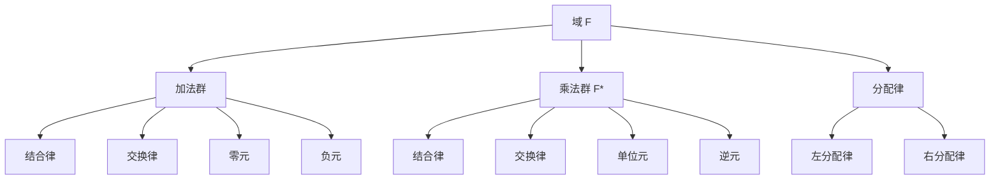
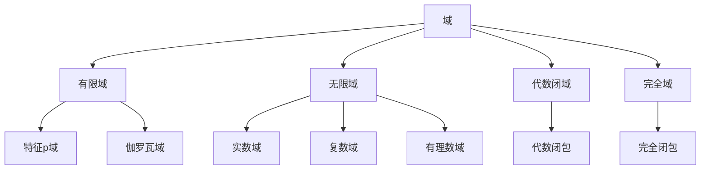
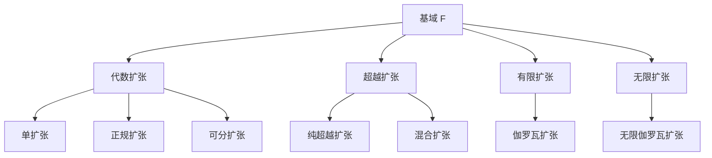

# 域论 - 增强版

## 📚 概述

域论是抽象代数学的核心分支，研究具有除法运算的代数结构。域的概念统一了数论、代数几何、伽罗瓦理论等众多数学领域，是现代代数学的基础理论之一。

## 🕰️ 历史发展脉络

### 早期发展 (1800-1900)

#### 数论背景

- **1801年**: 高斯《算术研究》研究二次域
- **1847年**: 库默尔研究分圆域
- **1871年**: 戴德金建立理想理论

#### 代数方程背景

- **1824年**: 阿贝尔证明五次方程不可解
- **1832年**: 伽罗瓦建立伽罗瓦理论
- **1846年**: 刘维尔发表伽罗瓦论文

### 现代发展 (1900-1950)

#### 抽象域论

- **1910年**: 施泰尼茨建立域论基础
- **1920年**: 阿廷发展伽罗瓦理论
- **1930年**: 范德瓦尔登《现代代数》

#### 代数几何背景

- **1882年**: 诺特研究代数函数域
- **1890年**: 戴德金-韦伯理论
- **1920年**: 扎里斯基代数几何

### 当代发展 (1950-至今)

#### 代数数论

- **1950年代**: 类域论发展
- **1960年代**: 朗兰兹纲领
- **1970年代**: 椭圆曲线理论

#### 代数几何

- **1960年代**: 格罗滕迪克概形理论
- **1970年代**: 德利涅上同调
- **1980年代**: 莫德尔-朗兰兹纲领

## 🏗️ 核心概念

### 域的定义

```lean
-- Lean 4 形式化定义
structure Field where
  carrier : Type
  add : carrier → carrier → carrier
  mul : carrier → carrier → carrier
  zero : carrier
  one : carrier
  neg : carrier → carrier
  inv : carrier → carrier
  
  -- 加法群公理
  add_assoc : ∀ a b c, add (add a b) c = add a (add b c)
  add_comm : ∀ a b, add a b = add b a
  add_zero : ∀ a, add a zero = a
  add_neg : ∀ a, add a (neg a) = zero
  
  -- 乘法群公理（非零元素）
  mul_assoc : ∀ a b c, mul (mul a b) c = mul a (mul b c)
  mul_comm : ∀ a b, mul a b = mul b a
  mul_one : ∀ a, mul a one = a
  mul_inv : ∀ a, a ≠ zero → mul a (inv a) = one
  
  -- 分配律
  left_distrib : ∀ a b c, mul a (add b c) = add (mul a b) (mul a c)
  right_distrib : ∀ a b c, mul (add a b) c = add (mul a c) (mul b c)
  
  -- 零元性质
  zero_mul : ∀ a, mul zero a = zero
  mul_zero : ∀ a, mul a zero = zero
```

### 基本性质

#### 1. 加法群性质

- 结合律：$(a + b) + c = a + (b + c)$
- 交换律：$a + b = b + a$
- 零元：$a + 0 = 0 + a = a$
- 负元：$a + (-a) = (-a) + a = 0$

#### 2. 乘法群性质（非零元素）

- 结合律：$(a \cdot b) \cdot c = a \cdot (b \cdot c)$
- 交换律：$a \cdot b = b \cdot a$
- 单位元：$a \cdot 1 = 1 \cdot a = a$
- 逆元：$a \cdot a^{-1} = a^{-1} \cdot a = 1$（$a \neq 0$）

#### 3. 分配律

- 左分配律：$a \cdot (b + c) = a \cdot b + a \cdot c$
- 右分配律：$(a + b) \cdot c = a \cdot c + b \cdot c$

## 📊 可视化图表

### 域的结构图



### 域的类型关系图



### 域扩张关系图



## 🔍 实例表征

### 1. 数域实例

#### 有理数域 (ℚ, +, ×)

```haskell
-- Haskell 实现
data Rational = Rational {
    numerator :: Integer,
    denominator :: Integer
}

instance Field Rational where
  zero = Rational 0 1
  one = Rational 1 1
  neg (Rational n d) = Rational (-n) d
  inv (Rational n d) = if n == 0 then error "Division by zero" else Rational d n
  
  add (Rational n1 d1) (Rational n2 d2) = 
    Rational (n1 * d2 + n2 * d1) (d1 * d2)
  
  mul (Rational n1 d1) (Rational n2 d2) = 
    Rational (n1 * n2) (d1 * d2)
```

#### 实数域 (ℝ, +, ×)

```rust
// Rust 实现
#[derive(Debug, Clone, PartialEq)]
pub struct RealField {
    value: f64,
}

impl RealField {
    pub fn new(value: f64) -> Self {
        RealField { value }
    }
    
    pub fn add(&self, other: &RealField) -> RealField {
        RealField::new(self.value + other.value)
    }
    
    pub fn mul(&self, other: &RealField) -> RealField {
        RealField::new(self.value * other.value)
    }
    
    pub fn zero() -> RealField {
        RealField::new(0.0)
    }
    
    pub fn one() -> RealField {
        RealField::new(1.0)
    }
    
    pub fn neg(&self) -> RealField {
        RealField::new(-self.value)
    }
    
    pub fn inv(&self) -> Result<RealField, &'static str> {
        if self.value == 0.0 {
            Err("Division by zero")
        } else {
            Ok(RealField::new(1.0 / self.value))
        }
    }
}
```

#### 复数域 (ℂ, +, ×)

```lean
-- Lean 4 实现
structure ComplexField where
  real : ℝ
  imag : ℝ

def add (a b : ComplexField) : ComplexField :=
  ⟨a.real + b.real, a.imag + b.imag⟩

def mul (a b : ComplexField) : ComplexField :=
  ⟨a.real * b.real - a.imag * b.imag, a.real * b.imag + a.imag * b.real⟩

def zero : ComplexField := ⟨0, 0⟩

def one : ComplexField := ⟨1, 0⟩

def neg (a : ComplexField) : ComplexField :=
  ⟨-a.real, -a.imag⟩

def inv (a : ComplexField) : ComplexField :=
  let norm := a.real^2 + a.imag^2
  ⟨a.real / norm, -a.imag / norm⟩
```

### 2. 有限域实例

#### 有限域 GF(p)

```haskell
-- 有限域 GF(p)
newtype FiniteField p = FiniteField { value :: Integer }

instance (KnownNat p) => Field (FiniteField p) where
  zero = FiniteField 0
  one = FiniteField 1
  neg (FiniteField x) = FiniteField (mod (-x) p)
  inv (FiniteField x) = FiniteField (mod_inv x p)
  
  add (FiniteField x) (FiniteField y) = FiniteField (mod (x + y) p)
  mul (FiniteField x) (FiniteField y) = FiniteField (mod (x * y) p)

-- 模逆元计算
mod_inv :: Integer -> Integer -> Integer
mod_inv a p = extended_gcd a p
  where
    extended_gcd a b
      | b == 0 = a
      | otherwise = let (d, x, y) = extended_gcd b (a `mod` b)
                    in (d, y, x - (a `div` b) * y)
```

#### 有限域 GF(2ⁿ)

```rust
// 有限域 GF(2^8) 实现
pub struct GF256 {
    value: u8,
}

impl GF256 {
    pub fn new(value: u8) -> Self {
        GF256 { value }
    }
    
    pub fn add(&self, other: &GF256) -> GF256 {
        GF256::new(self.value ^ other.value)
    }
    
    pub fn mul(&self, other: &GF256) -> GF256 {
        let mut result = 0u8;
        let mut a = self.value;
        let mut b = other.value;
        
        for _ in 0..8 {
            if b & 1 != 0 {
                result ^= a;
            }
            let carry = a & 0x80;
            a <<= 1;
            if carry != 0 {
                a ^= 0x1b; // 不可约多项式 x^8 + x^4 + x^3 + x + 1
            }
            b >>= 1;
        }
        
        GF256::new(result)
    }
    
    pub fn inv(&self) -> GF256 {
        // 使用扩展欧几里得算法计算逆元
        let mut u = 1u8;
        let mut v = 0u8;
        let mut a = self.value;
        let mut b = 0x1b; // 不可约多项式
        
        while a != 0 {
            while a & 1 == 0 {
                a >>= 1;
                if u & 1 != 0 {
                    u ^= 0x1b;
                }
                u >>= 1;
            }
            while b & 1 == 0 {
                b >>= 1;
                if v & 1 != 0 {
                    v ^= 0x1b;
                }
                v >>= 1;
            }
            if a >= b {
                a -= b;
                u ^= v;
            } else {
                b -= a;
                v ^= u;
            }
        }
        
        GF256::new(v)
    }
}
```

### 3. 函数域实例

#### 有理函数域 F(x)

```haskell
-- 有理函数域
data RationalFunction = RationalFunction {
    numerator :: Polynomial,
    denominator :: Polynomial
}

instance Field RationalFunction where
  zero = RationalFunction (Polynomial []) (Polynomial [1])
  one = RationalFunction (Polynomial [1]) (Polynomial [1])
  
  add (RationalFunction n1 d1) (RationalFunction n2 d2) =
    RationalFunction (n1 * d2 + n2 * d1) (d1 * d2)
  
  mul (RationalFunction n1 d1) (RationalFunction n2 d2) =
    RationalFunction (n1 * n2) (d1 * d2)
  
  neg (RationalFunction n d) = RationalFunction (negate n) d
  inv (RationalFunction n d) = RationalFunction d n
```

## 🧠 思维过程表征

### 1. 域论问题解决流程

#### 步骤1：识别域结构

```text
问题 → 识别运算 → 验证域公理 → 确定域类型
```

#### 步骤2：分析域性质

```text
域结构 → 子域分析 → 扩张分析 → 伽罗瓦分析
```

#### 步骤3：应用域论工具

```text
域性质 → 伽罗瓦理论 → 类域论 → 朗兰兹纲领
```

### 2. 证明思维过程

#### 伽罗瓦理论证明

```text
1. 定义伽罗瓦群
2. 建立对应关系
3. 证明基本定理
4. 得出应用结论
```

#### 有限域构造证明

```text
1. 选择不可约多项式
2. 构造扩域
3. 验证域公理
4. 计算域元素
```

### 3. 概念理解步骤

#### 理解域的概念

```text
1. 加法群结构
2. 乘法群结构
3. 分配律联系
4. 具体实例验证
```

#### 理解域扩张概念

```text
1. 基域和扩域
2. 代数元素
3. 超越元素
4. 扩张次数
```

## 🌍 应用场景表征

### 1. 数论应用

#### 1.1 代数数论

- **代数数域**: 代数整数的域
- **类域论**: 阿贝尔扩张理论
- **朗兰兹纲领**: 非阿贝尔扩张

#### 1.2 解析数论

- **L函数**: 域上的函数
- **模形式**: 域上的形式
- **椭圆曲线**: 域上的曲线

### 2. 代数几何应用

#### 概形理论

```haskell
-- 概形上的域
data Scheme = Scheme {
    field :: Field,
    topology :: Topology,
    sheaf :: Sheaf
}

-- 仿射概形
data AffineScheme = AffineScheme {
    coordinate_field :: Field,
    spectrum :: Set (PrimeIdeal Field)
}
```

#### 上同调理论

- **Čech上同调**: 域的上同调
- **导出函子**: 域的导出理论
- **局部化**: 域的局部性质

### 3. 密码学应用

#### 椭圆曲线密码学

```rust
// 椭圆曲线域
pub struct EllipticCurveField {
    field: FiniteField,
    curve: EllipticCurve,
}

impl EllipticCurveField {
    pub fn new(field: FiniteField, curve: EllipticCurve) -> Self {
        EllipticCurveField { field, curve }
    }
    
    pub fn point_addition(&self, p1: &ECPoint, p2: &ECPoint) -> ECPoint {
        // 椭圆曲线点加法
        if p1.is_infinity() {
            return p2.clone();
        }
        if p2.is_infinity() {
            return p1.clone();
        }
        
        let lambda = if p1 == p2 {
            // 切线斜率
            let numerator = 3 * p1.x * p1.x + self.curve.a;
            let denominator = 2 * p1.y;
            self.field.div(&numerator, &denominator)
        } else {
            // 连线斜率
            let numerator = p2.y - p1.y;
            let denominator = p2.x - p1.x;
            self.field.div(&numerator, &denominator)
        };
        
        let x3 = lambda * lambda - p1.x - p2.x;
        let y3 = lambda * (p1.x - x3) - p1.y;
        
        ECPoint::new(x3, y3)
    }
}
```

#### 格密码学

- **格密码**: 基于格的密码系统
- **后量子密码**: 抗量子攻击的密码
- **同态加密**: 支持计算的加密

### 4. 编码理论应用

#### 纠错码

```haskell
-- 里德-所罗门码
data ReedSolomonCode = ReedSolomonCode {
    field :: FiniteField,
    generator :: Polynomial,
    length :: Int,
    dimension :: Int
}

instance ErrorCorrectingCode ReedSolomonCode where
  encode code message = 
    let polynomial = message_to_polynomial message
        encoded = polynomial * code.generator
    in polynomial_to_vector encoded
  
  decode code received = 
    let syndrome = compute_syndrome code received
        error_locator = berlekamp_massey syndrome
        error_positions = find_roots error_locator
        corrected = correct_errors received error_positions
    in corrected
```

#### 代数几何码

- **Goppa码**: 代数曲线上的码
- **Hermite码**: 特殊曲线上的码
- **代数几何码**: 一般曲线上的码

### 5. 物理应用

#### 量子力学

- **量子场论**: 域上的量子理论
- **规范理论**: 规范群的域
- **弦论**: 高维域的理论

#### 统计物理

- **相变理论**: 域上的相变
- **临界现象**: 域上的临界点
- **重整化群**: 域上的群论

## 🔗 知识关联网络

### 与其他数学分支的联系

#### 与群论的联系

- 域的乘法群
- 域的自同构群
- 伽罗瓦群

#### 与环论的联系

- 域是特殊的环
- 域的分式域
- 域的局部化

#### 与线性代数的联系

- 域上的向量空间
- 域上的线性变换
- 域上的矩阵

### 理论发展脉络

#### 从具体到抽象

```text
数域 → 抽象域 → 函数域 → 概形
```

#### 从有限到无限

```text
有限域 → 无限域 → 拓扑域 → 函数域
```

#### 从交换到非交换

```text
交换域 → 非交换域 → 量子域 → 非交换几何
```

## 📈 现代发展前沿

### 1. 代数几何

- **概形理论**: 域的几何化
- **上同调理论**: 域的拓扑化
- **模空间**: 域的参数化

### 2. 数论几何

- **算术几何**: 域的算术性质
- **p进几何**: 域的p进理论
- **朗兰兹纲领**: 域的表示论

### 3. 非交换几何

- **量子群**: 非交换域结构
- **非交换几何**: 几何的非交换推广
- **算子代数**: 无限维域理论

### 4. 计算代数

- **符号计算**: 域上的算法
- **数值计算**: 域上的数值方法
- **密码学**: 域上的密码系统

## 🎯 学习路径建议

### 初学者路径

1. **基础概念**: 域的定义和基本性质
2. **重要例子**: 有理数域、实数域、复数域、有限域
3. **基本定理**: 伽罗瓦理论、类域论
4. **应用实例**: 数论、代数几何、密码学

### 进阶路径

1. **代数几何**: 域的几何化
2. **数论几何**: 域的算术化
3. **表示论**: 域的表示理论
4. **现代应用**: 密码学、物理应用

### 研究路径

1. **前沿理论**: 非交换几何、数论几何
2. **交叉应用**: 代数几何、表示论
3. **计算代数**: 算法和软件
4. **开放问题**: 未解决的域论问题

## 🌟 总结

域论作为现代代数学的核心，不仅提供了统一的代数结构，还在各个领域发挥着重要作用。从基础的数论研究到前沿的非交换几何，域论的发展展现了数学的深刻性和普适性。

通过多表征的学习方法，我们可以从不同角度理解域论：

- **历史角度**: 了解域论的发展历程
- **结构角度**: 掌握域的基本性质
- **应用角度**: 认识域论的实际价值
- **发展角度**: 关注域论的现代发展

域论将继续在数学和其他科学领域发挥重要作用，为人类认识世界提供强大的工具。

---

**相关文档**:

- [群论-增强版](01-群论-增强版.md)
- [环论-增强版](02-环论-增强版.md)
- [模论-增强版](04-模论-增强版.md)
- [李代数-增强版](05-李代数-增强版.md)
- [伽罗瓦理论-高级主题](../11-高级数学/伽罗瓦理论-高级主题.md)
- [代数几何-增强版](../04-几何学/05-代数几何-增强版.md)
